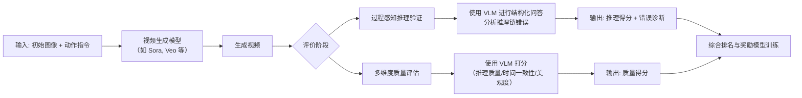

# WorldReasonBench: Human-Aligned Stress Testing of Video Generators as Future World-State Predictors

**【评测视频生成世界推理能力】**

**arXiv**: https://arxiv.org/abs/2605.10434  
**AlphaXiv**: https://www.alphaxiv.org/zh/overview/2605.10434  
**HF Paper**: https://hf-mirror.com/papers/2605.10434  
**HF Votes**: 28

## 简要摘要

*计算机视觉;视频生成;世界状态预测评测*

视频生成能力快速发展，但其作为"世界模拟器"的推理能力缺乏直接评测。
我们构建了测试视频生成世界推理能力的基准WorldReasonBench，并提出结合推理验证与质量评估的人类对齐评测方法。

## 图示

<figure style="margin:0 auto 1.5em auto; text-align:center">
  
  <figcaption style="color:#666; font-size:0.85em; margin-top:0.4em">图1：WorldReasonBench 概览。我们将视频生成器评估为世界状态预测器：给定初始视觉状态及动作或指令，模型需生成一段未来视频，其状态演化在物理、社会、逻辑和信息层面均保持一致。WorldReasonBench 涵盖四个推理维度，并细分为22个简洁的维度专属子类别，同时配备了互补的自动化评估流程与人工对齐评估流程。</figcaption>
</figure>

<figure style="margin:0 auto 1.5em auto; text-align:center">
  
  <figcaption style="color:#666; font-size:0.85em; margin-top:0.4em">图 3：评估流程。A：过程感知的推理验证，该模块根据生成的视频回答结构化问答对，并将其转化为推理阶段的诊断结果。B：多维质量评估，该模块从推理质量、时序一致性和视觉美感三个维度对每个视频进行评分，用于排序和奖励模型评估。</figcaption>
</figure>

<figure style="margin:0 auto 1.5em auto; text-align:center">
  
  <figcaption style="color:#666; font-size:0.85em; margin-top:0.4em">图2：基准构建流程。A：WorldReasonBench的构建，包括基于分类学的标注、提示生成与问答生成。B：WorldRewardBench的构建，包括视频采样、专家评分、偏好对构建以及人类对齐评估。</figcaption>
</figure>

## 深度解析

这篇论文主要研究**视频生成模型**，探讨它们是否真的能像“世界模拟器”一样，对现实世界的物理、社会、逻辑等规律进行推理。下面我用简单的语言为你梳理一下：

### 1. **任务是什么？**
- **任务输入**：一张或多张**初始图像**（表示世界的初始状态），加上一个**动作或指令**（比如“推一下球”）。
- **任务输出**：一段**生成的视频**，展示世界在接收到指令后，未来几秒内会如何演变。
- **任务功能**：测试视频生成模型是否能够**正确预测**世界状态的变化，而不仅仅是生成看起来好看的视频。

---

### 2. **想解决什么问题？**
目前，很多视频生成模型虽然能生成**视觉上逼真**的视频，但它们可能**不符合真实世界的规律**。例如：
- 一个球被推了一下，却往反方向滚动（违反物理规律）。
- 一个人把东西放在桌上，东西却消失了（违反信息保存规律）。
- 两个人对话时，表情和动作不匹配（违反社会常识）。

这篇论文想解决的问题是：**如何系统性地测试视频生成模型是否真的理解世界运作的规律**，而不仅仅是生成“看起来像”的视频。

---

### 3. **核心思路是什么？**
作者提出了两个核心工具：

**（1）WorldReasonBench（世界推理基准）**
- 这是一个包含 **436 个测试案例** 的数据集。
- 每个案例都标注了**标准答案**（Ground Truth），覆盖四个推理维度：
  - **物理规律**（例如：物体碰撞后的运动）
  - **社会常识**（例如：人的情绪反应）
  - **逻辑推理**（例如：因果关系）
  - **信息保存**（例如：物体不会凭空消失）
- 通过这些案例，可以系统地测试模型在不同维度上的推理能力。

**（2）WorldRewardBench（世界奖励基准）**
- 这是一个包含 **约6000对专家标注偏好** 的数据集。
- 专家会判断哪个视频更符合世界规律，用于训练和评估**奖励模型**（Reward Model），让模型学会生成更合理的视频。

**评价方法**：
- **过程感知推理验证**：不仅看最终答案对不对，还分析模型在推理过程中**哪一步出错了**（比如因果链断裂）。
- **多维度质量评估**：同时评价视频的**推理质量、时间一致性、视觉美观度**。

---

### 4. **结果怎么样？**
- **发现差距**：即使是最先进的视频生成模型（如 Sora、Veo），在**视觉质量**上得分很高，但在**世界推理**上仍然存在明显缺陷。
- **开源 vs 闭源模型**：闭源模型（如 Sora）整体表现更好，但开源模型在提供**提示（Hints）** 后进步更大。
- **评价方法有效**：论文提出的**过程感知评价方法**比传统的“成对比较”更符合人类判断，能更精确地定位模型的错误。

---

### 5. **模型结构/整体流程**
这篇论文**没有提出新的生成模型**，而是**建立了一个评价框架**。它的流程如下：

**流程详解**：
1. **输入**：给视频生成模型一张初始图片和一个动作指令。
2. **生成**：模型输出一段视频。
3. **评价**（核心贡献）：
   - **过程感知推理验证**：用一个强大的**视觉语言模型（VLM）**（如 GPT-4V）作为“裁判”，让它根据视频回答一系列结构化问题（这些问题来自 WorldReasonBench 的标准答案）。通过比较模型的答案和标准答案，不仅可以知道对错，还能分析是推理的**哪一步**出了问题（例如：错误理解了因果关系）。
   - **多维度质量评估**：同样用 VLM 对视频的多个方面（推理是否合理、时间上是否连贯、画面是否美观）进行打分。
4. **输出**：得到模型的**综合得分**和**详细的错误分析报告**。这些数据还可以用来训练奖励模型，指导未来的视频生成模型变得更好。

**使用的基模**：
- **视频生成模型**：Sora、Veo、Seedance 等（作为被测试对象）。
- **视觉语言模型（VLM）**：如 GPT-4V（作为“裁判”或评价工具）。

---

### **总结**
简单来说，这篇论文就像给视频生成模型设计了一套**“世界常识期末考试”**。它不再只关心视频“好不好看”，而是深入检查视频里的内容“合不合理”。通过这套严格的测试，论文发现当前最厉害的模型在理解世界规律上还有很长的路要走，并提供了一个强大的工具箱（数据集+评价方法）来推动这个领域向前发展。
