# 多模态3D：生成理解编辑全景：逐篇解析

> 当前页面按分类和时间顺序逐篇介绍论文。 [快速理解版](../) · [BibTeX 与 DBLP 查询结果](../bibliography/index.html)

## 逐篇解析

以下论文沿用快速理解版的主任务分类；每篇只出现一次，分类内按首稿时间从早到晚排列。文字为摘要级快速介绍，配图来自论文原文。

### 三维生成（generation）

#### 2023

##### Michelangelo: Conditional 3D Shape Generation based on Shape-Image-Text Aligned Latent Representation

作者：Zibo Zhao, Wen Liu, Xin Chen, Xianfang Zeng, Rui Wang, Pei Cheng, Bin Fu, Tao Chen, Gang Yu, Shenghua Gao

主任务：generation

方法标签：native_3d_latent_space

中文简介：

Michelangelo解决基于文本或图像的 conditional 3D形状生成任务，输入为2D图像或文本，输出为高质量的3D神经场。核心范式是“对齐先生成”，通过Shape-Image-Text-Aligned VAE将3D形状编码到与图像和文本对齐的潜在空间，再利用条件扩散模型在该空间中进行生成。这种方法有效 bridging 了2D/文本与3D数据分布之间的域差距。相较于直接跨模态生成，它在潜在空间的对齐机制确保了生成结果在语义上更严格地符合条件输入，提升了多样性和质量。

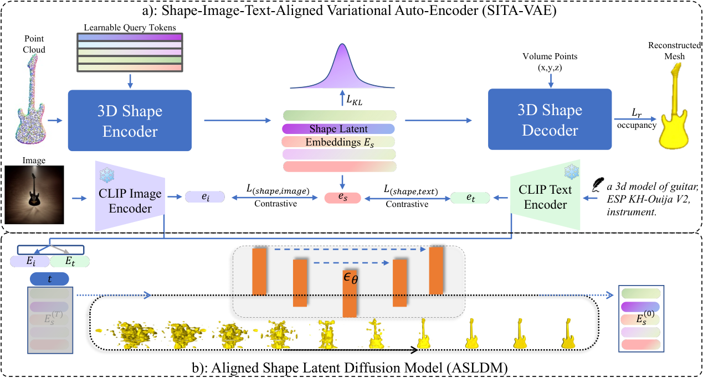

*原文 Figure 1：Figure 2 : Alignment-before-generation pipeline . Our method contains two models: the Shape-Image-Text-Aligned Variational Auto-Encoder (SITA-VAE) and the Aligned Shape Latent Diffusion Model (ASLDM). The SITA-VAE consists of four modules: an image encoder, a text encoder, a 3D shape encoder, and a 3D shape decoder. Encoders encode inputs pair into an aligned space, and the 3D shape decoder reconstructs 3D shapes given embeddings from the aligned space. The ASLDM maps the image or text condition to the aligned shape latent space for sampling a high-quality 3D shape embedding, which latterly reconstructed to high-fidelity 3D shapes by the 3D shape decoder. [查看图片来源](https://arxiv.org/html/2306.17115v2/newnetwork.png)*

引用来源：arxiv_2608.02711

链接：[arXiv](https://arxiv.org/abs/2306.17115)

##### GPT4Point: A Unified Framework for Point-Language Understanding and Generation

作者：Zhangyang Qi, Ye Fang, Zeyi Sun, Xiaoyang Wu, Tong Wu, Jiaqi Wang, Dahua Lin, Hengshuang Zhao

主任务：generation

架构标签：unified_multimodal_transformer

中文简介：

GPT4Point解决3D世界理解与生成的统一建模问题，输入为点云与文本，输出涵盖 caption、问答及可控3D生成结果。核心方法是构建点-语言多模态大模型，利用Pyramid-XL大规模数据集训练，实现从低质量点文本特征到高质量几何与颜色的生成。属于统一多模态Transformer架构，它打破了理解与生成的壁垒，相比单一任务模型，能 seamless 执行参考任务与生成任务，提升了3D语义交互能力。

*原文 Figure 8：Figure S3 : Acquire Data Pipeline from Objaverse-XL [ 11 ] . [查看图片来源](https://arxiv.org/html/2312.02980v2/sup_fig3_objaversexl_pipeline.png)*

引用来源：arxiv_2608.02711

链接：[arXiv](https://arxiv.org/abs/2312.02980)

#### 2024

##### Interactive3D: Create What You Want by Interactive 3D Generation

作者：Shaocong Dong, Lihe Ding, Zhanpeng Huang, Zibin Wang, Tianfan Xue, Dan Xu

主任务：generation

方法标签：inference_time_instance_optimization

中文简介：

Interactive3D致力于解决三维生成中用户控制力不足的问题，输入为用户的交互式操作指令，输出为符合预期的三维资产。其核心范式采用两阶段级联结构：第一阶段基于高斯泼溅允许用户进行组件增删、拖拽及语义编辑等直接交互；第二阶段通过交互式哈希细化模块将结果转化为InstantNGP以提取几何细节。该方法属于三维编辑与生成的交叉领域，区别于仅依赖文本或单张图像的被动生成，它赋予了用户在生成过程中进行精确三维空间干预的能力，实现了真正的交互式创作。

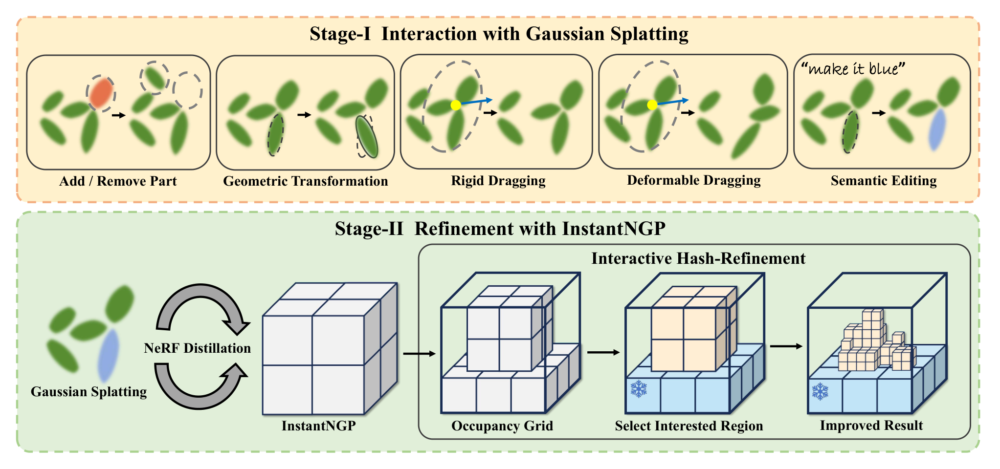

*原文 Figure 2：Figure 3 : The overall architecture of Interactive3D. It contains two stages with distinct 3D representations: (I) Gaussian Splatting for flexible user interactions such as add/remove parts, geometry transformation, deformable or rigid dragging and semantic editing; (II) the Gaussian blobs are converted to InstantNGP using NeRF distillation and fine-tuned by our Interactive Hash Refinement Module. [查看图片来源](https://arxiv.org/html/2404.16510v1/interactive3D_arc2_final.png)*

引用来源：arxiv_2608.02711

链接：[arXiv](https://arxiv.org/abs/2404.16510)

##### CLAY: A Controllable Large-scale Generative Model for Creating High-quality 3D Assets

作者：Longwen Zhang, Ziyu Wang, Qixuan Zhang, Qi-Wei Qiu, Anqi Pang, Haoran Jiang, Wei Yang, Lan Xu, Jingyi Yu

主任务：generation

方法标签：native_3d_latent_space

中文简介：

CLAY旨在从文本、图像或多视图等条件输入中生成高质量3D几何与PBR材质，输出完整的3D资产。其核心范式是基于三维原生潜空间生成，采用多分辨率VAE将3D数据压缩，并在潜空间中利用最小化的潜扩散Transformer（DiT）进行几何生成，辅以多视图材料扩散模型生成纹理。作为三维原生潜空间生成的代表，CLAY拥有15亿参数，支持多种3D感知控制信号，能够直接从大规模3D数据中提取先验，实现了从概念设计到生产级资产的可控生成，避免了逐实例优化的低效。

*原文 Figure 5：Figure 5. Our Material Diffusion architecture and Asset Enhancement pipeline. Our Material Diffusion network, derived from existing diffusion models, facilitates efficient fine-tuning. Following mesh quadrification and atlasing, it generates textures through a multi-view approach and subsequently back-projecte them onto UV maps. The resultant materials, closely aligned with geometries and user inputs (text/image), faithfully respond to diverse lighting conditions, culminating in realistic renderings. [查看图片来源](https://arxiv.org/html/2406.13897v1/fig/PBR.png)*

引用来源：arxiv_2608.02711

链接：[arXiv](https://arxiv.org/abs/2406.13897)

#### 2025

##### DeepMesh: Auto-Regressive Artist-Mesh Creation with Reinforcement Learning

作者：Ruowen Zhao, Junliang Ye, Zhengyi Wang, Guangce Liu, Yiwen Chen, Yikai Wang, Jun Zhu

主任务：generation

方法标签：mesh_tokenization_autoregressive

中文简介：

DeepMesh针对点云和图像条件生成高质量三角网格的任务。作为自回归生成模型，它通过预测离散顶点令牌构建网格。核心创新在于引入强化学习，利用结合人工评估与三维指标的评分标准收集偏好对，通过直接偏好优化（DPO）对齐人类偏好，并配合高效的分词算法与数据清洗。区别于以往自回归方法受限于面数限制和网格不完整，DeepMesh生成的网格具备更复杂的细节和精确拓扑，提升了生成质量。

*原文 Figure 1：Figure 2 : An overview of our method. DeepMesh is an auto-regressive transformer composed of both self-attention and cross-attention layers. The model is pre-trained on discrete mesh tokens generated by our improved tokenization algorithm. To further enhance the quality of results, we propose a scoring standard that combines 3D metrics with human evaluation. With this standard, we annotate 5,000 preference pairs and then post-train the model with DPO to align its outputs with human preferences. [查看图片来源](https://arxiv.org/html/2503.15265v1/framework.png)*

引用来源：arxiv_2608.02711

链接：[arXiv](https://arxiv.org/abs/2503.15265)

##### ShapeLLM-Omni: A Native Multimodal LLM for 3D Generation and Understanding

作者：Junliang Ye, Zhengyi Wang, Ruowen Zhao, Shenghao Xie, Jun Zhu

主任务：generation

方法标签：native_3d_latent_space

架构标签：unified_multimodal_transformer

中文简介：

该论文解决三维资产的生成与理解任务，输入为文本或三维数据，输出对应的三维几何或文本描述。核心方法是构建原生多模态大语言模型ShapeLLM-Omni，首先训练3D VQ-VAE将物体映射为离散潜空间令牌，再基于包含生成、理解和编辑的大规模数据集3D-Alpaca对Qwen-2.5-vl进行指令微调。区别于仅处理图文的模型，它通过统一的令牌接口实现三维与文本的双向交互，属于统一多模态Transformer架构，打破了模态壁垒。

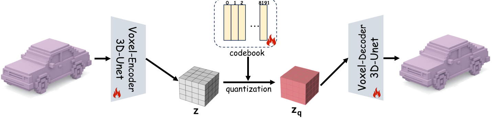

*原文 Figure 2：Figure 2: The pipeline of 3D VQVAE, which can compress voxels into discrete tokens. [查看图片来源](https://arxiv.org/html/2506.01853v1/vqvae2.png)*

引用来源：arxiv_2608.02711

链接：[arXiv](https://arxiv.org/abs/2506.01853)

#### 2026

##### CG-MLLM: Captioning and Generating 3D content via Multi-modal Large Language Models

作者：Junming Huang, Chi Wang, Le-Tian Li, Guang-Kai Xu, Dong-Lin Huang, Hao Chen, Qiang Dai, Weiwei Xu

主任务：generation

方法标签：native_3d_latent_space、mesh_tokenization_autoregressive

架构标签：unified_multimodal_transformer

中文简介：

CG-MLLM解决3D内容描述与高分辨率生成的联合任务，输入文本或图像，输出3D资产及语义描述。核心方法是采用混合Transformer架构，解耦令牌级和块级自回归处理，集成预训练视觉语言骨干网与专用3D VAE潜空间，实现长上下文交互。区别于仅生成低分辨率网格的现有MLLM，它属于统一多模态Transformer架构，不仅提升了3D生成保真度，还通过生成任务反向增强了模型的3D理解能力。

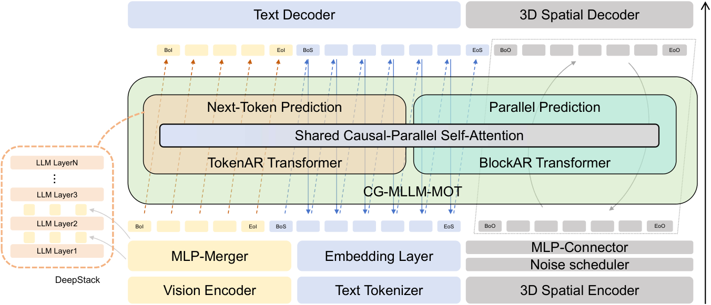

*原文 Figure 1：Figure 1 : The Pipeline of CG-MLLM . Our multimodal architecture processes vision, text, and 3D spatial inputs to generate text and 3D spatial outputs. It features a TokenAR Transformer for sequential next-token prediction and a BlockAR Transformer for efficient parallel block prediction, both governed by strict causal masking. [查看图片来源](https://arxiv.org/html/2601.21798v2/cgmllm_pipeline.png)*

引用来源：arxiv_2608.02711

链接：[arXiv](https://arxiv.org/abs/2601.21798)

##### Hunyuan3D-Buffalo 1.0: A Unified Multimodal Model for Scalable 3D Generation, Understanding, and Editing

作者：Ye, Junliang, Liu, Kenkun, Wang, Guocun, Li, Yang, Qu, Yansong, Wang, Chunshi, Xu, Jingwei, Yang, Yunhan, Zhao, Zibo, Xu, Jiachen, Yu, Jiaao, Wang, Lifu, Liang, Zhihao, Huang, Xin, Chen, Zhuo, Guo, Chunchao

主任务：generation

方法标签：native_3d_latent_space

架构标签：unified_multimodal_transformer

中文简介：

该论文解决3D理解、文本生成3D及指令编辑任务，输入为文本或3D资产，输出为语义描述或编辑后的3D模型。核心方法是统一多模态Transformer架构，结合Hunyuan3D-VLM进行语义理解与Hunyuan3D DiT进行高保真合成，利用大规模多模态语料联合训练。区别于以往单一任务模型，它在单一框架内实现了理解对生成的增强，解决了编辑数据稀缺问题，支持从理解到生成再到编辑的闭环交互。

*原文 Figure 7：Figure 6: Hunyuan3D-Buffalo 1.0 pipeline. The framework unifies 3D QA and grounding, text-to-3D generation, and 3D editing through a shared Hunyuan3D-VLM backbone, which connects language, 3D representations, and generative Hunyuan3D DiT modules for multimodal understanding, generation, and editing. [查看图片来源](https://arxiv.org/html/2608.02711v3/Pipeline.png)*

引用来源：user_seed

链接：[arXiv](https://arxiv.org/abs/2608.02711)

### 三维编辑（editing）

#### 2024

##### TIP-Editor: An Accurate 3D Editor Following Both Text-Prompts And Image-Prompts

作者：Jingyu Zhuang, Di Kang, Yanpei Cao, Guanbin Li, Liang Lin, Ying Shan

主任务：editing

方法标签：inference_time_instance_optimization

中文简介：

TIP-Editor解决文本驱动3D场景编辑中外观与位置控制不准的问题，输入包括文本、参考图像及3D边界框，输出为编辑后的3D高斯泼溅场景。核心方法采用逐步2D个性化策略学习场景与参考图表示，引入定位损失确保物体放置准确，并利用3D Gaussian Splatting实现局部编辑与背景保持。属于三维编辑类别，相比纯文本方法，它通过图像提示补充细节，显著提升了编辑的准确性与一致性。

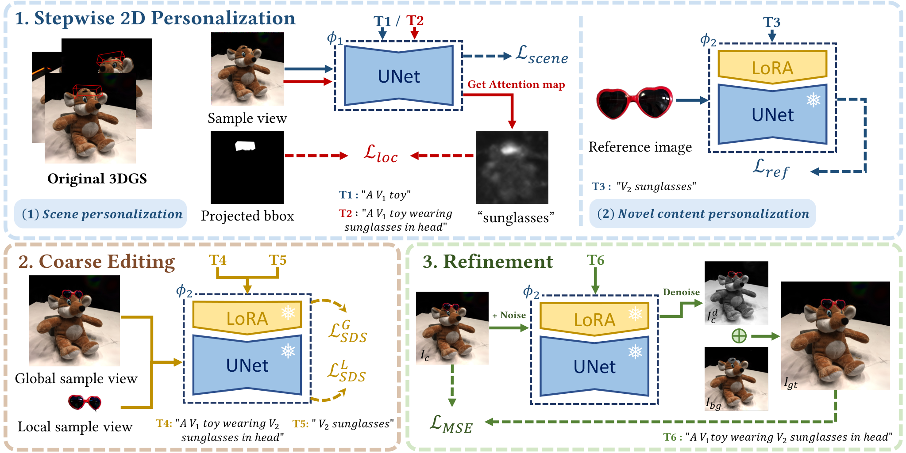

*原文 Figure 2：Figure 2. Method overview. TIP-Editor optimizes a 3D scene that is represented as 3D Gaussian splatting (GS) to conform with a given hybrid text-image prompt. The editing process includes three stages: 1) a stepwise 2D personalization strategy, which features a localization loss in the scene personalization step and a separate novel content personalization step dedicated to the reference image based on LoRA (Sec. 4.1 ); 2) a coarse editing stage using SDS (Sec. 4.2 ); and 3) a pixel-level texture refinement stage, utilizing carefully generated pseudo-GT image from both the rendered image I c I_{c} and the denoised image I c d I_{c}^{d} (Sec. 4.3 ). [查看图片来源](https://arxiv.org/html/2401.14828v3/framework.png)*

引用来源：arxiv_2608.02711

链接：[arXiv](https://arxiv.org/abs/2401.14828)

#### 2025

##### Towards Scalable and Consistent 3D Editing

作者：Ruihao Xia, Yang Tang, Pan Zhou

主任务：editing

架构标签：unified_multimodal_transformer

中文简介：

该论文针对三维编辑任务，输入为3D资产及编辑指令，输出局部修改后保持全局一致的3D模型。核心方法包括构建大规模配对数据集3DEditVerse，并提出3DEditFormer模型，利用双重引导注意力和时间自适应门控机制，在不依赖人工3D掩码的情况下解耦可编辑区域与保留结构。与前序依赖繁琐掩码或易产生几何畸变的方法不同，该工作实现了无需辅助掩码的精确、一致且可扩展的三维编辑，确立了新的实践标准。

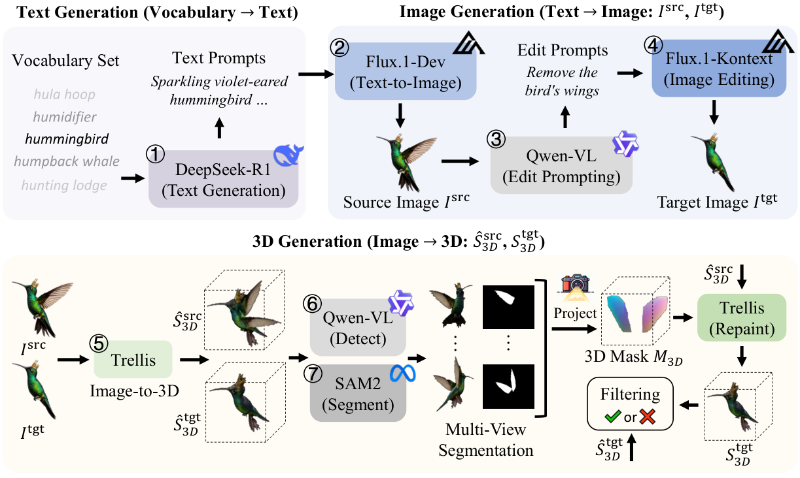

*原文 Figure 2：Figure 2: Overview of our data generation pipeline for text-guided 3D editing. Starting from a large-scale Vocabulary Set, we employ multiple foundation models in a carefully orchestrated manner and construct the text-to-image-to-3D lifting pipeline. [查看图片来源](https://arxiv.org/html/2510.02994v1/label_vis.png)*

引用来源：arxiv_2608.02711

链接：[arXiv](https://arxiv.org/abs/2510.02994)

##### Feedforward 3D Editing via Text-Steerable Image-to-3D

作者：Ziqi Ma, Hongqiao Chen, Yisong Yue, Georgia Gkioxari

主任务：editing

中文简介：

Steer3D解决为预训练图像到3D模型添加文本 steerability 的编辑任务，输入生成资产与文本指令，输出编辑后的3D模型。核心方法借鉴ControlNet思路，通过两阶段训练（流匹配与直接偏好优化）将文本控制嵌入前馈生成过程。区别于依赖迭代优化的编辑方法，Steer3D属于三维编辑类别，实现了快速的前馈文本引导编辑，在遵循指令和保持原始资产一致性方面表现优异，显著提升了推理速度。

*原文 Figure 2：Figure 3 : Steer3D architecture: we design a ControlNet-based architecture to leverage the shape and geometry prior of pretrained image-to-3D generative models. We add a trainable ControlNet block corresponding to each transformer block in the base model. [查看图片来源](https://arxiv.org/html/2512.13678v1/controlnet.png)*

引用来源：arxiv_2608.02711

链接：[arXiv](https://arxiv.org/abs/2512.13678)

#### 2026

##### Easy3E: Feed-Forward 3D Asset Editing via Rectified Voxel Flow

作者：Shimin Hu, Yuanyi Wei, Fei Zha, Yudong Guo, Juyong Zhang

主任务：editing

方法标签：native_3d_latent_space

中文简介：

Easy3E解决单视图条件下的前馈式3D资产编辑任务，输入编辑视图，输出全局一致且高保真的修改后3D模型。核心方法包括Voxel FlowEdit，在稀疏体素潜空间中实现单次通过的几何变形，以及法线引导的单图到多图生成模块以恢复高频纹理。区别于依赖耗时迭代优化的现有方法，Easy3E属于三维编辑类别中的前馈架构，有效克服了多视图不一致和外观 fidelity 瓶颈，实现了快速编辑。

*原文 Figure 1：Figure 2 : Overview of Easy3E. The framework operates in two main stages: Geometry Editing and Texture Refinement. Starting from a rendered source view, an edited target image provides the guidance for editing. In the Geometry Editing stage, the Voxel FlowEdit algorithm transforms the source voxel structure under flow-based guidance, followed by SLAT Repainting that refines local latent features to produce the target mesh. The Texture Refinement stage then employs a generation branch and a normal-guided control adapter to synthesize multi-view-consistent textures, which are projected and fused onto the mesh to yield the final high-fidelity 3D asset. [查看图片来源](https://arxiv.org/html/2602.21499v2/pipeline.png)*

引用来源：arxiv_2608.02711

链接：[arXiv](https://arxiv.org/abs/2602.21499)

##### Omni-3DEdit: Generalized Versatile 3D Editing in One-Pass

作者：Liyi Chen, Pengfei Wang, Guowen Zhang, Zhiyuan Ma, Lei Zhang

主任务：editing

方法标签：native_3d_latent_space

中文简介：

Omni-3DEdit解决多种3D编辑任务缺乏统一设计且推理耗时的问题。它构建合成配对多视图编辑样本，适配预训练生成模型SEVA为主干，通过拼接源视图潜变量与条件令牌，并引入双流LoRA模块解耦视图线索。作为一种基于学习的模型，它摒弃了耗时的在线迭代优化，能在一次前向传播中完成外观编辑、移除等多种任务，将推理时间从数十分钟缩短至约两分钟，实现了高效通用的3D编辑。

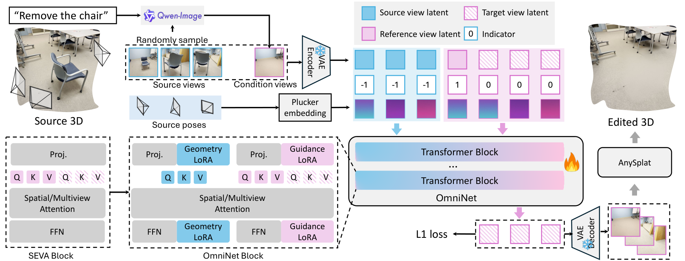

*原文 Figure 2：Figure 2 : Overview of Omni-3DEdit. Given the instruction and multi-view images as inputs, we first employ Qwen-Image to obtain an edited reference image as condition view. Then an OmniNet is trained to map the editing cues from condition view to other views. The outputs of OmniNet are edited multi-view images, which can be used to obtain the edited 3D asset optionally. [查看图片来源](https://arxiv.org/html/2603.17841v1/method.png)*

引用来源：arxiv_2608.02711

链接：[arXiv](https://arxiv.org/abs/2603.17841)

##### Feedforward 3D Editing Learns from Semantic-Part Transformation

作者：Jiawei Weng, Saining Zhang, Zhenxin Diao, Peishuo Li, Henghaofan Zhang, Junhao Chen, Hao Zhao

主任务：editing

方法标签：native_3d_latent_space

中文简介：

该论文解决前馈式3D编辑任务，输入为源3D资产及编辑指令，输出为编辑后的3D模型。核心方法是基于语义部件变换构建高质量配对数据集Pxform，并训练PartFlow网络注入源感知潜控制。区别于依赖推理时优化或低质量数据的现有方法，它通过学习部件级转换实现快速前馈编辑，引入掩码感知速度保持机制，在无推理掩码情况下仍能保持高保真度与源结构一致性，提升了编辑的可扩展性。

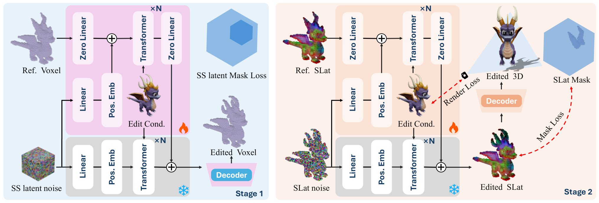

*原文 Figure 4：Figure 4. Overview of PartFlow. PartFlow introduces ControlNet-style source-latent injection into the two-stage TRELLIS editing process: Stage 1 controls coarse sparse-structure editing, while Stage 2 refines SLat-level geometry and appearance. During training, ground-truth edit masks impose a velocity-space preservation loss on unedited regions, while edited regions are supervised by the standard flow objective. A Stage-2 render-space loss further aligns the Gaussian-rendered output with the target editing view. A two-stage ControlNet-style 3D editing architecture. The first stage edits sparse-structure latents with source voxel control, and the second stage edits SLat representations with source SLat control, mask-aware losses, and render-space supervision. [查看图片来源](https://arxiv.org/html/2605.27351v5/PartFlow.png)*

引用来源：arxiv_2608.02711

链接：[arXiv](https://arxiv.org/abs/2605.27351)

### 三维理解（understanding）

#### 2023

##### PointLLM: Empowering Large Language Models to Understand Point Clouds

作者：Runsen Xu, Xiaolong Wang, Tai Wang, Yilun Chen, Jiangmiao Pang, Da-Hua Lin

主任务：understanding

架构标签：unified_multimodal_transformer

中文简介：

该论文解决点云理解任务，输入为彩色物体点云及人类指令，输出为符合语境的文本响应。核心方法是将点云编码器与大语言模型（LLM）结合，通过两阶段训练策略对齐潜在空间并进行指令微调，从而融合几何、外观与语言信息。作为三维理解领域的早期探索，它突破了以往仅依赖2D视觉数据的局限，使LLM能够直接处理3D几何信号，在对象分类和描述生成任务中展现了优于现有基线的感知与泛化能力。

*原文 Figure 2：Figure 2 : An overview of PointLLM. The point encoder extracts features from the input point cloud and the projector projects them to the latent space of the LLM backbone. The LLM backbone processes sequences of point and text tokens and generates the predicted tokens as the output. [查看图片来源](https://arxiv.org/html/2308.16911v3/main_figure_eccv.png)*

引用来源：arxiv_2608.02711

链接：[arXiv](https://arxiv.org/abs/2308.16911)

#### 2024

##### ShapeLLM: Universal 3D Object Understanding for Embodied Interaction

作者：Zekun Qi, Runpei Dong, Shaochen Zhang, Haoran Geng, Chunrui Han, Zheng Ge, Li Yi, Kaisheng Ma

主任务：understanding

中文简介：

ShapeLLM旨在解决具身交互场景下的通用3D对象理解任务，输入为3D点云与文本指令，输出为语义描述或 grounding 结果。其核心方法是构建基于ReCon++增强编码器的多模态大语言模型，利用多视图图像蒸馏提升几何理解能力，并在指令跟随数据上进行训练。作为三维理解领域的代表，它区别于传统专用模型，通过统一LLM架构实现了几何信号到语义符号的高效转化，支持复杂的3D语言交互任务。

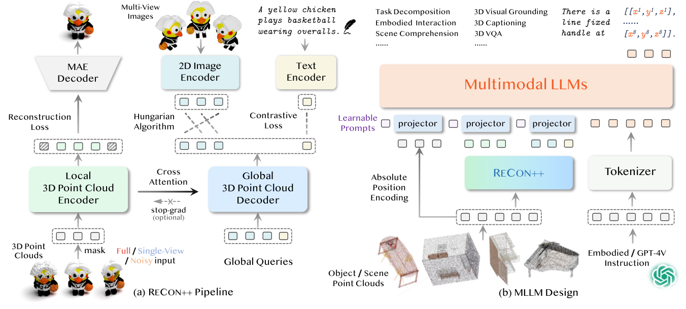

*原文 Figure 1：Figure 2 : Overview of our ShapeLLM framework . (a) The introduced ReCon ++ pipeline incorporates the required 3D encoder. (b) The comprehensive design of the MLLM, featuring an instruction-mode tokenizer and the integration of an aligned multi-modal representation, equips the MLLM with the capability to effectively handle 3D vision language tasks. [查看图片来源](https://arxiv.org/html/2402.17766v3/framework.png)*

引用来源：arxiv_2608.02711

链接：[arXiv](https://arxiv.org/abs/2402.17766)

#### 2026

##### EVA01: Unified Native 3D Understanding and Generation via Mixture-of-Transformers

作者：Zongyuan Yang, Ming Yi, Wanli Ma, C. Fan, Bocheng Li, Baolin Liu, Yuke Lou, Yingde Song, Yongping Xiong, Zheng-Dong Guo, Shixuan Wang

主任务：understanding

方法标签：native_3d_latent_space

架构标签：unified_multimodal_transformer

中文简介：

EVA01旨在解决多模态大语言模型中3D网格作为原生模态的集成问题，支持3D理解、生成及上下文感知编辑。其核心采用混合Transformer架构，将预训练的理解专家与结构镜像的生成专家解耦，并通过共享全局自注意力机制耦合。区别于以往将3D视为外部输出或依赖2D像素先验的方法，该框架直接对齐语义潜空间与几何流形，实现了无需中间2D表示的原生3D处理，显著提升了生成 fidelity 和长上下文编辑的一致性。

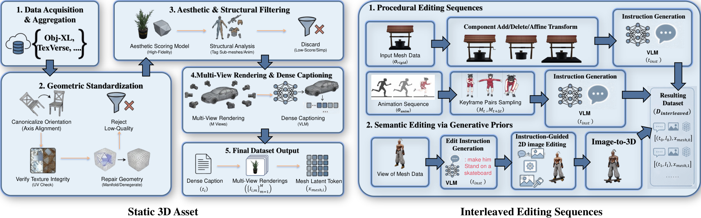

*原文 Figure 2：Figure 3 : Data Curation Pipeline of EVA01. (Left) Static 3D Asset Curation: We standardize raw 3D assets through geometric canonicalization, aesthetic filtering, and multi-view dense captioning to construct high-quality text-image-mesh triplets. (Right) Interleaved Editing Sequences: To enable context-aware editing, we synthesize multi-turn sequences via two complementary pathways: Procedural Editing (top right) utilizing rigid transformations and animation keyframes for structural precision, and Semantic Editing (bottom right) leveraging 2D generative priors for open-ended stylistic modification. [查看图片来源](https://arxiv.org/html/2605.16745v1/fig-data-pipeline.png)*

引用来源：arxiv_2608.02711

链接：[arXiv](https://arxiv.org/abs/2605.16745)

### 部件结构化生成（part_structured_generation）

#### 2026

##### CubePart: An Open-Vocabulary Part-Controllable 3D Generator

作者：Yiheng Zhu, Kangle Deng, J. Fauconnier, Iñaki Navarro, Daiqing Li, Ava Pun, Yinan Zhang, Peiye Zhuang, Xiaoxia Sun, Maneesh Agrawala, K. Bhat, Tinghui Zhou

主任务：part_structured_generation

中文简介：

该论文解决开放词汇部件可控的3D生成任务，输入为全局文本提示及用户定义的部件模式，输出为组装一致的部件化3D网格。核心方法是两阶段生成架构，分离全局形状合成与部件级解码，并将部件结构作为显式推理控制信号。区别于生成整体网格或任意分割的前序模型，CubePart确保每个部件具有明确语义身份且可直接用于动画和物理模拟，满足了游戏引擎等应用对结构化资产的需求。

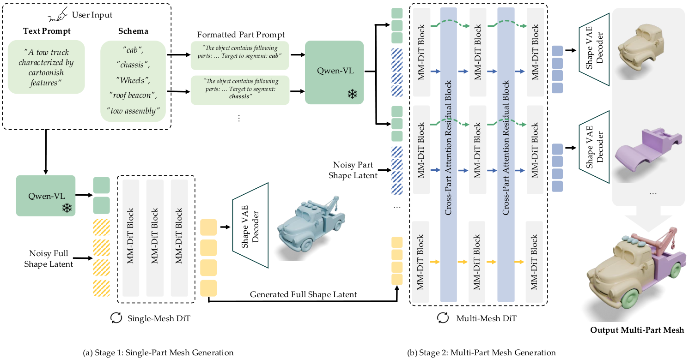

*原文 Figure 2：Figure 2. Overview. We propose a two-stage framework to generate part-controllable 3D objects conditioned on a global text prompt and a part schema. (a) Single Mesh Generation synthesizes a holistic shape latent using a Multi-Modal DiT (MM-DiT) ( Esser et al., 2024 ) , conditioned on the prompt and schema encoded by Qwen-VL ( Bai et al., 2023 ) . (b) Multi-Mesh Generation takes the full shape latent from Stage 1 and decomposes it into distinct part latents. To achieve this, we initialize with the MM-DiT weights from Stage 1 and inject Cross-Part Attention Residual Blocks to enable structural interaction among parts. [查看图片来源](https://arxiv.org/html/2605.28763v1/method.png)*

引用来源：arxiv_2608.02711

链接：[arXiv](https://arxiv.org/abs/2605.28763)

### 背景与上下文（context）

#### 2017

##### Neural Discrete Representation Learning

作者：Aäron van den Oord, O. Vinyals, K. Kavukcuoglu

主任务：context

中文简介：

该论文提出VQ-VAE模型，解决无监督学习离散表示的任务，输入连续数据，输出离散潜变量代码。核心方法引入向量量化机制，使编码器输出离散而非连续的编码，并学习动态先验，有效避免了传统VAE的后验坍塌问题。虽然并非专为三维设计，但其离散化思想为后续三维网格词元化及自回归生成奠定了理论基础，是连接连续几何信号与离散Transformer架构的关键前置技术。

*原文 Figure 1：Figure 1: Left: A figure describing the VQ-VAE. Right: Visualisation of the embedding space. The output of the encoder z ⁡ ( x ) z(x) is mapped to the nearest point e 2 e_{2} . The gradient ∇ z L \nabla_{z}L (in red) will push the encoder to change its output, which could alter the configuration in the next forward pass. [查看图片来源](https://arxiv.org/html/1711.00937v2/figures/Figure1_9.png)*

引用来源：arxiv_2608.02711

链接：[arXiv](https://arxiv.org/abs/1711.00937)

#### 2018

##### PartNet: A Large-Scale Benchmark for Fine-Grained and Hierarchical Part-Level 3D Object Understanding

作者：Kaichun Mo, Shilin Zhu, Angel X. Chang, L. Yi, Subarna Tripathi, L. Guibas, Hao Su

主任务：context

中文简介：

该论文提供PartNet数据集，旨在推动细粒度、层级化的三维部件理解任务，输入为三维模型，输出为部件语义分割、层级结构及实例掩码。核心贡献在于构建了包含大量精细部件标注的大规模基准，并定义了相应的评估任务。作为三维理解领域的基础设施，它填补了缺乏高质量部件级标注数据的空白，为后续研究三维物体的内部结构和语义关系提供了关键的数据支撑和评估标准。

*原文 Figure 6：Figure 6 : The proposed detection-by-segmentation method for instance segmentation. The network learns to predict three components: the semantic label for each point, a set of disjoint instance masks and their confidence scores for part instances. [查看图片来源](https://arxiv.org/html/1812.02713v1/ins_seg_arch.png)*

引用来源：arxiv_2608.02711

链接：[arXiv](https://arxiv.org/abs/1812.02713)

#### 2023

##### 3DShape2VecSet: A 3D Shape Representation for Neural Fields and Generative Diffusion Models

作者：Biao Zhang, Jiapeng Tang, M. Nießner, Peter Wonka

主任务：context

中文简介：

3DShape2VecSet提出一种新的3D形状表示方法，用于神经场和生成扩散模型，输入为表面模型或点云，输出为向量集表示的神经场。核心方法是结合径向基函数和注意力机制，将3D形状编码为一组向量，这种表示特别适合Transformer处理。它位于三维原生潜空间生成的上游表示学习环节，不同于传统的全局 latent vector 或网格离散化，该表示在处理几何细节和生成任务中表现更优，支持无条件、文本或图像条件等多种生成应用，提升了编码效率和生成质量。

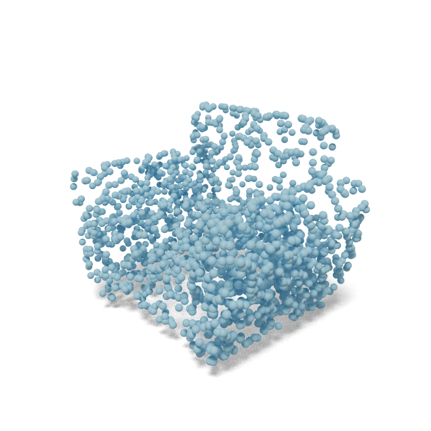

*原文 Figure 2：Figure 3 . Shape autoencoding pipeline. Given a 3D ground-truth surface mesh as the input, we first sample a point cloud that is mapped to positional embeddings and encode them into a set of latent codes through a cross-attention module ( Sec. 5.1 ). Next, we perform (optional) compression and KL-regularization in the latent space to obtain structured and compact latent shape representations ( Sec. 5.2 ). Finally, the self-attention is carried out to aggregate and exchange the information within the latent set. And a cross-attention module is designed to calculate the interpolation weights of query points. The interpolated feature vectors are fed into a fully connected layer for occupancy prediction ( Sec. 5.3 ). [查看图片来源](https://arxiv.org/html/2301.11445v3/images/pipeline/pipeline-input.png)*

引用来源：arxiv_2608.02711

链接：[arXiv](https://arxiv.org/abs/2301.11445)

##### LLaMA: Open and Efficient Foundation Language Models

作者：Hugo Touvron, Thibaut Lavril, Gautier Izacard, X. Martinet, M. Lachaux, Timothée Lacroix, Baptiste Rozière, Naman Goyal, Eric Hambro, Faisal Azhar, Aurélien Rodriguez, Armand Joulin, Edouard Grave, Guillaume Lample

主任务：context

中文简介：

LLaMA是一系列基础语言模型，参数量从7B到65B不等，主要在自然语言处理领域发挥作用，输入为文本令牌，输出为预测的下一个令牌。核心方法是在万亿级令牌上使用公开数据集进行训练，证明了无需专有数据即可训练出最先进模型。虽然本身不直接处理3D数据，但作为强大的语言 backbone，它为后续多模态大模型（如PointLLM）提供了关键的语义理解和指令跟随能力，是构建统一多模态Transformer架构中不可或缺的语言处理组件。

*原文 Figure 1：Figure 1: Training loss over train tokens for the 7B, 13B, 33B, and 65 models. LLaMA-33B and LLaMA-65B were trained on 1.4T tokens. The smaller models were trained on 1.0T tokens. All models are trained with a batch size of 4M tokens. [查看图片来源](https://arxiv.org/html/2302.13971v1/train_loss.svg)*

引用来源：arxiv_2608.02711

链接：[arXiv](https://arxiv.org/abs/2302.13971)

##### Fantasia3D: Disentangling Geometry and Appearance for High-quality Text-to-3D Content Creation

作者：Rui Chen, Y. Chen, Ningxin Jiao, K. Jia

主任务：context

中文简介：

Fantasia3D解决高质量文本到3D内容创建任务，输入为文本，输出为解耦几何与外观的3D资产。核心方法是将几何学习和外观建模分离：几何方面使用混合场景表示并将表面法线作为扩散模型输入；外观方面引入空间变化的BRDF以学习表面材质。这种解耦框架克服了传统隐式表示中几何与外观耦合导致的细节丢失问题。与端到端生成方法不同，它生成的资产更符合图形引擎标准，支持重光照、编辑和物理模拟，实现了照片级真实感的渲染效果。

*原文 Figure 3：Figure 3: Overview of our method. Our method can generate disentangled geometry and appearance given a text prompt (cf. figure (a)), which are produced by (b) geometry modeling and (c) appearance modeling, respectively. (b) We employ DMTet as our 3D geometry representation, which is initialized as a 3D ellipsoid here. To optimize the parameters of DMTet , we render the normal map (and the object mask in the early training phase) of the extracted mesh from DMTet as the shape encoding of stable diffusion [ 35 , 40 ] . (c) For appearance modeling, we introduce the spatially-varying Bidirectional Reflectance Distribution Function (BRDF) modeling into text-to-3D generation, and learn to predict three components (namely, k d k_{d} , k r ​ m k_{rm} , and k n k_{n} ) of the appearance. Both geometry and appearance modeling are supervised by Score Distillation Sampling (SDS) loss [ 33 ] . [查看图片来源](https://arxiv.org/html/2303.13873v3/pipeline2.png)*

引用来源：arxiv_2608.02711

链接：[arXiv](https://arxiv.org/abs/2303.13873)

##### Instruct-NeRF2NeRF: Editing 3D Scenes with Instructions

作者：Ayaan Haque, Matthew Tancik, Alexei A. Efros, Aleksander Holynski, Angjoo Kanazawa

主任务：context

中文简介：

Instruct-NeRF2NeRF解决基于文本指令的3D场景编辑任务，输入为原始NeRF场景及其重建图像集合和文本指令，输出为编辑后的3D场景。核心方法是在推理时利用图像条件扩散模型（InstructPix2Pix）迭代编辑输入图像，同时反向传播优化底层NeRF参数。属于推理时实例级优化类别，它不更新模型权重，而是针对特定实例进行调整。与前序全局编辑方法相比，该方法能实现更逼真、更具针对性的局部编辑，且适用于大规模真实世界场景，保持了未编辑区域的一致性。

*原文 Figure 1：Figure 2: Overview : Our method gradually updates a reconstructed NeRF scene by iteratively updating the dataset images while training the NeRF: (1) an image is rendered from the scene at a training viewpoint, (2) it is edited by InstructPix2Pix given a global text instruction, (3) the training dataset image is replaced with the edited image, and (4) the NeRF continues training as usual. [查看图片来源](https://arxiv.org/html/2303.12789v2/pipeline.png)*

引用来源：arxiv_2608.02711

链接：[arXiv](https://arxiv.org/abs/2303.12789)

##### ProlificDreamer: High-Fidelity and Diverse Text-to-3D Generation with Variational Score Distillation

作者：Zhengyi Wang, Cheng Lu, Yikai Wang, Fan Bao, Chongxuan Li, Hang Su, Jun Zhu

主任务：context

中文简介：

ProlificDreamer解决文本到3D生成中存在的过饱和、过平滑和低多样性问题，输入为文本，输出为高保真NeRF或网格。核心方法是提出变分分数蒸馏（VSD），将3D参数建模为随机变量而非常数，通过基于粒子的变分框架优化3D表示。作为基于优化的蒸馏生成路线的改进，VSD解释了SDS的局限性，并在各种CFG权重下均能工作。相比前序SDS方法，它在保持高分辨率的同时显著提升了生成样本的多样性和细节丰富度，支持复杂效果如烟雾和水滴的生成。

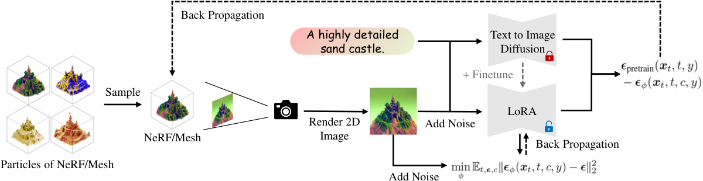

*原文 Figure 4：Figure 2: Overview of VSD. The 3D representation is differentiably rendered at a random pose c c . The rendered image is sent to the pretrained diffusion and the score of the variational distribution (estimated by LoRA) to compute the gradient of VSD. LoRA is also updated on the rendered image. [查看图片来源](https://arxiv.org/html/2305.16213v2/diagram.png)*

引用来源：arxiv_2608.02711

链接：[arXiv](https://arxiv.org/abs/2305.16213)

##### MVDream: Multi-view Diffusion for 3D Generation

作者：Yichun Shi, Peng Wang, Jianglong Ye, M. Long, Kejie Li, X. Yang

主任务：context

中文简介：

MVDream旨在解决文本到三维生成中的多视图一致性问题，输入为文本提示，输出为一致的多视图图像。核心方法是训练一个多视图扩散模型，同时从2D和3D数据中学习，使其兼具2D扩散模型的泛化能力和3D渲染的一致性。该方法隐式地提供了一个与具体3D表示无关的通用3D先验，可通过Score Distillation Sampling应用于3D生成。与传统的2D提升方法相比，它显著增强了生成结果的一致性和稳定性，并支持类似DreamBooth的少样本3D概念学习。

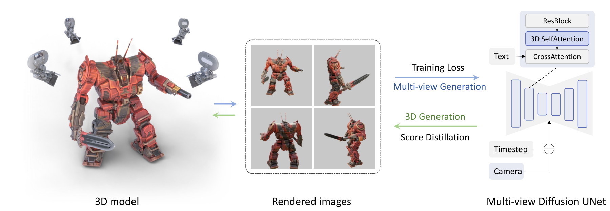

*原文 Figure 2：Figure 2: Illustration of the multi-view diffusion model. We keep the structure of text-to-image UNets by making two slight changes: (1) changing the self-attention from 2D to 3D for cross-view connection (2) adding camera embeddings for each view. Multi-view renderings are used to train the diffusion model. During testing, the pipeline is used in a reverse way: the multi-view diffusion model serves as 3D prior to optimize the 3D representation via Score Distillation Sampling (SDS). [查看图片来源](https://arxiv.org/html/2308.16512v4/architecture_v2.png)*

引用来源：arxiv_2608.02711

链接：[arXiv](https://arxiv.org/abs/2308.16512)

##### DreamGaussian: Generative Gaussian Splatting for Efficient 3D Content Creation

作者：Jiaxiang Tang, Jiawei Ren, Hang Zhou, Ziwei Liu, Gang Zeng

主任务：context

中文简介：

DreamGaussian解决基于SDS的3D生成速度慢的问题，输入为单视图图像或文本，输出为带纹理的3D网格。核心方法是采用渐进式稠密化的3D高斯泼溅表示，配合UV空间纹理细化算法，将高斯转换为网格。属于基于优化的蒸馏生成类别，相比NeRF的占用剪枝，高斯泼溅收敛更快，实现了约10倍的加速，能在2分钟内生成高质量纹理网格，兼顾了效率与下游应用的兼容性。

*原文 Figure 1：Figure 2: DreamGaussian Framework . 3D Gaussians are used for efficient initialization of geometry and appearance using single-step SDS loss. We then extract a textured mesh and refine the texture image with a multi-step MSE loss. [查看图片来源](https://arxiv.org/html/2309.16653v2/framework.png)*

引用来源：arxiv_2608.02711

链接：[arXiv](https://arxiv.org/abs/2309.16653)

##### GaussianDreamer: Fast Generation from Text to 3D Gaussians by Bridging 2D and 3D Diffusion Models

作者：Taoran Yi, Jiemin Fang, Junjie Wang, Guanjun Wu, Lingxi Xie, Xiaopeng Zhang, Wenyu Liu, Qi Tian, Xinggang Wang

主任务：context

中文简介：

GaussianDreamer旨在结合2D与3D扩散模型优势进行快速文本到3D生成，输入为文本，输出为3D高斯泼溅资产。核心方法利用3D扩散模型提供初始化先验，2D扩散模型丰富几何与外观，并通过噪声点增长与颜色扰动增强初始化高斯。属于基于优化的蒸馏生成类别，它桥接了两种扩散模型，既保证了3D一致性又提升了生成质量，在单GPU上15分钟内即可完成高质量生成，优于纯2D或纯3D方法。

*原文 Figure 1：Figure 2 : Overall framework of GaussianDreamer. Firstly, we utilize a 3D diffusion model to generate the initialized point clouds. After executing noisy point growing and color perturbation on the point clouds, we use them to initialize the 3D Gaussians. The initialized 3D Gaussians are further optimized using the SDS method [ 55 ] with a 2D diffusion model. Finally, we render the image using the 3D Gaussians by employing 3D Gaussian Splatting [ 26 ] . We can use one of various 3D diffusion models to generate the initialized point clouds. In this case, we take text-to-3D and text-to-motion diffusion models as examples. [查看图片来源](https://arxiv.org/html/2310.08529v3/pipline11.png)*

引用来源：arxiv_2608.02711

链接：[arXiv](https://arxiv.org/abs/2310.08529)

##### RichDreamer: A Generalizable Normal-Depth Diffusion Model for Detail Richness in Text-to-3D

作者：Lingteng Qiu, Guanying Chen, Xiaodong Gu, Qi Zuo, Mutian Xu, Yushuang Wu, Weihao Yuan, Zilong Dong, Liefeng Bo, Xiaoguang Han

主任务：context

中文简介：

RichDreamer解决文本生成3D中几何先验缺乏及材质光照纠缠问题，输入为文本，输出为细节丰富的3D资产。核心方法是训练通用的法线-深度扩散模型，替代直接用RGB扩散模型优化法线，并引入反照率扩散模型约束材质。属于基于优化的蒸馏生成类别的改进路线，它通过解耦几何与外观生成，缓解了分布差异导致的不稳定，显著提升了生成物体的细节丰富度与几何合理性。

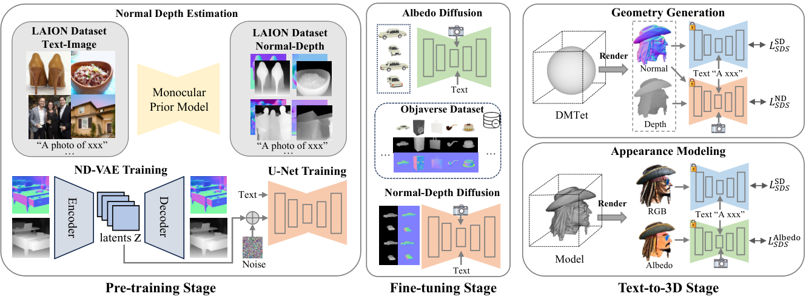

*原文 Figure 1：Figure 2 : Overview of the proposed RichDreamer . We introduce a generalizable Normal-Depth diffusion model that is trained on the LAION-2B dataset with normal and depth predicted by Midas [ 59 ] , followed by fine-tuning on the synthetic dataset. Our model can be incorporated with the DMTet and NeRF representations to enhance the geometry generation. To alleviate the ambiguity in appearance modeling, we propose an albedo diffusion model to impose data-drive prior on the albedo component. [查看图片来源](https://arxiv.org/html/2311.16918v2/pipeline.png)*

引用来源：arxiv_2608.02711

链接：[arXiv](https://arxiv.org/abs/2311.16918)

#### 2024

##### Consistent3D: Towards Consistent High-Fidelity Text-to-3D Generation with Deterministic Sampling Prior

作者：Zike Wu, Pan Zhou, Xuanyu Yi, Xiaoding Yuan, Hanwang Zhang

主任务：context

中文简介：

Consistent3D针对SDS方法在文本生成3D中存在的几何坍塌与纹理差问题，输入为文本提示，输出为高质量3D资产。核心范式是将SDS的随机微分方程采样转化为常微分方程（ODE）确定性采样，设计一致性蒸馏损失，利用相邻少噪声样本指导多噪声样本优化。属于基于优化的蒸馏生成类别，它通过引入确定性先验克服了传统SDS随机性带来的引导不一致，显著提升了生成结果的保真度与稳定性。

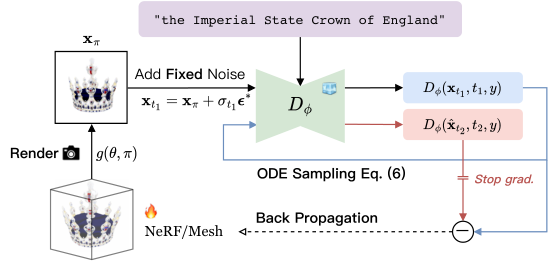

*原文 Figure 2：Figure 3 : Overview of CDS. In each training iteration, the rendered image is perturbed by a fixed noise and then served as a start point of the deterministic flow for computing the CDS loss. [查看图片来源](https://arxiv.org/html/2401.09050v2/framework.png)*

引用来源：arxiv_2608.02711

链接：[arXiv](https://arxiv.org/abs/2401.09050)

##### DreamReward: Text-to-3D Generation with Human Preference

作者：Junliang Ye, Fang-Fu Liu, Qi-Xiu Li, Zhengyi Wang, Yikai Wang, Xinzhou Wang, Yue-Qi Duan, Jun Zhu

主任务：context

中文简介：

DreamReward针对文本到三维生成结果与人类偏好不一致的问题，输入为文本提示，输出为符合人类审美的高质量三维模型。其核心方法是构建Reward3D奖励模型，并利用DreamFL算法对多视图扩散模型进行直接调优，将人类反馈融入训练过程。该方法属于基于优化的蒸馏生成路线的改进，区别于仅依赖预训练先验而无视人类偏好的传统SDS方法，它通过引入显式的偏好奖励信号，显著提升了生成结果在提示对齐度和视觉质量上与人类意图的一致性。

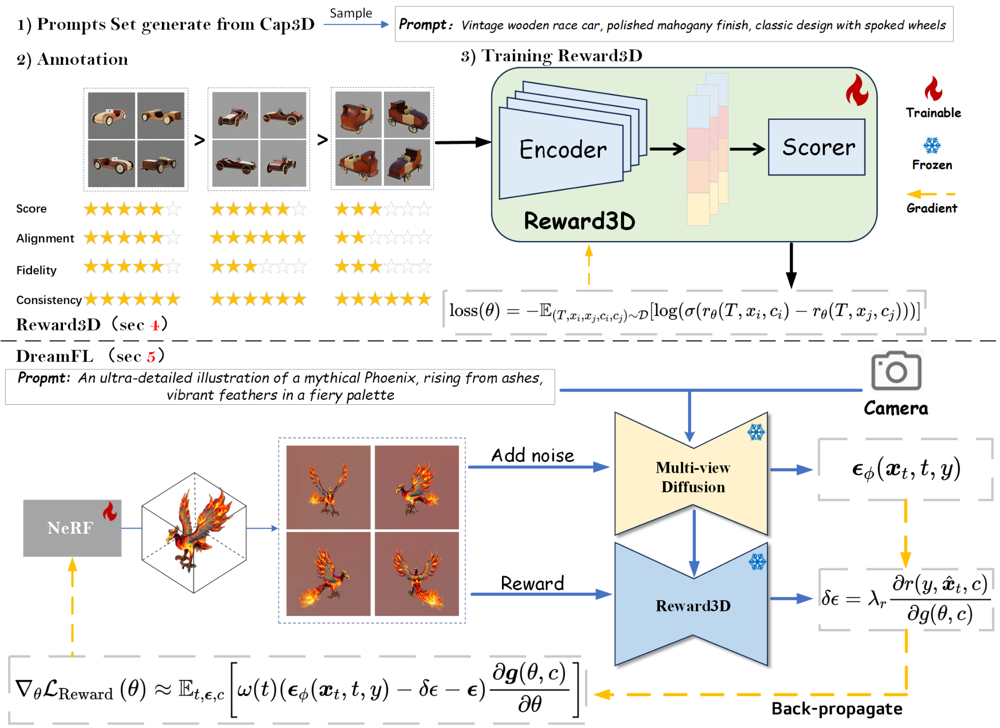

*原文 Figure 1：Figure 1 : The overall framework of our DreamReward . ( Top ) Reward3D involves data collection, annotation, and preference learning. ( Bottom ) DreamFL utilizes feedback from Reward3D to compute RewardLoss and incorporate it into the SDS loss for simultaneous optimization of NeRF. [查看图片来源](https://arxiv.org/html/2403.14613v1/pipeline.png)*

引用来源：arxiv_2608.02711

链接：[arXiv](https://arxiv.org/abs/2403.14613)

##### Frankenstein: Generating Semantic-Compositional 3D Scenes in One Tri-Plane

作者：Han Yan, Yang Li, Zhennan Wu, Shenzhou Chen, Weixuan Sun, Taizhang Shang, Weizhe Liu, Tian Chen, Xiaqiang Dai, Chao Ma, Hongdong Li, Pan Ji

主任务：context

中文简介：

Frankenstein旨在一次性生成具有语义组合性的三维场景，输入为场景描述，输出为包含多个独立语义部分的三维资产。其核心方法是将场景信息编码于单个三平面张量中，通过扩散模型去噪，并从中解码出多个独立的符号距离场（SDF）以表示不同部件。该方法属于部件结构化生成类别，区别于传统生成单一整体形状的方法，它能自动生成如房间内饰或人体 avatar 的可分离部件，支持后续的部件级重纹理或对象重排，增强了生成资产的可编辑性与语义清晰度。

*原文 Figure 1：Figure 1. We present Frankenstein, a tri-plane diffusion-based framework that can generate semantic-compositional 3D scenes in a single forward pass, e.g., rooms (left) and avatars (right). The generated scenes enable customized controls, such as part-wise texturing, and room object rearrangement or avatar cloth re-targeting. [查看图片来源](https://arxiv.org/html/2403.16210v2/imgs/teaser6.jpg)*

引用来源：arxiv_2608.02711

链接：[arXiv](https://arxiv.org/abs/2403.16210)

##### Generic 3D Diffusion Adapter Using Controlled Multi-View Editing

作者：Hansheng Chen, Ruoxi Shi, Yulin Liu, Bokui Shen, Jiayuan Gu, Gordon Wetzstein, Hao Su, Leonidas J. Guibas

主任务：context

中文简介：

MVEdit提出了一种通用的三维扩散适配器，用于开放域三维物体合成，输入为文本或图像，输出为高质量纹理网格。其核心范式是作为SDEdit的三维对应物，利用祖先采样联合去噪多视图图像，并通过无需训练的3D Adapter将上一时间步的二维视图提升为相干三维表示，再渲染回下一时间步以保持一致性。该方法属于推理时实例级优化与多视图生成的结合，区别于耗时较长的Score Distillation Sampling，它在保证视觉质量的同时大幅缩短了推理时间，实现了质量与效率的更好平衡。

*原文 Figure 3：Figure 3. Comparison between the two architectures , based on the text-guided 3D-to-3D pipeline with t start = 0.78 ​ T t^{\text{start}}=0.78T . Rendered RGB images x RGB rend x^{\text{rend}}_{\text{RGB}} across different timesteps are shown to visualize the sampling process. [查看图片来源](https://arxiv.org/html/2403.12032v2/ablation_ctrl.png)*

引用来源：arxiv_2608.02711

链接：[arXiv](https://arxiv.org/abs/2403.12032)

##### Make-Your-3D: Fast and Consistent Subject-Driven 3D Content Generation

作者：Fang-Fu Liu, Han-Yang Wang, Weiliang Chen, Haowen Sun, Yue-Qi Duan

主任务：context

中文简介：

Make-Your-3D专注于快速且一致的主体驱动三维内容生成，输入为单张主体图像及文本描述，输出为高保真三维资产。其核心方法是设计协同进化框架，通过身份感知优化和主体先验优化，协调多视图扩散模型与特定身份二维生成模型的分布，使其对齐于目标主体的三维分布。该方法属于基于优化的蒸馏生成类别，区别于传统方法在跨提示生成时的一致性缺失，它能在5分钟内完成个性化生成，有效解决了主体特征在三维化过程中的保持难题，实现了高效的主体定制。

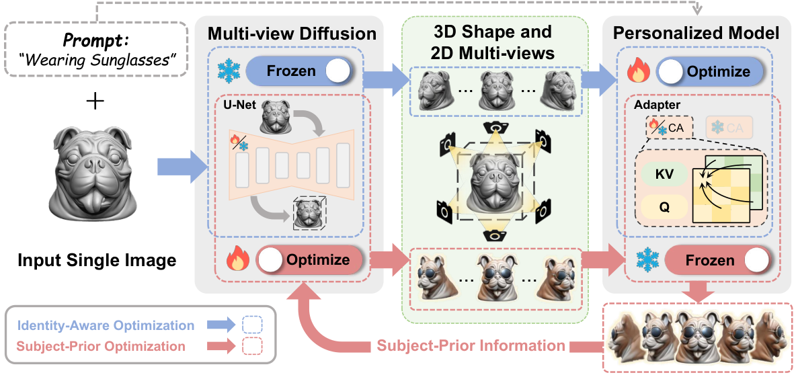

*原文 Figure 2：Figure 3 : The overall framework of our proposed Make-Your-3D. Our framework includes identity-aware optimization of 2D personalized model and subject-prior optimization of multi-view diffusion model to approximate subject distribution. The identity-aware optimization (Sec. 3.3 ) lifts input image to 3D space through a frozen multi-view diffusion model and optimizes the 2D personalized model via multi-views. The subject-prior optimization (Sec. 3.4 ) adopts diverse images from frozen personalized model to infuse the subject-specific prior into the multi-view diffusion model. [查看图片来源](https://arxiv.org/html/2403.09625v1/pipeline.png)*

引用来源：arxiv_2608.02711

链接：[arXiv](https://arxiv.org/abs/2403.09625)

##### Chameleon: Mixed-Modal Early-Fusion Foundation Models

作者：Chameleon Team, Mingda Chen, Jacob Kahn, Shang-Wen Li

主任务：context

中文简介：

Chameleon提出了一族早期融合的混合模态基础模型，输入和输出均为图像与文本的任意序列组合，支持视觉问答、图像生成及长表单模态生成等任务。其核心在于采用统一的基于令牌的Transformer架构，通过特定的训练稳定策略和对齐配方，实现图文模态的深度融合。虽然主要面向二维图文，但其统一多模态Transformer架构的理念对三维领域具有重要启示，打破了模态壁垒，证明了单一模型处理复杂混合模态序列的可行性，为未来构建包含三维模态的统一基础模型提供了架构参考。

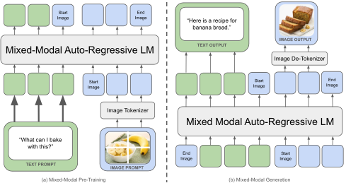

*原文 Figure 1：Figure 1: Chameleon represents all modalities — images, text, and code, as discrete tokens and uses a uniform transformer-based architecture that is trained from scratch in an end-to-end fashion on ∼ \sim 10T tokens of interleaved mixed-modal data. As a result, Chameleon can both reason over, as well as generate, arbitrary mixed-modal documents. Text tokens are represented in green and image tokens are represented in blue. [查看图片来源](https://arxiv.org/html/2405.09818v2/intro_image.svg)*

引用来源：arxiv_2608.02711

链接：[arXiv](https://arxiv.org/abs/2405.09818)

##### CraftsMan3D: High-fidelity Mesh Generation with 3D Native Generation and Interactive Geometry Refiner

作者：Wei-Yu Li, Jiarui Liu, Rui Chen, Yixun Liang, Xuelin Chen, Ping Tan, Xiao-Xiao Long

主任务：context

中文简介：

CraftsMan3D专注于高保真三维网格生成及交互式几何细化，输入为文本提示或参考图像，输出具有规则拓扑和精细表面的三维资产。其范式结合了三原生潜空间扩散模型与基于法线的几何细化器：首先利用多视图扩散模型生成粗几何，再通过细化器增强表面细节，支持自动或交互式编辑。该方法主要归属于三维原生潜空间生成类别，并通过后续细化模块弥补了纯生成方法在细节上的不足，解决了传统方法拓扑不规则及难以编辑的问题，显著提升了生成质量与用户可控性。

*原文 Figure 3：Figure 4 : Overview of CraftsMan3D. We first using a multi-view diffusion model to generate a multi-view image from the input single image or text prompt. The generated multi-view image is then fed into our Latent Set-based DiT model as conditioning to produce a coarse mesh. Finally, a dedicated refinement module is employed to improve or edit the surface normals of the coarse geometry, enhancing with intricate details. In particular, this refinement module features two key usages, namely the automatic global refinement and interactive magic brush, that contribute to efficient and controllable 3D modeling of high-quality meshes. [查看图片来源](https://arxiv.org/html/2405.14979v4/overview.png)*

引用来源：arxiv_2608.02711

链接：[arXiv](https://arxiv.org/abs/2405.14979)

##### PivotMesh: Generic 3D Mesh Generation via Pivot Vertices Guidance

作者：Haohan Weng, Yikai Wang, Tong Zhang, C. L. Philip Chen, Jun Zhu

主任务：context

中文简介：

PivotMesh旨在解决通用三维网格生成任务，输入为类别条件或隐式表示，输出紧凑且细节清晰的三角网格。其核心方法采用基于Transformer的自编码器，将网格离散化为令牌，并引入“枢轴顶点”作为粗粒度引导，随后通过自回归方式逐步生成完整网格令牌。该方法属于网格词元化自回归生成类别，区别于以往局限于小数据集的方法，它通过分层生成策略降低了拓扑建模难度，成功扩展至Objaverse等大规模数据集，实现了可扩展的原生网格建模。

*原文 Figure 2：Figure 2 : The overall method of PivotMesh. (a) Triangle mesh sequences are tokenized into mesh tokens and hierarchically decoded from face level to vertex level via our mesh auto-encoder. (b) The auto-regressive Transformer first learns to generate pivot vertices as coarse mesh representation and then generates the complete mesh tokens in a coarse-to-fine manner. [查看图片来源](https://arxiv.org/html/2405.16890v1/method4.png)*

引用来源：arxiv_2608.02711

链接：[arXiv](https://arxiv.org/abs/2405.16890)

##### MeshAnything: Artist-Created Mesh Generation with Autoregressive Transformers

作者：Yiwen Chen, Tong He, Di Huang, Weicai Ye, Sijin Chen, Jiaxiang Tang, Xin Chen, Zhongang Cai, Lei Yang, Gang Yu, Guosheng Lin, Chi Zhang

主任务：context

中文简介：

MeshAnything致力于将任意3D表示转换为艺术家创建的网格（Artist-Created Meshes），输入为各种格式的3D资产，输出精简且拓扑良好的三角网格。其核心范式是将网格提取视为生成问题，利用VQ-VAE学习网格词汇表，并训练形状条件的解码器Transformer进行自回归生成。属于网格词元化自回归生成类别，该方法生成的网格面数比传统提取方法少数百倍，显著提升了存储、渲染和仿真效率，同时保持了相当的几何精度，解决了工业应用中网格后处理复杂的痛点。

*原文 Figure 5：Figure 4: Pipeline Overview. We introduce MeshAnything, an autoregressive transformer capable of generating Artist-Created Meshes that adhere to given 3D shapes. During training, we inject point clouds features into a decoder-only transformer and supervise it using token sequences derived from the Artist-Created meshes. After training, MeshAnything takes point clouds sampled from various 3D representations as input and generates aligned Artist-Created meshes. [查看图片来源](https://arxiv.org/html/2406.10163v2/pip.png)*

引用来源：arxiv_2608.02711

链接：[arXiv](https://arxiv.org/abs/2406.10163)

##### MeshAnything V2: Artist-Created Mesh Generation with Adjacent Mesh Tokenization

作者：Yiwen Chen, Yikai Wang, Yi-Hao Luo, Zhengyi Wang, Zilong Chen, Jun Zhu, Chi Zhang, Guosheng Lin

主任务：context

中文简介：

MeshAnything V2旨在生成符合艺术家创作标准的高质量3D网格，输入形状条件，输出拓扑结构优良的三角网格。其核心创新在于提出相邻网格词元化（AMT）方法，通过尽可能使用单个顶点表示面，将令牌序列长度减半，从而提升自回归Transformer的生成效率与结构紧凑性。属于网格词元化自回归生成分类，相比前代方法，它在不增加计算成本的情况下将面数限制翻倍，有效解决了传统逐顶点生成方法在处理复杂网格时的效率瓶颈与结构混乱问题。

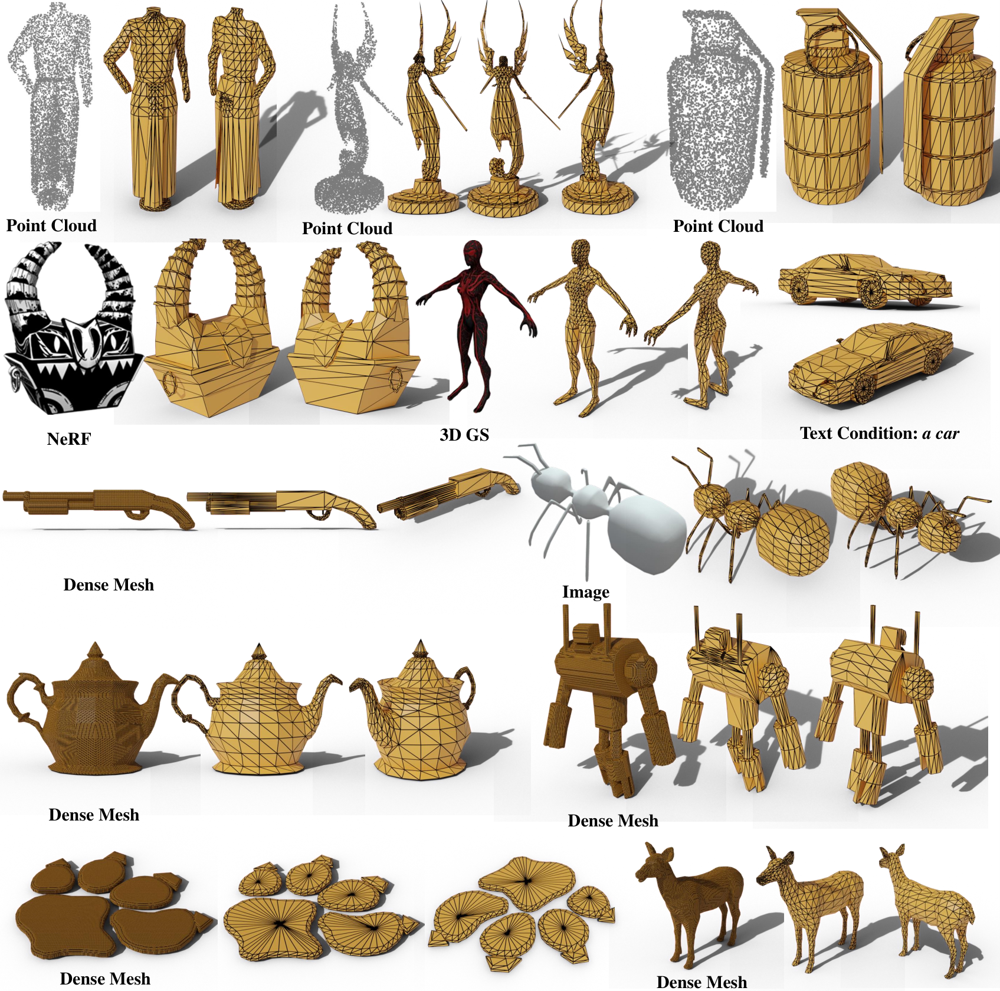

*原文 Figure 1：Figure 1 : Equipped with the newly proposed Adjacent Mesh Tokenization (AMT), MeshAnything V2 significantly surpasses MeshAnything [ 5 ] in both performance and efficiency. MeshAnything V2 generates Artist-Created Meshes (AM) up to 1600 1600 faces aligned with given shapes. Combined with various 3D asset production pipelines, it efficiently achieves high-quality, highly controllable AM generation. [查看图片来源](https://arxiv.org/html/2408.02555v3/teaser.png)*

引用来源：arxiv_2608.02711

链接：[arXiv](https://arxiv.org/abs/2408.02555)

##### EdgeRunner: Auto-regressive Auto-encoder for Artistic Mesh Generation

作者：Jiaxiang Tang, Zhaoshuo Li, Zekun Hao, Xian Liu, Gang Zeng, Ming-Yu Liu, Qinsheng Zhang

主任务：context

中文简介：

EdgeRunner针对现有自回归网格生成方法存在的完整性差、细节不足等问题，输入点云或图像条件，输出高达4000面的高质量3D网格。其核心范式是提出一种自回归自编码器（ArAE），通过新颖的网格词元化算法将三角网格高效压缩为一维令牌序列，并映射到固定长度潜空间以训练潜扩散模型。属于网格词元化自回归生成类别，该方法显著提升了训练效率和泛化能力，克服了传统方法在处理可变长度网格时的局限，实现了更优的生成质量与多样性。

*原文 Figure 1：Figure 2: Pipeline of our method . Our ArAE model compresses variable-length mesh into fixed-length latent code, which can be further used to train latent diffusion models conditioned on other input modalities, such as single-view images. [查看图片来源](https://arxiv.org/html/2409.18114v1/pipe.png)*

引用来源：arxiv_2608.02711

链接：[arXiv](https://arxiv.org/abs/2409.18114)

##### Emu3: Next-Token Prediction is All You Need

作者：Xinlong Wang, Xiaosong Zhang, Zhengxiong Luo, Quan Sun, Yufeng Cui, Jinsheng Wang, Fan Zhang, Yueze Wang, Zhen Li, Qiying Yu, Yingli Zhao, Yulong Ao, Xuebin Min, Tao Li, Boya Wu, Bo Zhao, Bowen Zhang, Lian-zi Wang, Guang Liu, Zheqi He, Xi Yang, Jingjing Liu, Yong-Hua Lin, Tiejun Huang, Zhongyuan Wang

主任务：context

中文简介：

Emu3旨在解决多模态任务中的统一建模问题，输入为图像、文本和视频序列，输出为预测的下一个令牌，支持生成与感知任务。其核心方法是摒弃扩散模型，仅依靠Next-Token Prediction范式，将多模态数据离散化为令牌序列，并在单一Transformer上进行从头训练。作为统一多模态Transformer架构的代表，它证明了自回归预测在 multimodal 领域的潜力，无需复杂的组合架构即可在生成质量和感知能力上超越SDXL等专用模型，简化了多模态智能的设计路径。

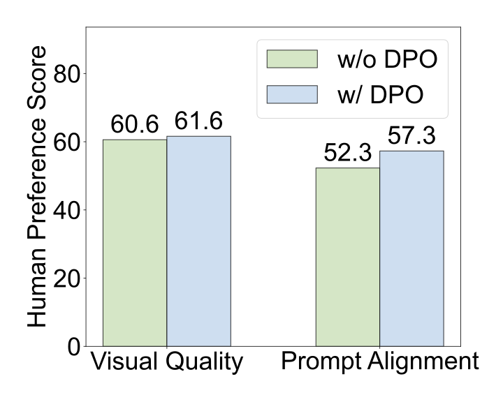

*原文 Figure 5：Figure 6: DPO improves visual quality and prompt alignment. [查看图片来源](https://arxiv.org/html/2409.18869v1/dpo_vs_qft.svg)*

引用来源：arxiv_2608.02711

链接：[arXiv](https://arxiv.org/abs/2409.18869)

##### The Scene Language: Representing Scenes with Programs, Words, and Embeddings

作者：Yun-Zhi Zhang, Zi-Zhang Li, Matt Zhou, Shangzhe Wu, Jiajun Wu

主任务：context

中文简介：

该论文提出Scene Language，旨在从文本或图像输入中推断出包含程序结构、自然语言语义和视觉嵌入的场景表示，最终输出可渲染的高质量3D/4D场景。其核心范式是结合层次化程序与自然语言描述，通过免训练推理技术从预训练语言模型中提取场景结构。与传统的场景图相比，该方法能更精确地建模实体间的层级与关系，在保持高保真度的同时实现了对复杂场景结构的显式控制与编辑，属于三维理解与生成之间的桥梁性工作。

*原文 Figure 1：Figure 2 : Overview. A Scene Language represents a scene with three components: a program consisting of entity functions, a set of words ( e.g . , pawn ) denoting the semantic class of the entity functions, and a list of embeddings ( e.g . , <z1> ) capturing the identity of each entity in the scene. Each entity function is bound with an entity class name given by a word , and maps an input embedding to an output entity of that class. Executing the program evaluates entity functions to compute the full set of entities in the scene. The resulting computation graph, illustrated on the right, captures the dependency structure among entities (indicated by arrows). The program shown is converted from our text-conditioned inference method’s output, with details included in Sec. F.2.1 ; it is written in Lisp-style syntax for brevity and is implemented with Python in practice ( Sec. 3.2 ). [查看图片来源](https://arxiv.org/html/2410.16770v2/representation.png)*

引用来源：arxiv_2608.02711

链接：[arXiv](https://arxiv.org/abs/2410.16770)

##### Scaling Mesh Generation via Compressive Tokenization

作者：Haohan Weng, Zi-Bo Zhao, Biwen Lei, Xiang-Hui Yang, Jian Liu, Zeqiang Lai, Zhuo Chen, Yu-Hong Liu, Jie Jiang, Chunchao Guo, Tong Zhang, Shenghua Gao, C. L. Philip Chen

主任务：context

中文简介：

该论文解决大规模高细节网格生成任务，输入为点云或图像条件，输出超过8K面片的精细网格。核心提出块状与补丁化词元化（BPT）方法，通过块索引和补丁聚合将网格序列长度压缩约75%，从而解锁了对高面片数网格数据的训练能力。属于网格词元化自回归生成类别，区别于传统坐标序列方法，BPT显著提升了生成鲁棒性与细节丰富度，使生成的网格拓扑准确、细节 intricate，达到了可直接用于产品级的生成水平。

*原文 Figure 2：Figure 3 : The proposed Blocked and Patchified Tokenization (BPT). (a) We convert the coordinates from the Cartesian system to block-wise indexes. The coordinates are first separated equally into several blocks. Then, vertices inside each block are located with 1-dim indexes. (b) The nearby faces are aggregated as patches to compress the mesh sequence. Each patch center is set as the vertex connected with the most unvisited faces. Subsequently, other vertices within the patch are included in the subsequence to create a complete patch. [查看图片来源](https://arxiv.org/html/2411.07025v1/tokenization2.svg)*

引用来源：arxiv_2608.02711

链接：[arXiv](https://arxiv.org/abs/2411.07025)

##### 3D Mesh Editing Using Masked LRMs

作者：William Gao, Dilin Wang, Yuchen Fan, Aljaz Bozic, Tuur Stuyck, Zhengqin Li, Zhao Dong, Rakesh Ranjan, Nikolaos Sarafianos

主任务：context

中文简介：

该论文解决3D网格编辑任务，输入为待编辑的3D形状及指定区域的单视图引导图像，输出为编辑后的完整网格。核心方法将编辑建模为条件重建问题，训练支持掩码重建的大型重建模型（LRM），在单次前向传播中保留未编辑区域几何并生成新内容。属于三维编辑类别，区别于耗时的优化方法，该方法利用多视图一致性掩码策略，在保持全局一致性的同时实现了比最先进方法快2-10倍的推理速度。

*原文 Figure 4：Figure 4 : Genus changes : Our method unlocks genus-changing edits like adding a handle or a hole to the original vase. We show the output of our model from 2 opposing views in the 3 r ​ d 3^{rd} column. [查看图片来源](https://arxiv.org/html/2412.08641v2/figs/Images/genus_nikos.png)*

引用来源：arxiv_2608.02711

链接：[arXiv](https://arxiv.org/abs/2412.08641)

##### Meshtron: High-Fidelity, Artist-Like 3D Mesh Generation at Scale

作者：Zekun Hao, David W. Romero, Tsung-Yi Lin, Ming-Yu Liu

主任务：context

中文简介：

Meshtron解决高保真3D网格生成任务，输入隐含条件，输出高达64K面片、1024级坐标分辨率的精细网格。核心采用自回归Transformer架构，结合沙漏型神经网络、截断序列训练及滑动窗口推理，有效降低显存并提升吞吐量。该工作属于网格词元化自回归生成类别，显著突破了以往方法在面片数量和坐标精度上的限制，能够生成媲美专业艺术家制作的复杂3D资产，适用于动画和游戏等高细节需求场景。

*原文 Figure 6：论文原始图 6 [查看图片来源](https://arxiv.org/html/2412.09548v1/hourglass_arch_v3.png)*

引用来源：arxiv_2608.02711

链接：[arXiv](https://arxiv.org/abs/2412.09548)

##### MetaMorph: Multimodal Understanding and Generation via Instruction Tuning

作者：Shengbang Tong, David Fan, Jiacheng Zhu, Yunyang Xiong, Xinlei Chen, Koustuv Sinha, Michael Rabbat, Yann LeCun, Saining Xie, Zhuang Liu

主任务：context

中文简介：

MetaMorph旨在通过指令微调，使预训练大语言模型同时具备视觉理解与生成能力。其输入为图文序列，输出为离散文本令牌或连续视觉令牌。核心方法提出Visual-Predictive Instruction Tuning (VPiT)，让LLM直接预测视觉令牌，发现理解能力提升能自然涌现生成能力。该工作属于统一多模态Transformer架构，区别于传统专用生成模型，它利用LLM的世界知识克服生成缺陷，证明了理解数据对生成任务的显著促进作用，实现了单一主干网络的多任务协同。

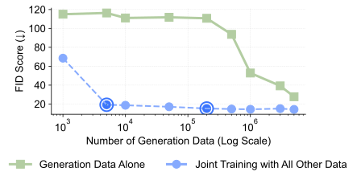

*原文 Figure 2：Figure 2 : Generation-only training vs. Joint training with other data. Training solely on generation data results in inferior performance. Joint training with additional data enables visual generation with only 5k generation data and yields high-quality outputs with 200k generation data. [查看图片来源](https://arxiv.org/html/2412.14164v1/fid_special_points_plot_new.svg)*

引用来源：arxiv_2608.02711

链接：[arXiv](https://arxiv.org/abs/2412.14164)

##### Structured 3D Latents for Scalable and Versatile 3D Generation

作者：Jianfeng Xiang, Ze-Long Lv, Sicheng Xu, Yu Deng, Ruicheng Wang, Bowen Zhang, Dong Chen, Xin Tong, Jiao-Long Yang

主任务：context

中文简介：

Structured 3D Latents (SLat)解决通用高质量3D资产生成任务，输入文本或图像，输出NeRF、3D Gaussians或网格等多种格式。核心构建统一的结构化潜空间表示，集成稀疏3D网格与密集多视图视觉特征，并训练基于整流流Transformer的生成模型。属于三维原生潜空间生成类别，区别于单一输出格式的方法，SLat支持灵活的解码目标选择及局部编辑，在大规模数据集上训练后，显著超越了现有同规模方法的生成质量与 versatility。

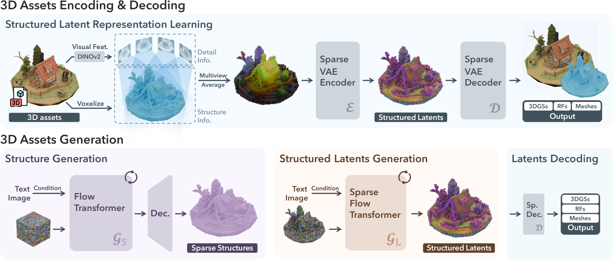

*原文 Figure 1：Figure 2 : Overview of our method. Encoding & Decoding: We adopt a structured latent representation ( SLat ) for 3D assets encoding, which defines local latents on a sparse 3D grid to represent both geometry and appearance information. It is encoded from the 3D assets by fusing and processing dense multiview visual features extracted from a DINOv2 encoder, and can be decoded into versatile output representations with different decoders. Generation: Two specialized rectified flow transformers are utilized to generate SLat , one for the sparse structure and the other for local latents attached to it. [查看图片来源](https://arxiv.org/html/2412.01506v3/pipeline_v3.png)*

引用来源：arxiv_2608.02711

链接：[arXiv](https://arxiv.org/abs/2412.01506)

##### TokenFlow: Unified Image Tokenizer for Multimodal Understanding and Generation

作者：Liao Qu, Huichao Zhang, Yiheng Liu, Xu Wang, Yi Jiang, Yiming Gao, Hu Ye, Daniel K. Du, Zehuan Yuan, Xinglong Wu

主任务：context

中文简介：

TokenFlow旨在解决多模态理解与生成中视觉信息粒度冲突的问题。输入为图像，输出为用于理解或生成的离散视觉令牌。核心提出双码本架构，解耦语义与像素级特征学习，并通过共享映射保持对齐，使模型能同时获取高层语义和细粒度视觉特征。虽主要面向2D图像，但其统一Tokenizer范式为多模态Transformer提供了基础组件，显著提升了理解性能及自回归生成质量，超越了传统单一VQ编码器的局限。

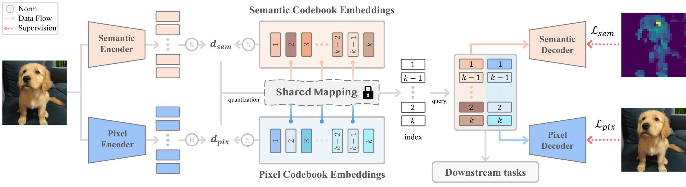

*原文 Figure 3：Figure 3 : Overview of TokenFlow. We incorporate dual encoders and codebooks with a shared mapping, enabling the joint optimization of high-level semantics and low-level pixel details. For a given input image, distances d sem d_{\text{sem}} and d pix d_{\text{pix}} are calculated from the pixel-level and semantic-level codebooks, respectively, with the final codebook index and features determined by minimizing the weighted sum d sem + w dis ⋅ d pix d_{\text{sem}}+w_{\text{dis}}\cdot d_{\text{pix}} . The resulting quantized features are independently decoded for both semantic alignment and image reconstruction training, and then concatenated to provide a unified representation for downstream tasks in understanding and generation. [查看图片来源](https://arxiv.org/html/2412.03069v2/pipeline.png)*

引用来源：arxiv_2608.02711

链接：[arXiv](https://arxiv.org/abs/2412.03069)

#### 2025

##### BAG: Body-Aligned 3D Wearable Asset Generation

作者：Zhongjin Luo, Yang Li, Mingrui Zhang, Senbo Wang, Han Yan, Xibin Song, Taizhang Shang, Wei Mao, Hongdong Li, Xiaoguang Han, Pan Ji

主任务：context

中文简介：

BAG解决可穿戴3D资产生成任务，输入为单张图像和目标人体形状/姿态，输出可自动穿戴且无穿透的3D资产。核心方法首先训练单图到多视图的一致性扩散模型，并利用ControlNet以人体表面XYZ坐标投影为控制信号，生成与身体对齐的多视图图像，再输入原生3D扩散模型生成形状，最后通过物理模拟解决穿透问题。区别于通用3D生成，BAG专门针对人体对齐约束，确保了生成资产在几何结构与语义上的可穿戴性。

*原文 Figure 5：Figure 5. Four Methods to acqure input body and image pairs. a ) SMPLX Fitting. b )Sketch-Based Modeling. c ) Virtual Try-on. d ) Manual Images Assembly. [查看图片来源](https://arxiv.org/html/2501.16177v1/images/pair-acquire.jpg)*

引用来源：arxiv_2608.02711

链接：[arXiv](https://arxiv.org/abs/2501.16177)

##### Janus-Pro: Unified Multimodal Understanding and Generation with Data and Model Scaling

作者：Xiao-Kang Chen, Zhiyu Wu, Xingchao Liu, Zi-Zheng Pan, Wen Liu, Zhen-Da Xie, Xing-Kai Yu, C. Ruan

主任务：context

中文简介：

Janus-Pro是Janus模型的进阶版本，专注于统一多模态理解与生成任务。通过优化训练策略、扩展训练数据以及扩大模型规模，它在多模态理解和文本到图像指令遵循能力上取得显著进步，同时提升了生成稳定性。虽然主要应用于二维图像领域，但其统一架构设计思路对3D多模态建模具有借鉴意义。相较于前代，Janus-Pro展示了数据与模型 Scaling 在提升统一Transformer架构性能方面的关键作用，强化了其在复杂指令下的表现。

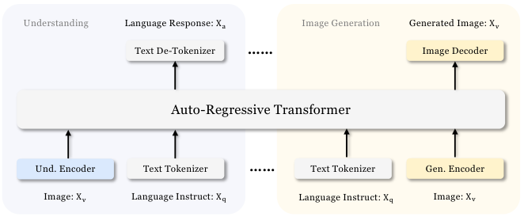

*原文 Figure 4：Figure 3: Architecture of our Janus-Pro. We decouple visual encoding for multimodal understanding and visual generation. “Und. Encoder” and “Gen. Encoder” are abbreviations for “Understanding Encoder” and “Generation Encoder”, respectively. Best viewed on screen. [查看图片来源](https://arxiv.org/html/2501.17811v1/Janus.png)*

引用来源：arxiv_2608.02711

链接：[arXiv](https://arxiv.org/abs/2501.17811)

##### Qwen2.5-VL Technical Report

作者：Shuai Bai, Ke-qin Chen, Xue-Jing Liu, Jia-Lin Wang, Wenbin Ge, Sibo Song, K. Dang, Peng Wang, Shijie Wang, Jun Tang, Humen Zhong, Yuanzhi Zhu, Mingkun Yang, Zhaohai Li, Jian-Qiang Wan, Pengfei Wang, Wei Ding, Zheren Fu, Yiheng Xu, Jiabo Ye, Xi Zhang, Tianbao Xie, Zesen Cheng, Hang Zhang, Zhibo Yang, Haiyang Xu, Junyang Lin

主任务：context

中文简介：

Qwen2.5-VL是通义千问系列的视觉语言旗舰模型，虽主要面向二维视觉，但其技术对3D领域具参考意义。它通过从头训练原生动态分辨率Vision Transformer并引入窗口注意力，实现了对不同尺寸图像及长视频的精准理解与物体定位（边界框或点）。该模型能处理复杂文档解析与时序事件定位，无需传统归一化即可感知空间尺度。其强大的视觉识别与交互代理能力，为多模态Transformer架构处理高分辨率空间数据提供了技术范式。

*原文 Figure 2：Figure 1: The Qwen2.5-VL framework demonstrates the integration of a vision encoder and a language model decoder to process multimodal inputs, including images and videos. The vision encoder is designed to handle inputs at their native resolution and supports dynamic FPS sampling. Images of varying sizes and video frames with different FPS rates are dynamically mapped to token sequences of varying lengths. Notably, MRoPE aligns time IDs with absolute time along the temporal dimension, enabling the model to better comprehend temporal dynamics, such as the pace of events and precise moment localization. The processed visual data is subsequently fed into the Qwen2.5 LM Decoder. We have re-engineered the vision transformer (ViT) architecture, incorporating advanced components such as FFN with SwiGLU activation, RMSNorm for normalization, and window-based attention mechanisms to enhance performance and efficiency. [查看图片来源](https://arxiv.org/html/2502.13923v1/figures/qwen2.5vl_arc.jpeg)*

引用来源：arxiv_2608.02711

链接：[arXiv](https://arxiv.org/abs/2502.13923)

##### TripoSG: High-Fidelity 3D Shape Synthesis using Large-Scale Rectified Flow Models

作者：Yangguang Li, Zi-Xin Zou, Zexiang Liu, De-Hui Wang, Yuan-Zhi Liang, Zhipeng Yu, Xingchao Liu, Yuanchen Guo, Ding Liang, Wanli Ouyang, Yan-Pei Cao

主任务：context

中文简介：

TripoSG致力于解决高保真3D形状生成任务，输入为单张图像，输出为与之精确对应的高 fidelity 3D网格。核心方法是采用大规模整流流Transformer（Rectified Flow Transformer），并在包含200万高质量样本的数据集上训练。其3D VAE采用混合监督策略（SDF、法线和eikonal损失）以提升重建质量。区别于此前受限于数据规模和技术探索的生成模型，TripoSG通过数据与模型的双重扩展，实现了state-of-the-art的生成 fidelity 与条件对齐能力。

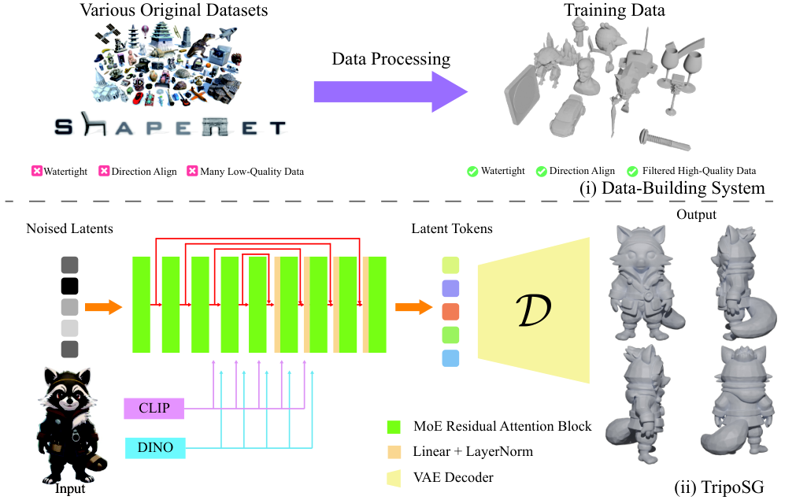

*原文 Figure 1：Figure 2 : The overview of our method consists of two main components: (i) Data-Building System and (ii) TripoSG Model. The data-building system processes the 3D models from various datasets (e.g., Objaverse and ShapeNet) through a series of data processing steps to create the training data. Our TripoSG model is then trained on this curated dataset for high-fidelity shape generation from a single input image. [查看图片来源](https://arxiv.org/html/2502.06608v3/pipeline.png)*

引用来源：arxiv_2608.02711

链接：[arXiv](https://arxiv.org/abs/2502.06608)

##### Cube: A Roblox View of 3D Intelligence

作者：K. Bhat, Nishchaie Khanna, Karun Channa, Tinghui Zhou, Yiheng Zhu, Xiaoxia Sun, Charles Shang, Anirudh Sudarshan, Maurice Chu, Daiqing Li, Kangle Deng, J. Fauconnier, Tijmen Verhulsdonck, Maneesh Agrawala, Kayvon Fatahalian, Alexander Weiss, C. Reiser, Ravi Kiran Chirravuri, Ravali Kandur, Alejandro Pelaez, Akash Garg, M. Palleschi, Jessica Wang, Skylar Litz, Leo Liu, Anyi Li, D. Harmon, Derek Liu, Liangjun Feng, Denis Goupil, Lukasz Kuczynski, J. Yoon, Naveen Marri, Peiye Zhuang, Yinan Zhang, Brian Yin, Hao-Miao Jiang, Marcel van Workum, Thomas Lane, Bryce Erickson, Salil Pathare, Kyle Price, Anupam Singh, David Baszucki

主任务：context

中文简介：

Cube项目旨在构建服务于Roblox平台的3D智能基础模型，支持从物体生成、角色绑定到行为脚本生成的全流程。论文重点介绍了其3D形状分词器方案，将3D几何转化为统一令牌接口，从而支持文本到形状、形状到文本及场景生成等应用，并能与大语言模型协作进行场景推理。作为迈向统一3D基础模型的第一步，它区别于单一任务模型，强调通过统一架构打破模态壁垒，实现真正的多模态交互与理解。

*原文 Figure 2：Figure 2 : Overview. We present an important step towards the foundation model for 3D intelligence. Specifically, our report focuses on 3D shape tokenization—a technique for converting between shapes and discrete tokens. We also demonstrate how our tokenization scheme enables multiple applications including text-to-shape generation, shape-to-text generation, and text-to-scene generation. [查看图片来源](https://arxiv.org/html/2503.15475v3/overview_v2.png)*

引用来源：arxiv_2608.02711

链接：[arXiv](https://arxiv.org/abs/2503.15475)

##### SparseFlex: High-Resolution and Arbitrary-Topology 3D Shape Modeling

作者：Xianglong He, Zi-Xin Zou, Chia-Hao Chen, Yuanchen Guo, Ding Liang, Chun Yuan, Wanli Ouyang, Yan-Pei Cao, Yangguang Li

主任务：context

中文简介：

SparseFlex旨在解决高分辨率、任意拓扑结构（包括开放表面和复杂内部）的三维网格建模难题。它提出一种稀疏结构化等值面表示，结合Flexicubes精度与稀疏体素结构，仅对表面相邻区域计算，并引入视锥感知切片体素训练策略以降低显存。基于此表示，论文训练了VAE和整流流Transformer进行生成。与前序隐式场方法需代价高昂的水密转换不同，该方法支持直接从渲染损失进行可微分网格重建，实现了高保真度生成。

*原文 Figure 1：Figure 2 : Overview of the SparseFlex VAE pipeline. SparseFlex VAE takes point clouds sampled from a mesh as input, voxelizes them, and aggregates their features into each voxel. A sparse transformer encoder-decoder compresses the structured feature into a more compact latent space, followed by a self-pruning upsampling for higher resolution. Finally, the structured features are decoded to SparseFlex through a linear layer. Using the frustum-aware section voxel training strategy, we can train the entire pipeline more efficiently by rendering loss. [查看图片来源](https://arxiv.org/html/2503.21732v1/figs/pipeline.png)*

引用来源：arxiv_2608.02711

链接：[arXiv](https://arxiv.org/abs/2503.21732)

##### PartField: Learning 3D Feature Fields for Part Segmentation and Beyond

作者：Minghua Liu, M. Uy, Donglai Xiang, Hao Su, Sanja Fidler, Nicholas Sharp, Jun Gao

主任务：context

中文简介：

该论文解决三维部件分割与理解任务，输入为三维形状，输出层级化的部件分解及特征场。核心方法提出PartField，一种前馈式学习框架，通过对比学习蒸馏2D和3D部件提议，生成连续的三维特征场。无需预定义模板或文本标签，即可对开放世界三维形状进行类无关的部件聚类。区别于耗时优化的方法，PartField仅需单次前馈推理，速度显著提升，并支持共分割等下游任务，属于三维理解类别中的部件结构化分析。

*原文 Figure 3：Figure 4 : (Left) A point can belong to multiple parts at different scales. (Upper Right) Prior works [ 21 , 69 ] utilize pull and push losses to directly minimize or maximize the feature distances between point pairs, requiring an additional scaling condition to learn point features at different scales. (Lower Right) Our method employs a triplet loss that only encourages the relative relations between points within a triplet, enabling self-contained features ( sim ​ ( f ⁡ ( A ) , f ⁡ ( B ) ) > sim ​ ( f ⁡ ( A ) , f ⁡ ( C ) ) > sim ​ ( f ⁡ ( A ) , f ⁡ ( D ) ) \text{sim}(f(A),f(B))>\text{sim}(f(A),f(C))>\text{sim}(f(A),f(D)) ) that support multi-scale parts without need of scaling condition. [查看图片来源](https://arxiv.org/html/2504.11451v1/figures/loss.png)*

引用来源：arxiv_2608.02711

链接：[arXiv](https://arxiv.org/abs/2504.11451)

##### Seedream 3.0 Technical Report

作者：Yu Gao, Lixue Gong, Qiushan Guo, Xiaoxia Hou, Zhichao Lai, Fan-Shi Li, Liang Li, Xiaochen Lian, Chao Liao, Liyang Liu, Wei Liu, Yichun Shi, Shiqi Sun, Yu-Chen Tian, Zhi Tian, Peng Wang, Rui Wang, Xuanda Wang, Xun Wang, Ye Wang, Guofeng Wu, Jie Wu, X. Xia, Xuefeng Xiao, Zhonghua Zhai, Xinyu Zhang, Qi Zhang, Yuwei Zhang, Shijia Zhao, Jianchao Yang, Wei-Lin Huang

主任务：context

中文简介：

该论文主要介绍Seedream 3.0，一个高性能中英双语图像生成基础模型，而非直接针对三维任务。其核心改进包括缺陷感知数据构建、混合分辨率训练及基于VLM的奖励模型优化，实现了高分辨率和高保真度的文本渲染。尽管摘要提及了通用生成能力的提升，但未涉及三维资产的生成、编辑或理解机制。因此，依据给定的三维领域分类契约，该论文不属于上述任何三维特定类别，故在此不作三维领域的详细技术归类介绍。

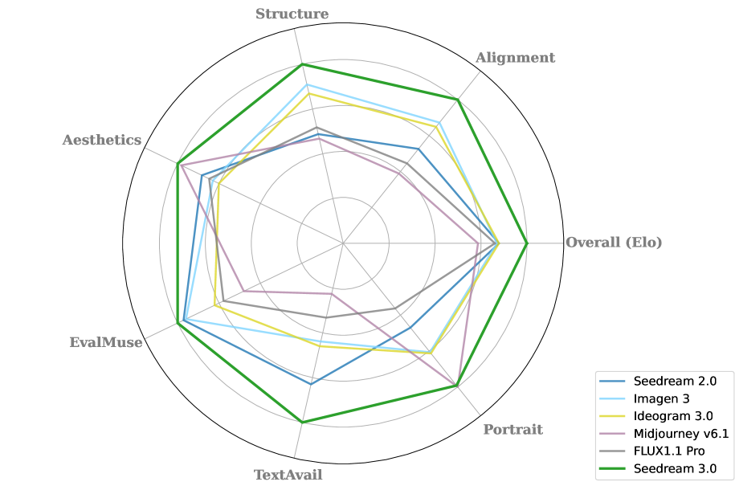

*原文 Figure 1：Figure 1 : Seedream 3.0 demonstrates outstanding performance across all evaluation aspects. Due to missing data, the Portrait result of Imagen 3 and overall result of Seedream 2.0 are represented by the average values of other models. In addition, Seedream 3.0 ranks first at Artificial Analysis Text to Image Model Leaderboard with an Arena ELO score of 1158 at 17.0K Appearances at the time of publication 1 1 1 https://artificialanalysis.ai/text-to-image/arena?tab=Leaderboard . [查看图片来源](https://arxiv.org/html/2504.11346v3/x1.png)*

引用来源：arxiv_2608.02711

链接：[arXiv](https://arxiv.org/abs/2504.11346)

##### Transfer between Modalities with MetaQueries

作者：Xichen Pan, Satya Narayan Shukla, Aashu Singh, Zhuokai Zhao, Shlok Kumar Mishra, Jialiang Wang, Zhiyang Xu, Jiuhai Chen, Kunpeng Li, Felix Juefei-Xu, Ji Hou, Saining Xie

主任务：context

中文简介：

该论文解决多模态模型中理解与生成的对齐任务，特别是知识增强图像生成。核心方法引入MetaQueries，一组可学习查询作为自回归多模态LLM与扩散模型间的接口。通过将LLM的潜在状态连接至扩散解码器，该方法在冻结LLM主干的情况下实现高质量生成，简化了训练流程。虽然主要应用于图像，但其通过轻量级接口整合不同模态生成器的思路，为统一多模态Transformer架构提供了高效的知识迁移方案，具有跨模态扩展潜力。

*原文 Figure 5：Figure 4 : Overview of instruction tuning data curation pipeline. We group images from web corpora based on caption similarity using the SigLIP ( Zhai et al., 2023 ) model, then construct instruction-tuning data from these image pairs using an MLLM. [查看图片来源](https://arxiv.org/html/2504.06256v1/data.png)*

引用来源：arxiv_2608.02711

链接：[arXiv](https://arxiv.org/abs/2504.06256)

##### BLIP3-o: A Family of Fully Open Unified Multimodal Models-Architecture, Training and Dataset

作者：Jiuhai Chen, Zhiyang Xu, Xichen Pan, Yushi Hu, Can Qin, Tom Goldstein, Lifu Huang, Tianyi Zhou, Saining Xie, Silvio Savarese, Le Xue, Caiming Xiong, Ran Xu

主任务：context

中文简介：

该论文研究统一多模态模型中的图像理解与生成任务，旨在优化架构与训练策略。核心方法引入BLIP3-o系列模型，采用扩散Transformer生成CLIP图像特征，替代传统的VAE表示，并提出先理解后生成的顺序预训练策略。这种方法在保持理解能力的同时提升了生成质量与训练效率。虽然主要聚焦图像，但其统一架构设计为多模态融合提供了新范式，属于统一多模态Transformer架构，强调了自回归与扩散模型的结合优势。

*原文 Figure 1：Figure 1: The architecture of BLIP3-o. For image understanding part, we use CLIP to encode the image and compute the cross entropy loss between the target text token and predicted text token. For image generation part, autoregressive model first generates a sequence of intermediate visual features, which are then used as conditioning inputs to a diffusion transformer that generates CLIP image features to approximate the ground-truth CLIP features. By using CLIP encoder, image understanding and image generation share the same semantic space, effectively unifying these two tasks. [查看图片来源](https://arxiv.org/html/2505.09568v1/fig1.png)*

引用来源：arxiv_2608.02711

链接：[arXiv](https://arxiv.org/abs/2505.09568)

##### Emerging Properties in Unified Multimodal Pretraining

作者：Chao-Rui Deng, Deyao Zhu, Kunchang Li, Chenhui Gou, Feng Li, Zeyu Wang, Shu Zhong, Weihao Yu, Xiao-Ping Nie, Ziang Song, Guang Shi, Haoqi Fan

主任务：context

中文简介：

该论文致力于统一多模态理解与生成任务，输入涵盖文本、图像、视频及网页数据，输出包括理解答案及生成内容（如图像、三维操作）。核心方法介绍BAGEL模型，这是一个在万亿级交错多模态数据上预训练的解码器-only基础模型。通过大规模数据缩放，模型涌现出复杂的多模态推理能力。区别于专用模型，BAGEL在单一架构下同时支持高质量的理解与生成，包括三维操纵，属于统一多模态Transformer架构的前沿探索。

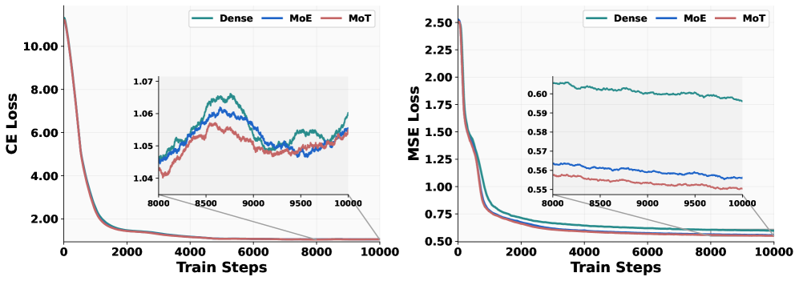

*原文 Figure 3：Figure 3 : Loss curves of various designs. CE loss and MSE loss are computed on multimodal understanding and generation tasks, respectively. Ablation experiments are carried out on a 1.5B LLM. The sampling ratio for generation and understanding data is set at 4:1. [查看图片来源](https://arxiv.org/html/2505.14683v3/x3.png)*

引用来源：arxiv_2608.02711

链接：[arXiv](https://arxiv.org/abs/2505.14683)

##### Sparc3D: Sparse Representation and Construction for High-Resolution 3D Shapes Modeling

作者：Zhihao Li, Yufei Wang, Heliang Zheng, Yi-Hao Luo, Bihan Wen

主任务：context

中文简介：

该论文解决高保真三维形状生成任务，输入为原始网格，输出高分辨率三维表面。核心方法提出SparC框架，结合稀疏可变形移动立方体表示SparseCubes与基于稀疏卷积的SparConv-VAE。SparseCubes将网格转化为稀疏立方体上的符号距离场，实现任意拓扑的高分辨率表面重建。相比传统VAE加扩散的两阶段流程，该方法避免了模态不匹配导致的细节丢失，实现了近无损重建，属于三维原生潜空间生成路线的高效改进。

*原文 Figure 1：Figure 1: Sparc3D Reconstruction Results. Leveraging our sparse deformable marching cubes ( Sparcubes ) representation and sparse convolutional VAE ( Sparconv-VAE ), our method achieves state-of-the-art reconstruction quality on challenging 3D inputs. It robustly handles open surfaces (automatically closed into watertight meshes), recovers hidden interior structures, and faithfully reconstructs highly complex geometries (see zoom-in views, top to bottom). All outputs are fully watertight and 3D-printable, demonstrating the potential of our framework for high-resolution 3D mesh generation. Best viewed with zoom-in. [查看图片来源](https://arxiv.org/html/2505.14521v3/teaser.png)*

引用来源：arxiv_2608.02711

链接：[arXiv](https://arxiv.org/abs/2505.14521)

##### Auto-Regressive Surface Cutting

作者：Yang Li, Victor Cheung, Xinhai Liu, Yuguang Chen, Zhongjin Luo, Biwen Lei, Haohan Weng, Zi-Bo Zhao, Jingwei Huang, Zhuo Chen, Chunchao Guo

主任务：context

中文简介：

SeamGPT解决网格表面切割任务，输入网格顶点与边构成的点云条件，输出量化3D坐标形式的切割缝序列。核心方法将表面切割建模为下一个Token预测任务，利用类GPT的Transformer自回归地生成分割线，模仿专业工作流以确保证语义连贯性。区别于产生过度碎片化图集的传统算法，它能生成清洁边界并辅助部件分解，适用于UV展开等图形学任务，属于网格词元化自回归生成技术在几何处理中的应用。

*原文 Figure 2：Figure 2: SeamGPT architecture: Point cloud encoder extracts shape context; Causal transformer decoder generates axis-ordered seam coordinates. Color indicates the prediction order is of the seam segments (red to blue). [查看图片来源](https://arxiv.org/html/2506.18017v1/figs/pipeline.jpg)*

引用来源：arxiv_2608.02711

链接：[arXiv](https://arxiv.org/abs/2506.18017)

##### EditP23: 3D Editing via Propagation of Image Prompts to Multi-View

作者：Roi Bar-On, Dana Cohen-Bar, Daniel Cohen-Or

主任务：context

中文简介：

EditP23解决无掩码三维编辑任务，输入原始视图图像及其用户编辑后的对应图像，输出多视角一致的编辑后3D表示。核心方法是将2D图像编辑提示传播至预训练多视图扩散模型的潜空间中，引导编辑感知流在不同视图间 coherent 传播。区别于依赖文本提示或显式空间掩码的传统方法，该前馈式方法无需优化即可保持对象身份、结构与外观的一致性，实现了直观且高效的图像驱动三维编辑。

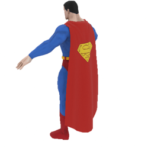

*原文 Figure 8：Figure 7 . Ablation Study of the Edit-Aware Denoising Mechanism. This figure compares our full method against two ablated variants: SDEdit and FlowEdit. For each edit request (“Cross Arms” and “Wear Tuxedo”) we show the target edited view provided to all methods (second row), followed by the source object, rendered from two alternative viewpoints. Rows 4-5 compares the editing results when applying SDEdit, FlowEdit, and our approach on the mv-grid. [查看图片来源](https://arxiv.org/html/2506.20652v1/images/ablations/ex2/src_mv_1_0.png)*

引用来源：arxiv_2608.02711

链接：[arXiv](https://arxiv.org/abs/2506.20652)

##### Hunyuan3D 2.1: From Images to High-Fidelity 3D Assets with Production-Ready PBR Material

作者：Team Hunyuan3D, Shuhui Yang, Mingxin Yang, Yifei Feng, Xin Huang, Sheng Zhang, Zebin He, Di Luo, Haolin Liu, Yunfei Zhao, Qin Lin, Zeqiang Lai, Xiang-Hui Yang, Huiwen Shi, Zi-Bo Zhao, Bowen Zhang, Hongyu Yan, Li-Fu Wang, Si-Ya Liu, Ji-Hong Zhang, Meng-Ya Chen, Liang Dong, Y. Jia, Yu-Xin Cai, Jia-Ao Yu, Y. Tang, Dong-Lin Guo, Jun-Lin Yu, Hao Zhang, Zhengfeng Ye, Peng He, Runzhou Wu, Shida Wei, Chao Zhang, Yonghao Tan, Yifu Sun, Lin Niu, Shirui Huang, Bo Zheng, Shu Liu, Shilin Chen, Xiang Yuan, Xiaofeng Yang, Kai Liu, Jian-Chen Zhu, Peng Chen, Tian-Yu Liu, Di Wang, Yu-Hong Liu, Linus, Jie Jiang, Jingwei Huang, Chunchao Guo

主任务：context

中文简介：

Hunyuan3D 2.1旨在提供从图像到高保真3D资产生成的完整技术教程与系统案例。输入为图像，输出包含生产就绪PBR材质的高分辨率3D模型。系统核心由Hunyuan3D-DiT形状生成器和Hunyuan3D-Paint纹理合成器组成。文章详细阐述了数据处理、模型架构、训练策略及评估指标。作为上下文文献，它不仅展示了具体的生成管线，更为博士生理解如何构建、微调及部署鲁棒的3D生成模型提供了标准化的工程实践参考。

*原文 Figure 3：Figure 3: Overview of DiT block. We adopt the DiT implemented by Hunyuan-DiT [ 4 ] in our pipeline. [查看图片来源](https://arxiv.org/html/2506.15442v1/blocks.svg)*

引用来源：arxiv_2608.02711

链接：[arXiv](https://arxiv.org/abs/2506.15442)

##### Pro3D-Editor : A Progressive-Views Perspective for Consistent and Precise 3D Editing

作者：Yang Zheng, Mengqi Huang, Nan Chen, Z. Mao

主任务：context

中文简介：

该论文针对文本引导的三维编辑任务，旨在根据指令精确修改局部区域并保持多视图一致性。核心方法提出Pro3D-Editor框架，采用“渐进式视图”范式，通过主视图采样器选取显著视图，利用MoVE-LoRA将编辑语义传播至关键视图，最后由全视图精炼器完成三维重构。与传统无差别编辑各视图的方法不同，该方法显式建模跨视图依赖关系，有效解决了多视图编辑不一致的问题，属于三维编辑类别。

*原文 Figure 5：Figure 5: Quantitative comparison using GPTEval3D [ 40 ] . The blue segments indicate the selection rate of Pro3D-Editor , while the orange segments represent that of the baseline. A higher selection rate indicates better editing performance of the corresponding method. [查看图片来源](https://arxiv.org/html/2506.00512v2/gpteval3d.svg)*

引用来源：arxiv_2608.02711

链接：[arXiv](https://arxiv.org/abs/2506.00512)

##### OmniPart: Part-Aware 3D Generation with Semantic Decoupling and Structural Cohesion

作者：Yu-nuo Yang, Yufan Zhou, Yuan-Chen Guo, Zi-Xin Zou, Yukun Huang, Ying-Tian Liu, Hao Xu, Ding Liang, Yan-Pei Cao, Xihui Liu

主任务：context

中文简介：

OmniPart解决带有显式部件结构的三维生成任务，输入灵活控制的2D部件掩码，输出具有语义解耦且结构 cohesive 的3D部件化资产。核心范式将任务解耦为两步：首先通过自回归模块生成受2D掩码引导的3D边界框序列进行结构规划；随后利用空间条件的整流流模型同步合成所有部件。区别于生成整体单调形状的方法，它支持用户定义部件粒度与精确定位，实现了可解释、可编辑的部件结构化生成。

*原文 Figure 7：Figure 7. Qualitative results of our complete pipeline. We show the input image and 2D masks, along with the generated bounding boxes, individually generated part meshes, and the combined full-object mesh. As illustrated, our method enables precise control over part granularity via 2D masks and produces high-quality geometry and texture. The generated 3D parts exhibit low semantic entanglement and high structural cohesion, demonstrating the effectiveness of our part-aware 3D content generation. [查看图片来源](https://arxiv.org/html/2507.06165v1/our_results.png)*

引用来源：arxiv_2608.02711

链接：[arXiv](https://arxiv.org/abs/2507.06165)

##### Ultra3D: Efficient and High-Fidelity 3D Generation with Part Attention

作者：Yiwen Chen, Zhihao Li, Yikai Wang, Hu Zhang, Qin Li, Chi Zhang, Guosheng Lin

主任务：context

中文简介：

Ultra3D解决高效高保真三维生成任务，输入文本或图像条件，输出高分辨率稀疏体素3D资产。核心方法是两阶段扩散框架：首阶段利用VecSet生成粗略布局以减少Token数量；次阶段引入“部件注意力”机制，将计算限制在语义一致的部件区域内，避免全局注意力的二次复杂度。该方法在保持几何连续性的同时显著加速生成过程，区别于传统低效的全局注意力模型，属于结合部件感知的三维原生潜空间生成路线。

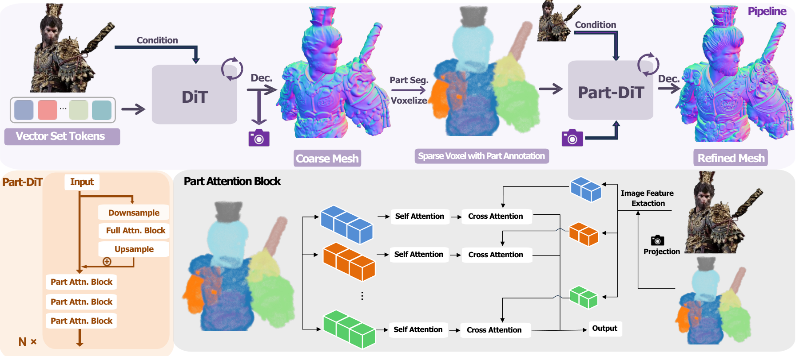

*原文 Figure 3：Figure 3: Pipeline Overview. We introduce Ultra3D , an efficient and high-quality 3D generation framework that first generates sparse voxel layout via VecSet and then refines it by generating per-voxel latent. The core of Ultra3D is Part Attention, an efficient localized attention mechanism that performs attention computation independently within each part group. Besides, when the input condition is an image, each part group performs cross attention only with the image tokens onto which its voxel tokens are projected. [查看图片来源](https://arxiv.org/html/2507.17745v3/pip_pdf.png)*

引用来源：arxiv_2608.02711

链接：[arXiv](https://arxiv.org/abs/2507.17745)

##### FASTMESH: Efficient Artistic Mesh Generation Via Component Decoupling

作者：Jeonghwan Kim, Yushi Lan, Armando Fortes, Yongwei Chen, Xingang Pan

主任务：context

中文简介：

该论文解决艺术风格网格的高效生成任务，输入为文本或图像条件，输出三角网格模型。核心方法FASTMesh将顶点和面解耦：首先用自回归模型生成顶点，大幅减少令牌冗余；随后用双向Transformer一步完成面构建。区别于传统将网格序列化为长令牌序列的方法，该框架将令牌数量降至现有的23%，并通过保真度增强器优化顶点位置。实验显示其生成速度提升8倍以上，同时保持了更高的网格质量，适合高效艺术创作。

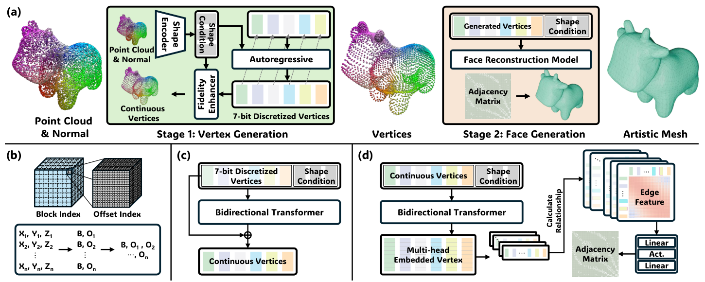

*原文 Figure 1：Figure 2 : (a) Overall architecture of FastMesh . Note that our pipeline consists of two stages, where we first generate the vertices from the shape condition and then construct the faces to complete the mesh. (b) Visualization of the block-wise indexing scheme introduced by BPT [ 48 ] , which we adopt for vertex tokenization. (c) Structure of the fidelity enhancer in the first stage. The 7-bit discretized vertices and shape condition are fed into the network to estimate the offset that can make the coordinate a continuous value. (d) Details of face reconstruction. The generated vertices are embedded to capture inter-vertex relationships in a multi-head manner. Each head computes a matrix, where the output represents one feature dimension used in edge prediction. [查看图片来源](https://arxiv.org/html/2508.19188v3/pipeline.png)*

引用来源：arxiv_2608.02711

链接：[arXiv](https://arxiv.org/abs/2508.19188)

##### Qwen-Image Technical Report

作者：Chen-Fei Wu, Jiahao Li, Jingren Zhou, Junyang Lin, Kai-Yuan Gao, Kun Yan, Shengming Yin, Shuai Bai, Xiao Xu, Yi-Lei Chen, Yu-Xiang Chen, Ze-Cheng Tang, Zekai Zhang, Zhengyi Wang, An Yang, Bo-Wen Yu, Chen Cheng, Dayiheng Liu, Deqing Li, Hang Zhang, Hao Meng, Hu Wei, Ji-Li Ni, Kai Chen, Kuang Cao, Liang Peng, Lin Qu, Minggang Wu, Peng Wang, Shuting Yu, Tingkun Wen, Wen-Sen Feng, Xiao-Xue Xu, Yi Wang, Yichang Zhang, Yong-An Zhu, Yujian Wu, Yu-Jiao Cai, Ze-Yang Liu

主任务：context

中文简介：

Qwen-Image主要解决复杂文本渲染及图像编辑任务，输入文本或图像，输出高质量生成或编辑后的图像。核心方法采用渐进式课程学习策略提升文本渲染能力，并引入双编码机制：分别利用视觉语言模型和VAE提取语义与重建表示，以平衡编辑中的语义一致性与视觉保真度。虽然本文聚焦2D图像，但其多任务训练范式及对潜在表示对齐的改进，为处理跨模态一致性提供了重要参考，属于上下文相关的2D生成基础模型。

*原文 Figure 7：Figure 6: Overview of the Qwen-Image architecture. It adopts a standard double-stream MMDiT architecture. The input representations are provided by a frozen Qwen2.5-VL and a VAE encoder. The model employs RMSNorm ( Zhang & Sennrich, 2019 ) for QK-Norm, while all other normalization layers use LayerNorm. Additionally, we design a new positional encoding scheme, MSRoPE (Multimodal Scalable RoPE), to jointly encode positional information for both image and text modalities. [查看图片来源](https://arxiv.org/html/2508.02324v1/figure_qwen-image-arch2.png)*

引用来源：arxiv_2608.02711

链接：[arXiv](https://arxiv.org/abs/2508.02324)

##### Hunyuan3D Studio: End-to-End AI Pipeline for Game-Ready 3D Asset Generation

作者：Tencent Hunyuan3D

主任务：context

中文简介：

该论文介绍Hunyuan3D Studio，解决从概念图或文本生成游戏就绪3D资产的任务，输入为单张图像或文本，输出含优化几何和PBR纹理的完整3D模型。核心方法是集成部件级生成、多边形生成和语义UV映射等神经模块的端到端流水线。区别于仅生成粗糙几何的研究型模型，该框架专注于满足游戏引擎的严格技术要求，自动化了劳动密集型的工作流，显著降低了3D内容创作门槛，实现了从创意意图到技术资产的无缝桥接。

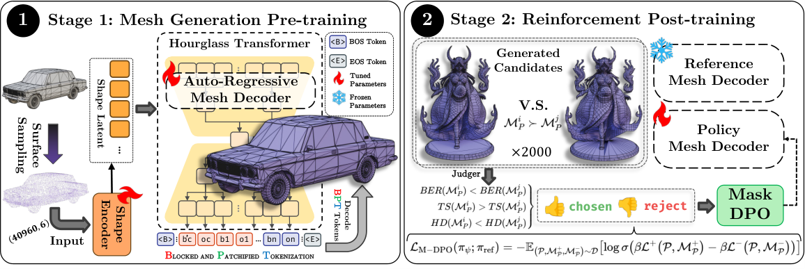

*原文 Figure 16：Figure 15: Mesh-RFT Framework Overview. The pipeline comprises two stages: 1) Mesh Generation Pre-training using an Hourglass AutoRegressive Transformer and a Shape Encoder; and 2) Reinforcement Post-training which employs Mask DPO with reference and policy networks for subsequent refinement. [查看图片来源](https://arxiv.org/html/2509.12815v1/pipeline.png)*

引用来源：arxiv_2608.02711

链接：[arXiv](https://arxiv.org/abs/2509.12815)

##### HunyuanImage 3.0 Technical Report

作者：Tencent Hunyuan Team

主任务：context

中文简介：

该论文介绍HunyuanImage 3.0，旨在统一多模态理解与生成任务，输入为文本或多模态上下文，输出高质量图像或语义分析。核心方法是基于自回归框架的原生多模态模型，采用混合专家（MoE）架构，结合原生思维链和渐进式预训练策略。作为目前最大的开源图像生成模型之一，它区别于传统的纯生成模型，通过统一的自回归范式处理理解和生成，在文本-图像对齐和视觉质量上达到最先进水平，促进了多模态生态的发展。

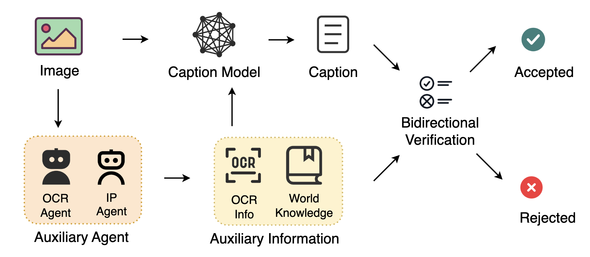

*原文 Figure 2：Figure 2 : Image Captioning Pipeline. [查看图片来源](https://arxiv.org/html/2509.23951v3/assets/data/caption_0.png)*

引用来源：arxiv_2608.02711

链接：[arXiv](https://arxiv.org/abs/2509.23951)

##### Seedream 4.0: Toward Next-generation Multimodal Image Generation

作者：Yun-Peng Chen, Yu Gao, Lixue Gong, Meng-Hao Guo, Qiushan Guo, Zhiyao Guo, Xiaoxia Hou, Wei-Lin Huang, Yixuan Huang, Xiaowen Jian, Huafeng Kuang, Zhichao Lai, Fan-Shi Li, Liang Li, Xiaochen Lian, Chao Liao, Liyang Liu, Wei Liu, Yanzuo Lu, Zheng-Xiong Luo, Tongtong Ou, Guangchao Shi, Yichun Shi, Shiqi Sun, Yu-Chen Tian, Zhi Tian, Peng Wang, Rui Wang, Xun Wang, Ye Wang, Guofeng Wu, Jie Wu, Wenxu Wu, Yonghui Wu, X. Xia, Xuefeng Xiao, Shuang Xu, Xin Yan, Ceyuan Yang, Jianchao Yang, Zhonghua Zhai, Chen-Lin Zhang, Heng Zhang, Qi Zhang, Xinyu Zhang, Yuwei Zhang, Shijia Zhao, Wenliang Zhao, W. Zhu

主任务：context

中文简介：

该论文提出Seedream 4.0，解决文本到图像合成、图像编辑及多图像组合任务，输入为文本或参考图像，输出高分辨率图像。核心方法采用高效扩散Transformer与强力VAE，显著减少图像令牌数量，并结合微调VLM进行多模态后训练。区别于传统T2I系统，它支持上下文推理和多图像参考，通过对抗蒸馏等技术实现快速推理。该模型将生成系统扩展为交互式多维创作平台，在复杂编辑和多输出生成任务中表现卓越。

*原文 Figure 1：Figure 1 : Overall evaluation. Left: Text-to-Image results; Right: Image-Editing results. The Elo scores are obtained from the Artificial Analysis Arena. Seedream 4.0 ranks first in both T2I and image-editing leaderboards, by 09/18/2025. [查看图片来源](https://arxiv.org/html/2509.20427v3/x1.png)*

引用来源：arxiv_2608.02711

链接：[arXiv](https://arxiv.org/abs/2509.20427)

##### X-Part: high fidelity and structure coherent shape decomposition

作者：Xinhao Yan, Jiachen Xu, Yang Li, Changfeng Ma, Yunhan Yang, Chunshi Wang, Zi-Bo Zhao, Zeqiang Lai, Yunfei Zhao, Zhuo Chen, Chunchao Guo

主任务：context

中文简介：

该论文针对部件级3D形状分解与生成任务，输入为整体3D对象，输出具有语义意义且结构连贯的部件集合。核心方法X-Part利用边界框作为提示注入逐点语义特征，实现高保真度的可控分解，并提供交互式编辑流水线。区别于现有缺乏可控性或语义分解较差的方法，该工作强调部件的结构一致性和几何保真度，为网格重拓扑和3D打印等下游应用提供了生产就绪、可编辑且结构健全的3D资产生成新范式。

*原文 Figure 2：Figure 1: Architecture of 𝒳 \mathcal{X} -Part . Given input point cloud, per-point feature and part bounding boxes are extracted from P 3 ​ -SAM \text{P}^{3}\text{-SAM} . Global and part conditions are obtained by stacking geometry token with interpolated semantic features. They are injected to multi-part diffusion process to guide shape decomposition. [查看图片来源](https://arxiv.org/html/2509.08643v2/figs/pipeline_v3.jpg)*

引用来源：arxiv_2608.02711

链接：[arXiv](https://arxiv.org/abs/2509.08643)

##### BLIP3o-NEXT: Next Frontier of Native Image Generation

作者：Jiuhai Chen, Le Xue, Zhiyang Xu, Xichen Pan, Shusheng Yang, Can Qin, An Yan, Honglu Zhou, Zeyuan Chen, Lifu Huang, Tianyi Zhou, Junnan Li, Silvio Savarese, Caiming Xiong, Ran Xu

主任务：context

中文简介：

BLIP3o-NEXT主要推进原生图像生成与编辑领域，虽非纯3D论文，但其架构对多模态生成有借鉴意义。输入多模态条件，输出高保真图像。核心采用“自回归+扩散”混合架构：自回归模型先生成离散图像令牌，其隐藏状态作为条件引导扩散模型生成细节。该设计结合了自回归模型的推理优势与扩散模型的渲染能力。区别于单一架构，它强调数据规模、强化学习后训练及架构扩展性对性能的决定性作用，属统一多模态生成范式。

*原文 Figure 1：Figure 1: The architecture of BLIP3o-NEXT (left) and its reinforcement learning pipeline (right). BLIP3o-NEXT adopts an Autoregressive (AR) + Diffusion design, where the AR module autoregressively generates image conditions for the diffusion model. The model is jointly optimized with both AR and diffusion objectives. During reinforcement learning, rollouts are rendered from the diffusion transformer, and policy optimization is performed directly on the AR model, enabling seamless integration with existing RL infrastructures originally developed for language models. [查看图片来源](https://arxiv.org/html/2510.15857v1/figure1.png)*

引用来源：arxiv_2608.02711

链接：[arXiv](https://arxiv.org/abs/2510.15857)

##### Ming-UniVision: Joint Image Understanding and Generation with a Unified Continuous Tokenizer

作者：Ziyuan Huang, Dan-Dan Zheng, Cheng Zou, Rui Liu, Xiao-Long Wang, Kaixiang Ji, Weilong Chai, Jian-Xin Sun, Li-Bin Wang, Yong-Jie Lv, Tao Huang, Jiajia Liu, Qingpei Guo, Ming Yang, Jingdong Chen, Jun Zhou

主任务：context

中文简介：

该论文解决视觉理解与生成的统一建模任务，输入为图像或文本，输出为对应的语义描述或生成图像。核心方法提出MingTok连续潜空间分词器，通过三阶段架构平衡理解所需的高维特征与生成所需的紧凑代码，并在Ming-UniVision中实现统一的自回归下一令牌预测。区别于传统离散分词器，该方法消除了量化误差，在共享连续空间中无缝支持多轮交互任务， reconciling 了理解与生成对分词器的竞争性需求。

*原文 Figure 2：Figure 2 : The model architecture and the training objectives of MingTok . MingTok performs image compression, semantic decoding and image reconstruction sequentially through low-level encoder, semantic decoder, and pixel decoder. During training, both the image latent and the semantic features are supervised by pre-trained visual encoders with masked feature prediction, while the pixel decoder is trained by masked and unmasked image reconstruction. [查看图片来源](https://arxiv.org/html/2510.06590v1/0830-MingTok-structure.png)*

引用来源：arxiv_2608.02711

链接：[arXiv](https://arxiv.org/abs/2510.06590)

##### PartNeXt: A Next-Generation Dataset for Fine-Grained and Hierarchical 3D Part Understanding

作者：Penghao Wang, Yi He, Xin Lv, Yukai Zhou, Lan Xu, Jingyi Yu, Jia-Yuan Gu

主任务：context

中文简介：

PartNeXt并非提出新算法，而是发布面向细粒度3D部件理解的大规模数据集，输入为带纹理3D模型，输出为层级部件标签。核心贡献在于提供超过23,000个高质量、带纹理且标注精细层级部件的3D模型，涵盖50个类别，解决了旧数据集无纹理及标注依赖专家的局限。通过基准测试发现现有方法在细粒度部件分割及开放词汇部件接地上存在显著差距，为结构化3D理解研究提供了关键数据基础与评估标准。

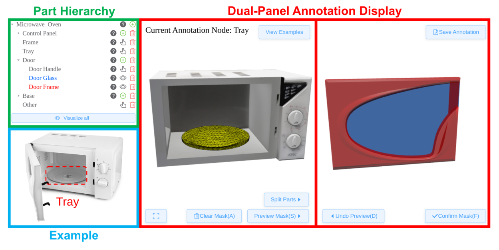

*原文 Figure 2：Figure 2 : Illustration of our annotation interface . The example shows a microwave containing an internal tray. The dual-panel layout allows annotators to first label external parts such as the “door” (as shown in the right panel with already segmented meshes), and then proceed to annotate internal components like the “tray” (visible in the unsegmented mesh in the left panel). This design effectively mitigates occlusion issues during annotation. [查看图片来源](https://arxiv.org/html/2510.20155v3/dataset_anno_sys_design.png)*

引用来源：arxiv_2608.02711

链接：[arXiv](https://arxiv.org/abs/2510.20155)

##### NaTex: Seamless Texture Generation as Latent Color Diffusion

作者：Zeqiang Lai, Yunfei Zhao, Zi-Bo Zhao, Xin Yang, Xin Huang, Jingwei Huang, Xiangyu Yue, Chunchao Guo

主任务：context

中文简介：

NaTex解决3D纹理生成任务，输入3D几何与条件，输出无缝贴合的3D纹理。核心范式是将纹理视为密集颜色点云，提出潜在颜色扩散模型，包含几何感知颜色点云VAE和多控制扩散Transformer。通过原生几何控制，利用位置嵌入和几何潜在变量直接 conditioning DiT，避免多视图扩散模型的遮挡与对齐难题。区别于基于2D图像烘焙的传统流程，该方法在3D空间直接预测颜色，显著提升了纹理连贯性与网格对齐精度。

*原文 Figure 12：Figure 13 : Visual comparison between our NaTex material generation pipeline and a conventional MVD-based material pipeline. Our method produces more accurate and better-aligned materials compared to prior approaches. [查看图片来源](https://arxiv.org/html/2511.16317v1/material_cmp.png)*

引用来源：arxiv_2608.02711

链接：[arXiv](https://arxiv.org/abs/2511.16317)

##### LATTICE: Democratize High-Fidelity 3D Generation at Scale

作者：Zeqiang Lai, Yunfei Zhao, Zi-Bo Zhao, Haolin Liu, Qin Lin, Jingwei Huang, Chunchao Guo, Xiangyu Yue

主任务：context

中文简介：

LATTICE旨在解决高质量、可扩展的3D资产生成任务，输入条件信号，输出高保真3D几何。核心提出VoxSet半结构化表示，将3D压缩为锚定于粗体素网格的潜在向量集，结合位置嵌入引导生成。采用两阶段范式：先生成稀疏体素几何锚点，再通过整流流Transformer生成细节。区别于传统3D表示，该方法在潜空间中引入显式结构，支持任意分辨率解码与低代价训练，属于三维原生潜空间生成类别。

*原文 Figure 4：Figure 5 : LATTICE Model Architecture : it features a two-stage coarse-to-fine pipeline and a novel VoxSet VAE and DiT. [查看图片来源](https://arxiv.org/html/2512.03052v1/shape_arch.png)*

引用来源：arxiv_2608.02711

链接：[arXiv](https://arxiv.org/abs/2512.03052)

##### MoCA: Mixture-of-Components Attention for Scalable Compositional 3D Generation

作者：Zhiqi Li, Wenhuan Li, Tengfei Wang, Zhenwei Wang, Jun-Tao Wu, Haoyuan Wang, Yunhan Yang, Zehuan Huang, Yang Li, Peidong Liu, Chunchao Guo

主任务：context

中文简介：

MoCA解决可扩展的组合式3D生成任务，输入组件描述，输出包含多个部件的3D对象或场景。核心方法引入基于重要性的组件路由和无关组件压缩机制，通过稀疏全局注意力降低计算复杂度。区别于传统部分感知方法因二次注意力成本导致的扩展性差，MoCA属于部件结构化生成类别，能够高效处理大量组件，实现细粒度的组合式3D资产创建，在对象和场景生成任务中均优于基线方法。

*原文 Figure 1：Figure 2: Overview of MoCA . Our DiT model starts with packing each component’s latents using several learnable queries through a cross-attention layer. Random ID embeddings are applied to distinguish different components. Then, each component’s full latents and compressed version are fed into our DiT model, which is comprised with interleaved local attention blocks and our proposed Mixture-of-Components Attention blocks. Finally, the clean latents of all components are separately decoded to the global space by a frozen shape decoder to form the final 3D asset. [查看图片来源](https://arxiv.org/html/2512.07628v1/pipeline.png)*

引用来源：arxiv_2608.02711

链接：[arXiv](https://arxiv.org/abs/2512.07628)

##### OmniGen2: Exploration to Advanced Multimodal Generation

作者：Chen-Yuan Wu, Peng-Fei Zheng, Ruiran Yan, Shitao Xiao, Xin Luo, Yueze Wang, Wanli Li, Xiyan Jiang, Yexin Liu, Junjie Zhou, Ze Liu, Ziyi Xia, Chaofan Li, Haoge Deng, Jia-Hao Wang, Kun Luo, Bo Zhang, Defu Lian, Xinlong Wang, Zhongyuan Wang, Tiejun Huang, Zheng Liu

主任务：context

中文简介：

由于提供的摘要内容为空，无法提取具体的任务输入输出、核心方法范式及其在领域中的位置。根据标题推测，OmniGen2可能涉及多模态生成的高级探索，可能属于统一多模态Transformer架构或相关生成类别，旨在提升多模态内容的生成能力。但在缺乏具体技术细节和实验结论的情况下，无法按照要求撰写符合规范的学术介绍，建议查阅完整论文以获取准确信息。

*原文 Figure 1：Figure 1 : Overview of versatile abilities of OmniGen2. [查看图片来源](https://arxiv.org/html/2506.18871v4/omnigen2_overview_new.png)*

引用来源：arxiv_2608.02711

#### 2026

##### ShapeUP: Scalable Image-Conditioned 3D Editing

作者：Inbar Gat, Dana Cohen-Bar, Guy J. Levy, Elad Richardson, Daniel Cohen-Or

主任务：context

中文简介：

ShapeUP解决可扩展的图像条件3D编辑任务，输入源3D形状和编辑后的2D图像，输出保持结构一致的编辑后3D资产。核心范式是将编辑建模为原生3D表示内的监督潜空间到潜空间翻译，利用3D Diffusion Transformer学习直接映射。区别于优化方法的缓慢和训练免费方法的局限，ShapeUP属于三维编辑类别，通过 supervised training  leveraging pretrained priors，实现了细粒度视觉控制和隐式无掩码定位，兼顾了可控性与一致性。

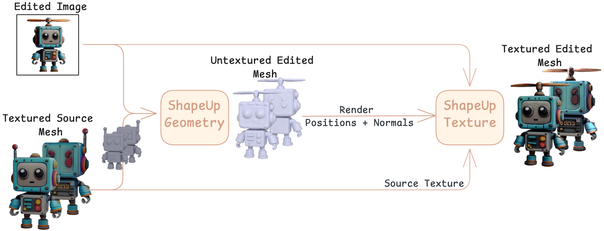

*原文 Figure 2：Figure 2. Overview. ShapeUP takes a Textured Source Mesh together with a single Edited Image (left). The ShapeUP Geometry module produces an Untextured Edited Mesh by editing the source shape directly in a native 3D latent space, preserving identity and enabling implicit localization. The edited geometry is rendered to obtain Positions + Normals, which guide the ShapeUP Texture module (right) to generate the final Textured Edited Mesh while retaining details from the Source Texture. [查看图片来源](https://arxiv.org/html/2602.05676v2/images/overview_v2png.png)*

引用来源：arxiv_2608.02711

链接：[arXiv](https://arxiv.org/abs/2602.05676)

##### FACE: A Face-based Autoregressive Representation for High-Fidelity and Efficient Mesh Generation

作者：Hanxiao Wang, Yuan Guo, Ying-Tian Liu, Ziyi Zou, Biao Zhang, Weize Quan, Ding Liang, Yan-Pei Cao, Dong-Ming Yan

主任务：context

中文简介：

FACE旨在高效生成高保真3D网格，解决传统自回归模型因展平顶点序列导致计算成本高昂的问题。核心方法是将每个三角形面作为单一令牌（One-face-one-token），大幅缩短序列长度，并结合VecSet编码器实现高压缩比重建。该模型属于网格词元化自回归生成类别，但与以往顶点级操作不同，它在面级别进行语义建模，显著提升了生成效率与质量，降低了高质量结构化3D内容创建的门槛。

*原文 Figure 2：Figure 3 : Overview of our image-to-mesh generation pipeline. We first use the input image to condition a DiT model. The resulting latent VecSet is then fed into the Autoregressive Face Decoder to produce the final mesh. [查看图片来源](https://arxiv.org/html/2603.01515v2/diffusion_1114_gyc.png)*

引用来源：arxiv_2608.02711

链接：[arXiv](https://arxiv.org/abs/2603.01515)

##### LATO: 3D Mesh Flow Matching with Structured TOpology Preserving LAtents

作者：Tianhao Zhao, You-Jia Zhang, Hang Long, Jin-Sheng Zhang, Wen-Bing Li, Yang Yang, Gongbo Zhang, Jozef Hladký, Matthias Nießner, Wei Yang

主任务：context

中文简介：

LATO解决从潜空间直接生成显式3D网格的任务，输出具备复杂几何与良好拓扑的Mesh。其核心范式是提出保持拓扑的潜表示，将网格建模为锚定表面的顶点位移场，经稀疏体素VAE压缩后，通过两阶段流匹配合成结构体素并预测边连接，无需等值面提取。区别于传统基于扩散或自回归的方法，LATO在推理效率与拓扑完整性间取得平衡，属于三维原生潜空间生成类别，避免了逐实例优化。

*原文 Figure 2：Figure 3 : Overview of the LATO pipeline. We explicitly encode mesh topology by sampling surface points infused with relative displacement to their enclosing face vertices (Vertex Displacement Field, VDF). These dense features are aggregated and compressed via a sparse voxel VAE into a structured latent representation, termed T-Voxels . To reconstruct the mesh, the T-Voxels undergo hierarchical subdivision and learnable pruning to precisely instantiate high-resolution vertex locations. Simultaneously, a connection head predicts edge existence between vertex pairs, directly recovering the explicit mesh topology. [查看图片来源](https://arxiv.org/html/2603.06357v1/figures/pipeline.png)*

引用来源：arxiv_2608.02711

链接：[arXiv](https://arxiv.org/abs/2603.06357)

##### Image Generators are Generalist Vision Learners

作者：Valentin Gabeur, Shangbang Long, Songyou Peng, P. Voigtlaender, Shuyang Sun, Yanan Bao, Karen Truong, Zhicheng Wang, Wenlei Zhou, J. Barron, Kyle Genova, Nithish Kannen, Sherry Ben, Yandong Li, Mandy Guo, Suhas Yogin, Yiming Gu, Huizhong Chen, Oliver Wang, Saining Xie, Howard Zhou, Kaiming He, T. Funkhouser, Jean-Baptiste Alayrac, Radu Soricut

主任务：context

中文简介：

Vision Banana探索图像生成器作为通用视觉学习者的潜力，通过将各类视觉任务（包括3D理解）的输出参数化为RGB图像，将感知重构为图像生成任务。该模型在Nano Banana Pro基础上进行轻量级指令微调，无需牺牲生成能力即可在分割和深度估计等2D/3D理解任务上达到最先进水平。这证明了图像生成预训练能涌现出强大的通用视觉表征，为统一视觉理解与生成接口提供了新范式，超越了传统专用模型的局限。

*原文 Figure 30：Figure 8 : Comparison with SOTA surface normal estimation method Lotus-2 ( He et al., 2025 ) . Results of Lotus-2 are obtained using its Hugging-Face demo: https://huggingface.co/spaces/haodongli/Lotus-2_Normal . Vision Banana can produce surface normal map with much higher visual quality and better fine-grained details. Zoom-in for the details. [查看图片来源](https://arxiv.org/html/2604.20329v3/assets/surface_normal/sn_1_in.jpg)*

引用来源：arxiv_2608.02711

链接：[arXiv](https://arxiv.org/abs/2604.20329)

##### Omni123: Exploring 3D Native Foundation Models with Limited 3D Data by Unifying Text to 2D and 3D Generation

作者：Chongjie Ye, Chen Cao, Chuanyu Pan, Yi-Ming Hao, Yihao Zhi, Yuan-Ming Hu, Xiao-Guang Han

主任务：context

中文简介：

Omni123旨在解决3D数据稀缺导致的生成约束不足问题，统一文本到2D和3D的生成。它将文本、图像和3D表示为共享序列空间中的离散令牌，采用自回归框架。通过交错X-to-X训练范式，利用丰富的2D数据作为几何先验，并在语义-视觉-几何循环中强制多视图一致性。区别于依赖2D编辑再优化提升至3D的间接流水线，Omni123作为3D原生基础模型，直接在统一空间中建模，显著改善了几何一致性和生成质量。

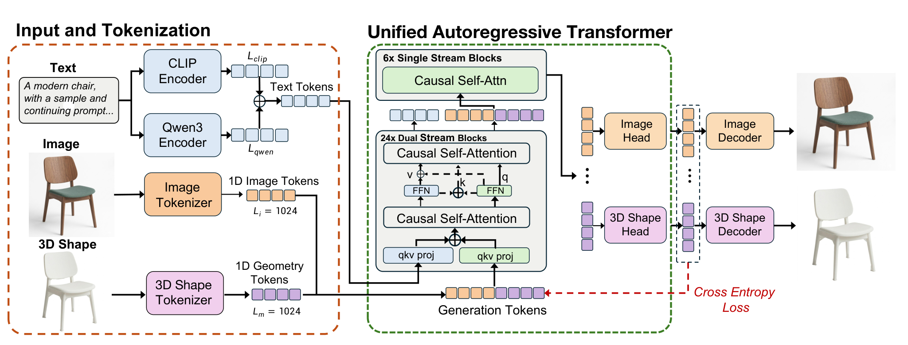

*原文 Figure 3：Figure 3 : Overview of the Omni123 architecture. Text is encoded by dual text encoders (CLIP [ 60 ] and Qwen3-0.6B [ 87 ] ) and fed into a conditioning stream, while images and 3D shapes are tokenized into 1D discrete tokens and concatenated into a unified generation stream. The unified autoregressive transformer backbone uses 24 dual-stream blocks to jointly process the conditioning and generation tokens under causal attention, followed by 6 single-stream layers operating only on generation tokens, and finally with modality-specific linear heads decoding token logits over the 2D and 3D codebooks. [查看图片来源](https://arxiv.org/html/2604.02289v1/pretraining2.png)*

引用来源：arxiv_2608.02711

链接：[arXiv](https://arxiv.org/abs/2604.02289)

##### MeshFlow: Efficient Artistic Mesh Generation via MeshVAE and Flow-based Diffusion Transformer

作者：Wei-Yu Li, Antoine Toisoul, Tom Monnier, Roman Shapovalov, Rakesh Ranjan, Ping Tan, Andrea Vedaldi

主任务：context

中文简介：

该论文解决高效艺术网格生成任务，输入为潜在空间噪声，输出为3D网格。核心方法是构建MeshVAE将连续顶点位置和离散连接性编码至连续潜空间，并利用整流流Transformer进行并行生成。区别于自回归方法的二次方推理成本及量化误差，MeshFlow在潜空间中统一处理几何与拓扑，生成速度显著提升且保持高精度，避免了逐令牌预测的计算瓶颈，实现了可扩展的高质量网格合成。

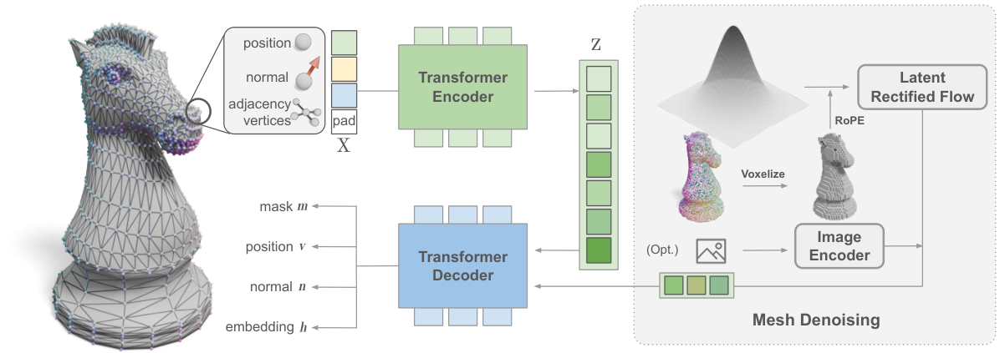

*原文 Figure 2：Figure 3 : Overview of our method. We first propose MeshVAE, which compresses vertices, vertex normals, and discrete adjacency relationships of a mesh into a continuous latent space. This is supervised by the ground-truth vertices and vertex normals, coupled with a contrastive learning approach applied to vertex adjacency. We then employ latent Rectified Flow based on the proposed representation, and finally pass the result through the Mesh Decoder to obtain a mesh. [查看图片来源](https://arxiv.org/html/2606.04621v2/overview_v1_1.png)*

引用来源：arxiv_2608.02711

链接：[arXiv](https://arxiv.org/abs/2606.04621)

##### PolyFlow: Continuous Topology Embedding Flow Matching for Artist-style Mesh Generation

作者：Chunshi Wang, Haohan Weng, Junliang Ye, Biwen Lei, Yang Li, Zi-Bo Zhao, Zeqiang Lai, Kai-Yi Zhang, Yunhan Yang, Zhuo Chen, Chunchao Guo, Yawei Luo

主任务：context

中文简介：

该论文解决艺术家风格网格生成任务，输入为点云特征，输出为具有连续拓扑嵌入的3D网格。核心方法是通过紧凑拓扑嵌入器将离散网格映射为连续顶点状态空间，利用基于Transformer的流匹配框架进行并行去噪。区别于自回归方法的串行低效，PolyFlow实现了完全并行的顶点生成，通过ODE求解器快速推理，并支持直接指定顶点数以精确控制分辨率，克服了离散拓扑与连续扩散不兼容的问题。

*原文 Figure 2：Figure 2: Overview of the PolyFlow pipeline. Left—Training: Given a 3D mesh, we sample a point cloud and encode it into condition features via a frozen condition encoder. Vertex positions ( x , y , z ) (x,y,z) , surface normals, and topology embeddings produced by a frozen topology embedder are concatenated to form the joint flow state 𝐳 = [ xyz , normals , emb ] \mathbf{z}=[\mathrm{xyz},\,\mathrm{normals},\,\mathrm{emb}] of shape ( B , V , D ) (B,V,D) . A Flow Transformer is trained to denoise 𝐳 \mathbf{z} from Gaussian noise 𝐱 0 ∼ 𝒩 ⁡ ( 𝟎 , 𝐈 ) \mathbf{x}_{0}\sim\mathcal{N}(\mathbf{0},\mathbf{I}) , conditioned on the point-cloud features. Right—Inference: The user specifies an expected vertex count V ^ \hat{V} ; we initialize V ^ \hat{V} tokens from noise of shape ( B , V ^ , D ) (B,\hat{V},D) and denoise them in parallel with the EMA copy of the Flow Transformer. The denoised output is split into three channel groups—➀ vertex positions, ➁ surface normals, and ➂ topology embeddings—from which edges and faces are decoded via spacetime distance thresholding to produce the final mesh. [查看图片来源](https://arxiv.org/html/2606.30673v1/Pipeline.png)*

引用来源：arxiv_2608.02711

链接：[arXiv](https://arxiv.org/abs/2606.30673)

### adjacent

#### 2022

##### DreamFusion: Text-to-3D using 2D Diffusion

作者：Ben Poole, Ajay Jain, J. Barron, B. Mildenhall

主任务：adjacent

中文简介：

该论文解决从纯文本生成神经辐射场（NeRF）的任务，输出可从任意视角观察的三维场景。核心方法是提出分数蒸馏采样（SDS）损失，将预训练二维文本到图像扩散模型作为先验，通过梯度下降优化随机初始化的NeRF参数，使其二维渲染符合文本描述。这确立了基于优化的蒸馏生成范式，无需大规模三维标注数据即可实现高质量生成，但存在推理速度慢的问题，是该类别的开创性基线工作。

*原文 Figure 22：Figure 2: Comparison of 2D sampling methods from a text-to-image diffusion model with text “ a photo of a tree frog wearing a sweater .” For score distillation sampling, as an example we use an image generator that restricts images to be symmetric by having 𝐱 = ( flip ​ ( θ ) , θ ) \mathbf{x}=(\text{flip}(\theta),\theta) . [查看图片来源](https://arxiv.org/html/2209.14988v1/sampling_schematic_barronfont.png)*

引用来源：arxiv_2608.02711

链接：[arXiv](https://arxiv.org/abs/2209.14988)

##### Magic3D: High-Resolution Text-to-3D Content Creation

作者：Chen-Hsuan Lin, Jun Gao, Luming Tang, Towaki Takikawa, Xiaohui Zeng, Xun Huang, Karsten Kreis, S. Fidler, Ming-Yu Liu, Tsung-Yi Lin

主任务：adjacent

中文简介：

该论文解决从文本生成高分辨率三维网格的任务。核心方法采用两阶段优化范式：首先利用低分辨率扩散先验和稀疏哈希网格快速获得粗略模型，随后以此为初始化，结合可微渲染器与高分辨率潜在扩散模型优化纹理网格。作为基于优化的蒸馏生成路线的代表，它针对前作DreamFusion推理慢、分辨率低的痛点，通过分阶段策略显著提升了生成速度与几何细节质量，是早期文本到三维资产生成的经典改进工作。

*原文 Figure 2：Figure 2 : Overview of Magic3D. We generate high-resolution 3D content from an input text prompt in a coarse-to-fine manner. In the first stage, we utilize a low-resolution diffusion prior and optimize neural field representations (color, density, and normal fields) to obtain the coarse model. We further differentiably extract textured 3D mesh from the density and color fields of the coarse model. Then we fine-tune it using a high-resolution latent diffusion model. After optimization, our model generates high-quality 3D meshes with detailed textures. [查看图片来源](https://arxiv.org/html/2211.10440v2/x1.png)*

引用来源：arxiv_2608.02711

链接：[arXiv](https://arxiv.org/abs/2211.10440)

#### 2023

##### Shap-Editor: Instruction-guided Latent 3D Editing in Seconds

作者：Minghao Chen, Junyu Xie, Iro Laina, A. Vedaldi

主任务：adjacent

中文简介：

Shap-Editor旨在解决传统3D蒸馏编辑速度慢的问题，输入为3D资产与编辑指令，输出为编辑后的3D对象。核心方法是摒弃测试时优化，直接在Shap-E的潜空间中训练前馈编辑网络，实现秒级推理。属于三维编辑中的前馈编辑路线，与依赖逐实例反向传播的传统方法不同，它通过潜空间直接映射大幅提升了效率，同时在分布内外数据上均表现出良好的泛化性与编辑质量。

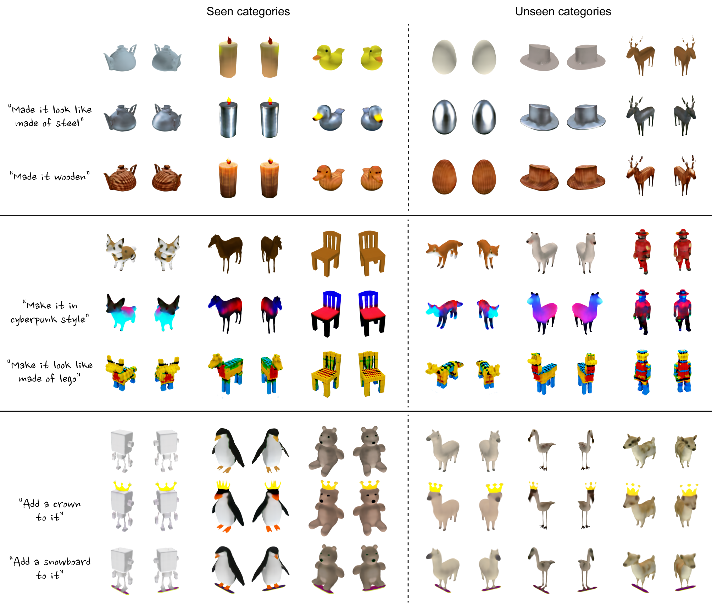

*原文 Figure 7：Figure 8 : Additional visualisations. We apply different editing instructions (including both global and local edits) across various instances, also demonstrating the generalisability of our method to multiple unseen categories. [查看图片来源](https://arxiv.org/html/2312.09246v1/additional_results_sup.png)*

引用来源：arxiv_2608.02711

链接：[arXiv](https://arxiv.org/abs/2312.09246)

#### 2024

##### Tailor3D: Customized 3D Assets Editing and Generation with Dual-Side Images

作者：Zhangyang Qi, Yu-nuo Yang, Mengchen Zhang, Long Xing, Xiaoyang Wu, Tong Wu, Dahua Lin, Xihui Liu, Jiaqi Wang, Hengshuang Zhao

主任务：adjacent

中文简介：

Tailor3D解决3D资产的精细化编辑与定制生成任务，输入可编辑的双侧图像，输出整合前后视图特征的统一3D资产。其核心范式是模拟裁缝工作流程，先编辑前视图，再通过多视图扩散生成并编辑后视图，最后利用双侧面LRM和LoRA Triplane Transformer无缝缝合前后特征。区别于直接从多视图重建的方法，它避免了重叠区域冲突，属于三维编辑与生成的交叉工作。该方法在降低内存负担的同时，显著提升了对细节指令的遵循能力和视图间的一致性。

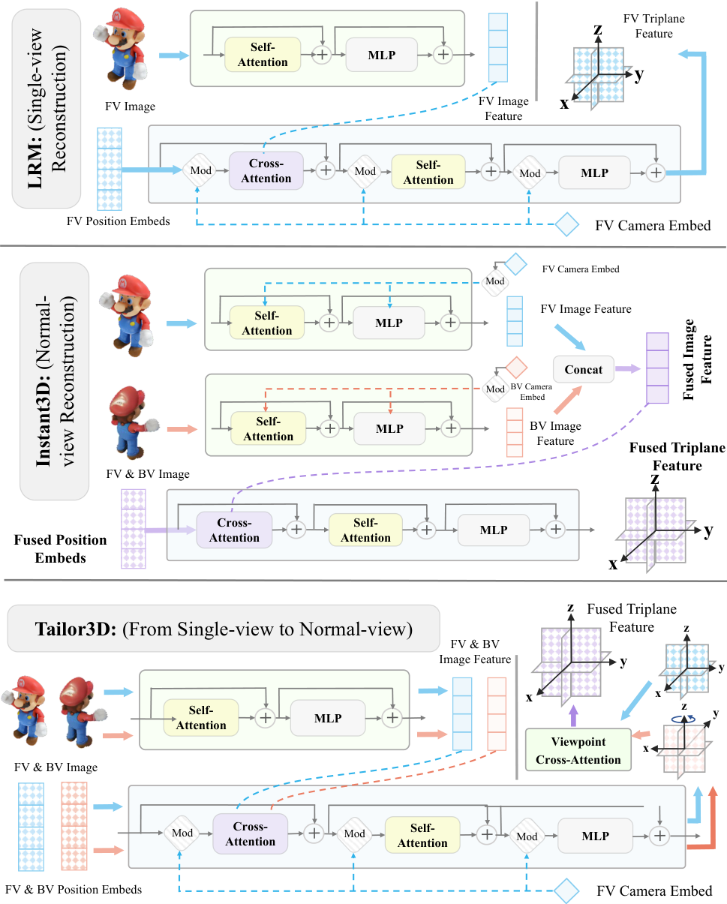

*原文 Figure 6：Figure 6 : Model architectures of LRM, Instant3D and Tailor3D. [查看图片来源](https://arxiv.org/html/2407.06191v1/fig_additional_background.png)*

引用来源：arxiv_2608.02711

链接：[arXiv](https://arxiv.org/abs/2407.06191)

##### MVInpainter: Learning Multi-View Consistent Inpainting to Bridge 2D and 3D Editing

作者：Chenjie Cao, Chaohui Yu, Yanwei Fu, Fan Wang, Xiangyang Xue

主任务：adjacent

中文简介：

MVInpainter解决野外场景下的3D编辑与新视图合成任务，输入多视图图像及参考指引，输出编辑后的一致性多视图图像。其核心范式是将3D编辑重构为多视图2D修复任务，利用视频先验和注意力机制确保跨视图一致性，并通过槽位注意力聚合光流特征以实现无姿态控制的相机运动建模。区别于依赖精确相机姿态的传统方法，它属于推理时实例级优化与编辑的相邻工作，通过利用未掩码区域的线索简化了野外场景的合成难度，支持物体移除、插入等多种编辑操作。

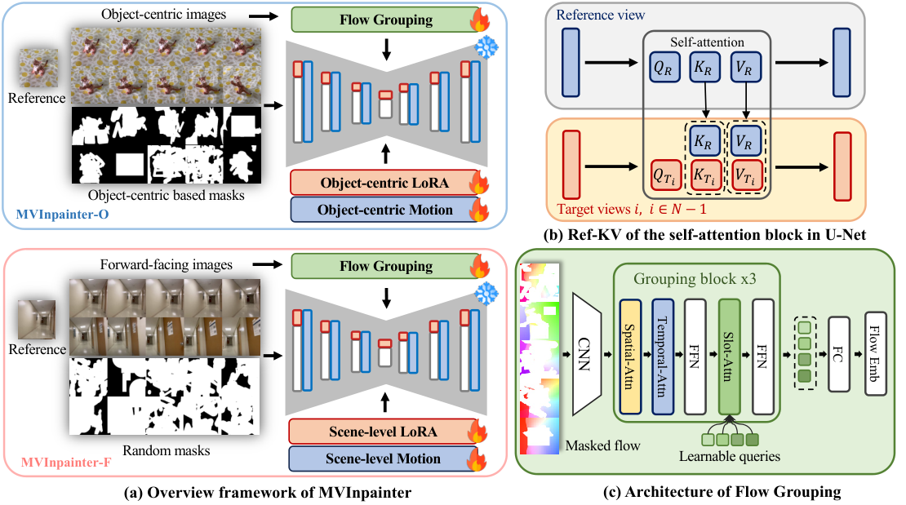

*原文 Figure 3：Figure 3 : (a) The overview of the proposed MVInpainter. MVInpainter-O is trained on object-centric data, while MVInpainter-F is trained on forward-facing data with a shared SD-inpainting backbone of different LoRA/motion weights and masking strategies. The object-centric MVInpainter focuses on the object-level NVS, while the forward-facing one is devoted to object removal and scene-level inpainting. (b) The Ref-KV is used in spatial self-attention blocks of denoising U-Net. (c) The slot-attention based flow grouping module is used to learn implicit pose features. Dashed boxes in (b) and (c) mean feature concatenation. [查看图片来源](https://arxiv.org/html/2408.08000v3/overview.png)*

引用来源：arxiv_2608.02711

链接：[arXiv](https://arxiv.org/abs/2408.08000)

##### PhyCAGE: Physically Plausible Compositional 3D Asset Generation from a Single Image

作者：Han Yan, Mingrui Zhang, Yang Li, Chao Ma, Pan Ji

主任务：adjacent

中文简介：

PhyCAGE解决从单张图像生成物理合理的组合式3D资产任务。输入为单张图像，输出为符合物理约束的多部件3D高斯泼溅表示。核心方法先生成多视图图像并拟合3D GS，随后引入物理模拟增强的分数蒸馏采样（PSE-SDS），将SDS损失梯度作为物理仿真初速度，优化部件位置以消除穿透等非物理现象。属于基于优化的蒸馏生成类别，区别于仅关注视觉真实感的方法，它首次引入了物理兼容性约束，确保生成资产在结构上的合理性。

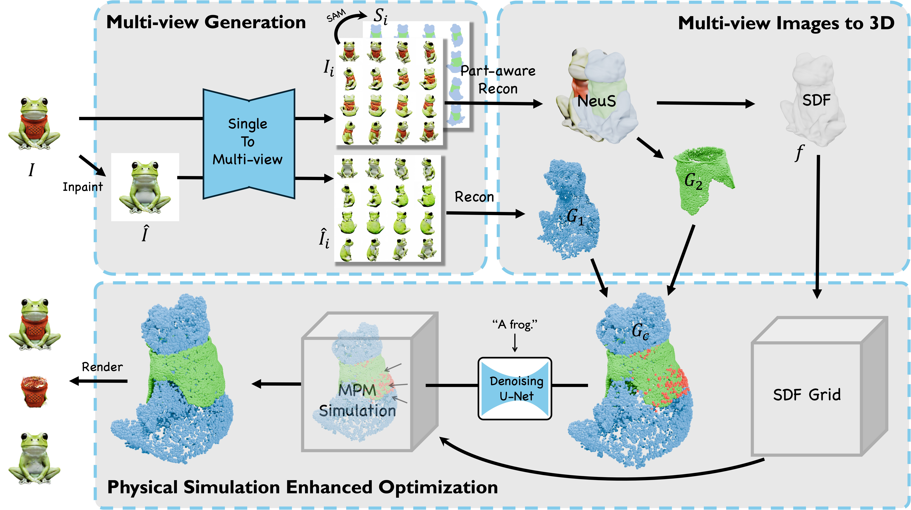

*原文 Figure 1：Figure 2 : The overview of PhyCAGE. Given an input image, we first generate consistent multi-view images for the components of the assets (see Sec. 4.1 ). Then, we fit multi-view images with 3D Gaussian Splatting representations (see Sec. 4.2 ). Finally, we introduce a Physical Simulation-Enhanced SDS to further optimize the positions of the Gaussians (see Sec. 4.3 ). [查看图片来源](https://arxiv.org/html/2411.18548v1/imgs/method/pipeline3.jpg)*

引用来源：arxiv_2608.02711

链接：[arXiv](https://arxiv.org/abs/2411.18548)

##### Instant3dit: Multiview Inpainting for Fast Editing of 3D Objects

作者：Amir Barda, Matheus Gadelha, Vladimir G. Kim, Noam Aigerman, Amit H. Bermano, Thibault Groueix

主任务：adjacent

中文简介：

Instant3dit解决快速3D物体编辑任务，输入为3D资产（网格/NeRF/GS）及编辑指令，输出编辑后的3D资产。核心洞察是将3D编辑转化为多视图图像修复问题，利用微调后的扩散模型生成多视图修复图像，再通过大型重建模型映射回3D表示。属于三维编辑类别，区别于基于SDS的慢速优化方法，该方法无需逐实例优化，将编辑时间从小时级缩短至秒级，同时通过精心设计的掩码策略保证了更高的编辑质量与几何一致性。

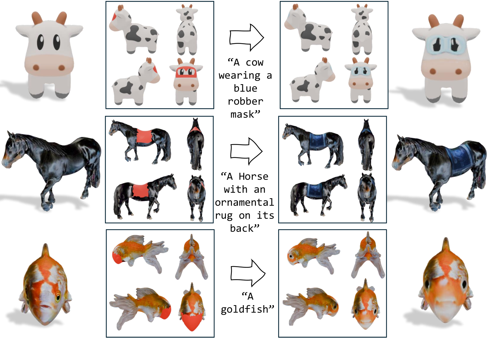

*原文 Figure 12：Figure 8 : Application: texture editing. Our method can be used to modify texture on a user-selected region. In this case, we run through our NeRF editing pipeline, but only sample colors from the NeRF in the selected region. [查看图片来源](https://arxiv.org/html/2412.00518v1/texturing_experiment.png)*

引用来源：arxiv_2608.02711

链接：[arXiv](https://arxiv.org/abs/2412.00518)

#### 2025

##### Geometry in Style: 3D Stylization via Surface Normal Deformation

作者：Nam Anh Dinh, Itai Lang, Hyunwoo Kim, Oded Stein, Rana Hanocka

主任务：adjacent

中文简介：

该论文解决三维网格的风格化任务，输入为原始网格和文本风格提示，输出保持身份一致的风格化网格。核心方法是将变形表示为顶点邻域的目标法向量，并通过新提出的可微分As-Rigid-As-Possible (dARAP) 层求解顶点旋转与位移，结合文本到图像模型的视觉损失驱动变形。区别于传统方法要么变形受限要么破坏几何身份，该方法在表达细节风格化与保留形状身份之间取得了平衡，属于三维编辑范畴。

*原文 Figure 2：Figure 3 : Overview of our stylization pipeline. Geometry in Style optimizes vertex normals to deform the mesh surface, subject to a stylization text prompt. Using the normals undergoing optimization as a target for our differentiable As-Rigid-As-Possible method (dARAP), the dARAP local step computes a rotation matrix per vertex; we then obtain the deformed surface via our dARAP global solve. Then, we utilize a differentiable renderer and a diffusion model-based semantic loss to guide the normals being optimized towards a deformation matching the desired style prompt. [查看图片来源](https://arxiv.org/html/2503.23241v2/prerenderedfig-overview-v2-nobluegradient.png)*

引用来源：arxiv_2608.02711

链接：[arXiv](https://arxiv.org/abs/2503.23241)

##### Hunyuan3D 2.5: Towards High-Fidelity 3D Assets Generation with Ultimate Details

作者：Zeqiang Lai, Yunfei Zhao, Haolin Liu, Zi-Bo Zhao, Qin Lin, Huiwen Shi, Xiang-Hui Yang, Mingxin Yang, Shuhui Yang, Yifei Feng, Sheng Zhang, Xin Huang, Di Luo, Fan Yang, Fang Yang, Li-Fu Wang, Si-Ya Liu, Y. Tang, Yu-Xin Cai, Zebin He, Tian-Hai Liu, Yu-Hong Liu, Jie Jiang, Linus, Jingwei Huang, Chunchao Guo

主任务：adjacent

中文简介：

Hunyuan3D 2.5解决高保真纹理3D资产生成任务，输入图像或文本，输出细节丰富且表面平滑的带纹理3D模型。核心采用两阶段流水线：形状生成引入大规模训练的LATTICE基础模型（最大10B参数），实现精准的形象跟随；纹理生成升级为基于物理渲染（PBR）的多视图架构。区别于前代版本，它在形状锐度、网格清洁度及端到端纹理质量上均有显著提升，代表了当前三维原生潜空间生成的高水准工业级方案。

*原文 Figure 3：Figure 3: Overview of Hunyuan3D 2.5 pipeline . It separates the 3D asset generation into two stages: first, it generates the shape, and then it creates the texture based on that shape. [查看图片来源](https://arxiv.org/html/2506.16504v1/arch.png)*

引用来源：arxiv_2608.02711

链接：[arXiv](https://arxiv.org/abs/2506.16504)

##### VoxHammer: Training-Free Precise and Coherent 3D Editing in Native 3D Space

作者：Lin Li, Zehuan Huang, Hao-li Feng, Gengxiong Zhuang, Rui Chen, Chunchao Guo, Lu Sheng

主任务：adjacent

中文简介：

VoxHammer解决三维资产的局部编辑任务，输入为待编辑3D模型及区域指令，输出编辑后且保持全局一致性的模型。其核心范式是在原生3D潜空间中进行无训练编辑：首先预测反转轨迹获取潜变量与键值Token，随后在去噪阶段用缓存特征替换保留区域，确保未编辑部分结构不变。区别于传统多视图图像编辑后重建的方法，它直接在3D空间操作，有效解决了保留区域一致性差的问题，属于无需额外训练的推理时实例级优化路线。

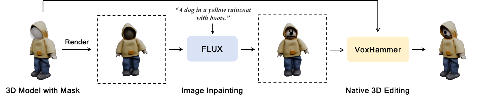

*原文 Figure 1：Figure 2 : Pipeline. Given an input 3D model, a user-specified editing region, and a text prompt, the off-the-shelf models [ 40 , 3 ] are used to inpaint the rendered view from the 3D model. Subsequently, our VoxHammer , a training-free framework based on structured 3D diffusion models [ 90 ] , performs native 3D editing conditioned on the input 3D and the edited image. [查看图片来源](https://arxiv.org/html/2508.19247v1/pipeline.png)*

引用来源：arxiv_2608.02711

链接：[arXiv](https://arxiv.org/abs/2508.19247)

##### NANO3D: A Training-Free Approach for Efficient 3D Editing Without Masks

作者：Junliang Ye, Shenghao Xie, Ruowen Zhao, Zhengyi Wang, Hongyu Yan, Wen-Qiang Zu, Lei Ma, Jun Zhu

主任务：adjacent

中文简介：

Nano3D解决无需掩码的高效3D编辑任务，输入源3D资产与指令，输出编辑结果。核心为训练免费框架，集成FlowEdit于TRELLIS中，通过前视图渲染引导局部编辑，并引入区域感知合并策略（Voxel/Slat-Merge）自适应保持结构 fidelity。区别于依赖多视图重建导致伪影的方法，Nano3D在无掩码情况下确保了编辑区与未编辑区的一致性。此外，构建了大规模3D编辑数据集，为前馈3D编辑模型发展奠定基础，属推理时实例级优化。

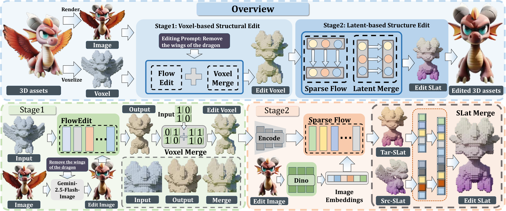

*原文 Figure 2：Figure 2: The Nano3D pipeline. The original 3D object is voxelized and encoded into sparse structure and structured latent respectively. Stage 1 modifies geometry via Flow Transformer with FlowEdit, guided by Nano Banana–edited images. Stage 2 generates structured latents with Sparse Flow Transformer, supporting TRELLIS-inherent appearance editing. Voxel/Slat-Merge further ensures consistency across both stages before decoding the final 3D object. [查看图片来源](https://arxiv.org/html/2510.15019v1/pipeline.png)*

引用来源：arxiv_2608.02711

链接：[arXiv](https://arxiv.org/abs/2510.15019)

##### AnchorFlow: Training-Free 3D Editing via Latent Anchor-Aligned Flows

作者：Zhen Zhou, Fan Ma, Chengzhuo Gui, Xiaobo Xia, Hehe Fan, Yi Yang, Tat-Seng Chua

主任务：adjacent

中文简介：

该论文解决无需微调的3D编辑任务，输入源3D形状与指令，输出编辑后的3D资产。核心方法为AnchorFlow，通过建立源与目标轨迹间共享的全局潜在锚点，并利用松弛锚点对齐损失及更新规则，克服扩散采样中噪声导致的潜在空间不一致问题。区别于依赖掩码或逐实例优化的前序路线，该方法在无掩码监督下实现了更稳定、语义忠实且几何鲁棒的编辑，属于推理时实例级优化范畴。

*原文 Figure 2：Figure 3 : Overview of the AnchorFlow for Training-free and Mask-free 3D Editing. Given a source model and an editing instruction, AnchorFlow first constructs the source sample 𝑿 t src \bm{X}^{\mathrm{src}}_{t} and forms the editing sample 𝑿 t FE \bm{X}^{\mathrm{FE}}_{t} at the t t step. A 3D flow-based model 𝒗 θ \bm{v}_{\theta} predicts velocity fields for both the source and target sample. To stabilize the editing process, AnchorFlow performs a single-step inversion to approximate the latent anchors F t ​ ( 𝑿 t src ) F_{t}(\bm{X}^{\mathrm{src}}_{t}) and F t ​ ( 𝑿 t tar ) F_{t}(\bm{X}^{\mathrm{tar}}_{t}) , and aligns them in noise space via the anchor-aligned update guided by ∇ ℒ align \nabla\mathcal{L}_{\mathrm{align}} . This design enforces consistent latent anchors, mitigates geometric distortions, and produces structurally stable 3D edits. [查看图片来源](https://arxiv.org/html/2511.22357v1/framework_v2.png)*

引用来源：arxiv_2608.02711

链接：[arXiv](https://arxiv.org/abs/2511.22357)

##### Native 3D Editing with Full Attention

作者：Weiwei Cai, Shuangkang Fang, Wei-Cai Ye, Xin Dong, Yunhan Yang, Xuan-Yang Zhang, Wei Cheng, Yanpei Cao, Gang Yu, Tao Chen

主任务：adjacent

中文简介：

该研究针对指令引导的3D编辑任务，输入3D资产与自然语言指令，输出编辑后的3D模型。核心提出原生3D编辑框架，直接在单次前馈过程中操作3D表示，避免了优化方法的缓慢及2D提升方法的几何不一致。通过构建大规模多模态数据集，探索了交叉注意力与3D令牌拼接两种条件策略，证实后者更高效且性能优越。区别于依赖多视图2D编辑的间接路线，该方法实现了真正的原生3D一致性编辑。

*原文 Figure 2：Figure 2: Overview of our proposed framework for native 3D editing. The pipeline manipulates 3D objects based on textual instructions, utilizing token concatenation as a parameter-efficient alternative to cross-attention, achieving superior editing performance without additional complexity. [查看图片来源](https://arxiv.org/html/2511.17501v1/framework.png)*

引用来源：arxiv_2608.02711

链接：[arXiv](https://arxiv.org/abs/2511.17501)

##### Part-X-MLLM: Part-aware 3D Multimodal Large Language Model

作者：Chunshi Wang, Junliang Ye, Yunhan Yang, Yang Li, Zizhuo Lin, Jun-Yan Zhu, Zhuo Chen, Yawei Luo, Chunchao Guo

主任务：adjacent

中文简介：

Part-X-MLLM解决统一的3D理解与规划任务，输入RGB点云与自然语言提示，输出包含部件边界框、语义描述及编辑命令的结构化令牌序列。核心采用双编码器架构，将3D任务形式化为可执行语法程序，自回归生成符号计划以驱动下游几何模块。区别于仅输出文本或分割掩码的传统理解模型，该方法解耦符号规划与几何合成，通过单一语言原生接口实现接地问答、组合生成及局部编辑，属于统一多模态Transformer架构。

*原文 Figure 2：Figure 2: The Part-X-MLLM Framework. Our pipeline begins by encoding geometry and appearance features separately using a dual-encoder architecture, which are then fused together with text prompts. These combined features are passed to an autoregressive decoder that generates a program-like token sequence representing a plan (e.g., bounding boxes, edit commands). Finally, specialized geometry heads execute this plan to enable part-aware generation and editing. [查看图片来源](https://arxiv.org/html/2511.13647v1/pipeline.png)*

引用来源：arxiv_2608.02711

链接：[arXiv](https://arxiv.org/abs/2511.13647)

##### DreamReward-X: Boosting High-Quality 3D Generation with Human Preference Alignment.

作者：Fang-Fu Liu, Junliang Ye, Yikai Wang, Han-Yang Wang, Zhengyi Wang, Jun Zhu, Yue-Qi Duan

主任务：adjacent

中文简介：

该论文解决文本驱动3D生成中与人类偏好对齐的问题，输入为文本提示，输出符合人类审美的高质量3D资产。核心方法构建Reward3D奖励模型，并提出DreamFL算法，通过人类偏好反馈引导预训练分布。区别于仅依赖最大似然估计的传统方法，它引入奖励感知噪声采样策略（DreamReward++）以解决多样性受限问题。该方法在优化过程中直接融入人类偏好，有效提升了生成内容的质量和用户满意度，并扩展至4D和图像驱动生成。

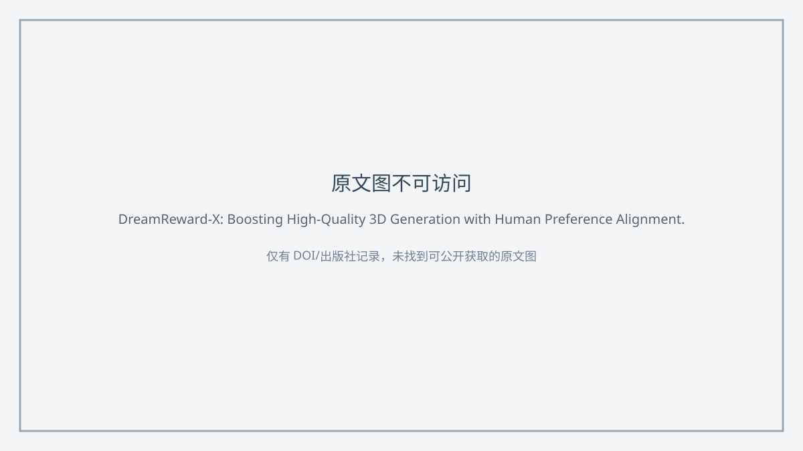

*原文 Figure 1：原文图不可访问：该论文只有 DOI/出版社记录，未找到公开原文图。 [查看图片来源](10.1109/TPAMI.2025.3609680)*

引用来源：arxiv_2608.02711

#### 2026

##### VecSet-Edit: Unleashing Pre-trained LRM for Mesh Editing from Single Image

作者：Teng-Fang Hsiao, Bo-Kai Ruan, Yu-Lun Liu, Hong-Han Shuai

主任务：adjacent

中文简介：

VecSet-Edit解决从单张图像直接编辑3D网格的任务，旨在克服体素方法分辨率低及需人工掩码的局限。核心方法利用预训练VecSet大重建模型，通过分析Token空间属性，引入掩码引导Token播种和注意力对齐门控策略来精确定位编辑区域，并采用漂移感知Token剪枝去除异常值。该方法属于三维编辑类别，区别于高斯泼溅或多视图编辑，它直接操作Mesh，并通过纹理烘焙模块保留原始几何与纹理细节。

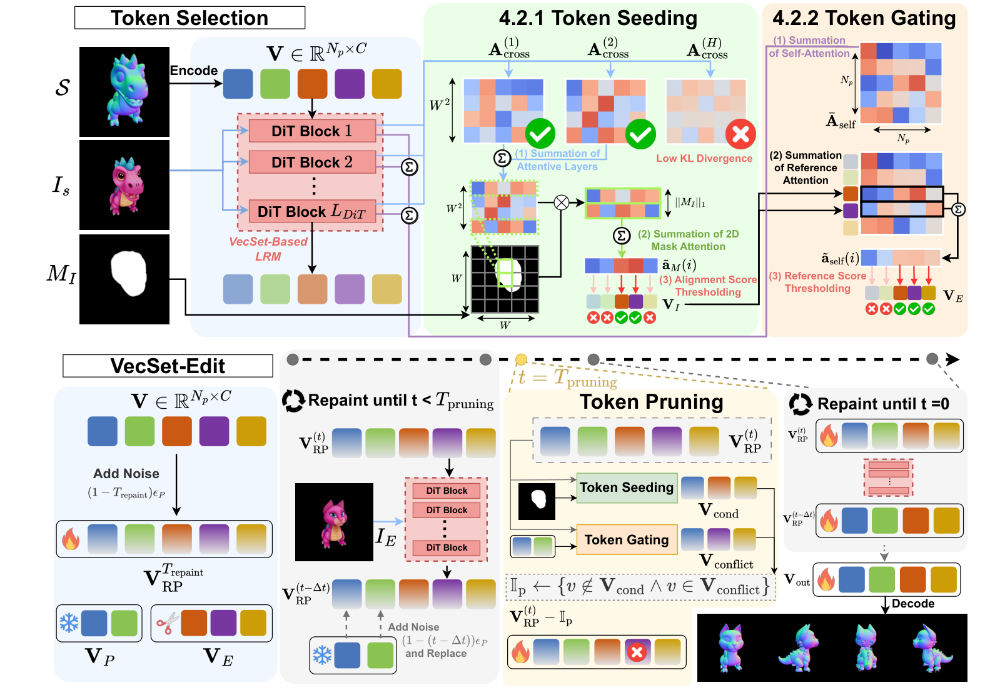

*原文 Figure 2：Figure 2. Overview of the VecSet-Edit framework. Given a mesh 𝒮 \mathcal{S} , a rendered view I s I_{s} , a 2D edit mask M I M_{I} , and a user-edited target view I E I_{E} , the pipeline proceeds in two main stages. First, Token Selection : To localize the editable region without 3D supervision, Token Seeding aggregates informative cross-attention layers to identify initial seed tokens 𝐕 I \mathbf{V}_{I} that align with the 2D mask. Token Gating then leverages self-attention correlations to expand this selection to the full geometric structure, yielding the final editable subset 𝐕 E \mathbf{V}_{E} . Second, VecSet-Edit : We perform diffusion-based editing on 𝐕 E \mathbf{V}_{E} while constraining the preserved tokens 𝐕 P \mathbf{V}_{P} . To prevent geometric artifacts, Token Pruning is applied during denoising to detect and discard “conflict” tokens that drift into the preserved regions without support from the editing condition. This ensures the final output faithfully respects both the target edit and the original structure. [查看图片来源](https://arxiv.org/html/2602.04349v3/fig4_pipeline_revision.png)*

引用来源：arxiv_2608.02711

链接：[arXiv](https://arxiv.org/abs/2602.04349)

##### Beyond Voxel 3D Editing: Learning from 3D Masks and Self-Constructed Data

作者：Yi-Zhao Xu, Hongyuan Zhu, Caiyun Liu, Tianfu Wang, Keyu Chen, Sicheng Xu, Jiao-Long Yang, Nicholas Jing Yuan, Qi Zhang

主任务：adjacent

中文简介：

BVE框架针对3D编辑任务，旨在解决多视图投影损失及体素编辑的范围限制问题。它构建了一个大规模自合成3D编辑数据集，并在基础图像到3D生成架构上添加轻量级可训练模块，以高效注入文本语义。引入无标注3D掩码策略以保持局部不变性，确保未编辑区域与原始输入一致。相比现有方法，BVE在不需昂贵全模型重训的情况下，实现了高质量、文本对齐且忠实保留原始视觉特征的3D资产编辑。

*原文 Figure 3：Figure 4 : Overview of our method. Structure Editing: The Flow Edit Transformer modifies the input 3D asset’s sparse structure based on a text prompt and a render image from original 3D asset. Structured Latent Editing: The Sparse Flow Edit Transformer enables fine-grained material and texture modifications. [查看图片来源](https://arxiv.org/html/2604.13688v1/imgs/gs.png)*

引用来源：arxiv_2608.02711

链接：[arXiv](https://arxiv.org/abs/2604.13688)

##### Prox-E: Fine-Grained 3D Shape Editing via Primitive-Based Abstractions

作者：Etai Sella, Hao Phung, Nitay Amiel, O. Litany, Or Patashnik, Hadar Averbuch-Elor

主任务：adjacent

中文简介：

Prox-E解决细粒度3D形状编辑任务，要求在严格保持物体整体身份的同时应用局部结构变化。它提出一种无训练框架，首先将输入3D形状抽象为一组几何图元，利用预训练视觉语言模型编辑这些图元以指定结构变化，进而指导3D生成模型。相较于依赖2D图像编辑提升的流水线，Prox-E通过显式的基于图元的几何抽象，更有效地平衡了身份保持、形状质量与指令遵循，实现了精准的局部结构修改。

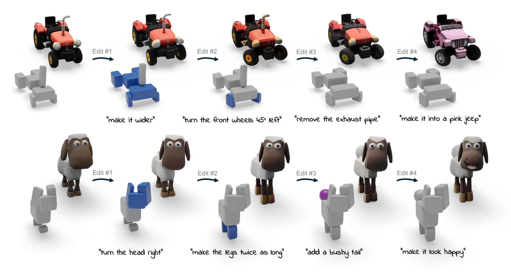

*原文 Figure 1：Figure 1. We introduce Prox ⋅ \cdot E, a training-free 3D editing framework that operates on a primitive-based geometric abstraction. By editing this proxy representation (second and bottom rows; edited primitives shown in blue , added ones shown in purple ) and using it to guide 3D generation, Prox ⋅ \cdot E enables precise, fine-grained edits while preserving the object’s identity. As illustrated above, our method supports a wide range of text-guided edits, spanning global and localized geometric transformations (edits 1 and 2) including parametric edits (edits involving a numeric parameter, i.e. edit 2), addition and removal of object parts (edit 3), and stylistic appearance-based modifications (edit 4). [查看图片来源](https://arxiv.org/html/2604.23774v2/teaser_double.png)*

引用来源：arxiv_2608.02711

链接：[arXiv](https://arxiv.org/abs/2604.23774)

##### GEM: Generative Supervision Helps Embodied Intelligence

作者：Ruowen Zhao, Bangguo Li, Zuyan Liu, Yi-Nan Liang, Junliang Ye, Fang-Fu Liu, Diankun Wu, Zhengyi Wang, Xu-Min Yu, Yongming Rao, Han Hu, Jun Zhu

主任务：adjacent

中文简介：

该论文解决具身智能中的语义与物理知识对齐任务，输入为视觉语言数据，输出为增强的具身行动策略。核心方法是在VLM预训练中联合集成深度图生成任务，通过生成式监督弥合高层语义与底层空间物理知识的差距。区别于纯文本引导范式，GEM利用生成任务作为辅助监督，显著提升了模型在仿真及真实环境中的任务执行能力，证明了生成式目标对具身理解的促进作用。

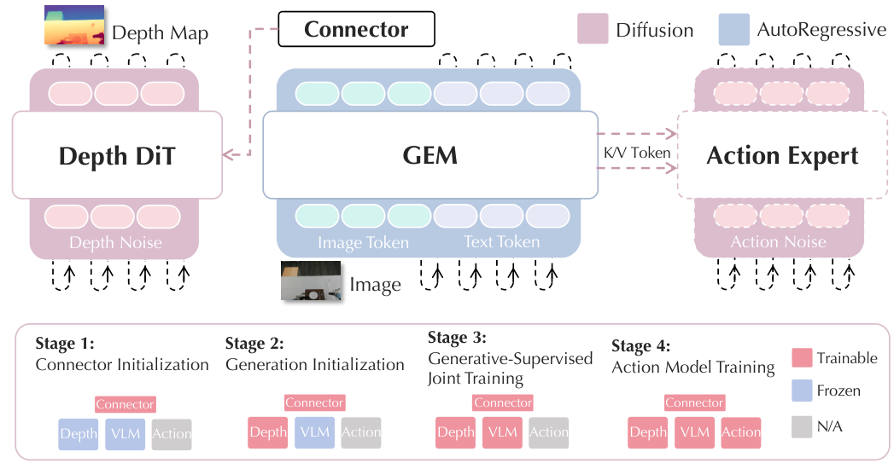

*原文 Figure 1：Figure 2: Architecture of GEM. GEM augments a VLM backbone with a DiT-based depth generator conditioned on the backbone’s final-layer visual tokens. We adopt a progressive training paradigm: (i) initialize the connector, (ii) warm up the depth generator, (iii) perform end-to-end joint training, and (iv) train an autoregressive action expert on GEM’s multimodal tokens. Building on GEM, the GEM-based VLA predicts continuous actions from these representations, improving robot manipulation. [查看图片来源](https://arxiv.org/html/2605.28548v1/fig2.png)*

引用来源：arxiv_2608.02711

链接：[arXiv](https://arxiv.org/abs/2605.28548)

##### PhysForge: Generating Physics-Grounded 3D Assets for Interactive Virtual World

作者：Yunhan Yang, Chunshi Wang, Junliang Ye, Yang Li, Zanxin Chen, Zehuan Huang, Yao Mu, Zhuo Chen, Chunchao Guo, Xihui Liu

主任务：adjacent

中文简介：

PhysForge致力于生成交互式虚拟世界所需的物理基础3D资产，输入为功能逻辑，输出包含几何与运动学参数的高保真资产。该方法采用解耦的两阶段框架：首先由视觉语言模型规划分层物理蓝图，定义材料与运动约束；随后通过KineVoxel注入机制，由物理基础扩散模型实现蓝图。区别于仅关注静态几何的现有方法，PhysForge强调功能逻辑与层级物理，生成的资产具备模拟就绪的功能合理性，填补了交互式内容生成的空白。

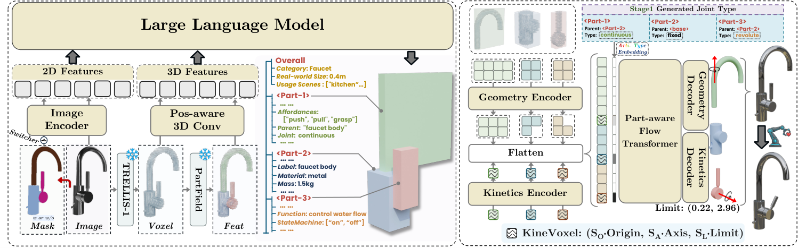

*原文 Figure 1：Figure 2 : Method overview. PhysForge consists of two stages: (Left) Stage 1: VLM-based Planning, where the VLM planner generates a “Hierarchical Physical Blueprint” defining part structure and physical properties. (Right) Stage 2: Diffusion-based Generation, where a diffusion model, guided by the blueprint, uses the KineVoxel Injection (KVI) mechanism to synergistically generate the final geometry, texture, and precise kinematic parameters. [查看图片来源](https://arxiv.org/html/2605.05163v1/pipeline.png)*

引用来源：arxiv_2608.02711

链接：[arXiv](https://arxiv.org/abs/2605.05163)

##### Velocity-Space 3D Asset Editing

作者：Haopu Liu, Yuxuan Lin, Jingfeng Guo, Ruihang Chu, Junjie Wang, Ruo-Tong Li, Yujiu Yang

主任务：adjacent

中文简介：

VS3D针对3D资产局部编辑任务，旨在修改目标区域同时严格保持其余部分不变。它提出一种无逆、无训练、无掩码的框架，直接在ODE采样器的速度场内部进行干预。通过重建锚定源注入吸收身份泄漏，利用部分均值引导放大编辑信号，并解决全局条件导致的身份拖拽问题。不同于依赖外部掩码或后处理合并的传统方法，VS3D从生成机制源头解决局部性与一致性的冲突，实现了更精准的局部编辑。

*原文 Figure 1：Figure 1: Overview of the VS3D pipeline. A source 3D asset is rendered and 2D-edited to obtain the condition. Stage 1 operates on the dense occupancy latent: RASI (§ 3.2 ) optimises a per-step ϕ t \phi_{t} to suppress v Δ v_{\Delta} on non-edited regions, and PMG (§ 3.3 ) amplifies the edit signal via subsample extrapolation. Stages 2–3 handle sparse geometry and material SLATs: TAR (§ 3.4 ) computes a token-wise p keep p_{\mathrm{keep}} map (blue = preserve, red = edit) and injects source residuals accordingly to produce the final edited asset. [查看图片来源](https://arxiv.org/html/2605.07385v1/pipeline.png)*

引用来源：arxiv_2608.02711

链接：[arXiv](https://arxiv.org/abs/2605.07385)

##### EditVerse3D: High-Quality 3D Object Editing with Region-Aware Learning

作者：Youtan Yin, Yan-Ning Zhou, Jiacheng Wei, Xiaofeng Yang, Jun Zhang, Jiayang Bai, Jingwen Ye, Weidong Zhang, Guosheng Lin

主任务：adjacent

中文简介：

该论文解决粗粒度区域指导下的3D物体编辑任务，输入为3D对象、粗略边界框及参考图像，输出为高质量编辑后的3D模型。核心方法是引入区域感知自适应损失，平衡目标区域与保留区域的优化目标，并辅以数据增强提升鲁棒性。区别于依赖精确掩码或冗余流程的前序方法，它允许用户指定模糊的兴趣区域，桥接了人类自然交互意图与机器精确编辑之间的差距，实现了更自然的局部修改。

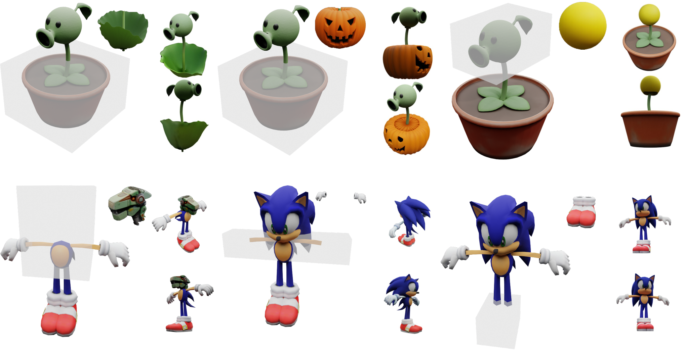

*原文 Figure 1：Figure 1 : Editing results of our method. Given a 3D object, a user-specified coarse 3D bounding box indicating the target editing region, and an image prompt defining the editing goal, our approach generates high-quality, coherent edits. Our method does not require fully edited 2D views, precise 3D masks, or redundant pipelines. [查看图片来源](https://arxiv.org/html/2607.07187v1/teaser.png)*

引用来源：arxiv_2608.02711

链接：[arXiv](https://arxiv.org/abs/2607.07187)

##### TanGO: Training-Free 3D Editing via Tangent-Space Guidance and Optimization

作者：Si-Woo Lim, Sunjae Yoon, Gwanhyeong Koo, Hyeonseo Yun, C. D. Yoo

主任务：adjacent

中文简介：

该论文针对3D流匹配模型的免训练编辑任务，输入为源3D对象及编辑目标，输出为编辑后的3D资产。核心方法是在生成动力学的切空间中进行自适应令牌引导，通过计算方向差异确定控制信号强度，实现单步最优控制。区别于传统全局上下文共享导致的结构坍塌，该方法在推理时针对特定实例优化令牌状态，无需更新模型权重，有效减少了语义伪影，提升了局部编辑的结构一致性。

*原文 Figure 1：Figure 1 : Overview of 3D Editing Results. TanGO achieves precise localized edits across diverse categories, preserving unedited geometry and source identity. [查看图片来源](https://arxiv.org/html/2607.14927v1/fig1.png)*

引用来源：arxiv_2608.02711

链接：[arXiv](https://arxiv.org/abs/2607.14927)
