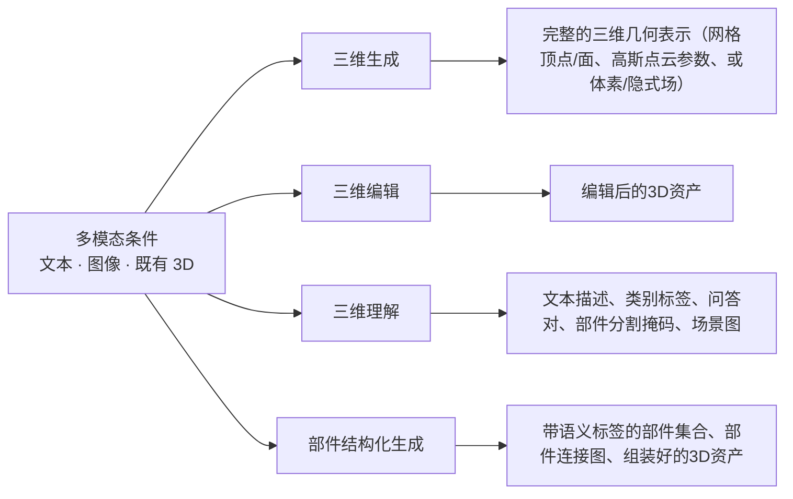
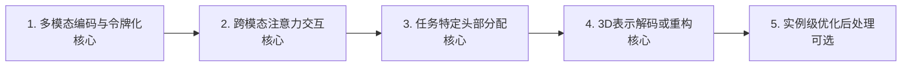
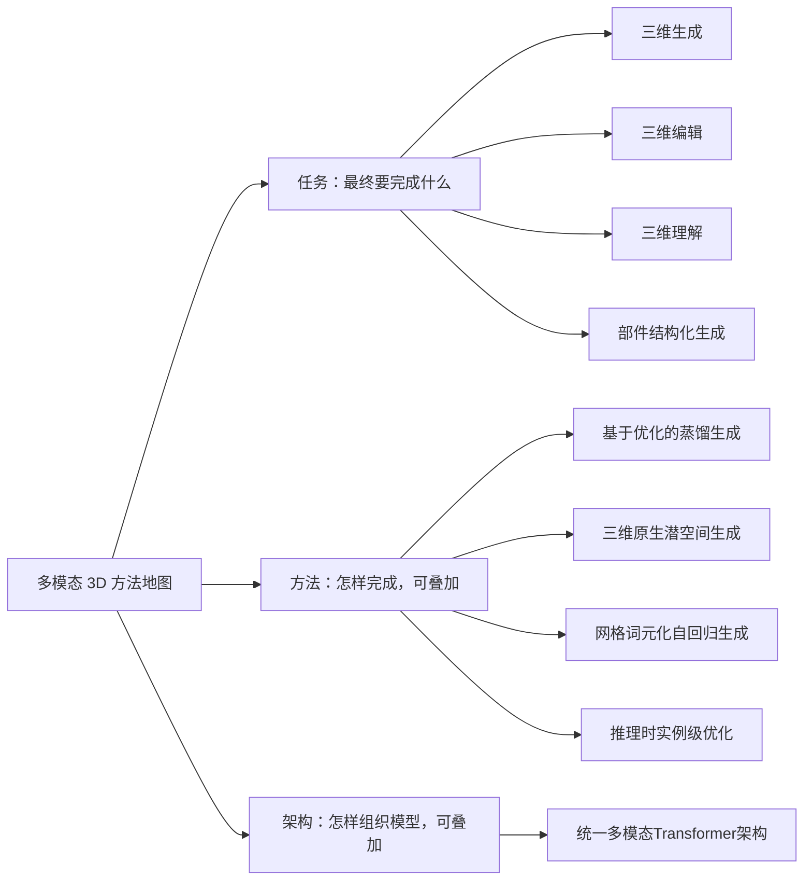
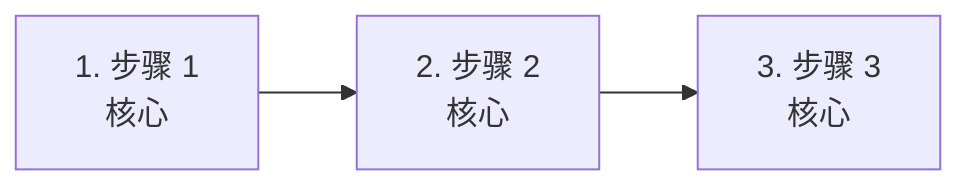
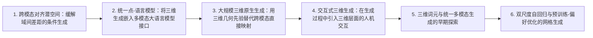
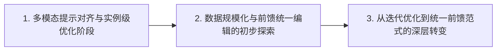
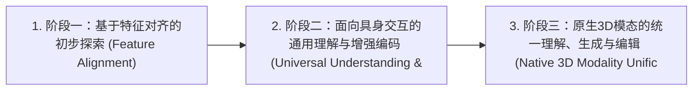
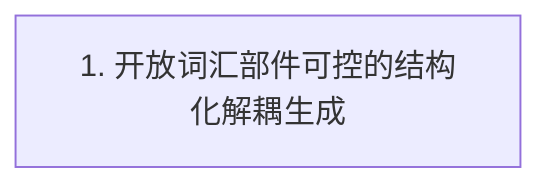
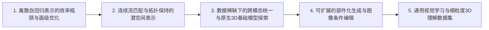

# 多模态3D：生成理解编辑全景：快速理解

> 当前页面用于快速建立领域地图。 [逐篇解析（109 篇）](full/) · [BibTeX 与 DBLP 查询结果](bibliography/index.html)

## 总述

### 一句话定义

本综述聚焦统一3D多模态模型，旨在单一架构内实现3D资产的生成、理解与编辑。区别于孤立任务，核心在于通过统一接口（如Transformer）使3D几何与文本、图像深度交互。研究边界严格限定于3D作为核心模态且与其他模态在模型内部融合的工作。目标是打破模态壁垒，构建具备跨模态推理能力的通用3D智能体，解决从语义指令到几何结构的双向映射难题，推动3D内容创作从专用工具向基础模型范式演进。

### 任务边界

### 快速要点

- **任务：** 涵盖三大核心任务：生成指从零合成完整3D资产；编辑指基于指令修改现有资产并保持全局一致；理解指将3D几何转化为语义描述或结构化数据。强调多模态在统一主干中的协同，而非简单串联。
- **输入：** 输入包括自然语言文本提示、参考图像、以及待处理的3D资产（如网格Mesh、高斯泼溅Gaussian Splatting或神经辐射场NeRF）。3D资产需以模型可处理的离散令牌或连续潜变量形式存在，作为几何与外观的基础载体。
- **输出：** 输出对应任务目标：生成任务产出新的3D几何与纹理；编辑任务产出修改后的3D资产，保留未编辑区域；理解任务产出文本描述、问答答案、部件分割掩码或结构化场景图，实现几何信息的语义化表达。
- **核心关注：** 3D数据稀缺且缺乏大规模高质量多模态配对；统一架构中几何离散性与语义连续性的对齐困难；编辑任务中局部修改与全局几何一致性的平衡；高分辨率3D生成带来的巨大计算与内存开销；跨模态幻觉导致生成结构与语义指令不匹配。
- **不纳入：** 只生成二维图像而不返回三维结果的工作；仅提供数据集、评测、压缩或底层表示而不完成上述任务的工作。

*面向读者：刚刚入学、了解 Transformer 等基础结构但不熟悉该细分领域的博士生；综述截止日期：2026-09-21。*

### 领域标准流程

下图只表达跨任务、跨论文的共同范式；标为可选的环节并非所有方法都包含。

## 分类

分类分为三个正交维度：每篇论文只有一个主任务；方法标签和架构标签可以叠加。

### 任务维度

#### 三维生成（generation）

指从文本、图像或其他模态条件出发，直接合成完整的三维资产（如网格 Mesh、高斯泼溅 Gaussian Splatting 或神经辐射场 NeRF）。核心在于从无到有地构建几何与外观，而非修改现有资产。

**核心范式：** Input: Text/Image Condition -> Module: Generative Model (Diffusion/AR/Flow) -> Output: Complete 3D Asset (Mesh/GS/NeRF)

**典型输入：** 文本提示词、参考图像、相机位姿条件

**典型输出：** 完整的三维几何表示（网格顶点/面、高斯点云参数、或体素/隐式场）

**类别典型流程（非领域标准）：**

#### 三维编辑（editing）

指在保留输入3D资产未编辑区域结构和外观一致性的前提下，根据文本或图像指令修改特定部分。核心挑战在于局部修改与全局一致性的平衡。

**核心范式：** Input: Existing 3D Asset + Edit Instruction -> Module: Editing Mechanism (Optimization/Inversion/Feed-forward) -> Output: Modified 3D Asset

**典型输入：** 源3D资产（Mesh/GS/NeRF）、编辑指令（文本/图像/掩码）

**典型输出：** 编辑后的3D资产

**类别典型流程（非领域标准）：**

#### 三维理解（understanding）

指从3D输入中提取语义信息，输出文本描述、问答答案、类别标签、部件分割掩码或空间关系图。核心在于将几何信号转化为语义符号。

**核心范式：** Input: 3D Asset -> Module: 3D Encoder / MLLM -> Output: Text/Semantic Labels/Structured Data

**典型输入：** 3D资产（点云、网格、多视图图像）

**典型输出：** 文本描述、类别标签、问答对、部件分割掩码、场景图

**类别典型流程（非领域标准）：**

#### 部件结构化生成（part_structured_generation）

指生成带有显式语义部件身份、层级结构及空间关系的3D资产。不仅生成几何，还确保每个部件（如椅子的腿、靠背）是可识别、可独立操作的实体。

**核心范式：** Input: Text/Image Condition -> Module: Structured Generator (Multi-branch/Hierarchical) -> Output: Semantically Labeled Parts with Relations

**典型输入：** 文本提示词、部件级指令、参考图像

**典型输出：** 带语义标签的部件集合、部件连接图、组装好的3D资产

**类别典型流程（非领域标准）：**

### 方法维度

#### 基于优化的蒸馏生成（optimization_based_distillation）

利用预训练2D扩散模型的先验，通过 Score Distillation Sampling (SDS) 等损失函数，在推理时针对每个实例优化3D表示参数。无需大规模3D数据训练，但推理速度慢。

**核心范式：** Initialize 3D Rep -> Render Views -> Compute SDS Loss against 2D Diffusion Prior -> Update 3D Params via Gradient Descent

**典型输入：** Text Prompt, Randomly Initialized 3D Representation

**典型输出：** Optimized 3D Representation

#### 三维原生潜空间生成（native_3d_latent_space）

通过训练3D VAE将3D数据压缩到低维潜空间，并在该潜空间中训练扩散模型或流模型进行前馈生成。实现了快速、一致的3D生成，避免了逐实例优化。

**核心范式：** 3D Data -> 3D VAE Encoder -> 3D Latent -> Latent Diffusion/Flow Model -> 3D VAE Decoder -> 3D Asset

**典型输入：** Text/Image Conditions, Noise Vector

**典型输出：** 3D Latent Vector, decoded to 3D Asset

#### 网格词元化自回归生成（mesh_tokenization_autoregressive）

将3D网格的顶点和面离散化为序列令牌（Tokens），利用自回归Transformer（如LLM架构）按序预测下一个令牌来生成3D网格。适合生成低多边形、生产友好的网格。

**核心范式：** Mesh -> Quantization/Tokenization -> Sequence of Tokens -> Autoregressive Transformer -> Token Sequence -> Detokenization -> Mesh

**典型输入：** Text Prompt, Start Token

**典型输出：** Sequence of Mesh Tokens, decoded to Mesh

#### 推理时实例级优化（inference_time_instance_optimization）

在测试或推理阶段，针对当前特定的输入实例（3D资产+指令），通过反向传播反复优化潜变量、参数或中间表示，以达成编辑或生成目标。不更新模型权重。

**核心范式：** Input Instance -> Initialize Optimizable Params -> Iterate: Render -> Compute Loss (Consistency/Instruction) -> Update Params -> Output

**典型输入：** Source 3D Asset, Edit Instruction

**典型输出：** Optimized 3D Representation

### 架构维度

#### 统一多模态Transformer架构（unified_multimodal_transformer）

采用单一的Transformer主干网络，通过统一的令牌接口处理3D、文本、图像等多种模态，支持理解与生成任务的联合建模。旨在打破模态壁垒，实现真正的多模态交互。

**核心范式：** All Modalities -> Unified Tokenizer -> Single Transformer Backbone -> Task-specific Heads / Next-token Prediction

**典型输入：** Mixed Modality Sequences (Text Tokens, Image Patches, 3D Tokens)

**典型输出：** Task-dependent Outputs (Text, 3D Tokens, Labels)

## 相关工作

本章不重复逐篇摘要，而是按照领域类别串起方法演化：先说明问题和范式，再说明代表工作如何改变方法，最后指出仍未解决的缺口。

### 三维生成（generation）

- **跨模态对齐潜空间：缓解域间差距的条件生成**：综合来看，从文本或图像直接学习三维形状的条件生成模型容易产生与条件不一致的结果，其核心原因是三维形状的分布与二维图像和文本存在显著差异，导致生成结果难以对齐输入条件。；方法变化：当前材料显示，Michelangelo 提出将三维形状表示到与图像、文本对齐的潜在空间中，再在该对齐空间中执行扩散生成，从而缓解三维与二维、文本之间的域间差距。；代表论文：arxiv_2306.17115。
- **统一点-语言模型：将三维生成嵌入多模态大语言模型接口**：综合来看，多模态大语言模型在二维图像-文本理解与图像生成上表现优异，但对三维世界的理解仍然不足，这限制了三维语言理解与生成任务的进展。；方法变化：当前材料显示，GPT4Point 将点云理解与三维生成统一到同一个多模态大语言模型框架中，通过点-文本交互接口同时支持点云描述、问答与可控三维生成，从而实现任务层面的统一建模。；代表论文：arxiv_2312.02980。
- **大规模三维原生生成：用三维几何先验替代跨模态直接映射**：综合来看，用户在现有数字工具中构思复杂三维世界的能力受限于工具需要大量专业知识和操作投入，因此需要一种将人类想象直接转化为高质量三维结构的可控生成方法。；方法变化：当前材料显示，CLAY 不再把文本或图像作为唯一的条件来源，而是同时支持多视角图像、体素、包围盒、点云、隐式表示等多种三维感知控制，并使用多分辨率自编码器与扩散 Transformer 的结构来直接建模大规模三维几何，以提升生成质量。；代表论文：arxiv_2406.13897。
- **交互式三维生成：在生成过程中引入三维层面的人机交互**：综合来看，现有三维目标生成方法虽然能够产生高质量结果，但在达到精确用户控制方面仍有不足，生成结果往往不符合用户预期且限制实际应用。；方法变化：当前材料显示，Interactive3D 从原有以文本指令或二维图像重建为主的生成范式转向交互式三维生成，在三维层面支持用户直接调整，以弥补文本控制能力有限和二维参考约束的问题。；代表论文：arxiv_2404.16510。
- **三维词元与统一多模态生成的早期探索**：综合来看，早期三维生成方法通常依赖二维扩散先验或独立的三维生成器，难以在同一模型中同时完成三维理解与三维生成，且生成结果往往受限于低分辨率或粗糙的几何代理，无法原生表达精细几何。；方法变化：这些摘要共同显示，ShapeLLM-Omni 尝试把三维对象量化为离散潜空间，形成三维感知词元，再让大语言模型以任意序列同时处理三维资产与文本，从而把三维生成从独立生成器转变为原生多模态大语言模型的一部分。；代表论文：arxiv_2506.01853。
- **双尺度自回归与预训练-偏好优化的网格生成**：综合来看，前一个阶段的三维词元自回归方法虽然绕过二维先验，但生成的网格常受限于有限面数和网格不完整，且单一尺度的词元预测难以同时刻画整体结构与局部细节。；方法变化：这些摘要共同显示，后续方法沿两条互补路径推进：CG-MLLM 用混合 Transformer 架构把词元级自回归与块级自回归解耦，分别处理细粒度几何与整体结构；DeepMesh 则在预训练阶段改进网格词元化算法、数据整理与处理，并首次把强化学习用于三维网格生成，通过直接偏好优化（DPO，一种用偏好数据直接对齐模型输出与人类偏好的强化学习变体）对齐人类审美。；代表论文：arxiv_2601.21798、arxiv_2503.15265。

**读者应记住：** 三维生成正在被纳入三维原生多模态大语言模型的统一框架，但其训练数据规模、生成分辨率上限和推理解码策略仍需全文核验才能做出可靠比较。

### 三维编辑（editing）

- **多模态提示对齐与实例级优化阶段**：综合来看，早期三维编辑方法主要依赖文本驱动，但文本描述在指定编辑结果的具体外观和空间位置时存在固有的模糊性和不准确性，导致编辑控制不够精确，且难以在保留未编辑区域一致性的同时实现细粒度的外观修改。；方法变化：这些摘要共同显示，为了解决控制精度问题，后续工作引入了图像提示（Image Prompts）作为文本的补充，并采用逐步2D个性化策略来学习现有场景和参考图像的表示。这种方法通过多模态约束增强了对外观和位置的准确控制，但仍依赖于针对特定输入的优化或个性化过程。；代表论文：arxiv_2401.14828。
- **数据规模化与前馈统一编辑的初步探索**：综合来看，此前的编辑方法往往速度慢，容易产生几何失真，或者依赖于容易出错且不切实际的手动精确3D掩码，缺乏跨视图一致性和细粒度可控性，限制了其在实际应用中的普及。；方法变化：这些摘要共同显示，最新的研究方向转向构建大规模配对3D编辑数据集（如3DEditVerse），并开发前馈（Feedforward）模型架构。通过适应ControlNet等机制实现文本 steerability，以及利用流匹配训练和直接偏好优化（DPO），旨在实现快速、一致且无需逐实例优化的3D编辑。；代表论文：arxiv_2510.02994、arxiv_2512.13678。
- **从迭代优化到统一前馈范式的深层转变**：综合来看，现有的三维编辑方法主要受限于两个核心问题：一是依赖二维模型引导的显式迭代优化过程极其耗时，通常需要数千次更新步骤；二是缺乏通用的设计来统一处理不同的编辑任务，因为几何操纵往往需要针对特定任务（如外观编辑需保留几何，而移除需改变几何）制定规则。此外，高质量成对监督数据的稀缺限制了端到端学习模型的训练，导致现有数据集存在定位不准、边界模糊和语义一致性弱等问题。；方法变化：这些摘要共同显示，研究范式正从基于优化的测试时适应转向基于学习的单次前馈生成框架。新方法试图通过统一的模型架构隐式地泛化各种编辑任务，利用结构化三维表示（如稀疏体素潜空间）和流匹配（Flow Matching）或整流流（Rectified Flow）技术，在单次推理中实现全局一致的三维变形和细节恢复，从而避免了对源资产的逐实例迭代优化。；代表论文：arxiv_2603.17841、arxiv_2602.21499、arxiv_2605.27351。

**读者应记住：** 三维编辑领域正在经历从“优化即推理”到“学习即推理”的范式转移，核心突破点在于构建能够隐式理解并执行多样化编辑指令的统一三维生成模型，同时克服数据稀缺和多视图一致性的双重挑战。

### 三维理解（understanding）

- **阶段一：基于特征对齐的初步探索 (Feature Alignment)**：综合来看，早期大型语言模型（LLM）缺乏处理3D几何数据的能力，主要瓶颈在于如何将离散的、无序的点云（Point Cloud，一种由三维坐标组成的集合，用于表示物体表面）特征有效地融合进连续的语言嵌入空间中，且缺乏高质量的成对训练数据。；方法变化：这些摘要共同显示，该阶段引入了专用的点云编码器，并通过两阶段训练策略（预训练对齐+指令微调），将几何、外观和语言信息在特征层面进行融合，使LLM能够响应基于点云的指令。；代表论文：arxiv_2308.16911。
- **阶段二：面向具身交互的通用理解与增强编码 (Universal Understanding & Enhanced Encoding)**：综合来看，前一阶段的模型在复杂几何理解和具身交互（Embodied Interaction，指智能体在三维环境中通过感知和行动与环境互动）场景下表现不足，主要瓶颈在于3D编码器对几何细节的捕捉能力有限，以及缺乏针对具身任务的专用基准。；方法变化：这些摘要共同显示，后续方法通过扩展3D编码器（如从ReCon到ReCon++），利用多视图图像蒸馏（Multi-view Image Distillation，一种利用2D图像知识增强3D表示学习的技术）来增强几何理解能力，并构建了人工策划的基准测试以评估通用3D对象理解能力。；代表论文：arxiv_2402.17766。
- **阶段三：原生3D模态的统一理解、生成与编辑 (Native 3D Modality Unification)**：综合来看，现有基于扩散的重建模型将语义理解与几何推理解耦，而基于MLLM的方法往往将3D模态视为外部输出而非多模态序列的原生组成部分，导致几何流形与MLLM特征空间的对齐缺乏系统性分析，难以实现真正的统一建模。；方法变化：这些摘要共同显示，最新方法引入混合Transformer（Mixture-of-Transformers, MoT）架构，将3D网格（Mesh，一种由顶点、边和面组成的三维表示形式）作为原生模态纳入MLLM，扩展了模态边界，实现了上下文感知的编辑、理解和生成的统一框架。；代表论文：arxiv_2605.16745。

**读者应记住：** 三维理解领域已跨越简单的特征映射阶段，正通过原生模态建模解决几何与语义的深度对齐问题，但如何在统一框架下平衡高精度几何重建与高效语义推理仍是开放挑战。

### 部件结构化生成（part_structured_generation）

- **开放词汇部件可控的结构化解耦生成**：综合来看，现有生成模型通常输出单体网格或任意分割的部件，无法对齐应用特定的语义结构需求（如游戏动画所需的特定部件分解），且缺乏在推理时对部件结构进行显式控制的能力。；方法变化：这些摘要共同显示，方法从整体隐式生成转变为显式暴露部件结构作为推理时的控制信号。通过接收全局文本提示和用户定义的开放词汇部件Schema，模型将生成过程解耦为针对每个Schema元素的独立网格生成，并最终组装为连贯对象。；代表论文：arxiv_2605.28763。

**读者应记住：** 部件结构化生成的核心在于“先规划后生成”或“并行受控生成”，通过显式语义标签打通了文本条件与3D几何局部细节之间的映射壁垒，为实现高保真、可编辑的3D内容生成提供了基础架构。

### 背景与上下文工作（非任务背景）

- **离散自回归表示的效率瓶颈与面级优化**：综合来看，早期基于自回归（Autoregressive, AR，一种按顺序逐个预测序列元素的生成范式）Transformer的3D网格生成方法将网格展平为顶点坐标序列，导致推理成本随网格规模二次增长，且离散量化引入几何误差。；方法变化：这些摘要共同显示，后续方法通过改变语义层级（从顶点到面）或引入连续潜空间来解决效率与精度问题。FACE提出“一面一词元”策略，将序列长度压缩9倍；MeshFlow则引入变分自编码器（VAE，一种将数据映射到连续概率分布的编码-解码架构）将离散拓扑与连续坐标映射到连续潜空间，并结合整流流（Rectified Flow，一种通过直线路径连接噪声与数据分布的生成模型）Transformer实现并行生成。；代表论文：arxiv_2603.01515、arxiv_2606.04621。
- **连续流匹配与拓扑保持的潜空间表示**：综合来看，连续扩散和流匹配方法虽支持并行合成，但无法直接应用于网格，因为网格连通性是离散的，与标准连续噪声注入不兼容。；方法变化：这些摘要共同显示，研究者通过设计拓扑保持的连续嵌入或半结构化表示来桥接离散几何与连续生成模型。PolyFlow引入紧凑拓扑嵌入器，将离散顶点投影为连续每顶点嵌入；LATO提出拓扑保持潜表示，通过体素VAE压缩顶点位移场并直接预测边连通性；LATTICE提出VoxSet，将3D资产压缩为锚定在粗体素网格上的潜向量集，以支持位置感知生成。；代表论文：arxiv_2606.30673、arxiv_2603.06357、arxiv_2512.03052。
- **数据稀缺下的跨模态统一与原生3D基础模型探索**：综合来看，与丰富的2D图像相比，高质量3D资产稀缺，使得3D合成欠约束。现有方法常依赖间接管线（2D编辑后提升至3D），牺牲了几何一致性。；方法变化：这些摘要共同显示，研究趋向于构建3D原生基础模型，利用跨模态一致性作为隐式结构约束。Omni123在单个自回归框架内统一文本到2D和文本到3D生成，将文本、图像和3D表示为共享序列中的离散词元。BLIP3o-NEXT展示了原生图像生成模型在统一生成与编辑方面的进展，为3D多模态统一提供架构参考。；代表论文：arxiv_2604.02289、arxiv_2510.15857。
- **可扩展的部件化生成与图像条件编辑**：综合来看，现有3D编辑框架在视觉可控性、几何一致性和可扩展性之间面临权衡。优化方法慢，2D传播易漂移，无训练方法受限于冻结先验。部件化生成则面临组件增加时的二次全局注意力成本。；方法变化：这些摘要共同显示，方法向可扩展的潜空间翻译和稀疏注意力机制演进。ShapeUP将编辑公式化为原生3D表示内的监督潜空间到潜空间翻译，利用预训练3D基础模型。MoCA引入基于重要性的组件路由和无关组件压缩，以支持可扩展的部件化3D生成。NaTex则通过在3D空间中直接预测纹理颜色，避免多视图扩散模型的局限性。；代表论文：arxiv_2512.07628、arxiv_2602.05676、arxiv_2511.16317。
- **通用视觉学习与细粒度3D理解数据集**：综合来看，图像生成器是否具备类似LLM的 emergent 理解能力尚缺证据，且3D部分理解受限于无纹理几何和专家依赖标注。；方法变化：这些摘要共同显示，研究开始验证生成模型的通用视觉学习能力，并构建更高质量的3D理解数据集。Vision Banana证明图像生成训练可作为通用视觉表征学习的预训练。PartNeXt提供超过23,000个带细粒度分层部件标签的高质量纹理3D模型，用于基准测试3D部分分割和以部分为中心的问答。；代表论文：arxiv_2604.20329、arxiv_2510.20155。

**读者应记住：** 背景工作已解决了3D表示的连续性、生成效率及部分跨模态对齐问题，但大多数工作仍侧重于单一任务（如仅生成或仅编辑）或单模态（3D或2D）的优化。Omni123等工作虽尝试统一文本到2D/3D生成，但完整的“生成-理解-编辑”统一框架及真正的3D原生多模态交互仍需主体论文进一步阐述。
