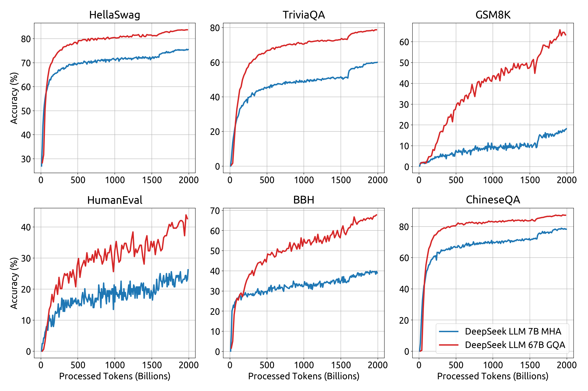
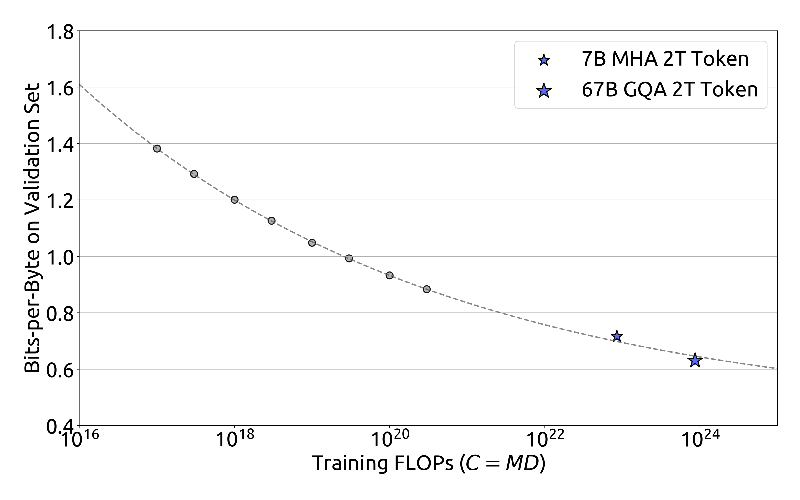

# DeepSeek-V1 怎么训练：从 2T 语料到 Chat 模型

> 本文讲的是 DeepSeek 主模型系列的早期 V1：论文正式名称是 [DeepSeek LLM: Scaling Open-Source Language Models with Longtermism](https://arxiv.org/abs/2401.02954)，不是 DeepSeekMath。读者是刚入学、已经懂基本 Transformer、但还不熟悉大模型训练路线的博士生。本文只解释这篇 DeepSeek LLM 论文公开报告的训练范式；DeepSeekMath（arXiv:2402.03300）会作为相关后续工作简短提及，不能把它的 GRPO 流程冒充 V1 主模型的训练流程。

## 先给一个整体印象

DeepSeek-V1 可以看成一条相对经典、但工程规模很大的 LLM 路线：

```text
中英文为主的 2T token 数据
        ↓ decoder-only Transformer 预训练
DeepSeek LLM Base（7B / 67B）
        ↓ 超过 100 万条监督指令数据做 SFT
DeepSeek LLM Chat
        ↓ helpfulness / harmlessness 偏好数据做 DPO
DeepSeek LLM Chat DPO
```

预训练解决“模型会不会续写语言”；SFT 解决“模型能不能按指令回答”；DPO 进一步调整“多个合理回答中，哪一种更符合人类偏好”。论文的核心贡献之一，是把数据规模、模型结构、缩放规律和后训练实验公开得比较完整。



图 1　论文 Figure 7：DeepSeek LLM Base 在预训练过程中多个基准指标的变化。原图来自 [DeepSeek LLM（arXiv:2401.02954）](https://arxiv.org/abs/2401.02954)。

## 1. 先把对象说清楚：V1 是什么

论文中的模型是 **DeepSeek LLM**，发布了 7B 和 67B 两个主要规模的 Base/Chat 模型。这里的“7B”和“67B”指参数规模量级，不是两个完全不同的算法。

它们是从头训练的 decoder-only Transformer。论文标题里的 “scaling” 不是只把模型做大，而是研究：在给定计算预算下，模型参数量、训练 token 数、batch size 和学习率应该如何配合，才能更有效地使用训练资源。

不要把这篇论文和后来名字相近的工作混在一起：

- **DeepSeek LLM（2401.02954）**：主模型系列早期 V1，重点是通用中英双语 LLM 的预训练与 Chat 对齐；
- **DeepSeekMath（2402.03300）**：在代码基座上做数学继续预训练，并研究 GRPO；它不是本篇 V1 主模型论文；
- 后续 V2、V3 等公开论文的架构和训练路线可能不同，不能由 V1 论文直接推出。

## 2. 预训练：用 2T token 学会通用语言

### 2.1 数据规模和语言

论文为预训练收集了约 **2 trillion（2T）tokens** 的数据，主要是中文和英文。模型通过标准的自监督 next-token prediction 学习：给定前面的 token，预测下一个 token，并用预测误差更新 Transformer 参数。

这一步没有人工为每个问题写答案。网页、书籍、代码或其他文本被组织成 token 序列，模型从序列本身学习语言规律、知识表达和代码模式。训练完成后得到的是 **Base 模型**，它更像一个强大的续写器，而不是天然会遵循聊天指令的助手。

### 2.2 数据不是“越多越好”这么简单

论文讨论了数据组成和质量，也比较了不同数据配比对语言、代码、数学和中文任务的影响。2T 是这次发布的训练规模，不代表所有模型训练都应该固定使用 2T token。

论文还指出，DeepSeek LLM 与 LLaMA 系列采用相近的整体设计，并通过实验拟合规模规律：小模型实验可以帮助预测更大模型在不同计算预算下的表现，从而指导 7B 和 67B 的 batch size、学习率及模型/数据分配。



图 2　论文 Figure 4/5 所对应的规模规律结果：在不同计算预算下估计最优模型与数据分配，并预测 7B、67B 的验证集表现。原图来自 [DeepSeek LLM（arXiv:2401.02954）](https://arxiv.org/abs/2401.02954)。

## 3. 模型结构：熟悉的 decoder-only Transformer，但有明确取舍

DeepSeek LLM 的微观结构大体沿用了 LLaMA 风格。论文明确报告的要点包括：

- **Pre-Norm + RMSNorm**：在 Transformer 子层前做归一化，有利于深层训练稳定；
- **SwiGLU**：作为前馈网络（FFN）的激活结构，相比普通 ReLU/GELU 有更灵活的门控；
- **RoPE**：用旋转位置编码把位置信息注入注意力；
- **Grouped-Query Attention（GQA）**：67B 模型采用 GQA，而不是传统的 Multi-Head Attention，以降低推理时键值缓存和带宽成本；
- **多步学习率调度**：论文用 multi-step scheduler 替代 cosine scheduler，便于在继续训练时复用前一阶段的训练结果。

这些是 V1 论文报告的结构和训练选择。用户常说的 “MQA” 并不是这篇论文对 67B 的准确表述；论文写的是 **GQA**，因此这里不把 MQA 写成 V1 的架构结论。

## 4. 规模规律：为什么先做小实验

直接训练 67B 很昂贵，很多超参数不能靠猜。论文先在较小模型和不同计算预算下做网格搜索，观察：

1. batch size 和学习率在一段范围内都可能接近最优；
2. 计算预算增加时，最优 batch size 往往变大，学习率往往变小；
3. 可以拟合模型规模、数据规模与验证损失之间的关系；
4. 用小规模实验得到的规律，指导 7B 和 67B 的训练配置。

因此，V1 的“训练范式”不只是把 2T 数据扔给模型，还包括用可控的小实验估计大训练的配置。这是工程上很重要的一层：**先建立缩放规律，再决定大模型怎样训练。**

## 5. SFT：把 Base 变成会听指令的 Chat 模型

### 5.1 输入和输出发生了什么变化

预训练时，输入通常是一段连续文本，目标是预测下一个 token；SFT 时，输入变成指令、问题或多轮对话，目标变成示范答案。例如：

```text
用户：用中文解释什么是 attention。
助手：Attention 可以理解为……
```

训练时主要让模型学习助手答案的 token，使它学会回答格式、语言风格、任务边界和基本指令遵循。

### 5.2 论文中的 SFT 数据

DeepSeek LLM 论文报告收集了超过 **1 million** 条监督微调实例，来源覆盖多种任务和中英文场景。数据中包含知识、推理、数学、代码、写作和对话等内容；论文还分析了不同数据配比和两阶段 SFT 的影响。

7B 模型的实验中，研究者尝试先使用较完整的数据，再加入不含数学和代码的第二阶段数据，以减轻重复生成；67B 模型在第一阶段后的重复率已经较低，因此采用的 SFT 阶段不同。这个差异提醒我们：论文中的后训练步骤不是机械固定的模板，会随模型规模和观察到的问题调整。

### 5.3 SFT 的能力边界

论文明确讨论：SFT 更主要是在学习“如何以正确格式回答”和补充特定数据中的知识、代码与数学模式；不能简单说 SFT 单独创造了完整的推理能力。对于包含 CoT 的示范，模型可能学会输出推理路径的形式，但这和真正可靠的推理机制不是同一个命题。

## 6. DPO：用偏好数据继续调整回答

SFT 后的模型已经能聊天，但同一个问题可能有多个“都说得通”的答案。DeepSeek LLM 继续使用 **Direct Preference Optimization（DPO）**，用成对的偏好数据表达：对同一个输入，哪个回答更有帮助、更安全。

```text
输入：请解释一个技术概念
偏好答案：清楚、准确、符合用户要求
非偏好答案：含糊、无关或存在安全问题
```

DPO 不需要像 PPO 那样单独训练一个奖励模型再在线采样策略，它直接用偏好对优化语言模型相对于参考模型的概率关系。对入门者来说，可以把它理解为：SFT 教模型“模仿示范答案”，DPO 进一步教模型“在两个可选答案中更偏向被人选中的那个”。

论文使用 helpfulness 和 harmlessness 偏好数据训练 DPO，并报告它主要改善开放式生成和对话质量；标准基准能力的变化相对有限。论文还报告 DeepSeek 67B Chat DPO 在中英文开放式评测中有进一步提升。

## 7. 这一篇没有报告什么

为了避免把不同 DeepSeek 工作混在一起，边界需要明确：

- 这篇 V1 论文没有把 **GRPO** 作为主模型训练步骤。GRPO 出现在后来的 DeepSeekMath 论文中；
- 这篇论文公开的是 7B/67B 主模型及其 SFT、DPO 路线，不等于后续 V2、V3 的全部训练细节；
- 论文给出了大量实验和设计选择，但无法据此还原 DeepSeek 内部未公开的工程实现、数据供应链或全部过滤规则；
- “2T 中文英文 token → SFT → DPO”是本论文的高层摘要，不应当被理解为所有 LLM 的唯一训练范式。

## 8. 用一句话记住 DeepSeek-V1

**DeepSeek-V1 从头训练一个 7B/67B 的中英双语 decoder-only Transformer，用规模规律指导 2T token 预训练，再用百万级指令数据做 SFT，最后用 helpfulness/harmlessness 偏好数据做 DPO，得到更适合对话的 Chat 模型。**

## 资料

- [DeepSeek LLM: Scaling Open-Source Language Models with Longtermism（arXiv:2401.02954）](https://arxiv.org/abs/2401.02954)
- [DeepSeek LLM 论文 HTML 全文](https://arxiv.org/html/2401.02954)
- [DeepSeekMath: Pushing the Limits of Mathematical Reasoning in Open Language Models（相关后续工作，arXiv:2402.03300）](https://arxiv.org/abs/2402.03300)
