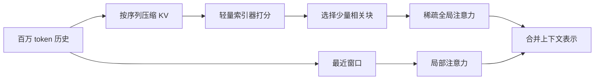
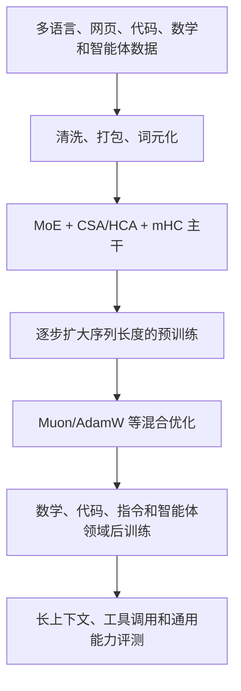
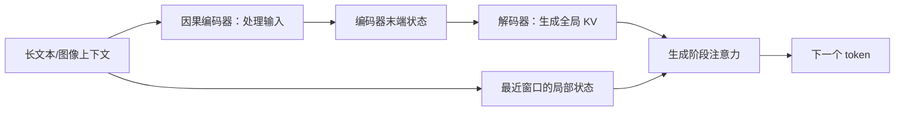

# DeepSeek-V4 与 V4.1：百万上下文模型怎样训练与部署

> 本文面向刚入学、已经理解 Transformer 基本结构，但还不熟悉超长上下文、混合专家和大模型系统工程的博士生。重点不是罗列所有模块，而是解释：DeepSeek-V4 和 DeepSeek-V4.1-Flash 为什么要改变注意力、残差连接、优化器以及缓存系统。

## 先给结论

可以把这两代模型理解为同一条路线的两个阶段：

1. **DeepSeek-V4** 先解决“百万 token 上下文如何在模型中高效计算”的问题：用 MoE 扩大总容量，用 CSA/HCA 压缩并稀疏访问历史，用 mHC 改善深层残差传播，再用 Muon 和配套基础设施把它训练起来。
2. **DeepSeek-V4.1-Flash** 继续解决“输入特别长、而且要反复调用的智能体任务如何部署”的问题：用 CED 减少预填充，用 CSA2 跨层复用 KV 和索引，用 FP4 保存全局 KV，并用 SWA Bounded Replay 减少持久化缓存。

这里的“训练范式”不只是一个损失函数。它包括模型结构、数据和训练阶段、优化方法，以及训练后能否以合理的计算和存储成本运行。文中的 Mermaid 图是本文为帮助读者建立整体印象绘制的示意图，不是论文原图。

## 1. 从普通 LLM 到百万上下文

### 1.1 普通 decoder-only Transformer 在做什么

给定 token 序列 \(x_1,\ldots,x_n\)，标准因果语言模型在每个位置预测下一个 token：

\[
 p(x_{t+1}\mid x_{\leq t}).
\]

训练时通常把大量文本切成固定长度的片段，最小化所有位置的 next-token cross-entropy。推理时，模型先一次性处理提示词（**prefill，预填充**），再逐 token 生成（**decode，解码**）。为了避免每一步重新计算历史，注意力会保存历史 token 的 Key 和 Value，这就是 **KV cache**。

这个范式的瓶颈很直观：普通全注意力需要让查询访问很长的历史，计算量随序列长度快速增长；KV cache 则大致随历史 token 数线性增长。上下文从 8K、128K 扩展到 1M token 后，问题不再只是“显存够不够”，还包括跨设备通信、SSD/主机内存容量、缓存恢复时间，以及预填充是否需要把长输入完整地通过每一层。

### 1.2 为什么使用 MoE

混合专家（Mixture-of-Experts，MoE）把一个大前馈层拆成许多专家。路由器为每个 token 选择少数专家，因此模型有很大的**总参数量**，但每个 token 只激活较小的**计算量**。这能把“容量”和“每 token 成本”部分分离。

MoE 并不是免费午餐：路由会带来专家负载不平衡、设备间 token dispatch/combine 通信，以及训练和推理内核实现困难。因此，V4 的关键并非单独“用了 MoE”，而是把稀疏计算、注意力压缩和系统实现一起设计。

## 2. DeepSeek-V4：让百万 token 变得可计算


*图 1：DeepSeek-V4 公开技术报告中的架构示意图。这里用它定位 CSA/HCA、MoE 与主干的关系；本文后面的 Mermaid 图是面向入门读者的流程化重画。来源：[DeepSeek-V4 论文页面](https://arxiv.org/abs/2606.19348)。*

DeepSeek-V4 论文报告了 V4-Pro 和 V4-Flash 两种 MoE 模型，均支持约一百万 token 上下文。公开报告给出的规模分别约为 1.6T 总参数/49B 激活参数，以及 284B 总参数/13B 激活参数；模型在超过 32T token 上进行预训练，随后进行多阶段后训练。这里的数字和模块名称来自论文报告；不同硬件、批大小和实现下的实际速度不能直接由参数量推断。

### 2.1 CSA：先压缩，再稀疏选择

**Compressed Sparse Attention（CSA，压缩稀疏注意力）**的直觉是：历史信息不必保持“每个 token 一个完整 KV，并让每个查询读取全部历史”。模型先沿序列把若干 token 压缩成较少的表示，再由轻量索引器估计哪些压缩块最相关，只对 Top-K 候选做全局注意力；局部信息由滑动窗口分支保留。

可以把它看成两条路径：



压缩会丢失细节，稀疏选择也可能漏掉真正重要的位置，所以 CSA 不是“把注意力近似掉就结束了”。滑动窗口负责短程依赖，索引器负责从长程历史中找候选，训练时还要尽量让索引范围和推理时保持一致。

### 2.2 HCA：更强压缩的另一条注意力路径

**Heavily Compressed Attention（HCA，高度压缩注意力）**把历史进一步压缩成更少的条目，并对这些压缩条目做相对稠密的读取。它与 CSA 的取舍不同：CSA 更强调“压缩后再选少量位置”，HCA 更强调“极少的压缩条目仍可被充分读取”。两者交错使用，目的是同时保留局部细节、较远信息和可接受的缓存规模。

因此，V4 的混合注意力不是一个统一的“标准层”。不同层可以承担不同角色：有的层更适合稀疏检索，有的层更适合对压缩记忆做稳定聚合。这种设计是该模型的具体方案，不能直接当作所有百万上下文模型的通用规范。

### 2.3 mHC：把残差流变成可控的多路连接

标准 Transformer 的残差大致是 (h_{l+1}=h_l+F_l(h_l))。当网络很深、分支很多时，残差更新的尺度和信号传播会影响训练稳定性。**Manifold-Constrained Hyper-Connections（mHC）**维护多个残差流，并让流之间的混合系数受到约束，使表示在深层传播时不容易无界放大或衰减。

对初学者来说，可以先把 mHC 看成“受约束的多路残差高速公路”：它不是替换注意力，也不是新的语言建模目标，而是改善深层网络中信息如何跨层传递。V4.1-Flash 又对它做了 Single-Pass mHC 的工程化改写，减少一次模块中重复读取激活的开销。

### 2.4 Muon 与混合优化

V4 没有把所有参数都用同一个优化器更新。公开报告中，主要线性矩阵使用 **Muon**，而嵌入、输出头、归一化参数等结构使用 AdamW 或专门的更新方式。Muon 的目标是利用矩阵参数的结构改善大规模训练中的更新方向和收敛效率。

这意味着“V4 使用 Muon”并不等于“整个模型只用 Muon”。真实训练是一个混合优化系统：参数类型、并行方式和内存预算共同决定更新规则。Muon 还需要访问完整矩阵梯度，因此训练框架必须重新安排 ZeRO 分片、专家参数和通信。

### 2.5 V4 的训练管线

从高层看，V4 的流程可以画成：



预训练时，序列长度逐步扩展到百万级，并从较稠密的注意力路径过渡到压缩、稀疏路径；这样做的目的，是让模型先学会稳定的语言建模，再逐渐适应长程表示和稀疏访问。后训练阶段则组合数学、代码、智能体和指令遵循等领域数据，并使用多教师 on-policy distillation 等方法合并能力。论文还报告了 FP4 量化感知训练等工程措施，但这些是特定模型的实现选择，不应误读为新的基础损失函数。

### 2.6 V4 的系统配套

如果只有论文里的公式，V4 无法真正运行。训练系统需要处理：

- **专家并行通信**：把 token 发到对应专家，同时尽量将通信和矩阵计算重叠；
- **压缩注意力内核**：融合压缩、索引和注意力操作，减少 Python 调度及中间张量；
- **长上下文并行**：不同设备处理不同序列片段时，要正确交换跨分区的压缩块；
- **异构 KV cache**：全局压缩 KV、局部窗口状态和未完成压缩的尾部 token 采用不同存储策略；
- **确定性算子与检查点**：让大规模训练出现数值异常时能够复现和恢复。

所以，V4 的“训练范式”应理解为模型结构、数据课程、优化器、并行框架和推理缓存的组合，而不是某个孤立的 attention 模块。

## 3. DeepSeek-V4.1-Flash：进一步压缩输入侧成本


*图 2：DeepSeek-V4.1-Flash 论文中的架构示意图。它帮助定位 CED、CSA2 与缓存路径；具体模块解释以论文正文为准。来源：[DeepSeek-V4.1-Flash](https://arxiv.org/abs/2609.19969)。*

V4.1-Flash 面向长时程智能体和多模态输入。公开论文报告模型总规模约 552B，预填充阶段每 token 激活约 8B 参数，解码阶段约 16B 参数，训练数据约 45T 多模态 token。与 V4 相比，它关注得更具体：长输入反复到来时，如何减少预填充计算、HBM 中的 KV、以及 SSD/主机内存中的持久缓存。

### 3.1 CED：预填充和解码走不同路径

**Causal Encoder-Decoder（CED，因果编码器—解码器）**把骨干划分为输入侧编码器和生成侧解码器。长输入主要经过编码器；解码器的全局 KV 可以由编码器末端状态经过各层投影得到，而不必让整段输入完整通过所有解码器层。局部滑动窗口仍由相应路径计算，以保留短程信息。



CED 的关键不是把编码器和解码器简单串联，而是让**预填充**和**解码**拥有不同的激活规模。对输入占比很高的代理任务，这种不对称更符合真实负载。

### 3.2 CSA2：跨层复用 KV 和索引

**Compressed Sparse Attention 2（CSA2）**在 CSA 的基础上进一步复用层间状态。层可以处于三种模式：

- **Full**：生成自己的主 KV、索引器 Key 并完成 Top-K 选择；
- **Reindex**：复用最近 Full 层的 KV 和索引器 Key，但用当前层 Query 重新打分，因此各层仍可选择不同位置；
- **Reuse**：同时复用主 KV 和最近的 Top-K 位置，直接执行稀疏注意力。

这样，不是每一层都重新保存和扫描一套长上下文状态。分层索引器先建立候选池，后续层在候选池内重排，避免每层都对百万位置做完整扫描。

### 3.3 FP4 KV cache：存储压缩，不等于 FP4 矩阵乘法

V4.1-Flash 将全局主 KV 以四位浮点格式保存，并共享尺度因子；对量化更敏感的滑动窗口 KV 仍使用更高精度格式。读取时先反量化，再参与注意力。因此，这项设计主要节省 HBM、主机内存和 SSD 容量，不能简单理解为硬件必须直接执行 FP4 乘法。

论文报告全局 KV footprint 约为每 token 890 字节，约为 V4-Flash 的四分之一。这个数字依赖模型配置和缓存定义，应作为论文实验条件下的结果，而不是所有模型的固定上限。

### 3.4 SWA Bounded Replay：不保存全部局部状态

滑动窗口注意力（SWA）的 KV 只对最近窗口有用。V4.1-Flash 不把所有 SWA KV 长期写入持久缓存；缓存未命中时，只对最近 (n_{\text{win}}) 个 token 做有限重放，从而近似恢复当前局部状态。

这是一种明确的工程折中：

```text
完整保存 SWA 状态：持久存储大，恢复快，结果更接近精确计算
有界重放：持久存储小，需要少量重算，恢复结果存在近似误差
```

论文在测试中报告质量损失很小，并将持久 KV footprint 降到 V4-Flash 的约八分之一。但极端长文档、缓存边界和多轮代理轨迹仍需要额外压力测试；“小损失”不能自动推广到所有任务。

## 4. 两代模型放在一起看

| 维度 | DeepSeek-V4 | DeepSeek-V4.1-Flash |
|---|---|---|
| 主要问题 | 百万上下文的整体计算与存储 | 输入密集型代理的预填充、缓存和传输 |
| 主干 | MoE、CSA/HCA、mHC | 精简后的 MoE、CED、CSA2、Single-Pass mHC |
| 长程状态 | 压缩并稀疏选择，全局与局部混合 | 跨层复用，并对全局 KV 做 FP4 存储 |
| 局部状态 | 通过滑动窗口保留 | 缺失时用 SWA Bounded Replay 恢复 |
| 训练重点 | 百万上下文预训练、混合优化、系统并行 | 多模态长上下文预训练，并使推理部署与缓存策略匹配 |
| 公开目标 | 在可控成本下支持百万 token | 进一步降低长输入场景的预填充和持久缓存成本 |

可以看到，V4 主要是在**架构层面重新组织“如何看历史”**，V4.1-Flash 则把问题推进到**不同阶段、不同层和不同存储介质如何共享状态**。后者不是简单增加一个更强的模型层，而是把模型和 serving 系统一起设计。

## 5. 容易误解的三件事

1. **百万上下文不等于模型能可靠记住一百万 token。** 窗口长度是系统允许处理的范围；检索准确率、信息位置、任务类型和提示组织仍会影响实际效果。
2. **稀疏注意力不等于所有历史都被丢弃。** CSA/CSA2 用压缩和候选选择降低访问量，同时保留局部窗口；压缩和选择必然引入近似风险。
3. **V4.1-Flash 的缓存优化不等于训练时全部使用低精度。** FP4 主要用于全局 KV 的存储；训练参数、激活和不同模块可以采用不同精度与更新方式。

## 6. 证据边界与局限

本文关于模块名称、模型规模、训练 token 数和缓存比例的描述，来自 DeepSeek-V4 系列公开技术报告及 [DeepSeek-V4.1-Flash 论文](https://arxiv.org/abs/2609.19969)，并参考已有的主模型演进整理：[V4 逐篇解析](../../../surveys/deepseek-main-llm-evolution-20261007/full/survey.md)。关于“为什么这样设计”的部分，是根据论文结构做的教学性解释；它不意味着作者已经证明了唯一因果关系。

公开资料通常不会给出所有数据配比、完整训练代码和每个硬件内核的可复现实验。因此，本文不把 V4/V4.1 的工程选择写成整个领域的标准，也不据此断言在其他硬件、数据或工作负载上一定得到同样的加速比。尤其是稀疏选择、缓存量化和有界重放，都需要结合真实长上下文任务继续验证。

## 参考资料

- [DeepSeek-V4: Towards Highly Efficient Million-Token Context Intelligence（公开资料入口）](https://arxiv.org/abs/2606.19348)
- [DeepSeek-V4.1-Flash: Pushing the Limits of KV Cache Compression](https://arxiv.org/abs/2609.19969)
- [DeepSeek 主模型系列演进：V1 到 V4.1（现有 Survey）](../../../surveys/deepseek-main-llm-evolution-20261007/)
