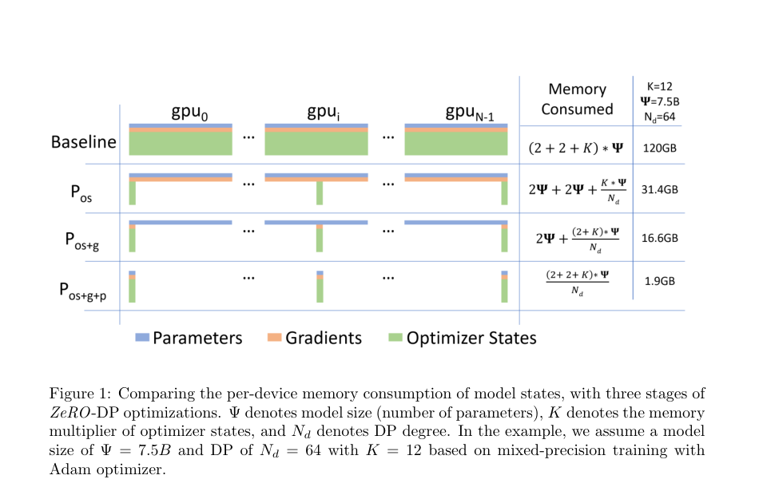

# 预训练 LLM 框架：DeepSpeed 怎么把大模型训练跑起来

一个 Transformer 的训练公式并不复杂：读入 token，预测下一个 token，计算损失，反向传播，再更新参数。但把这套循环扩展到数十亿参数、数千亿 token 和多机 GPU 时，困难常常先出现在系统层：单卡显存放不下训练状态，GPU 之间等待数据或通信，训练中断后无法从正确位置继续。DeepSpeed 是建立在 PyTorch 上的深度学习训练系统：它用训练引擎和配置接口，把分布式并行、显存管理、混合精度、优化器与检查点等能力接入训练循环。[DeepSpeed 入门文档](https://www.deepspeed.ai/getting-started/)给出的核心接口是 `deepspeed.initialize`、引擎的 `backward` / `step` 和检查点 API。

这里的“框架”指**组织训练执行的系统层**。它不决定 LLM 必须采用哪种 Transformer 结构、数据集或预训练目标；模型仍定义“算什么”，训练系统负责“如何让这次计算跨设备、可承受、可恢复地完成”。DeepSpeed 也只是这一类系统的一个有代表性的实例。下面借它建立阅读其他预训练工程时也能复用的地图。

## 先看一次预训练 step

假设我们做自回归语言建模。原始文本先经过清洗、tokenizer 编码、拼接或切块，得到固定长度的 token 序列；模型读入前面的 token，输出每个位置的词表分布，和右移一位的目标 token 计算损失。**数据内容、tokenizer、样本顺序和训练目标由项目决定**，DeepSpeed 可以接管或配合 PyTorch 的数据加载器，但不会替研究者定义这些选择。[入门文档](https://www.deepspeed.ai/getting-started/)明确将模型、可选数据加载器、优化器与调度器传给训练引擎。

一次典型更新可理解为：

1. 数据进程从语料中取出一批 token，把它们送到对应 GPU；
2. 模型执行前向传播，保存反向传播将要用到的中间激活，并计算 loss；
3. 反向传播得到梯度；跨 GPU 的并行组在必要位置交换梯度或激活；
4. 优化器（常见如 Adam）根据梯度和它维护的历史统计量更新参数，学习率调度器推进一步；
5. 定期保存参数、优化器等训练状态，以便故障后续训。

DeepSpeed 的 `deepspeed.initialize(...)` 把 PyTorch 模型包成训练引擎。假设模型的 `forward(batch)` 返回标量损失，循环中调用 `loss = engine(batch)`、`engine.backward(loss)`、`engine.step()`。这几个调用看起来短，背后却可能包含梯度累积、通信、精度转换和按分片更新。[官方训练示例](https://www.deepspeed.ai/getting-started/) 展示了这一接口。以下是**概念示意**，不是可直接运行的完整脚本：

```python
engine, optimizer, loader, scheduler = deepspeed.initialize(
    model=model, model_parameters=model.parameters(),
    training_data=dataset, config="ds_config.json"
)
for batch in loader:
    loss = engine(batch)
    engine.backward(loss)
    engine.step()
```

## 为什么一张 GPU 很快放不下

模型参数只是显存的一部分。训练还需要**梯度**（损失对每个参数的导数）、**优化器状态**（例如 Adam 为每个参数保存的一阶和二阶动量）、前向产生的**激活**，以及通信缓冲和临时张量。参数量增长时，前三种与参数有关的状态大体一起增长；序列长度和 micro-batch 增大时，激活也会增加。推理只用前向，不能拿“模型权重能放进显存”推断“模型能在同一显卡上训练”。[ZeRO 论文](https://arxiv.org/abs/1910.02054)把参数、梯度和优化器状态统称为 model states，并以混合精度 Adam 为例分析其显存占用。

**梯度累积**解决另一种容量约束：单次前向的样本太多会撑爆激活显存。把一个大 batch 分成几个 micro-batch（一次前向、反向实际处理的小批次），先累加梯度，最后做一次参数更新。若每个数据并行副本的 micro-batch 大小为 `m`，累积 `a` 次，数据并行副本数为 `d`，则一次更新看到的全局 batch 大小通常为 `m × a × d` 个样本；token 数还要乘以有效序列长度，并注意最后一批及变长样本。累积缩小**单次**激活需求，但并不会自动缩小参数和优化器状态。[官方配置示例](https://www.deepspeed.ai/getting-started/)含 `gradient_accumulation_steps` 等字段。

## 多卡该怎么分工

“多 GPU 训练”至少有三种不同的切分对象。它们可以组合，但代价也不同：

| 方法 | 切分什么 | 一次 step 中主要交换什么 | 主要用途 |
| --- | --- | --- | --- |
| 数据并行（DP） | 每张卡放同一模型，处理不同样本 | 梯度或其分片 | 提高样本吞吐；普通 DP 的模型状态仍重复保存 |
| 张量并行（TP） | 把一层的矩阵运算分给多张卡 | 层内中间结果 | 单层放不下或希望共同计算一层 |
| 流水线并行（PP） | 把不同 Transformer 层分到不同卡 | 相邻阶段的激活及其反向梯度 | 整体模型按层拆开 |

DP 组里的每张卡若各自更新而不对齐梯度，参数会逐渐分叉，所以需要同步。TP 在一层内部反复通信，PP 在阶段边界传递激活；因此硬件互联速度和模型切分方式会影响效率。DeepSpeed 提供数据并行、[流水线并行](https://www.deepspeed.ai/tutorials/pipeline/)，并能与 [Megatron-LM 式模型并行](https://www.deepspeed.ai/tutorials/megatron/)配合。一个常见的“3D 并行”方案是组合 DP、TP、PP，但不是所有预训练都需要同时启用三者；先由模型大小、GPU 数量和互联拓扑决定切分。[官方功能说明](https://www.deepspeed.ai/features/)

流水线并行还有一个容易忽略的时间问题：如果第 2 张卡必须等第 1 张卡完成整个 batch 的前向，它会长期闲置。把 batch 再拆成 micro-batch，让不同流水线阶段交错处理，能减少这种空等，但阶段间的空隙（pipeline bubble）仍可能存在；阶段负载不均衡也会拖慢整体速度。[DeepSpeed 流水线教程](https://www.deepspeed.ai/tutorials/pipeline/)画出了 micro-batch 前向、反向及数据并行梯度归约的时间安排。

## ZeRO：把重复保存的状态分掉

普通 DP 让多张 GPU 处理不同数据，却让每张卡都保存整套模型参数、梯度与优化器状态。ZeRO（Zero Redundancy Optimizer）的切入点是：**同一 DP 组内，不必让每张卡长期持有所有这些状态的完整副本**。分片后，每张卡只保存自己负责的部分；要计算或更新时，再通过通信取得所需内容。[ZeRO 论文](https://arxiv.org/abs/1910.02054)与[官方教程](https://www.deepspeed.ai/tutorials/zero/)分别给出思想和实现配置。



*图源：[Rajbhandari 等，ZeRO，Figure 1](https://arxiv.org/abs/1910.02054)。蓝色为参数、橙色为梯度、绿色为优化器状态；从上到下逐步分片。右侧 120 GB、31.4 GB、16.6 GB、1.9 GB 是论文设定的 7.5B 参数、64 路数据并行、混合精度 Adam 情形下的**模型状态**估算，不包括所有激活和实际运行开销，不能直接当作任意任务的每卡总显存。*

三个阶段是累加关系：

- **ZeRO-1**：分片优化器状态。每张卡只维护和更新负责参数的 Adam 状态，更新后的参数信息需要让其他卡得到。
- **ZeRO-2**：再分片梯度。反向产生的梯度归约到负责该参数分片的 GPU，不再让每张卡长期保存完整梯度。
- **ZeRO-3**：再分片模型参数。某层将要前向或反向计算时，临时汇集所需参数，用完后可重新分片。省下更多驻留显存，也引入更频繁的参数通信。

可用一个口语化的类比记住边界：普通 DP 是“每个工位都有整套账本”，ZeRO 是“账本分管，计算时借阅相关页”。分片减少**长期持有的副本**，不会让计算和通信免费：阶段越深，显存与通信、调度复杂度的取舍越明显。ZeRO 的数据并行组仍在协同训练同一模型；它和“把一层矩阵乘法本身切开”的 TP 解决的是不同层面的问题。DeepSpeed 还支持把部分状态卸载到 CPU 或 NVMe 等更大但更慢的存储层；这扩大可训练规模，性能取决于传输带宽与访问模式。[ZeRO 教程](https://www.deepspeed.ai/tutorials/zero/)及 [ZeRO-Infinity 论文](https://arxiv.org/abs/2104.07857)。

## 混合精度、激活重算与通信

预训练通常不会让所有张量始终用 FP32（32 位浮点数）。**混合精度**让适合的计算与存储采用 FP16 或 BF16（两种 16 位浮点格式），同时在需要的位置保留更高精度的状态或计算。它可降低显存与数据传输量，并利用支持相应格式的硬件加速；但选择格式还要考虑数值范围。FP16 梯度很小时可能下溢，DeepSpeed 的 FP16 路径可用 *loss scaling*（放大损失再恢复梯度尺度）处理；BF16 的指数范围与 FP32 相近，通常不依赖同样的动态 loss scaling 机制。配置中的 `fp16`、`bf16` 选项决定所走路径，不能把“16 位训练”理解成所有训练状态都仅占 2 字节。[DeepSpeed 配置文档](https://www.deepspeed.ai/docs/config-json/)与[混合精度功能说明](https://www.deepspeed.ai/features/)。

**激活检查点 / 重算**针对另一块显存：前向时只保存部分层的激活，反向需要其余激活时再执行一段前向计算。它用额外计算换显存，尤其在长序列和深层网络中有用；不要和“保存训练进度到磁盘”的检查点混淆。DeepSpeed 提供激活检查点接口及分片选项。[官方功能说明](https://www.deepspeed.ai/features/#activation-checkpoints)

通信贯穿上述选择：普通 DP 常对梯度做 all-reduce（每张卡得到归约结果）；ZeRO 可使用 reduce-scatter（归约后每张卡只留下自己的梯度分片）和 all-gather（汇集分片）等集体通信；TP 交换层内张量，PP 交换阶段边界的激活。**算得快**不等于**整步快**：如果每层都等待慢网络，或 CPU 卸载来不及把数据送回 GPU，吞吐仍会受限。实际配置通常需要同时量测 GPU 利用率、显存、每步耗时和网络通信，而不能只看参数规模。[ZeRO 论文](https://arxiv.org/abs/1910.02054)、[DeepSpeed 功能说明](https://www.deepspeed.ai/features/)。

## 检查点：恢复的是训练过程

长时间预训练需要周期性保存检查点。若目标是**继续训练**，只有模型权重通常不够：优化器动量、学习率调度器状态、全局 step，必要时还包括随机数与数据采样位置，都关系到恢复后的轨迹。DeepSpeed 的 `save_checkpoint` / `load_checkpoint` 保存和加载由引擎管理的状态，并提供 `client_state` 让项目保存自己的 step 等信息；数据迭代器的精确位置是否能恢复，仍取决于项目如何记录和重建。[官方入门文档的恢复示例](https://www.deepspeed.ai/getting-started/#model-checkpointing)。

启用 ZeRO 后，训练检查点可能按 rank 分片保存。用于**推理或发布**的一份完整模型权重，与用于**续训**的分片训练状态不是同一交付物；需要时可按官方工具把 ZeRO 检查点整理为可单独加载的权重，但要考虑合并时的 CPU 内存需求。[ZeRO 教程的权重提取说明](https://www.deepspeed.ai/tutorials/zero/#extracting-weights)。保存训练检查点还意味着所有相关进程要在同一逻辑 step 协调，不能只让一个 rank 随意保存它看到的分片。

## 用这张地图读一个实际工程

看到一个 DeepSpeed 预训练项目时，可以按以下顺序检查：**数据**如何变成 token batch、每个样本的有效长度与顺序是什么；**模型**如何定义前向与 loss；**batch** 的单卡 micro-batch、累积次数和 DP 规模是多少；**切分**采用 DP、TP、PP 中哪些维度；**状态**由 ZeRO 哪一阶段管理、是否卸载；**数值**采用 FP16 还是 BF16；**恢复**保存了哪些训练状态。最后再看性能数字的口径：是样本每秒、token 每秒、每卡吞吐，还是达到某个 loss 所需时间。

这就是 DeepSpeed 最值得学习的框架范式：围绕一个训练 step，明确谁持有数据和状态、何时计算、何时通信、何时持久化。具体项目可以换模型、换并行组合或换训练系统，但这些问题始终存在。

## 延伸阅读

- [DeepSpeed 官方入门：训练引擎、训练循环与检查点](https://www.deepspeed.ai/getting-started/)
- [DeepSpeed 官方 ZeRO 教程：阶段、配置与权重提取](https://www.deepspeed.ai/tutorials/zero/)
- [DeepSpeed 官方流水线并行教程](https://www.deepspeed.ai/tutorials/pipeline/)
- [ZeRO 原论文：Memory Optimizations Toward Training Trillion Parameter Models](https://arxiv.org/abs/1910.02054)

## QA

暂无问答。
