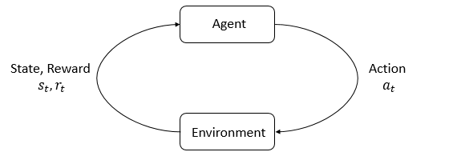

# LLM 入门（二）：强化学习入门，让模型通过试错学会行动

如果你已经懂 Transformer，但还没有系统学过强化学习，可以先把它理解成一个循环：**观察当前情况，选择一个动作，得到反馈，再根据长期结果调整下一次选择**。

强化学习（reinforcement learning，RL）和普通的监督学习不同。监督学习直接告诉模型“这道题的正确答案是什么”；强化学习通常只给一个奖励信号，让模型自己试出哪些行为更有利。本文只建立最基本的地图，不展开 PPO、GRPO 的算法细节；它们属于后面的策略优化阶段。

## 先看一张总图：智能体和环境反复交互



*图 1：OpenAI Spinning Up 的强化学习交互示意图。智能体（agent）根据状态选择动作，环境（environment）返回新的状态和奖励；图片来自 [Spinning Up: Intro to RL](https://spinningup.openai.com/en/latest/spinningup/rl_intro.html)，源代码与文档采用 [MIT License](https://github.com/openai/spinningup/blob/master/LICENSE)。图中的符号是教学示意，不意味着所有环境都以相同接口实现。*

读图时先不要记公式，只记住箭头：环境给出状态，智能体输出动作，环境根据动作变化并给奖励。这一轮结束后，新的状态又成为下一轮输入。

## 1. 环境、状态和动作

**环境（environment）**是智能体之外、负责产生反馈的世界。它可以是一个游戏模拟器、机器人控制器、推荐系统，也可以只是一个很小的程序。

**状态（state）**描述智能体现在处于什么情况。比如迷宫任务中的当前位置、墙的位置和终点位置；自动驾驶中的相机画面、速度和周围车辆；LLM 任务中的对话上下文和当前已经生成的 token。

**动作（action）**是智能体此刻可以采取的选择。迷宫中可以向上、下、左、右走；机器人可以输出关节力矩；语言模型可以选择下一个 token。动作空间可以是离散的，也可以是连续的。

这三个概念要分开：状态是“我现在看到什么”，动作是“我能做什么”，环境是“做完之后世界如何变化”。

## 2. 奖励：告诉系统什么方向比较好

**奖励（reward）**是环境在一次动作之后返回的反馈。它不是对整条轨迹的完整解释，而是当前这一步的数值信号。

以走迷宫为例：每走一步得到 `-1`，撞墙得到 `-2`，到达终点得到 `+10`。这样设计的意图是让智能体既想找到终点，又不希望无意义地绕路。

奖励函数实际上定义了“什么算好”。如果把撞墙奖励设得太低，智能体可能频繁撞墙；如果只有到达终点才有奖励，学习会更难，因为大多数随机尝试都得不到反馈。奖励设计因此常常和模型结构一样重要。

## 3. 轨迹和回合：把一次经历串起来

一次交互可以写成一串经历：

```text
(状态 s0, 动作 a0, 奖励 r1, 状态 s1)
(状态 s1, 动作 a1, 奖励 r2, 状态 s2)
...
```

这串经历叫**轨迹（trajectory）**。从开始状态出发，到任务结束或达到时间上限，这一段完整过程叫一个**回合（episode）**。

例如迷宫智能体从左上角出发，走 12 步到达出口，这 12 次状态—动作—奖励变化就是一个回合。训练时，智能体会采样很多回合，比较哪些行为最终走得更远、得到的总奖励更高。

## 4. 为什么不能只看一步奖励

强化学习最容易混淆的一点是：**眼前奖励最高的动作，不一定带来最好的最终结果**。

假设迷宫中有两条路：向右一步立刻得到 `+1`，但会进入死胡同；向上一步得到 `0`，却能在几步后走到终点并得到 `+10`。只看当前奖励会选择向右；考虑未来，就应该选择向上。

因此我们关心的不只是即时奖励，还关心从现在开始可能累积的回报（return）。通常会对较远的奖励做折扣：越晚得到的奖励，影响可以越小。折扣并不是说未来不重要，而是让系统在“长期收益”和“及时反馈”之间有一个可控的权衡。

## 5. 价值：估计“从这里出发有多大希望”

**价值（value）**是对未来回报的预测。状态价值问的是：

> 如果现在处于状态 `s`，以后按照当前策略行动，平均还能得到多少回报？

动作价值进一步问：

> 在状态 `s` 采取动作 `a`，之后继续行动，平均能得到多少回报？

这两个概念不是环境直接返回的数字，而是模型根据很多经历学出来的估计。回到迷宫例子：靠近出口的格子通常价值较高；虽然某一步没有即时奖励，但它可能通向高价值区域。

价值估计解释了强化学习为什么能处理延迟反馈：终点的奖励可以逐步向前传播，让早期动作也知道自己是否有帮助。

## 6. 策略：从状态到动作的规则

**策略（policy）**描述智能体如何行动。给定状态 `s`，策略可以输出一个确定动作，也可以输出动作概率：

```text
在这个状态：向上 0.6，向右 0.3，向下 0.1
```

训练的目标不是让某个固定动作永远出现，而是让策略在长期回报高的动作上分配更多概率。推理或部署时，策略才真正拿当前状态选择动作；训练时则要反复采样并根据结果更新它。

## 7. 探索与利用：先试什么，后用什么

如果智能体永远选择当前估计最好的动作，它可能错过一条从未尝试过的好路，这叫**利用（exploitation）**。如果它总是随机尝试，又很难稳定使用已经学到的经验，这叫**探索（exploration）**。

最简单的办法是 ε-greedy：大多数时候选择当前价值最高的动作，少数时候随机探索。训练早期可以让 ε 较大，随着经验增多逐渐减少；但在环境变化或任务不确定时，仍可能需要保留探索。

迷宫中，智能体最初不知道哪条路通向出口，所以需要试错；学会一条好路线后，又不能因为眼前的成功就完全停止寻找更短的路线。探索和利用是强化学习持续存在的张力。

## 8. 训练和推理分别在做什么

训练阶段的主循环可以概括为：

1. 用当前策略在环境中运行，收集一批轨迹；
2. 计算每一步得到的奖励、回报或价值估计；
3. 找出哪些动作比预期更好或更差；
4. 调整策略（以及可能的价值模型）；
5. 用更新后的策略继续采样。

推理阶段通常不再更新参数：给定新的状态，直接用已经训练好的策略选择动作。在迷宫里，就是把当前格子输入策略，得到下一步方向；在 LLM 里，就是根据上下文生成回答。训练是“从经验改变策略”，推理是“用策略做决定”。

训练和推理的环境也可能不同。训练可以模拟成千上万次失败，真实部署则要关注安全、延迟和成本，因此不能把“训练时奖励高”直接等同于“上线后一定可靠”。

## 9. 从这个基础走向 PPO 和 GRPO

到这里可以把强化学习记成一条链：

> **状态 → 策略选动作 → 环境给奖励 → 形成轨迹 → 估计长期价值 → 更新策略**

PPO、GRPO 都是在“更新策略”这一步工作的算法。PPO 用受约束的策略更新，避免一次更新让新策略偏离旧策略太远；GRPO 针对同一个问题采样一组回答，用组内奖励的相对差异作为更新信号。它们都建立在本文的基础概念之上：没有状态、动作、奖励、轨迹和策略，就很难理解它们到底在优化什么。

## 一个最小的学习检查

读完后，可以用走迷宫自测：

- 环境是什么？——迷宫规则和地图。
- 状态是什么？——当前位置以及智能体可见的地图信息。
- 动作是什么？——上、下、左、右。
- 奖励是什么？——每步代价和到达终点的奖励。
- 轨迹是什么？——从起点到终点的一串交互记录。
- 为什么要价值？——因为正确的动作可能要过几步才得到回报。
- 为什么要探索？——因为当前看来最好的路可能不是全局最好的路。
- 训练和推理差在哪里？——训练会用轨迹更新策略，推理只执行策略。

如果这些问题都能回答，再进入 PPO 或 GRPO 会更顺畅：你需要学习的不是一堆新名词，而是它们怎样利用已有的奖励和轨迹，更稳定地改变策略。

## 进一步阅读

- [OpenAI Spinning Up：Introduction to RL](https://spinningup.openai.com/en/latest/spinningup/rl_intro.html)：面向实践者的强化学习入门，本文配图来自此处。
- [Sutton & Barto：Reinforcement Learning: An Introduction](http://incompleteideas.net/book/the-book-2nd.html)：经典教材，系统介绍状态、动作、奖励、价值和策略。
- [Hugging Face Deep RL Course](https://huggingface.co/learn/deep-rl-course/unit0/introduction)：带代码练习的现代入门课程。

## QA

暂无问答。
