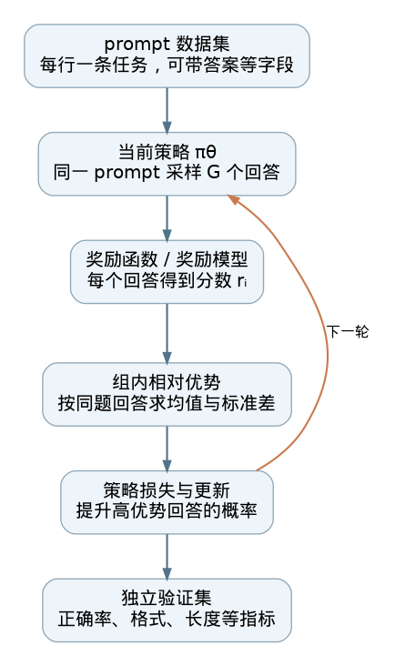

# LLM 强化学习框架：用 TRL 跑通 GRPO

预训练时，Transformer 看到一段文本，学习预测下一个 token。进入强化学习阶段后，我们更关心**整段回答完成后是否有用**：一道数学题是否答对，代码能否通过测试，输出是否满足格式。奖励往往在生成结束后才能算出，训练程序因此要把「采样回答—打分—把分数转成更新信号—更新模型」接成循环。[TRL 的 GRPOTrainer 文档](https://huggingface.co/docs/trl/main/en/grpo_trainer)把这一循环落到了可调用的训练器中。

## TRL 在这里负责什么

[TRL（Transformer Reinforcement Learning）](https://github.com/huggingface/trl)是 Hugging Face 的语言模型后训练库。它提供 SFT、偏好优化和在线强化学习等训练器；`GRPOTrainer` 是其中实现 Group Relative Policy Optimization（GRPO，组相对策略优化）的入口。它接收待训练模型、含 `prompt` 的数据集、奖励来源和 `GRPOConfig`，管理生成、奖励收集、优势计算、损失、反向传播、日志与保存。训练后主要产物是**更新过的策略模型及检查点**，同时有奖励、生成长度等训练记录；这些记录并不能单独证明模型在未见过的任务上变好。[官方仓库](https://github.com/huggingface/trl)｜[训练器接口与实现](https://github.com/huggingface/trl/blob/main/trl/trainer/grpo_trainer.py)



*图 1：本文依据 [TRL 官方 GRPO 文档](https://huggingface.co/docs/trl/main/en/grpo_trainer)与[训练器实现](https://github.com/huggingface/trl/blob/main/trl/trainer/grpo_trainer.py)自绘的典型流程图，并非官方原图。箭头「下一轮」表示更新后的策略再生成新回答。*

## 一次训练循环，数据怎样流动

### 1. 准备 prompt，而非逐 token 标签

普通的训练数据至少有一列 `prompt`。一行可以是纯文本问题，也可以是带 `role` 和 `content` 的对话消息；例如「计算 17×19，只输出整数」。数据集还可以携带 `answer` 等列，供奖励函数核对答案。`GRPOTrainer` 读取任务后，用模型自带的 tokenizer 或 processor 把它转成模型输入。这里的 `answer` 是**给奖励函数用的参考信息**，不是强制模型逐字模仿的监督标签。数据格式见 [TRL 文档](https://huggingface.co/docs/trl/main/en/grpo_trainer#using-a-custom-reward-function)。

### 2. 同一题采样多个回答

对一个 prompt，当前策略模型按生成设置采样 `G` 个 completion（回答）；`G` 由 `GRPOConfig.num_generations` 指定。例如同一题可能得到 `323`、`322`、`323`、`我不会` 四个候选。这里的随机采样很关键：只生成一个回答，就无法比较**同题回答之间**的好坏。训练器会持续使用当前模型生成新数据，所以这是在线更新；生成长度、采样温度和批量大小也会影响速度、显存与候选多样性。[GRPO 文档：生成回答](https://huggingface.co/docs/trl/main/en/grpo_trainer#generating-completions)｜[GRPOConfig](https://github.com/huggingface/trl/blob/main/trl/trainer/grpo_config.py)

### 3. 奖励函数给每个回答一个分数

奖励来源可以是可执行规则、外部验证器、奖励模型，或多个奖励函数的组合。对于有确定答案的题，可以比较最终答案；对于代码，可以运行测试；对于格式任务，可以检查结构。自定义函数接收一批 `completions`，也能收到数据集中的其他列，并返回与回答一一对应的浮点分数。若有多个奖励函数，TRL 可以按权重合成奖励。**奖励设计属于任务定义**：如果规则只检查有没有数字，模型可能学会输出数字，却不一定学会正确推理。[自定义奖励接口](https://huggingface.co/docs/trl/main/en/grpo_trainer#using-a-custom-reward-function)｜[奖励计算实现](https://github.com/huggingface/trl/blob/main/trl/trainer/grpo_trainer.py)

### 4. 把绝对分数变成组内相对优势

GRPO 的核心不是「答对就加一」，而是比较**同一道题的多个回答**。设这组奖励为 `r₁…rG`。基本形式先减去组内平均值，再用组内标准差缩放：

```text
优势 Aᵢ = (rᵢ − 这一组奖励的均值) / (这一组奖励的标准差 + 小量)
```

例如四个分数是 `[1, 0, 1, 0]`，两个高分回答得到正优势，两个低分回答得到负优势。这样，训练信号告诉模型：在**同一个问题**上，哪些采样回答更值得提高概率。与需要单独训练价值模型来估计基线的 PPO 设置相比，[DeepSeekMath 原论文](https://arxiv.org/abs/2402.03300)提出用组内奖励形成相对基线，减轻了这部分模型开销。若同一题的回答全得相同分数，组内区分信号就很弱；TRL 也记录 `frac_reward_zero_std` 供观察。当前 TRL 默认按组标准差缩放，同时允许用 `scale_rewards` 改成批量缩放或不缩放；这些是**实现选择**，不是 GRPO 名称本身要求的唯一做法。[原论文](https://arxiv.org/abs/2402.03300)｜[TRL 配置](https://github.com/huggingface/trl/blob/main/trl/trainer/grpo_config.py)｜[日志指标](https://huggingface.co/docs/trl/main/en/grpo_trainer#logged-metrics)

### 5. 将优势传回策略模型

训练器计算生成 token 在当前策略下的概率，用优势构造策略损失：高优势回答中的 token 倾向于被提高概率，低优势回答中的 token 倾向于被降低概率。更新时可以用裁剪约束策略概率比，避免一次更新偏离采样时的策略过远；可选的 KL 惩罚则约束当前策略与参考策略的差异。这些操作作用于**模型参数**，之后再从新策略采样，形成下一轮循环。奖励通常是整段回答的分数，策略损失再把这一信号作用到回答的 token 上；这也解释了为什么奖励噪声和回答长度会影响训练。[TRL 方法说明](https://huggingface.co/docs/trl/main/en/grpo_trainer#looking-deeper-into-the-grpo-method)｜[DeepSeekMath 原论文](https://arxiv.org/abs/2402.03300)

## 一个最小接口示例

下面示例展示接口连接方式，奖励故意使用简单的整数精确匹配，适合辨认 `prompt`、生成回答和数据集附加列的关系。它**不是经过调参或验证的数学推理训练配方**。纯文本 `prompt` 对应的 `completions` 是字符串；如果改用对话格式，奖励函数应按消息结构读取回答。[官方快速开始](https://huggingface.co/docs/trl/main/en/grpo_trainer#quick-start)｜[官方奖励函数示例](https://huggingface.co/docs/trl/main/en/grpo_trainer#using-a-custom-reward-function)

```python
from datasets import Dataset
from trl import GRPOConfig, GRPOTrainer

train_data = Dataset.from_dict({
    "prompt": ["计算 17×19，只输出整数。", "计算 24×7，只输出整数。"],
    "answer": ["323", "168"],
})

def exact_answer_reward(completions, answer, **kwargs):
    return [1.0 if text.strip() == gold else 0.0
            for text, gold in zip(completions, answer)]

config = GRPOConfig(
    output_dir="grpo-demo",
    num_generations=4,
    per_device_train_batch_size=4,
    max_completion_length=32,
    max_steps=20,
)

trainer = GRPOTrainer(
    model="Qwen/Qwen2.5-0.5B-Instruct",
    args=config,
    train_dataset=train_data,
    reward_funcs=exact_answer_reward,
)
trainer.train()
```

真实任务需要足够多且覆盖目标分布的 prompt、可靠的奖励验证、合适的初始模型与算力。比如上例的精确匹配会把「答案是 323」判错，也会在所有采样都错时给出相同奖励；更完善的答案抽取与判题器才能产生有用信号。训练配置还需检查 `num_generations` 与有效批量大小的整除关系、生成长度限制以及内存占用。[GRPOConfig 定义](https://github.com/huggingface/trl/blob/main/trl/trainer/grpo_config.py)

## 评估什么，怎样避免读错曲线

TRL 可接收 `eval_dataset` 并记录验证阶段的奖励、奖励标准差、回答长度等指标；训练日志还提供各奖励函数的均值和 `frac_reward_zero_std`。这能帮助诊断：奖励不动，是模型没有进步，还是判题器始终给同分？长度突然增加，是更完整的推理，还是模型在利用奖励漏洞？这些问题都要回到实际生成文本检查。[TRL 日志指标](https://huggingface.co/docs/trl/main/en/grpo_trainer#logged-metrics)

研究中还应留出**独立测试题**，用与训练奖励不同的检查方式评估目标能力：数学看题目级正确率及推理错误类型，代码看隐藏测试通过率，格式任务看约束满足率，并与训练前模型比较。训练奖励升高只表明模型越来越符合当前奖励器；它既不等于泛化能力，也不能替代人工抽样审阅。

## 论文算法与 TRL 实现的边界

[DeepSeekMath](https://arxiv.org/abs/2402.03300)提出 GRPO 的组内相对奖励思想和策略目标；[TRL](https://huggingface.co/docs/trl/main/en/grpo_trainer)把它组织成可运行的软件接口。两者应分开读：原论文的公式包含参考策略 KL 项，而当前 TRL `GRPOConfig.beta` 默认是 `0.0`，即默认不启用这项惩罚；当前配置的 `loss_type` 默认是 `dapo`，与原论文按回答长度归一化的损失形式也有区别。配置默认值会随版本演进，复现实验应记录 TRL 版本、实际配置、模型、数据与奖励代码。[配置源码](https://github.com/huggingface/trl/blob/main/trl/trainer/grpo_config.py)｜[损失形式说明](https://huggingface.co/docs/trl/main/en/grpo_trainer#loss-types)

可以把 `GRPOTrainer` 理解为**训练循环的执行器**。它降低了实现采样和参数更新的门槛；能否得到有效模型，仍取决于任务和奖励是否给出正确、足够丰富的学习信号，以及训练与独立评估是否设计妥当。

## 主要资料

- [Hugging Face TRL：GRPO Trainer 官方文档](https://huggingface.co/docs/trl/main/en/grpo_trainer)（流程、接口、损失与日志）。
- [Hugging Face TRL 官方仓库](https://github.com/huggingface/trl)、[GRPOTrainer 源码](https://github.com/huggingface/trl/blob/main/trl/trainer/grpo_trainer.py)、[GRPOConfig 源码](https://github.com/huggingface/trl/blob/main/trl/trainer/grpo_config.py)（实现行为与当前默认值）。
- [Shao 等，DeepSeekMath: Pushing the Limits of Mathematical Reasoning in Open Language Models](https://arxiv.org/abs/2402.03300)（GRPO 原论文）。

## QA

暂无问答。
