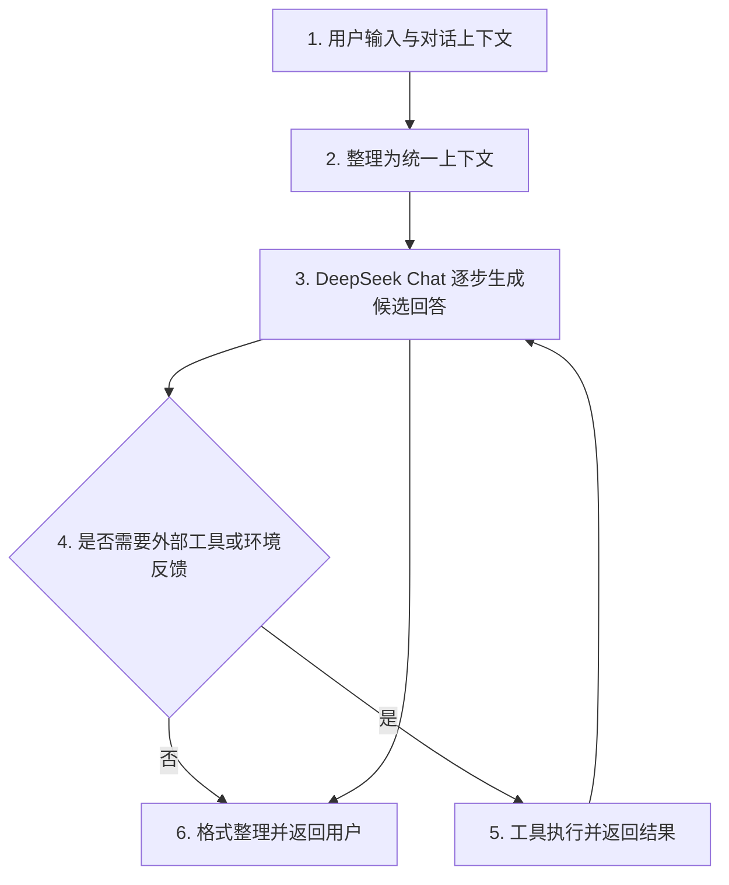
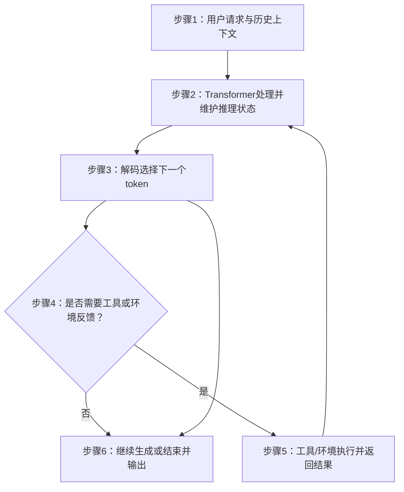
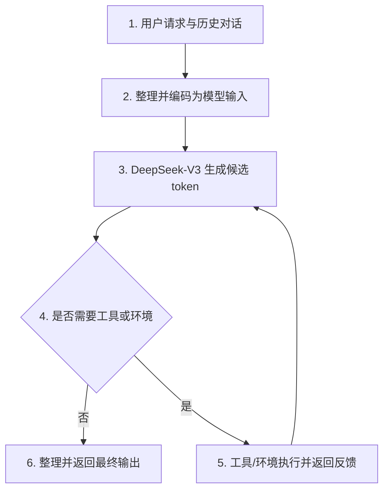
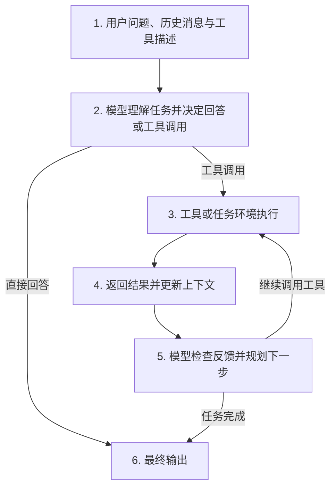
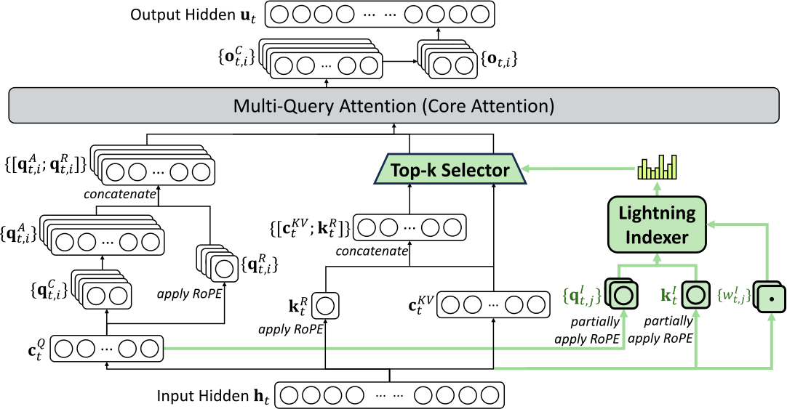
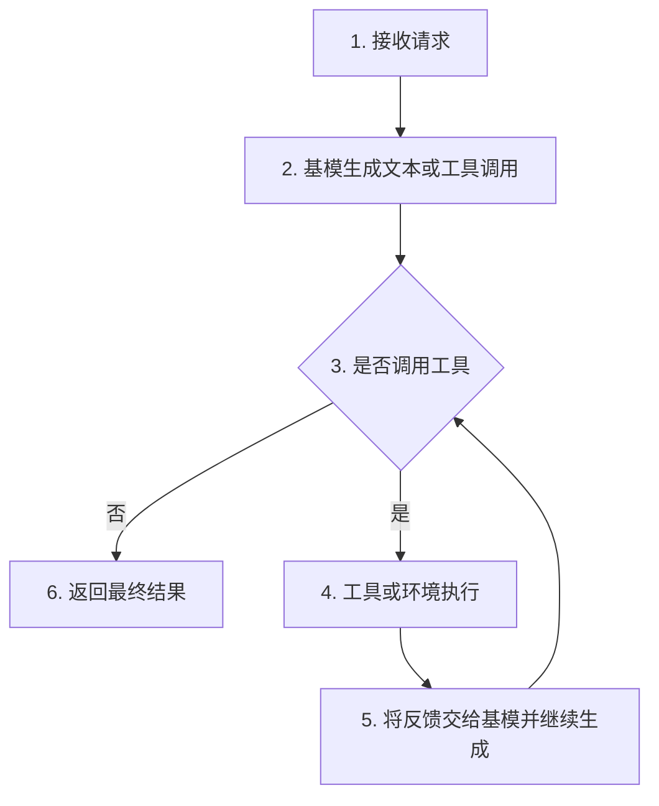
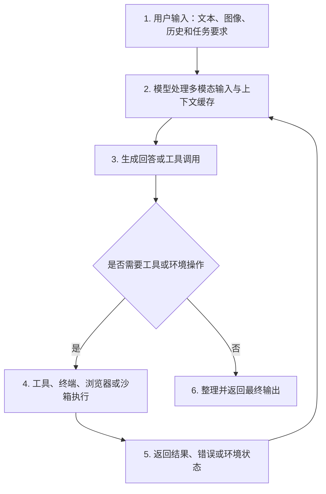
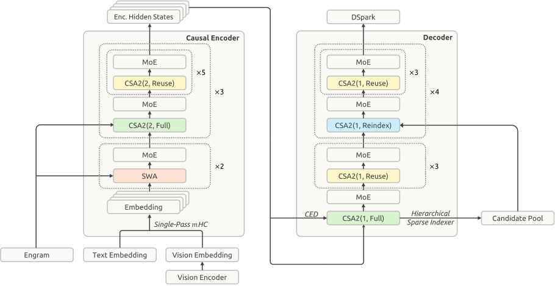

# DeepSeek 主模型系列演进：V1 到 V4.1：逐篇解析

> 当前页面逐篇介绍论文；分类关系请看快速理解版。 [快速理解版](../) · [BibTeX 与 DBLP 查询结果](../bibliography/index.html) · [返回综述目录](../../)

## 逐篇解析

本页按照主模型版本的首稿时间顺序逐篇介绍；每篇论文只出现一次。快速理解版中的任务、方法和架构标签作为本文条目的辅助信息，不会复制论文。

### DeepSeek LLM: Scaling Open-Source Language Models with Longtermism

- **版本：** 2024
- **研究角色：** 主体论文
- **作者：** DeepSeek-AI, :, Bi, Xiao, Chen, Deli, Chen, Guanting, Chen, Shanhuang, Dai, Damai, Deng, Chengqi, Ding, Honghui, Dong, Kai, Du, Qiushi, Fu, Zhe, Gao, Huazuo, Gao, Kaige, Gao, Wenjun, Ge, Ruiqi, Guan, Kang, Guo, Daya, Guo, Jianzhong, Hao, Guangbo, Hao, Zhewen, He, Ying, Hu, Wenjie, Huang, Panpan, Li, Erhang, Li, Guowei, Li, Jiashi, Li, Yao, Li, Y. K., Liang, Wenfeng, Lin, Fangyun, Liu, A. X., Liu, Bo, Liu, Wen, Liu, Xiaodong, Liu, Xin, Liu, Yiyuan, Lu, Haoyu, Lu, Shanghao, Luo, Fuli, Ma, Shirong, Nie, Xiaotao, Pei, Tian, Piao, Yishi, Qiu, Junjie, Qu, Hui, Ren, Tongzheng, Ren, Zehui, Ruan, Chong, Sha, Zhangli, Shao, Zhihong, Song, Junxiao, Su, Xuecheng, Sun, Jingxiang, Sun, Yaofeng, Tang, Minghui, Wang, Bingxuan, Wang, Peiyi, Wang, Shiyu, Wang, Yaohui, Wang, Yongji, Wu, Tong, Wu, Y., Xie, Xin, Xie, Zhenda, Xie, Ziwei, Xiong, Yiliang, Xu, Hanwei, Xu, R. X., Xu, Yanhong, Yang, Dejian, You, Yuxiang, Yu, Shuiping, Yu, Xingkai, Zhang, B., Zhang, Haowei, Zhang, Lecong, Zhang, Liyue, Zhang, Mingchuan, Zhang, Minghua, Zhang, Wentao, Zhang, Yichao, Zhao, Chenggang, Zhao, Yao, Zhou, Shangyan, Zhou, Shunfeng, Zhu, Qihao, Zou, Yuheng
- **任务标签：** General Language Modeling、Instruction Following

#### 这篇论文做了什么

该工作面向通用语言建模：输入词元化文本前缀，输出下一词元分布，并可连续生成文本。作者先研究适用于开源模型配置的规模定律，再据此训练 DeepSeek LLM 7B 与 67B，并以持续扩展的语料完成预训练；随后通过监督微调和直接偏好优化构建对话版本。它是 DeepSeek 通用主模型路线的起点，重点在于以规模规律指导模型与数据扩展。

#### 深度解析

**一句话主题：** 探索大语言模型 scaling law 并训练开源模型

**领域标签：** 大语言模型 / 扩展规律 / 开源模型

#### 快速理解

**背景与任务：** 既有研究对大语言模型扩展规律结论不一，制约了模型规模化发展。

**核心工作：** 作者系统研究扩展规律，构建2万亿Token预训练数据集，并训练DeepSeek LLM及其对齐聊天模型。

#### 中文摘要

开源大语言模型（LLM）的快速发展确实令人瞩目。然而，既有文献所描述的缩放定律（scaling law）得出了不尽相同的结论，这为扩展大语言模型蒙上了一层阴影。我们深入研究了缩放定律，并提出了独特的发现，助力在两种常用的开源配置——7B 和 67B——上扩展大规模模型。在缩放定律的指导下，我们推出了 DeepSeek LLM 项目，致力于以长期视角推进开源语言模型的发展。为支持预训练阶段，我们构建了一个目前包含 2 万亿个词元（tokens）且仍在持续扩展的数据集。随后，我们在 DeepSeek LLM Base 模型上开展有监督微调（SFT）和直接偏好优化（DPO），由此创建了 DeepSeek Chat 模型。评估结果表明，DeepSeek LLM 67B 在多个基准测试中超过了 LLaMA-2 70B，尤其是在代码、数学和推理领域。此外，开放式评测显示，DeepSeek LLM 67B Chat 的表现优于 GPT-3.5。

#### 详细分析

#### 1. 任务输入、输出、功能和边界（约100字）

DeepSeek LLM 的输入是大规模中英文文本，以及后续阶段的指令—回答和偏好样本；输出包括 7B、67B 两种规模的基础语言模型及其 Chat 版本。基础模型负责根据上下文预测下一个词，Chat 模型进一步面向问答、推理、代码和数学任务。论文边界是开源模型训练与评测，不涉及持续更新知识，也不保证事实绝对正确或覆盖所有语言。

#### 2. 研究动机：要解决的问题与核心 insight（约300字）

论文关注一个实际问题：当计算预算增加时，究竟应该扩大模型，还是增加训练文本？已有 scaling law 对模型规模与数据规模的最佳分配给出了不同结论，而且一些工作没有充分说明批大小、学习率等超参数是否已经调到合适状态，因此小实验得到的规律可能无法可靠外推到大型模型。

作者的核心 insight 有三点。第一，批大小和学习率本身也随计算预算变化，必须先研究它们，才能比较不同规模模型的真实潜力。第二，用“每个 token 的非词表计算量”表示模型规模，比只使用参数量更准确，因为它还计入注意力计算，却不把词表输出等相对不代表模型容量的计算混在一起。第三，数据质量会改变最优扩展方向：数据越高质量，新增计算资源越应该更多分配给模型，而不是简单增加数据量。论文因此把 scaling law 当作长期建设开源模型的决策工具，而不是只用于解释既有实验。

#### 3. 核心贡献（约300字）

论文主要提出、构建并验证了以下内容：

1. 对开源语言模型的扩展规律进行了系统研究，分别分析了计算预算与批大小、学习率之间的关系，并给出近似幂律形式。
2. 提出了使用非词嵌入 FLOPs/token 表示模型规模的方法，重新估计模型规模与数据规模的最佳分配关系。
3. 发现不同数据集会产生明显不同的扩展规律，并指出数据质量会影响计算资源应投向模型还是数据。
4. 从零构建了 DeepSeek LLM 7B 与 67B 基础模型，使用约 2 万亿中英文 token，并公开较完整的架构、数据处理和工程经验。
5. 在基础模型上构建 DeepSeek Chat，通过监督指令学习和直接偏好优化改善对话、数学、代码与指令遵循能力。
6. 通过英文、中文、数学、代码、推理、开放式对话和安全评测验证模型效果；论文报告 67B 模型在多项任务上超过 LLaMA-2 70B，Chat 版本在部分开放式评测中达到或超过 GPT-3.5 水平。

#### 4. 推理阶段整体流程与基模（约400字）

推理时，系统使用已经完成训练的 DeepSeek LLM 基础模型作为语言生成核心：基础模型根据上下文逐 token 生成文本，Chat 模型则在此基础上遵循对话格式、系统要求和用户意图。论文中的主要能力由模型直接完成；代码运行、计算器或外部检索并不是该论文推理流程的必需组成部分，因此下面将工具调用表示为可选环境反馈。

1. **接收输入**：用户问题、历史对话和可选系统要求 → 输入处理模块整理角色顺序、文本边界与生成任务 → 输出统一上下文，交给模型。
2. **理解当前任务**：统一上下文 → DeepSeek Chat 黑箱根据已有上下文确定下一段回答的方向与形式 → 输出当前生成所需的内部文本状态。
3. **逐步生成回答**：文本状态 → 语言模型预测并选择下一个 token，反复执行直到形成阶段性回答或遇到停止条件 → 输出候选回答。
4. **可选工具交互**：候选回答中若需要外部计算、代码执行或最新信息 → 工具接口把结构化请求交给相应环境，并将执行结果返回模型 → 输出带环境反馈的新上下文。
5. **修订与继续生成**：新上下文 → 模型结合工具结果检查、补充或改写回答 → 输出最终候选文本。
6. **返回用户**：最终候选文本 → 对话接口进行必要的格式整理并返回 → 用户得到答案、代码、解释或拒答。

#### 5. 核心方法：按论文 Method 小节总结（约600字）

论文正文没有单独命名为 “Method” 的章节；与方法直接对应的主体部分是第 2 节 Pre-Training、第 3 节 Scaling Laws 和第 4 节 Alignment。以下严格按论文中相关小节的原始编号和顺序说明。

##### 2.1 Data（数据）

目的在于构建规模大、重复少、领域覆盖更均衡的中英文预训练数据。作者采用“去重—过滤—重混合”三阶段：去重不仅在单个 Common Crawl dump 内进行，还跨多个 dump 检查重复内容，以减少反复出现的文档；过滤同时考虑语言质量和语义质量；重混合则提高代表性不足领域的比例。分词器采用 byte-level BPE，设置约 100015 个实际词表项目，并把训练词表空间扩展到 102400。该数据模块为后续模型提供连续文本，输出 token 序列供自回归语言建模使用。

##### 2.2 Architecture（架构）

模型总体沿用 LLaMA 风格的 decoder-only Transformer，使用 Pre-Norm、RMSNorm、SwiGLU 和 RoPE。7B 模型为 30 层、隐藏维度 4096；67B 模型为 95 层、隐藏维度 8192。67B 使用 GQA，以减少推理时键值缓存的存储和带宽开销；相较于常见的加宽 FFN，作者主要通过增加网络深度扩展参数规模。架构模块接收 token 序列并输出每个位置的词表概率，供下一 token 预测。

##### 2.3 Hyperparameters（超参数）

该小节说明基础模型的训练配置及其选择逻辑。模型使用 AdamW、bf16 计算并以 fp32 累积梯度，采用多阶段学习率调度：先 warmup，随后在训练后段分两次降低学习率。作者比较了多阶段调度与 cosine 调度，发现最终性能接近，但多阶段方案更方便从早期阶段继续扩展计算。7B 和 67B 的上下文长度分别为 4096，批大小与学习率依据第 3 节的扩展规律设定。该模块把数据规模、模型规模和计算预算转换成具体可执行的优化配置。

##### 2.4 Infrastructures（基础设施）

作者使用 HAI-LLM，集成数据并行、张量并行、序列并行和 1F1B 流水线并行，并采用 FlashAttention 提高注意力计算效率。ZeRO-1 用于切分优化器状态；通信与矩阵计算尽量重叠，以减少等待。训练中使用 fused operator、in-place cross-entropy 和异步 checkpoint，支持在不同三维并行配置间恢复。评测阶段使用 vLLM 和连续批处理，以减少 padding 与手工调 batch 的成本。该基础设施连接数据管线、模型计算、检查点管理和评测系统。

##### 3.1 Scaling Laws for Hyperparameters（超参数扩展规律）

目的在于让不同计算预算下的模型都接近自身可达到的最佳性能。作者先对批大小和学习率做网格搜索，再把“接近最优”的配置拟合为计算预算 \(C\) 的幂律函数：

\[
\eta_{\mathrm{opt}}=0.3118C^{-0.1250},\qquad
B_{\mathrm{opt}}=0.2920C^{0.3271}.
\]

因此，计算预算增加时，合适批大小总体增大，而合适学习率总体减小。作者也指出，同一计算预算但不同模型—数据分配会造成最优区域轻微变化，所以这些公式是经验指导而非普适定理。

##### 3.2 Estimating Optimal Model and Data Scaling（估计最优模型与数据扩展）

作者使用 IsoFLOP 思路：固定若干计算预算，在每个预算下比较不同模型规模与 token 数量的组合，再取验证集上最优点拟合扩展曲线。计算量不再粗略写成参数量乘 token 数，而使用非词嵌入 FLOPs/token \(M\)，使 \(C=MD\)。得到的最优关系为：

\[
M_{\mathrm{opt}}=0.1715C^{0.5243},\qquad
D_{\mathrm{opt}}=5.8316C^{0.4757}.
\]

模型指数与数据指数之和约为 1，表示在固定总计算预算下，二者需要协同扩展。作者还用小规模实验预测 7B 与 67B 的验证性能，并报告预测与最终结果较一致。

##### 3.3 Scaling Laws with Different Data（不同数据下的扩展规律）

作者在早期内部数据、当前内部数据和 OpenWebText2 上分别拟合扩展规律。结果显示，高质量数据对应更大的模型扩展指数、更小的数据扩展指数：增加预算时，应更多扩大模型。该结果说明 scaling law 不是完全脱离数据分布的固定常数；数据质量、重复程度、清洗强度和领域组成都会改变最佳资源分配。该小节为数据处理模块提供反馈，也提醒不能直接把一个数据集上的规律外推到另一个数据集。

##### 4 Alignment（对齐）

作者收集约 150 万条中英文指令数据，其中包含通用任务、数学、代码和安全内容。SFT 阶段让基础模型学习回答格式、指令遵循和领域任务；67B 使用更少轮次以减轻过拟合，7B 还尝试先使用全部数据、再使用对话数据的分阶段方案，以降低重复生成。随后构造 helpfulness 与 harmlessness 偏好对，使用 DPO 直接优化偏好差异。DPO 对开放式对话改善明显，但对标准知识和推理基准的变化较小。该阶段把基础模型转化为面向用户交互的 Chat 模型。

#### 6. 局限性和展望（约300字）

论文明确承认，DeepSeek Chat 仍有普通大语言模型的限制：预训练完成后知识不会自动更新，可能生成未经验证的建议或事实错误，也可能出现幻觉。早期中文数据覆盖不完整，因此部分中文专门主题表现不足；数据主要是中文和英文，其他语言能力较弱。论文还指出，数学和代码能力虽然提升明显，但当前能力可能偏向代码补全和代数题，未必代表全面的数学理解或完整软件工程能力。

从论文结果可以谨慎推断，扩展规律仍依赖数据分布、模型—数据分配和超参数配置，幂律拟合不能保证在完全不同的数据、架构或更大规模上同样成立；开放式评测也会受到提示格式、解码设置和评测器影响。安全评测主要基于有限测试集与人工检查，不能等同于现实世界中对所有攻击方式都安全。

未来方向包括继续扩大并改进数据集，增强中文知识、推理、数学和代码能力；发布代码智能与 Mixture-of-Experts 技术报告；研究更强的强化学习以提升复杂推理；同时继续改进有帮助、诚实且安全的对话行为，并加强动态知识更新、事实核验和跨语言评测。

> 原文图片尚未归档；该条目不能视为正式完成。

链接：[arXiv](https://arxiv.org/abs/2401.02954)

### DeepSeek-V2: A Strong, Economical, and Efficient Mixture-of-Experts Language Model

- **版本：** 2024
- **研究角色：** 主体论文
- **作者：** DeepSeek-AI, Liu, Aixin, Feng, Bei, Wang, Bin, Wang, Bingxuan, Liu, Bo, Zhao, Chenggang, Dengr, Chengqi, Ruan, Chong, Dai, Damai, Guo, Daya, Yang, Dejian, Chen, Deli, Ji, Dongjie, Li, Erhang, Lin, Fangyun, Luo, Fuli, Hao, Guangbo, Chen, Guanting, Li, Guowei, Zhang, H., Xu, Hanwei, Yang, Hao, Zhang, Haowei, Ding, Honghui, Xin, Huajian, Gao, Huazuo, Li, Hui, Qu, Hui, Cai, J. L., Liang, Jian, Guo, Jianzhong, Ni, Jiaqi, Li, Jiashi, Chen, Jin, Yuan, Jingyang, Qiu, Junjie, Song, Junxiao, Dong, Kai, Gao, Kaige, Guan, Kang, Wang, Lean, Zhang, Lecong, Xu, Lei, Xia, Leyi, Zhao, Liang, Zhang, Liyue, Li, Meng, Wang, Miaojun, Zhang, Mingchuan, Zhang, Minghua, Tang, Minghui, Li, Mingming, Tian, Ning, Huang, Panpan, Wang, Peiyi, Zhang, Peng, Zhu, Qihao, Chen, Qinyu, Du, Qiushi, Chen, R. J., Jin, R. L., Ge, Ruiqi, Pan, Ruizhe, Xu, Runxin, Chen, Ruyi, Li, S. S., Lu, Shanghao, Zhou, Shangyan, Chen, Shanhuang, Wu, Shaoqing, Ye, Shengfeng, Ma, Shirong, Wang, Shiyu, Zhou, Shuang, Yu, Shuiping, Zhou, Shunfeng, Zheng, Size, Wang, T., Pei, Tian, Yuan, Tian, Sun, Tianyu, Xiao, W. L., Zeng, Wangding, An, Wei, Liu, Wen, Liang, Wenfeng, Gao, Wenjun, Zhang, Wentao, Li, X. Q., Jin, Xiangyue, Wang, Xianzu, Bi, Xiao, Liu, Xiaodong, Wang, Xiaohan, Shen, Xiaojin, Chen, Xiaokang, Chen, Xiaosha, Nie, Xiaotao, Sun, Xiaowen, Wang, Xiaoxiang, Liu, Xin, Xie, Xin, Yu, Xingkai, Song, Xinnan, Zhou, Xinyi, Yang, Xinyu, Lu, Xuan, Su, Xuecheng, Wu, Y., Li, Y. K., Wei, Y. X., Zhu, Y. X., Xu, Yanhong, Huang, Yanping, Li, Yao, Zhao, Yao, Sun, Yaofeng, Li, Yaohui, Wang, Yaohui, Zheng, Yi, Zhang, Yichao, Xiong, Yiliang, Zhao, Yilong, He, Ying, Tang, Ying, Piao, Yishi, Dong, Yixin, Tan, Yixuan, Liu, Yiyuan, Wang, Yongji, Guo, Yongqiang, Zhu, Yuchen, Wang, Yuduan, Zou, Yuheng, Zha, Yukun, Ma, Yunxian, Yan, Yuting, You, Yuxiang, Liu, Yuxuan, Ren, Z. Z., Ren, Zehui, Sha, Zhangli, Fu, Zhe, Huang, Zhen, Zhang, Zhen, Xie, Zhenda, Hao, Zhewen, Shao, Zhihong, Wen, Zhiniu, Xu, Zhipeng, Zhang, Zhongyu, Li, Zhuoshu, Wang, Zihan, Gu, Zihui, Li, Zilin, Xie, Ziwei
- **任务标签：** General Language Modeling、Long-Context Modeling、Efficient Autoregressive Generation
- **方法标签：** Sparse Expert Computation、Attention Efficiency

#### 这篇论文做了什么

DeepSeek-V2 接收文本前缀并自回归预测后续词元，同时兼顾长上下文生成的训练与推理成本。其核心是混合专家范式：DeepSeekMoE 让每个词元仅激活少量参数，Multi-head Latent Attention 则把注意力键值缓存压缩为潜在表示；模型经多源语料预训练，再进行监督微调和强化学习。相较稠密的 DeepSeek 67B，它转向稀疏扩容，并把经济训练与高效推理纳入主模型设计。

#### 深度解析

**一句话主题：** 面向大语言模型的混合专家架构设计与高效训练推理

**领域标签：** 大语言模型 / 混合专家模型 / 高效推理

#### 快速理解

**背景与任务：** 大规模语言模型面临训练成本高、推理效率低和上下文缓存开销大的问题。

**核心工作：** 提出结合多头潜在注意力和DeepSeekMoE的DeepSeek-V2，并通过大规模预训练、监督微调与强化学习实现高性能和显著效率提升。

#### 中文摘要

我们提出了 DeepSeek-V2，一种强大的混合专家（Mixture-of-Experts，MoE）语言模型，其特点是训练成本低且推理效率高。该模型总参数量为2360亿，每个词元激活210亿参数，并支持长度达128K词元的上下文。DeepSeek-V2采用了包括多头潜在注意力（Multi-head Latent Attention，MLA）和DeepSeekMoE在内的创新架构。MLA通过将键值（Key-Value，KV）缓存大幅压缩为一个潜在向量，确保了高效推理；DeepSeekMoE则通过稀疏计算，以较低成本实现强大模型的训练。与 DeepSeek 67B 相比，DeepSeek-V2取得了显著更强的性能，同时节省42.5%的训练成本，将KV缓存减少93.3%，并将最大生成吞吐量提升至5.76倍。我们在由8.1万亿词元组成的高质量、多来源语料库上对 DeepSeek-V2 进行预训练，并进一步开展监督微调（Supervised Fine-Tuning，SFT）和强化学习（Reinforcement Learning，RL），以充分释放其潜力。评估结果表明，即使仅激活210亿参数，DeepSeek-V2及其聊天版本在开源模型中仍达到了顶尖水平。

#### 详细分析

#### 1. 任务输入、输出、功能和边界（约100字）

DeepSeek-V2 接收一段文本上下文，例如问题、对话或代码，并逐步输出后续文本。它是一个采用稀疏 Mixture-of-Experts（MoE，混合专家）的自回归 Transformer 语言模型：每个 token 只激活部分专家，但模型总参数规模很大。系统主要覆盖中文和英文文本任务，支持最长 128K tokens 的上下文；论文没有将其设计为多模态模型，也不保证事实始终正确。

#### 2. 研究动机：要解决的问题与核心 insight（约300字）

大语言模型通常具有参数越多、能力越强的趋势，但密集模型在两个方面代价很高。第一，训练时每个 token 都经过全部参数，计算量随模型规模线性增加；第二，生成时需要保存历史 token 的 Key 和 Value，即 KV cache。上下文越长、并发请求越多，KV cache 占用的显存越大，限制了批量大小和生成吞吐。

论文的核心思路是把“模型容量”和“每个 token 的计算量”分开处理。对于前馈网络，使用 DeepSeekMoE：保留少量共享专家，同时把普通专家切分得更细，由路由器为每个 token 选择少数专家。这样，总参数可以很大，但单个 token 只执行部分专家。对于注意力，使用 Multi-head Latent Attention（MLA）：不直接缓存每个历史 token 的完整多头 Key/Value，而是把它们压缩成低维潜向量，并在需要时通过线性变换恢复等价的注意力表示。由于位置编码会破坏这种压缩后的计算重排，MLA 将承载位置信息的 RoPE 分支与压缩内容分支解耦。两者结合，使模型同时获得较大的参数容量、较低的激活计算量和较小的推理缓存。

#### 3. 核心贡献（约300字）

论文主要提出并验证了以下几点：

1. 构建了 DeepSeek-V2，一个总参数约 236B、每个 token 激活约 21B 参数、支持 128K 上下文的稀疏 MoE 语言模型。
2. 提出了 MLA。它通过低秩的 Key-Value 联合压缩显著减少生成阶段的 KV cache，并通过解耦的 RoPE 分支保留位置信息；论文实验显示，其性能可超过所比较的 MHA，同时缓存规模显著更小。
3. 采用 DeepSeekMoE，将专家细粒度切分，并设置共享专家以减少不同路由专家之间的知识重复，从而在相同激活规模下提升模型效果。
4. 针对专家并行带来的跨设备通信和负载不均衡问题，构建了设备受限路由、三类负载平衡辅助机制以及 token 丢弃策略。
5. 在 8.1T tokens 上构建并训练双语基础模型，随后发布经过指令调整和偏好优化的聊天版本，并在中英文、数学、代码和开放式对话评测中进行验证。
6. 与 DeepSeek 67B 对比，论文报告训练成本降低 42.5%、KV cache 减少 93.3%，最大生成吞吐提升至 5.76 倍；这些结果属于论文给出的特定部署和评测条件下的测量。

#### 4. 推理阶段整体流程与基模（约400字）

推理时使用已经训练好的 DeepSeek-V2 基础模型或其 Chat 版本。基础模型负责根据上下文预测下一个 token；Chat 版本更适合遵循指令和进行多轮对话。论文描述的模型本身是文本生成系统，不要求外部工具；若应用层额外接入搜索、代码执行器或其他环境，则这些工具的结果可以作为新的文本输入反馈给模型。

1. **接收请求**：用户问题、历史对话和可选的外部环境状态 → 输入组织模块拼接成当前上下文 → 输出模型可读取的 token 序列。  
2. **编码当前输入**：上下文 token → DeepSeek-V2 的 Transformer 黑箱处理，并将历史信息压缩保存为推理所需状态 → 输出当前 token 的概率分布和可复用的缓存状态。  
3. **选择下一个 token**：概率分布 → 解码模块按照应用设定选择一个 token → 输出新 token，并把它追加到上下文。  
4. **判断是否需要工具或环境反馈**：当前文本与应用规则 → 工具调度模块判断是否调用搜索、计算、代码执行等外部能力 → 输出工具请求，或直接把生成结果交给用户。  
5. **处理工具结果（可选）**：工具请求 → 外部工具或环境执行并返回观察结果 → 输出结果文本，重新交给模型作为新增上下文。  
6. **循环生成并结束**：更新后的上下文和缓存 → 模型继续生成，直到产生结束信号、达到长度限制或应用停止生成 → 输出最终文本。

#### 5. 核心方法：按论文 Method 小节总结（约600字）

论文正文的架构方法位于第 2 节，随后第 3 节介绍预训练设置，第 4 节介绍对齐方法。以下按论文原始小节顺序说明。

##### 2.1 Multi-Head Latent Attention: Boosting Inference Efficiency（多头潜在注意力：提升推理效率）

目的在于降低生成阶段 KV cache 的显存占用，同时避免 MQA、GQA 因共享 Key/Value 而造成的能力损失。标准 MHA 为每层每个历史 token 缓存所有头的 Key 和 Value，缓存量约为 \(2n_hd_hl\)。

MLA 首先将隐藏状态 \(\mathbf h_t\) 映射为低维的 KV 潜向量：

\[
\mathbf c_t^{KV}=W^{DKV}\mathbf h_t.
\]

随后通过上投影得到内容 Key 和 Value：

\[
\mathbf k_t^C=W^{UK}\mathbf c_t^{KV},\qquad
\mathbf v_t^C=W^{UV}\mathbf c_t^{KV}.
\]

推理时只需缓存 \(\mathbf c_t^{KV}\)，而不是完整的 Key 和 Value，因此缓存量由每头维度总和降为压缩维度。由于矩阵乘法满足结合律，\(W^{UK}\) 可以与查询投影重新组合，\(W^{UV}\) 可以与输出投影重新组合，从而不必在每次生成时显式恢复所有历史 Key 和 Value。

查询也采用低秩压缩：

\[
\mathbf c_t^Q=W^{DQ}\mathbf h_t,\qquad
\mathbf q_t^C=W^{UQ}\mathbf c_t^Q.
\]

这主要用于降低训练时激活存储，而不是减少 KV cache。

##### 2.1.3 Decoupled Rotary Position Embedding（解耦旋转位置编码）

RoPE 同时作用于查询和 Key。若直接对压缩后再上投影的 Key 使用 RoPE，位置相关矩阵会夹在投影矩阵之间，使 \(W^{UK}\) 无法吸收到查询侧；推理时就可能需要重新计算历史 Key，抵消压缩优势。

因此，MLA 将注意力表示拆为内容部分和位置部分。内容部分使用压缩潜向量产生，位置部分额外生成多头查询 \(\mathbf q_{t,i}^R\) 与共享 Key \(\mathbf k_t^R\)，并只在这一小维度分支上应用 RoPE：

\[
\mathbf q_{t,i}=[\mathbf q_{t,i}^C;\mathbf q_{t,i}^R],\qquad
\mathbf k_{t,i}=[\mathbf k_{t,i}^C;\mathbf k_t^R].
\]

因此，缓存内容是 \(\mathbf c_t^{KV}\)，还需缓存共享的旋转 Key \(\mathbf k_t^R\)，总缓存约为 \((d_c+d_h^R)l\)。

##### 2.2 DeepSeekMoE: Training Strong Models at Economical Costs（DeepSeekMoE：以经济成本训练强模型）

DeepSeekMoE 的目的，是在保持较大总参数量的同时减少每个 token 的实际计算。每个 MoE 层包含 \(N_s\) 个共享专家和 \(N_r\) 个路由专家。共享专家对所有 token 执行；路由专家则由路由器根据 token 表示与专家中心的相似度打分，并选取得分最高的 \(K_r\) 个：

\[
g_{i,t}=
\begin{cases}
s_{i,t},&i\in\operatorname{Topk}(s_{1,t},\ldots,s_{N_r,t}),\\
0,&\text{otherwise}.
\end{cases}
\]

输出可写为：

\[
\mathbf h'_t=\mathbf u_t+
\sum_i\operatorname{FFN}^{(s)}_i(\mathbf u_t)+
\sum_i g_{i,t}\operatorname{FFN}^{(r)}_i(\mathbf u_t).
\]

细粒度专家使不同专家更容易形成专门化；共享专家则负责跨 token 共有的知识，减轻路由专家重复学习相同内容。该模块接收注意力输出，产生新的 token 表示，再传递给后续 Transformer 层。

##### 2.2.2 Device-Limited Routing（设备受限路由）

专家并行时，不同专家位于不同设备。若一个 token 选中的专家分散在许多设备上，就需要更多跨设备通信。论文先按设备聚合专家得分，选出至多 \(M\) 个目标设备，再只在这些设备上的专家中做 top-\(K\) 选择。这样限制了单个 token 的通信范围，同时尽量保持普通 top-\(K\) 路由的效果。

##### 2.2.3 Auxiliary Loss for Load Balance（负载均衡辅助损失）

路由可能集中到少数专家，导致专家未被充分训练或设备计算不均衡。论文使用三类辅助损失：专家级平衡损失约束 token 在各专家间分布；设备级平衡损失约束计算量在设备间分布；通信均衡损失约束各设备接收的 token 数量。它们作为训练目标的附加项，只影响路由学习，不改变推理时的基本专家计算形式。

##### 2.2.4 Token-Dropping Strategy（token 丢弃策略）

即使有平衡机制，也不能保证严格均匀的负载。论文在训练时给每台设备设定计算容量，并优先丢弃该设备上路由得分较低的 token，以减少等待和无效计算；同时保证约 10% 的训练序列不丢 token，使训练行为与可选择的不丢弃推理模式保持一定一致性。

##### 3.1 Experimental Setups（实验设置）

论文在模型规模、数据、训练配置、并行系统和长上下文扩展方面给出完整设置。DeepSeek-V2 使用 60 层、隐藏维度 5120、128 个注意力头；MLA 的 \(d_c=512\)、查询压缩维度为 1536、解耦 RoPE 每头维度为 64。除首层外的 FFN 使用 MoE，每层有 2 个共享专家和 160 个路由专家，每个 token 激活 6 个路由专家。模型在 8.1T tokens 上进行，随后使用 YaRN 将上下文从 4K 扩展到 128K，并用 NIAH 测试长上下文检索能力。

##### 4.1 Supervised Fine-Tuning（监督微调）

Chat 版本使用约 1.5M 条指令样本，其中包括有用性和安全性内容。该阶段使基础模型更能理解用户指令、生成符合格式的回答，并改善数学、代码、写作和安全相关表现。

##### 4.2 Reinforcement Learning（强化学习）

论文采用 GRPO，使用同一问题生成的一组回答的相对奖励估计优势，因此不需要额外的同规模 critic 模型。其目标仍包括类似 PPO 的概率比率裁剪和与参考策略的 KL 约束。训练分为推理能力调整和人类偏好调整：前者使用数学、代码反馈；后者综合有用性、安全性和规则奖励。论文还实现了训练与生成采用不同并行策略的混合引擎、基于 vLLM 的批量生成以及 CPU/GPU 模型调度，以降低大模型强化学习的系统开销。

#### 6. 局限性和展望（约300字）

论文明确指出，DeepSeek-V2 与其他大语言模型一样，可能生成未经验证的建议、事实错误和幻觉；其预训练语料主要是中文和英文，因此在其他语言上的能力可能有限。知识也不会随着现实世界自动更新。论文还观察到偏好强化学习可能带来“alignment tax”：开放式对话质量提升，但部分标准基准成绩下降；此外，模型在某些受地域文化影响的价值判断题上表现不稳定，说明这类评测答案本身可能具有争议。

从论文方法可以谨慎推断，MoE 的实际收益依赖专家路由、跨设备通信和负载均衡是否高效；总参数很大也不等于每个任务都会受益，因为单 token 只访问部分专家。MLA 虽显著降低缓存，但增加了压缩、解压等结构设计和实现复杂度，实际吞吐仍取决于硬件、量化和服务负载。论文未来方向包括继续扩大 MoE，同时控制训练和推理成本；改进有用、诚实、安全之间的平衡；支持更多语言与多模态输入，并探索在减少人工监督的情况下实现更可靠的价值对齐。

> 原文图片尚未归档；该条目不能视为正式完成。

链接：[arXiv](https://arxiv.org/abs/2405.04434)

### DeepSeek-V3 Technical Report

- **版本：** 2024
- **研究角色：** 主体论文
- **作者：** DeepSeek-AI, Liu, Aixin, Feng, Bei, Xue, Bing, Wang, Bingxuan, Wu, Bochao, Lu, Chengda, Zhao, Chenggang, Deng, Chengqi, Zhang, Chenyu, Ruan, Chong, Dai, Damai, Guo, Daya, Yang, Dejian, Chen, Deli, Ji, Dongjie, Li, Erhang, Lin, Fangyun, Dai, Fucong, Luo, Fuli, Hao, Guangbo, Chen, Guanting, Li, Guowei, Zhang, H., Bao, Han, Xu, Hanwei, Wang, Haocheng, Zhang, Haowei, Ding, Honghui, Xin, Huajian, Gao, Huazuo, Li, Hui, Qu, Hui, Cai, J. L., Liang, Jian, Guo, Jianzhong, Ni, Jiaqi, Li, Jiashi, Wang, Jiawei, Chen, Jin, Chen, Jingchang, Yuan, Jingyang, Qiu, Junjie, Li, Junlong, Song, Junxiao, Dong, Kai, Hu, Kai, Gao, Kaige, Guan, Kang, Huang, Kexin, Yu, Kuai, Wang, Lean, Zhang, Lecong, Xu, Lei, Xia, Leyi, Zhao, Liang, Wang, Litong, Zhang, Liyue, Li, Meng, Wang, Miaojun, Zhang, Mingchuan, Zhang, Minghua, Tang, Minghui, Li, Mingming, Tian, Ning, Huang, Panpan, Wang, Peiyi, Zhang, Peng, Wang, Qiancheng, Zhu, Qihao, Chen, Qinyu, Du, Qiushi, Chen, R. J., Jin, R. L., Ge, Ruiqi, Zhang, Ruisong, Pan, Ruizhe, Wang, Runji, Xu, Runxin, Zhang, Ruoyu, Chen, Ruyi, Li, S. S., Lu, Shanghao, Zhou, Shangyan, Chen, Shanhuang, Wu, Shaoqing, Ye, Shengfeng, Ye, Shengfeng, Ma, Shirong, Wang, Shiyu, Zhou, Shuang, Yu, Shuiping, Zhou, Shunfeng, Pan, Shuting, Wang, T., Yun, Tao, Pei, Tian, Sun, Tianyu, Xiao, W. L., Zeng, Wangding, Zhao, Wanjia, An, Wei, Liu, Wen, Liang, Wenfeng, Gao, Wenjun, Yu, Wenqin, Zhang, Wentao, Li, X. Q., Jin, Xiangyue, Wang, Xianzu, Bi, Xiao, Liu, Xiaodong, Wang, Xiaohan, Shen, Xiaojin, Chen, Xiaokang, Zhang, Xiaokang, Chen, Xiaosha, Nie, Xiaotao, Sun, Xiaowen, Wang, Xiaoxiang, Cheng, Xin, Liu, Xin, Xie, Xin, Liu, Xingchao, Yu, Xingkai, Song, Xinnan, Shan, Xinxia, Zhou, Xinyi, Yang, Xinyu, Li, Xinyuan, Su, Xuecheng, Lin, Xuheng, Li, Y. K., Wang, Y. Q., Wei, Y. X., Zhu, Y. X., Zhang, Yang, Xu, Yanhong, Xu, Yanhong, Huang, Yanping, Li, Yao, Zhao, Yao, Sun, Yaofeng, Li, Yaohui, Wang, Yaohui, Yu, Yi, Zheng, Yi, Zhang, Yichao, Shi, Yifan, Xiong, Yiliang, He, Ying, Tang, Ying, Piao, Yishi, Wang, Yisong, Tan, Yixuan, Ma, Yiyang, Liu, Yiyuan, Guo, Yongqiang, Wu, Yu, Ou, Yuan, Zhu, Yuchen, Wang, Yuduan, Gong, Yue, Zou, Yuheng, He, Yujia, Zha, Yukun, Xiong, Yunfan, Ma, Yunxian, Yan, Yuting, Luo, Yuxiang, You, Yuxiang, Liu, Yuxuan, Zhou, Yuyang, Wu, Z. F., Ren, Z. Z., Ren, Zehui, Sha, Zhangli, Fu, Zhe, Xu, Zhean, Huang, Zhen, Zhang, Zhen, Xie, Zhenda, Zhang, Zhengyan, Hao, Zhewen, Gou, Zhibin, Ma, Zhicheng, Yan, Zhigang, Shao, Zhihong, Xu, Zhipeng, Wu, Zhiyu, Zhang, Zhongyu, Li, Zhuoshu, Gu, Zihui, Zhu, Zijia, Liu, Zijun, Li, Zilin, Xie, Ziwei, Song, Ziyang, Gao, Ziyi, Pan, Zizheng
- **任务标签：** General Language Modeling、Instruction Following、Efficient Autoregressive Generation
- **方法标签：** Sparse Expert Computation、Multi-Token Prediction、Attention Efficiency

#### 这篇论文做了什么

DeepSeek-V3 面向通用文本续写：给定因果前缀，输出多个预测深度上的未来词元分布，并在部署时自回归生成文本。它延续 DeepSeekMoE 与 Multi-head Latent Attention，以稀疏专家控制激活计算和键值缓存，又引入无辅助损失的负载均衡策略及多词元预测目标，之后结合监督微调和强化学习。相较 V2，该模型保留高效主干，同时强化专家路由稳定性与训练信号密度。

#### 深度解析

**一句话主题：** 大规模混合专家语言模型的高效训练与性能优化

**领域标签：** 人工智能 / 大语言模型 / 混合专家模型

#### 快速理解

**背景与任务：** 大规模语言模型面临推理成本高、训练效率低和专家负载不均衡等挑战。

**核心工作：** 作者提出671B参数的DeepSeek-V3，采用无辅助损失负载均衡和多令牌预测目标，并通过高效训练实现了领先性能与稳定性。

#### 中文摘要

我们推出了 DeepSeek-V3，这是一款强大的混合专家（Mixture-of-Experts，MoE）语言模型，总参数量为 6710 亿，每个词元激活 370 亿个参数。为实现高效推理和经济高效的训练，DeepSeek-V3 采用了在 DeepSeek-V2 中经过充分验证的多头潜在注意力（Multi-head Latent Attention，MLA）和 DeepSeekMoE 架构。此外，DeepSeek-V3 首创了无需辅助损失的负载均衡策略，并设定了多词元预测训练目标，以获得更强的性能。我们使用 14.8 万亿个多样且高质量的词元对 DeepSeek-V3 进行预训练，随后进行监督微调（Supervised Fine-Tuning）和强化学习（Reinforcement Learning）阶段，以充分发挥其能力。全面评估表明，DeepSeek-V3 的性能优于其他开源模型，并达到了与领先闭源模型相当的水平。尽管性能卓越，DeepSeek-V3 的完整训练仅需 278.8 万个 H800 GPU 小时。此外，其训练过程极其稳定。在整个训练过程中，我们没有遇到任何无法恢复的损失峰值，也没有执行任何回滚。模型检查点可在 https://github.com/deepseek-ai/DeepSeek-V3 获取。

#### 详细分析

#### 1. 任务输入、输出、功能和边界（约100字）

DeepSeek-V3 是一个自回归语言模型：输入是用户提供的文本、代码或多轮对话上下文，输出是逐 token 生成的自然语言或程序代码。它可用于问答、翻译、写作、数学推理、代码生成和长文本理解。论文主要研究模型架构、训练效率与推理部署，不等同于具备实时检索、事实核验或自主执行能力的完整智能体。

#### 2. 研究动机：要解决的问题与核心 insight（约300字）

大语言模型通常面临三个相互牵制的问题。第一，模型规模越大，参数存储、训练计算和推理显存越昂贵；第二，MoE 虽然能让每个 token 只激活少量专家，但专家负载不均会造成路由拥塞、设备空闲，传统辅助负载损失又可能损害语言建模性能；第三，超大规模分布式训练受到跨节点通信、低精度数值误差和流水线空洞的限制。

DeepSeek-V3 的核心思路是把稀疏架构、注意力缓存压缩、负载均衡、低精度计算和并行系统协同设计。它用 MLA 将历史键值压缩为较小的潜变量，从而降低推理时 KV cache；用 DeepSeekMoE 将 FFN 拆成共享专家与大量细粒度路由专家，使总参数很大而每个 token 只计算少数专家；用不直接加入全局辅助负载损失的动态 bias 调节专家选择；用多 token 预测提供更密集的训练信号，并可辅助推测解码。系统层面再用 FP8、通信计算重叠和 DualPipe，降低训练成本。

#### 3. 核心贡献（约300字）

论文提出或系统验证了以下贡献：

1. 构建 DeepSeek-V3：总参数 671B，每个 token 激活约 37B 参数，并继承 MLA 与 DeepSeekMoE，兼顾模型容量和单 token 计算成本。
2. 提出辅助损失自由的负载均衡策略：为每个路由专家维护动态 bias，只用它影响 Top-\(K\) 选择，而不改变实际门控权重，减少负载约束对模型性能的干扰。
3. 引入多 token 预测目标：除下一个 token 外，继续预测后续 token；该模块在推理时可以移除，也可用于 speculative decoding。
4. 构建可扩展的 FP8 混合精度训练框架，结合细粒度量化和更高精度累加，在超大模型上验证低精度训练的可行性。
5. 设计 DualPipe 及跨节点 all-to-all 通信优化，使通信尽可能被计算隐藏，并在不使用张量并行的条件下完成训练。
6. 通过 14.8T token 的预训练、长上下文扩展以及 SFT/RL 后处理，得到 Base 和 Chat 模型；论文报告完整流程约消耗 2.788M H800 GPU 小时，并称训练过程中没有不可恢复的 loss spike 或回滚。

#### 4. 推理阶段整体流程与基模（约400字）

推理时使用已经训练好的 DeepSeek-V3 Chat 基模。它负责理解上下文、计算注意力与专家路由，并逐步生成回答；MTP 模块通常可以被丢弃，也可以作为草稿预测器帮助加速解码。若系统接入外部工具，工具和环境反馈属于模型之外的输入，不是模型本身必然具备的能力。

1. **接收请求**：用户问题、历史对话和可选的系统指令 → 对话接口整理角色、上下文与输出要求 → 形成模型输入序列。
2. **编码上下文**：输入序列 → tokenizer 将文本转换为 token，推理引擎建立当前上下文状态 → 得到可供模型处理的 token 序列及缓存状态。
3. **生成候选 token**：当前 token 序列和缓存状态 → DeepSeek-V3 计算上下文关系、选择少量专家并输出下一个 token 的概率 → 产生下一个 token；若使用推测解码，还会先产生多个候选 token。
4. **检查是否调用工具**：已生成的部分回答 → 外层编排器判断是否需要计算器、代码执行器、检索或其他环境 → 若需要，生成结构化工具调用；否则转入第 6 步。
5. **接收环境反馈并继续生成**：工具调用 → 工具或外部环境执行并返回结果、错误或观测 → 将反馈追加到上下文，再交给模型继续生成；必要时重复第 3 至第 5 步。
6. **整理最终输出**：完整生成结果及工具反馈 → 对话接口停止生成、移除内部控制标记并按格式返回 → 输出文本、代码、解释或工具执行结果。

#### 5. 核心方法：按论文 Method 小节总结（约600字）

##### 2.1 Basic Architecture（基本架构）

DeepSeek-V3 仍采用 Transformer 主体，但将注意力和 FFN 分别替换为 MLA 与 DeepSeekMoE。模型有 61 个 Transformer 层、隐藏维度 7168 和 128 个注意力头；除最初三层外，其他 FFN 层使用 MoE。该结构把“每 token 的计算量”和“模型总容量”分开，供后续并行训练与推理部署使用。

###### 2.1.1 Multi-Head Latent Attention（多头潜在注意力）

MLA 的目标是减少自回归生成所需的 KV cache。输入隐藏状态先经下投影得到较小的键值潜变量 \(\mathbf c_t^{KV}\)，再由上投影恢复各头的内容键和值；因此历史位置主要缓存潜变量，而不是完整的多头键和值。为保留位置信息，模型额外生成带 RoPE 的解耦键，并将其与内容键拼接。

查询侧也进行低秩压缩，以降低训练时激活存储。最终每个头仍执行标准的因果注意力，但缓存对象更小。MLA 输出再经过统一的输出投影，连接到后续残差流。

###### 2.1.2 DeepSeekMoE with Auxiliary-Loss-Free Load Balancing（带辅助损失自由负载均衡的 DeepSeekMoE）

DeepSeekMoE 将 FFN 分为共享专家和路由专家。共享专家对每个 token 都执行，负责通用变换；路由专家由门控网络计算亲和度，每个 token 选择 \(K_r\) 个专家，并对选中分数归一化后加权求和。DeepSeek-V3 使用 1 个共享专家、256 个路由专家，每个 token 激活 8 个路由专家。

为避免传统辅助负载损失影响主任务，模型为每个专家维护 bias。bias 只参与 Top-\(K\) 路由排序，不参与最终门控权重；每个批次结束后，过载专家降低 bias，欠载专家提高 bias。另有极小的序列级平衡损失，用于防止单条序列出现极端失衡。路由还限制每个 token 最多发送到 4 个节点，从而控制跨节点通信，并且训练和推理都不丢弃 token。

##### 2.2 Multi-Token Prediction（多 token 预测）

MTP 的目的不是改变推理时的主模型结构，而是让每个位置学习多个未来 token。论文设置深度 \(D=1\)：主模型预测下一个 token，额外模块再预测更后面的 token。每个 MTP 模块使用共享 embedding 和输出头，并通过 Transformer 模块保持预测链：后一深度接收前一深度表示以及相应未来 token 的 embedding。各深度计算交叉熵，平均后乘以权重加入整体目标。

训练完成后，MTP 模块可以直接移除，主模型独立运行；也可把它作为 speculative decoding 的草稿生成器。论文的小规模消融显示，在相同推理参数量下，MTP 通常改善代码、数学和知识任务表现。

##### 3.1 Compute Clusters（计算集群）

训练使用 2048 张 H800 GPU。节点内通过 NVLink/NVSwitch 连接，节点间使用 InfiniBand。该硬件拓扑决定了后续专家并行、all-to-all 通信和部署策略。

##### 3.2 Training Framework（训练框架）

HAI-LLM 采用 16 路流水线并行、跨 8 个节点的 64 路专家并行以及 ZeRO-1 数据并行。论文设计 DualPipe，将注意力、all-to-all dispatch、MLP、all-to-all combine 和反向传播子阶段重新安排，使计算与通信重叠，并通过双向流水线减少 pipeline bubble。跨节点通信内核先利用 IB 传输，再利用节点内 NVLink 转发，尽量同时占满两种带宽。模型还通过重计算 RMSNorm 与 MLA 上投影、CPU 保存 EMA 等方法降低显存需求。

##### 3.3 FP8 Training（FP8 训练）

FP8 主要用于高计算密度的 GEMM，embedding、输出头、门控、归一化和注意力等敏感模块保留 BF16 或 FP32。激活按每 token 每 128 个通道分组量化，权重按 \(128\times128\) 分块量化；所有 FP8 张量采用 E4M3。为弥补 H800 Tensor Core 的累加精度限制，部分结果每 128 个元素提升到 CUDA Core，以 FP32 继续累加。激活、通信数据和优化器状态也采用较低精度存储，但主权重和梯度保留更高精度。

##### 3.4 Inference and Deployment（推理与部署）

推理区分 prefilling 和 decoding。Prefilling 使用较小规模的张量并行、数据并行和专家并行，并通过复制高负载专家来均衡 GPU 工作量；decoding 使用更大规模的专家并行，每张 GPU 主要承载一个专家，并通过冗余专家处理负载偏斜。两阶段都尽量重叠注意力、专家计算与通信，以满足吞吐和延迟要求。

##### 3.5 Suggestions on Hardware Design（硬件设计建议）

论文根据实现经验建议未来硬件提供独立的通信协处理器，统一 IB 与 NVLink 的寻址和 multicast/reduce 原语；同时增强 Tensor Core 的 FP8 累加精度，原生支持 tile/block 量化、在线量化和转置 GEMM，以减少 CUDA Core 介入及显存往返。

#### 6. 局限性和展望（约300字）

论文明确指出，DeepSeek-V3 的推荐部署单元较大，小团队可能难以承担；尽管端到端生成速度相较 DeepSeek-V2 有明显提升，推理仍有进一步优化空间。其专家并行和跨节点通信也使部署对网络拓扑、显存容量与调度系统较敏感。

可以谨慎推断的限制包括：第一，论文主要报告内部评测框架下的基准结果，自动评测和 LLM-as-judge 不能完全替代真实用户场景中的可靠性、事实性与安全性检验；第二，模型在 SimpleQA 英文事实性上落后于 GPT-4o 和 Claude 3.5，说明强推理、代码和中文能力不等于所有知识任务都占优；第三，工具调用、实时检索、长期记忆和环境操作不是基础模型天然保证的能力，需要外部系统支持；第四，MoE 总参数很大，虽然单 token 激活参数较少，但完整权重存储和服务调度仍然昂贵。

未来方向包括进一步降低推理和训练通信成本、改进长上下文与模型架构、扩大更高质量和更多来源的训练信号、增强可控的深度推理，并建立覆盖事实性、鲁棒性、安全性和真实任务成本的多维评测体系。

*原文图 2：论文方法流程图（图 2）；原始图注与完整说明见图片来源。 [查看图片来源](https://arxiv.org/html/2412.19437v2/basic_arch.png)*

链接：[arXiv](https://arxiv.org/abs/2412.19437)

### DeepSeek-V3.2: Pushing the Frontier of Open Large Language Models

- **版本：** 2025
- **研究角色：** 主体论文
- **作者：** DeepSeek-AI, Liu, Aixin, Mei, Aoxue, Lin, Bangcai, Xue, Bing, Wang, Bingxuan, Xu, Bingzheng, Wu, Bochao, Zhang, Bowei, Lin, Chaofan, Dong, Chen, Lu, Chengda, Zhao, Chenggang, Deng, Chengqi, Xu, Chenhao, Ruan, Chong, Dai, Damai, Guo, Daya, Yang, Dejian, Chen, Deli, Li, Erhang, Zhou, Fangqi, Lin, Fangyun, Dai, Fucong, Hao, Guangbo, Chen, Guanting, Li, Guowei, Zhang, H., Xu, Hanwei, Li, Hao, Liang, Haofen, Wei, Haoran, Zhang, Haowei, Luo, Haowen, Ji, Haozhe, Ding, Honghui, Tang, Hongxuan, Cao, Huanqi, Gao, Huazuo, Qu, Hui, Zeng, Hui, Huang, Jialiang, Li, Jiashi, Xu, Jiaxin, Hu, Jiewen, Chen, Jingchang, Xiang, Jingting, Yuan, Jingyang, Cheng, Jingyuan, Zhu, Jinhua, Ran, Jun, Jiang, Junguang, Qiu, Junjie, Li, Junlong, Song, Junxiao, Dong, Kai, Gao, Kaige, Guan, Kang, Huang, Kexin, Zhou, Kexing, Huang, Kezhao, Yu, Kuai, Wang, Lean, Zhang, Lecong, Wang, Lei, Zhao, Liang, Yin, Liangsheng, Guo, Lihua, Luo, Lingxiao, Ma, Linwang, Wang, Litong, Zhang, Liyue, Di, M. S., Xu, M. Y, Zhang, Mingchuan, Zhang, Minghua, Tang, Minghui, Zhou, Mingxu, Huang, Panpan, Cong, Peixin, Wang, Peiyi, Wang, Qiancheng, Zhu, Qihao, Li, Qingyang, Chen, Qinyu, Du, Qiushi, Xu, Ruiling, Ge, Ruiqi, Zhang, Ruisong, Pan, Ruizhe, Wang, Runji, Yin, Runqiu, Xu, Runxin, Shen, Ruomeng, Zhang, Ruoyu, Liu, S. H., Lu, Shanghao, Zhou, Shangyan, Chen, Shanhuang, Cai, Shaofei, Chen, Shaoyuan, Hu, Shengding, Liu, Shengyu, Hu, Shiqiang, Ma, Shirong, Wang, Shiyu, Yu, Shuiping, Zhou, Shunfeng, Pan, Shuting, Zhou, Songyang, Ni, Tao, Yun, Tao, Pei, Tian, Ye, Tian, Yue, Tianyuan, Zeng, Wangding, Liu, Wen, Liang, Wenfeng, Pang, Wenjie, Luo, Wenjing, Gao, Wenjun, Zhang, Wentao, Gao, Xi, Wang, Xiangwen, Bi, Xiao, Liu, Xiaodong, Wang, Xiaohan, Chen, Xiaokang, Zhang, Xiaokang, Nie, Xiaotao, Cheng, Xin, Liu, Xin, Xie, Xin, Liu, Xingchao, Yu, Xingkai, Li, Xingyou, Yang, Xinyu, Li, Xinyuan, Chen, Xu, Su, Xuecheng, Pan, Xuehai, Lin, Xuheng, Fu, Xuwei, Wang, Y. Q., Zhang, Yang, Xu, Yanhong, Ma, Yanru, Li, Yao, Li, Yao, Zhao, Yao, Sun, Yaofeng, Wang, Yaohui, Qian, Yi, Yu, Yi, Zhang, Yichao, Ding, Yifan, Shi, Yifan, Xiong, Yiliang, He, Ying, Zhou, Ying, Zhong, Yinmin, Piao, Yishi, Wang, Yisong, Chen, Yixiao, Tan, Yixuan, Wei, Yixuan, Ma, Yiyang, Liu, Yiyuan, Yang, Yonglun, Guo, Yongqiang, Wu, Yongtong, Wu, Yu, Cheng, Yuan, Ou, Yuan, Xu, Yuanfan, Wang, Yuduan, Gong, Yue, Wu, Yuhan, Zou, Yuheng, Li, Yukun, Xiong, Yunfan, Luo, Yuxiang, You, Yuxiang, Liu, Yuxuan, Zhou, Yuyang, Wu, Z. F., Ren, Z. Z., Zhao, Zehua, Ren, Zehui, Sha, Zhangli, Fu, Zhe, Xu, Zhean, Xie, Zhenda, Zhang, Zhengyan, Hao, Zhewen, Gou, Zhibin, Ma, Zhicheng, Yan, Zhigang, Shao, Zhihong, Huang, Zhixian, Wu, Zhiyu, Li, Zhuoshu, Zhang, Zhuping, Xu, Zian, Wang, Zihao, Gu, Zihui, Zhu, Zijia, Li, Zilin, Zhang, Zipeng, Xie, Ziwei, Gao, Ziyi, Pan, Zizheng, Yao, Zongqing, Feng, Bei, Li, Hui, Cai, J. L., Ni, Jiaqi, Xu, Lei, Li, Meng, Tian, Ning, Chen, R. J., Jin, R. L., Li, S. S., Zhou, Shuang, Sun, Tianyu, Li, X. Q., Jin, Xiangyue, Shen, Xiaojin, Chen, Xiaosha, Song, Xinnan, Zhou, Xinyi, Zhu, Y. X., Huang, Yanping, Li, Yaohui, Zheng, Yi, Zhu, Yuchen, Ma, Yunxian, Huang, Zhen, Xu, Zhipeng, Zhang, Zhongyu, Ji, Dongjie, Liang, Jian, Guo, Jianzhong, Chen, Jin, Xia, Leyi, Wang, Miaojun, Li, Mingming, Zhang, Peng, Chen, Ruyi, Sun, Shangmian, Wu, Shaoqing, Ye, Shengfeng, Wang, T., Xiao, W. L., An, Wei, Wang, Xianzu, Sun, Xiaowen, Wang, Xiaoxiang, Tang, Ying, Zha, Yukun, Zhang, Zekai, Ju, Zhe, Zhang, Zhen, Qu, Zihua
- **任务标签：** Long-Context Modeling、Instruction Following
- **方法标签：** Attention Efficiency

#### 这篇论文做了什么

DeepSeek-V3.2 面向长上下文中的推理与代理任务：输入长文本、交互轨迹及工具使用信息，输出综合远距离证据的回答或行动文本。核心方法是 DeepSeek Sparse Attention，以稀疏上下文访问降低长序列计算复杂度，并通过可扩展强化学习和大规模代理任务合成提升推理、工具使用与指令遵循。它承接 V3 系列，却将重点由通用预训练扩展到高效长上下文和复杂交互式后训练。

#### 深度解析

**一句话主题：** 大语言模型的高效推理与智能体能力提升

**领域标签：** 人工智能 / 大语言模型 / 稀疏注意力与强化学习

#### 快速理解

**背景与任务：** 长上下文推理和复杂工具交互任务对大语言模型的计算效率、推理能力与泛化能力提出了更高要求。

**核心工作：** 提出DSA稀疏注意力、可扩展强化学习框架和大规模智能体任务合成流程，显著提升模型效率、推理表现及工具使用能力。

#### 中文摘要

我们推出了 DeepSeek-V3.2，这是一款兼具高计算效率与卓越推理和智能体性能的模型。DeepSeek-V3.2 的关键技术突破如下：

（1）DeepSeek 稀疏注意力（DeepSeek Sparse Attention，DSA）：我们提出了 DSA，这是一种高效的注意力机制，在长上下文场景下能够大幅降低计算复杂度，同时保持模型性能。

（2）可扩展强化学习框架（Scalable Reinforcement Learning Framework）：通过实施稳健的强化学习协议并扩大后训练计算规模，DeepSeek-V3.2 的表现可与 GPT-5 相媲美。值得注意的是，我们的高计算量变体 DeepSeek-V3.2-Speciale 超越了 GPT-5，并展现出与 Gemini-3.0-Pro 相当的推理能力，在 2025 年国际数学奥林匹克竞赛（IMO）和国际信息学奥林匹克竞赛（IOI）中均取得金牌级表现。

（3）大规模智能体任务合成流水线（Large-Scale Agentic Task Synthesis Pipeline）：为了将推理能力融入工具使用场景，我们开发了一种新型合成流水线，能够系统地大规模生成训练数据。该方法支持可扩展的智能体后训练，使模型在复杂的交互式环境中实现了泛化能力和指令遵循稳健性的显著提升。

#### 详细分析

#### 1. 任务输入、输出、功能和边界（约100字）

DeepSeek-V3.2 接收自然语言问题，也可接收工具描述、历史对话和工具返回结果。它输出普通回答、带推理的回答、代码或结构化工具调用，并可在多轮交互中继续行动。系统覆盖知识问答、数学与编程推理、搜索、代码修复和复杂任务执行，但受上下文长度、知识覆盖、生成 token 成本及工具环境可靠性的限制。

#### 2. 研究动机：要解决的问题与核心 insight（约300字）

论文针对开放模型在复杂任务中面临的三个瓶颈。第一，标准全注意力对长度为 \(L\) 的序列需要约 \(O(L^2)\) 的计算，长上下文会显著增加推理成本，从而限制部署和长链推理。第二，开放模型通常把较少计算资源用于后训练，困难数学、代码和推理任务的性能因此不足。第三，模型虽然能调用工具，却常常不能稳定地规划多步行动、遵守工具协议，或把推理迁移到未见过的环境。

论文的核心 insight 是把三个问题分别转化为可扩展的工程对象：用一个轻量索引器先估计哪些历史 token 重要，再只对少量 token 做主注意力；用稳定的 GRPO 流程扩大后训练计算，让模型通过可验证结果学习更长、更可靠的推理；用自动构造的环境、工具、任务和验证器生成大量 agent 任务，使“思考—调用工具—读取反馈—继续行动”成为统一能力。这样，系统并非只提高单轮答案质量，而是同时改善长上下文效率、复杂推理和实际工具使用。

#### 3. 核心贡献（约300字）

论文主要提出或验证了以下内容：

1. 提出 DeepSeek Sparse Attention（DSA）。它由 lightning indexer 和细粒度 token 选择组成，使主注意力从全量历史 token 转向少量候选 token，在长序列中显著降低核心注意力计算，同时保持与上一版本相近的短、长上下文能力。
2. 构建可扩展的强化学习方案。论文继续采用 GRPO，并将推理、agent 行为和人类偏好放入统一的混合阶段；通过 specialist distillation 与大规模 RL，提升数学、编程、搜索、代码代理和一般任务表现。
3. 提出大规模 agent 任务合成流程。该流程自动生成环境、工具、任务、解答和验证器，覆盖搜索、代码修复、代码解释器及一般工具任务，用于训练模型在交互环境中进行推理。
4. 提出工具调用中的 thinking context management，使历史推理在工具结果到达后尽可能保留，减少每次工具调用都重新推理的浪费。
5. 发布 DeepSeek-V3.2 及高计算量版本 Speciale，并通过多项推理、代码、搜索和工具使用基准验证效率与能力。论文报告 Speciale 在若干 2025 年竞赛中达到金牌线，但同时承认其 token 效率仍低于部分闭源模型。

#### 4. 推理阶段整体流程与基模（约400字）

推理时，基模是已经完成训练的 DeepSeek-V3.2；它负责理解问题、生成回答或决定下一次工具调用。DSA 负责在长上下文中筛选更相关的历史键值条目，agent 系统则负责执行工具并把环境反馈重新交给模型。

1. **接收输入**：用户问题、系统指令、历史消息和可用工具描述 → 模型解析任务目标、输出要求及工具约束 → 生成初始思考内容或直接回答，必要时交给工具调度器。
2. **决定行动**：当前对话状态与模型候选输出 → 模型判断是否需要搜索、运行代码、编辑文件或调用其他函数 → 输出一个自然语言回答，或输出格式正确的工具调用。
3. **执行工具**：工具调用参数 → 工具调度器在搜索服务、代码解释器、代码仓库或任务环境中执行 → 返回搜索结果、程序输出、测试结果或环境状态。
4. **更新上下文**：原有对话、工具调用和工具返回结果 → 上下文管理模块保留必要的工具历史与推理信息，并在长度过长时压缩或丢弃部分历史 → 形成下一轮模型输入。
5. **继续交互**：更新后的上下文 → 模型结合环境反馈检查当前方案、修正错误并规划下一步 → 再次输出工具调用，或进入最终回答。
6. **生成结果**：模型判断任务已经满足要求 → 模型整理证据、代码、解释或结构化结果 → 返回用户最终输出；若验证失败，则回到第 3 步继续执行。

#### 5. 核心方法：按论文 Method 小节总结（约600字）

##### 2.1 DeepSeek Sparse Attention（DeepSeek 稀疏注意力）

该模块的目的，是在长上下文中减少主注意力的计算。DSA 包含两个部分。首先，lightning indexer 根据当前查询 token \(\mathbf h_t\) 与历史 token \(\mathbf h_s\) 的低维表示，计算索引分数 \(I_{t,s}\)。该分数由多个较小的索引头共同给出，并使用 ReLU，使索引器计算便宜、易于高吞吐实现。

其次，细粒度 token selection 按索引分数挑选 top-\(k\) 个历史键值条目，只在这些条目上执行真正的注意力：

\[
\mathbf u_t=\operatorname{Attn}\left(\mathbf h_t,\{\mathbf c_s\mid I_{t,s}\in\operatorname{Top-k}(I_{t,:})\}\right).
\]

因此，主注意力的复杂度由 \(O(L^2)\) 降为 \(O(Lk)\)，其中 \(k\ll L\)。索引器本身仍需处理较多 token，但其表示维度和头数较小，实际计算开销远低于完整 MLA 注意力。

为便于从既有模型继续使用，论文把 DSA 实例化在 MLA 上，并采用 MLA 的 MQA 模式：一个 latent key-value 向量可被同一查询 token 的多个查询头共享，从而适配高效 kernel。下图展示了索引器如何从 MLA 的键值条目中选择 top-\(k\) 项。

##### 2.1.1 Continued Pre-Training（继续预训练）

该阶段使原有模型适应新的稀疏模式。第一阶段是 Dense Warm-up：保持主模型的密集注意力，只更新 lightning indexer。论文先把主注意力在不同头上的分数相加，再沿序列维度做 L1 归一化，得到目标分布 \(p_{t,:}\)，并让索引分数的 softmax 接近它：

\[
\mathcal L^I=\sum_t D_{\mathrm{KL}}\left(p_{t,:}\middle\|\operatorname{Softmax}(I_{t,:})\right).
\]

第二阶段是 Sparse Training：启用 top-\(k\) 选择，并更新主模型与索引器，使模型适应稀疏计算。索引器只在选中集合 \(\mathcal S_t\) 上继续匹配目标注意力分布：

\[
\mathcal L^I=\sum_tD_{\mathrm{KL}}\left(p_{t,\mathcal S_t}\middle\|\operatorname{Softmax}(I_{t,\mathcal S_t})\right).
\]

索引器输入与主模型计算图分离，因此索引器主要由索引损失驱动，主模型仍由语言建模目标驱动。论文以 128K 上下文数据进行该阶段，并选择每个查询对应的 2048 个键值 token。

##### 3 Post-Training（后训练）

后训练由 specialist distillation 和 mixed RL training 组成。前者针对数学、编程、逻辑推理、一般 agent、代码 agent、搜索 agent、写作和问答等领域分别构造 specialist，再让它们生成领域数据，供最终模型学习。这样先获得领域能力，再用统一模型整合。

Mixed RL training 使用 GRPO，把推理、工具行为和人类偏好放在同一阶段，以减轻分阶段训练可能造成的能力遗忘。不同任务使用不同反馈：数学和代码等任务可使用规则验证结果，通用任务则使用带任务标准的生成式评价。Speciale 则减少长度惩罚、专注推理数据，并加入数学证明相关方法，以换取更高的推理上限。

##### 3.1 Scaling GRPO（扩展 GRPO）

GRPO 对同一个问题采样一组回答，并根据组内结果计算相对优势。其核心目标可以概括为：提高高奖励回答的概率、限制单次策略更新幅度，并用参考策略约束模型偏移。论文围绕稳定扩展提出四项机制。

第一是 unbiased KL estimate：由于回答来自旧策略，直接使用常见 KL 估计会产生偏差；论文利用当前策略与旧策略的概率比修正估计，使 KL 梯度更接近无偏结果，避免低概率 token 造成过大的不稳定更新。

第二是 Off-Policy Sequence Masking：大批量 rollout 被重复用于多个更新步骤，且推理与训练框架可能不同，导致数据偏离当前策略。若负优势序列与当前策略差异过大，则屏蔽其策略梯度，保留更可信的负样本学习信号。

第三是 Keep Routing：对 MoE 模型保存采样时的专家路由，并在训练时复用相同路径，避免同一序列在采样和训练阶段激活不同专家。

第四是 Keep Sampling Mask：若采样使用 top-\(p\) 或 top-\(k\)，训练时也保留相同截断集合，避免旧策略与当前策略拥有不同的动作空间，从而改善重要性采样的稳定性。

##### 3.2 Thinking in Tool-Use（工具使用中的思考）

###### 3.2.1 Thinking Context Management（思考上下文管理）

该机制针对多轮工具调用中的 token 浪费。若新消息只是工具返回结果，系统保留历史推理、工具调用和工具结果，使模型能在原有分析上继续行动；只有出现新的用户消息时，才丢弃旧推理内容。即使推理文本被移除，工具调用及其结果仍保留。论文指出，某些把工具结果包装成用户消息的框架不能充分利用这一机制。

###### 3.2.2 Cold-Start（冷启动）

冷启动把已有的推理轨迹与工具调用格式放入统一提示。系统先要求模型进行思考，再按照规定格式调用工具，并在工具返回后继续思考。初期生成的工具推理可能不稳定，但只要偶尔出现完整的“思考—调用—反馈—回答”轨迹，就能为后续强化学习提供起点。

###### 3.2.3 Large-Scale Agentic Tasks（大规模 Agent 任务）

论文构造四类任务：代码代理、搜索代理、一般代理和代码解释器。代码代理从 GitHub issue–PR 对建立可执行修复环境，用测试结果验证补丁；搜索代理使用真实搜索工具生成问题、候选答案并进行多轮核验；代码解释器任务通过 Jupyter Notebook 处理数学、逻辑和数据科学问题。

一般代理采用自动环境合成流程：先准备任务类别和 sandbox，再生成数据库与工具函数，随后生成任务、解答函数和验证函数，并不断增加约束与难度。验证器只检查候选结果是否满足规则，而不直接替模型搜索答案，因此任务可以“难解但易验证”。最终保留能产生有效解的环境和任务，用于 agent RL。

#### 6. 局限性和展望（约300字）

论文明确指出三项限制。第一，由于总训练计算量少于领先闭源模型，DeepSeek-V3.2 的世界知识广度仍有差距，未来计划增加预训练计算。第二，token 效率不足：模型往往需要更长的推理轨迹，才能达到与 Gemini-3.0-Pro 等模型相近的质量，因此部署成本和延迟较高。第三，在最复杂任务上仍落后于前沿闭源系统，需要继续改进基础模型和后训练方案。

论文还报告了实际使用中的约束：模型最大上下文为 128K，长时间搜索或 MCP 工具交互可能超出窗口；冗余自我验证会进一步拉长轨迹；工具消息若被框架错误地模拟成用户消息，也会削弱推理保留机制。DSA 虽降低主注意力计算，但索引器仍需扫描历史 token，因此端到端收益依赖硬件和实现。

可以谨慎推断，未来研究需要同时优化三个目标：更高的推理质量、更少的生成 token，以及更可靠的上下文压缩和多工具调度。此外，合成任务的验证器质量、任务分布与真实用户环境之间的差异，也可能影响泛化；因此应加强真实交互数据、跨环境评测和成本敏感的测试时计算策略。

> 原文图片尚未归档；该条目不能视为正式完成。

链接：[arXiv](https://arxiv.org/abs/2512.02556)

### DeepSeek-V4: Towards Highly Efficient Million-Token Context Intelligence

- **版本：** 2026
- **研究角色：** 主体论文
- **作者：** DeepSeek-AI, Xu, Anyi, Lin, Bangcai, Xue, Bing, Wang, Bingxuan, Xu, Bingzheng, Wu, Bochao, Zhang, Bowei, Lin, Chaofan, Dong, Chen, Ling, Chenchen, Lu, Chengda, Zhao, Chenggang, Deng, Chengqi, Hou, Chengyu, Xu, Chenhao, Shao, Chenze, Ruan, Chong, Sun, Conner, Dai, Damai, Guo, Daya, Yang, Dejian, Chen, Deli, Li, Donghao, Ji, Dongjie, Li, Erhang, Wei, Fang, Lin, Fangyun, Yuan, Fangzhou, Xia, Feiyu, Dai, Fucong, Hao, Guangbo, Chen, Guanting, Cao, Guoai, Meng, Guolai, Li, Guowei, Yu, Han, Zhang, Han, Xu, Hanwei, Li, Hao, Liang, Haofen, Zhang, Haoling, Luo, Haoming, Wei, Haoran, Yuan, Haotian, Zhang, Haowei, Luo, Haowen, Chen, Haoyu, Ji, Haozhe, Zhang, Hengqing, Ding, Honghui, Tang, Hongxuan, Cao, Huanqi, Gao, Huazuo, Qu, Hui, Zeng, Hui, Yang, J, Zhu, JQ, Luo, Jia, Song, Jia, Yu, Jia, Huang, Jialiang, Cai, Jialu, Liang, Jian, Zhou, Jiangting, Ye, Jiasheng, Li, Jiashi, Xu, Jiaxin, Hu, Jiewen, Yang, Jieyu, Chen, Jin, Yan, Jin, Chen, Jingchang, Zhou, Jingli, Xiang, Jingting, Yuan, Jingyang, Cheng, Jingyuan, Zhou, Jingzi, Zhu, Jinhua, Yu, Jiping, Sun, Joseph, Ran, Jun, Jiang, Junguang, Qiu, Junjie, Li, Junlong, Zheng, Junmin, Song, Junxiao, Dong, Kai, Gao, Kaige, Guan, Kang, Zhou, Kexing, Huang, Kezhao, Yu, Kuai, Wang, Lean, Zhang, Lecong, Wang, Lei, Xia, Leyi, Zhang, Li, Zhao, Liang, Guo, Lihua, Luo, Lingxiao, Ma, Linwang, Zhu, Linyan, Wang, Litong, Cai, Liyu, Zhang, Liyue, Chen, Longhao, Di, MS, Xu, MY, Mei, Max, Wang, Miaojun, Zhang, Mingchuan, Zhang, Minghua, Tang, Minghui, Li, Mingming, Zhou, Mingxu, Han, Minmin, Wang, Ning, Huang, Panpan, Wang, Panpan, Cong, Peixin, Wang, Peiyi, Zhang, Peng, Wang, Qiancheng, Zhu, Qihao, Li, Qingyang, Chen, Qinyu, Du, Qiushi, Jiang, Qiwei, Tian, Rui, Xu, Ruifan, Lu, Ruijie, Xu, Ruiling, Ge, Ruiqi, Zhang, Ruisong, Pan, Ruizhe, Wang, Runji, Chen, Runqian, Yin, Runqiu, Xu, Runxin, Shen, Ruomeng, Zhang, Ruoyu, Chen, Ruyi, Liu, SH, Lu, Shanghao, Sun, Shangmian, Zhou, Shangyan, Chen, Shanhuang, Cai, Shaofei, Nie, Shaoheng, Wu, Shaoqing, Chen, Shaoyuan, Hu, Shengding, Liu, Shengyu, Hu, Shiqiang, Ma, Shirong, Wang, Shiyu, Yu, Shuiping, Zhou, Shunfeng, Pan, Shuting, Yu, Shuying, Zhou, Songyang, Ni, Tao, Yun, Tao, Jin, Tian, Pei, Tian, Ye, Tian, Lin, Tianle, Ji, Tianran, Cui, Tianyi, Yue, Tianyuan, Yu, Tingting, Wang, Tun, Zhang, W, Xiao, WL, Zeng, Wangding, An, Wei, Zhao, Weilin, Liu, Wen, Liang, Wenfeng, Pang, Wenjie, Luo, Wenjing, Yao, Wenjing, Gao, Wenjun, Yang, Wenkai, Huang, Wenlve, Hou, Wenqing, Zhang, Wentao, Ma, Wenting, Gao, Xi, He, Xiang, Wang, Xiangwen, Wang, Xianzu, Bi, Xiao, Liu, Xiaodong, Wang, Xiaohan, Chen, Xiaokang, Zhang, Xiaokang, Nie, Xiaotao, Sun, Xiaowen, Wang, Xiaoxiang, Cheng, Xin, Liu, Xin, Xie, Xin, Liu, Xingchao, Liu, Xingchen, Yu, Xingkai, Li, Xingyou, Yang, Xinyu, Zhang, Xinyu, Chen, Xu, Wang, Xuanyu, Su, Xuecheng, Chen, Xueyin, Lin, Xuheng, Fu, Xuwei, Yan, YC, Wang, YQ, Ma, YW, Luo, Yanfeng, Zhang, Yang, Xu, Yanhong, Ma, Yanru, Huang, Yanwen, Li, Yao, Li, Yao, Xu, Yao, Zhao, Yao, Sun, Yaofeng, Wang, Yaohui, Qian, Yi, Shao, Yi, Yu, Yi, Zhang, Yichao, Ding, Yifan, Shi, Yifan, Wu, Yijia, Xiong, Yiliang, Ma, Yiling, He, Ying, Tang, Ying, Zhou, Ying, Luo, Yingjia, Zhong, Yinmin, Piao, Yishi, Wang, Yisong, Zhang, Yixiang, Chen, Yixiao, Tan, Yixuan, Wei, Yixuan, Ma, Yiyang, Liu, Yiyuan, Yang, Yonglun, Guo, Yongqiang, Wu, Yongtong, Wu, Yu, Li, YuKun, Cheng, Yuan, Ou, Yuan, Xu, Yuanfan, Li, Yuanhao, Wang, Yuduan, Yang, Yuehan, Xu, Yuer, Wu, Yuhan, Meng, Yuhao, Zou, Yuheng, Zha, Yukun, Xiong, Yunfan, Chen, Yupeng, Lin, Yuping, Cao, Yuqian, Wang, Yuqian, Zhang, Yushun, Yan, Yuting, Lin, Yutong, Gu, Yuxian, Luo, Yuxiang, You, Yuxiang, Liu, Yuxuan, Zhou, Yuxuan, Zhou, Yuyang, Huang, Yuzhen, Wu, ZF, Wang, Zehao, Zhao, Zehua, Ren, Zehui, Zhang, Zekai, Sha, Zhangli, Fu, Zhe, Ju, Zhe, Xu, Zhean, Xie, Zhenda, Zhang, Zhengyan, Gao, Zheren, Hao, Zhewen, Gou, Zhibin, Ma, Zhicheng, Yan, Zhigang, Shao, Zhihong, Huang, Zhixian, Chen, Zhixuan, Wu, Zhiyu, Ren, Zhizhou, Wu, Zhongyu, Li, Zhuoshu, Zhang, Zhuping, Xu, Zian, Wang, Zihao, Qu, Zihua, Gu, Zihui, Zhu, Zijia, Li, Zilin, Zhang, Zipeng, Xie, Ziwei, Gao, Ziyi, Wan, Ziyi, Pan, Zizheng, Yao, Zongqing
- **任务标签：** General Language Modeling、Long-Context Modeling、Efficient Autoregressive Generation
- **方法标签：** Sparse Expert Computation、Attention Efficiency

#### 这篇论文做了什么

DeepSeek-V4 系列处理最高百万词元的文本前缀，输出依赖远距离信息的预测或生成结果，面向长程任务与测试时扩展。其混合专家主干结合 Compressed Sparse Attention 与 Heavily Compressed Attention，以混合注意力降低长序列计算和缓存开销；同时采用 mHC 改进残差连接，并用 Muon 优化训练。相较 V3.2，它把稀疏访问进一步推进到百万级上下文，并提供 Pro 与 Flash 两种容量配置。

#### 深度解析

**一句话主题：** 面向超长上下文的高效大语言模型架构与训练优化

**领域标签：** 人工智能 / 大语言模型 / 混合专家模型

#### 快速理解

**背景与任务：** 现有大语言模型在百万级上下文场景下面临推理计算量和KV缓存开销高等问题。

**核心工作：** 作者提出融合CSA与HCA的混合注意力、mHC连接和Muon优化器，训练支持百万上下文的DeepSeek-V4系列模型并显著提升效率与性能。

#### 中文摘要

我们介绍 DeepSeek-V4 系列的预览版本，其中包括两个性能强劲的混合专家（Mixture-of-Experts，MoE）语言模型——拥有 1.6 万亿参数（激活参数 490 亿）的 DeepSeek-V4-Pro，以及拥有 2840 亿参数（激活参数 130 亿）的 DeepSeek-V4-Flash——二者均支持一百万词元的上下文长度。DeepSeek-V4 系列在架构和优化方面进行了多项关键升级：（1）采用结合压缩稀疏注意力（Compressed Sparse Attention，CSA）和高度压缩注意力（Heavily Compressed Attention，HCA）的混合注意力架构，以提升长上下文处理效率；（2）采用流形约束超连接（Manifold-Constrained Hyper-Connections，mHC），增强传统残差连接；（3）采用 Muon 优化器，以实现更快的收敛速度和更高的训练稳定性。我们在超过 32 万亿个多样且高质量的词元上对两个模型进行预训练，随后采用全面的后训练流程，释放并进一步增强其能力。DeepSeek-V4-Pro-Max（DeepSeek-V4-Pro 的最大推理强度模式）重新定义了开放模型的技术水平，在核心任务上超越了前代模型。与此同时，DeepSeek-V4 系列在长上下文场景中具有很高的效率。在一百万词元上下文设置下，与 DeepSeek-V3.2 相比，DeepSeek-V4-Pro 所需的单词元推理浮点运算量（FLOPs）仅为其 27%，KV 缓存仅为其 10%。这使我们能够稳定支持一百万词元的上下文，从而让长时程任务和进一步的测试时扩展变得更加可行。模型检查点可在 https://huggingface.co/collections/deepseek-ai/deepseek-v4 获取。

#### 详细分析

#### 1. 任务输入、输出、功能和边界（约100字）

DeepSeek-V4 是面向通用语言任务的稀疏专家模型，输入可以是文本、长文档、代码、数学题、工具结果或多轮对话，最长支持约一百万个 token。系统输出自然语言、代码、推理过程摘要或工具调用。其重点是高效处理超长上下文和长流程任务，而不是只针对某一垂直领域；论文报告的是预览版模型及其配套推理、训练基础设施。

#### 2. 研究动机：要解决的问题与核心 insight（约300字）

推理模型依靠增加测试时计算量来提高准确率，但这种方法需要保留和反复读取很长的上下文。标准自注意力在序列长度为 \(n\) 时，注意力矩阵计算量近似随 \(n^2\) 增长；同时，每个历史 token 的 Key、Value 都要放入 KV cache，显存占用近似随 \(n\) 线性增长。当上下文达到几十万乃至一百万 token 时，计算、显存和跨设备通信都会成为瓶颈。

论文的核心 insight 是：历史信息不必始终以“每个 token 一个 KV 条目、每个查询访问全部历史”的形式保存。DeepSeek-V4 将压缩和选择结合起来：CSA 先沿序列压缩 KV，再用稀疏索引只选择少量相关区块；HCA 进行更激进的压缩，但保留对压缩条目的稠密注意力。二者交错使用，在全局信息、局部依赖和效率之间取得折中。

此外，论文认为残差传播和大规模优化同样会限制模型扩展，因此分别引入受流形约束的超连接 mHC 与 Muon 优化器，改善深层信号传播、收敛速度和训练稳定性。整体目标不是单纯增大参数规模，而是让超长上下文在真实服务中变得可持续。

#### 3. 核心贡献（约300字）

论文提出并构建了 DeepSeek-V4 系列的两种 MoE 模型：DeepSeek-V4-Pro 与 DeepSeek-V4-Flash，分别具有 1.6T 和 284B 总参数，每个 token 激活约 49B 和 13B 参数，均支持一百万 token 上下文。

架构方面，论文提出混合 CSA/HCA 注意力：CSA 结合序列压缩与稀疏选择，HCA 采用更强压缩与稠密读取；同时引入 mHC 作为传统残差连接的扩展，并继续使用 DeepSeekMoE 和多 token 预测。优化方面，论文将 Muon 用于大多数矩阵参数，并保留 AdamW 处理部分参数。

系统方面，论文构建了融合通信与计算的 MoE 专家并行内核、TileLang 内核开发体系、批次不变且确定性的算子库、支持压缩注意力的上下文并行，以及适配异构 KV cache 的推理框架。后训练方面，论文组织了数学、代码、智能体和指令等领域专家，再通过多教师 on-policy distillation 合并能力，并加入 FP4 量化感知训练。

论文验证了其效率和能力：在一百万 token 场景中，Pro 的单 token 推理 FLOPs 约为 DeepSeek-V3.2 的 27%，KV cache 约为 10%；Flash 进一步约为 10% 和 7%。

#### 4. 推理阶段整体流程与基模（约400字）

推理时，系统使用已经训练好的 DeepSeek-V4-Pro 或 DeepSeek-V4-Flash 作为统一基模。基模负责理解输入、生成文本、决定是否调用工具；工具或外部执行环境负责搜索、运行代码、访问文件和返回真实结果，模型再根据反馈继续生成。

1. **接收请求**：用户问题、历史对话、文档和工具定义 → **上下文管理模块**整理消息、保留适合当前模式的历史内容，并识别是否存在可复用前缀 → 形成模型输入及其上下文状态。  
2. **读取上下文并生成候选输出**：模型输入 → **DeepSeek-V4 基模**理解问题并逐 token 生成回答、思考内容或工具调用 → 输出文本片段或结构化工具请求。  
3. **执行工具或直接作答**：模型输出 → **工具路由模块**判断是直接返回，还是调用搜索、代码执行器、文件系统或其他环境 → 得到工具结果，或得到可直接展示的答案。  
4. **吸收环境反馈**：工具结果、程序输出、错误信息或用户追加信息 → **基模**将反馈加入当前上下文，检查原计划并生成下一步行动 → 输出新的工具请求或修订后的回答。  
5. **循环处理复杂任务**：新的工具请求 → **工具与环境**继续执行，结果回传给模型；模型可重复“生成 → 执行 → 反馈”循环，直到任务达到完成条件或交互上限。  
6. **返回最终结果**：最终模型输出 → **响应整理模块**按接口要求去除内部控制标记、保留必要引用和代码格式 → 向用户返回答案、文件、代码或执行结果。

#### 5. 核心方法：按论文 Method 小节总结（约600字）

##### 3.1 Fine-Grained Communication-Computation Overlap in Expert Parallelism（专家并行中的细粒度通信—计算重叠）

**目的**是减少 MoE 在多设备部署时的通信等待。每个 token 被路由到专家后，系统需要 Dispatch 激活、执行专家矩阵计算，再 Combine 结果。论文把专家切分为多个 wave，并将通信和计算安排成流水线：当前 wave 计算时，下一 wave 传输、上一 wave 回传可以同时进行。这样通信延迟尽可能隐藏在专家计算之下，尤其适合小批量和强化学习 rollout 等长尾场景。该机制位于 MoE 层和设备互联系统之间，不改变专家路由的语义。

##### 3.2 Flexible and Efficient Kernel Development with TileLang（使用 TileLang 的灵活高效算子开发）

**目的**是为 CSA、HCA、MoE 和 mHC 等细粒度模块提供高性能实现。论文使用 TileLang 这一领域专用语言，将多个原本分散的算子融合为设备内核，并通过 Host Codegen 将形状检查、参数整理等主机端逻辑生成到轻量 launcher 中，减少 Python 调度开销。其编译器还使用 SMT solver 分析整数索引、边界和内存访问关系。该小节连接模型定义与实际硬件执行，使复杂结构不因大量小算子调用而失去效率。

##### 3.3 High-Performance Batch-Invariant and Deterministic Kernel Libraries（高性能批次不变与确定性算子库）

**目的**是保证同一 token 的结果不因批次位置变化而改变，并使训练和推理可复现。注意力反向传播中，论文避免不确定的原子累加，改用分设备缓冲后再做固定顺序归约；MoE 反向传播通过 token 排序和缓冲隔离控制写入顺序；矩阵乘法则放弃部分无法保证一致性的 split-\(k\) 路径，或增加确定性归约。这样便于定位数值异常、比较不同实现，并让后训练和部署行为更一致。

##### 3.4 Training Framework（训练框架）

**目的**是让 Muon、mHC 和压缩注意力能够加入原有的大规模训练框架。Muon 需要完整矩阵梯度，因此论文设计混合 ZeRO 分配：密集矩阵按逻辑矩阵分桶，MoE 专家矩阵按专家组织，并在必要处以额外计算换取较低内存。mHC 通过融合内核和选择性重计算减少激活开销。长上下文训练使用两阶段 contextual parallelism：先交换跨设备边界的未压缩 KV，再聚合压缩结果，以处理压缩块跨分区的问题。框架还提供 tensor-level checkpointing，只重计算被标注张量所需的最小子图。

##### 3.5 Inference Framework（推理框架）

**目的**是管理 CSA、HCA 和滑动窗口注意力产生的异构 KV 状态。论文将 KV cache 分成经典压缩缓存和 state cache：前者保存 CSA/HCA 的压缩条目，后者保存滑动窗口条目及尚未完成压缩的尾部 token。缓存块按两个压缩率的最小公倍数组织，以便不同层共享高效布局。对于共享前缀，系统可把压缩 KV 写入磁盘并复用；滑动窗口 KV 则支持完整缓存、周期检查点或完全不缓存三种策略，在存储空间和重新计算之间取舍。

##### 4.1 Data Construction（数据构建）

**目的**是形成更广泛、质量更高且有效上下文更长的语料。论文加入数学、代码、网页、多语言内容、科学论文、技术报告和智能体数据，并过滤模板化或批量自动生成内容。文档会被打包到合适序列中以减少截断，同时使用样本级注意力掩码隔离不同文档。该数据管线直接服务于长上下文理解、代码和数学能力。

##### 4.2 Pre-Training Setups（预训练设置）

模型使用 DeepSeekMoE：包含共享专家与细粒度路由专家，前几层采用基于 token ID 的 Hash routing；同时保留多 token 预测。Flash 使用 43 层、4096 隐藏维度，Pro 使用 61 层、7168 隐藏维度。两者均采用 \(m=4\) 的 CSA、\(m'=128\) 的 HCA、128 token 滑动窗口和 mHC 扩展因子 4。训练序列长度逐步扩展至一百万 token，并从稠密注意力过渡到稀疏注意力。Muon 更新大多数矩阵，嵌入、输出头、RMSNorm 等参数使用 AdamW。

##### 4.3 Evaluations（评测）

论文分别评估世界知识、语言推理、代码数学和长上下文能力，并比较 V3.2、V4-Flash 与 V4-Pro。结果显示，Flash 在激活参数更少的情况下多数任务超过 V3.2，Pro 在知识、推理、代码和长上下文任务上进一步提高。后训练评测还覆盖不同思考预算、工具调用、软件工程、搜索智能体及一百万 token 场景。

##### 5.1 Post-Training Pipeline（后训练管线）

论文先针对数学、代码、智能体和指令遵循训练领域专家，再用多教师 on-policy distillation 训练统一模型。学生模型依据自身生成轨迹学习教师的完整词表分布，并使用反向 KL：\(\mathcal{L}_{\mathrm{OPD}}(\theta)=\sum_i w_i D_{\mathrm{KL}}(\pi_\theta\Vert\pi_{E_i})\)。此外，模型支持 Non-think、Think 和 Think Max 三种推理努力模式；工具调用采用专用 XML 风格协议，并保留工具交互中的推理历史。Quick Instruction 则通过特殊 token 复用已有上下文，完成搜索、领域和权威性判断等辅助任务。

##### 5.2 Post-Training Infrastructures（后训练基础设施）

论文在后训练阶段使用 FP4 量化感知训练压缩 MoE 专家权重，并将 CSA 索引器的 QK 路径置于 FP4。完整词表蒸馏时，教师参数按需加载，只缓存教师最后一层隐状态，再通过预测头恢复 logits，以避免同时保存大量词表输出。Rollout 服务使用逐 token Write-Ahead Log 保存生成进度，支持抢占、故障恢复和继续解码。对于智能体任务，论文还构建 DSec 沙箱平台，统一支持函数调用、容器、microVM 和 fullVM，并记录环境轨迹以便恢复和复现。

#### 6. 局限性和展望（约300字）

论文明确承认，mHC 虽然改善了信号传播稳定性，但其更深层的理论机制仍未完全解释；训练稳定性部分也主要依赖经验方法，例如 Anticipatory Routing 和 SwiGLU clipping。压缩注意力必然存在信息损失风险，因此 CSA/HCA 需要滑动窗口分支、位置处理和稀疏选择共同补偿；论文给出的长上下文优势主要是工程和内部评测结果，不能自动等同于所有任务上的可靠检索或严格记忆。

论文还指出，FP4 乘 FP8 在现有硬件上未必立即带来理论上的全部收益，实际速度取决于硬件指令、内存系统和内核实现。异构 KV cache、磁盘前缀复用、确定性算子和复杂通信流水线也提高了部署系统的工程复杂度。长上下文服务仍可能受到输入质量、工具错误、上下文管理和推理预算的影响。

谨慎推断地说，未来需要更系统地研究压缩率、稀疏选择与任务类型之间的关系，建立可解释的误差界或自适应压缩策略；还应在更多公开、可复现实验中比较真实长文档、多轮智能体和持续交互任务。硬件方面，则需要针对 FP4、稀疏注意力、跨设备通信和高并发 KV 存储进行软硬件协同设计。

> 原文图片尚未归档；该条目不能视为正式完成。

链接：[arXiv](https://arxiv.org/abs/2606.19348)

### DeepSeek-V4.1-Flash: Pushing the Limits of KV Cache Compression

- **版本：** 2026
- **研究角色：** 主体论文
- **作者：** DeepSeek-AI, :, Xu, Anyi, Li, B., Lin, Bangcai, Xue, Bing, Xian, BingCheng, Xu, Bingzheng, Wu, Bochao, Zhang, Bowei, Deng, Boyi, Yu, C. C., Jin, Chao, Lin, Chaofan, Dong, Chen, Wang, Chenbing, Feng, Chenfan, Lu, Chengda, Zhao, Chenggang, Deng, Chengqi, Zhang, Chengyuan, Xu, Chenhao, Zhao, Chenqi, Shao, Chenze, Wang, Chuhao, Zhang, Chuqi, Dai, Damai, Yang, Dejian, Chen, Deli, Huang, Di, Wu, Di, Li, Donghao, Li, Erhang, Fu, Eric, Zhou, F., Zhou, Fangwei, Lin, Fangyun, Yuan, Fangzhou, Xia, Feiyu, Dai, Fucong, Hao, Guangbo, Li, Guanglin, Chen, Guanting, Cao, Guoai, Fan, Guofan, Meng, Guolai, Li, Guowei, Zhang, Haichuan, Ma, Haiyang, Shen, Haiyang, Li, Han, Yu, Han, Zhang, Han, Deng, Hangyuan, Xu, Hanwei, Xu, Hanxiang, Zhong, Hanxun, Guo, Hao, Jiang, Hao, Li, Hao, Qin, Hao, Wen, Haodong, Liang, Haofen, Huang, Haofeng, Liu, Haohua, Zhang, Haoling, Luo, Haoming, Yang, Haoran, Xu, Haotian, Yuan, Haotian, Huang, Haoting, Luo, Haowen, Cai, Haoyang, Chen, Haoyu, Ji, Haozhe, Zhang, Hengran, Wang, Hengrui, Wu, Hengxu, Ding, Honghui, Tang, Hongxuan, Wang, Huadong, Cao, Huanqi, Gao, Huazuo, Qu, Hui, Zeng, Hui, Yang, J., Jin, J. H., Zhang, J. H., Zou, J. X., Yu, Jia, Zhou, Jiahui, Chen, Jiajun, Huang, Jialiang, Zhao, Jialin, Tang, Jiamin, Zhou, Jian, Tong, Jianan, Li, Jianwen, Zhu, Jiaqi, Wang, Jiarui, Ye, Jiasheng, Li, Jiashi, Xu, Jiaxin, Ding, Jiaying, Lu, Jibai, Hu, Jiewen, Yan, Jin, Zhai, Jincheng, Chen, Jingchang, Hu, Jingcheng, Zhou, Jingli, Xu, Jingsheng, Xiang, Jingting, Yun, Jingyan, Yuan, Jingyang, Cheng, Jingyuan, Zhu, Jinhua, Wang, Jinpeng, Chen, Jinyi, Hu, Jinyi, Yu, Jiping, Guo, Jueliang, Pei, Junbo, Sun, Junbo, Jiang, Junguang, Qiu, Junjie, Zhou, Junkang, Liu, Junqi, Li, Junren, Li, Junxian, Song, Junxiao, Guo, Junyi, Dong, Kai, Chen, Kaifeng, Gao, Kaige, Guan, Kang, Yuan, Kangdong, Hong, Ke, Xu, Ke, Zhao, Kefan, Ji, Kexin, Zhang, Kexin, Zhou, Kexing, Yu, Kuai, Zhang, Lan, Wang, Lean, Zhang, Lecong, Wang, Lei, Gao, Letian, Zhao, Liang, Xu, Liansheng, Guo, Lihua, Luo, Lingxiao, Fu, Lingyue, Deng, Litao, Wang, Litong, Zhang, Liyue, Chen, Longhao, Chen, Lu, Huang, Luotian, Ma, Luyao, Wang, Luyao, Di, M. S., Mei, Max, Ye, Menghao, Cui, Miao, Zhang, Mingchuan, Zhang, Minghua, Tang, Minghui, Zhang, Mingjing, Wei, Mingqi, Chen, Mingshu, Liu, Mingxing, Zhou, Mingxu, Xu, Mingyu, Yang, Mingyu, Wang, Mingze, Chen, Muyang, Shentu, Ni, Wang, Ning, Ning, Niufang, Huang, Panpan, Cong, Peixin, Wang, Peiyi, Xin, Peiyuan, Ren, Pengfei, Yan, Pengfei, Zhang, Pengle, Kang, Qi, Tang, Qi, Wang, Qiancheng, Li, Qiang, Zhu, Qihao, Li, Qingyang, Chen, Qinyu, Du, Qiushi, Guo, Qizhou, Xu, Rongxian, Ding, Rui, Hu, Rui, Tian, Rui, Yu, Rui, Zhu, Ruidong, Xu, Ruifan, Yang, Ruihan, Xia, Ruihang, Lu, Ruijie, Geng, Ruilin, Hong, Ruipeng, Ge, Ruiqi, Zhang, Ruisong, Sun, Ruize, Pan, Ruizhe, Wang, Runji, Chen, Runqian, Xu, Runxin, Tian, Ruohong, Shen, Ruomeng, Zhang, Ruoyu, X., Ryan, Liu, S. H., Lu, Shanghao, Zhou, Shangyan, Chen, Shanhuang, Cai, Shaofei, Nie, Shaoheng, Chen, Shaoyuan, Hu, Shengding, Lin, Shengkai, Ran, Shengwen, Liu, Shengyu, Jia, Shengyuan, Bai, Shi, Feng, Shi, Xu, Shicheng, Liu, Shichun, Hu, Shiqiang, Ma, Shirong, Wang, Shiyu, Feng, Shiyuan, Gong, Shufan, Lin, Shuhan, Yu, Shuiping, Zhou, Shunfeng, Yang, Shuo, Wang, Shuomeng, Guo, Shuting, Pan, Shuting, Yu, Shuying, Cao, Sinuo, Lin, Siyi, Chen, Sizhe, Chen, Songyang, Zhou, Songyang, Ni, Tao, Yun, Tao, Jin, Tian, Pei, Tian, Ye, Tian, Lin, Tianle, Ji, Tianran, Cui, Tianyi, Yue, Tianyuan, Yu, Tingting, Xiong, Tongrui, Zeng, Wangding, Liu, Wei, Zhang, Wei, Xu, Weibin, Zeng, Weihao, Zhao, Weilin, Liu, Wen, Liang, Wenfeng, Pang, Wenjie, Luo, Wenjing, Yao, Wenjing, Gao, Wenjun, Shao, Wenkai, Yang, Wenkai, Zhang, Wenli, Wang, Wenlu, Huang, Wenlve, Yan, Wenqian, Zhang, Wentao, Gao, Xi, He, Xiang, Li, Xiang, Li, Xiangli, Wang, Xiangwen, Zhang, Xiangying, Wei, Xiankui, Bi, Xiao, Liu, Xiaodong, Wang, Xiaohan, Qu, Xiaojian, Chen, Xiaokang, Zhang, Xiaokang, Nie, Xiaotao, Zou, Xiaoyao, Li, Xiaoyuan, Guo, Xicheng, Chu, Xieting, Cheng, Xin, Liu, Xin, Xie, Xin, Xu, Xinbo, Liu, Xingchao, Liu, Xingchen, Yu, Xingkai, Li, Xingyou, Yao, Xintong, Chen, Xinyang, Jiang, Xinyong, Yang, Xinyu, Yang, Xinyu, Chen, Xu, Wang, Xuanyu, Zhong, Xubei, Su, Xuecheng, Liu, Xuejie, Lin, Xuheng, Fan, Xujie, Zhao, Xuncheng, Fu, Xuwei, Yan, Y. C., Jiang, Y. H., Wu, Y. T., M., Y. W., Wang, Y. Z., Gao, Yafei, Yang, Yang, Zhang, Yang, Ma, Yanru, Huang, Yanwen, Li, Yao, Li, Yao, Meng, Yao, Zhao, Yao, Sun, Yaofeng, Wang, Yaohui, Ye, Yaoyang, Yin, Yehang, Wu, Yexinrui, Qian, Yi, Tao, Yi, Yu, Yi, Zhang, Yichao, Jiang, Yichen, Wang, Yicheng, Ding, Yifan, Shi, Yifan, Peng, Yifeng, Zhai, Yifeng, Wu, Yijia, Xiong, Yiliang, Wang, Yilun, He, Ying, Zhou, Ying, Luo, Yingjia, Zhong, Yinmin, Wang, Yiping, Wang, Yisong, Zhang, Yixiang, Chen, Yixiao, Tan, Yixuan, Wei, Yixuan, Ma, Yiyang, Yang, Yiyao, Liu, Yiyuan, Cai, Yizai, Wei, Yizhen, Wang, Yizhi, Yang, Yonglun, Zhuo, Yongqi, Guo, Yongqiang, Wu, Yongtong, Wu, Yu, Zhang, Yu, Bian, Yuan, Cheng, Yuan, Ou, Yuan, Sun, Yuan, Xu, Yuanfan, Sun, Yuanhang, Li, Yuanhao, Liu, Yuchen, Yao, Yuchen, Han, Yudong, Wang, Yuduan, Wu, Yuhan, Meng, Yuhao, Zou, Yuheng, Li, YuKun, Wang, Yunchuan, Xiao, Yunfan, Xiong, Yunfan, Chen, Yupeng, Cao, Yuqian, Wang, Yuqian, Chen, Yuqing, Zhang, Yushun, Lin, Yutong, Xiao, Yuwei, Gu, Yuxian, Chen, Yuxiang, Huang, Yuxiang, Luo, Yuxiang, You, Yuxiang, Chen, Yuxin, Xiang, Yuxin, Liu, Yuxuan, Zhou, Yuxuan, Zhou, Yuyang, Guo, Yuzhe, Huang, Yuzhen, Bai, Yuzhuo, Z., Z. Y., Ni, Zanlin, Wang, Zehao, Zhao, Zehua, Ren, Zehui, Zhao, Zejun, Sha, Zhangli, Wang, Zhanying, Zhang, Zhaochen, Du, Zhaoshuai, Fu, Zhe, Xu, Zhean, Xie, Zhenda, Liu, Zheng, Zhang, Zhengyan, Dong, Zhenhua, Hao, Zhewen, Wang, Zhibang, Gou, Zhibin, Ma, Zhicheng, Li, Zhihao, Shao, Zhihong, Huang, Zhihuan, Li, Zhijie, Lu, Zhirui, Huang, Zhixian, Chen, Zhixuan, Chen, Zhixuan, Pan, Zhixuan, Wu, Zhiyu, Ren, Zhizhou, He, Zhu, Li, Zhuoshu, Zhang, Zhuping, Xu, Zian, Wang, Zihao, Gu, Zihui, Zhu, Zijia, Zhang, Zili, Li, Zilin, Hou, Zilong, Lyu, Zilong, Wang, Ziqiao, Xie, Ziwei, Zhang, Ziya, Gao, Ziyi, Pan, Zizheng, Li, Zonglin, Yao, Zongqing, Chen, Zui, Wu, Zuofan, Ling, Chenchen, Hou, Chengyu, Chen, Chong, Li, D., Qi, Di, Ji, Dongjie, Wei, Fang, Xia, Fanyi, Xie, Fei, Tan, Feiyi, Guo, Hailong, Zhai, Haiyan, Zhou, Hui, Tan, Huihui, Li, Huijie, Luo, Jia, Song, Jia, Cai, Jialu, Liang, Jian, Zhou, Jiangting, Gao, Jiaqi, Shao, Jiayi, Chen, Jie, Yang, Jieyu, Chen, Jin, Zhang, Jingde, Zhou, Jingzi, Wang, Jinqian, Liu, Jinyang, Sun, JinZhao, Ling, Junhua, Zheng, Junmin, Yang, Kaicheng, Xu, Ke, Su, Le, Xia, Leyi, Ding, Liangfeng, Zhuo, Lin, Ma, Linwang, Zhu, Linyan, Cai, Liyu, Yao, Luqi, Zhang, M. K., Li, Meng, Lin, Miao, Wang, Miaojun, Zhang, Min, Li, Mingming, Wang, Mingming, Yin, Mingze, Han, Minmin, Cao, Nan, Wang, Ning, Ma, Ningxin, Wang, Panpan, Lin, Peihan, Sun, Peng, Zhang, Peng, Ying, Qian, Xiang, Qiang, Wang, Qiao, Mao, Qingmiao, Jiang, Qiwei, Jin, Rongli, Chen, Ruyi, Tao, Sha, Sun, Shangmian, Wu, Shaoqing, Zou, Shichao, Lei, Si, Zhang, Tianyang, Sun, Tianyu, Yin, Tingting, Xiao, W. L., An, Wei, Li, Wei, Wang, Wei, Lin, Weiwei, Hou, Wenqing, Lin, X., Meng, Xiangfei, Huang, Xianzhu, Peng, Xiao, Li, Xiaoqian, Zhang, Xiaoting, Sun, Xiaowen, Wang, Xiaoxiang, Ye, Xiaoyu, Zhang, Xinrou, Zhang, Xinyu, Cao, Xue, Chen, Xueyin, Zhou, Yanan, Xu, Yanhong, Xia, Yao, Xu, Yao, Shao, Yi, Zhang, Yihong, Ma, Yiling, Tang, Ying, Lou, Yining, Chen, Yiru, Piao, Yishi, Chen, Yixuan, Xiong, Yong, Xuan, Yuchen, Yang, Yuehan, Xu, Yuer, Zha, Yukun, Ma, Yunxian, Lin, Yuping, Yan, Yuting, Xie, Yutong, Sheng, Yuwen, Zhu, Yuxuan, Zhang, Zekai, Ju, Zhe, Lin, Zhenzhen, Gao, Zheren, Sun, Zheyang, Yan, Zhigang, Wu, Zhongyu, Wang, Zi, Qu, Zihua, Yan, Ziling, Wan, Ziyi
- **任务标签：** Long-Context Modeling、Efficient Autoregressive Generation
- **方法标签：** Sparse Expert Computation、Attention Efficiency

#### 这篇论文做了什么

DeepSeek-V4.1-Flash 面向输入占比高的长程代理生成：输入可达百万词元的多模态上下文及已有生成前缀，输出后续词元，同时重点压低预填充计算和键值缓存成本。其 Causal Encoder-Decoder 在预填充时激活更少参数，CSA2 跨层复用键值缓存，并以 FP4 存储；SWA Bounded Replay 进一步缩减持久缓存。相较 V4-Flash，它把优化重心从一般长上下文效率推进到预填充、显存及外存占用的协同压缩。

#### 深度解析

**一句话主题：** 面向长上下文智能体的KV缓存压缩与高效多模态模型

**领域标签：** 人工智能 / 大语言模型 / KV缓存压缩

#### 快速理解

**背景与任务：** 长上下文智能体的预填充计算、KV缓存存储及数据传输成本成为模型部署的主要瓶颈。

**核心工作：** 提出具备CED架构的DeepSeek-V4.1-Flash，结合跨层KV复用、FP4缓存和SWA Bounded Replay，在支持百万上下文的同时显著降低计算、显存与持久化缓存开销。

#### 中文摘要

长时域智能体（long-horizon agents）的广泛采用，使模型工作负载日益偏向输入密集型。尽管先前的工作已大幅降低长上下文计算的成本，但预填充（prefill）仍然计算开销高昂，大规模 KV 缓存（KV cache）也持续给 HBM 和 SSD 的容量以及数据传输带宽带来压力。这些计算、存储和带宽需求共同构成了进一步降低部署成本的主要瓶颈。

为应对这一挑战，我们推出了 DeepSeek-V4.1-Flash。这是一种多模态混合专家（Mixture-of-Experts，MoE）模型，骨干网络参数规模为 552B，支持最长达一百万个 token 的上下文。借助因果编码器-解码器（Causal Encoder-Decoder，CED）架构，该模型在解码过程中每个 token 激活 16B 个参数，而在预填充过程中仅激活 8B 个参数，从而显著提升了智能体工作负载的成本效率。

为进一步突破 KV 缓存压缩的极限，DeepSeek-V4.1-Flash 将压缩稀疏注意力 2（Compressed Sparse Attention 2，CSA2）中的跨层 KV 缓存复用与 FP4 KV 缓存相结合。这些设计将其全局 KV 缓存占用（始终位于 HBM 中）降低至每个 token 890 字节，约为 DeepSeek-V4-Flash 相应占用的四分之一。此外，通过一种名为 SWA Bounded Replay 的专用部署优化方法，DeepSeek-V4.1-Flash 将其持久化 KV 缓存占用（始终位于 SSD 或主机内存中）降低至 DeepSeek-V4-Flash 的约八分之一。

尽管 KV 缓存占用大幅减少，该模型仍比基线模型展现出显著更优的性能。此外，我们对 DeepSeek-V4 架构进行了精简，并引入了若干高效的架构扩展。我们在由 45T 个 token 组成的多模态语料上对 DeepSeek-V4.1-Flash 进行了预训练，并开展了全面的后训练，使其在多种文本和多模态智能体场景中均取得了强劲表现。模型检查点已发布于：https://huggingface.co/deepseek-ai/DeepSeek-V4.1-Flash。

#### 详细分析

#### 1. 任务输入、输出、功能和边界（约100字）

DeepSeek-V4.1-Flash 接收文本和图像，也可在代理系统中接收工具返回结果、文件内容和环境状态；输出是自回归生成的文本，包括回答、代码、计划或工具调用。它面向长上下文、多轮对话和长期代理任务，支持最多约一百万 token。它本身不等于完整代理系统：工具执行、权限控制、沙箱隔离和结果校验仍由外部系统负责。

#### 2. 研究动机：要解决的问题与核心 insight（约300字）

长期代理的输入通常远多于输出：用户会不断加入历史对话、文件、网页、代码和工具结果。此时主要成本不只是生成 token，而是反复处理长输入、保存历史状态并在设备之间搬运 KV cache。KV cache 是注意力中每个历史位置的 Key 和 Value；它能避免重复计算，但会占用 GPU 高速显存，并可能需要放入主机内存或 SSD。上下文越长，容量、带宽和恢复时间越容易成为瓶颈。

论文的核心 insight 是同时沿多个方向压缩和减少成本，而不是只降低参数量：第一，用因果编码器—解码器结构，让长输入主要经过前半部分网络，解码器的全局 KV 从编码器末端状态生成；第二，在注意力的层维度共享 KV 和稀疏索引，使相邻层不必各自保存完整副本；第三，用 FP4 保存全局 KV；第四，不长期保存 SWA 的局部 KV，而是在缓存缺失时只重放最近窗口，接受极小的近似误差。于是，计算、显存、SSD 和数据传输被统一纳入设计。

#### 3. 核心贡献（约300字）

论文提出并构建了 DeepSeek-V4.1-Flash：一个 552B 总参数的多模态 MoE 模型，支持约一百万 token 上下文，并在输入处理阶段激活约 8B 参数、生成阶段激活约 16B 参数。

主要贡献包括：

1. 提出 Causal Encoder-Decoder（CED），使解码器全局 KV 可由编码器末端状态投影得到，从而显著减少长输入的解码器预填充计算。
2. 提出 Compressed Sparse Attention 2（CSA2），把全局 KV、索引器 Key 和 Top-K 选择分别在层间复用，并结合分层稀疏索引器降低超长上下文中的索引开销。
3. 将全局 KV 采用 FP4 缓存，使全局运行时 KV footprint 降至每 token 890 字节，约为 DeepSeek-V4-Flash 的四分之一。
4. 提出 SWA Bounded Replay，在持久缓存中不保存 SWA KV，缺失时只重放最近窗口，使持久 KV footprint 约降至基线的八分之一。
5. 构建 Single-Pass mHC、Engram、DSpark、多模态视觉通路以及相应训练和推理基础设施。
6. 通过大规模多模态预训练和后训练验证：模型在数学、代码、视觉和代理任务上取得较强结果，同时显著降低长上下文部署成本。

#### 4. 推理阶段整体流程与基模（约400字）

推理时的基模是已经训练好的 DeepSeek-V4.1-Flash。它负责把多模态输入和历史上下文转换为下一步文本或工具调用；外部代理框架负责执行工具、维护环境，并把执行结果再次交给模型。CED、CSA2、SWA 和压缩缓存共同构成模型的长上下文推理机制，但用户看到的是一个统一的代理服务。

1. **接收请求**：文本/图像、历史消息、文件片段和任务要求 → 代理编排器整理消息、确定可用工具与权限 → 形成模型输入，并读取可复用的历史缓存。
2. **处理多模态输入**：模型输入 → 视觉编码器把图像转为视觉表示，语言骨干与文本共同处理，并读取或恢复所需上下文状态 → 得到当前请求的内部上下文表示。
3. **生成下一步行动**：上下文表示 → DeepSeek-V4.1-Flash 进行稀疏全局注意力和局部窗口注意力，并逐步生成 → 输出自然语言、代码，或结构化工具调用。
4. **执行工具或环境操作**：工具调用/代码 → 外部工具、终端、浏览器或沙箱执行，并实施权限和安全限制 → 返回执行结果、错误信息、文件变化或屏幕图像。
5. **根据反馈继续决策**：环境反馈 → 模型把反馈追加到当前上下文，必要时恢复缓存或重放最近窗口 → 判断继续调用工具、修改方案，还是结束任务。
6. **返回最终结果**：模型认为任务完成 → 代理编排器汇总模型输出与已验证的环境结果，并进行格式化 → 向用户返回答案、代码、文件或操作报告。

#### 5. 核心方法：按论文 Method 小节总结（约600字）

##### 2.2 Causal Encoder-Decoder（因果编码器—解码器）

目的：降低输入密集型任务的预填充计算。模型前 20 层构成因果编码器，后 20 层构成解码器。对全局注意力，解码器层不再从各自当前隐藏状态生成 KV，而是从编码器末端隐藏状态经过该层专属投影得到全局 KV 及其压缩相关表示。因此，长输入不必完整通过所有解码器层。SWA 仍按层计算，以保留局部信息；缺失的解码器局部状态通过有限窗口重放恢复。这样，CED主要减少全局分支的输入计算，同时保留解码时各层的局部处理能力。

##### 2.3 Compressed Sparse Attention 2（压缩稀疏注意力 2）

目的：同时降低全局 KV 存储和稀疏索引计算。CSA2先以压缩后的全局 KV 作为长程记忆，再用轻量索引器为每个查询选择 Top-K 位置；选中的全局项与当前层的 SWA KV 一起参与注意力。它取消 CSA 中相邻压缩块的重叠和额外绝对位置编码，并直接由主 KV 投影得到索引器 Key，简化压缩路径。

###### 2.3.1 Cross-Layer KV and Index Reuse（跨层 KV 与索引复用）

CSA2层静态分为三种模式。Full 模式生成自己的主 KV、索引器 Key 和 Top-K 位置；Reindex 模式复用最近 Full 层的主 KV 与索引器 Key，但用当前层的索引器 Query 重新打分，因此允许不同层选择不同位置；Reuse 模式同时复用主 KV 和最近的 Top-K 位置，直接进行稀疏注意力。三种模式都保留当前层的 Query 和 SWA KV。由此，层间既能共享缓存，又不会强制所有层使用完全相同的稀疏选择。

###### 2.3.2 Hierarchical Sparse Indexer（分层稀疏索引器）

目的：避免后续索引器在百万级上下文中反复扫描全部位置。第一个 Full 层先对全上下文打分，并按块的最大分数建立候选池；后续 Reindex 层只在候选池中重新评分和选择 Top-K。这样，只有首次索引需要随上下文长度增长，后续索引的搜索规模受到候选池大小限制。候选限制在使用时和模型适配阶段保持一致，减少训练—推理搜索范围不一致的问题。

##### 2.4 Efficient Architectural Extensions（高效架构扩展）

###### 2.4.1 Single-Pass mHC（单遍 mHC）

mHC维护多个残差流。原实现因残差更新、系数预测和输入混合之间存在依赖，需要多次读取激活。Single-Pass mHC 将输入混合使用的系数延迟一个模块，使当前残差块可以在一次遍历中同时完成混合和系数累积；论文称该改变带来可忽略的性能损失，并通过 Mega-mHC 融合成单个部署内核，降低激活内存流量。

###### 2.4.2 Engram（Engram 条件记忆）

Engram把部分记忆功能从深层计算中分离出来。它对 token n-gram 进行压缩和多头哈希，从大规模嵌入表中读取候选记忆，再通过上下文相关门控与主干表示融合。论文去掉短因果卷积，并使用动量更新与 Sinkhorn 平衡处理大型嵌入表。它与主干层结合，为常见模式和词片段提供条件记忆。

###### 2.4.3 DSpark（DSpark 推测解码）

DSpark是独立的草稿模块：少量 Transformer 块并行产生多个候选位置，再由 Markov 头补充候选间依赖，由置信度头估计各位置的接受概率。调度器依据候选存活概率和当前系统吞吐情况选择验证长度。主模型负责验证草稿，正确 token 被一次接受，错误位置重新生成，从而降低平均解码成本。

###### 2.4.4 FP4 Main KV Cache（FP4 主 KV 缓存）

全局主 KV 使用 MXFP4 风格的四位浮点格式保存，每 16 个通道共享一个 FP8 scale；SWA KV 对量化更敏感，仍使用 FP8。缓存先经过 RoPE 再量化，读取时反量化后参与注意力，因此主要收益是减少 HBM、主机内存和 SSD 占用，而不是要求硬件直接支持 FP4 矩阵乘法。

##### 2.5 Optimization（优化）

论文采用与不同参数结构匹配的更新方式：线性矩阵主要使用 Muon，Query 和 Key 权重按头分别处理；归一化参数和其他非矩阵参数使用 AdamW；Engram、词嵌入和预测头使用带动量的 Sinkhorn 平衡更新。后者交替规范化更新矩阵的行和列，使 token 维度与隐藏特征维度的更新尺度更均衡，同时只保留动量状态以降低大词表模块的状态开销。

##### 3.1 Training Infrastructure（训练基础设施）

###### 3.1.1 Multimodal Training Infrastructure（多模态训练基础设施）

视觉编码器与语言主干采用解耦执行，以分别处理视觉和文本计算。对比学习中的跨设备特征聚合与前向、反向计算重叠。超长多模态序列中，图像在上下文并行设备间均衡分片，每张图只加载一次；代理任务中的图像则增量传输并复用预处理结果。

###### 3.1.2 Attention Sharing Training for CSA2（CSA2 的注意力共享训练）

当共享层位于不同流水线阶段时，论文使用 shadow indexer 保持逻辑参数所有权，同时在各阶段放置可执行副本；通过流水线载荷传输共享表示和稀疏路由信息，并按微批次管理共享状态的生命周期，从而让层间复用适配原有分布式流水线。

###### 3.1.3 Engram（Engram）

Engram表按行切分到专用并行组，索引预取与流水线计算重叠，反向产生的嵌入梯度延迟汇总。嵌入以 FP8 传输，并通过融合操作减少归一化和更新的数据搬运；推理时表常驻 GPU，避免频繁访问主机内存。

##### 3.2 Inference System（推理系统）

系统采用 Encoder–Prefill–Decode 解耦，使视觉编码、输入预填充和生成可以独立扩展。大量 CSA2 Reuse 层通过内核融合减少执行次数；全局 KV 与短期 SWA 状态分开管理。持久缓存主要保留全局 KV，SWA 状态放在短生命周期的主机内存池中，缺失时使用有界重放。

###### 3.2.1 Persistent KV Cache Management（持久 KV 缓存管理）

全局 KV具有长期前缀复用价值，因此保留在 SSD 或主机持久缓存中。SWA KV只在活跃会话的短时间内有效，论文将其移出长期持久缓存，改由容量较小但更新快速的内存池承载；如果内存池未命中，则进入重放路径。

###### 3.2.2 SWA Bounded Replay（SWA 有界重放）

精确恢复多层 SWA 状态理论上需要按层累积重放窗口。论文改为只重放最近 \(n_{\mathrm{win}}\) 个 token，并截断更早的局部依赖。Encoder Bounded Replay 用缓存前缀的末尾窗口与未缓存后缀共同计算，复用已有全局 KV；Decoder Bounded Replay 只对最近窗口运行必要的解码器局部路径。恢复状态是近似的，但实验显示质量损失很小，因此以少量重算换取持久存储的大幅下降。

#### 6. 局限性和展望（约300字）

论文明确承认，CSA2 的稀疏选择和 SWA Bounded Replay 都改变了原本更精确的计算路径。前者可能在极端长上下文中遗漏真正重要的位置；后者只重放有限窗口，恢复的局部状态不再与完整前向数学等价。论文在已有测试中没有发现系统性退化，但有限测试集不能覆盖所有缓存命中边界、超长检索和多轮会话情况，因此仍需专门压力测试。

论文还指出，模型在最困难的科学型代理任务和部分视觉任务上与顶级闭源系统仍有差距；基准分数接近并不意味着在所有复杂推理和边缘案例上等价。代理评测本身也存在环境漏洞和奖励投机问题，模型可能利用容器、依赖或验证脚本缺陷取得虚假成功。

谨慎推断，模型的高效性依赖复杂的缓存管理、内核融合、分布式系统和外部代理框架，迁移到不同硬件或工具生态时，实际收益可能低于论文报告。未来应系统测量近似重放对不同任务类型的影响，改进长上下文稀疏检索的鲁棒性，完善防止评测投机的环境设计，并继续探索模型、代理脚手架与部署系统的联合设计。

> 原文图片尚未归档；该条目不能视为正式完成。

链接：[arXiv](https://arxiv.org/abs/2609.19969)
