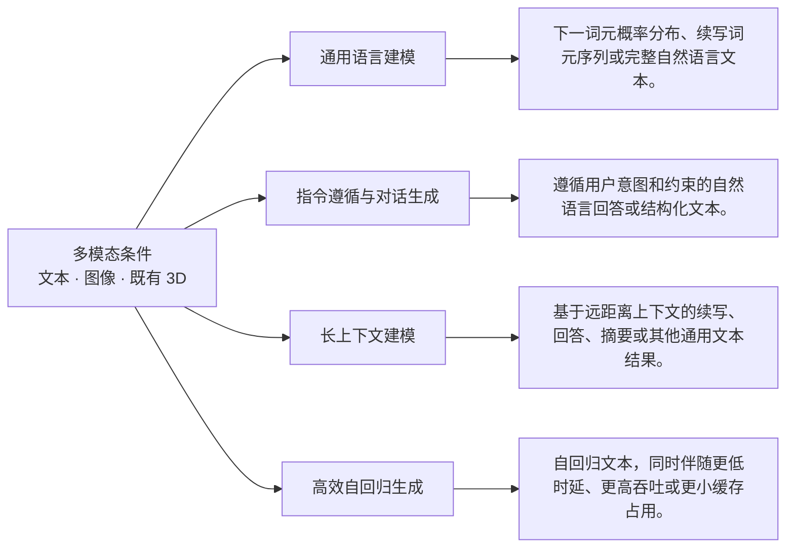
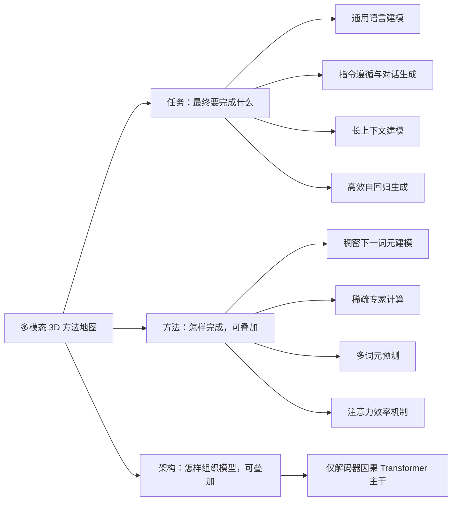
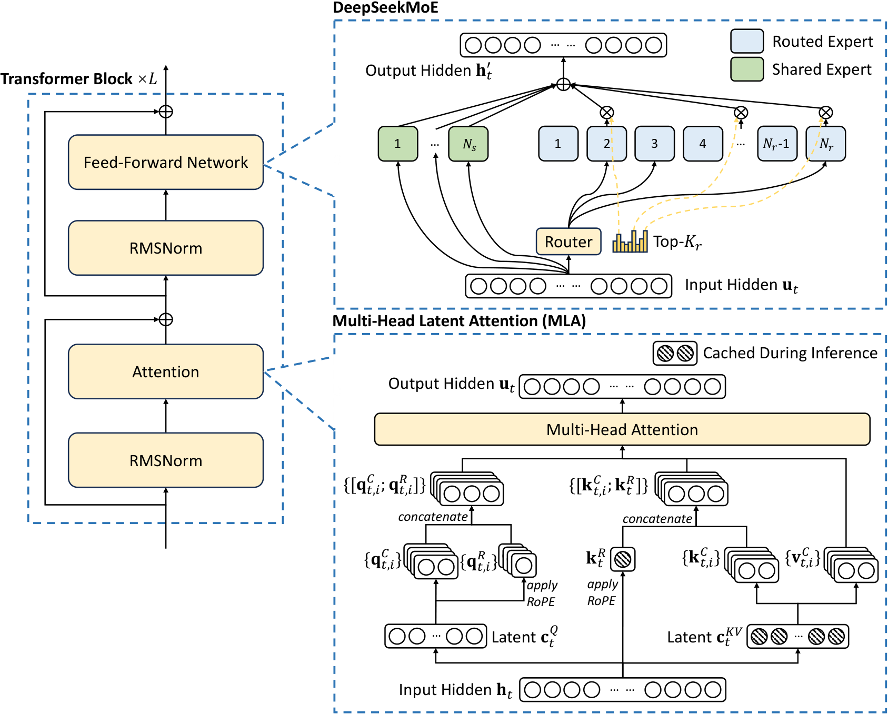
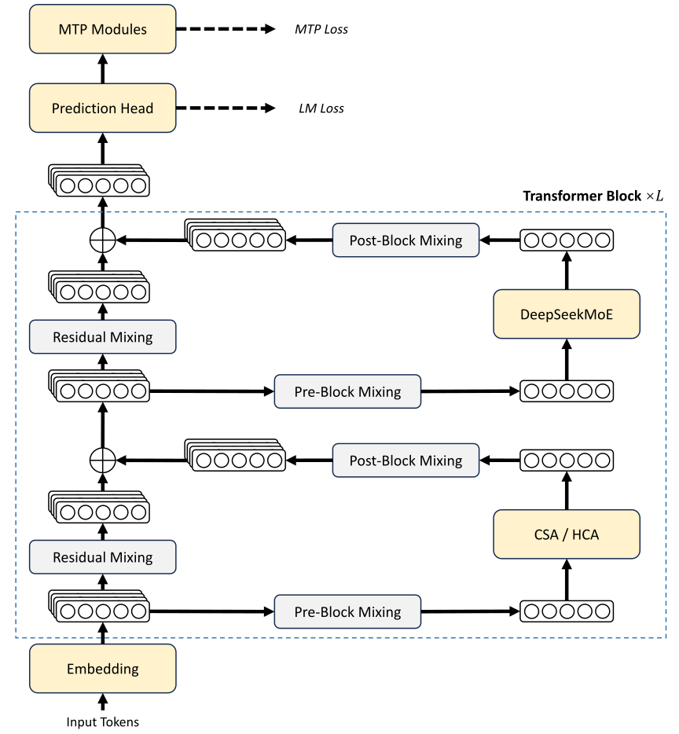
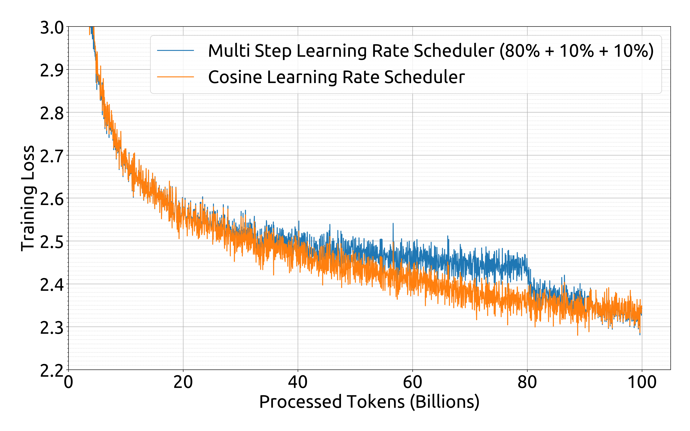

# DeepSeek 主模型系列演进：V1 到 V4：快速理解

> 当前页面用于快速建立领域地图。 [逐篇解析（6 篇）](full/) · [BibTeX 与 DBLP 查询结果](bibliography/index.html) · [返回综述目录](../)

## 总述

### 一句话定义

本综述严格覆盖 DeepSeek-AI 官方通用主模型论文：DeepSeek LLM（V1）、DeepSeek-V2、V3、V3.2、V4 与 V4.1-Flash，追踪其从稠密扩展转向混合专家计算，再到多词元预测、稀疏注意力、百万词元上下文与键值缓存压缩的演进。核心目标是在保持通用语言建模、指令遵循与推理能力的同时，降低训练成本、长序列计算量、推理时延及存储开销。V4.1-Flash 仅按通用主模型能力讨论，不扩展至视觉专项任务；未检索到 V2.5 或 V3.1 的独立官方论文。

### 任务边界

### 快速要点

- **任务：** 给定通用文本前缀、用户指令或长对话上下文，主模型以因果方式预测后续词元并生成回答；研究重点是比较各版本在预训练、计算激活、注意力、后训练及部署效率上的连续演进，而非代码、数学、视觉或推理专项模型。
- **输入：** 输入包括经过词元化的通用语料、指令与回答样本、偏好或奖励反馈，以及推理阶段的提示和历史生成前缀；长上下文版本可接收数万至百万级词元。
- **输出：** 训练输出为可用于通用生成的模型参数及推理状态；推理输出为下一词元概率分布或自回归文本，同时关注回答质量、指令满足度、上下文利用率、吞吐量、时延和缓存占用。
- **核心关注：** 在扩大总参数容量的同时控制每词元激活计算、专家负载失衡和跨设备通信；让数万至百万级上下文真正利用远距离证据，并限制注意力计算、预填充时延与键值缓存增长；在低精度、大规模并行和新型连接或优化器下保持训练收敛稳定与数值可靠性；协调下一词元、多词元、指令微调和强化学习目标，避免通用能力、推理能力与对齐效果相互损害；在统一硬件、上下文长度和解码设置下公平比较版本质量、吞吐量、时延、显存及存储成本。
- **不纳入：** 本综述不总结独立的 text-to-3D、image-to-3D 或其他 standalone 3D generation；只有统一多模态模型内部的生成能力可以作为主体任务标签；只生成二维图像而不返回三维结果的工作；仅提供数据集、评测、压缩或底层表示而不完成上述任务的工作。

*面向读者：了解 Transformer 基础、希望快速理解 DeepSeek 主模型技术演进的研究者；综述截止日期：2026-10-07。*

### 领域标准流程

下图只表达跨任务、跨论文的共同范式；标为可选的环节并非所有方法都包含。

## 分类

先按研究角色区分主体论文、相邻工作和背景工作；主体论文内部的任务标签可以多选。方法标签和架构标签可以叠加。

### 任务维度

#### 通用语言建模（General Language Modeling）

主要输入是经过词元化的通用文本前缀，最终输出是后续词元的概率分布或自回归生成文本。词元化指把原始文本转换为离散词元序列，作用是为语言模型提供统一输入单位。本类覆盖通用主模型的预训练与基础文本生成能力，不按具体知识领域或下游基准拆分。

**核心范式：** 原始通用文本被转换为词元序列；因果语言模型依据已见前缀计算下一个词元的概率分布；采样或搜索过程反复选择词元，最终形成连续文本。

**典型输入：** 自然语言文本或已词元化的文本前缀，可覆盖多语言和多领域通用语料。

**典型输出：** 下一词元概率分布、续写词元序列或完整自然语言文本。

**类别典型流程（非领域标准）：**

*代表论文方法图。论文方法流程图（图 1）；原始图注与完整说明见图片来源。 [查看图片来源](https://arxiv.org/html/2401.02954v1/figures/loss_step_cosine.png)*

*代表论文方法图。论文方法流程图（图 1）；原始图注与完整说明见图片来源。 [查看图片来源](https://arxiv.org/html/2405.04434v5/deepseekv2.png)*

*代表论文方法图。论文方法流程图（图 1）；原始图注与完整说明见图片来源。 [查看图片来源](https://arxiv.org/html/2412.19437v2/basic_arch.png)*

#### 指令遵循与对话生成（Instruction Following）

主要输入是用户指令、对话历史或带约束的自然语言请求，最终输出是符合意图、格式和安全要求的文本回答。指令遵循指模型把请求中的任务目标与约束转换为适当响应，其作用是把基础语言模型转化为可交互的通用助手。

**核心范式：** 模型接收系统约束、用户请求和可选对话历史，将其编码为上下文表示，再按自回归方式生成满足指令和交互偏好的文本。

**典型输入：** 系统提示、用户指令、对话历史以及可选的格式或行为约束。

**典型输出：** 遵循用户意图和约束的自然语言回答或结构化文本。

**类别典型流程（非领域标准）：**

*代表论文方法图。论文方法流程图（图 1）；原始图注与完整说明见图片来源。 [查看图片来源](https://arxiv.org/html/2401.02954v1/figures/loss_step_cosine.png)*

*代表论文方法图。论文方法流程图（图 1）；原始图注与完整说明见图片来源。 [查看图片来源](https://arxiv.org/html/2412.19437v2/basic_arch.png)*

*代表论文方法图。论文方法流程图（图 1）；原始图注与完整说明见图片来源。 [查看图片来源](https://arxiv.org/html/2512.02556v1/v32_arch.svg)*

#### 长上下文建模（Long-Context Modeling）

主要输入是显著长于常规窗口的文本序列，最终输出是利用远距离证据生成的文本或预测结果。长上下文建模指模型在数万至百万级词元范围内保留、检索并整合信息，其作用是支持长文档、多轮代理轨迹和大规模上下文推理。

**核心范式：** 长文本被划分并编码为大规模词元序列；模型通过位置表示和高效注意力访问局部及远程内容；相关证据被聚合后用于生成依赖长程上下文的文本。

**典型输入：** 长文档、长对话、代理交互轨迹或其他超长文本词元序列。

**典型输出：** 基于远距离上下文的续写、回答、摘要或其他通用文本结果。

**类别典型流程（非领域标准）：**

*代表论文方法图。论文方法流程图（图 1）；原始图注与完整说明见图片来源。 [查看图片来源](https://arxiv.org/html/2405.04434v5/deepseekv2.png)*

*代表论文方法图。论文方法流程图（图 1）；原始图注与完整说明见图片来源。 [查看图片来源](https://arxiv.org/html/2512.02556v1/v32_arch.svg)*

*代表论文方法图。论文方法流程图（图 1）；原始图注与完整说明见图片来源。 [查看图片来源](https://arxiv.org/html/2606.19348v1/basic_arch.svg)*

#### 高效自回归生成（Efficient Autoregressive Generation）

主要输入是提示词元及已有生成前缀，最终输出是与标准解码语义一致的后续文本，同时把预填充计算、单词元解码时延、吞吐量或键值缓存占用作为主要目标。预填充指模型一次性处理提示序列并建立推理状态；键值缓存指保存历史注意力键和值以避免重复计算。

**核心范式：** 提示序列先被预填充为可复用状态；每个解码步读取压缩、共享或稀疏选择的历史状态；模型产生一个或多个候选词元，并经验证或采样后追加到输出文本。

**典型输入：** 文本提示、已有生成前缀以及可选的缓存状态。

**典型输出：** 自回归文本，同时伴随更低时延、更高吞吐或更小缓存占用。

**类别典型流程（非领域标准）：**

*代表论文方法图。论文方法流程图（图 1）；原始图注与完整说明见图片来源。 [查看图片来源](https://arxiv.org/html/2405.04434v5/deepseekv2.png)*

*代表论文方法图。论文方法流程图（图 1）；原始图注与完整说明见图片来源。 [查看图片来源](https://arxiv.org/html/2412.19437v2/basic_arch.png)*

*代表论文方法图。论文方法流程图（图 1）；原始图注与完整说明见图片来源。 [查看图片来源](https://arxiv.org/html/2606.19348v1/basic_arch.svg)*

### 方法维度

#### 稠密下一词元建模（Dense Next-Token Modeling）

沿计算激活策略划分，本类在每个词元通过网络时使用同一组稠密参数路径，并根据完整前缀预测下一个词元。稠密参数路径指每个词元执行相同的注意力和前馈子网络，不通过专家路由选择参数子集。

**核心范式：** 输入词元经过共享嵌入和固定的稠密 Transformer 层；所有词元执行相同参数集合；输出头产生下一词元分布并驱动自回归生成。

**典型输入：** 词元序列及其位置和因果掩码。

**典型输出：** 每个位置的下一词元概率分布及由其生成的文本。

#### 稀疏专家计算（Sparse Expert Computation）

沿计算激活策略划分，本类使用混合专家机制，将每个词元的隐藏表示路由到少量共享专家和路由专家，再聚合专家输出。混合专家指模型拥有大量前馈子网络，但每个词元只激活其中一部分，其作用是在较低单词元计算量下扩大总参数容量。

**核心范式：** 词元隐藏状态先计算专家亲和分数；路由器选择少量专家；选中专家独立变换输入；门控权重聚合专家结果并返回主干网络。

**典型输入：** 每个词元的隐藏表示以及专家路由状态。

**典型输出：** 由少量激活专家加权组合得到的词元表示。

*代表论文方法图。论文方法流程图（图 1）；原始图注与完整说明见图片来源。 [查看图片来源](https://arxiv.org/html/2405.04434v5/deepseekv2.png)*

*代表论文方法图。论文方法流程图（图 1）；原始图注与完整说明见图片来源。 [查看图片来源](https://arxiv.org/html/2412.19437v2/basic_arch.png)*

*代表论文方法图。论文方法流程图（图 1）；原始图注与完整说明见图片来源。 [查看图片来源](https://arxiv.org/html/2606.19348v1/basic_arch.svg)*

#### 多词元预测（Multi-Token Prediction）

沿预测步策略划分，本类从同一前缀表示预测多个未来词元，而不是只产生紧邻的下一词元目标。多词元预测的输入是当前因果前缀，输出是多个预测深度上的未来词元分布；其作用是增加训练信号密度，并可为推测解码提供候选。

**核心范式：** 主干网络产生当前前缀表示；一个或多个预测模块按并行或保持因果链的顺序生成多个未来位置分布；训练时聚合各深度损失，推理时可丢弃模块或用于草稿生成与验证。

**典型输入：** 当前词元前缀及主干模型生成的隐藏表示。

**典型输出：** 多个未来位置的词元概率分布，或供验证的多词元草稿。

*代表论文方法图。论文方法流程图（图 1）；原始图注与完整说明见图片来源。 [查看图片来源](https://arxiv.org/html/2412.19437v2/basic_arch.png)*

#### 注意力效率机制（Attention Efficiency）

沿上下文访问策略划分，本类通过键值低秩压缩、序列压缩、稀疏选择、局部窗口、跨层缓存共享或低精度存储，减少注意力在预填充和解码阶段的计算与存储。键值表示是注意力为历史词元保存的检索键和内容值，其作用是让当前查询读取相关上下文。

**核心范式：** 历史隐藏状态被转换为紧凑键值条目；查询通过全量、索引选择或局部窗口定位相关条目；核心注意力仅在保留的表示上计算；结果被投影回主干隐藏空间。

**典型输入：** 当前查询隐藏状态、历史隐藏状态或已有键值缓存。

**典型输出：** 以更低计算量或缓存占用得到的注意力上下文表示。

*代表论文方法图。论文方法流程图（图 1）；原始图注与完整说明见图片来源。 [查看图片来源](https://arxiv.org/html/2405.04434v5/deepseekv2.png)*

*代表论文方法图。论文方法流程图（图 1）；原始图注与完整说明见图片来源。 [查看图片来源](https://arxiv.org/html/2412.19437v2/basic_arch.png)*

*代表论文方法图。论文方法流程图（图 1）；原始图注与完整说明见图片来源。 [查看图片来源](https://arxiv.org/html/2512.02556v1/v32_arch.svg)*

### 架构维度

#### 仅解码器因果 Transformer 主干（Decoder-Only Causal Transformer）

共同架构路线是仅解码器因果 Transformer：输入词元经嵌入后通过堆叠的自注意力与前馈模块，因果掩码保证每个位置只能读取自身及此前位置，最终自回归输出文本。Transformer 是以注意力在序列位置间交换信息的神经网络骨干，其作用是统一承载通用语言建模、专家计算和高效注意力。

**核心范式：** 离散词元被嵌入为向量；多层因果自注意力聚合前缀信息；前馈或混合专家子层进行逐词元变换；残差连接传递信息；输出头产生下一词元分布并循环生成。

**典型输入：** 按顺序排列的文本词元嵌入及其位置信息。

**典型输出：** 每个位置的因果隐藏表示和后续词元概率分布。

## 相关工作

本章不重复逐篇摘要，而是按照领域类别串起方法演化：先说明问题和范式，再说明代表工作如何改变方法，最后指出仍未解决的缺口。

### 通用语言建模（General Language Modeling）

*相关工作代表论文方法图。论文方法流程图（图 1）；原始图注与完整说明见图片来源。 [查看图片来源](https://arxiv.org/html/2401.02954v1/figures/loss_step_cosine.png)*

*相关工作代表论文方法图。论文方法流程图（图 1）；原始图注与完整说明见图片来源。 [查看图片来源](https://arxiv.org/html/2405.04434v5/deepseekv2.png)*

- **阶段一：以扩展规律指导通用稠密主模型的预训练与后训练**：综合来看，早期方法从通用文本词元前缀到后续词元或生成文本，但既有扩展规律结论不一致，使开放大语言模型的规模选择和资源配置缺少稳定依据。；方法变化：这些摘要共同显示，该阶段的方法变化轴是从经验性扩大模型转向研究扩展规律，并据此构建不同规模的通用主模型，同时在预训练后加入监督微调与偏好优化。；代表论文：arxiv_2401.02954。
- **阶段二：以稀疏激活和压缩注意力降低大模型训练与推理成本**：综合来看，随着通用主模型规模增长，主要瓶颈由是否能够扩展转向训练计算成本、推理时键值缓存占用和生成吞吐量。；方法变化：这些摘要共同显示，该阶段的方法变化轴是由常规主模型转向稀疏激活的混合专家架构，并压缩注意力所需的缓存表示，以同时改善训练经济性和推理效率。；代表论文：arxiv_2405.04434。
- **阶段三：在既有稀疏架构上改进负载均衡与词元预测监督**：综合来看，稀疏混合专家模型虽能减少每个词元的激活参数，但仍需处理专家负载均衡、训练成本和模型性能之间的关系，并继续增强通用词元预测能力。；方法变化：这些摘要共同显示，该阶段的方法变化轴是在继承已验证的稀疏架构与压缩注意力之后，改变专家负载均衡策略并加入多词元预测训练目标，而不是单纯继续扩大参数量。；代表论文：arxiv_2412.19437。
- **阶段四：面向百万词元上下文重构注意力、残差连接与优化过程**：综合来看，当通用语言模型支持百万词元输入时，注意力计算与状态保存成本、深层表示传递以及超大规模训练的收敛稳定性成为新的主要瓶颈。；方法变化：这些摘要共同显示，该阶段的方法变化轴是从主要依靠潜在缓存压缩，转向组合式长上下文注意力，并同步改变残差连接和参数优化方式。；代表论文：arxiv_2606.19348。

**读者应记住：** DeepSeek 通用主模型的演进并非单一参数规模竞赛，而是沿着通用预训练规模化、稀疏参数激活、注意力状态压缩、负载均衡与多词元监督、百万词元上下文效率等连续问题展开。六篇指定版本论文共同构成这条主模型演进链；V2.5 与 V3.1 当前未检索到独立官方论文，不能以相邻版本材料代替。

### 指令遵循与对话生成（Instruction Following）

*相关工作代表论文方法图。论文方法流程图（图 1）；原始图注与完整说明见图片来源。 [查看图片来源](https://arxiv.org/html/2401.02954v1/figures/loss_step_cosine.png)*

*相关工作代表论文方法图。论文方法流程图（图 1）；原始图注与完整说明见图片来源。 [查看图片来源](https://arxiv.org/html/2412.19437v2/basic_arch.png)*

- **V1：监督微调与直接偏好优化奠定通用助手后训练路线**：综合来看，单纯完成基础预训练并不足以证明模型能够稳定地响应用户指令和交互偏好，需要额外的通用后训练阶段把语言模型转化为可交互模型。；方法变化：这些摘要共同显示，DeepSeek LLM 在预训练之后引入监督微调和直接偏好优化，构成该版本公开摘要所呈现的指令后训练路线。；代表论文：arxiv_2401.02954。
- **V3：从监督微调扩展到强化学习后训练**：综合来看，V1 已建立监督与偏好优化路线，但当前材料不足以证明该路线能够充分释放更大规模主模型的通用能力。；方法变化：这些摘要共同显示，DeepSeek-V3 在大规模预训练之后采用监督微调和强化学习两个后训练阶段，把公开的方法描述从直接偏好优化推进到强化学习。；代表论文：arxiv_2412.19437。
- **V3.2：通过可扩展强化学习与后训练计算扩展强化能力**：综合来看，在已有监督微调和强化学习流程之上，如何继续扩展后训练并兼顾计算效率、推理能力和智能体表现，成为后续版本面对的问题。；方法变化：这些摘要共同显示，DeepSeek-V3.2 引入可扩展强化学习框架，并通过稳健的强化学习协议与后训练计算扩展来提升模型能力。；代表论文：arxiv_2512.02556。

**读者应记住：** 就所给材料而言，DeepSeek 主模型在指令遵循维度上的明确演进证据主要来自后训练方法：V1 建立监督微调与偏好优化路线，V3 引入强化学习阶段，V3.2 进一步扩展强化学习框架及后训练计算。早期范式的输入是用户指令或会话上下文，输出是面向用户的文本回答；其主要瓶颈是预训练模型尚不能仅凭语言建模目标保证稳定遵循意图和偏好。后续版本通过改变参数训练所用的监督与优化机制来应对这一问题，但多轮一致性、格式约束、安全行为、反馈质量和推理流程仍缺乏摘要级完整证据。

### 长上下文建模（Long-Context Modeling）

*相关工作代表论文方法图。论文方法流程图（图 1）；原始图注与完整说明见图片来源。 [查看图片来源](https://arxiv.org/html/2405.04434v5/deepseekv2.png)*

*相关工作代表论文方法图。论文方法流程图（图 1）；原始图注与完整说明见图片来源。 [查看图片来源](https://arxiv.org/html/2512.02556v1/v32_arch.svg)*

- **从扩大上下文窗口到压缩键值缓存**：综合来看，早期长上下文方法需要在更长的文本输入上生成输出，但长序列推理会带来较大的键值缓存和推理成本瓶颈。；方法变化：综合来看，DeepSeek-V2 将方法变化轴设为对键值缓存的潜在表示压缩，并把长上下文支持与高效推理结合起来。；代表论文：arxiv_2405.04434。
- **从缓存压缩到稀疏上下文访问**：这些摘要共同显示，单纯压缩键值缓存并不能完整覆盖长上下文计算复杂度问题，后续方法需要减少注意力对长序列的访问范围。；方法变化：综合来看，DeepSeek-V3.2 将主要方法变化轴推进到 DeepSeek Sparse Attention，即通过稀疏注意力降低长上下文场景中的计算复杂度，同时强调保持模型性能。；代表论文：arxiv_2512.02556。
- **从稀疏访问到百万词元混合注意力**：综合来看，百万词元输入进一步放大了长上下文注意力的计算与存储压力，仅依靠单一缓存压缩或稀疏访问机制仍不足以概括完整的上下文效率问题。；方法变化：综合来看，DeepSeek-V4 将方法变化轴推进到结合 Compressed Sparse Attention（压缩稀疏注意力）与 Heavily Compressed Attention（高度压缩注意力）的混合注意力架构，并把支持范围扩展到一百万词元上下文。；代表论文：arxiv_2606.19348。
- **从百万词元上下文到预填充—解码联合优化**：这些摘要共同显示，长时程代理工作负载使输入侧预填充、KV 缓存容量以及计算和数据传输带宽成为进一步降低部署成本的主要瓶颈。；方法变化：综合来看，DeepSeek-V4.1-Flash 将方法变化轴推进到因果编码器—解码器结构，使预填充和解码阶段采用不同的每词元激活规模，并继续面向百万词元上下文。；代表论文：arxiv_2609.19969。

**读者应记住：** 这些摘要共同显示，长上下文能力并非只是扩大最大窗口，而是表示、注意力访问方式和推理阶段结构共同变化的结果。DeepSeek-V2 首先突出键值缓存压缩，DeepSeek-V3.2 强调稀疏注意力，DeepSeek-V4 扩展到百万词元上下文与混合注意力，DeepSeek-V4.1-Flash 则进一步区分预填充和解码的计算需求。仍未解决的问题包括统一条件下的远距离信息保持、长上下文训练与后训练细节、真实代理轨迹中的端到端成本，以及不同版本之间可直接比较的评测证据。

### 高效自回归生成（Efficient Autoregressive Generation）

*相关工作代表论文方法图。论文方法流程图（图 1）；原始图注与完整说明见图片来源。 [查看图片来源](https://arxiv.org/html/2405.04434v5/deepseekv2.png)*

*相关工作代表论文方法图。论文方法流程图（图 1）；原始图注与完整说明见图片来源。 [查看图片来源](https://arxiv.org/html/2412.19437v2/basic_arch.png)*

- **阶段一：以潜在表示压缩键值缓存**：综合来看，早期高效生成面对的核心问题是：输入提示和已有前缀不断增长时，模型需要保存并读取越来越大的历史注意力状态，从而限制通用文本生成的缓存效率与吞吐量。；方法变化：这些摘要共同显示，DeepSeek-V2将效率改进集中在历史状态的表示方式上：多头潜在注意力（Multi-head Latent Attention，MLA）把注意力键值缓存压缩为潜在向量；稀疏激活的混合专家模型（Mixture-of-Experts，MoE）则让每个词元只使用部分参数。；代表论文：arxiv_2405.04434。
- **阶段二：复用缓存压缩架构并加入多词元预测目标**：综合来看，在缓存压缩和稀疏激活已能提高效率之后，下一问题是如何在延续经济训练与高效推理的同时进一步增强主模型性能。；方法变化：这些摘要共同显示，DeepSeek-V3延续在DeepSeek-V2中得到验证的MLA与DeepSeekMoE，并把方法变化推进到训练目标和专家负载管理：采用无辅助损失的负载均衡策略，并设置多词元预测训练目标。多词元预测是让训练目标同时预测多个后续词元，而非只监督紧邻的下一个词元。；代表论文：arxiv_2412.19437。
- **阶段三：以混合压缩—稀疏注意力扩展至百万词元上下文**：综合来看，当主模型扩展到百万词元上下文时，仅说明缓存压缩还不足以刻画长提示预填充和后续上下文访问的整体效率问题。；方法变化：这些摘要共同显示，DeepSeek-V4把方法变化推进到混合注意力架构：压缩稀疏注意力（Compressed Sparse Attention，CSA）与高度压缩注意力（Heavily Compressed Attention，HCA）结合，用于提高长上下文效率；同时引入流形约束超连接与Muon优化器。；代表论文：arxiv_2606.19348。
- **阶段四：联合削减输入密集负载的预填充、缓存与传输成本**：综合来看，面向长时程智能体的输入密集负载仍受到昂贵预填充、大型键值缓存以及高带宽内存与固态存储容量和数据传输带宽的共同限制。；方法变化：这些摘要共同显示，DeepSeek-V4.1-Flash不再只把问题表述为缓存压缩，而是以因果编码器—解码器架构（Causal Encoder-Decoder，CED）区分预填充与解码的计算路径，使两个阶段激活不同数量的参数。；代表论文：arxiv_2609.19969。

**读者应记住：** 这条证据链表明，高效自回归生成的优化对象逐步从解码期缓存，扩展到训练目标、百万词元上下文访问，以及预填充计算、存储容量和传输带宽的联合约束；不过给定摘要不足以统一比较各版本在相同硬件和负载下的端到端时延、吞吐、缓存与生成质量。
