# Hunyuan3D-Buffalo：统一多模态3D生成、理解与编辑：逐篇解析

> 当前页面按分类和时间顺序逐篇介绍论文。 [快速理解版](../) · [BibTeX 与 DBLP 查询结果](../bibliography/index.html) · [返回综述目录](../../)

## 逐篇解析

以下论文先按研究角色分为主体、相邻和背景，再在主体内部显示任务标签；统一模型不会被压缩成单一任务。这里的“统一模型内的三维生成能力”只表示主体模型中的一个任务分支，不等于把独立的 text-to-3D、image-to-3D 或单任务 3D 生成器纳入主体。分类内按首稿时间从早到晚排列。文字为摘要级快速介绍，配图来自论文原文。

### 主体论文（统一多模态模型）

#### 任务标签：三维资产编辑（editing）

##### 2026

##### Omni123: Exploring 3D Native Foundation Models with Limited 3D Data by Unifying Text to 2D and 3D Generation

作者：Chongjie Ye, Chen Cao, Chuanyu Pan, Yi-Ming Hao, Yihao Zhi, Yuan-Ming Hu, Xiao-Guang Han

研究角色：主体论文（统一多模态模型）
任务标签：generation、editing

方法标签：mesh_tokenization_flow

架构标签：unified_multimodal_model

中文简介：

Omni123是一个3D原生基础模型，解决数据稀缺下的文本到2D及3D统一生成任务。核心方法是将文本、图像和3D表示为共享序列空间中的离散词元，采用自回归框架。通过交错X-to-X训练范式，利用丰富2D数据作为几何先验，在语义-视觉-几何循环中强制多视图一致性。区别于依赖2D优化提升的间接管线，该模型直接在统一序列空间中建模，显著改善文本引导的3D生成与编辑，提供可扩展的多模态世界模型路径。

*原文 Figure 3：Figure 3 : Overview of the Omni123 architecture. Text is encoded by dual text encoders (CLIP [ 60 ] and Qwen3-0.6B [ 87 ] ) and fed into a conditioning stream, while images and 3D shapes are tokenized into 1D discrete tokens and concatenated into a unified generation stream. The unified autoregressive transformer backbone uses 24 dual-stream blocks to jointly process the conditioning and generation tokens under causal attention, followed by 6 single-stream layers operating only on generation tokens, and finally with modality-specific linear heads decoding token logits over the 2D and 3D codebooks. [查看图片来源](https://arxiv.org/html/2604.02289v1/pretraining2.png)*

引用来源：arxiv_2608.02711

链接：[arXiv](https://arxiv.org/abs/2604.02289)

##### Hunyuan3D-Buffalo 1.0: A Unified Multimodal Model for Scalable 3D Generation, Understanding, and Editing

作者：Ye, Junliang, Liu, Kenkun, Wang, Guocun, Li, Yang, Qu, Yansong, Wang, Chunshi, Xu, Jingwei, Yang, Yunhan, Zhao, Zibo, Xu, Jiachen, Yu, Jiaao, Wang, Lifu, Liang, Zhihao, Huang, Xin, Chen, Zhuo, Guo, Chunchao

研究角色：主体论文（统一多模态模型）
任务标签：generation、editing、understanding、part_structured_generation

架构标签：unified_multimodal_model

中文简介：

Hunyuan3D-Buffalo 1.0旨在解决三维理解、文本生成三维及指令编辑任务，输入为文本、图像或三维资产，输出对应语义描述、完整三维模型或编辑后资产。其核心范式是统一多模态架构，结合Hunyuan3D-VLM进行语义空间理解，并利用Hunyuan3D DiT进行高保真合成，通过共享主干实现模态交互。区别于独立生成器，该模型在单一框架内整合了理解与生成能力，利用大规模多模态语料库训练，显著提升了编辑时的结构保持能力和生成质量，代表了三维基础模型向统一化发展的前沿方向。

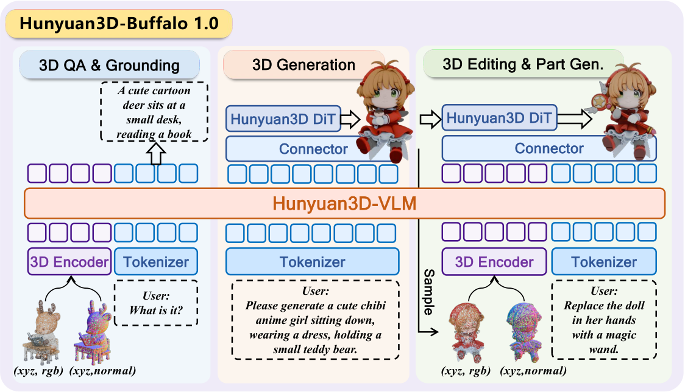

*原文 Figure 7：Figure 6: Hunyuan3D-Buffalo 1.0 pipeline. The framework unifies 3D QA and grounding, text-to-3D generation, and 3D editing through a shared Hunyuan3D-VLM backbone, which connects language, 3D representations, and generative Hunyuan3D DiT modules for multimodal understanding, generation, and editing. [查看图片来源](https://arxiv.org/html/2608.02711v3/Pipeline.png)*

引用来源：user_seed

链接：[arXiv](https://arxiv.org/abs/2608.02711)

#### 任务标签：统一模型内的三维生成能力（generation）

##### 2026

##### Omni123: Exploring 3D Native Foundation Models with Limited 3D Data by Unifying Text to 2D and 3D Generation

作者：Chongjie Ye, Chen Cao, Chuanyu Pan, Yi-Ming Hao, Yihao Zhi, Yuan-Ming Hu, Xiao-Guang Han

研究角色：主体论文（统一多模态模型）
任务标签：generation、editing

方法标签：mesh_tokenization_flow

架构标签：unified_multimodal_model

中文简介：

Omni123是一个3D原生基础模型，解决数据稀缺下的文本到2D及3D统一生成任务。核心方法是将文本、图像和3D表示为共享序列空间中的离散词元，采用自回归框架。通过交错X-to-X训练范式，利用丰富2D数据作为几何先验，在语义-视觉-几何循环中强制多视图一致性。区别于依赖2D优化提升的间接管线，该模型直接在统一序列空间中建模，显著改善文本引导的3D生成与编辑，提供可扩展的多模态世界模型路径。

*原文 Figure 3：Figure 3 : Overview of the Omni123 architecture. Text is encoded by dual text encoders (CLIP [ 60 ] and Qwen3-0.6B [ 87 ] ) and fed into a conditioning stream, while images and 3D shapes are tokenized into 1D discrete tokens and concatenated into a unified generation stream. The unified autoregressive transformer backbone uses 24 dual-stream blocks to jointly process the conditioning and generation tokens under causal attention, followed by 6 single-stream layers operating only on generation tokens, and finally with modality-specific linear heads decoding token logits over the 2D and 3D codebooks. [查看图片来源](https://arxiv.org/html/2604.02289v1/pretraining2.png)*

引用来源：arxiv_2608.02711

链接：[arXiv](https://arxiv.org/abs/2604.02289)

##### Hunyuan3D-Buffalo 1.0: A Unified Multimodal Model for Scalable 3D Generation, Understanding, and Editing

作者：Ye, Junliang, Liu, Kenkun, Wang, Guocun, Li, Yang, Qu, Yansong, Wang, Chunshi, Xu, Jingwei, Yang, Yunhan, Zhao, Zibo, Xu, Jiachen, Yu, Jiaao, Wang, Lifu, Liang, Zhihao, Huang, Xin, Chen, Zhuo, Guo, Chunchao

研究角色：主体论文（统一多模态模型）
任务标签：generation、editing、understanding、part_structured_generation

架构标签：unified_multimodal_model

中文简介：

Hunyuan3D-Buffalo 1.0旨在解决三维理解、文本生成三维及指令编辑任务，输入为文本、图像或三维资产，输出对应语义描述、完整三维模型或编辑后资产。其核心范式是统一多模态架构，结合Hunyuan3D-VLM进行语义空间理解，并利用Hunyuan3D DiT进行高保真合成，通过共享主干实现模态交互。区别于独立生成器，该模型在单一框架内整合了理解与生成能力，利用大规模多模态语料库训练，显著提升了编辑时的结构保持能力和生成质量，代表了三维基础模型向统一化发展的前沿方向。

*原文 Figure 7：Figure 6: Hunyuan3D-Buffalo 1.0 pipeline. The framework unifies 3D QA and grounding, text-to-3D generation, and 3D editing through a shared Hunyuan3D-VLM backbone, which connects language, 3D representations, and generative Hunyuan3D DiT modules for multimodal understanding, generation, and editing. [查看图片来源](https://arxiv.org/html/2608.02711v3/Pipeline.png)*

引用来源：user_seed

链接：[arXiv](https://arxiv.org/abs/2608.02711)

#### 任务标签：部件结构化生成（part_structured_generation）

##### 2026

##### Hunyuan3D-Buffalo 1.0: A Unified Multimodal Model for Scalable 3D Generation, Understanding, and Editing

作者：Ye, Junliang, Liu, Kenkun, Wang, Guocun, Li, Yang, Qu, Yansong, Wang, Chunshi, Xu, Jingwei, Yang, Yunhan, Zhao, Zibo, Xu, Jiachen, Yu, Jiaao, Wang, Lifu, Liang, Zhihao, Huang, Xin, Chen, Zhuo, Guo, Chunchao

研究角色：主体论文（统一多模态模型）
任务标签：generation、editing、understanding、part_structured_generation

架构标签：unified_multimodal_model

中文简介：

Hunyuan3D-Buffalo 1.0旨在解决三维理解、文本生成三维及指令编辑任务，输入为文本、图像或三维资产，输出对应语义描述、完整三维模型或编辑后资产。其核心范式是统一多模态架构，结合Hunyuan3D-VLM进行语义空间理解，并利用Hunyuan3D DiT进行高保真合成，通过共享主干实现模态交互。区别于独立生成器，该模型在单一框架内整合了理解与生成能力，利用大规模多模态语料库训练，显著提升了编辑时的结构保持能力和生成质量，代表了三维基础模型向统一化发展的前沿方向。

*原文 Figure 7：Figure 6: Hunyuan3D-Buffalo 1.0 pipeline. The framework unifies 3D QA and grounding, text-to-3D generation, and 3D editing through a shared Hunyuan3D-VLM backbone, which connects language, 3D representations, and generative Hunyuan3D DiT modules for multimodal understanding, generation, and editing. [查看图片来源](https://arxiv.org/html/2608.02711v3/Pipeline.png)*

引用来源：user_seed

链接：[arXiv](https://arxiv.org/abs/2608.02711)

#### 任务标签：三维场景理解（understanding）

##### 2026

##### Hunyuan3D-Buffalo 1.0: A Unified Multimodal Model for Scalable 3D Generation, Understanding, and Editing

作者：Ye, Junliang, Liu, Kenkun, Wang, Guocun, Li, Yang, Qu, Yansong, Wang, Chunshi, Xu, Jingwei, Yang, Yunhan, Zhao, Zibo, Xu, Jiachen, Yu, Jiaao, Wang, Lifu, Liang, Zhihao, Huang, Xin, Chen, Zhuo, Guo, Chunchao

研究角色：主体论文（统一多模态模型）
任务标签：generation、editing、understanding、part_structured_generation

架构标签：unified_multimodal_model

中文简介：

Hunyuan3D-Buffalo 1.0旨在解决三维理解、文本生成三维及指令编辑任务，输入为文本、图像或三维资产，输出对应语义描述、完整三维模型或编辑后资产。其核心范式是统一多模态架构，结合Hunyuan3D-VLM进行语义空间理解，并利用Hunyuan3D DiT进行高保真合成，通过共享主干实现模态交互。区别于独立生成器，该模型在单一框架内整合了理解与生成能力，利用大规模多模态语料库训练，显著提升了编辑时的结构保持能力和生成质量，代表了三维基础模型向统一化发展的前沿方向。

*原文 Figure 7：Figure 6: Hunyuan3D-Buffalo 1.0 pipeline. The framework unifies 3D QA and grounding, text-to-3D generation, and 3D editing through a shared Hunyuan3D-VLM backbone, which connects language, 3D representations, and generative Hunyuan3D DiT modules for multimodal understanding, generation, and editing. [查看图片来源](https://arxiv.org/html/2608.02711v3/Pipeline.png)*

引用来源：user_seed

链接：[arXiv](https://arxiv.org/abs/2608.02711)

### 相邻工作

#### 相邻工作：adjacent

##### 2025

##### TripoSG: High-Fidelity 3D Shape Synthesis using Large-Scale Rectified Flow Models

作者：Yangguang Li, Zi-Xin Zou, Zexiang Liu, De-Hui Wang, Yuan-Zhi Liang, Zhipeng Yu, Xingchao Liu, Yuanchen Guo, Ding Liang, Wanli Ouyang, Yan-Pei Cao

研究角色：相邻工作
任务标签：adjacent

中文简介：

TripoSG解决从单张图像生成高保真三维网格的任务。它提出一种简化的形状扩散范式，核心组件包括用于3D形状生成的大规模整流流Transformer，以及结合SDF、法线和eikonal损失的混合监督训练策略用于3D VAE。通过处理200万高质量3D样本，该方法实现了与输入图像精确对应的高细节生成。作为相邻工作，它代表了基于大规模数据和先进扩散技术（整流流）的独立Text/Image-to-3D生成路线的最新进展，显著提升了生成 fidelity。

*原文 Figure 1：Figure 2 : The overview of our method consists of two main components: (i) Data-Building System and (ii) TripoSG Model. The data-building system processes the 3D models from various datasets (e.g., Objaverse and ShapeNet) through a series of data processing steps to create the training data. Our TripoSG model is then trained on this curated dataset for high-fidelity shape generation from a single input image. [查看图片来源](https://arxiv.org/html/2502.06608v3/pipeline.png)*

引用来源：arxiv_2608.02711

链接：[arXiv](https://arxiv.org/abs/2502.06608)

##### EditP23: 3D Editing via Propagation of Image Prompts to Multi-View

作者：Roi Bar-On, Dana Cohen-Bar, Daniel Cohen-Or

研究角色：相邻工作
任务标签：adjacent

中文简介：

EditP23解决无掩码三维编辑任务，输入为原始视图及其用户编辑后的2D图像对，输出多视图一致的3D编辑结果。核心方法通过将2D图像编辑提示传播至预训练多视图扩散模型的潜空间，引导编辑感知流在前馈过程中跨视图 coherent 传播。区别于依赖文本提示或显式空间掩码的传统方法，该技术无需优化步骤即可保持物体身份与结构外观的一致性，属于多视图2D投影融合类别的相邻工作。

*原文 Figure 8：Figure 7 . Ablation Study of the Edit-Aware Denoising Mechanism. This figure compares our full method against two ablated variants: SDEdit and FlowEdit. For each edit request (“Cross Arms” and “Wear Tuxedo”) we show the target edited view provided to all methods (second row), followed by the source object, rendered from two alternative viewpoints. Rows 4-5 compares the editing results when applying SDEdit, FlowEdit, and our approach on the mv-grid. [查看图片来源](https://arxiv.org/html/2506.20652v1/images/ablations/ex2/src_mv_1_0.png)*

引用来源：arxiv_2608.02711

链接：[arXiv](https://arxiv.org/abs/2506.20652)

##### Pro3D-Editor : A Progressive-Views Perspective for Consistent and Precise 3D Editing

作者：Yang Zheng, Mengqi Huang, Nan Chen, Z. Mao

研究角色：相邻工作
任务标签：adjacent

中文简介：

Pro3D-Editor专注于文本引导的三维资产编辑任务，输入现有三维资产和文本指令，输出编辑后的三维模型。针对现有方法忽视视图间依赖导致的不一致问题，它提出“渐进式视图”范式：动态采样显著视图作为主视图，利用MoVE-LoRA将语义传播至关键视图，最后融合优化全视图。该方法属于多视图2D投影融合类别，但通过显式建模视图间传播机制，显著提升了编辑的空间一致性和准确性，优于传统无差别视图编辑路线。

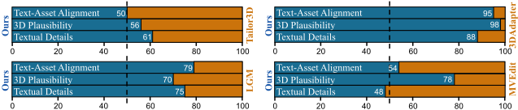

*原文 Figure 5：Figure 5: Quantitative comparison using GPTEval3D [ 40 ] . The blue segments indicate the selection rate of Pro3D-Editor , while the orange segments represent that of the baseline. A higher selection rate indicates better editing performance of the corresponding method. [查看图片来源](https://arxiv.org/html/2506.00512v2/gpteval3d.svg)*

引用来源：arxiv_2608.02711

链接：[arXiv](https://arxiv.org/abs/2506.00512)

##### NANO3D: A Training-Free Approach for Efficient 3D Editing Without Masks

作者：Junliang Ye, Shenghao Xie, Ruowen Zhao, Zhengyi Wang, Hongyu Yan, Wen-Qiang Zu, Lei Ma, Jun Zhu

研究角色：相邻工作
任务标签：adjacent

中文简介：

Nano3D解决无需训练的高效三维编辑任务，输入为三维资产及前视图渲染引导，输出为编辑后的三维对象。核心方法将FlowEdit集成到TRELLIS框架中，引入区域感知合并策略（Voxel/Slat-Merge），自适应地保持编辑区与未编辑区的结构一致性。区别于依赖掩码或复杂优化的前序方法，Nano3D在无掩码条件下实现了精确且连贯的局部编辑。此外，该工作构建了包含10万对高质量编辑样本的数据集，为解决三维编辑中的伪影和不一致问题提供了新的算法与数据基础。

*原文 Figure 2：Figure 2: The Nano3D pipeline. The original 3D object is voxelized and encoded into sparse structure and structured latent respectively. Stage 1 modifies geometry via Flow Transformer with FlowEdit, guided by Nano Banana–edited images. Stage 2 generates structured latents with Sparse Flow Transformer, supporting TRELLIS-inherent appearance editing. Voxel/Slat-Merge further ensures consistency across both stages before decoding the final 3D object. [查看图片来源](https://arxiv.org/html/2510.15019v1/pipeline.png)*

引用来源：arxiv_2608.02711

链接：[arXiv](https://arxiv.org/abs/2510.15019)

##### 2026

##### Easy3E: Feed-Forward 3D Asset Editing via Rectified Voxel Flow

作者：Shimin Hu, Yuanyi Wei, Fei Zha, Yudong Guo, Juyong Zhang

研究角色：相邻工作
任务标签：adjacent

中文简介：

Easy3E解决三维资产编辑任务，接收现有三维模型及单视图编辑指令，输出全局一致的编辑后模型。其核心方法是基于TrellIS骨干的前馈框架，引入Voxel FlowEdit在稀疏体素潜空间中实现单次前向传播的全局几何变形，并利用法线引导的多视图生成模块恢复高频纹理细节。不同于依赖耗时迭代优化或多视图不一致的传统方法，Easy3E通过解耦几何变形与外观修复，实现了快速、高保真且几何一致的三维编辑。

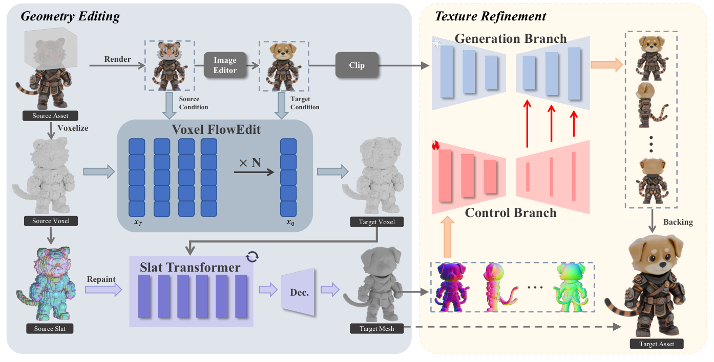

*原文 Figure 1：Figure 2 : Overview of Easy3E. The framework operates in two main stages: Geometry Editing and Texture Refinement. Starting from a rendered source view, an edited target image provides the guidance for editing. In the Geometry Editing stage, the Voxel FlowEdit algorithm transforms the source voxel structure under flow-based guidance, followed by SLAT Repainting that refines local latent features to produce the target mesh. The Texture Refinement stage then employs a generation branch and a normal-guided control adapter to synthesize multi-view-consistent textures, which are projected and fused onto the mesh to yield the final high-fidelity 3D asset. [查看图片来源](https://arxiv.org/html/2602.21499v2/pipeline.png)*

引用来源：arxiv_2608.02711

链接：[arXiv](https://arxiv.org/abs/2602.21499)

##### ShapeUP: Scalable Image-Conditioned 3D Editing

作者：Inbar Gat, Dana Cohen-Bar, Guy J. Levy, Elad Richardson, Daniel Cohen-Or

研究角色：相邻工作
任务标签：adjacent

中文简介：

ShapeUP致力于解决可扩展的图像条件三维编辑任务，输入源三维形状和编辑后的二维图像，输出编辑后的三维资产。它将编辑建模为原生三维表示内的监督潜空间到潜空间翻译，利用3D扩散Transformer学习直接映射。区别于优化方法的缓慢和多视图传播的视觉漂移，ShapeUP通过监督训练适配预训练三维基础模型，实现了无需掩码的细粒度视觉控制和严格的几何一致性，提供了一种鲁棒且可扩展的原生三维编辑范式。

*原文 Figure 2：Figure 2. Overview. ShapeUP takes a Textured Source Mesh together with a single Edited Image (left). The ShapeUP Geometry module produces an Untextured Edited Mesh by editing the source shape directly in a native 3D latent space, preserving identity and enabling implicit localization. The edited geometry is rendered to obtain Positions + Normals, which guide the ShapeUP Texture module (right) to generate the final Textured Edited Mesh while retaining details from the Source Texture. [查看图片来源](https://arxiv.org/html/2602.05676v2/images/overview_v2png.png)*

引用来源：arxiv_2608.02711

链接：[arXiv](https://arxiv.org/abs/2602.05676)

##### VecSet-Edit: Unleashing Pre-trained LRM for Mesh Editing from Single Image

作者：Teng-Fang Hsiao, Bo-Kai Ruan, Yu-Lun Liu, Hong-Han Shuai

研究角色：相邻工作
任务标签：adjacent

中文简介：

VecSet-Edit针对三维网格编辑难题，利用预训练VecSet大重建模型作为骨干，接收单张图像条件和原始网格，输出编辑后的网格。其核心方法基于VecSet词元的空间属性分析，引入掩码引导的词元种子化和注意力对齐的门控机制来定位目标区域，并设计漂移感知词元剪枝以剔除几何异常。相较于基于体素的方法，该方案无需繁琐的三维掩码，并通过纹理烘焙模块保留几何与纹理细节，实现了高精度的直接网格编辑。

*原文 Figure 2：Figure 2. Overview of the VecSet-Edit framework. Given a mesh 𝒮 \mathcal{S} , a rendered view I s I_{s} , a 2D edit mask M I M_{I} , and a user-edited target view I E I_{E} , the pipeline proceeds in two main stages. First, Token Selection : To localize the editable region without 3D supervision, Token Seeding aggregates informative cross-attention layers to identify initial seed tokens 𝐕 I \mathbf{V}_{I} that align with the 2D mask. Token Gating then leverages self-attention correlations to expand this selection to the full geometric structure, yielding the final editable subset 𝐕 E \mathbf{V}_{E} . Second, VecSet-Edit : We perform diffusion-based editing on 𝐕 E \mathbf{V}_{E} while constraining the preserved tokens 𝐕 P \mathbf{V}_{P} . To prevent geometric artifacts, Token Pruning is applied during denoising to detect and discard “conflict” tokens that drift into the preserved regions without support from the editing condition. This ensures the final output faithfully respects both the target edit and the original structure. [查看图片来源](https://arxiv.org/html/2602.04349v3/fig4_pipeline_revision.png)*

引用来源：arxiv_2608.02711

链接：[arXiv](https://arxiv.org/abs/2602.04349)

##### Omni-3DEdit: Generalized Versatile 3D Editing in One-Pass

作者：Liyi Chen, Pengfei Wang, Guowen Zhang, Zhiyuan Ma, Lei Zhang

研究角色：相邻工作
任务标签：adjacent

中文简介：

Omni-3DEdit旨在实现通用且高效的单次3D编辑，输入源视图潜变量与条件词元，输出编辑结果。核心方法是适应预训练生成模型SEVA为主干，提出双流LoRA模块解耦不同视图线索，隐式泛化多种编辑任务。通过合成配对多视图编辑样本解决数据稀缺问题。区别于依赖耗时迭代优化的2D引导方法，该学习型模型仅需一次前向传播即可完成编辑，将推理时间从数十分钟大幅缩短至约两分钟，兼顾效率与效果。

*原文 Figure 2：Figure 2 : Overview of Omni-3DEdit. Given the instruction and multi-view images as inputs, we first employ Qwen-Image to obtain an edited reference image as condition view. Then an OmniNet is trained to map the editing cues from condition view to other views. The outputs of OmniNet are edited multi-view images, which can be used to obtain the edited 3D asset optionally. [查看图片来源](https://arxiv.org/html/2603.17841v1/method.png)*

引用来源：arxiv_2608.02711

链接：[arXiv](https://arxiv.org/abs/2603.17841)

##### Beyond Voxel 3D Editing: Learning from 3D Masks and Self-Constructed Data

作者：Yi-Zhao Xu, Hongyuan Zhu, Caiyun Liu, Tianfu Wang, Keyu Chen, Sicheng Xu, Jiao-Long Yang, Nicholas Jing Yuan, Qi Zhang

研究角色：相邻工作
任务标签：adjacent

中文简介：

BVE框架解决3D编辑中语义一致性与局部不变性保持的难题，输入3D资产与文本提示，输出编辑后资产。核心方法是构建大规模自合成数据集，并在基础图像到3D生成架构上添加轻量可训练模块，注入文本语义。引入无标注3D掩码策略以保护未编辑区域。区别于受限于修改区域的体素编辑或多视图投影损失方法，BVE通过高效语义注入与掩码机制，在保留原始视觉特征的同时实现高质量文本对齐编辑。

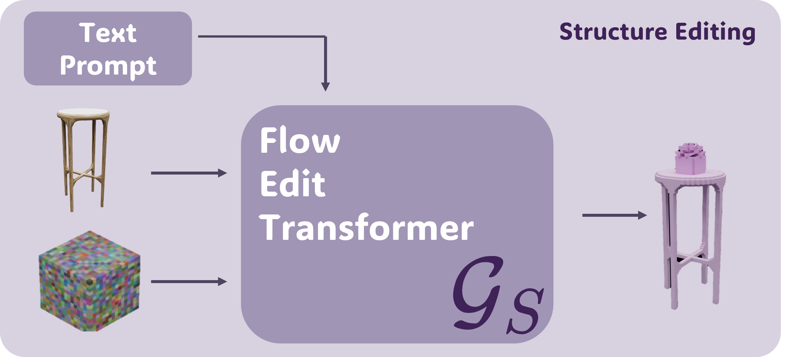

*原文 Figure 3：Figure 4 : Overview of our method. Structure Editing: The Flow Edit Transformer modifies the input 3D asset’s sparse structure based on a text prompt and a render image from original 3D asset. Structured Latent Editing: The Sparse Flow Edit Transformer enables fine-grained material and texture modifications. [查看图片来源](https://arxiv.org/html/2604.13688v1/imgs/gs.png)*

引用来源：arxiv_2608.02711

链接：[arXiv](https://arxiv.org/abs/2604.13688)

### 背景与上下文工作

#### 背景类别：背景与上下文（context）

##### 2017

##### Neural Discrete Representation Learning

作者：Aäron van den Oord, O. Vinyals, K. Kavukcuoglu

研究角色：背景与上下文工作
任务标签：context

中文简介：

该论文提出VQ-VAE模型，解决无监督离散表示学习任务，输入为连续数据，输出为离散潜变量代码。核心方法结合向量量化技术，使编码器输出离散而非连续的编码，并学习动态先验分布，有效避免了传统VAE中的后验崩溃问题。虽然原应用于图像与语音，但其离散化思想被广泛引入三维领域，用于构建三维原生潜空间或网格词元化，是实现高效自回归三维生成的关键基础架构，属于三维原生潜空间技术的理论基石。

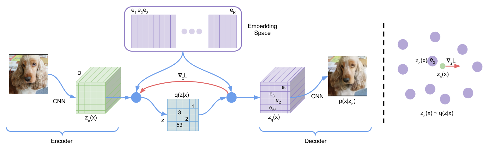

*原文 Figure 1：Figure 1: Left: A figure describing the VQ-VAE. Right: Visualisation of the embedding space. The output of the encoder z ⁡ ( x ) z(x) is mapped to the nearest point e 2 e_{2} . The gradient ∇ z L \nabla_{z}L (in red) will push the encoder to change its output, which could alter the configuration in the next forward pass. [查看图片来源](https://arxiv.org/html/1711.00937v2/figures/Figure1_9.png)*

引用来源：arxiv_2608.02711

链接：[arXiv](https://arxiv.org/abs/1711.00937)

##### 2018

##### PartNet: A Large-Scale Benchmark for Fine-Grained and Hierarchical Part-Level 3D Object Understanding

作者：Kaichun Mo, Shilin Zhu, Angel X. Chang, L. Yi, Subarna Tripathi, L. Guibas, Hao Su

研究角色：背景与上下文工作
任务标签：context

中文简介：

该论文发布PartNet数据集，旨在推动细粒度及层级化三维部件理解任务，输入为3D物体模型，输出为语义部件标签及层级结构。核心贡献在于构建了大规模、具有一致性标注的基准数据集，涵盖多种物体类别及实例级部件信息。它确立了细粒度语义分割、层级分割及实例分割三大基准任务，为评估3D深度学习算法在部件识别上的性能提供了标准。作为基础资源型工作，它为后续部件结构化生成与理解研究奠定了数据基础。

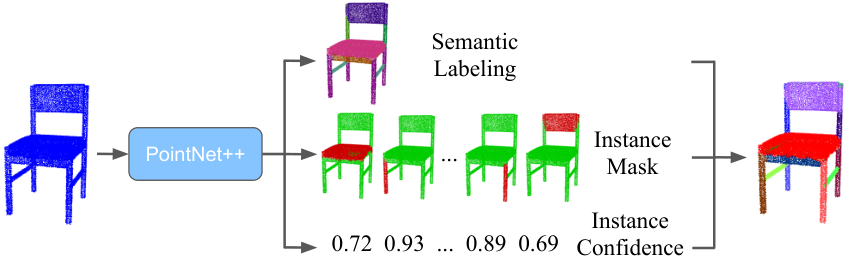

*原文 Figure 6：Figure 6 : The proposed detection-by-segmentation method for instance segmentation. The network learns to predict three components: the semantic label for each point, a set of disjoint instance masks and their confidence scores for part instances. [查看图片来源](https://arxiv.org/html/1812.02713v1/ins_seg_arch.png)*

引用来源：arxiv_2608.02711

链接：[arXiv](https://arxiv.org/abs/1812.02713)

##### 2022

##### DreamFusion: Text-to-3D using 2D Diffusion

作者：Ben Poole, Ajay Jain, J. Barron, B. Mildenhall

研究角色：背景与上下文工作
任务标签：context

中文简介：

该论文解决无3D训练数据下的文本到三维合成任务，输入为文本，输出为神经辐射场（NeRF）。核心方法提出概率密度蒸馏损失，将预训练的2D文本到图像扩散模型作为先验，通过梯度下降优化随机初始化的3D表示，使其多视角渲染符合2D扩散分布。该方法开创了利用2D先验进行3D生成的路线，无需修改图像模型或依赖3D数据集，是后续众多基于分数的3D生成工作的奠基之作，属于实例级优化类别。

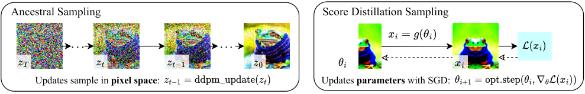

*原文 Figure 22：Figure 2: Comparison of 2D sampling methods from a text-to-image diffusion model with text “ a photo of a tree frog wearing a sweater .” For score distillation sampling, as an example we use an image generator that restricts images to be symmetric by having 𝐱 = ( flip ​ ( θ ) , θ ) \mathbf{x}=(\text{flip}(\theta),\theta) . [查看图片来源](https://arxiv.org/html/2209.14988v1/sampling_schematic_barronfont.png)*

引用来源：arxiv_2608.02711

链接：[arXiv](https://arxiv.org/abs/2209.14988)

##### Magic3D: High-Resolution Text-to-3D Content Creation

作者：Chen-Hsuan Lin, Jun Gao, Luming Tang, Towaki Takikawa, Xiaohui Zeng, Xun Huang, Karsten Kreis, S. Fidler, Ming-Yu Liu, Tsung-Yi Lin

研究角色：背景与上下文工作
任务标签：context

中文简介：

该论文解决文本到高分辨率三维网格生成的任务，输入为文本提示，输出为带纹理的3D Mesh。核心方法采用两阶段优化范式：首先利用低分辨率扩散先验和稀疏哈希网格加速获得粗模型，随后初始化可微渲染器与高分辨率潜在扩散模型交互，进一步优化精细网格。作为DreamFusion的改进工作，它通过引入高分辨率监督显著提升了生成质量与速度，解决了前序方法优化缓慢且分辨率低的问题，属于实例级优化的典型代表。

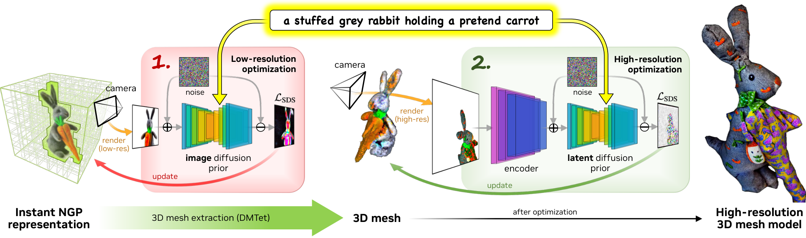

*原文 Figure 2：Figure 2 : Overview of Magic3D. We generate high-resolution 3D content from an input text prompt in a coarse-to-fine manner. In the first stage, we utilize a low-resolution diffusion prior and optimize neural field representations (color, density, and normal fields) to obtain the coarse model. We further differentiably extract textured 3D mesh from the density and color fields of the coarse model. Then we fine-tune it using a high-resolution latent diffusion model. After optimization, our model generates high-quality 3D meshes with detailed textures. [查看图片来源](https://arxiv.org/html/2211.10440v2/x1.png)*

引用来源：arxiv_2608.02711

链接：[arXiv](https://arxiv.org/abs/2211.10440)

##### 2023

##### 3DShape2VecSet: A 3D Shape Representation for Neural Fields and Generative Diffusion Models

作者：Biao Zhang, Jiapeng Tang, M. Nießner, Peter Wonka

研究角色：背景与上下文工作
任务标签：context

中文简介：

3DShape2VecSet提出一种专为神经场和生成扩散模型设计的3D形状表示方法。它将3D形状（表面模型或点云）编码为一组向量上的神经场，结合径向基函数与注意力机制，使其特别适合Transformer处理。该表示支持无条件、类别条件、文本及图像条件生成等多种应用。区别于传统网格或体素表示，它属于三维原生潜空间类别的前置技术，通过提供更适合生成模型的连续且结构化的表示，提升了3D形状编码与生成的性能。

*原文 Figure 2：Figure 3 . Shape autoencoding pipeline. Given a 3D ground-truth surface mesh as the input, we first sample a point cloud that is mapped to positional embeddings and encode them into a set of latent codes through a cross-attention module ( Sec. 5.1 ). Next, we perform (optional) compression and KL-regularization in the latent space to obtain structured and compact latent shape representations ( Sec. 5.2 ). Finally, the self-attention is carried out to aggregate and exchange the information within the latent set. And a cross-attention module is designed to calculate the interpolation weights of query points. The interpolated feature vectors are fed into a fully connected layer for occupancy prediction ( Sec. 5.3 ). [查看图片来源](https://arxiv.org/html/2301.11445v3/images/pipeline/pipeline-input.png)*

引用来源：arxiv_2608.02711

链接：[arXiv](https://arxiv.org/abs/2301.11445)

##### LLaMA: Open and Efficient Foundation Language Models

作者：Hugo Touvron, Thibaut Lavril, Gautier Izacard, X. Martinet, M. Lachaux, Timothée Lacroix, Baptiste Rozière, Naman Goyal, Eric Hambro, Faisal Azhar, Aurélien Rodriguez, Armand Joulin, Edouard Grave, Guillaume Lample

研究角色：背景与上下文工作
任务标签：context

中文简介：

LLaMA是一系列基础语言模型，参数量从7B到65B不等，仅在公开数据集上训练。其核心贡献在于证明了使用公开数据即可训练出媲美或超越专有模型的性能，如LLaMA-13B优于GPT-3。虽然LLaMA本身不直接处理3D数据，但作为高效的基础语言模型，它为后续多模态大模型（如PointLLM）提供了强大的语言理解和推理主干。在统一多模态模型架构中，LLaMA类模型常作为文本编码器或决策核心，支撑跨模态交互能力。

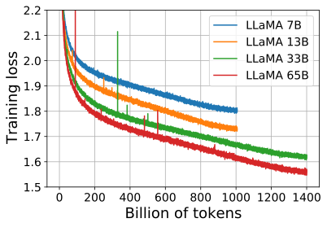

*原文 Figure 1：Figure 1: Training loss over train tokens for the 7B, 13B, 33B, and 65 models. LLaMA-33B and LLaMA-65B were trained on 1.4T tokens. The smaller models were trained on 1.0T tokens. All models are trained with a batch size of 4M tokens. [查看图片来源](https://arxiv.org/html/2302.13971v1/train_loss.svg)*

引用来源：arxiv_2608.02711

链接：[arXiv](https://arxiv.org/abs/2302.13971)

##### Fantasia3D: Disentangling Geometry and Appearance for High-quality Text-to-3D Content Creation

作者：Rui Chen, Y. Chen, Ningxin Jiao, K. Jia

研究角色：背景与上下文工作
任务标签：context

中文简介：

Fantasia3D解决高质量文本到3D内容创建任务，旨在解耦几何与外观。针对现有隐式表示耦合几何与外观导致细节不足的问题，它采用混合场景表示，将表面法线作为图像扩散模型的输入以学习几何，并引入空间变化的BRDF学习表面材质以实现逼真渲染。这种解耦框架不仅提升了生成质量，还兼容图形引擎，支持重光照和编辑。区别于端到端黑盒生成，它属于实例级优化路线，强调物理属性的显式建模与分离。

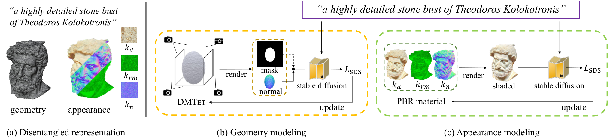

*原文 Figure 3：Figure 3: Overview of our method. Our method can generate disentangled geometry and appearance given a text prompt (cf. figure (a)), which are produced by (b) geometry modeling and (c) appearance modeling, respectively. (b) We employ DMTet as our 3D geometry representation, which is initialized as a 3D ellipsoid here. To optimize the parameters of DMTet , we render the normal map (and the object mask in the early training phase) of the extracted mesh from DMTet as the shape encoding of stable diffusion [ 35 , 40 ] . (c) For appearance modeling, we introduce the spatially-varying Bidirectional Reflectance Distribution Function (BRDF) modeling into text-to-3D generation, and learn to predict three components (namely, k d k_{d} , k r ​ m k_{rm} , and k n k_{n} ) of the appearance. Both geometry and appearance modeling are supervised by Score Distillation Sampling (SDS) loss [ 33 ] . [查看图片来源](https://arxiv.org/html/2303.13873v3/pipeline2.png)*

引用来源：arxiv_2608.02711

链接：[arXiv](https://arxiv.org/abs/2303.13873)

##### Instruct-NeRF2NeRF: Editing 3D Scenes with Instructions

作者：Ayaan Haque, Matthew Tancik, Alexei A. Efros, Aleksander Holynski, Angjoo Kanazawa

研究角色：背景与上下文工作
任务标签：context

中文简介：

Instruct-NeRF2NeRF解决使用文本指令编辑NeRF场景的任务。输入为原始NeRF及其重建图像集合，输出为编辑后的3D场景。核心方法是利用图像条件扩散模型 (InstructPix2Pix) 迭代编辑输入图像，同时优化底层NeRF场景以保持一致性。该方法能处理大规模真实世界场景，实现更真实、有针对性的编辑。与前序全局优化方法不同，它通过逐图编辑与3D优化的闭环，属于三维资产编辑类别，特别适用于基于指令的局部语义修改。

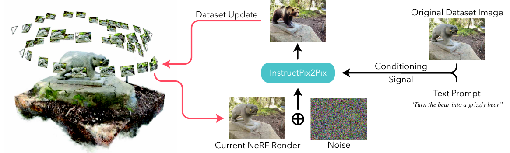

*原文 Figure 1：Figure 2: Overview : Our method gradually updates a reconstructed NeRF scene by iteratively updating the dataset images while training the NeRF: (1) an image is rendered from the scene at a training viewpoint, (2) it is edited by InstructPix2Pix given a global text instruction, (3) the training dataset image is replaced with the edited image, and (4) the NeRF continues training as usual. [查看图片来源](https://arxiv.org/html/2303.12789v2/pipeline.png)*

引用来源：arxiv_2608.02711

链接：[arXiv](https://arxiv.org/abs/2303.12789)

##### ProlificDreamer: High-Fidelity and Diverse Text-to-3D Generation with Variational Score Distillation

作者：Zhengyi Wang, Cheng Lu, Yikai Wang, Fan Bao, Chongxuan Li, Hang Su, Jun Zhu

研究角色：背景与上下文工作
任务标签：context

中文简介：

ProlificDreamer解决高保真、多样化的文本到3D生成任务。针对现有Score Distillation Sampling (SDS) 存在的过饱和、过平滑和低多样性问题，它提出变分分数蒸馏 (VSD)。核心方法是将3D参数建模为随机变量而非常数，通过粒子-based变分框架进行优化。VSD是SDS的广义形式，能在各种CFG权重下工作并提升样本质量。该方法属于实例级优化类别，通过改进蒸馏算法本身，显著提升了NeRF和Mesh生成的细节丰富度与真实感。

*原文 Figure 4：Figure 2: Overview of VSD. The 3D representation is differentiably rendered at a random pose c c . The rendered image is sent to the pretrained diffusion and the score of the variational distribution (estimated by LoRA) to compute the gradient of VSD. LoRA is also updated on the rendered image. [查看图片来源](https://arxiv.org/html/2305.16213v2/diagram.png)*

引用来源：arxiv_2608.02711

链接：[arXiv](https://arxiv.org/abs/2305.16213)

##### Michelangelo: Conditional 3D Shape Generation based on Shape-Image-Text Aligned Latent Representation

作者：Zibo Zhao, Wen Liu, Xin Chen, Xianfang Zeng, Rui Wang, Pei Cheng, Bin Fu, Tao Chen, Gang Yu, Shenghua Gao

研究角色：背景与上下文工作
任务标签：context

中文简介：

Michelangelo解决基于文本或图像条件生成通用3D形状的任务。其核心范式是“先对齐后生成”，通过SITA-VAE将3D形状编码到与图像、文本对齐的潜空间，再利用条件扩散模型在该潜空间中进行生成。这种方法 bridging 了2D/文本与3D之间的域差距。区别于直接跨模态生成的方法，它通过对齐潜空间确保了生成结果与条件输入的语义一致性，属于三维原生潜空间类别，强调了模态间表示的对齐重要性。

*原文 Figure 1：Figure 2 : Alignment-before-generation pipeline . Our method contains two models: the Shape-Image-Text-Aligned Variational Auto-Encoder (SITA-VAE) and the Aligned Shape Latent Diffusion Model (ASLDM). The SITA-VAE consists of four modules: an image encoder, a text encoder, a 3D shape encoder, and a 3D shape decoder. Encoders encode inputs pair into an aligned space, and the 3D shape decoder reconstructs 3D shapes given embeddings from the aligned space. The ASLDM maps the image or text condition to the aligned shape latent space for sampling a high-quality 3D shape embedding, which latterly reconstructed to high-fidelity 3D shapes by the 3D shape decoder. [查看图片来源](https://arxiv.org/html/2306.17115v2/newnetwork.png)*

引用来源：arxiv_2608.02711

链接：[arXiv](https://arxiv.org/abs/2306.17115)

##### MVDream: Multi-view Diffusion for 3D Generation

作者：Yichun Shi, Peng Wang, Jianglong Ye, M. Long, Kejie Li, X. Yang

研究角色：背景与上下文工作
任务标签：context

中文简介：

MVDream解决从文本生成一致多视图图像的任务，进而辅助3D生成。其核心方法是训练一个多视图扩散模型，同时学习2D和3D数据，使其兼具2D模型的泛化性与3D渲染的一致性。该模型作为通用的3D先验，通过Score Distillation Sampling应用于3D生成，显著提升了现有2D提升方法的稳定性。与前序单视图方法不同，它隐式地建模了3D结构，解决了多视角不一致问题，属于多视图2D投影融合类别的关键进展。

*原文 Figure 2：Figure 2: Illustration of the multi-view diffusion model. We keep the structure of text-to-image UNets by making two slight changes: (1) changing the self-attention from 2D to 3D for cross-view connection (2) adding camera embeddings for each view. Multi-view renderings are used to train the diffusion model. During testing, the pipeline is used in a reverse way: the multi-view diffusion model serves as 3D prior to optimize the 3D representation via Score Distillation Sampling (SDS). [查看图片来源](https://arxiv.org/html/2308.16512v4/architecture_v2.png)*

引用来源：arxiv_2608.02711

链接：[arXiv](https://arxiv.org/abs/2308.16512)

##### PointLLM: Empowering Large Language Models to Understand Point Clouds

作者：Runsen Xu, Xiaolong Wang, Tai Wang, Yilun Chen, Jiangmiao Pang, Da-Hua Lin

研究角色：背景与上下文工作
任务标签：context

中文简介：

PointLLM解决点云理解任务，输入彩色物体点云与人类指令，输出符合语境的文本响应。其核心范式是利用点云编码器提取几何与外观特征，将其映射至大型语言模型的语义空间，通过两阶段训练实现模态对齐与指令微调。作为早期探索工作，它填补了LLM在3D理解领域的空白，区别于传统仅处理2D视觉数据的方法，为统一多模态模型中的三维场景理解模块提供了基础架构参考。

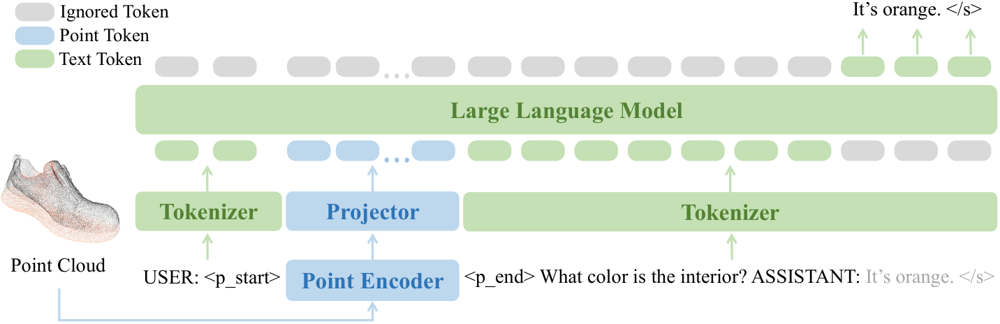

*原文 Figure 2：Figure 2 : An overview of PointLLM. The point encoder extracts features from the input point cloud and the projector projects them to the latent space of the LLM backbone. The LLM backbone processes sequences of point and text tokens and generates the predicted tokens as the output. [查看图片来源](https://arxiv.org/html/2308.16911v3/main_figure_eccv.png)*

引用来源：arxiv_2608.02711

链接：[arXiv](https://arxiv.org/abs/2308.16911)

##### DreamGaussian: Generative Gaussian Splatting for Efficient 3D Content Creation

作者：Jiaxiang Tang, Jiawei Ren, Hang Zhou, Ziwei Liu, Gang Zeng

研究角色：背景与上下文工作
任务标签：context

中文简介：

DreamGaussian解决基于优化的3D内容生成速度慢的问题，输入为单视图图像或文本，输出为带纹理的3D网格。核心洞察是利用3D高斯泼溅的快速收敛特性替代神经辐射场，通过渐进式致密化加速生成，并配套高效的网格提取与UV空间纹理细化算法。属于“三维资产生成”类别，它通过改变底层表示形式，将生成时间从数十分钟缩短至两分钟，显著提升了实用性与下游应用的兼容性，是高效生成路线的代表性工作。

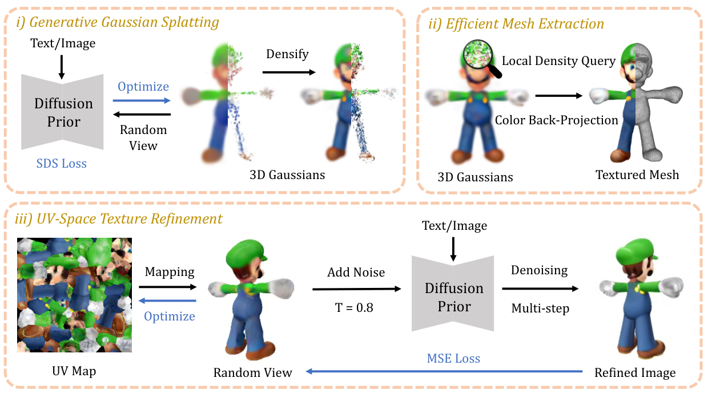

*原文 Figure 1：Figure 2: DreamGaussian Framework . 3D Gaussians are used for efficient initialization of geometry and appearance using single-step SDS loss. We then extract a textured mesh and refine the texture image with a multi-step MSE loss. [查看图片来源](https://arxiv.org/html/2309.16653v2/framework.png)*

引用来源：arxiv_2608.02711

链接：[arXiv](https://arxiv.org/abs/2309.16653)

##### GaussianDreamer: Fast Generation from Text to 3D Gaussians by Bridging 2D and 3D Diffusion Models

作者：Taoran Yi, Jiemin Fang, Junjie Wang, Guanjun Wu, Lingxi Xie, Xiaopeng Zhang, Wenyu Liu, Qi Tian, Xinggang Wang

研究角色：背景与上下文工作
任务标签：context

中文简介：

GaussianDreamer旨在快速生成高质量3D高斯泼溅资产，输入为文本提示，输出为3D高斯表示。核心方法桥接了2D与3D扩散模型：利用3D扩散模型提供初始化先验以保证几何一致性，再利用2D扩散模型丰富几何细节与外观，并通过噪声点生长和颜色扰动增强初始化效果。属于“三维资产生成”类别，它结合了3D模型的结构优势与2D模型的泛化能力，相比纯优化方法大幅缩短了生成时间，实现了效率与质量的平衡。

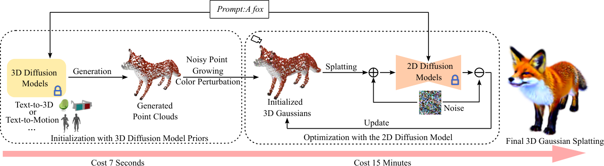

*原文 Figure 1：Figure 2 : Overall framework of GaussianDreamer. Firstly, we utilize a 3D diffusion model to generate the initialized point clouds. After executing noisy point growing and color perturbation on the point clouds, we use them to initialize the 3D Gaussians. The initialized 3D Gaussians are further optimized using the SDS method [ 55 ] with a 2D diffusion model. Finally, we render the image using the 3D Gaussians by employing 3D Gaussian Splatting [ 26 ] . We can use one of various 3D diffusion models to generate the initialized point clouds. In this case, we take text-to-3D and text-to-motion diffusion models as examples. [查看图片来源](https://arxiv.org/html/2310.08529v3/pipline11.png)*

引用来源：arxiv_2608.02711

链接：[arXiv](https://arxiv.org/abs/2310.08529)

##### RichDreamer: A Generalizable Normal-Depth Diffusion Model for Detail Richness in Text-to-3D

作者：Lingteng Qiu, Guanying Chen, Xiaodong Gu, Qi Zuo, Mutian Xu, Yushuang Wu, Weihao Yuan, Zilong Dong, Liefeng Bo, Xiaoguang Han

研究角色：背景与上下文工作
任务标签：context

中文简介：

RichDreamer解决文本到3D生成中细节缺失及光照材质纠缠的问题，输入为文本，输出为富含细节的3D资产。核心方法是训练一个通用的法线-深度扩散模型，替代直接使用RGB扩散模型优化法线，并引入反照率扩散模型约束材质成分，以解耦光照影响。属于“三维资产生成”中的相邻工作或优化组件，它通过引入专门的几何与材质先验，显著提升了生成资产的细节丰富度，克服了现有SDS方法在几何建模上的分布偏差。

*原文 Figure 1：Figure 2 : Overview of the proposed RichDreamer . We introduce a generalizable Normal-Depth diffusion model that is trained on the LAION-2B dataset with normal and depth predicted by Midas [ 59 ] , followed by fine-tuning on the synthetic dataset. Our model can be incorporated with the DMTet and NeRF representations to enhance the geometry generation. To alleviate the ambiguity in appearance modeling, we propose an albedo diffusion model to impose data-drive prior on the albedo component. [查看图片来源](https://arxiv.org/html/2311.16918v2/pipeline.png)*

引用来源：arxiv_2608.02711

链接：[arXiv](https://arxiv.org/abs/2311.16918)

##### GPT4Point: A Unified Framework for Point-Language Understanding and Generation

作者：Zhangyang Qi, Ye Fang, Zeyi Sun, Xiaoyang Wu, Tong Wu, Jiaqi Wang, Dahua Lin, Hengshuang Zhao

研究角色：背景与上下文工作
任务标签：context

中文简介：

GPT4Point旨在统一三维物体的理解与生成任务，输入为点云与文本，输出涵盖 caption、问答答案及可控生成的3D点云。核心方法是构建点-语言多模态大模型，利用Pyramid-XL大规模数据集进行训练，实现从低质量特征中恢复几何与颜色。作为“统一多模态模型”，它填补了MLLM在3D领域的空白，不仅支持双向的点-文本交互，还具备生成能力，区别于单一功能的理解或生成模型，实现了模态间的深度统一。

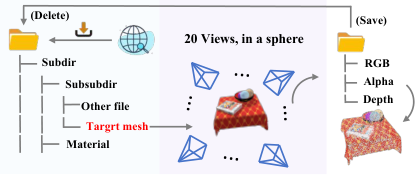

*原文 Figure 8：Figure S3 : Acquire Data Pipeline from Objaverse-XL [ 11 ] . [查看图片来源](https://arxiv.org/html/2312.02980v2/sup_fig3_objaversexl_pipeline.png)*

引用来源：arxiv_2608.02711

链接：[arXiv](https://arxiv.org/abs/2312.02980)

##### Shap-Editor: Instruction-guided Latent 3D Editing in Seconds

作者：Minghao Chen, Junyu Xie, Iro Laina, A. Vedaldi

研究角色：背景与上下文工作
任务标签：context

中文简介：

Shap-Editor致力于解决3D编辑效率低下的问题，输入为3D资产和编辑指令，输出为编辑后的3D对象。核心范式是摒弃耗时的测试时优化，转而利用Shap-E的潜空间，训练一个前馈编辑网络直接在该潜空间中进行操作，实现秒级编辑。属于“三维资产编辑”类别，它与依赖3D蒸馏的传统方法形成鲜明对比，通过隐式潜空间映射实现了高效的前馈推理，在保持泛化能力的同时大幅降低了计算成本。

*原文 Figure 7：Figure 8 : Additional visualisations. We apply different editing instructions (including both global and local edits) across various instances, also demonstrating the generalisability of our method to multiple unseen categories. [查看图片来源](https://arxiv.org/html/2312.09246v1/additional_results_sup.png)*

引用来源：arxiv_2608.02711

链接：[arXiv](https://arxiv.org/abs/2312.09246)

##### 2024

##### Consistent3D: Towards Consistent High-Fidelity Text-to-3D Generation with Deterministic Sampling Prior

作者：Zike Wu, Pan Zhou, Xuanyu Yi, Xiaoding Yuan, Hanwang Zhang

研究角色：背景与上下文工作
任务标签：context

中文简介：

Consistent3D针对文本到3D生成中的几何崩溃和纹理不佳问题，输入为文本提示，输出为高质量3D资产。核心方法分析了分数蒸馏采样（SDS）的随机性缺陷，提出利用常微分方程（ODE）的确定性采样先验替代随机微分方程轨迹，通过一致性蒸馏损失将确定性先验融入3D模型优化。该方法归属于“实例级优化”类别，通过改进优化过程中的引导信号，显著提升了生成结果的保真度与一致性，解决了传统SDS方法的不稳定性。

*原文 Figure 2：Figure 3 : Overview of CDS. In each training iteration, the rendered image is perturbed by a fixed noise and then served as a start point of the deterministic flow for computing the CDS loss. [查看图片来源](https://arxiv.org/html/2401.09050v2/framework.png)*

引用来源：arxiv_2608.02711

链接：[arXiv](https://arxiv.org/abs/2401.09050)

##### TIP-Editor: An Accurate 3D Editor Following Both Text-Prompts And Image-Prompts

作者：Jingyu Zhuang, Di Kang, Yanpei Cao, Guanbin Li, Liang Lin, Ying Shan

研究角色：背景与上下文工作
任务标签：context

中文简介：

TIP-Editor解决三维场景的精确编辑任务，输入包括文本提示、参考图像及指定编辑区域的3D边界框，输出为修改后的3D高斯泼溅资产。核心方法采用逐步2D个性化策略，引入定位损失以确保对象放置准确，并利用3D高斯泼溅的显式表示实现局部编辑且保持背景不变。属于“三维资产编辑”类别，它克服了仅依赖文本描述的局限性，通过融合图像先验实现了对外观和位置的细粒度控制，优于传统仅基于文本的编辑方法。

*原文 Figure 2：Figure 2. Method overview. TIP-Editor optimizes a 3D scene that is represented as 3D Gaussian splatting (GS) to conform with a given hybrid text-image prompt. The editing process includes three stages: 1) a stepwise 2D personalization strategy, which features a localization loss in the scene personalization step and a separate novel content personalization step dedicated to the reference image based on LoRA (Sec. 4.1 ); 2) a coarse editing stage using SDS (Sec. 4.2 ); and 3) a pixel-level texture refinement stage, utilizing carefully generated pseudo-GT image from both the rendered image I c I_{c} and the denoised image I c d I_{c}^{d} (Sec. 4.3 ). [查看图片来源](https://arxiv.org/html/2401.14828v3/framework.png)*

引用来源：arxiv_2608.02711

链接：[arXiv](https://arxiv.org/abs/2401.14828)

##### ShapeLLM: Universal 3D Object Understanding for Embodied Interaction

作者：Zekun Qi, Runpei Dong, Shaochen Zhang, Haoran Geng, Chunrui Han, Zheng Ge, Li Yi, Kaisheng Ma

研究角色：背景与上下文工作
任务标签：context

中文简介：

ShapeLLM旨在解决具身交互场景下的通用三维物体理解任务，输入为三维点云与语言指令，输出为语义描述或操作计划。其核心范式是将增强的3D编码器ReCon++与大语言模型结合，通过多视图图像蒸馏提升几何感知能力，并在指令跟随数据上进行训练。作为“三维场景理解”类工作，它区别于纯生成模型，专注于构建统一的3D-语言多模态大模型，为后续的生成与编辑提供深层的语义接地与几何理解基础。

*原文 Figure 1：Figure 2 : Overview of our ShapeLLM framework . (a) The introduced ReCon ++ pipeline incorporates the required 3D encoder. (b) The comprehensive design of the MLLM, featuring an instruction-mode tokenizer and the integration of an aligned multi-modal representation, equips the MLLM with the capability to effectively handle 3D vision language tasks. [查看图片来源](https://arxiv.org/html/2402.17766v3/framework.png)*

引用来源：arxiv_2608.02711

链接：[arXiv](https://arxiv.org/abs/2402.17766)

##### DreamReward: Text-to-3D Generation with Human Preference

作者：Junliang Ye, Fang-Fu Liu, Qi-Xiu Li, Zhengyi Wang, Yikai Wang, Xinzhou Wang, Yue-Qi Duan, Jun Zhu

研究角色：背景与上下文工作
任务标签：context

中文简介：

DreamReward解决文本到三维生成结果与人类偏好不一致的问题，输入文本提示，输出符合人类审美的高质量三维资产。核心范式属于实例级优化，通过构建人类偏好奖励模型Reward3D，并利用DreamFL算法对多视图扩散模型进行直接调优。区别于仅依赖预训练先验的方法，它引入专家对比数据学习奖励信号，在推理或微调阶段优化生成分布，显著提升了生成结果的提示对齐度和视觉保真度。

*原文 Figure 1：Figure 1 : The overall framework of our DreamReward . ( Top ) Reward3D involves data collection, annotation, and preference learning. ( Bottom ) DreamFL utilizes feedback from Reward3D to compute RewardLoss and incorporate it into the SDS loss for simultaneous optimization of NeRF. [查看图片来源](https://arxiv.org/html/2403.14613v1/pipeline.png)*

引用来源：arxiv_2608.02711

链接：[arXiv](https://arxiv.org/abs/2403.14613)

##### Frankenstein: Generating Semantic-Compositional 3D Scenes in One Tri-Plane

作者：Han Yan, Yang Li, Zhennan Wu, Shenzhou Chen, Weixuan Sun, Taizhang Shang, Weizhe Liu, Tian Chen, Xiaqiang Dai, Chao Ma, Hongdong Li, Pan Ji

研究角色：背景与上下文工作
任务标签：context

中文简介：

Frankenstein旨在生成具有语义组合性的三维场景，输入场景描述，输出包含多个分离语义部件的三维资产。其核心范式属于部件结构化生成，利用单个三平面张量编码场景信息，并通过解码得到多个独立的SDF场以表示不同部件。区别于生成单一统一形状的传统方法，Frankenstein在单次扩散过程中同时生成语义分离的部件（如房间内的家具或人体部位），便于后续进行部件级重纹理或对象重排等下游应用。

*原文 Figure 1：Figure 1. We present Frankenstein, a tri-plane diffusion-based framework that can generate semantic-compositional 3D scenes in a single forward pass, e.g., rooms (left) and avatars (right). The generated scenes enable customized controls, such as part-wise texturing, and room object rearrangement or avatar cloth re-targeting. [查看图片来源](https://arxiv.org/html/2403.16210v2/imgs/teaser6.jpg)*

引用来源：arxiv_2608.02711

链接：[arXiv](https://arxiv.org/abs/2403.16210)

##### Generic 3D Diffusion Adapter Using Controlled Multi-View Editing

作者：Hansheng Chen, Ruoxi Shi, Yulin Liu, Bokui Shen, Jiayuan Gu, Gordon Wetzstein, Hao Su, Leonidas J. Guibas

研究角色：背景与上下文工作
任务标签：context

中文简介：

MVEdit提出一种通用的三维扩散适配器，输入文本或图像，输出高质量纹理网格。核心范式属于多视图2D投影融合，作为SDEdit的三维对应物，它利用无训练的3D Adapter将上一时间步的2D视图提升为一致三维表示，并以此约束下一时间步的2D去噪。区别于得分蒸馏采样（SDS），该方法在保持2D扩散模型视觉质量的同时确保三维一致性，且推理速度更快，支持文生3D、图生3D及三维编辑等多种任务。

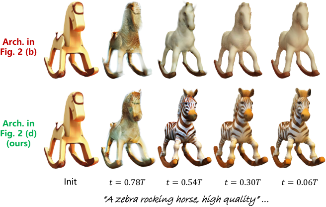

*原文 Figure 3：Figure 3. Comparison between the two architectures , based on the text-guided 3D-to-3D pipeline with t start = 0.78 ​ T t^{\text{start}}=0.78T . Rendered RGB images x RGB rend x^{\text{rend}}_{\text{RGB}} across different timesteps are shown to visualize the sampling process. [查看图片来源](https://arxiv.org/html/2403.12032v2/ablation_ctrl.png)*

引用来源：arxiv_2608.02711

链接：[arXiv](https://arxiv.org/abs/2403.12032)

##### Make-Your-3D: Fast and Consistent Subject-Driven 3D Content Generation

作者：Fang-Fu Liu, Han-Yang Wang, Weiliang Chen, Haowen Sun, Yue-Qi Duan

研究角色：背景与上下文工作
任务标签：context

中文简介：

Make-Your-3D专注于快速一致的主体驱动三维内容生成，输入单张主体图像和文本描述，输出个性化三维资产。核心范式属于实例级优化，设计协同进化框架，通过对齐多视图扩散模型与身份特定2D生成模型的分布，减少方差。区别于传统微调方法，它通过身份感知优化和主体先验优化相互学习，在5分钟内即可生成高保真且具有一致身份的三维内容，支持未见过的文本驱动修改，实现了高效的主题个性化。

*原文 Figure 2：Figure 3 : The overall framework of our proposed Make-Your-3D. Our framework includes identity-aware optimization of 2D personalized model and subject-prior optimization of multi-view diffusion model to approximate subject distribution. The identity-aware optimization (Sec. 3.3 ) lifts input image to 3D space through a frozen multi-view diffusion model and optimizes the 2D personalized model via multi-views. The subject-prior optimization (Sec. 3.4 ) adopts diverse images from frozen personalized model to infuse the subject-specific prior into the multi-view diffusion model. [查看图片来源](https://arxiv.org/html/2403.09625v1/pipeline.png)*

引用来源：arxiv_2608.02711

链接：[arXiv](https://arxiv.org/abs/2403.09625)

##### Interactive3D: Create What You Want by Interactive 3D Generation

作者：Shaocong Dong, Lihe Ding, Zhanpeng Huang, Zibin Wang, Tianfan Xue, Dan Xu

研究角色：背景与上下文工作
任务标签：context

中文简介：

Interactive3D致力于解决三维生成中用户控制力不足的问题，输入用户交互指令（如拖拽、增删组件），输出修改后的三维资产。核心范式属于三维资产编辑，采用两阶段级联框架：首先在高斯泼溅表示上直接进行几何变形、语义编辑等交互操作，随后通过交互式哈希细化模块转换为InstantNGP并提取几何细节。区别于仅依赖文本或二维参考的方法，它允许用户在生成过程中进行直接的三维空间干预，显著提升了生成的精确性与灵活性。

*原文 Figure 2：Figure 3 : The overall architecture of Interactive3D. It contains two stages with distinct 3D representations: (I) Gaussian Splatting for flexible user interactions such as add/remove parts, geometry transformation, deformable or rigid dragging and semantic editing; (II) the Gaussian blobs are converted to InstantNGP using NeRF distillation and fine-tuned by our Interactive Hash Refinement Module. [查看图片来源](https://arxiv.org/html/2404.16510v1/interactive3D_arc2_final.png)*

引用来源：arxiv_2608.02711

链接：[arXiv](https://arxiv.org/abs/2404.16510)

##### Chameleon: Mixed-Modal Early-Fusion Foundation Models

作者：Chameleon Team, Mingda Chen, Jacob Kahn, Shang-Wen Li

研究角色：背景与上下文工作
任务标签：context

中文简介：

Chameleon提出了一族早期融合的混合模态基础模型，输入任意序列的图像和文本Token，输出对应的理解结果或生成内容。其核心范式为统一多模态模型，采用基于Token的早期融合架构，在同一模型中实现图文理解与生成。虽然主要聚焦二维模态，但其统一的序列化建模范式为多模态交互提供了新思路。区别于晚期融合模型，Chameleon在单一架构下实现了图文任务的State-of-the-art性能，展示了全模态文档统一建模的潜力。

*原文 Figure 1：Figure 1: Chameleon represents all modalities — images, text, and code, as discrete tokens and uses a uniform transformer-based architecture that is trained from scratch in an end-to-end fashion on ∼ \sim 10T tokens of interleaved mixed-modal data. As a result, Chameleon can both reason over, as well as generate, arbitrary mixed-modal documents. Text tokens are represented in green and image tokens are represented in blue. [查看图片来源](https://arxiv.org/html/2405.09818v2/intro_image.svg)*

引用来源：arxiv_2608.02711

链接：[arXiv](https://arxiv.org/abs/2405.09818)

##### CraftsMan3D: High-fidelity Mesh Generation with 3D Native Generation and Interactive Geometry Refiner

作者：Wei-Yu Li, Jiarui Liu, Rui Chen, Yixun Liang, Xuelin Chen, Ping Tan, Xiao-Xiao Long

研究角色：背景与上下文工作
任务标签：context

中文简介：

CraftsMan3D专注于高保真三维几何生成及交互式细化，输入文本或参考图像，输出拓扑规则且表面细节丰富的网格。方法上结合三维原生潜空间扩散模型与多视图扩散先验，先生成粗几何，再通过基于法线的几何细化器增强细节，支持自动或用户交互式编辑。相较于传统耗时优化方法，它利用三维原生生成快速获得规则拓扑，并通过独立细化模块解决噪声表面问题，在生成质量与用户可控性之间取得了更好平衡。

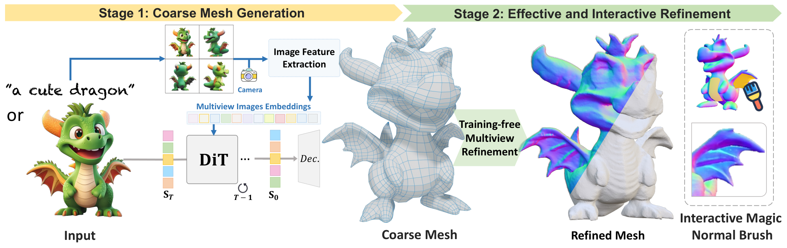

*原文 Figure 3：Figure 4 : Overview of CraftsMan3D. We first using a multi-view diffusion model to generate a multi-view image from the input single image or text prompt. The generated multi-view image is then fed into our Latent Set-based DiT model as conditioning to produce a coarse mesh. Finally, a dedicated refinement module is employed to improve or edit the surface normals of the coarse geometry, enhancing with intricate details. In particular, this refinement module features two key usages, namely the automatic global refinement and interactive magic brush, that contribute to efficient and controllable 3D modeling of high-quality meshes. [查看图片来源](https://arxiv.org/html/2405.14979v4/overview.png)*

引用来源：arxiv_2608.02711

链接：[arXiv](https://arxiv.org/abs/2405.14979)

##### PivotMesh: Generic 3D Mesh Generation via Pivot Vertices Guidance

作者：Haohan Weng, Yikai Wang, Tong Zhang, C. L. Philip Chen, Jun Zhu

研究角色：背景与上下文工作
任务标签：context

中文简介：

PivotMesh旨在解决通用三维网格生成任务，输入为类别标签或隐式条件，输出紧凑且细节清晰的三角网格。其核心范式属于网格词元化与流匹配类别，通过Transformer自编码器将网格分层编码为离散Token，并引入“枢轴顶点”作为粗粒度引导，再由自回归模型生成完整网格Token。区别于以往局限于小数据集的方法，该模型通过降低拓扑建模难度，成功扩展至Objaverse等大规模数据集，实现了可扩展的原生网格分布建模。

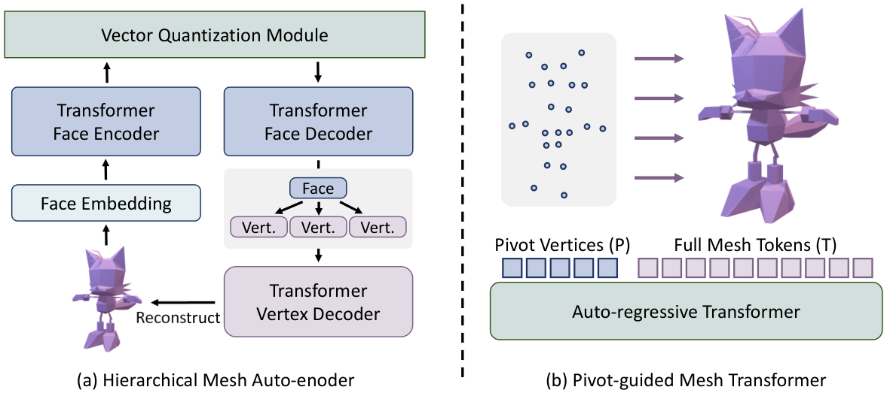

*原文 Figure 2：Figure 2 : The overall method of PivotMesh. (a) Triangle mesh sequences are tokenized into mesh tokens and hierarchically decoded from face level to vertex level via our mesh auto-encoder. (b) The auto-regressive Transformer first learns to generate pivot vertices as coarse mesh representation and then generates the complete mesh tokens in a coarse-to-fine manner. [查看图片来源](https://arxiv.org/html/2405.16890v1/method4.png)*

引用来源：arxiv_2608.02711

链接：[arXiv](https://arxiv.org/abs/2405.16890)

##### CLAY: A Controllable Large-scale Generative Model for Creating High-quality 3D Assets

作者：Longwen Zhang, Ziyu Wang, Qixuan Zhang, Qi-Wei Qiu, Anqi Pang, Haoran Jiang, Wei Yang, Lan Xu, Jingyi Yu

研究角色：背景与上下文工作
任务标签：context

中文简介：

CLAY解决可控高质量3D资产生成任务，输入包括文本、图像及多种3D原语（如体素、点云），输出带有PBR纹理的完整3D几何与材质。核心采用多分辨率VAE与潜空间扩散Transformer（DiT），直接从多样3D几何中提取先验，并配合多视图材料扩散模型生成2K分辨率纹理。作为大规模生成模型，它支持从概念草图到生产级资产的精细控制，属于三维原生潜空间与统一生成模型的结合，强调几何与材质的联合高保真生成。

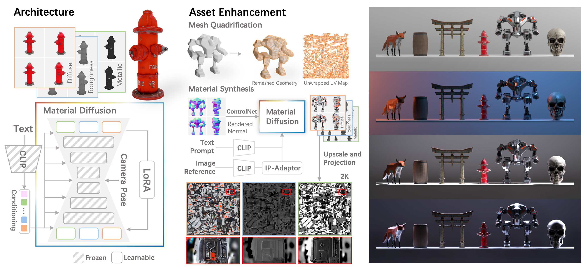

*原文 Figure 5：Figure 5. Our Material Diffusion architecture and Asset Enhancement pipeline. Our Material Diffusion network, derived from existing diffusion models, facilitates efficient fine-tuning. Following mesh quadrification and atlasing, it generates textures through a multi-view approach and subsequently back-projecte them onto UV maps. The resultant materials, closely aligned with geometries and user inputs (text/image), faithfully respond to diverse lighting conditions, culminating in realistic renderings. [查看图片来源](https://arxiv.org/html/2406.13897v1/fig/PBR.png)*

引用来源：arxiv_2608.02711

链接：[arXiv](https://arxiv.org/abs/2406.13897)

##### MeshAnything: Artist-Created Mesh Generation with Autoregressive Transformers

作者：Yiwen Chen, Tong He, Di Huang, Weicai Ye, Sijin Chen, Jiaxiang Tang, Xin Chen, Zhongang Cai, Lei Yang, Gang Yu, Guosheng Lin, Chi Zhang

研究角色：背景与上下文工作
任务标签：context

中文简介：

MeshAnything解决从任意3D表示到艺术家级网格（AMs）的转换任务，输入为各种3D资产，输出稀疏且拓扑优良的生产级网格。核心架构包含VQ-VAE学习网格词汇表，以及形状条件的解码器Transformer进行自回归生成。区别于传统密集面片提取方法，它将网格提取视为生成问题，大幅减少面数并提升渲染效率，同时保持几何精度，属于网格词元化与流匹配类别，旨在桥接生成资产与工业应用间的鸿沟。

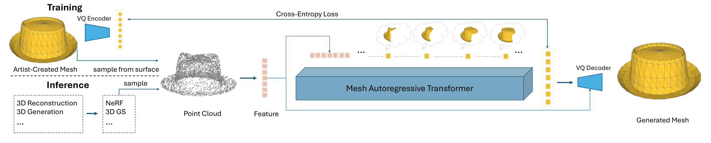

*原文 Figure 5：Figure 4: Pipeline Overview. We introduce MeshAnything, an autoregressive transformer capable of generating Artist-Created Meshes that adhere to given 3D shapes. During training, we inject point clouds features into a decoder-only transformer and supervise it using token sequences derived from the Artist-Created meshes. After training, MeshAnything takes point clouds sampled from various 3D representations as input and generates aligned Artist-Created meshes. [查看图片来源](https://arxiv.org/html/2406.10163v2/pip.png)*

引用来源：arxiv_2608.02711

链接：[arXiv](https://arxiv.org/abs/2406.10163)

##### Tailor3D: Customized 3D Assets Editing and Generation with Dual-Side Images

作者：Zhangyang Qi, Yu-nuo Yang, Mengchen Zhang, Long Xing, Xiaoyang Wu, Tong Wu, Dahua Lin, Xihui Liu, Jiaqi Wang, Hengshuang Zhao

研究角色：背景与上下文工作
任务标签：context

中文简介：

Tailor3D解决定制化3D资产编辑与生成任务，输入为可编辑的双侧图像，输出无缝融合的3D资产。核心流程是先编辑前视图，再通过多视图扩散生成后视图，最后利用双侧LRM和LoRA Triplane Transformer缝合前后特征。区别于多视图编辑中的重叠冲突问题，该方法模拟裁缝工艺，有效解决了视图间不一致性，降低了内存负担，属于结合多视图2D投影融合与三维资产编辑的创新流水线。

*原文 Figure 6：Figure 6 : Model architectures of LRM, Instant3D and Tailor3D. [查看图片来源](https://arxiv.org/html/2407.06191v1/fig_additional_background.png)*

引用来源：arxiv_2608.02711

链接：[arXiv](https://arxiv.org/abs/2407.06191)

##### MeshAnything V2: Artist-Created Mesh Generation with Adjacent Mesh Tokenization

作者：Yiwen Chen, Yikai Wang, Yi-Hao Luo, Zhengyi Wang, Zilong Chen, Jun Zhu, Chi Zhang, Guosheng Lin

研究角色：背景与上下文工作
任务标签：context

中文简介：

MeshAnything V2解决艺术家级网格生成任务，输入为形状条件，输出结构紧凑的高质量3D网格。核心创新在于相邻网格词元化（AMT）方法，通过优化顶点表示将词元序列长度减半，从而提升自回归生成效率。相比前代逐顶点生成方法，该模型在不增加计算成本的情况下将面数限制翻倍，能更精确地对齐指定形状并生成复杂网格，属于网格词元化与流匹配类别中针对表示效率优化的重要进展。

*原文 Figure 1：Figure 1 : Equipped with the newly proposed Adjacent Mesh Tokenization (AMT), MeshAnything V2 significantly surpasses MeshAnything [ 5 ] in both performance and efficiency. MeshAnything V2 generates Artist-Created Meshes (AM) up to 1600 1600 faces aligned with given shapes. Combined with various 3D asset production pipelines, it efficiently achieves high-quality, highly controllable AM generation. [查看图片来源](https://arxiv.org/html/2408.02555v3/teaser.png)*

引用来源：arxiv_2608.02711

链接：[arXiv](https://arxiv.org/abs/2408.02555)

##### MVInpainter: Learning Multi-View Consistent Inpainting to Bridge 2D and 3D Editing

作者：Chenjie Cao, Chaohui Yu, Yanwei Fu, Fan Wang, Xiangyang Xue

研究角色：背景与上下文工作
任务标签：context

中文简介：

MVInpainter解决野外场景的3D编辑任务，输入为多视图图像及参考引导，输出编辑后的多视图一致性结果。核心方法将3D编辑重构为多视图2D修复任务，利用视频先验和注意力机制确保跨视图一致性，并通过槽注意力聚合光流特征以实现无姿态相机控制。区别于依赖精确相机位姿的传统方法，它利用未掩码线索简化了新视图合成难度，属于多视图2D投影融合类别，适用于物体移除、插入等复杂编辑。

*原文 Figure 3：Figure 3 : (a) The overview of the proposed MVInpainter. MVInpainter-O is trained on object-centric data, while MVInpainter-F is trained on forward-facing data with a shared SD-inpainting backbone of different LoRA/motion weights and masking strategies. The object-centric MVInpainter focuses on the object-level NVS, while the forward-facing one is devoted to object removal and scene-level inpainting. (b) The Ref-KV is used in spatial self-attention blocks of denoising U-Net. (c) The slot-attention based flow grouping module is used to learn implicit pose features. Dashed boxes in (b) and (c) mean feature concatenation. [查看图片来源](https://arxiv.org/html/2408.08000v3/overview.png)*

引用来源：arxiv_2608.02711

链接：[arXiv](https://arxiv.org/abs/2408.08000)

##### EdgeRunner: Auto-regressive Auto-encoder for Artistic Mesh Generation

作者：Jiaxiang Tang, Zhaoshuo Li, Zekun Hao, Xian Liu, Gang Zeng, Ming-Yu Liu, Qinsheng Zhang

研究角色：背景与上下文工作
任务标签：context

中文简介：

EdgeRunner解决艺术级网格生成任务，输入为点云或图像条件，输出高达4000面的高质量3D网格。核心提出自回归自编码器（ArAE），通过新颖的词元化算法将变长三角网格压缩为固定长度潜空间，并结合潜扩散模型提升泛化能力。相较于现有自回归方法存在的完整性不足问题，该方法在保持高分辨率细节的同时显著提升了训练效率与生成多样性，属于网格词元化与流匹配类别的改进工作。

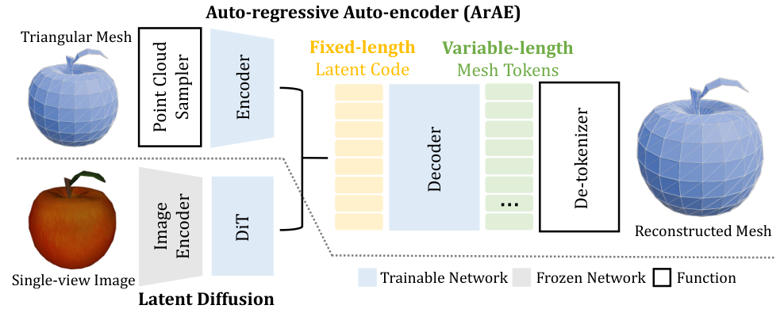

*原文 Figure 1：Figure 2: Pipeline of our method . Our ArAE model compresses variable-length mesh into fixed-length latent code, which can be further used to train latent diffusion models conditioned on other input modalities, such as single-view images. [查看图片来源](https://arxiv.org/html/2409.18114v1/pipe.png)*

引用来源：arxiv_2608.02711

链接：[arXiv](https://arxiv.org/abs/2409.18114)

##### Emu3: Next-Token Prediction is All You Need

作者：Xinlong Wang, Xiaosong Zhang, Zhengxiong Luo, Quan Sun, Yufeng Cui, Jinsheng Wang, Fan Zhang, Yueze Wang, Zhen Li, Qiying Yu, Yingli Zhao, Yulong Ao, Xuebin Min, Tao Li, Boya Wu, Bo Zhao, Bowen Zhang, Lian-zi Wang, Guang Liu, Zheqi He, Xi Yang, Jingjing Liu, Yong-Hua Lin, Tiejun Huang, Zhongyuan Wang

研究角色：背景与上下文工作
任务标签：context

中文简介：

Emu3解决多模态感知与生成任务，输入为图像、文本或视频序列，输出为预测的下一多模态词元。核心范式是将所有模态离散化为词元空间，仅使用下一个词元预测训练单一Transformer架构，摒弃了扩散模型或组合式架构。作为统一多模态模型，它在生成和感知任务上优于SDXL和LLaVA-1.6等专用模型，证明了纯自回归范式在构建通用多模态智能中的潜力，实现了模态间的深度统一。

*原文 Figure 5：Figure 6: DPO improves visual quality and prompt alignment. [查看图片来源](https://arxiv.org/html/2409.18869v1/dpo_vs_qft.svg)*

引用来源：arxiv_2608.02711

链接：[arXiv](https://arxiv.org/abs/2409.18869)

##### The Scene Language: Representing Scenes with Programs, Words, and Embeddings

作者：Yun-Zhi Zhang, Zi-Zhang Li, Matt Zhou, Shangzhe Wu, Jiajun Wu

研究角色：背景与上下文工作
任务标签：context

中文简介：

该工作解决视觉场景的结构化表示与生成任务，输入为文本或图像，输出包含层级结构、语义标签及视觉身份的Scene Language表示。核心方法通过免训练推理从预训练语言模型中提取程序化结构、自然语言词汇及嵌入向量，并结合渲染器生成3D/4D场景。区别于传统场景图，该方法显式建模实体间关系，在保持高保真度的同时支持精确控制与编辑，属于结合理解与生成的统一表示框架。

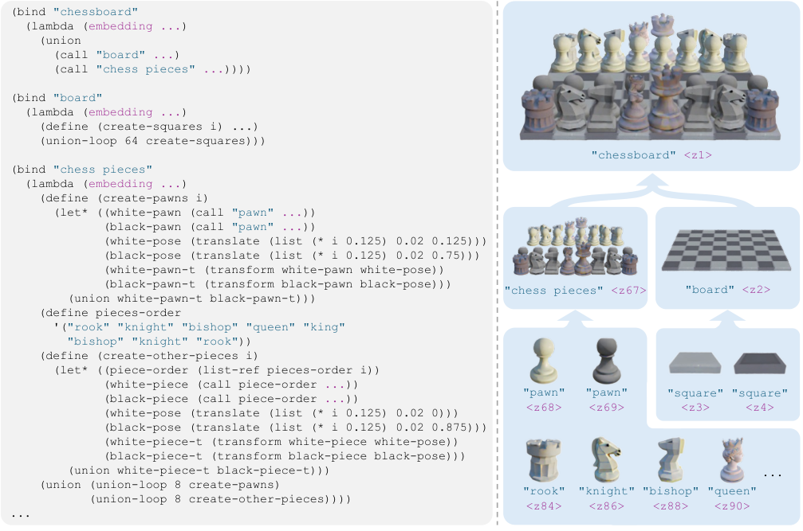

*原文 Figure 1：Figure 2 : Overview. A Scene Language represents a scene with three components: a program consisting of entity functions, a set of words ( e.g . , pawn ) denoting the semantic class of the entity functions, and a list of embeddings ( e.g . , <z1> ) capturing the identity of each entity in the scene. Each entity function is bound with an entity class name given by a word , and maps an input embedding to an output entity of that class. Executing the program evaluates entity functions to compute the full set of entities in the scene. The resulting computation graph, illustrated on the right, captures the dependency structure among entities (indicated by arrows). The program shown is converted from our text-conditioned inference method’s output, with details included in Sec. F.2.1 ; it is written in Lisp-style syntax for brevity and is implemented with Python in practice ( Sec. 3.2 ). [查看图片来源](https://arxiv.org/html/2410.16770v2/representation.png)*

引用来源：arxiv_2608.02711

链接：[arXiv](https://arxiv.org/abs/2410.16770)

##### PhyCAGE: Physically Plausible Compositional 3D Asset Generation from a Single Image

作者：Han Yan, Mingrui Zhang, Yang Li, Chao Ma, Pan Ji

研究角色：背景与上下文工作
任务标签：context

中文简介：

PhyCAGE解决物理合理的组合式3D资产生成任务，输入单张图像，输出符合物理约束的组合3D高斯泼溅。核心先生成组件的多视图图像并拟合3DGS，随后提出物理仿真增强的分数蒸馏采样（PSE-SDS）。区别于纯视觉生成，它将SDS损失梯度设为物理仿真初速度，利用模拟器作为引导优化器逐步修正高斯位置，确保生成部件间物理兼容，实现了从单图到物理合理组合资产的端到端生成。

*原文 Figure 1：Figure 2 : The overview of PhyCAGE. Given an input image, we first generate consistent multi-view images for the components of the assets (see Sec. 4.1 ). Then, we fit multi-view images with 3D Gaussian Splatting representations (see Sec. 4.2 ). Finally, we introduce a Physical Simulation-Enhanced SDS to further optimize the positions of the Gaussians (see Sec. 4.3 ). [查看图片来源](https://arxiv.org/html/2411.18548v1/imgs/method/pipeline3.jpg)*

引用来源：arxiv_2608.02711

链接：[arXiv](https://arxiv.org/abs/2411.18548)

##### Scaling Mesh Generation via Compressive Tokenization

作者：Haohan Weng, Zi-Bo Zhao, Biwen Lei, Xiang-Hui Yang, Jian Liu, Zeqiang Lai, Zhuo Chen, Yu-Hong Liu, Jie Jiang, Chunchao Guo, Tong Zhang, Shenghua Gao, C. L. Philip Chen

研究角色：背景与上下文工作
任务标签：context

中文简介：

该工作解决大规模高面片网格生成任务，输入点云或图像条件，输出超过8K面片的精细Mesh。核心提出块状与补丁化Tokenization（BPT），通过块索引和补丁聚合将序列长度压缩约75%。区别于传统坐标序列方法，BPT解锁了高面片数据的训练潜力，显著增强了几何细节与拓扑准确性。基于此构建的基础生成模型在网格生成上达到SOTA，满足了直接产品级应用对复杂几何结构的需求。

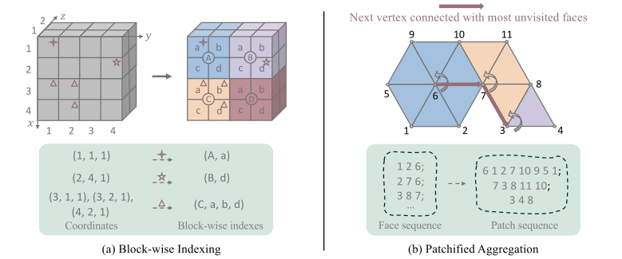

*原文 Figure 2：Figure 3 : The proposed Blocked and Patchified Tokenization (BPT). (a) We convert the coordinates from the Cartesian system to block-wise indexes. The coordinates are first separated equally into several blocks. Then, vertices inside each block are located with 1-dim indexes. (b) The nearby faces are aggregated as patches to compress the mesh sequence. Each patch center is set as the vertex connected with the most unvisited faces. Subsequently, other vertices within the patch are included in the subsequence to create a complete patch. [查看图片来源](https://arxiv.org/html/2411.07025v1/tokenization2.svg)*

引用来源：arxiv_2608.02711

链接：[arXiv](https://arxiv.org/abs/2411.07025)

##### 3D Mesh Editing Using Masked LRMs

作者：William Gao, Dilin Wang, Yuchen Fan, Aljaz Bozic, Tuur Stuyck, Zhengqin Li, Zhao Dong, Rakesh Ranjan, Nikolaos Sarafianos

研究角色：背景与上下文工作
任务标签：context

中文简介：

该论文解决三维网格编辑任务，输入为待编辑3D资产、掩码区域及单视图引导图像，输出修改后的完整网格。核心将编辑形式化为条件重建问题，训练基于掩码的大型重建模型（LRM），利用多视图一致掩码和干净视点信号进行单次前向推理。区别于依赖迭代优化的慢速方法，该方案在保持未编辑区域几何一致性的同时，实现了快速且表达力强的局部几何变更，速度显著优于 prior work。

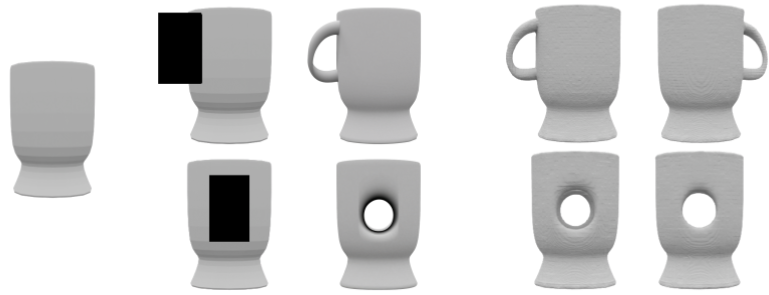

*原文 Figure 4：Figure 4 : Genus changes : Our method unlocks genus-changing edits like adding a handle or a hole to the original vase. We show the output of our model from 2 opposing views in the 3 r ​ d 3^{rd} column. [查看图片来源](https://arxiv.org/html/2412.08641v2/figs/Images/genus_nikos.png)*

引用来源：arxiv_2608.02711

链接：[arXiv](https://arxiv.org/abs/2412.08641)

##### Instant3dit: Multiview Inpainting for Fast Editing of 3D Objects

作者：Amir Barda, Matheus Gadelha, Vladimir G. Kim, Noam Aigerman, Amit H. Bermano, Thibault Groueix

研究角色：背景与上下文工作
任务标签：context

中文简介：

Instant3dit解决快速三维资产编辑任务，输入Mesh/NeRF/GS及编辑意图，输出编辑后的3D对象。核心将3D编辑转化为多视图图像修复问题，利用微调的扩散模型生成多视图一致内容，再通过大型重建模型映射回3D表示。区别于耗时数小时的SDS优化方法，该方案无需迭代优化，仅需约3秒即可完成高质量编辑，通过设计特定的掩码策略模拟用户编辑行为，大幅提升了交互效率。

*原文 Figure 12：Figure 8 : Application: texture editing. Our method can be used to modify texture on a user-selected region. In this case, we run through our NeRF editing pipeline, but only sample colors from the NeRF in the selected region. [查看图片来源](https://arxiv.org/html/2412.00518v1/texturing_experiment.png)*

引用来源：arxiv_2608.02711

链接：[arXiv](https://arxiv.org/abs/2412.00518)

##### Meshtron: High-Fidelity, Artist-Like 3D Mesh Generation at Scale

作者：Zekun Hao, David W. Romero, Tsung-Yi Lin, Ming-Yu Liu

研究角色：背景与上下文工作
任务标签：context

中文简介：

Meshtron解决高保真三维网格生成任务，输入隐含条件，输出高达64K面片、1024级坐标分辨率的精细Mesh。核心采用自回归范式，结合沙漏架构、截断序列训练及滑动窗口推理，有效扩展面片数量与坐标精度。相较于前序方法仅支持低面片数和重度离散化，该模型显著提升了生成资产的几何细节与拓扑一致性，达到艺术家级制作水平，突破了现有方法在复杂物体建模上的分辨率瓶颈。

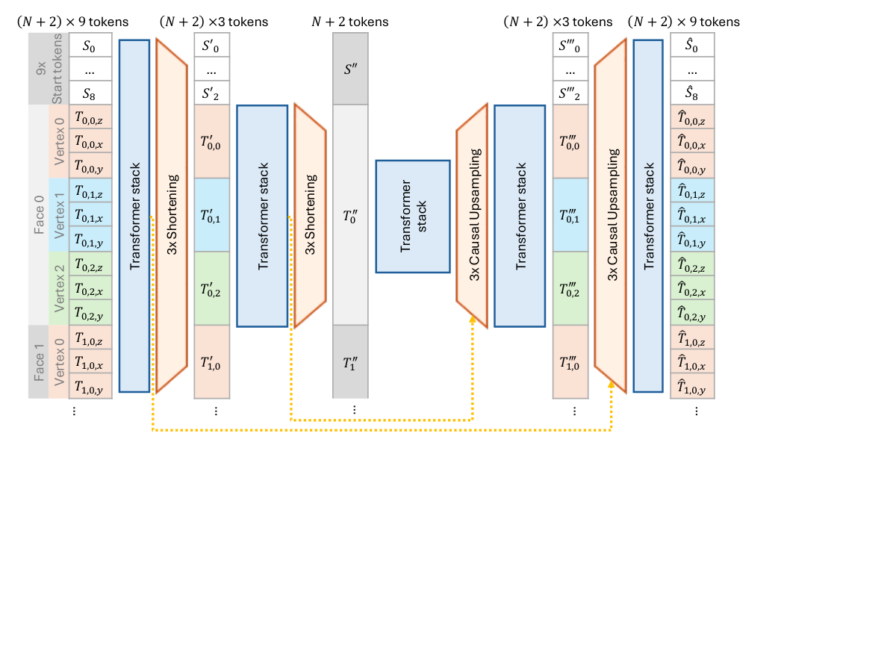

*原文 Figure 6：论文原始图 6 [查看图片来源](https://arxiv.org/html/2412.09548v1/hourglass_arch_v3.png)*

引用来源：arxiv_2608.02711

链接：[arXiv](https://arxiv.org/abs/2412.09548)

##### MetaMorph: Multimodal Understanding and Generation via Instruction Tuning

作者：Shengbang Tong, David Fan, Jiacheng Zhu, Yunyang Xiong, Xinlei Chen, Koustuv Sinha, Michael Rabbat, Yann LeCun, Saining Xie, Zhuang Liu

研究角色：背景与上下文工作
任务标签：context

中文简介：

该工作解决视觉理解与生成统一建模任务，输入为图文指令序列，输出文本或连续视觉Token。核心提出Visual-Predictive Instruction Tuning (VPiT)，通过指令微调使预训练LLM同时预测离散文本和连续视觉Token。区别于传统独立模型，它揭示理解能力可自然涌现出生成能力，且理解数据对两者提升更有效，实现了在单一自回归框架下高效解锁多模态生成与理解，利用LLM先验克服常见生成失败模式。

*原文 Figure 2：Figure 2 : Generation-only training vs. Joint training with other data. Training solely on generation data results in inferior performance. Joint training with additional data enables visual generation with only 5k generation data and yields high-quality outputs with 200k generation data. [查看图片来源](https://arxiv.org/html/2412.14164v1/fid_special_points_plot_new.svg)*

引用来源：arxiv_2608.02711

链接：[arXiv](https://arxiv.org/abs/2412.14164)

##### Structured 3D Latents for Scalable and Versatile 3D Generation

作者：Jianfeng Xiang, Ze-Long Lv, Sicheng Xu, Yu Deng, Ruicheng Wang, Bowen Zhang, Dong Chen, Xin Tong, Jiao-Long Yang

研究角色：背景与上下文工作
任务标签：context

中文简介：

该工作解决 versatile 三维资产生成任务，输入文本或图像条件，输出NeRF、3D Gaussians或Mesh等多种格式。核心引入结构化潜空间（SLat），整合稀疏3D网格与密集多视图视觉特征，并采用整流流Transformer进行建模。区别于单一输出格式模型，SLat实现了结构几何与纹理外观的统一捕捉，支持灵活的解码格式选择及局部3D编辑，在大规模数据集训练下显著超越了现有同规模方法的质量与灵活性。

*原文 Figure 1：Figure 2 : Overview of our method. Encoding & Decoding: We adopt a structured latent representation ( SLat ) for 3D assets encoding, which defines local latents on a sparse 3D grid to represent both geometry and appearance information. It is encoded from the 3D assets by fusing and processing dense multiview visual features extracted from a DINOv2 encoder, and can be decoded into versatile output representations with different decoders. Generation: Two specialized rectified flow transformers are utilized to generate SLat , one for the sparse structure and the other for local latents attached to it. [查看图片来源](https://arxiv.org/html/2412.01506v3/pipeline_v3.png)*

引用来源：arxiv_2608.02711

链接：[arXiv](https://arxiv.org/abs/2412.01506)

##### TokenFlow: Unified Image Tokenizer for Multimodal Understanding and Generation

作者：Liao Qu, Huichao Zhang, Yiheng Liu, Xu Wang, Yi Jiang, Yiming Gao, Hu Ye, Daniel K. Du, Zehuan Yuan, Xinglong Wu

研究角色：背景与上下文工作
任务标签：context

中文简介：

TokenFlow解决多模态理解与生成中的视觉Token化瓶颈，输入图像，输出对齐的语义与像素级特征Token。核心提出双码本架构，解耦语义与细粒度视觉特征学习，并通过共享映射保持对齐。区别于以往单一VQ编码器导致的性能权衡，该方法使离散视觉输入在理解任务上超越LLaVA-1.5，同时在自回归生成中达到SDXL水平，有效桥接了理解所需的高层语义与生成所需的底层细节之间的鸿沟。

*原文 Figure 3：Figure 3 : Overview of TokenFlow. We incorporate dual encoders and codebooks with a shared mapping, enabling the joint optimization of high-level semantics and low-level pixel details. For a given input image, distances d sem d_{\text{sem}} and d pix d_{\text{pix}} are calculated from the pixel-level and semantic-level codebooks, respectively, with the final codebook index and features determined by minimizing the weighted sum d sem + w dis ⋅ d pix d_{\text{sem}}+w_{\text{dis}}\cdot d_{\text{pix}} . The resulting quantized features are independently decoded for both semantic alignment and image reconstruction training, and then concatenated to provide a unified representation for downstream tasks in understanding and generation. [查看图片来源](https://arxiv.org/html/2412.03069v2/pipeline.png)*

引用来源：arxiv_2608.02711

链接：[arXiv](https://arxiv.org/abs/2412.03069)

##### 2025

##### BAG: Body-Aligned 3D Wearable Asset Generation

作者：Zhongjin Luo, Yang Li, Mingrui Zhang, Senbo Wang, Han Yan, Xibin Song, Taizhang Shang, Wei Mao, Hongdong Li, Xiaoguang Han, Pan Ji

研究角色：背景与上下文工作
任务标签：context

中文简介：

BAG解决生成可自动穿戴于给定3D人体上的3D资产任务。输入为人体形状/姿态及图像提示，输出为对齐身体的3D穿戴资产。核心方法采用“2D引导+3D生成”范式：首先训练身体条件控制的多视图扩散模型生成对齐图像，再输入原生3D扩散模型生成形状，最后通过物理模拟解决穿透问题。该方法属于三维资产生成类别，特别强调了生成资产与特定几何主体（人体）的对齐与交互，区别于通用物体生成，实现了高精度的穿戴适配。

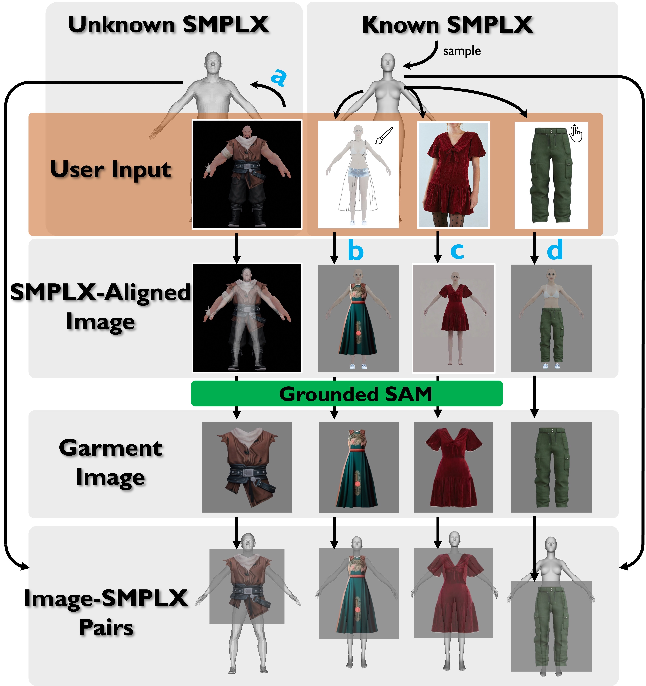

*原文 Figure 5：Figure 5. Four Methods to acqure input body and image pairs. a ) SMPLX Fitting. b )Sketch-Based Modeling. c ) Virtual Try-on. d ) Manual Images Assembly. [查看图片来源](https://arxiv.org/html/2501.16177v1/images/pair-acquire.jpg)*

引用来源：arxiv_2608.02711

链接：[arXiv](https://arxiv.org/abs/2501.16177)

##### Janus-Pro: Unified Multimodal Understanding and Generation with Data and Model Scaling

作者：Xiao-Kang Chen, Zhiyu Wu, Xingchao Liu, Zi-Zheng Pan, Wen Liu, Zhen-Da Xie, Xing-Kai Yu, C. Ruan

研究角色：背景与上下文工作
任务标签：context

中文简介：

Janus-Pro是一个统一的多模态理解与生成模型，主要解决文本到图像生成及多模态理解任务。通过优化训练策略、扩展训练数据及放大模型规模，它在指令跟随能力和生成稳定性上显著优于前代Janus模型。虽然其主要产出为2D图像，但作为统一多模态架构的代表，其解耦的理解与生成头设计、以及大规模数据 scaling 律的研究，为构建包含3D模态在内的更广泛统一多模态模型提供了重要的架构参考和技术验证路径。

*原文 Figure 4：Figure 3: Architecture of our Janus-Pro. We decouple visual encoding for multimodal understanding and visual generation. “Und. Encoder” and “Gen. Encoder” are abbreviations for “Understanding Encoder” and “Generation Encoder”, respectively. Best viewed on screen. [查看图片来源](https://arxiv.org/html/2501.17811v1/Janus.png)*

引用来源：arxiv_2608.02711

链接：[arXiv](https://arxiv.org/abs/2501.17811)

##### Qwen2.5-VL Technical Report

作者：Shuai Bai, Ke-qin Chen, Xue-Jing Liu, Jia-Lin Wang, Wenbin Ge, Sibo Song, K. Dang, Peng Wang, Shijie Wang, Jun Tang, Humen Zhong, Yuanzhi Zhu, Mingkun Yang, Zhaohai Li, Jian-Qiang Wan, Pengfei Wang, Wei Ding, Zheren Fu, Yiheng Xu, Jiabo Ye, Xi Zhang, Tianbao Xie, Zesen Cheng, Hang Zhang, Zhibo Yang, Haiyang Xu, Junyang Lin

研究角色：背景与上下文工作
任务标签：context

中文简介：

Qwen2.5-VL是通义千问视觉语言系列的最新旗舰模型，主要解决复杂视觉理解、文档解析及长视频 comprehension 任务。输入为图像或视频，输出为文本描述、坐标定位或结构化数据。核心方法包括从头训练原生动态分辨率Vision Transformer，引入窗口注意力机制以处理任意尺寸图像和小时级视频，并具备精确的对象定位能力。虽非专用3D模型，但其强大的空间尺度感知和细粒度理解能力为三维场景理解提供了重要的底层视觉基础支持。

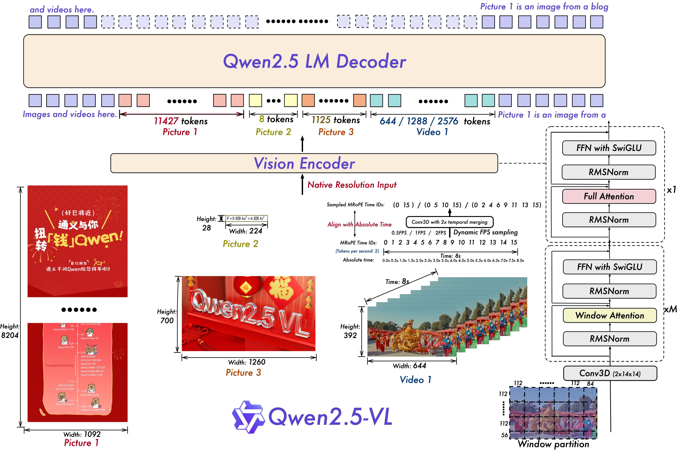

*原文 Figure 2：Figure 1: The Qwen2.5-VL framework demonstrates the integration of a vision encoder and a language model decoder to process multimodal inputs, including images and videos. The vision encoder is designed to handle inputs at their native resolution and supports dynamic FPS sampling. Images of varying sizes and video frames with different FPS rates are dynamically mapped to token sequences of varying lengths. Notably, MRoPE aligns time IDs with absolute time along the temporal dimension, enabling the model to better comprehend temporal dynamics, such as the pace of events and precise moment localization. The processed visual data is subsequently fed into the Qwen2.5 LM Decoder. We have re-engineered the vision transformer (ViT) architecture, incorporating advanced components such as FFN with SwiGLU activation, RMSNorm for normalization, and window-based attention mechanisms to enhance performance and efficiency. [查看图片来源](https://arxiv.org/html/2502.13923v1/figures/qwen2.5vl_arc.jpeg)*

引用来源：arxiv_2608.02711

链接：[arXiv](https://arxiv.org/abs/2502.13923)

##### Cube: A Roblox View of 3D Intelligence

作者：K. Bhat, Nishchaie Khanna, Karun Channa, Tinghui Zhou, Yiheng Zhu, Xiaoxia Sun, Charles Shang, Anirudh Sudarshan, Maurice Chu, Daiqing Li, Kangle Deng, J. Fauconnier, Tijmen Verhulsdonck, Maneesh Agrawala, Kayvon Fatahalian, Alexander Weiss, C. Reiser, Ravi Kiran Chirravuri, Ravali Kandur, Alejandro Pelaez, Akash Garg, M. Palleschi, Jessica Wang, Skylar Litz, Leo Liu, Anyi Li, D. Harmon, Derek Liu, Liangjun Feng, Denis Goupil, Lukasz Kuczynski, J. Yoon, Naveen Marri, Peiye Zhuang, Yinan Zhang, Brian Yin, Hao-Miao Jiang, Marcel van Workum, Thomas Lane, Bryce Erickson, Salil Pathare, Kyle Price, Anupam Singh, David Baszucki

研究角色：背景与上下文工作
任务标签：context

中文简介：

Cube致力于构建面向3D智能的基础模型，支持文本到形状、形状到文本及场景生成等任务。核心方法是设计了一种3D形状词元化方案，使3D几何成为核心数据类型，并能与大语言模型（LLM）协作进行场景分析与推理。作为统一多模态模型的早期探索，它强调了3D数据在基础模型中的核心地位，区别于仅关注单一生成任务的模型，旨在通过共享的词元接口实现理解与生成的统一，为构建全功能3D基础模型奠定基础。

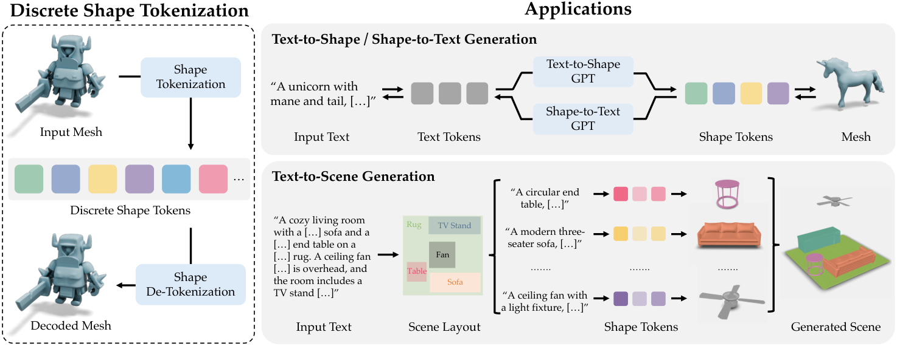

*原文 Figure 2：Figure 2 : Overview. We present an important step towards the foundation model for 3D intelligence. Specifically, our report focuses on 3D shape tokenization—a technique for converting between shapes and discrete tokens. We also demonstrate how our tokenization scheme enables multiple applications including text-to-shape generation, shape-to-text generation, and text-to-scene generation. [查看图片来源](https://arxiv.org/html/2503.15475v3/overview_v2.png)*

引用来源：arxiv_2608.02711

链接：[arXiv](https://arxiv.org/abs/2503.15475)

##### DeepMesh: Auto-Regressive Artist-Mesh Creation with Reinforcement Learning

作者：Ruowen Zhao, Junliang Ye, Zhengyi Wang, Guangce Liu, Yiwen Chen, Yikai Wang, Jun Zhu

研究角色：背景与上下文工作
任务标签：context

中文简介：

DeepMesh针对点云和图像条件输入，生成高质量三角网格的任务。它采用自回归架构预测离散顶点词元，并通过引入强化学习（RL）中的直接偏好优化（DPO）来解决传统方法面数受限和网格不完整的问题。通过结合人类评估与三维指标构建评分标准，模型对齐了人类偏好。该方法属于网格词元化与流匹配类别中的自回归生成路线，其创新在于将RL引入3D生成以优化几何精度与视觉吸引力，优于现有SOTA方法。

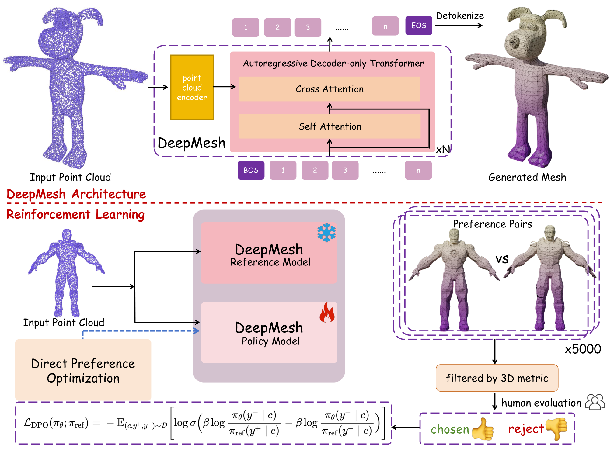

*原文 Figure 1：Figure 2 : An overview of our method. DeepMesh is an auto-regressive transformer composed of both self-attention and cross-attention layers. The model is pre-trained on discrete mesh tokens generated by our improved tokenization algorithm. To further enhance the quality of results, we propose a scoring standard that combines 3D metrics with human evaluation. With this standard, we annotate 5,000 preference pairs and then post-train the model with DPO to align its outputs with human preferences. [查看图片来源](https://arxiv.org/html/2503.15265v1/framework.png)*

引用来源：arxiv_2608.02711

链接：[arXiv](https://arxiv.org/abs/2503.15265)

##### Geometry in Style: 3D Stylization via Surface Normal Deformation

作者：Nam Anh Dinh, Itai Lang, Hyunwoo Kim, Oded Stein, Rana Hanocka

研究角色：背景与上下文工作
任务标签：context

中文简介：

该论文解决三维网格的风格化编辑任务，输入为原始网格和文本风格提示，输出保持身份一致的风格化网格。核心方法是将变形表示为顶点邻域的目标法向量，并通过可微的As-Rigid-As-Possible (dARAP) 层求解旋转和顶点位置，结合文本到图像模型的视觉损失驱动变形。区别于传统方法，它在保持几何身份与实现 expressive 变形之间取得了平衡，属于三维资产编辑类别，通过显式几何变形而非纹理映射实现风格迁移。

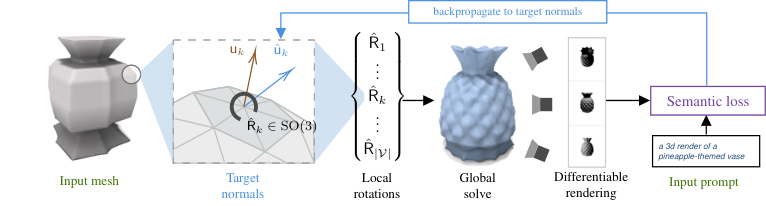

*原文 Figure 2：Figure 3 : Overview of our stylization pipeline. Geometry in Style optimizes vertex normals to deform the mesh surface, subject to a stylization text prompt. Using the normals undergoing optimization as a target for our differentiable As-Rigid-As-Possible method (dARAP), the dARAP local step computes a rotation matrix per vertex; we then obtain the deformed surface via our dARAP global solve. Then, we utilize a differentiable renderer and a diffusion model-based semantic loss to guide the normals being optimized towards a deformation matching the desired style prompt. [查看图片来源](https://arxiv.org/html/2503.23241v2/prerenderedfig-overview-v2-nobluegradient.png)*

引用来源：arxiv_2608.02711

链接：[arXiv](https://arxiv.org/abs/2503.23241)

##### SparseFlex: High-Resolution and Arbitrary-Topology 3D Shape Modeling

作者：Xianglong He, Zi-Xin Zou, Chia-Hao Chen, Yuanchen Guo, Ding Liang, Chun Yuan, Wanli Ouyang, Yan-Pei Cao, Yangguang Li

研究角色：背景与上下文工作
任务标签：context

中文简介：

SparseFlex旨在解决高分辨率、任意拓扑（包括开放表面）的三维形状建模与生成任务。它提出一种稀疏结构等值面表示，结合视锥感知截面体素训练策略，直接从渲染损失中重建高分辨率网格。在此基础上，训练变分自编码器（VAE）和整流流Transformer进行生成。该方法突破了隐式场方法需水密转换的限制，显著降低内存消耗并支持内部结构重建，属于三维原生潜空间与网格生成结合的先进路线，提升了重建精度与生成质量。

*原文 Figure 1：Figure 2 : Overview of the SparseFlex VAE pipeline. SparseFlex VAE takes point clouds sampled from a mesh as input, voxelizes them, and aggregates their features into each voxel. A sparse transformer encoder-decoder compresses the structured feature into a more compact latent space, followed by a self-pruning upsampling for higher resolution. Finally, the structured features are decoded to SparseFlex through a linear layer. Using the frustum-aware section voxel training strategy, we can train the entire pipeline more efficiently by rendering loss. [查看图片来源](https://arxiv.org/html/2503.21732v1/figs/pipeline.png)*

引用来源：arxiv_2608.02711

链接：[arXiv](https://arxiv.org/abs/2503.21732)

##### PartField: Learning 3D Feature Fields for Part Segmentation and Beyond

作者：Minghua Liu, M. Uy, Donglai Xiang, Hao Su, Sanja Fidler, Nicholas Sharp, Jun Gao

研究角色：背景与上下文工作
任务标签：context

中文简介：

PartField解决三维部件分割与理解任务，输入三维形状，输出层级化的部件特征场及分割结果。它采用前馈网络学习通用的部件概念，不依赖预定义模板或文本标签，通过对比学习蒸馏2D/3D部件提议。该方法属于三维场景理解中的部件结构化分析范畴，但侧重于隐式特征场而非显式网格生成。相比以往方法，它推理速度极快且具备开放世界泛化能力，能捕捉部件层级关系并支持共分割等下游任务，为结构化生成提供语义基础。

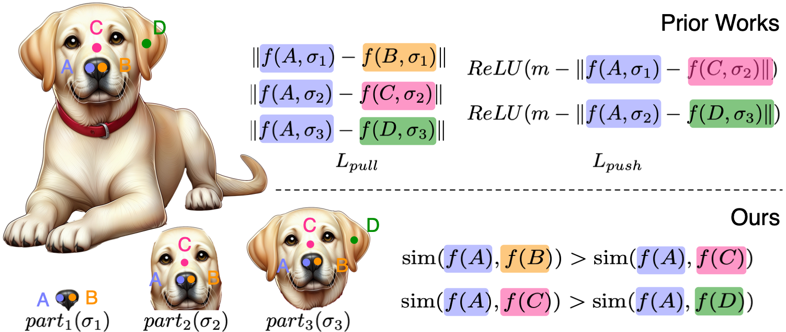

*原文 Figure 3：Figure 4 : (Left) A point can belong to multiple parts at different scales. (Upper Right) Prior works [ 21 , 69 ] utilize pull and push losses to directly minimize or maximize the feature distances between point pairs, requiring an additional scaling condition to learn point features at different scales. (Lower Right) Our method employs a triplet loss that only encourages the relative relations between points within a triplet, enabling self-contained features ( sim ​ ( f ⁡ ( A ) , f ⁡ ( B ) ) > sim ​ ( f ⁡ ( A ) , f ⁡ ( C ) ) > sim ​ ( f ⁡ ( A ) , f ⁡ ( D ) ) \text{sim}(f(A),f(B))>\text{sim}(f(A),f(C))>\text{sim}(f(A),f(D)) ) that support multi-scale parts without need of scaling condition. [查看图片来源](https://arxiv.org/html/2504.11451v1/figures/loss.png)*

引用来源：arxiv_2608.02711

链接：[arXiv](https://arxiv.org/abs/2504.11451)

##### Seedream 3.0 Technical Report

作者：Yu Gao, Lixue Gong, Qiushan Guo, Xiaoxia Hou, Zhichao Lai, Fan-Shi Li, Liang Li, Xiaochen Lian, Chao Liao, Liyang Liu, Wei Liu, Yichun Shi, Shiqi Sun, Yu-Chen Tian, Zhi Tian, Peng Wang, Rui Wang, Xuanda Wang, Xun Wang, Ye Wang, Guofeng Wu, Jie Wu, X. Xia, Xuefeng Xiao, Zhonghua Zhai, Xinyu Zhang, Qi Zhang, Yuwei Zhang, Shijia Zhao, Jianchao Yang, Wei-Lin Huang

研究角色：背景与上下文工作
任务标签：context

中文简介：

Seedream 3.0是一个高性能的中英双语图像生成基础模型，输入复杂文本提示，输出高分辨率、高保真图像。虽然主要面向二维图像，但其技术改进如混合分辨率训练、跨模态RoPE及表示对齐损失，对多模态统一架构有借鉴意义。它不属于三维资产生成或直接相关类别，而是作为相邻的二维生成工作，展示了通过对齐损失和奖励模型优化来提升生成质量与文本对齐能力的通用范式，其加速策略也为实时多模态交互提供了思路。

*原文 Figure 1：Figure 1 : Seedream 3.0 demonstrates outstanding performance across all evaluation aspects. Due to missing data, the Portrait result of Imagen 3 and overall result of Seedream 2.0 are represented by the average values of other models. In addition, Seedream 3.0 ranks first at Artificial Analysis Text to Image Model Leaderboard with an Arena ELO score of 1158 at 17.0K Appearances at the time of publication 1 1 1 https://artificialanalysis.ai/text-to-image/arena?tab=Leaderboard . [查看图片来源](https://arxiv.org/html/2504.11346v3/x1.png)*

引用来源：arxiv_2608.02711

链接：[arXiv](https://arxiv.org/abs/2504.11346)

##### Transfer between Modalities with MetaQueries

作者：Xichen Pan, Satya Narayan Shukla, Aashu Singh, Zhuokai Zhao, Shlok Kumar Mishra, Jialiang Wang, Zhiyang Xu, Jiuhai Chen, Kunpeng Li, Felix Juefei-Xu, Ji Hou, Saining Xie

研究角色：背景与上下文工作
任务标签：context

中文简介：

MetaQueries旨在解决统一多模态模型中理解与生成模态对齐困难的问题，输入为自回归多模态LLM的潜变量，输出为扩散模型生成的图像。它引入一组可学习的MetaQueries作为接口，连接冻结的MLLM骨干与扩散解码器，实现知识增强的图像生成。该方法属于统一多模态模型的技术组件，通过轻量级查询机制简化了训练流程，无需复杂的数据平衡即可保留LLM的强大理解力并赋予其生成能力，为构建包含三维生成的统一架构提供了高效的模块化解耦方案。

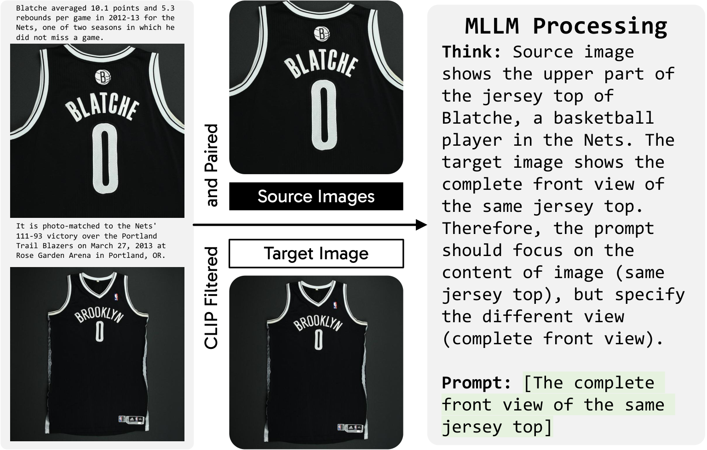

*原文 Figure 5：Figure 4 : Overview of instruction tuning data curation pipeline. We group images from web corpora based on caption similarity using the SigLIP ( Zhai et al., 2023 ) model, then construct instruction-tuning data from these image pairs using an MLLM. [查看图片来源](https://arxiv.org/html/2504.06256v1/data.png)*

引用来源：arxiv_2608.02711

链接：[arXiv](https://arxiv.org/abs/2504.06256)

##### BLIP3-o: A Family of Fully Open Unified Multimodal Models-Architecture, Training and Dataset

作者：Jiuhai Chen, Zhiyang Xu, Xichen Pan, Yushi Hu, Can Qin, Tom Goldstein, Lifu Huang, Tianyi Zhou, Saining Xie, Silvio Savarese, Le Xue, Caiming Xiong, Ran Xu

研究角色：背景与上下文工作
任务标签：context

中文简介：

BLIP3-o系列模型主要研究统一多模态框架下的图像理解与生成，虽未直接聚焦三维，但其架构设计对多模态统一具有参考意义。它采用扩散Transformer生成CLIP图像特征，替代传统VAE表示，并实施“先理解后生成”的顺序预训练策略。这种设计属于统一多模态模型探索，通过解耦训练阶段 preserves 理解能力同时增强生成质量。其提出的扩散特征接口和训练食谱，为构建包含三维在内的更广泛统一模型提供了高效的架构范式和数据策略。

*原文 Figure 1：Figure 1: The architecture of BLIP3-o. For image understanding part, we use CLIP to encode the image and compute the cross entropy loss between the target text token and predicted text token. For image generation part, autoregressive model first generates a sequence of intermediate visual features, which are then used as conditioning inputs to a diffusion transformer that generates CLIP image features to approximate the ground-truth CLIP features. By using CLIP encoder, image understanding and image generation share the same semantic space, effectively unifying these two tasks. [查看图片来源](https://arxiv.org/html/2505.09568v1/fig1.png)*

引用来源：arxiv_2608.02711

链接：[arXiv](https://arxiv.org/abs/2505.09568)

##### Emerging Properties in Unified Multimodal Pretraining

作者：Chao-Rui Deng, Deyao Zhu, Kunchang Li, Chenhui Gou, Feng Li, Zeyu Wang, Shu Zhong, Weihao Yu, Xiao-Ping Nie, Ziang Song, Guang Shi, Haoqi Fan

研究角色：背景与上下文工作
任务标签：context

中文简介：

BAGEL是一个开源的基础统一多模态模型，支持理解与生成任务，输入涵盖文本、图像、视频及三维数据，输出相应的多模态内容。其核心范式是基于解码器架构，在万亿级交错多模态数据上进行预训练，从而涌现出复杂的多模态推理能力，包括三维操作和世界导航。作为统一多模态模型，它不同于专用小模型，通过大规模数据缩放实现了通用的跨模态交互，在多项基准测试中展现了超越现有开源模型的生成与理解性能。

*原文 Figure 3：Figure 3 : Loss curves of various designs. CE loss and MSE loss are computed on multimodal understanding and generation tasks, respectively. Ablation experiments are carried out on a 1.5B LLM. The sampling ratio for generation and understanding data is set at 4:1. [查看图片来源](https://arxiv.org/html/2505.14683v3/x3.png)*

引用来源：arxiv_2608.02711

链接：[arXiv](https://arxiv.org/abs/2505.14683)

##### Sparc3D: Sparse Representation and Construction for High-Resolution 3D Shapes Modeling

作者：Zhihao Li, Yufei Wang, Heliang Zheng, Yi-Hao Luo, Bihan Wen

研究角色：背景与上下文工作
任务标签：context

中文简介：

SparC3D致力于高分辨率三维形状建模与生成任务，输入原始网格或潜在向量，输出高保真三维表面。它提出SparseCubes稀疏可变形 marching cubes 表示法，结合首个完全基于稀疏卷积网络的SparConv-VAE，解决了传统VAE在密集体素网格上的效率低和细节丢失问题。该方法属于三维原生潜空间类别，通过模态一致的稀疏编码实现近无损重建，并自然集成于潜在扩散模型中，相比传统两阶段流水线，显著降低了计算成本并保留了精细几何细节。

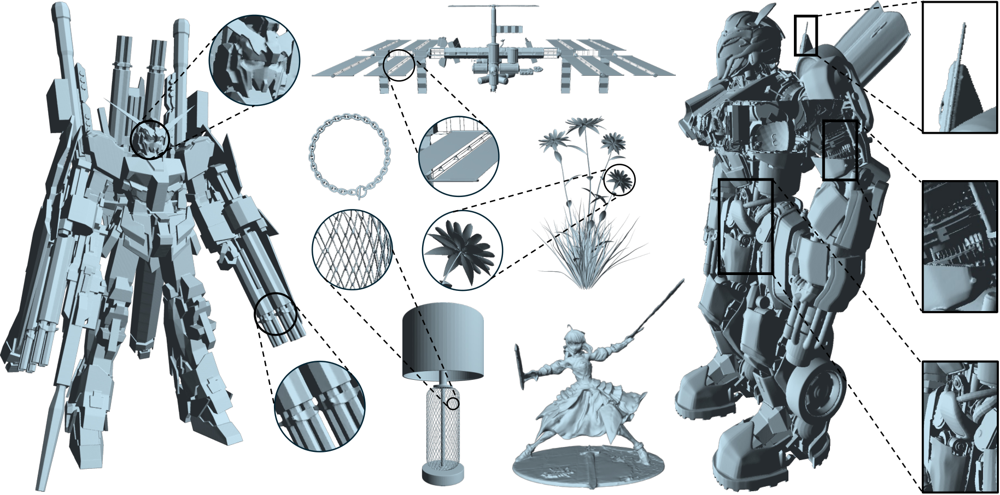

*原文 Figure 1：Figure 1: Sparc3D Reconstruction Results. Leveraging our sparse deformable marching cubes ( Sparcubes ) representation and sparse convolutional VAE ( Sparconv-VAE ), our method achieves state-of-the-art reconstruction quality on challenging 3D inputs. It robustly handles open surfaces (automatically closed into watertight meshes), recovers hidden interior structures, and faithfully reconstructs highly complex geometries (see zoom-in views, top to bottom). All outputs are fully watertight and 3D-printable, demonstrating the potential of our framework for high-resolution 3D mesh generation. Best viewed with zoom-in. [查看图片来源](https://arxiv.org/html/2505.14521v3/teaser.png)*

引用来源：arxiv_2608.02711

链接：[arXiv](https://arxiv.org/abs/2505.14521)

##### Auto-Regressive Surface Cutting

作者：Yang Li, Victor Cheung, Xinhai Liu, Yuguang Chen, Zhongjin Luo, Biwen Lei, Haohan Weng, Zi-Bo Zhao, Jingwei Huang, Zhuo Chen, Chunchao Guo

研究角色：背景与上下文工作
任务标签：context

中文简介：

SeamGPT（Auto-Regressive Surface Cutting）解决网格表面切割任务，输入为3D网格顶点与边点云，输出语义连贯的切割缝序列。核心方法将表面切割形式化为Next Token Prediction问题，利用类GPT Transformer自回归地预测量化3D坐标的缝线段。区别于产生碎片化UV图集的传统算法，该方法模仿专业工作流，生成的切割边界更清洁且具语义 coherence，常作为网格词元化与结构化分解的前置处理技术。

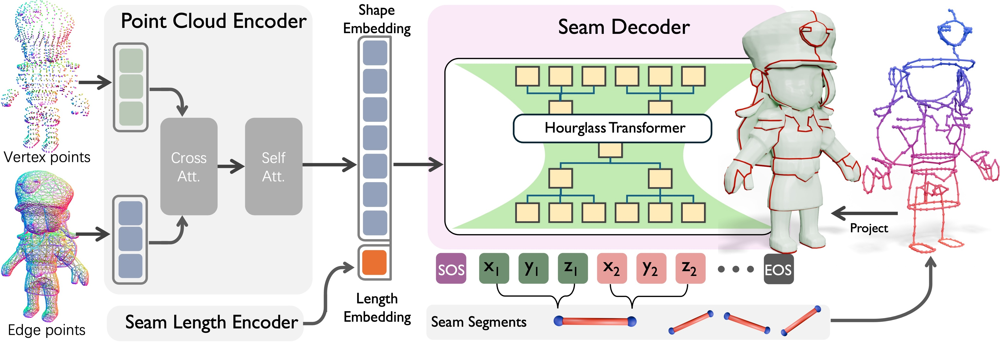

*原文 Figure 2：Figure 2: SeamGPT architecture: Point cloud encoder extracts shape context; Causal transformer decoder generates axis-ordered seam coordinates. Color indicates the prediction order is of the seam segments (red to blue). [查看图片来源](https://arxiv.org/html/2506.18017v1/figs/pipeline.jpg)*

引用来源：arxiv_2608.02711

链接：[arXiv](https://arxiv.org/abs/2506.18017)

##### Hunyuan3D 2.1: From Images to High-Fidelity 3D Assets with Production-Ready PBR Material

作者：Team Hunyuan3D, Shuhui Yang, Mingxin Yang, Yifei Feng, Xin Huang, Sheng Zhang, Zebin He, Di Luo, Haolin Liu, Yunfei Zhao, Qin Lin, Zeqiang Lai, Xiang-Hui Yang, Huiwen Shi, Zi-Bo Zhao, Bowen Zhang, Hongyu Yan, Li-Fu Wang, Si-Ya Liu, Ji-Hong Zhang, Meng-Ya Chen, Liang Dong, Y. Jia, Yu-Xin Cai, Jia-Ao Yu, Y. Tang, Dong-Lin Guo, Jun-Lin Yu, Hao Zhang, Zhengfeng Ye, Peng He, Runzhou Wu, Shida Wei, Chao Zhang, Yonghao Tan, Yifu Sun, Lin Niu, Shirui Huang, Bo Zheng, Shu Liu, Shilin Chen, Xiang Yuan, Xiaofeng Yang, Kai Liu, Jian-Chen Zhu, Peng Chen, Tian-Yu Liu, Di Wang, Yu-Hong Liu, Linus, Jie Jiang, Jingwei Huang, Chunchao Guo

研究角色：背景与上下文工作
任务标签：context

中文简介：

Hunyuan3D 2.1解决从图像到高保真生产级PBR材质三维资产的生成任务。系统包含Hunyuan3D-DiT形状生成器与Hunyuan3D-Paint纹理合成器两个核心组件。该论文主要以教程形式阐述数据处理、模型架构及训练策略，旨在降低3D AIGC开发门槛。作为Hunyuan3D系列的重要迭代，它确立了从几何到物理真实感纹理的两阶段生成范式，为工业界应用提供了标准化的基线模型与评估流程。

*原文 Figure 3：Figure 3: Overview of DiT block. We adopt the DiT implemented by Hunyuan-DiT [ 4 ] in our pipeline. [查看图片来源](https://arxiv.org/html/2506.15442v1/blocks.svg)*

引用来源：arxiv_2608.02711

链接：[arXiv](https://arxiv.org/abs/2506.15442)

##### Hunyuan3D 2.5: Towards High-Fidelity 3D Assets Generation with Ultimate Details

作者：Zeqiang Lai, Yunfei Zhao, Haolin Liu, Zi-Bo Zhao, Qin Lin, Huiwen Shi, Xiang-Hui Yang, Mingxin Yang, Shuhui Yang, Yifei Feng, Sheng Zhang, Xin Huang, Di Luo, Fan Yang, Fang Yang, Li-Fu Wang, Si-Ya Liu, Y. Tang, Yu-Xin Cai, Zebin He, Tian-Hai Liu, Yu-Hong Liu, Jie Jiang, Linus, Jingwei Huang, Chunchao Guo

研究角色：背景与上下文工作
任务标签：context

中文简介：

Hunyuan3D 2.5解决高保真纹理三维资产生成任务，输入为图像或文本，输出细节丰富的带纹理3D模型。其核心架构沿用两阶段流水线，形状生成采用规模达10B参数的LATTICE基础模型，纹理生成则升级为基于物理渲染（PBR）的多视图架构。相较于前代，该模型在形状锐度、表面平滑度及图像-3D对齐精度上显著进步，代表了当前大规模统一生成模型在端到端高质资产合成方面的SOTA水平。

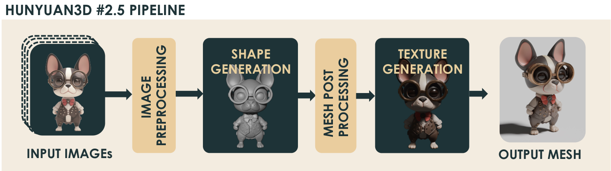

*原文 Figure 3：Figure 3: Overview of Hunyuan3D 2.5 pipeline . It separates the 3D asset generation into two stages: first, it generates the shape, and then it creates the texture based on that shape. [查看图片来源](https://arxiv.org/html/2506.16504v1/arch.png)*

引用来源：arxiv_2608.02711

链接：[arXiv](https://arxiv.org/abs/2506.16504)

##### ShapeLLM-Omni: A Native Multimodal LLM for 3D Generation and Understanding

作者：Junliang Ye, Zhengyi Wang, Ruowen Zhao, Shenghao Xie, Jun Zhu

研究角色：背景与上下文工作
任务标签：context

中文简介：

ShapeLLM-Omni旨在解决三维资产的理解与生成任务，输入为文本或三维数据，输出对应的三维网格或文本描述。其核心范式是构建原生三维多模态大语言模型，首先训练3D VQ-VAE将三维物体映射为离散潜空间词元，再基于包含生成、理解和编辑任务的3D-Alpaca数据集对Qwen-2.5-vl进行指令微调。区别于仅处理图文的模型，它通过共享主干实现了真正的三维原生交互，属于统一多模态模型类别，扩展了LLM的三维能力边界。

*原文 Figure 2：Figure 2: The pipeline of 3D VQVAE, which can compress voxels into discrete tokens. [查看图片来源](https://arxiv.org/html/2506.01853v1/vqvae2.png)*

引用来源：arxiv_2608.02711

链接：[arXiv](https://arxiv.org/abs/2506.01853)

##### OmniPart: Part-Aware 3D Generation with Semantic Decoupling and Structural Cohesion

作者：Yu-nuo Yang, Yufan Zhou, Yuan-Chen Guo, Zi-Xin Zou, Yukun Huang, Ying-Tian Liu, Hao Xu, Ding Liang, Yan-Pei Cao, Xihui Liu

研究角色：背景与上下文工作
任务标签：context

中文简介：

OmniPart解决具有显式部件结构的三维资产生成任务，输入为灵活控制的2D部件掩码，输出语义解耦且结构 cohesive 的3D部件集合。其核心范式将任务解耦为自回归结构规划与空间条件整流流生成两个阶段：先生成可变长度的3D边界框序列，再合成对应部件。区别于生成单体网格的方法，OmniPart强调部件级的语义独立性与用户可控粒度，为后续交互式编辑奠定了结构基础。

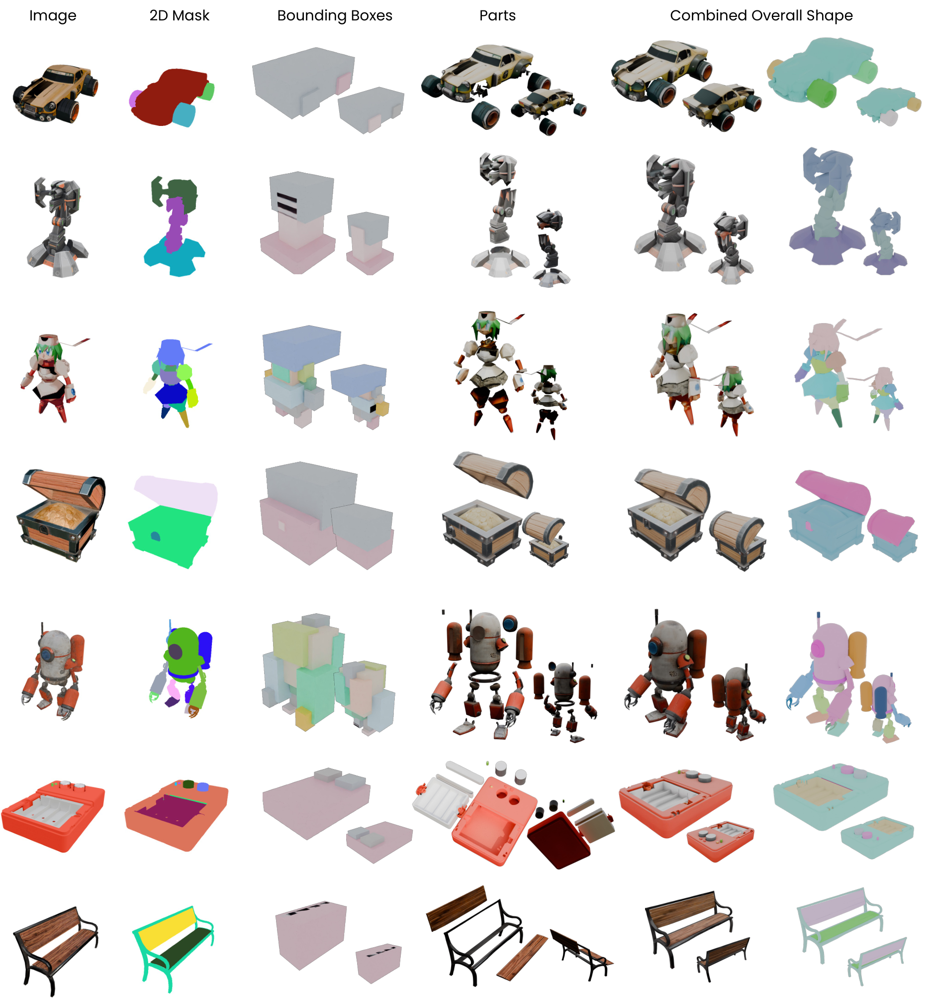

*原文 Figure 7：Figure 7. Qualitative results of our complete pipeline. We show the input image and 2D masks, along with the generated bounding boxes, individually generated part meshes, and the combined full-object mesh. As illustrated, our method enables precise control over part granularity via 2D masks and produces high-quality geometry and texture. The generated 3D parts exhibit low semantic entanglement and high structural cohesion, demonstrating the effectiveness of our part-aware 3D content generation. [查看图片来源](https://arxiv.org/html/2507.06165v1/our_results.png)*

引用来源：arxiv_2608.02711

链接：[arXiv](https://arxiv.org/abs/2507.06165)

##### Ultra3D: Efficient and High-Fidelity 3D Generation with Part Attention

作者：Yiwen Chen, Zhihao Li, Yikai Wang, Hu Zhang, Qin Li, Chi Zhang, Guosheng Lin

研究角色：背景与上下文工作
任务标签：context

中文简介：

Ultra3D解决高效高保真三维资产生成任务，输入为文本或图像条件，输出高分辨率稀疏体素3D模型。核心方法引入Part Attention机制，将注意力计算限制在语义一致的部件区域内，并结合VecSet表示减少Token数量，从而避免全局注意力的二次复杂度。相较于传统两阶段扩散流程，该方法在保持结构连续性的同时实现了显著的加速，属于利用部件结构化信息优化生成效率的典型代表。

*原文 Figure 3：Figure 3: Pipeline Overview. We introduce Ultra3D , an efficient and high-quality 3D generation framework that first generates sparse voxel layout via VecSet and then refines it by generating per-voxel latent. The core of Ultra3D is Part Attention, an efficient localized attention mechanism that performs attention computation independently within each part group. Besides, when the input condition is an image, each part group performs cross attention only with the image tokens onto which its voxel tokens are projected. [查看图片来源](https://arxiv.org/html/2507.17745v3/pip_pdf.png)*

引用来源：arxiv_2608.02711

链接：[arXiv](https://arxiv.org/abs/2507.17745)

##### FASTMESH: Efficient Artistic Mesh Generation Via Component Decoupling

作者：Jeonghwan Kim, Yushi Lan, Armando Fortes, Yongwei Chen, Xingang Pan

研究角色：背景与上下文工作
任务标签：context

中文简介：

FASTMESH解决艺术网格高效生成任务，输入为几何条件，输出三角形网格。核心方法采用组件解耦策略，仅用自回归模型生成顶点，再通过双向Transformer单步构建面片邻接矩阵，显著减少顶点复用导致的词元冗余。区别于传统将网格序列化为长词元序列的方法，该框架将词元量降至现有的23%，生成速度提升8倍以上。结合保真度增强器与后处理，它在保证网格质量的同时，实现了极具效率的网格词元化与生成流程。

*原文 Figure 1：Figure 2 : (a) Overall architecture of FastMesh . Note that our pipeline consists of two stages, where we first generate the vertices from the shape condition and then construct the faces to complete the mesh. (b) Visualization of the block-wise indexing scheme introduced by BPT [ 48 ] , which we adopt for vertex tokenization. (c) Structure of the fidelity enhancer in the first stage. The 7-bit discretized vertices and shape condition are fed into the network to estimate the offset that can make the coordinate a continuous value. (d) Details of face reconstruction. The generated vertices are embedded to capture inter-vertex relationships in a multi-head manner. Each head computes a matrix, where the output represents one feature dimension used in edge prediction. [查看图片来源](https://arxiv.org/html/2508.19188v3/pipeline.png)*

引用来源：arxiv_2608.02711

链接：[arXiv](https://arxiv.org/abs/2508.19188)

##### Qwen-Image Technical Report

作者：Chen-Fei Wu, Jiahao Li, Jingren Zhou, Junyang Lin, Kai-Yuan Gao, Kun Yan, Shengming Yin, Shuai Bai, Xiao Xu, Yi-Lei Chen, Yu-Xiang Chen, Ze-Cheng Tang, Zekai Zhang, Zhengyi Wang, An Yang, Bo-Wen Yu, Chen Cheng, Dayiheng Liu, Deqing Li, Hang Zhang, Hao Meng, Hu Wei, Ji-Li Ni, Kai Chen, Kuang Cao, Liang Peng, Lin Qu, Minggang Wu, Peng Wang, Shuting Yu, Tingkun Wen, Wen-Sen Feng, Xiao-Xue Xu, Yi Wang, Yichang Zhang, Yong-An Zhu, Yujian Wu, Yu-Jiao Cai, Ze-Yang Liu

研究角色：背景与上下文工作
任务标签：context

中文简介：

Qwen-Image主要解决复杂文本渲染与精确图像编辑任务，输入为文本或图文对，输出高质量图像。其采用渐进式课程学习策略增强原生文本渲染能力，并通过双编码机制平衡语义一致性与视觉保真度。虽然属于2D生成领域，但其改进的多任务训练范式及对Qwen2.5-VL的对齐技术，为多模态大模型处理细粒度视觉指令提供了重要参考，常作为3D统一模型中2D先验或理解模块的相邻前沿工作。

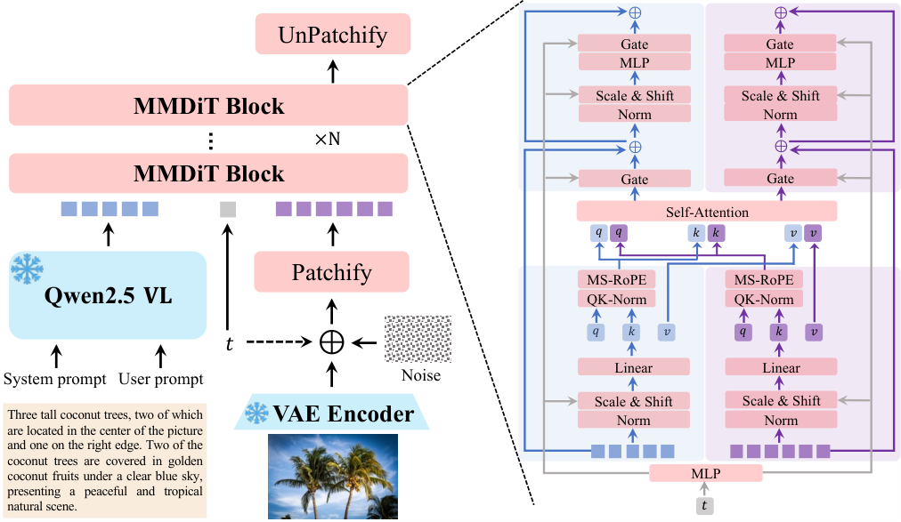

*原文 Figure 7：Figure 6: Overview of the Qwen-Image architecture. It adopts a standard double-stream MMDiT architecture. The input representations are provided by a frozen Qwen2.5-VL and a VAE encoder. The model employs RMSNorm ( Zhang & Sennrich, 2019 ) for QK-Norm, while all other normalization layers use LayerNorm. Additionally, we design a new positional encoding scheme, MSRoPE (Multimodal Scalable RoPE), to jointly encode positional information for both image and text modalities. [查看图片来源](https://arxiv.org/html/2508.02324v1/figure_qwen-image-arch2.png)*

引用来源：arxiv_2608.02711

链接：[arXiv](https://arxiv.org/abs/2508.02324)

##### VoxHammer: Training-Free Precise and Coherent 3D Editing in Native 3D Space

作者：Lin Li, Zehuan Huang, Hao-li Feng, Gengxiong Zhuang, Rui Chen, Chunchao Guo, Lu Sheng

研究角色：背景与上下文工作
任务标签：context

中文简介：

VoxHammer解决三维资产的局部编辑任务，输入为待编辑3D模型及区域指令，输出保持未编辑区一致性的修改后模型。其核心范式是在原生3D潜空间中进行无训练编辑，通过预测反演轨迹并缓存关键值Token，在去噪阶段替换保留区域的特征以维持上下文连贯。区别于依赖多视图2D投影融合的重建方法，该工作直接在3D潜空间操作，显著提升了编辑区域的几何一致性与整体质量。

*原文 Figure 1：Figure 2 : Pipeline. Given an input 3D model, a user-specified editing region, and a text prompt, the off-the-shelf models [ 40 , 3 ] are used to inpaint the rendered view from the 3D model. Subsequently, our VoxHammer , a training-free framework based on structured 3D diffusion models [ 90 ] , performs native 3D editing conditioned on the input 3D and the edited image. [查看图片来源](https://arxiv.org/html/2508.19247v1/pipeline.png)*

引用来源：arxiv_2608.02711

链接：[arXiv](https://arxiv.org/abs/2508.19247)

##### Hunyuan3D Studio: End-to-End AI Pipeline for Game-Ready 3D Asset Generation

作者：Tencent Hunyuan3D

研究角色：背景与上下文工作
任务标签：context

中文简介：

Hunyuan3D Studio面向游戏就绪3D资产生成任务，输入为概念图或文本，输出含优化几何与PBR纹理的完整3D模型。核心方法集成部件级生成、多边形生成及语义UV映射等神经模块，形成端到端AI流水线。与传统劳动密集型流程不同，该框架强调生产实用性，确保资产符合游戏引擎技术标准。它并非单纯的生成器，而是连接创意意图与技术资产的统一平台，显著降低了3D内容创作门槛并减少了迭代时间。

*原文 Figure 16：Figure 15: Mesh-RFT Framework Overview. The pipeline comprises two stages: 1) Mesh Generation Pre-training using an Hourglass AutoRegressive Transformer and a Shape Encoder; and 2) Reinforcement Post-training which employs Mask DPO with reference and policy networks for subsequent refinement. [查看图片来源](https://arxiv.org/html/2509.12815v1/pipeline.png)*

引用来源：arxiv_2608.02711

链接：[arXiv](https://arxiv.org/abs/2509.12815)

##### HunyuanImage 3.0 Technical Report

作者：Tencent Hunyuan Team

研究角色：背景与上下文工作
任务标签：context

中文简介：

HunyuanImage 3.0旨在统一多模态理解与生成任务，输入为文本或图像，输出为对应图像或语义分析。核心方法基于自回归框架，采用混合专家（MoE）架构，结合原生思维链、渐进式预训练及高效推理基础设施。作为目前最大的开源图像生成模型之一，它不同于传统的专用生成器，通过在单一模型中深度融合理解与生成能力，实现了顶级的图文对齐与视觉质量，为探索多模态生态提供了强大的基础模型支持。

*原文 Figure 2：Figure 2 : Image Captioning Pipeline. [查看图片来源](https://arxiv.org/html/2509.23951v3/assets/data/caption_0.png)*

引用来源：arxiv_2608.02711

链接：[arXiv](https://arxiv.org/abs/2509.23951)

##### Seedream 4.0: Toward Next-generation Multimodal Image Generation

作者：Yun-Peng Chen, Yu Gao, Lixue Gong, Meng-Hao Guo, Qiushan Guo, Zhiyao Guo, Xiaoxia Hou, Wei-Lin Huang, Yixuan Huang, Xiaowen Jian, Huafeng Kuang, Zhichao Lai, Fan-Shi Li, Liang Li, Xiaochen Lian, Chao Liao, Liyang Liu, Wei Liu, Yanzuo Lu, Zheng-Xiong Luo, Tongtong Ou, Guangchao Shi, Yichun Shi, Shiqi Sun, Yu-Chen Tian, Zhi Tian, Peng Wang, Rui Wang, Xun Wang, Ye Wang, Guofeng Wu, Jie Wu, Wenxu Wu, Yonghui Wu, X. Xia, Xuefeng Xiao, Shuang Xu, Xin Yan, Ceyuan Yang, Jianchao Yang, Zhonghua Zhai, Chen-Lin Zhang, Heng Zhang, Qi Zhang, Xinyu Zhang, Yuwei Zhang, Shijia Zhao, Wenliang Zhao, W. Zhu

研究角色：背景与上下文工作
任务标签：context

中文简介：

Seedream 4.0解决文本到图像合成、编辑及多图像组合任务，输入为文本或多参考图像，输出高分辨率图像。核心方法采用高效扩散Transformer与强力VAE，大幅减少图像词元数量，并结合对抗蒸馏与量化加速推理。区别于传统T2I系统，它在单框架内统一了生成与编辑，支持复杂的多模态上下文推理及多图像参考。该模型通过十亿级数据预训练与多模态后训练，实现了快速原生高分辨率生成，提升了交互性与多维创作能力。

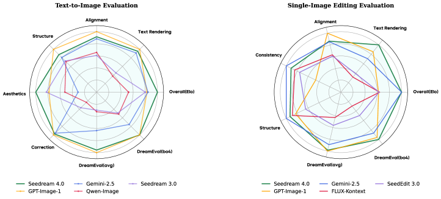

*原文 Figure 1：Figure 1 : Overall evaluation. Left: Text-to-Image results; Right: Image-Editing results. The Elo scores are obtained from the Artificial Analysis Arena. Seedream 4.0 ranks first in both T2I and image-editing leaderboards, by 09/18/2025. [查看图片来源](https://arxiv.org/html/2509.20427v3/x1.png)*

引用来源：arxiv_2608.02711

链接：[arXiv](https://arxiv.org/abs/2509.20427)

##### X-Part: high fidelity and structure coherent shape decomposition

作者：Xinhao Yan, Jiachen Xu, Yang Li, Changfeng Ma, Yunhan Yang, Chunshi Wang, Zi-Bo Zhao, Zeqiang Lai, Yunfei Zhao, Zhuo Chen, Chunchao Guo

研究角色：背景与上下文工作
任务标签：context

中文简介：

X-Part聚焦部件结构化生成任务，输入为整体3D对象及边界框提示，输出语义有意义且结构连贯的部件分解。核心方法注入逐点语义特征，利用边界框作为生成提示，实现高保真度的形状分解与可控生成。不同于现有方法在语义分解上的不足，X-Part强调结构一致性与几何保真度，并提供可编辑管道进行交互式部件生成。它在部件级生成中建立了新范式，为网格重拓扑、UV映射等下游应用提供了生产就绪的结构化资产。

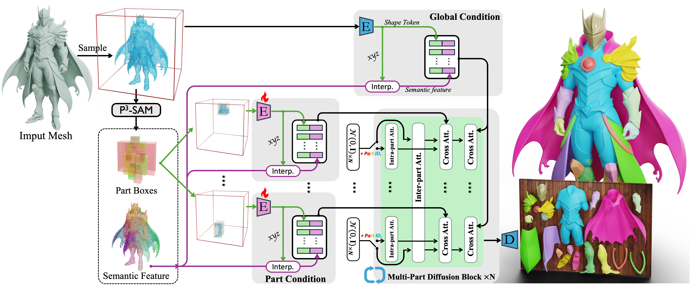

*原文 Figure 2：Figure 1: Architecture of 𝒳 \mathcal{X} -Part . Given input point cloud, per-point feature and part bounding boxes are extracted from P 3 ​ -SAM \text{P}^{3}\text{-SAM} . Global and part conditions are obtained by stacking geometry token with interpolated semantic features. They are injected to multi-part diffusion process to guide shape decomposition. [查看图片来源](https://arxiv.org/html/2509.08643v2/figs/pipeline_v3.jpg)*

引用来源：arxiv_2608.02711

链接：[arXiv](https://arxiv.org/abs/2509.08643)

##### BLIP3o-NEXT: Next Frontier of Native Image Generation

作者：Jiuhai Chen, Le Xue, Zhiyang Xu, Xichen Pan, Shusheng Yang, Can Qin, An Yan, Honglu Zhou, Zeyuan Chen, Lifu Huang, Tianyi Zhou, Junnan Li, Silvio Savarese, Caiming Xiong, Ran Xu

研究角色：背景与上下文工作
任务标签：context

中文简介：

BLIP3o-NEXT主要聚焦于原生二维图像生成与编辑，虽属相邻工作，但其架构思想对三维统一模型有借鉴意义。输入为多模态条件，输出为高保真图像。核心采用“自回归+扩散”混合架构：自回归模型先生成离散图像令牌，其隐藏状态再作为条件信号引导扩散模型生成细节。该方法结合了自回归模型的推理优势与扩散模型的渲染能力，并通过强化学习和数据引擎提升指令遵循度与一致性。其成功验证了混合架构在平衡生成质量与推理效率方面的潜力。

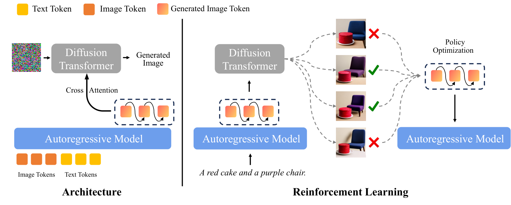

*原文 Figure 1：Figure 1: The architecture of BLIP3o-NEXT (left) and its reinforcement learning pipeline (right). BLIP3o-NEXT adopts an Autoregressive (AR) + Diffusion design, where the AR module autoregressively generates image conditions for the diffusion model. The model is jointly optimized with both AR and diffusion objectives. During reinforcement learning, rollouts are rendered from the diffusion transformer, and policy optimization is performed directly on the AR model, enabling seamless integration with existing RL infrastructures originally developed for language models. [查看图片来源](https://arxiv.org/html/2510.15857v1/figure1.png)*

引用来源：arxiv_2608.02711

链接：[arXiv](https://arxiv.org/abs/2510.15857)

##### Ming-UniVision: Joint Image Understanding and Generation with a Unified Continuous Tokenizer

作者：Ziyuan Huang, Dan-Dan Zheng, Cheng Zou, Rui Liu, Xiao-Long Wang, Kaixiang Ji, Weilong Chai, Jian-Xin Sun, Li-Bin Wang, Yong-Jie Lv, Tao Huang, Jiajia Liu, Qingpei Guo, Ming Yang, Jingdong Chen, Jun Zhou

研究角色：背景与上下文工作
任务标签：context

中文简介：

该论文解决视觉理解与生成的统一建模任务，输入为图像或文本，输出为对应的语义描述或生成图像。核心方法提出MingTok连续潜空间词元化器，采用低级编码、语义扩展和视觉重构的三阶段架构，将理解与生成统一为自回归下的下一词元预测。区别于传统离散词元化导致的量化误差，该方法在共享连续空间中调和了判别性特征与紧凑代码的需求，支持多轮上下文交互，为统一多模态模型提供了更高效的视觉表征基础。

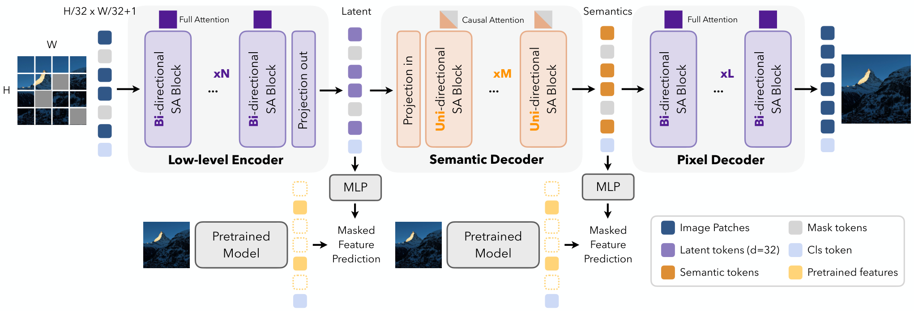

*原文 Figure 2：Figure 2 : The model architecture and the training objectives of MingTok . MingTok performs image compression, semantic decoding and image reconstruction sequentially through low-level encoder, semantic decoder, and pixel decoder. During training, both the image latent and the semantic features are supervised by pre-trained visual encoders with masked feature prediction, while the pixel decoder is trained by masked and unmasked image reconstruction. [查看图片来源](https://arxiv.org/html/2510.06590v1/0830-MingTok-structure.png)*

引用来源：arxiv_2608.02711

链接：[arXiv](https://arxiv.org/abs/2510.06590)

##### PartNeXt: A Next-Generation Dataset for Fine-Grained and Hierarchical 3D Part Understanding

作者：Penghao Wang, Yi He, Xin Lv, Yukai Zhou, Lan Xu, Jingyi Yu, Jia-Yuan Gu

研究角色：背景与上下文工作
任务标签：context

中文简介：

PartNeXt并非提出新模型，而是发布一个下一代三维部件理解数据集，旨在解决现有数据集缺乏纹理、标注依赖专家且粒度粗糙的问题。该数据集包含超过23,000个带有细粒度分层部件标签的高质量纹理三维模型。通过基准测试发现，现有SOTA方法在细粒度部件分割和开放词汇部件接地问答上仍存在显著差距。PartNeXt通过提供可扩展、纹理感知的标注，为结构化三维理解研究提供了更高质量的数据基础，推动了部件级认知能力的发展。

*原文 Figure 2：Figure 2 : Illustration of our annotation interface . The example shows a microwave containing an internal tray. The dual-panel layout allows annotators to first label external parts such as the “door” (as shown in the right panel with already segmented meshes), and then proceed to annotate internal components like the “tray” (visible in the unsegmented mesh in the left panel). This design effectively mitigates occlusion issues during annotation. [查看图片来源](https://arxiv.org/html/2510.20155v3/dataset_anno_sys_design.png)*

引用来源：arxiv_2608.02711

链接：[arXiv](https://arxiv.org/abs/2510.20155)

##### Towards Scalable and Consistent 3D Editing

作者：Ruihao Xia, Yang Tang, Pan Zhou

研究角色：背景与上下文工作
任务标签：context

中文简介：

该论文聚焦三维资产编辑任务，输入为现有3D资产及编辑指令，输出修改后的几何或外观一致资产。核心方法提出3DEditFormer，一种保持3D结构的条件Transformer，通过双重引导注意力和时间自适应门控，无需辅助3D掩码即可解耦可编辑区域与保留结构。与前序依赖手动掩码或易产生几何畸变的方法不同，该工作结合大规模配对数据集3DEditVerse，实现了高精度、多视图一致的规模化编辑，确立了实用化3D编辑的新标准。

*原文 Figure 2：Figure 2: Overview of our data generation pipeline for text-guided 3D editing. Starting from a large-scale Vocabulary Set, we employ multiple foundation models in a carefully orchestrated manner and construct the text-to-image-to-3D lifting pipeline. [查看图片来源](https://arxiv.org/html/2510.02994v1/label_vis.png)*

引用来源：arxiv_2608.02711

链接：[arXiv](https://arxiv.org/abs/2510.02994)

##### AnchorFlow: Training-Free 3D Editing via Latent Anchor-Aligned Flows

作者：Zhen Zhou, Fan Ma, Chengzhuo Gui, Xiaobo Xia, Hehe Fan, Yi Yang, Tat-Seng Chua

研究角色：背景与上下文工作
任务标签：context

中文简介：

该论文解决无需训练的三维资产编辑任务，输入为源三维形状及人类指令，输出为修改后的三维资产。核心方法范式是基于潜在锚点对齐的流匹配，通过建立源与目标轨迹间共享的全局潜在锚点，并施加松弛对齐损失，确保编辑过程中的几何稳定性与语义忠实度。区别于依赖掩码监督或易受噪声干扰的前序方法，该方法在无掩码条件下有效保持了几何保真度，实现了更显著且结构稳健的语义修改。

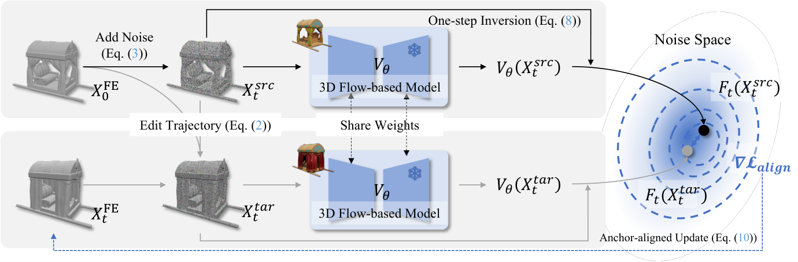

*原文 Figure 2：Figure 3 : Overview of the AnchorFlow for Training-free and Mask-free 3D Editing. Given a source model and an editing instruction, AnchorFlow first constructs the source sample 𝑿 t src \bm{X}^{\mathrm{src}}_{t} and forms the editing sample 𝑿 t FE \bm{X}^{\mathrm{FE}}_{t} at the t t step. A 3D flow-based model 𝒗 θ \bm{v}_{\theta} predicts velocity fields for both the source and target sample. To stabilize the editing process, AnchorFlow performs a single-step inversion to approximate the latent anchors F t ​ ( 𝑿 t src ) F_{t}(\bm{X}^{\mathrm{src}}_{t}) and F t ​ ( 𝑿 t tar ) F_{t}(\bm{X}^{\mathrm{tar}}_{t}) , and aligns them in noise space via the anchor-aligned update guided by ∇ ℒ align \nabla\mathcal{L}_{\mathrm{align}} . This design enforces consistent latent anchors, mitigates geometric distortions, and produces structurally stable 3D edits. [查看图片来源](https://arxiv.org/html/2511.22357v1/framework_v2.png)*

引用来源：arxiv_2608.02711

链接：[arXiv](https://arxiv.org/abs/2511.22357)

##### NaTex: Seamless Texture Generation as Latent Color Diffusion

作者：Zeqiang Lai, Yunfei Zhao, Zi-Bo Zhao, Xin Yang, Xin Huang, Jingwei Huang, Xiangyu Yue, Chunchao Guo

研究角色：背景与上下文工作
任务标签：context

中文简介：

NaTex解决原生三维纹理生成任务，输入为三维几何信息，输出为与其精确对齐的纹理颜色。核心范式是将纹理视为密集颜色点云，采用潜在颜色扩散模型，包含几何感知颜色点云VAE和多控制扩散Transformer。不同于依赖多视图扩散模型烘焙2D图像的传统方法，NaTex直接从3D数据训练，通过原生几何控制（位置嵌入和几何潜变量）提供细粒度表面指导。这种方法有效解决了遮挡区域修复、边界对齐及跨视图一致性难题，显著提升了纹理相干性。

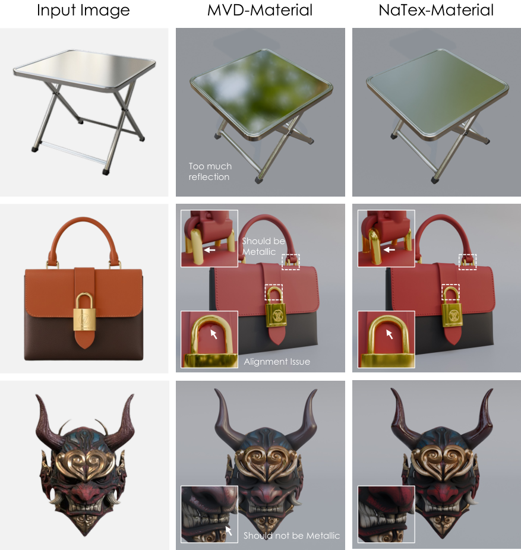

*原文 Figure 12：Figure 13 : Visual comparison between our NaTex material generation pipeline and a conventional MVD-based material pipeline. Our method produces more accurate and better-aligned materials compared to prior approaches. [查看图片来源](https://arxiv.org/html/2511.16317v1/material_cmp.png)*

引用来源：arxiv_2608.02711

链接：[arXiv](https://arxiv.org/abs/2511.16317)

##### Native 3D Editing with Full Attention

作者：Weiwei Cai, Shuangkang Fang, Wei-Cai Ye, Xin Dong, Yunhan Yang, Xuan-Yang Zhang, Wei Cheng, Yanpei Cao, Gang Yu, Tao Chen

研究角色：背景与上下文工作
任务标签：context

中文简介：

该研究针对指令引导的三维编辑任务，输入为三维资产及编辑指令，输出为编辑后的三维对象。核心方法是原生三维前馈框架，直接在单次高效传递中操作三维表示，避免了优化方法的缓慢和多视图2D提升方法的几何不一致。通过构建大规模多模态数据集，并探索交叉注意力与三维令牌拼接两种条件策略，发现后者在参数效率和性能上更优。该方法在生成质量、三维一致性及指令遵循度上超越了现有的2D提升路线。

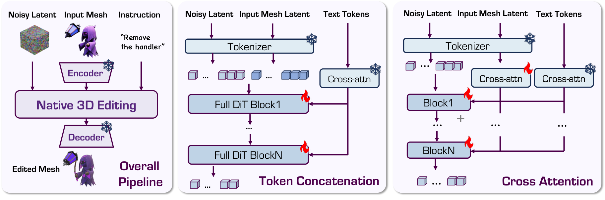

*原文 Figure 2：Figure 2: Overview of our proposed framework for native 3D editing. The pipeline manipulates 3D objects based on textual instructions, utilizing token concatenation as a parameter-efficient alternative to cross-attention, achieving superior editing performance without additional complexity. [查看图片来源](https://arxiv.org/html/2511.17501v1/framework.png)*

引用来源：arxiv_2608.02711

链接：[arXiv](https://arxiv.org/abs/2511.17501)

##### Part-X-MLLM: Part-aware 3D Multimodal Large Language Model

作者：Chunshi Wang, Junliang Ye, Yunhan Yang, Yang Li, Zizhuo Lin, Jun-Yan Zhu, Zhuo Chen, Yawei Luo, Chunchao Guo

研究角色：背景与上下文工作
任务标签：context

中文简介：

Part-X-MLLM是一个原生三维多模态大语言模型，解决三维场景理解及部件级编辑规划任务。输入为RGB点云和自然语言提示，输出为编码部件边界框、语义描述及编辑命令的结构化程序令牌序列。核心方法采用双编码器架构解耦结构与语义，并通过自回归生成统一接口驱动下游几何模块。与前序仅关注整体理解或独立生成的模型不同，它通过结构化语法将符号规划与几何合成分离，在接地问答、组合生成及局部编辑任务中实现了统一的SOTA性能。

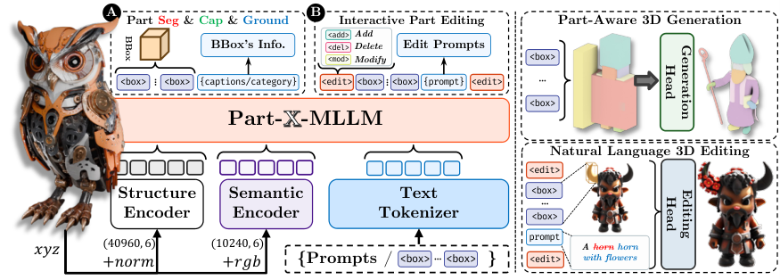

*原文 Figure 2：Figure 2: The Part-X-MLLM Framework. Our pipeline begins by encoding geometry and appearance features separately using a dual-encoder architecture, which are then fused together with text prompts. These combined features are passed to an autoregressive decoder that generates a program-like token sequence representing a plan (e.g., bounding boxes, edit commands). Finally, specialized geometry heads execute this plan to enable part-aware generation and editing. [查看图片来源](https://arxiv.org/html/2511.13647v1/pipeline.png)*

引用来源：arxiv_2608.02711

链接：[arXiv](https://arxiv.org/abs/2511.13647)

##### Feedforward 3D Editing via Text-Steerable Image-to-3D

作者：Ziqi Ma, Hongqiao Chen, Yisong Yue, Georgia Gkioxari

研究角色：背景与上下文工作
任务标签：context

中文简介：

Steer3D解决图像生成三维资产的文本可控编辑任务，接收初始图像和文本指令，输出符合描述的三维模型。其核心范式借鉴ControlNet，通过前馈方式将文本控制直接添加到预训练的图像到三维生成模型中，并采用流匹配训练和直接偏好优化（DPO）的两阶段训练策略。相较于需要迭代优化的竞争方法，Steer3D在保持与原始资产一致性的同时，更忠实地遵循语言指令，且推理速度显著提升，实现了高效的文本 steerability。

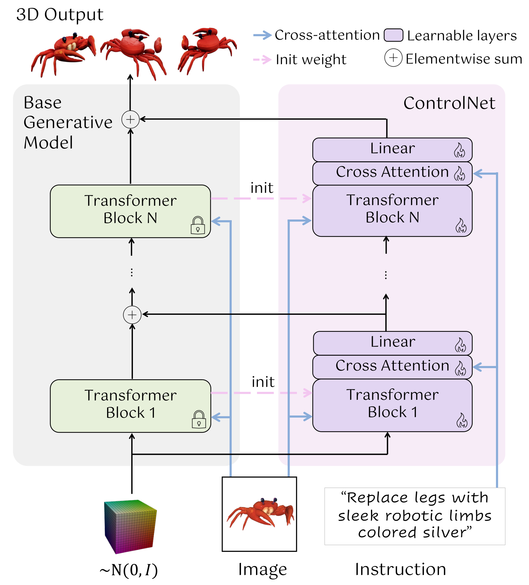

*原文 Figure 2：Figure 3 : Steer3D architecture: we design a ControlNet-based architecture to leverage the shape and geometry prior of pretrained image-to-3D generative models. We add a trainable ControlNet block corresponding to each transformer block in the base model. [查看图片来源](https://arxiv.org/html/2512.13678v1/controlnet.png)*

引用来源：arxiv_2608.02711

链接：[arXiv](https://arxiv.org/abs/2512.13678)

##### LATTICE: Democratize High-Fidelity 3D Generation at Scale

作者：Zeqiang Lai, Yunfei Zhao, Zi-Bo Zhao, Haolin Liu, Qin Lin, Jingwei Huang, Chunchao Guo, Xiangyu Yue

研究角色：背景与上下文工作
任务标签：context

中文简介：

LATTICE旨在解决大规模高保真三维资产生成任务，输入为文本等条件，输出为高质量三维网格或表示。其核心采用VoxSet半结构化表示，将三维资产压缩为锚定在粗体素网格上的紧凑潜向量集，并结合两阶段流程：先生成稀疏体素几何锚点，再通过整流流Transformer生成细节。相较于传统方法，VoxSet引入显式结构以支持位置嵌入和令牌级测试时扩展，填补了三维生成在质量与可扩展性上与二维模型间的差距。

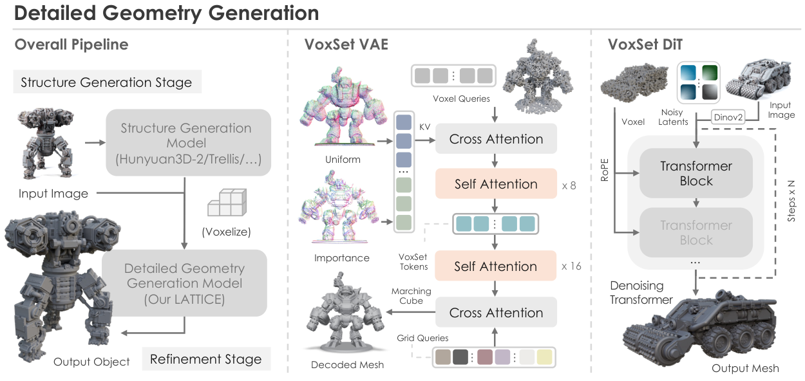

*原文 Figure 4：Figure 5 : LATTICE Model Architecture : it features a two-stage coarse-to-fine pipeline and a novel VoxSet VAE and DiT. [查看图片来源](https://arxiv.org/html/2512.03052v1/shape_arch.png)*

引用来源：arxiv_2608.02711

链接：[arXiv](https://arxiv.org/abs/2512.03052)

##### MoCA: Mixture-of-Components Attention for Scalable Compositional 3D Generation

作者：Zhiqi Li, Wenhuan Li, Tengfei Wang, Zhenwei Wang, Jun-Tao Wu, Haoyuan Wang, Yunhan Yang, Zehuan Huang, Yang Li, Peidong Liu, Chunchao Guo

研究角色：背景与上下文工作
任务标签：context

中文简介：

MoCA旨在解决可扩展的组合式三维生成任务，输入文本或图像条件，输出由多个部件组成的复杂三维对象或场景。其核心方法是引入混合组件注意力机制，通过基于重要性的组件路由选择Top-k相关组件进行稀疏全局注意力计算，并压缩非重要组件以保留上下文先验。这克服了现有部件感知方法因全局注意力二次复杂度导致的扩展性瓶颈，实现了高效、细粒度的组合式三维资产生成，在对象和场景生成任务上均优于基线。

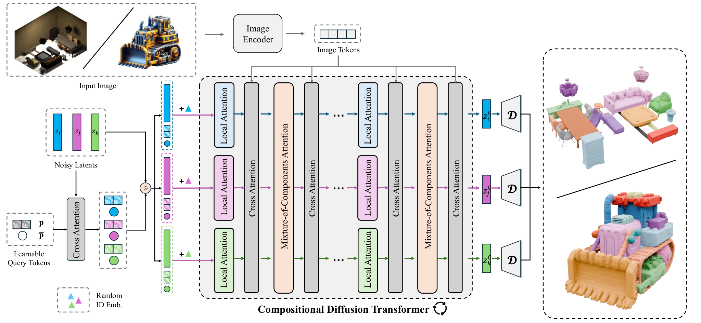

*原文 Figure 1：Figure 2: Overview of MoCA . Our DiT model starts with packing each component’s latents using several learnable queries through a cross-attention layer. Random ID embeddings are applied to distinguish different components. Then, each component’s full latents and compressed version are fed into our DiT model, which is comprised with interleaved local attention blocks and our proposed Mixture-of-Components Attention blocks. Finally, the clean latents of all components are separately decoded to the global space by a frozen shape decoder to form the final 3D asset. [查看图片来源](https://arxiv.org/html/2512.07628v1/pipeline.png)*

引用来源：arxiv_2608.02711

链接：[arXiv](https://arxiv.org/abs/2512.07628)

##### DreamReward-X: Boosting High-Quality 3D Generation with Human Preference Alignment.

作者：Fang-Fu Liu, Junliang Ye, Yikai Wang, Han-Yang Wang, Zhengyi Wang, Jun Zhu, Yue-Qi Duan

研究角色：背景与上下文工作
任务标签：context

中文简介：

DreamReward-X解决文本驱动3D生成中与人类偏好对齐的任务，输入为文本提示，输出高质量3D资产。核心方法构建Reward3D奖励模型，利用专家比较数据训练，并通过DreamFL算法优化预训练分布以匹配用户偏好。区别于最大似然估计导致的多样性受限，该方法引入奖励感知噪声采样策略（DreamReward++），有效弥合了DDIM与SDS优化间的差距。它在实例级优化层面提升了生成质量，确保结果更符合人类审美与语义预期。

*原文 Figure 1：原文图不可访问：该论文只有 DOI/出版社记录，未找到公开原文图。 [查看图片来源](10.1109/TPAMI.2025.3609680)*

引用来源：arxiv_2608.02711

##### OmniGen2: Exploration to Advanced Multimodal Generation

作者：Chen-Yuan Wu, Peng-Fei Zheng, Ruiran Yan, Shitao Xiao, Xin Luo, Yueze Wang, Wanli Li, Xiyan Jiang, Yexin Liu, Junjie Zhou, Ze Liu, Ziyi Xia, Chaofan Li, Haoge Deng, Jia-Hao Wang, Kun Luo, Bo Zhang, Defu Lian, Xinlong Wang, Zhongyuan Wang, Tiejun Huang, Zheng Liu

研究角色：背景与上下文工作
任务标签：context

中文简介：

由于提供的摘要内容为空，无法依据给定材料提取该论文的具体任务输入输出、核心方法范式及其在领域中的位置。根据标题推测其可能涉及高级多模态生成探索，但在缺乏具体实验描述、方法细节及对比分析的情况下，无法按照综述要求撰写符合字数限制且内容准确的介绍。建议补充完整摘要或正文关键段落，以便准确归纳其在统一多模态模型或生成任务中的具体贡献与技术路线差异。

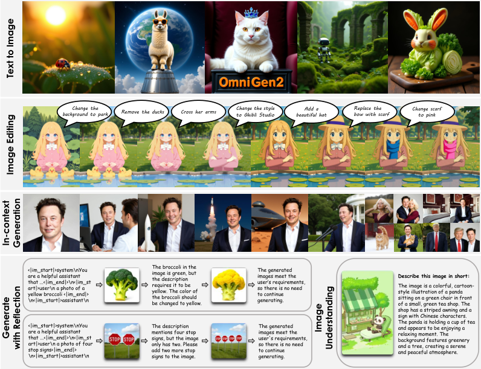

*原文 Figure 1：Figure 1 : Overview of versatile abilities of OmniGen2. [查看图片来源](https://arxiv.org/html/2506.18871v4/omnigen2_overview_new.png)*

引用来源：arxiv_2608.02711

##### 2026

##### CG-MLLM: Captioning and Generating 3D content via Multi-modal Large Language Models

作者：Junming Huang, Chi Wang, Le-Tian Li, Guang-Kai Xu, Dong-Lin Huang, Hao Chen, Qiang Dai, Weiwei Xu

研究角色：背景与上下文工作
任务标签：context

中文简介：

CG-MLLM是一个统一多模态大语言模型，同时处理三维描述生成和高保真三维资产生成任务。它采用混合Transformer架构，解耦词元级和块级自回归处理，将预训练视觉语言主干与专用三维VAE潜空间集成，实现标准词元与空间块的长上下文交互。区别于仅生成低分辨率网格或粗略代理的现有方法，CG-MLLM在单一框架内实现了高分辨率三维内容创作，且生成能力的学习反过来增强了模型的图像基三维理解能力。

*原文 Figure 1：Figure 1 : The Pipeline of CG-MLLM . Our multimodal architecture processes vision, text, and 3D spatial inputs to generate text and 3D spatial outputs. It features a TokenAR Transformer for sequential next-token prediction and a BlockAR Transformer for efficient parallel block prediction, both governed by strict causal masking. [查看图片来源](https://arxiv.org/html/2601.21798v2/cgmllm_pipeline.png)*

引用来源：arxiv_2608.02711

链接：[arXiv](https://arxiv.org/abs/2601.21798)

##### FACE: A Face-based Autoregressive Representation for High-Fidelity and Efficient Mesh Generation

作者：Hanxiao Wang, Yuan Guo, Ying-Tian Liu, Ziyi Zou, Biao Zhang, Weize Quan, Ding Liang, Yan-Pei Cao, Dong-Ming Yan

研究角色：背景与上下文工作
任务标签：context

中文简介：

FACE针对高保真网格生成中自回归模型序列过长导致计算成本高昂的问题。它重构了建模范式，提出“一面一词元”策略，将三角形面片作为基本单元进行自回归建模，从而将序列长度缩减九倍，实现极高的压缩率。结合VecSet编码器，FACE在保证重建质量的同时大幅提升了效率，并支持潜在扩散模型进行单图到网格的生成。与前序逐顶点生成的方法相比，FACE在语义层级上进行了优化，降低了高质量结构化三维内容创建的门槛。

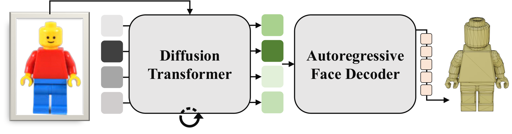

*原文 Figure 2：Figure 3 : Overview of our image-to-mesh generation pipeline. We first use the input image to condition a DiT model. The resulting latent VecSet is then fed into the Autoregressive Face Decoder to produce the final mesh. [查看图片来源](https://arxiv.org/html/2603.01515v2/diffusion_1114_gyc.png)*

引用来源：arxiv_2608.02711

链接：[arXiv](https://arxiv.org/abs/2603.01515)

##### LATO: 3D Mesh Flow Matching with Structured TOpology Preserving LAtents

作者：Tianhao Zhao, You-Jia Zhang, Hang Long, Jin-Sheng Zhang, Wen-Bing Li, Yang Yang, Gongbo Zhang, Jozef Hladký, Matthias Nießner, Wei Yang

研究角色：背景与上下文工作
任务标签：context

中文简介：

LATO旨在解决显式三维网格的高效生成任务，输入为隐空间噪声或条件信号，输出拓扑结构良好的高质量网格。其核心范式是提出一种保持拓扑的潜表示，利用稀疏体素VAE将顶点位移场压缩为结构化体素潜变量，并通过两阶段流匹配过程合成几何与拓扑。区别于传统基于等值面提取或自回归的方法，LATO直接预测边连接以恢复拓扑，避免了启发式网格化，在保持复杂几何细节的同时显著提升了推理效率。

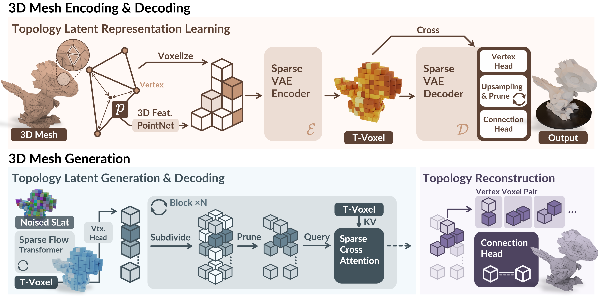

*原文 Figure 2：Figure 3 : Overview of the LATO pipeline. We explicitly encode mesh topology by sampling surface points infused with relative displacement to their enclosing face vertices (Vertex Displacement Field, VDF). These dense features are aggregated and compressed via a sparse voxel VAE into a structured latent representation, termed T-Voxels . To reconstruct the mesh, the T-Voxels undergo hierarchical subdivision and learnable pruning to precisely instantiate high-resolution vertex locations. Simultaneously, a connection head predicts edge existence between vertex pairs, directly recovering the explicit mesh topology. [查看图片来源](https://arxiv.org/html/2603.06357v1/figures/pipeline.png)*

引用来源：arxiv_2608.02711

链接：[arXiv](https://arxiv.org/abs/2603.06357)

##### Image Generators are Generalist Vision Learners

作者：Valentin Gabeur, Shangbang Long, Songyou Peng, P. Voigtlaender, Shuyang Sun, Yanan Bao, Karen Truong, Zhicheng Wang, Wenlei Zhou, J. Barron, Kyle Genova, Nithish Kannen, Sherry Ben, Yandong Li, Mandy Guo, Suhas Yogin, Yiming Gu, Huizhong Chen, Oliver Wang, Saining Xie, Howard Zhou, Kaiming He, T. Funkhouser, Jean-Baptiste Alayrac, Radu Soricut

研究角色：背景与上下文工作
任务标签：context

中文简介：

Vision Banana证明图像生成器可作为通用视觉学习者，通过将分割、深度估计等2D及3D理解任务参数化为RGB图像生成，实现统一接口。核心方法是对Nano Banana Pro进行轻量级指令微调，混合原始生成数据与少量视觉任务数据。区别于传统专用模型，它在保持强大图像生成能力的同时，在多种视觉理解任务上达到最先进水平，表明生成式预训练能涌现出强大的跨模态理解能力，为统一视觉模型提供新范式。

*原文 Figure 30：Figure 8 : Comparison with SOTA surface normal estimation method Lotus-2 ( He et al., 2025 ) . Results of Lotus-2 are obtained using its Hugging-Face demo: https://huggingface.co/spaces/haodongli/Lotus-2_Normal . Vision Banana can produce surface normal map with much higher visual quality and better fine-grained details. Zoom-in for the details. [查看图片来源](https://arxiv.org/html/2604.20329v3/assets/surface_normal/sn_1_in.jpg)*

引用来源：arxiv_2608.02711

链接：[arXiv](https://arxiv.org/abs/2604.20329)

##### Prox-E: Fine-Grained 3D Shape Editing via Primitive-Based Abstractions

作者：Etai Sella, Hao Phung, Nitay Amiel, O. Litany, Or Patashnik, Hadar Averbuch-Elor

研究角色：背景与上下文工作
任务标签：context

中文简介：

Prox-E面向细粒度3D形状编辑任务，输入3D形状与文本指令，输出局部结构修改后的形状。核心方法是通过基于图元的几何抽象，将输入形状分解为紧凑图元集，利用预训练视觉语言模型编辑图元以指定变化，再指导3D生成模型实现修改。这是一种无需训练的框架，区别于依赖2D图像编辑提升的流水线，它通过显式几何抽象平衡身份保持与指令忠实度，有效解决局部结构变更中的整体一致性难题。

*原文 Figure 1：Figure 1. We introduce Prox ⋅ \cdot E, a training-free 3D editing framework that operates on a primitive-based geometric abstraction. By editing this proxy representation (second and bottom rows; edited primitives shown in blue , added ones shown in purple ) and using it to guide 3D generation, Prox ⋅ \cdot E enables precise, fine-grained edits while preserving the object’s identity. As illustrated above, our method supports a wide range of text-guided edits, spanning global and localized geometric transformations (edits 1 and 2) including parametric edits (edits involving a numeric parameter, i.e. edit 2), addition and removal of object parts (edit 3), and stylistic appearance-based modifications (edit 4). [查看图片来源](https://arxiv.org/html/2604.23774v2/teaser_double.png)*

引用来源：arxiv_2608.02711

链接：[arXiv](https://arxiv.org/abs/2604.23774)

##### CubePart: An Open-Vocabulary Part-Controllable 3D Generator

作者：Yiheng Zhu, Kangle Deng, J. Fauconnier, Iñaki Navarro, Daiqing Li, Ava Pun, Yinan Zhang, Peiye Zhuang, Xiaoxia Sun, Maneesh Agrawala, K. Bhat, Tinghui Zhou

研究角色：背景与上下文工作
任务标签：context

中文简介：

CubePart解决开放词汇下部件可控的三维生成任务，输入全局文本提示和用户定义的部件 schema，输出符合语义结构的组合网格。核心方法采用两阶段架构，分离全局形状合成与部件级解码，并将部件结构作为显式推理控制信号。区别于生成单体网格或任意分解的前序模型，CubePart强调显式语义部件建模，生成的资产可直接用于游戏引擎动画与物理模拟，无需后期处理，是部件结构化生成类别中满足交互式应用需求的典型代表。

*原文 Figure 2：Figure 2. Overview. We propose a two-stage framework to generate part-controllable 3D objects conditioned on a global text prompt and a part schema. (a) Single Mesh Generation synthesizes a holistic shape latent using a Multi-Modal DiT (MM-DiT) ( Esser et al., 2024 ) , conditioned on the prompt and schema encoded by Qwen-VL ( Bai et al., 2023 ) . (b) Multi-Mesh Generation takes the full shape latent from Stage 1 and decomposes it into distinct part latents. To achieve this, we initialize with the MM-DiT weights from Stage 1 and inject Cross-Part Attention Residual Blocks to enable structural interaction among parts. [查看图片来源](https://arxiv.org/html/2605.28763v1/method.png)*

引用来源：arxiv_2608.02711

链接：[arXiv](https://arxiv.org/abs/2605.28763)

##### EVA01: Unified Native 3D Understanding and Generation via Mixture-of-Transformers

作者：Zongyuan Yang, Ming Yi, Wanli Ma, C. Fan, Bocheng Li, Baolin Liu, Yuke Lou, Yingde Song, Yongping Xiong, Zheng-Dong Guo, Shixuan Wang

研究角色：背景与上下文工作
任务标签：context

中文简介：

EVA01旨在解决将3D网格作为原生模态集成到多模态大语言模型中的问题，支持3D理解、生成及上下文感知编辑。其核心采用混合Transformer架构，解耦为预训练的理解专家与结构镜像的生成专家，通过共享全局自注意力与硬模态路由耦合。该方法直接将MLLM语义潜空间与几何流形对齐，无需中间2D表示，区别于将3D视为外部输出的现有方法，实现了高保真文本到3D生成及身份保持的长上下文编辑。

*原文 Figure 2：Figure 3 : Data Curation Pipeline of EVA01. (Left) Static 3D Asset Curation: We standardize raw 3D assets through geometric canonicalization, aesthetic filtering, and multi-view dense captioning to construct high-quality text-image-mesh triplets. (Right) Interleaved Editing Sequences: To enable context-aware editing, we synthesize multi-turn sequences via two complementary pathways: Procedural Editing (top right) utilizing rigid transformations and animation keyframes for structural precision, and Semantic Editing (bottom right) leveraging 2D generative priors for open-ended stylistic modification. [查看图片来源](https://arxiv.org/html/2605.16745v1/fig-data-pipeline.png)*

引用来源：arxiv_2608.02711

链接：[arXiv](https://arxiv.org/abs/2605.16745)

##### Feedforward 3D Editing Learns from Semantic-Part Transformation

作者：Jiawei Weng, Saining Zhang, Zhenxin Diao, Peishuo Li, Henghaofan Zhang, Junhao Chen, Hao Zhao

研究角色：背景与上下文工作
任务标签：context

中文简介：

PartFlow旨在实现可扩展的前馈三维编辑，输入源三维资产和编辑指令，输出编辑后资产。针对高质量配对数据匮乏问题，该方法提出从语义部件变换中学习，构建Pxform数据集并提供源感知潜控制。核心范式是将编辑接地于语义三维部件，引入掩码感知速度保持和渲染空间一致性监督。区别于依赖训练-free优化或狭窄编辑分类的现有路线，PartFlow通过前馈网络直接预测编辑结果，在保证几何一致性的同时大幅提升编辑效率和语义准确性。

*原文 Figure 4：Figure 4. Overview of PartFlow. PartFlow introduces ControlNet-style source-latent injection into the two-stage TRELLIS editing process: Stage 1 controls coarse sparse-structure editing, while Stage 2 refines SLat-level geometry and appearance. During training, ground-truth edit masks impose a velocity-space preservation loss on unedited regions, while edited regions are supervised by the standard flow objective. A Stage-2 render-space loss further aligns the Gaussian-rendered output with the target editing view. A two-stage ControlNet-style 3D editing architecture. The first stage edits sparse-structure latents with source voxel control, and the second stage edits SLat representations with source SLat control, mask-aware losses, and render-space supervision. [查看图片来源](https://arxiv.org/html/2605.27351v5/PartFlow.png)*

引用来源：arxiv_2608.02711

链接：[arXiv](https://arxiv.org/abs/2605.27351)

##### GEM: Generative Supervision Helps Embodied Intelligence

作者：Ruowen Zhao, Bangguo Li, Zuyan Liu, Yi-Nan Liang, Junliang Ye, Fang-Fu Liu, Diankun Wu, Zhengyi Wang, Xu-Min Yu, Yongming Rao, Han Hu, Jun Zhu

研究角色：背景与上下文工作
任务标签：context

中文简介：

GEM针对具身智能模型缺乏低层空间物理知识的问题，输入多模态感官数据，输出动作规划及深度图。核心范式是在视觉语言模型预训练中联合集成深度图生成任务，通过生成式监督弥合高层语义与底层执行间的鸿沟。区别于纯文本引导预训练，GEM通过引入深度监督增强了模型对物理环境的理解与操作能力，在具身基准测试中表现优异。虽主要面向具身智能，但其通过生成辅助理解的思想对三维场景理解模块的设计具有重要参考价值。

*原文 Figure 1：Figure 2: Architecture of GEM. GEM augments a VLM backbone with a DiT-based depth generator conditioned on the backbone’s final-layer visual tokens. We adopt a progressive training paradigm: (i) initialize the connector, (ii) warm up the depth generator, (iii) perform end-to-end joint training, and (iv) train an autoregressive action expert on GEM’s multimodal tokens. Building on GEM, the GEM-based VLA predicts continuous actions from these representations, improving robot manipulation. [查看图片来源](https://arxiv.org/html/2605.28548v1/fig2.png)*

引用来源：arxiv_2608.02711

链接：[arXiv](https://arxiv.org/abs/2605.28548)

##### PhysForge: Generating Physics-Grounded 3D Assets for Interactive Virtual World

作者：Yunhan Yang, Chunshi Wang, Junliang Ye, Yang Li, Zanxin Chen, Zehuan Huang, Yao Mu, Zhuo Chen, Chunchao Guo, Xihui Liu

研究角色：背景与上下文工作
任务标签：context

中文简介：

PhysForge解决交互式虚拟世界中具备物理属性的3D资产生成任务，输入功能逻辑，输出包含几何与运动学参数的高保真资产。核心采用两阶段框架：首先由视觉语言模型作为“物理架构师”规划分层物理蓝图，定义材料与运动约束；随后通过KineVoxel注入机制，由物理接地扩散模型实现蓝图。区别于仅关注静态几何的现有方法，该模型强调功能逻辑与分层物理，生成功能合理且可直接用于仿真的资产。

*原文 Figure 1：Figure 2 : Method overview. PhysForge consists of two stages: (Left) Stage 1: VLM-based Planning, where the VLM planner generates a “Hierarchical Physical Blueprint” defining part structure and physical properties. (Right) Stage 2: Diffusion-based Generation, where a diffusion model, guided by the blueprint, uses the KineVoxel Injection (KVI) mechanism to synergistically generate the final geometry, texture, and precise kinematic parameters. [查看图片来源](https://arxiv.org/html/2605.05163v1/pipeline.png)*

引用来源：arxiv_2608.02711

链接：[arXiv](https://arxiv.org/abs/2605.05163)

##### Velocity-Space 3D Asset Editing

作者：Haopu Liu, Yuxuan Lin, Jingfeng Guo, Ruihang Chu, Junjie Wang, Ruo-Tong Li, Yujiu Yang

研究角色：背景与上下文工作
任务标签：context

中文简介：

VS3D针对3D资产局部编辑任务，输入原有资产与编辑指令，输出修改后的资产并严格保持未编辑区域一致性。核心方法是在ODE采样器内部进行速度场干预，无需训练、反转或掩码。通过重建锚定源注入吸收身份泄漏，利用部分均值引导放大编辑信号，解决单一速度场难以兼顾编辑强度与身份保持的问题。区别于依赖外部掩码或2D提升的方法，它直接从生成机制源头解决局部编辑中的身份漂移难题。

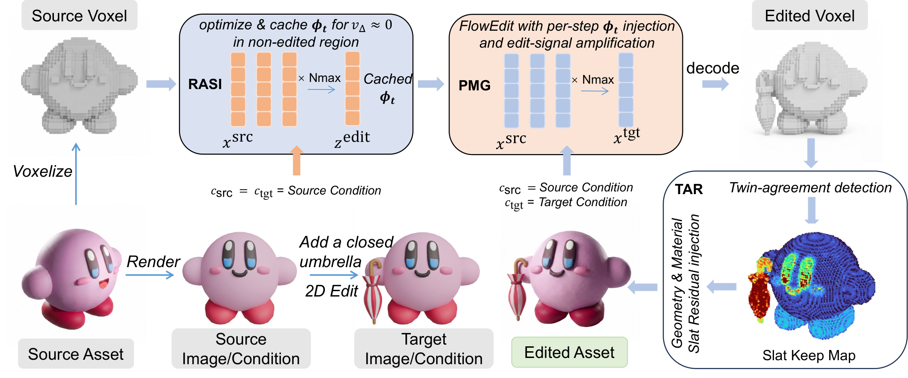

*原文 Figure 1：Figure 1: Overview of the VS3D pipeline. A source 3D asset is rendered and 2D-edited to obtain the condition. Stage 1 operates on the dense occupancy latent: RASI (§ 3.2 ) optimises a per-step ϕ t \phi_{t} to suppress v Δ v_{\Delta} on non-edited regions, and PMG (§ 3.3 ) amplifies the edit signal via subsample extrapolation. Stages 2–3 handle sparse geometry and material SLATs: TAR (§ 3.4 ) computes a token-wise p keep p_{\mathrm{keep}} map (blue = preserve, red = edit) and injects source residuals accordingly to produce the final edited asset. [查看图片来源](https://arxiv.org/html/2605.07385v1/pipeline.png)*

引用来源：arxiv_2608.02711

链接：[arXiv](https://arxiv.org/abs/2605.07385)

##### MeshFlow: Efficient Artistic Mesh Generation via MeshVAE and Flow-based Diffusion Transformer

作者：Wei-Yu Li, Antoine Toisoul, Tom Monnier, Roman Shapovalov, Rakesh Ranjan, Ping Tan, Andrea Vedaldi

研究角色：背景与上下文工作
任务标签：context

中文简介：

MeshFlow旨在高效生成艺术家级别的三维网格，输入隐含条件，输出高质量网格资产。针对自回归方法推理成本高且存在量化误差的痛点，该方法引入MeshVAE将连续顶点位置和离散连接性编码至紧凑的连续潜空间，并基于整流流Transformer进行并行生成。区别于传统离散词元预测，MeshFlow在潜空间中进行连续建模，生成速度比最快自回归基线快18倍，同时保持高精度，属于网格词元化与流匹配类别中兼顾效率与质量的代表性工作。

*原文 Figure 2：Figure 3 : Overview of our method. We first propose MeshVAE, which compresses vertices, vertex normals, and discrete adjacency relationships of a mesh into a continuous latent space. This is supervised by the ground-truth vertices and vertex normals, coupled with a contrastive learning approach applied to vertex adjacency. We then employ latent Rectified Flow based on the proposed representation, and finally pass the result through the Mesh Decoder to obtain a mesh. [查看图片来源](https://arxiv.org/html/2606.04621v2/overview_v1_1.png)*

引用来源：arxiv_2608.02711

链接：[arXiv](https://arxiv.org/abs/2606.04621)

##### PolyFlow: Continuous Topology Embedding Flow Matching for Artist-style Mesh Generation

作者：Chunshi Wang, Haohan Weng, Junliang Ye, Biwen Lei, Yang Li, Zi-Bo Zhao, Zeqiang Lai, Kai-Yi Zhang, Yunhan Yang, Zhuo Chen, Chunchao Guo, Yawei Luo

研究角色：背景与上下文工作
任务标签：context

中文简介：

PolyFlow致力于解决艺术家风格网格生成中自回归模型速度慢及连续扩散方法不兼容离散拓扑的问题。输入为点云特征，输出具有连续拓扑嵌入的三维网格。核心方法是通过紧凑拓扑嵌入器将离散顶点映射为连续状态空间，结合基于Transformer的流匹配框架进行并行去噪。与前序自回归路线相比，PolyFlow实现了完全并行生成，显著降低计算开销，并支持通过指定顶点数精确控制分辨率，代表了网格词元化与流匹配结合的高效生成新范式。

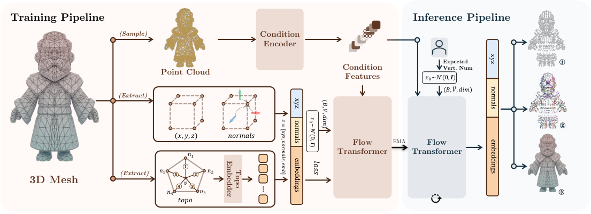

*原文 Figure 2：Figure 2: Overview of the PolyFlow pipeline. Left—Training: Given a 3D mesh, we sample a point cloud and encode it into condition features via a frozen condition encoder. Vertex positions ( x , y , z ) (x,y,z) , surface normals, and topology embeddings produced by a frozen topology embedder are concatenated to form the joint flow state 𝐳 = [ xyz , normals , emb ] \mathbf{z}=[\mathrm{xyz},\,\mathrm{normals},\,\mathrm{emb}] of shape ( B , V , D ) (B,V,D) . A Flow Transformer is trained to denoise 𝐳 \mathbf{z} from Gaussian noise 𝐱 0 ∼ 𝒩 ⁡ ( 𝟎 , 𝐈 ) \mathbf{x}_{0}\sim\mathcal{N}(\mathbf{0},\mathbf{I}) , conditioned on the point-cloud features. Right—Inference: The user specifies an expected vertex count V ^ \hat{V} ; we initialize V ^ \hat{V} tokens from noise of shape ( B , V ^ , D ) (B,\hat{V},D) and denoise them in parallel with the EMA copy of the Flow Transformer. The denoised output is split into three channel groups—➀ vertex positions, ➁ surface normals, and ➂ topology embeddings—from which edges and faces are decoded via spacetime distance thresholding to produce the final mesh. [查看图片来源](https://arxiv.org/html/2606.30673v1/Pipeline.png)*

引用来源：arxiv_2608.02711

链接：[arXiv](https://arxiv.org/abs/2606.30673)

##### EditVerse3D: High-Quality 3D Object Editing with Region-Aware Learning

作者：Youtan Yin, Yan-Ning Zhou, Jiacheng Wei, Xiaofeng Yang, Jun Zhang, Jiayang Bai, Jingwen Ye, Weidong Zhang, Guosheng Lin

研究角色：背景与上下文工作
任务标签：context

中文简介：

EditVerse3D解决粗粒度区域指导下的三维物体局部编辑任务，输入包括待编辑三维对象、粗略边界框及参考二维图像，输出高保真编辑结果。该方法引入区域感知自适应损失，平衡目标区域与保留区域的优化目标，并通过数据增强提升泛化性。区别于依赖精确掩码或完全编辑二维图像的前序方法，它更贴合人类自然交互习惯，允许模糊的区域指定，有效 bridging 了粗糙指导与高质量编辑之间的差距，在视觉质量和定量指标上均优于现有三维编辑方案。

*原文 Figure 1：Figure 1 : Editing results of our method. Given a 3D object, a user-specified coarse 3D bounding box indicating the target editing region, and an image prompt defining the editing goal, our approach generates high-quality, coherent edits. Our method does not require fully edited 2D views, precise 3D masks, or redundant pipelines. [查看图片来源](https://arxiv.org/html/2607.07187v1/teaser.png)*

引用来源：arxiv_2608.02711

链接：[arXiv](https://arxiv.org/abs/2607.07187)

##### TanGO: Training-Free 3D Editing via Tangent-Space Guidance and Optimization

作者：Si-Woo Lim, Sunjae Yoon, Gwanhyeong Koo, Hyeonseo Yun, C. D. Yoo

研究角色：背景与上下文工作
任务标签：context

中文简介：

TanGO针对基于流匹配的三维生成模型在无训练编辑中出现的语义伪影问题，输入为源三维资产和编辑指令，输出编辑后的资产。其核心方法是在生成动力学的切空间中进行自适应逐词元引导，通过计算源与目标速度场的方向差异来确定控制信号强度，实现选择性控制。与传统全局上下文编辑不同，TanGO无需额外训练即可有效减少结构坍塌等伪影，在保持未编辑区域一致性的同时精准执行变换，属于实例级优化类别中提升无训练编辑鲁棒性的创新工作。

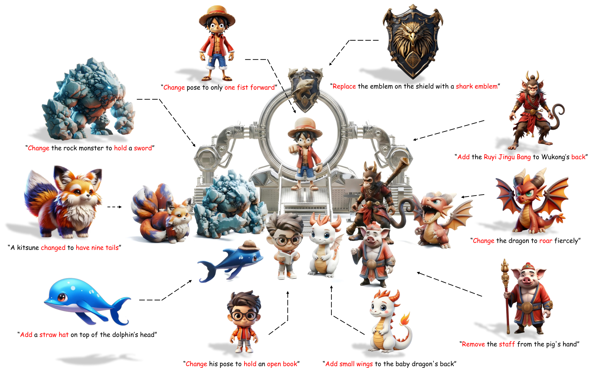

*原文 Figure 1：Figure 1 : Overview of 3D Editing Results. TanGO achieves precise localized edits across diverse categories, preserving unedited geometry and source identity. [查看图片来源](https://arxiv.org/html/2607.14927v1/fig1.png)*

引用来源：arxiv_2608.02711

链接：[arXiv](https://arxiv.org/abs/2607.14927)
