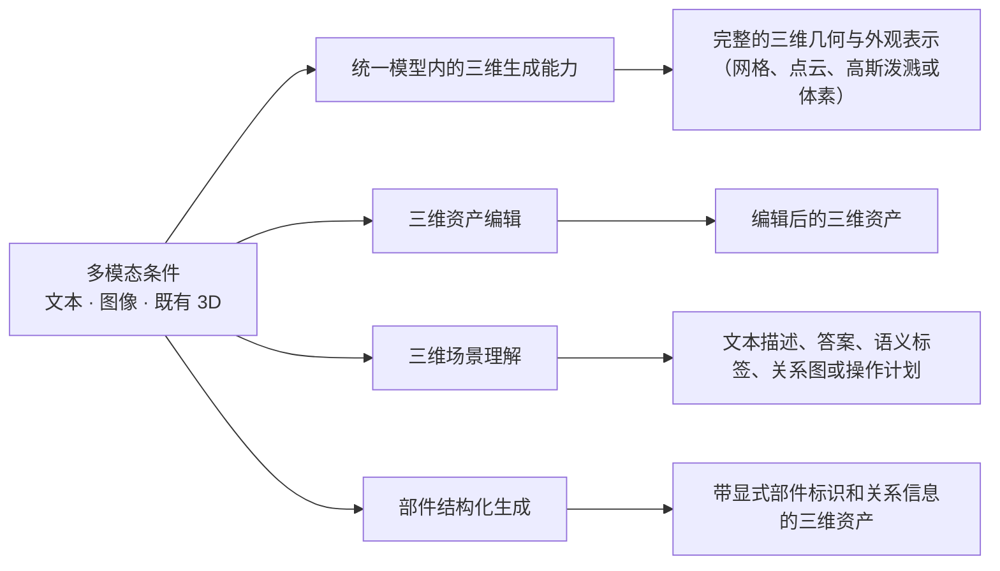
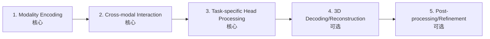
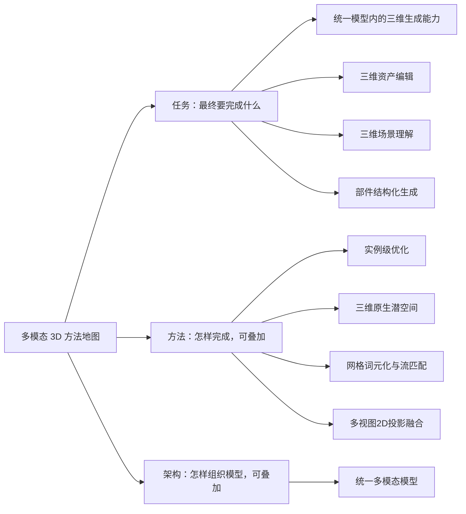
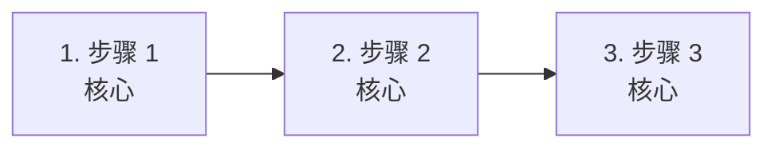
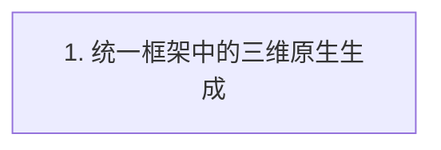
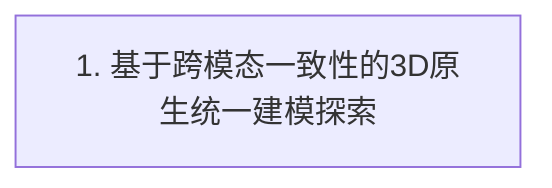
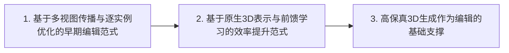
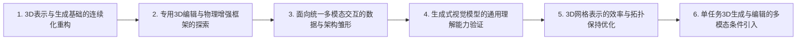

# Hunyuan3D-Buffalo：统一多模态3D生成、理解与编辑：快速理解

> 当前页面用于快速建立领域地图。 [逐篇解析（109 篇）](full/) · [BibTeX 与 DBLP 查询结果](bibliography/index.html) · [返回综述目录](../)

## 总述

### 一句话定义

本综述聚焦于统一3D多模态模型，旨在单一架构内实现三维资产与文本、图像的深度融合。区别于独立的生成或理解工具，主体研究强调跨模态交互的统一性：模型需同时具备对3D几何的感知（理解）、基于指令的修改（编辑）及条件合成（生成）能力。核心目标是打破模态壁垒，通过共享主干或潜在空间，实现从语义到几何的端到端映射，解决传统流水线中一致性差、交互割裂的问题，推动3D内容创作向智能化、一体化演进。

### 任务边界

### 快速要点

- **任务：** 任务涵盖三大核心维度：生成指依据非3D条件输出完整三维资产；编辑指在保持未变区域一致性的前提下，依指令修改现有资产；理解指将三维几何映射为自然语言描述、标签或结构化关系。三者需在统一模型中共享表征，实现跨任务的语义对齐与协同推理，而非孤立执行。
- **输入：** 输入包含三维模态（如点云、网格Mesh、高斯泼溅Gaussian Splatting或神经辐射场NeRF）及至少一种非三维模态（文本提示、参考图像或多视图）。在统一框架中，这些异构数据被编码为共享的特征序列或潜在向量，作为模型进行跨模态注意力交互的基础信号。
- **输出：** 输出取决于具体任务：生成任务输出新的三维几何与纹理表示；编辑任务输出修改后的三维资产，需保持几何拓扑连贯；理解任务输出文本描述、问答答案、部件语义标签或操作计划。所有输出均源自同一模型主干，确保语义与几何的高度一致性。
- **核心关注：** 异构模态在统一潜在空间中的语义对齐与几何一致性难以保证；高质量、大规模且带有精细编辑指令的3D多模态配对数据稀缺；统一模型在处理高分辨率3D资产时面临巨大的计算复杂度与显存瓶颈；前馈推理模式下难以兼顾局部编辑的精确性与全局结构的完整性；离散网格拓扑与连续扩散生成范式之间的内在表示冲突。
- **不纳入：** 本综述不总结独立的 text-to-3D、image-to-3D 或其他 standalone 3D generation；只有统一多模态模型内部的生成能力可以作为主体任务标签；只生成二维图像而不返回三维结果的工作；仅提供数据集、评测、压缩或底层表示而不完成上述任务的工作。

*面向读者：刚刚入学、了解 Transformer 等基础结构但不熟悉该细分领域的博士生；综述截止日期：2026-09-28。*

### 领域标准流程

下图只表达跨任务、跨论文的共同范式；标为可选的环节并非所有方法都包含。

## 分类

先按研究角色区分主体论文、相邻工作和背景工作；主体论文内部的任务标签可以多选。方法标签和架构标签可以叠加。

> **阅读提示：**“统一模型内的三维生成能力”只指统一多模态模型中的一个任务分支；独立的 text-to-3D、image-to-3D 和单任务 3D 生成器仍然只作为相邻或背景工作，不属于本综述主体。

### 任务维度

#### 统一模型内的三维生成能力（generation）

指模型接收文本、图像或其他非3D模态作为条件输入，直接输出完整的、无显式部件结构标注的三维资产（如网格 Mesh、高斯泼溅 Gaussian Splatting 或神经辐射场 NeRF）。在此综述契约下，仅当该生成能力是统一多模态模型的一部分，且模型同时具备理解或编辑等其他跨模态交互能力时，才归入主体论文；独立的 text-to-3D 或 image-to-3D 生成器仅作为相邻工作。

**核心范式：** Input: Text/Image prompts or semantic conditions; Output: Complete 3D asset (Mesh/Gaussian/NeRF); Mechanism: Mapping conditional embeddings to 3D geometry/appearance via diffusion, flow, or autoregressive processes within a shared backbone.

**典型输入：** 文本提示词、参考图像、语义条件向量

**典型输出：** 完整的三维几何与外观表示（网格、点云、高斯泼溅或体素）

**类别典型流程（非领域标准）：**

#### 三维资产编辑（editing）

指模型接收已有的三维资产以及文本或图像形式的编辑指令，输出修改后的三维资产。重点在于保持未编辑区域的几何一致性，同时准确执行语义或几何变更。在统一框架中，编辑通常复用生成模型的先验或通过共享的理解模块解析指令。

**核心范式：** Input: Existing 3D Asset + Edit Instruction (Text/Image); Output: Edited 3D Asset; Mechanism: Inversion into latent space, latent manipulation guided by multimodal features, or feed-forward transformation using shared priors.

**典型输入：** 源三维资产、编辑指令（文本或图像）

**典型输出：** 编辑后的三维资产

**类别典型流程（非领域标准）：**

#### 三维场景理解（understanding）

指模型接收三维资产作为输入，输出文本描述、问答答案、语义标签、部件关系或操作计划。在统一框架中，理解模块通常作为编码器或共享主干的一部分，为生成和编辑提供语义 grounding（接地）。

**核心范式：** Input: 3D Asset (and optional Text Query); Output: Text Description, Answer, Labels, or Plans; Mechanism: Encoding 3D geometry into tokens/features, processing via Multimodal LLM backbone, decoding into language or semantic structures.

**典型输入：** 三维资产、可选的文本查询

**典型输出：** 文本描述、答案、语义标签、关系图或操作计划

**类别典型流程（非领域标准）：**

#### 部件结构化生成（part_structured_generation）

指模型生成具有显式语义部件及其层级、连接或空间关系的三维资产。与普通生成不同，它强调结构的显式建模（如椅子腿、靠背的独立网格及连接关系）。在统一框架中，这通常结合了理解（语义分解）和生成（部件合成）的能力。

**核心范式：** Input: Text/Image Conditions; Output: 3D Asset with Explicit Semantic Parts and Relations; Mechanism: Coordinated generation of parts via multi-branch diffusion, autoregressive part assembly, or structured latent spaces grounded by multimodal understanding.

**典型输入：** 文本提示词、图像条件、语义结构约束

**典型输出：** 带显式部件标识和关系信息的三维资产

**类别典型流程（非领域标准）：**

### 方法维度

#### 实例级优化（instance_level_optimization）

指在推理或测试阶段，针对当前特定的输入实例（如特定的文本提示或3D资产），通过梯度下降等优化算法反复调整模型参数、潜变量或显式表示（如NeRF参数、Gaussian属性），以最小化多模态损失（如SDS损失）。

**核心范式：** Fix model weights; Optimize instance-specific representation/latent via iterative gradient descent on multimodal loss (e.g., SDS).

**典型输入：** 单一样本的条件输入（文本/图像）

**典型输出：** 优化后的3D表示

#### 三维原生潜空间（3d_native_latent_space）

指通过3D VAE等结构将3D数据压缩到低维潜空间，并在该潜空间中进行多模态交互、生成或编辑。潜变量由3D数据学习，主要变换发生在该空间，且可解码为3D资产。

**核心范式：** Encode 3D to Native Latent; Perform Multimodal Operations in Latent Space; Decode back to 3D.

**典型输入：** 3D资产或多模态条件

**典型输出：** 3D潜变量或解码后的3D资产

#### 网格词元化与流匹配（mesh_tokenization_flow）

指将3D网格的顶点、面片等几何元素离散化为词元（Tokens），并使用自回归模型或流匹配（Flow Matching）模型进行建模。这种方法旨在生成紧凑、生产友好的3D网格。

**核心范式：** Tokenize Mesh Geometry; Model Sequence via AR/Flow; Detokenize to Mesh.

**典型输入：** 3D网格数据

**典型输出：** 网格词元序列或重建的网格

#### 多视图2D投影融合（multiview_2d_projection_fusion）

指通过在多个2D视图上应用2D扩散模型或编辑工具，然后将这些2D结果融合或重建回3D资产的方法。常用于编辑或生成，依赖投影和重建的一致性。

**核心范式：** Render Multi-views; Apply 2D Model/Edit; Fuse/Reconstruct to 3D.

**典型输入：** 3D资产或初始猜测

**典型输出：** 融合后的3D资产

### 架构维度

#### 统一多模态模型（unified_multimodal_model）

指在一个单一的模型架构、共享主干或统一接口中，同时处理3D与至少一种非3D模态（文本、图像），并支持跨模态的理解、生成或编辑任务。核心特征是模态间的深度交互和参数共享。

**核心范式：** Single Backbone handling 3D and Non-3D Modalities; Shared Representations; Multi-task Capability (Understanding, Generation, Editing).

**典型输入：** 3D数据、文本、图像等多模态输入

**典型输出：** 跨模态的输出（3D资产、文本、标签等）

## 相关工作

本章不重复逐篇摘要，而是按照领域类别串起方法演化：先说明问题和范式，再说明代表工作如何改变方法，最后指出仍未解决的缺口。

### 统一模型内的三维生成能力（generation）

- **统一框架中的三维原生生成**：综合来看，已有方法依赖间接管线，先在二维编辑再通过优化提升到三维，导致三维几何一致性受损；同时高质量三维资产稀缺，使三维合成欠约束。；方法变化：这些摘要共同显示，Omni123 将文本、图像与三维表示为共享序列中的离散词元，用跨模态一致性作为隐式结构约束，在统一自回归框架中同时实现文本到二维和文本到三维生成，从而改变了过去分离处理二维与三维生成的做法。；代表论文：arxiv_2604.02289。

**读者应记住：** 本批材料仅能支撑：统一三维生成正在尝试把文本、图像与三维放进同一自回归框架，并以跨模态一致性弥补三维数据稀缺；但尚不能确认该模型已覆盖理解或编辑任务，训练与推理细节也需全文核验。

### 三维资产编辑（editing）

- **基于跨模态一致性的3D原生统一建模探索**：综合来看，现有方法在处理3D编辑与生成时，常因高质量3D资产稀缺而依赖间接的2D优化流程，牺牲了几何一致性，且难以在统一框架内有效约束3D结构。；方法变化：这些摘要共同显示，通过引入3D原生基础模型，将文本、图像和3D资产统一表示为共享序列中的离散token，利用跨模态一致性作为隐式结构约束，从而在单个自回归框架内统一处理生成任务。；代表论文：arxiv_2604.02289。

**读者应记住：** Omni123代表了通过统一离散表示和跨模态一致性约束来解决3D数据稀缺和几何不一致问题的早期探索，为统一3D多模态编辑提供了新的建模范式。

### adjacent

- **基于多视图传播与逐实例优化的早期编辑范式**：综合来看，早期方法主要依赖将2D编辑结果投影回3D空间，面临多视图不一致和计算效率低下的瓶颈。Pro3D-Editor指出传统方法无差别地编辑2D视图并投影回3D，忽视了跨视图依赖，导致不一致；EditP23也指出传统方法依赖文本提示或显式空间掩码，且往往涉及耗时的优化过程。；方法变化：这些摘要共同显示，后续方法试图通过改进视图传播策略来解决一致性问题。Pro3D-Editor提出了“渐进视图范式”，将编辑语义从显著视图传播到稀疏视图；EditP23则采用前馈方式，利用预训练多视图扩散模型的潜空间流，将单视图的图像编辑提示传播到多视图表示中，避免了显式的逐实例优化。；代表论文：arxiv_2506.00512、arxiv_2506.20652。
- **基于原生3D表示与前馈学习的效率提升范式**：综合来看，这一阶段的方法旨在解决基于2D投影方法的几何不一致性和迭代优化的高计算成本问题。Omni-3DEdit指出显式操作3D几何需要依赖任务的规则且迭代优化耗时；Easy3E指出现有方法依赖计算密集型的逐场景迭代优化并遭受多视图不一致；ShapeUP指出优化方法速度慢，多视图2D传播存在视觉漂移；VecSet-Edit指出体素方法分辨率受限且需要劳动密集型的3D掩码；NANO3D指出多视图渲染后重建会引入伪影。；方法变化：这些摘要共同显示，研究重心转向利用原生3D表示（如体素、网格词元）和前馈网络架构。Omni-3DEdit提出统一的基于学习的模型，隐式泛化各种3D编辑任务；Easy3E基于TRELLIS生成主干，引入体素流编辑（Voxel FlowEdit）在稀疏体素潜空间中实现单次传递的全局一致变形；ShapeUP将编辑公式化为原生3D表示内的监督潜空间到潜空间翻译；VecSet-Edit利用VecSet大型重建模型（LRM） backbone，通过掩码引导的词元种子化和区域生长直接编辑网格；NANO3D整合FlowEdit到TRELLIS中，无需掩码即可进行局部编辑。；代表论文：arxiv_2604.13688、arxiv_2603.17841、arxiv_2602.21499、arxiv_2602.05676、arxiv_2602.04349、arxiv_2510.15019。
- **高保真3D生成作为编辑的基础支撑**：综合来看，3D形状生成技术在输出质量、泛化能力和与输入条件的对齐方面面临挑战，限制了其作为编辑基础模型的能力。TripoSG指出3D数据规模限制、处理复杂性以及对先进技术探索不足导致3D生成落后于图像和视频生成。；方法变化：这些摘要共同显示，通过引入大规模整流流变换器（rectified flow transformer）和结构化潜在表示，提升了3D生成的保真度和对应精度，为后续的编辑任务提供了更高质量的基础资产。TripoSG提出了一种简化的形状扩散范式，能够生成与输入图像精确对应的高保真3D网格。；代表论文：arxiv_2502.06608。

**读者应记住：** 相邻工作展示了3D编辑领域在表示学习（从2D投影到原生3D潜空间）、推理效率（从迭代优化到前馈预测）和数据构建（自构建数据集）方面的显著进步。然而，这些工作大多仍局限于单一的编辑或生成任务，缺乏将生成、编辑和理解统一在一个共享主干或多模态交互框架中的主体模型，这正是本综述主体部分需要进一步探讨的核心缺口。

### 背景与上下文工作（非任务背景）

- **3D表示与生成基础的连续化重构**：综合来看，早期基于自回归（Autoregressive, AR）Transformer的网格生成方法虽然能产生高质量拓扑，但其串行解码导致推理速度极慢，且离散坐标量化引入误差；而标准的连续扩散或流匹配（Flow Matching）方法无法直接处理离散的网格连通性。；方法变化：这些摘要共同显示，后续方法通过引入紧凑的拓扑嵌入器或变分自编码器（VAE），将离散的网格顶点和法向量投影到连续潜空间，从而允许使用高效的并行流匹配Transformer进行生成。；代表论文：arxiv_2606.30673、arxiv_2606.04621。
- **专用3D编辑与物理增强框架的探索**：综合来看，现有的3D编辑方法面临局部控制难题：训练-free方法易产生语义伪影或结构坍塌，而依赖2D提升或精确掩码的方法缺乏对3D原生几何结构的精细控制；同时，生成资产往往缺乏物理 grounding。；方法变化：这些摘要共同显示，研究者提出了多种专用编辑策略，包括切空间引导优化、区域感知自适应损失、速度场干预、基于图元抽象的控制以及两阶段物理蓝图规划，以提升编辑质量和物理合理性。；代表论文：arxiv_2607.14927、arxiv_2607.07187、arxiv_2605.07385、arxiv_2605.05163、arxiv_2604.23774。
- **面向统一多模态交互的数据与架构雏形**：综合来看，统一3D建模受限于稀缺的多模态数据（特别是几何一致的编辑数据），且现有MLLM方法常将3D视为外部输出而非原生模态，导致语义理解与几何推理脱节。；方法变化：这些摘要共同显示，最新工作开始构建大规模3D多模态语料库，并探索将3D网格原生集成到MLLM中的混合Transformer架构，或引入生成式监督以桥接语义与空间知识。；代表论文：arxiv_2608.02711、arxiv_2605.28763、arxiv_2605.27351、arxiv_2605.16745、arxiv_2605.28548。
- **生成式视觉模型的通用理解能力验证**：综合来看，早期研究主要关注图像和视频生成模型是否具备类似大语言模型的 emergent capabilities（涌现能力），即通过生成预训练获得强大的视觉理解能力，但缺乏直接证据表明生成视觉内容的能力等同于理解能力。；方法变化：这些摘要共同显示，后续工作通过指令微调（instruction-tuning）混合数据，证明了图像生成训练可以起到类似LLM预训练的作用，使模型学习到通用的视觉表征，从而在多种视觉任务上达到最先进性能。；代表论文：arxiv_2604.20329。
- **3D网格表示的效率与拓扑保持优化**：综合来看，传统的3D网格生成方法面临两个主要瓶颈：一是自回归模型将网格展平为顶点坐标序列导致计算成本过高且难以捕捉高阶语义；二是显式网格合成中难以同时保证拓扑结构的完整性和几何细节的高保真度。；方法变化：这些摘要共同显示，后续方法通过改变表示层级来解决效率问题，如FACE采用“一面一词元”策略将序列长度减少九倍；同时通过引入结构化潜空间来解决拓扑问题，如LATO使用保持拓扑的潜表示和流匹配（flow matching）技术，无需等值面提取即可恢复网格拓扑。；代表论文：arxiv_2603.06357、arxiv_2603.01515。
- **单任务3D生成与编辑的多模态条件引入**：综合来看，早期的3D生成方法往往产生低分辨率网格或粗略的结构代理，无法原生捕捉细粒度几何；同时，现有的部件感知3D生成方法因全局注意力成本的二次增长而缺乏可扩展性；此外，AI生成的3D资产缺乏便捷的文本可编辑性。；方法变化：这些摘要共同显示，后续工作尝试在单任务框架内引入多模态条件或优化生成机制。CG-MLLM 利用混合Transformer架构解耦不同建模需求，实现3D描述和高分辨率生成；Steer3D 通过适应ControlNet思想，在图像到3D生成中添加文本可控性以实现前馈编辑；MoCA 通过基于重要性的组件路由和无关组件压缩，实现了可扩展的组合式3D生成。；代表论文：arxiv_2601.21798、arxiv_2512.13678、arxiv_2512.07628。

**读者应记住：** 应结合各阶段的证据记录继续核对论文正文。
