# 多模态条件驱动的 3D 生成、编辑与理解：以 Hunyuan3D-Buffalo 为核心的相关工作脉络

> 当前页面按分类和时间顺序逐篇介绍论文。 [快速理解版](../) · [BibTeX 与 DBLP 查询结果](../bibliography/index.html)

## 逐篇解析

以下论文沿用快速理解版的主任务分类；每篇只出现一次，分类内按首稿时间从早到晚排列。文字为摘要级快速介绍，配图来自论文原文。

### 三维资产生成（generation）

#### 2022

##### DreamFusion: Text-to-3D using 2D Diffusion

作者：Ben Poole, Ajay Jain, J. Barron, B. Mildenhall

主任务：generation

方法标签：instance-level optimization

中文简介：

DreamFusion解决文本到三维生成任务，输入自然语言描述，输出可从多视角观察、重新照明并置入场景的三维神经辐射场。方法利用预训练二维文本到图像扩散模型构造概率密度蒸馏损失，通过随机视角渲染，将梯度反传至随机初始化的NeRF，而无需三维训练数据。它奠定了基于二维扩散先验逐实例优化三维表示的路线，区别于直接学习三维生成器。

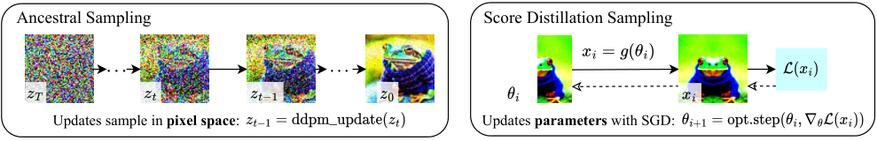

*原文 Figure 22：Figure 2: Comparison of 2D sampling methods from a text-to-image diffusion model with text “ a photo of a tree frog wearing a sweater .” For score distillation sampling, as an example we use an image generator that restricts images to be symmetric by having 𝐱 = ( flip ​ ( θ ) , θ ) \mathbf{x}=(\text{flip}(\theta),\theta) . [查看图片来源](https://arxiv.org/html/2209.14988v1/sampling_schematic_barronfont.png)*

引用来源：arxiv_2608.02711

链接：[arXiv](https://arxiv.org/abs/2209.14988)

##### Magic3D: High-Resolution Text-to-3D Content Creation

作者：Chen-Hsuan Lin, Jun Gao, Luming Tang, Towaki Takikawa, Xiaohui Zeng, Xun Huang, Karsten Kreis, S. Fidler, Ming-Yu Liu, Tsung-Yi Lin

主任务：generation

方法标签：instance-level optimization

中文简介：

Magic3D解决文本或图像条件下的三维内容生成，输入文本或图像条件，输出高分辨率、带纹理的三维网格。其采用两阶段实例级优化：先借助低分辨率扩散先验和稀疏三维哈希网格获得粗模型，再通过可微渲染与高分辨率潜扩散模型优化纹理网格。该方法延续DreamFusion的二维先验路线，但以分阶段表示和网格优化提升效率与细节质量。

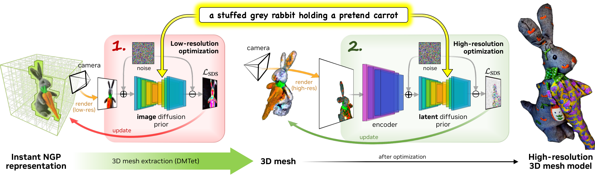

*原文 Figure 2：Figure 2 : Overview of Magic3D. We generate high-resolution 3D content from an input text prompt in a coarse-to-fine manner. In the first stage, we utilize a low-resolution diffusion prior and optimize neural field representations (color, density, and normal fields) to obtain the coarse model. We further differentiably extract textured 3D mesh from the density and color fields of the coarse model. Then we fine-tune it using a high-resolution latent diffusion model. After optimization, our model generates high-quality 3D meshes with detailed textures. [查看图片来源](https://arxiv.org/html/2211.10440v2/x1.png)*

引用来源：arxiv_2608.02711

链接：[arXiv](https://arxiv.org/abs/2211.10440)

#### 2023

##### Fantasia3D: Disentangling Geometry and Appearance for High-quality Text-to-3D Content Creation

作者：Rui Chen, Y. Chen, Ningxin Jiao, K. Jia

主任务：generation

中文简介：

Fantasia3D面向高质量文本到三维内容创建，输入文本提示，输出可渲染、可编辑并支持物理处理的三维资产。方法将几何与外观解耦：利用混合场景表示学习几何，并以表面法线连接图像扩散先验；同时引入空间变化的BRDF学习表面材质。它属于基于优化的三维生成，相比以隐式体渲染共同建模形状和外观的前序路线，更强调显式表面几何、材质控制及图形学兼容性。

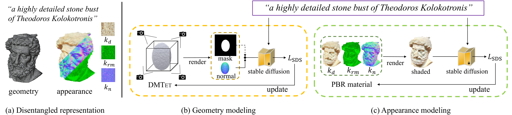

*原文 Figure 3：Figure 3: Overview of our method. Our method can generate disentangled geometry and appearance given a text prompt (cf. figure (a)), which are produced by (b) geometry modeling and (c) appearance modeling, respectively. (b) We employ DMTet as our 3D geometry representation, which is initialized as a 3D ellipsoid here. To optimize the parameters of DMTet , we render the normal map (and the object mask in the early training phase) of the extracted mesh from DMTet as the shape encoding of stable diffusion [ 35 , 40 ] . (c) For appearance modeling, we introduce the spatially-varying Bidirectional Reflectance Distribution Function (BRDF) modeling into text-to-3D generation, and learn to predict three components (namely, k d k_{d} , k r ​ m k_{rm} , and k n k_{n} ) of the appearance. Both geometry and appearance modeling are supervised by Score Distillation Sampling (SDS) loss [ 33 ] . [查看图片来源](https://arxiv.org/html/2303.13873v3/pipeline2.png)*

引用来源：arxiv_2608.02711

链接：[arXiv](https://arxiv.org/abs/2303.13873)

##### ProlificDreamer: High-Fidelity and Diverse Text-to-3D Generation with Variational Score Distillation

作者：Zhengyi Wang, Cheng Lu, Yikai Wang, Fan Bao, Chongxuan Li, Hang Su, Jun Zhu

主任务：generation

中文简介：

ProlificDreamer解决高保真、多样的文本到三维生成任务，输入文本提示，输出具有复杂结构和材质效果的三维场景或网格。其核心是变分分数蒸馏，将待优化的三维参数建模为随机变量，并以粒子式变分框架缓解传统分数蒸馏的过饱和、过平滑和低多样性问题，同时改进蒸馏调度与密度初始化。它属于基于二维扩散先验的逐实例优化路线，重点推进了SDS框架的分布建模能力。

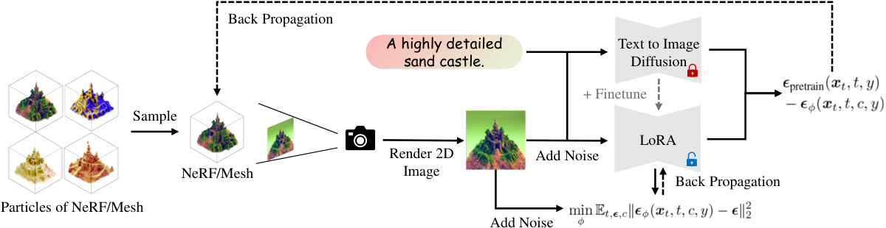

*原文 Figure 4：Figure 2: Overview of VSD. The 3D representation is differentiably rendered at a random pose c c . The rendered image is sent to the pretrained diffusion and the score of the variational distribution (estimated by LoRA) to compute the gradient of VSD. LoRA is also updated on the rendered image. [查看图片来源](https://arxiv.org/html/2305.16213v2/diagram.png)*

引用来源：arxiv_2608.02711

链接：[arXiv](https://arxiv.org/abs/2305.16213)

##### Michelangelo: Conditional 3D Shape Generation based on Shape-Image-Text Aligned Latent Representation

作者：Zibo Zhao, Wen Liu, Xin Chen, Xianfang Zeng, Rui Wang, Pei Cheng, Bin Fu, Tao Chen, Gang Yu, Shenghua Gao

主任务：generation

方法标签：3D-native latent space

中文简介：

Michelangelo研究图像或文本条件下的三维形状生成，输入二维图像或文本，输出相应的三维神经场形状。方法采用“先对齐、后生成”范式：Shape-Image-Text-Aligned VAE将三维形状压缩到与图像、文本对齐的潜空间，随后由条件潜扩散模型生成形状潜变量并解码。它属于三维原生潜空间生成，区别于直接跨模态生成三维形状或依靠二维扩散先验逐实例优化的方法。

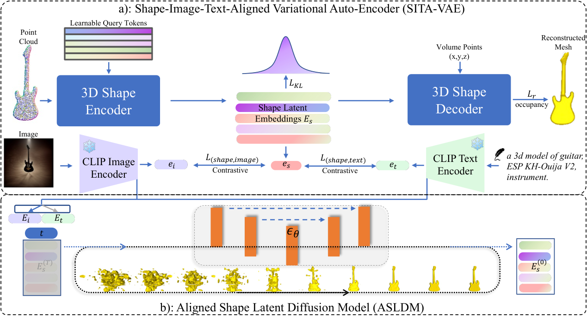

*原文 Figure 1：Figure 2 : Alignment-before-generation pipeline . Our method contains two models: the Shape-Image-Text-Aligned Variational Auto-Encoder (SITA-VAE) and the Aligned Shape Latent Diffusion Model (ASLDM). The SITA-VAE consists of four modules: an image encoder, a text encoder, a 3D shape encoder, and a 3D shape decoder. Encoders encode inputs pair into an aligned space, and the 3D shape decoder reconstructs 3D shapes given embeddings from the aligned space. The ASLDM maps the image or text condition to the aligned shape latent space for sampling a high-quality 3D shape embedding, which latterly reconstructed to high-fidelity 3D shapes by the 3D shape decoder. [查看图片来源](https://arxiv.org/html/2306.17115v2/newnetwork.png)*

引用来源：arxiv_2608.02711

链接：[arXiv](https://arxiv.org/abs/2306.17115)

##### DreamGaussian: Generative Gaussian Splatting for Efficient 3D Content Creation

作者：Jiaxiang Tang, Jiawei Ren, Hang Zhou, Ziwei Liu, Gang Zeng

主任务：generation

中文简介：

该论文解决从文本或单视图图像创建三维内容的任务，输入文本提示或单张图像，输出三维高斯表示，并可进一步得到带纹理网格。方法以Gaussian Splatting作为可优化的三维表示，通过渐进式高斯致密化进行生成，再提取网格并在UV空间细化纹理。它属于基于优化的三维生成路线，针对SDS方法逐样本耗时的问题，以高效高斯表示和网格后处理提升实用性。

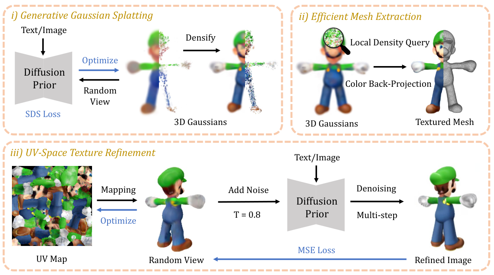

*原文 Figure 1：Figure 2: DreamGaussian Framework . 3D Gaussians are used for efficient initialization of geometry and appearance using single-step SDS loss. We then extract a textured mesh and refine the texture image with a multi-step MSE loss. [查看图片来源](https://arxiv.org/html/2309.16653v2/framework.png)*

引用来源：arxiv_2608.02711

链接：[arXiv](https://arxiv.org/abs/2309.16653)

##### GaussianDreamer: Fast Generation from Text to 3D Gaussians by Bridging 2D and 3D Diffusion Models

作者：Taoran Yi, Jiemin Fang, Junjie Wang, Guanjun Wu, Lingxi Xie, Xiaopeng Zhang, Wenyu Liu, Qi Tian, Xinggang Wang

主任务：generation

中文简介：

该论文解决文本到三维高斯表示生成任务，输入文本提示，输出可实时渲染的三维Gaussian资产或头像。GaussianDreamer以三维扩散模型提供初始化先验，再用二维扩散模型优化和丰富几何、颜色，并通过噪声点生长与颜色扰动增强高斯表示。它位于基于优化的三维生成类别，区别于单独依赖二维先验或三维扩散的路线，尝试结合二者优势并以三维高斯提升优化效率。

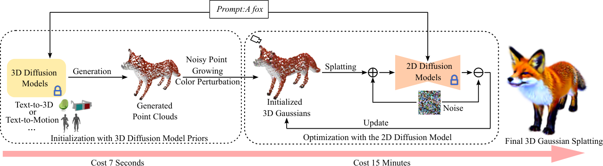

*原文 Figure 1：Figure 2 : Overall framework of GaussianDreamer. Firstly, we utilize a 3D diffusion model to generate the initialized point clouds. After executing noisy point growing and color perturbation on the point clouds, we use them to initialize the 3D Gaussians. The initialized 3D Gaussians are further optimized using the SDS method [ 55 ] with a 2D diffusion model. Finally, we render the image using the 3D Gaussians by employing 3D Gaussian Splatting [ 26 ] . We can use one of various 3D diffusion models to generate the initialized point clouds. In this case, we take text-to-3D and text-to-motion diffusion models as examples. [查看图片来源](https://arxiv.org/html/2310.08529v3/pipline11.png)*

引用来源：arxiv_2608.02711

链接：[arXiv](https://arxiv.org/abs/2310.08529)

#### 2024

##### Consistent3D: Towards Consistent High-Fidelity Text-to-3D Generation with Deterministic Sampling Prior

作者：Zike Wu, Pan Zhou, Xuanyu Yi, Xiaoding Yuan, Hanwang Zhang

主任务：generation

中文简介：

该论文解决文本到三维生成任务，输入文本提示，输出具有较高几何和纹理一致性的三维资产。方法仍以三维表示的逐实例优化为核心：渲染多视图后，利用预训练二维扩散模型估计分数，并以常微分方程的确定性轨迹构造一致性蒸馏损失。它针对SDS随机采样不稳定、易导致几何坍塌的问题，引入确定性采样先验，属于基于二维扩散先验的优化路线。

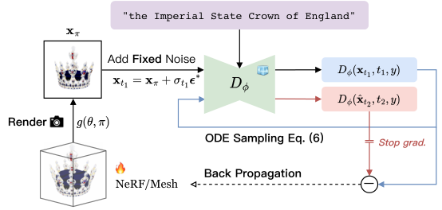

*原文 Figure 2：Figure 3 : Overview of CDS. In each training iteration, the rendered image is perturbed by a fixed noise and then served as a start point of the deterministic flow for computing the CDS loss. [查看图片来源](https://arxiv.org/html/2401.09050v2/framework.png)*

引用来源：arxiv_2608.02711

链接：[arXiv](https://arxiv.org/abs/2401.09050)

##### DreamReward: Text-to-3D Generation with Human Preference

作者：Junliang Ye, Fang-Fu Liu, Qixiu Li, Zhengyi Wang, Yikai Wang, Xinzhou Wang, Yue-Qi Duan, Jun Zhu

主任务：generation

中文简介：

DreamReward解决依据文本生成更符合人类偏好的三维内容任务：输入文本提示，输出高质量且多视角一致的三维资产。方法先收集专家对三维结果的评分与排序，训练通用三维偏好奖励模型Reward3D，再通过DreamFL利用反馈直接调节多视角扩散模型。它属于基于优化的三维生成范式，但区别于仅依赖二维扩散分数的路线，引入了人类偏好信号，对生成目标进行更贴近用户意图的实例级优化。

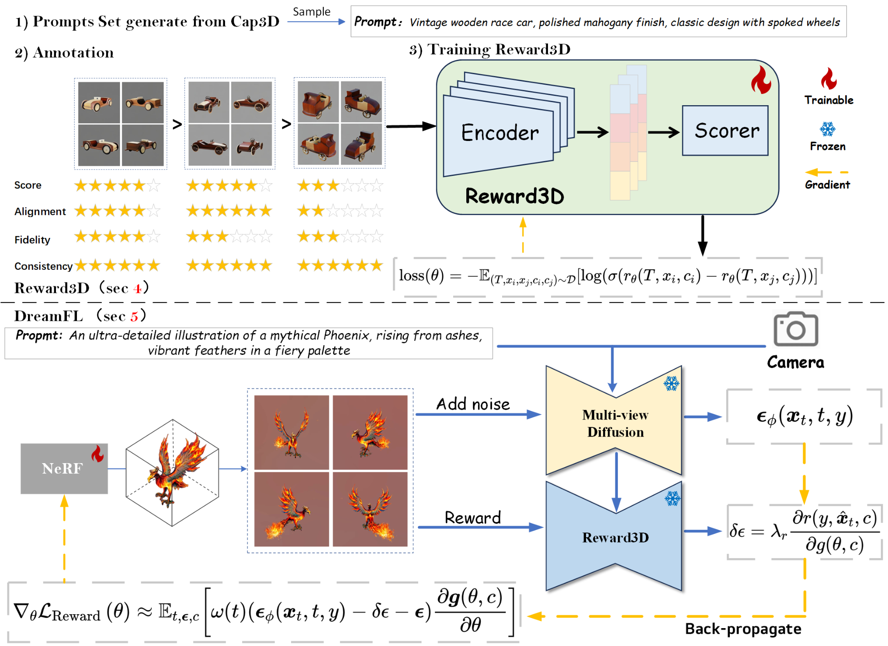

*原文 Figure 1：Figure 1 : The overall framework of our DreamReward . ( Top ) Reward3D involves data collection, annotation, and preference learning. ( Bottom ) DreamFL utilizes feedback from Reward3D to compute RewardLoss and incorporate it into the SDS loss for simultaneous optimization of NeRF. [查看图片来源](https://arxiv.org/html/2403.14613v1/pipeline.png)*

引用来源：arxiv_2608.02711

链接：[arXiv](https://arxiv.org/abs/2403.14613)

##### Frankenstein: Generating Semantic-Compositional 3D Scenes in One Tri-Plane

作者：Han Yan, Yang Li, Zhennan Wu, Shenzhou Chen, Weixuan Sun, Taizhang Shang, Weizhe Liu, Tian Chen, Xiaqiang Dai, Chao Ma, Hongdong Li, Pan Ji

主任务：generation

中文简介：

Frankenstein解决语义组合三维场景生成任务：输入生成条件，输出由多个语义明确且彼此分离的三维部件组成的场景。方法将场景编码为一个三平面张量，由多个解码器生成对应部件的有符号距离场，并先通过自动编码器压缩至三维潜空间，再以扩散模型建模组合场景分布。它属于三维部件生成路线，相比只生成单一整体形状的方法，显式联合表示部件及其组合关系，并支持后续部件级编辑。

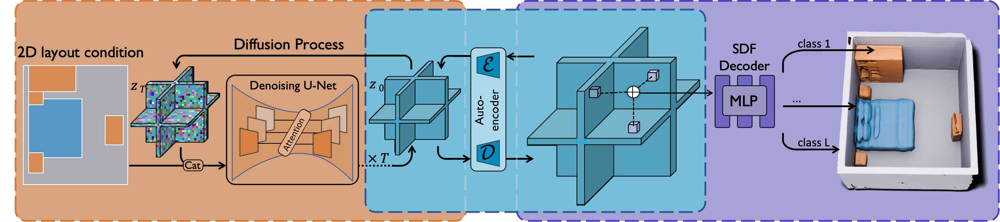

*原文 Figure 2：Figure 2. Training pipeline of Frankenstein. Tri-plane fitting: training scenes are converted into tri-planes. VAE training: tri-planes are compressed into latent tri-planes via an auto-encoder. Conditional denoising: the distributions of latent tri-planes are approximated by a diffusion model conditioned on layout maps. During the inference process, given a 2D layout, the diffusion model denoises the noise to produce a latent tri-plane. This latent tri-plane is subsequently upsampled to a higher resolution by the VAE. Finally, a lightweight MLP decodes the high-resolution tri-plane into multiple semantic-wise SDFs. [查看图片来源](https://arxiv.org/html/2403.16210v2/imgs/pipeline7.jpg)*

引用来源：arxiv_2608.02711

链接：[arXiv](https://arxiv.org/abs/2403.16210)

##### Generic 3D Diffusion Adapter Using Controlled Multi-View Editing

作者：Hansheng Chen, Ruoxi Shi, Yulin Liu, Bokui Shen, Jiayuan Gu, Gordon Wetzstein, Hao Su, Leonidas J. Guibas

主任务：generation

中文简介：

MVEdit解决多种条件下的三维生成与已有资产编辑任务：输入文本、图像或三维对象及编辑条件，输出具有纹理且多视角一致的网格。方法借鉴SDEdit，在采样过程中联合去噪多视图图像，并用免训练三维适配器将当前视图提升为一致的三维表示，再渲染其视图约束下一步去噪。它属于三维编辑类别，也覆盖从零生成；相较传统分数蒸馏，强调多视图编辑驱动的高效三维一致性维护。

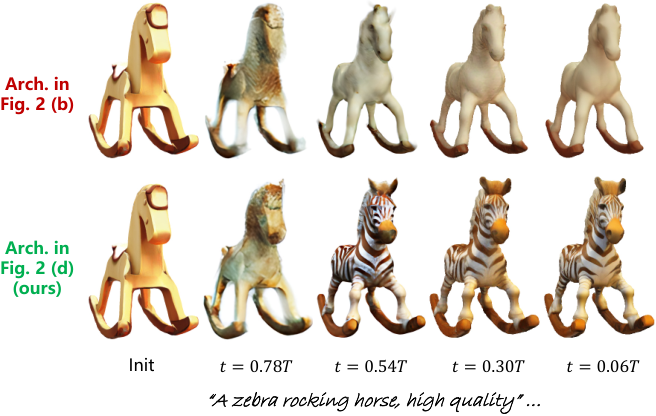

*原文 Figure 3：Figure 3. Comparison between the two architectures , based on the text-guided 3D-to-3D pipeline with t start = 0.78 ​ T t^{\text{start}}=0.78T . Rendered RGB images x RGB rend x^{\text{rend}}_{\text{RGB}} across different timesteps are shown to visualize the sampling process. [查看图片来源](https://arxiv.org/html/2403.12032v2/ablation_ctrl.png)*

引用来源：arxiv_2608.02711

链接：[arXiv](https://arxiv.org/abs/2403.12032)

##### Make-Your-3D: Fast and Consistent Subject-Driven 3D Content Generation

作者：Fang-Fu Liu, Han-Yang Wang, Weiliang Chen, Haowen Sun, Yue-Qi Duan

主任务：generation

中文简介：

Make-Your-3D解决单张主体图像结合文本描述的个性化三维内容生成任务：输入主体图像和文本提示，输出保持主体身份、并能进行文本驱动修改的三维资产。方法协同优化多视图扩散模型与身份特定的二维生成模型，使主体先验与多视图先验相互学习、逐步缩小分布差异。它属于基于优化的三维生成，区别于从零生成路线，聚焦单实例主体定制，并以身份保持和跨视角一致性为核心目标。

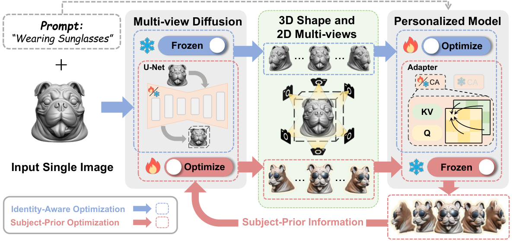

*原文 Figure 2：Figure 3 : The overall framework of our proposed Make-Your-3D. Our framework includes identity-aware optimization of 2D personalized model and subject-prior optimization of multi-view diffusion model to approximate subject distribution. The identity-aware optimization (Sec. 3.3 ) lifts input image to 3D space through a frozen multi-view diffusion model and optimizes the 2D personalized model via multi-views. The subject-prior optimization (Sec. 3.4 ) adopts diverse images from frozen personalized model to infuse the subject-specific prior into the multi-view diffusion model. [查看图片来源](https://arxiv.org/html/2403.09625v1/pipeline.png)*

引用来源：arxiv_2608.02711

链接：[arXiv](https://arxiv.org/abs/2403.09625)

##### Interactive3D: Create What You Want by Interactive 3D Generation

作者：Shaocong Dong, Lihe Ding, Zhanpeng Huang, Zibin Wang, Tianfan Xue, Dan Xu

主任务：generation

中文简介：

该论文解决已有三维资产在生成过程中难以按用户意图精确修改的问题，输入为交互操作、编辑指令及生成中的三维对象，输出为经过增删、拖拽、变形或语义修改的三维资产。方法采用级联两阶段流程：先在Gaussian Splatting表示上支持中间过程交互，再转换为InstantNGP，并通过交互式哈希细化补充细节和提取几何。它属于强调过程控制的三维编辑路线，相比文本驱动或二维参考重建，提供更直接、丰富的三维空间操作。

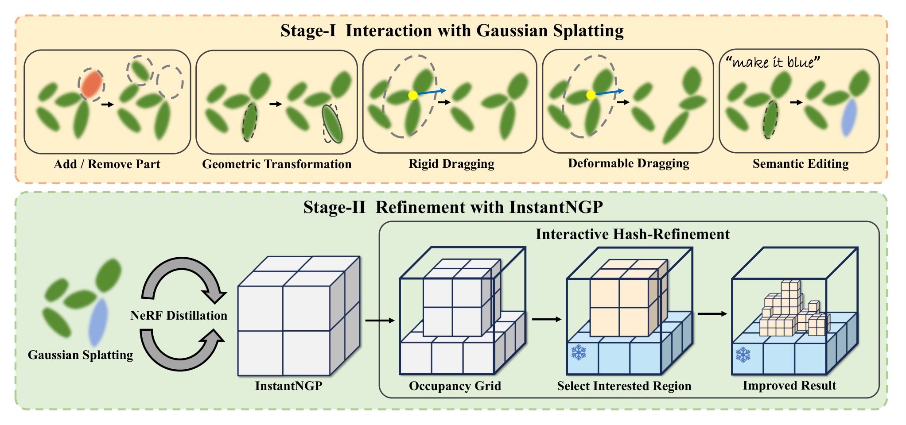

*原文 Figure 2：Figure 3 : The overall architecture of Interactive3D. It contains two stages with distinct 3D representations: (I) Gaussian Splatting for flexible user interactions such as add/remove parts, geometry transformation, deformable or rigid dragging and semantic editing; (II) the Gaussian blobs are converted to InstantNGP using NeRF distillation and fine-tuned by our Interactive Hash Refinement Module. [查看图片来源](https://arxiv.org/html/2404.16510v1/interactive3D_arc2_final.png)*

引用来源：arxiv_2608.02711

链接：[arXiv](https://arxiv.org/abs/2404.16510)

##### CraftsMan3D: High-fidelity Mesh Generation with 3D Native Generation and Interactive Geometry Refiner

作者：Wei-Yu Li, Jiarui Liu, Rui Chen, Yixun Liang, Xuelin Chen, Ping Tan, Xiao-Xiao Long

主任务：generation

方法标签：3D-native latent space

中文简介：

该论文解决高保真、拓扑规整且可交互细化的三维网格生成问题，输入为文本提示或参考图像，输出为粗到细的三维几何资产及可增强的表面细节。方法先借助多视图扩散获得视图条件，再由三维原生潜空间扩散模型快速生成粗几何，最后通过基于法线的细化器自动或根据用户编辑补充细节。它采用“整体塑形—表面雕刻”的三维原生生成范式，相比长时间优化和不规则网格提取，更强调速度、规整拓扑与交互细化。

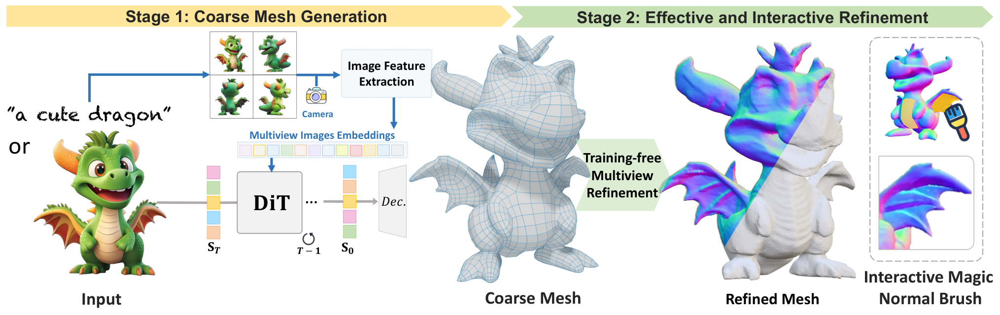

*原文 Figure 3：Figure 4 : Overview of CraftsMan3D. We first using a multi-view diffusion model to generate a multi-view image from the input single image or text prompt. The generated multi-view image is then fed into our Latent Set-based DiT model as conditioning to produce a coarse mesh. Finally, a dedicated refinement module is employed to improve or edit the surface normals of the coarse geometry, enhancing with intricate details. In particular, this refinement module features two key usages, namely the automatic global refinement and interactive magic brush, that contribute to efficient and controllable 3D modeling of high-quality meshes. [查看图片来源](https://arxiv.org/html/2405.14979v4/overview.png)*

引用来源：arxiv_2608.02711

链接：[arXiv](https://arxiv.org/abs/2405.14979)

##### PivotMesh: Generic 3D Mesh Generation via Pivot Vertices Guidance

作者：Haohan Weng, Yikai Wang, Tong Zhang, C. L. Philip Chen, Jun Zhu

主任务：generation

方法标签：mesh token generation

中文简介：

该论文解决跨类别生成紧凑且具有清晰细节的三维网格问题，输入为形状条件或数据分布，输出为结构完整的顶点—面网格。方法利用Transformer自编码器将网格离散为token，并先自回归生成作为粗结构的枢轴顶点，再据此分层生成完整网格，以降低直接建模复杂拓扑的难度。它将原生网格生成从小规模专类数据拓展到更大规模、多类别数据集，区别于直接生成全部面片序列的路线。

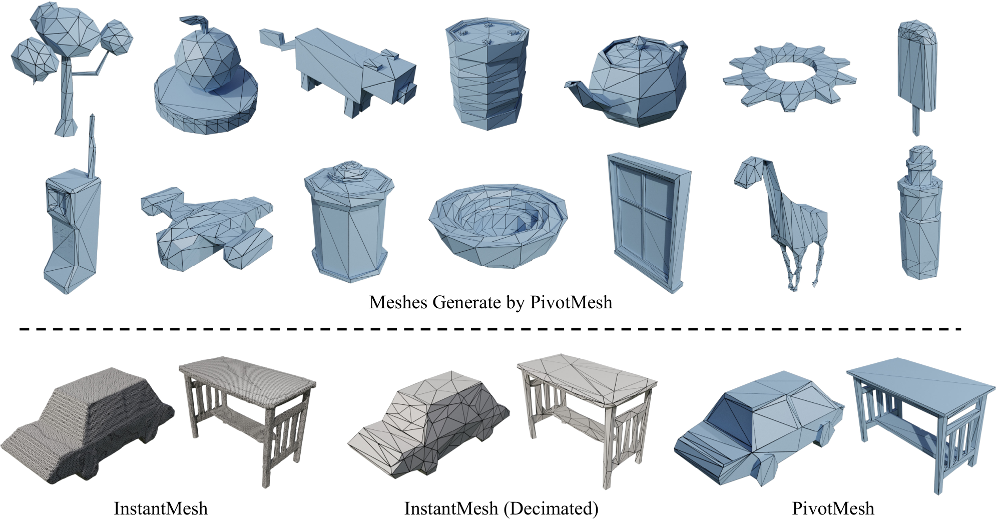

*原文 Figure 1：Figure 1 : Different from 3D generation methods based on neural representations like InstantMesh [ 42 ] , our methods can generate compact and sharp meshes with much fewer faces when producing similar shapes. [查看图片来源](https://arxiv.org/html/2405.16890v1/head2.png)*

引用来源：arxiv_2608.02711

链接：[arXiv](https://arxiv.org/abs/2405.16890)

##### CLAY: A Controllable Large-scale Generative Model for Creating High-quality 3D Assets

作者：Longwen Zhang, Ziyu Wang, Qixuan Zhang, Qi-Wei Qiu, Anqi Pang, Haoran Jiang, Wei Yang, Lan Xu, Jingyi Yu

主任务：generation

方法标签：3D-native latent space

中文简介：

该论文面向文本、图像及多种三维控制条件生成带几何和材质的高质量三维资产，输入可包括多视图、体素、点云或隐式表示，输出为完整三维表面及物理材质纹理。核心采用多分辨率三维VAE压缩神经场，再在三维潜空间中使用DiT扩散生成几何，并结合多视图材质扩散生成PBR外观。它属于大规模三维原生潜空间生成路线，区别于依赖二维扩散模型逐实例优化的方法。

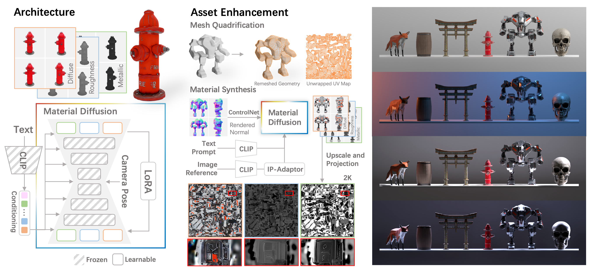

*原文 Figure 5：Figure 5. Our Material Diffusion architecture and Asset Enhancement pipeline. Our Material Diffusion network, derived from existing diffusion models, facilitates efficient fine-tuning. Following mesh quadrification and atlasing, it generates textures through a multi-view approach and subsequently back-projecte them onto UV maps. The resultant materials, closely aligned with geometries and user inputs (text/image), faithfully respond to diverse lighting conditions, culminating in realistic renderings. [查看图片来源](https://arxiv.org/html/2406.13897v1/fig/PBR.png)*

引用来源：arxiv_2608.02711

链接：[arXiv](https://arxiv.org/abs/2406.13897)

##### MeshAnything V2: Artist-Created Mesh Generation with Adjacent Mesh Tokenization

作者：Yiwen Chen, Yikai Wang, Yi-Hao Luo, Zhengyi Wang, Zilong Chen, Jun Zhu, Chi Zhang, Guosheng Lin

主任务：generation

方法标签：mesh token generation

中文简介：

MeshAnything V2从指定形状生成艺术家制作风格的三维网格，输入形状条件，输出包含顶点和面的紧凑网格序列。核心是Adjacent Mesh Tokenization，将相邻面共享的顶点尽可能只编码一次，减少冗余token，再以自回归方式逐步生成网格结构。相较传统每个三角面使用三个顶点的标记化方法，它显著压缩序列并改善结构组织，使模型在不增加计算成本的情况下处理更高面数，代表自回归网格生成中围绕token效率的关键改进。

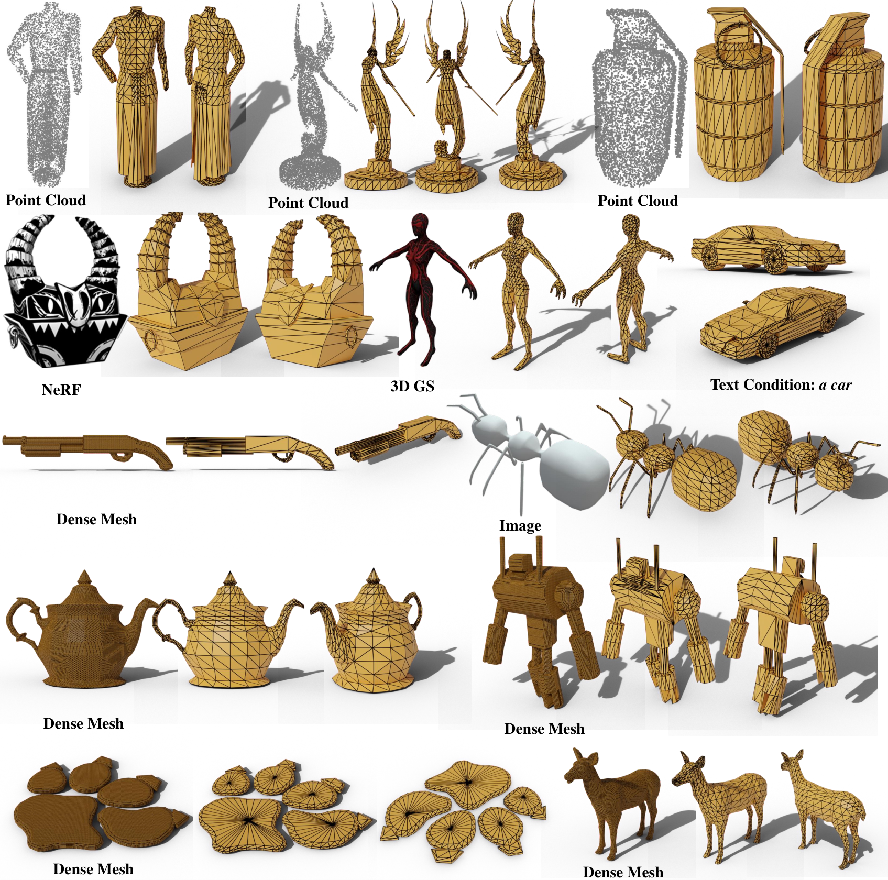

*原文 Figure 1：Figure 1 : Equipped with the newly proposed Adjacent Mesh Tokenization (AMT), MeshAnything V2 significantly surpasses MeshAnything [ 5 ] in both performance and efficiency. MeshAnything V2 generates Artist-Created Meshes (AM) up to 1600 1600 faces aligned with given shapes. Combined with various 3D asset production pipelines, it efficiently achieves high-quality, highly controllable AM generation. [查看图片来源](https://arxiv.org/html/2408.02555v3/teaser.png)*

引用来源：arxiv_2608.02711

链接：[arXiv](https://arxiv.org/abs/2408.02555)

##### EdgeRunner: Auto-regressive Auto-encoder for Artistic Mesh Generation

作者：Jiaxiang Tang, Zhaoshuo Li, Zekun Hao, Xian Liu, Gang Zeng, Ming-Yu Liu, Qinsheng Zhang

主任务：generation

方法标签：mesh token generation

中文简介：

EdgeRunner研究艺术化三维网格生成，输入点云或图像条件，输出具有较高细节和可变面的三角网格。方法首先以新的网格标记化算法将三角网格压缩为一维token序列，再利用自回归自动编码器将不同长度网格映射到固定长度潜空间，并可在该空间训练潜扩散模型。相较逐顶点生成易出现不完整、细节不足和泛化弱的问题，它结合显式序列建模与连续潜变量生成，属于自回归网格路线中兼顾压缩和质量的改进方案。

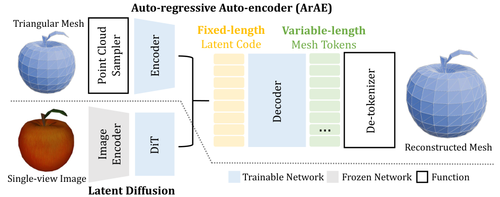

*原文 Figure 1：Figure 2: Pipeline of our method . Our ArAE model compresses variable-length mesh into fixed-length latent code, which can be further used to train latent diffusion models conditioned on other input modalities, such as single-view images. [查看图片来源](https://arxiv.org/html/2409.18114v1/pipe.png)*

引用来源：arxiv_2608.02711

链接：[arXiv](https://arxiv.org/abs/2409.18114)

##### The Scene Language: Representing Scenes with Programs, Words, and Embeddings

作者：Yun-Zhi Zhang, Zi-Zhang Li, Matt Zhou, Shangzhe Wu, Jiajun Wu

主任务：generation

中文简介：

该论文面向三维与四维场景生成，输入文本或图像，输出可渲染、可编辑的结构化场景。核心是提出Scene Language，以程序描述实体层级和关系，以自然语言词汇表达语义类别，并用嵌入保留实体视觉身份；这些表示可由预训练语言模型免训练推断，再交给传统、神经或混合渲染器生成场景。相较仅描述关系的场景图，它更强调身份与结构的联合表达，属于三维部件生成中面向复杂场景组合和精确控制的路线。

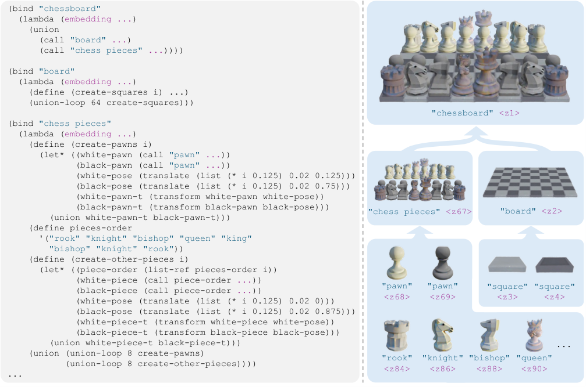

*原文 Figure 1：Figure 2 : Overview. A Scene Language represents a scene with three components: a program consisting of entity functions, a set of words ( e.g . , pawn ) denoting the semantic class of the entity functions, and a list of embeddings ( e.g . , <z1> ) capturing the identity of each entity in the scene. Each entity function is bound with an entity class name given by a word , and maps an input embedding to an output entity of that class. Executing the program evaluates entity functions to compute the full set of entities in the scene. The resulting computation graph, illustrated on the right, captures the dependency structure among entities (indicated by arrows). The program shown is converted from our text-conditioned inference method’s output, with details included in Sec. F.2.1 ; it is written in Lisp-style syntax for brevity and is implemented with Python in practice ( Sec. 3.2 ). [查看图片来源](https://arxiv.org/html/2410.16770v2/representation.png)*

引用来源：arxiv_2608.02711

链接：[arXiv](https://arxiv.org/abs/2410.16770)

##### PhyCAGE: Physically Plausible Compositional 3D Asset Generation from a Single Image

作者：Han Yan, Mingrui Zhang, Yang Li, Chao Ma, Pan Ji

主任务：generation

中文简介：

该论文解决从单张图像生成具有部件结构且物理合理的三维组合资产：输入一张图像，输出由多个对象部件组成、位置相互协调的三维高斯表示。方法先为各部件生成一致的多视角图像，再分别拟合三维高斯，并提出物理仿真增强的SDS，用扩散分数引导物理模拟逐步校正部件位置。它属于三维部件生成，区别于只生成整体形状的方法，显式关注部件组合关系及物理兼容性。

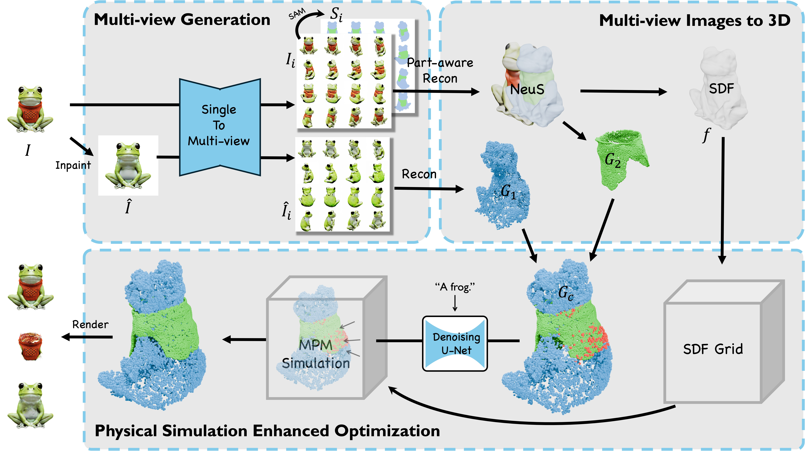

*原文 Figure 1：Figure 2 : The overview of PhyCAGE. Given an input image, we first generate consistent multi-view images for the components of the assets (see Sec. 4.1 ). Then, we fit multi-view images with 3D Gaussian Splatting representations (see Sec. 4.2 ). Finally, we introduce a Physical Simulation-Enhanced SDS to further optimize the positions of the Gaussians (see Sec. 4.3 ). [查看图片来源](https://arxiv.org/html/2411.18548v1/imgs/method/pipeline3.jpg)*

引用来源：arxiv_2608.02711

链接：[arXiv](https://arxiv.org/abs/2411.18548)

##### Scaling Mesh Generation via Compressive Tokenization

作者：Haohan Weng, Zi-Bo Zhao, Biwen Lei, Xiang-Hui Yang, Jian Liu, Zeqiang Lai, Zhuo Chen, Yu-Hong Liu, Jie Jiang, Chunchao Guo, Tong Zhang, Shenghua Gao, C. L. Philip Chen

主任务：generation

方法标签：mesh token generation

中文简介：

该论文解决高细节三维网格生成：输入点云或图像等条件，输出具有丰富几何细节和准确拓扑的低面数网格序列。核心是Blocked and Patchified Tokenization，将坐标序列按块索引并聚合为patch token，在压缩序列长度的同时支持更高面数网格，再以此训练基础网格生成模型。它属于自回归或流式网格生成路线，重点不是连续三维潜空间，而是通过压缩离散token扩展可建模网格规模和细节。

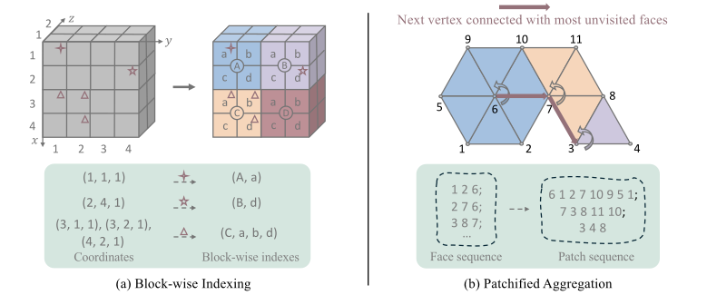

*原文 Figure 2：Figure 3 : The proposed Blocked and Patchified Tokenization (BPT). (a) We convert the coordinates from the Cartesian system to block-wise indexes. The coordinates are first separated equally into several blocks. Then, vertices inside each block are located with 1-dim indexes. (b) The nearby faces are aggregated as patches to compress the mesh sequence. Each patch center is set as the vertex connected with the most unvisited faces. Subsequently, other vertices within the patch are included in the subsequence to create a complete patch. [查看图片来源](https://arxiv.org/html/2411.07025v1/tokenization2.svg)*

引用来源：arxiv_2608.02711

链接：[arXiv](https://arxiv.org/abs/2411.07025)

##### Meshtron: High-Fidelity, Artist-Like 3D Mesh Generation at Scale

作者：Zekun Hao, David W. Romero, Tsung-Yi Lin, Ming-Yu Liu

主任务：generation

方法标签：mesh token generation

中文简介：

Meshtron解决高细节三维网格的直接生成任务，输入网格序列或相应条件，输出包含顶点与面的高分辨率网格序列。其核心是自回归建模，并通过hourglass架构、截断序列训练、滑动窗口推理和约束序列顺序的采样策略扩大可生成网格的规模与坐标精度。它属于自回归网格生成，相比早期低面数、强离散化方法，进一步面向更复杂、更接近艺术家制作的紧凑网格。

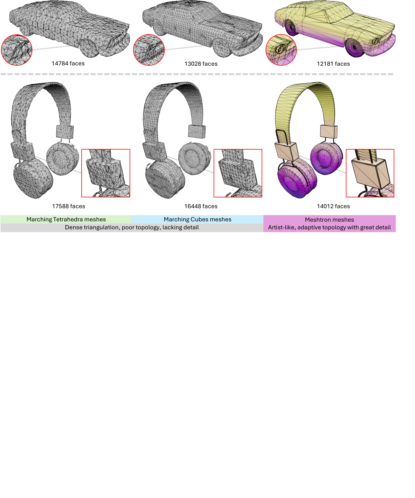

*原文 Figure 2：Figure 2: Topology comparison of Meshtron and iso-surfacing methods DMTet ( Shen et al., 2021 ) and FlexiCubes ( Shen et al., 2023 ) . While iso-surfacing methods can produce meshes with high face counts, they often suffer from overly dense tesselation, bumpy artifacts, oversmoothing and insufficient geometric detail, making them noticeably different from artist-created meshes. In contrast, Meshtron produces meshes with high-quality topology, featuring high-geometric detail and well-structured tesselation that closely aligns with the standards of artist-created meshes. [查看图片来源](https://arxiv.org/html/2412.09548v1/marchtet_marchcube_meshtron_comparisons.png)*

引用来源：arxiv_2608.02711

链接：[arXiv](https://arxiv.org/abs/2412.09548)

##### Structured 3D Latents for Scalable and Versatile 3D Generation

作者：Jianfeng Xiang, Ze-Long Lv, Sicheng Xu, Yu Deng, Ruicheng Wang, Bowen Zhang, Dong Chen, Xin Tong, Jiaolong Yang

主任务：generation

方法标签：3D-native latent space

中文简介：

该论文解决文本或图像条件下的通用三维资产生成：输入文本或图像条件，输出可解码为辐射场、三维高斯或网格等形式的三维对象。其核心是Structured LATent表示，将稀疏三维网格与视觉基础模型提取的多视角密集特征结合，以统一承载几何和外观信息，并在该潜空间中使用矩形流Transformer生成。相较针对单一表示的三维生成器，它提供统一潜表示和多格式解码，也支持局部编辑。

*原文 Figure 1：Figure 2 : Overview of our method. Encoding & Decoding: We adopt a structured latent representation ( SLat ) for 3D assets encoding, which defines local latents on a sparse 3D grid to represent both geometry and appearance information. It is encoded from the 3D assets by fusing and processing dense multiview visual features extracted from a DINOv2 encoder, and can be decoded into versatile output representations with different decoders. Generation: Two specialized rectified flow transformers are utilized to generate SLat , one for the sparse structure and the other for local latents attached to it. [查看图片来源](https://arxiv.org/html/2412.01506v3/pipeline_v3.png)*

引用来源：arxiv_2608.02711

链接：[arXiv](https://arxiv.org/abs/2412.01506)

#### 2025

##### BAG: Body-Aligned 3D Wearable Asset Generation

作者：Zhongjin Luo, Yang Li, Mingrui Zhang, Senbo Wang, Han Yan, Xibin Song, Taizhang Shang, Wei Mao, Hongdong Li, Xiaoguang Han, Pan Ji

主任务：generation

中文简介：

BAG解决面向指定人体的可穿戴三维资产生成，输入目标人体的形状、姿态及图像提示，输出能够自动贴合身体、减少穿插的服饰等资产。方法先利用人体三维投影控制多视图图像扩散，再将身体对齐的多视图送入原生三维扩散模型生成形状，最后通过变换恢复、轮廓监督和物理模拟完成适配。它属于带强条件约束的三维原生生成路线，区别于不考虑人体关系的通用形状生成。

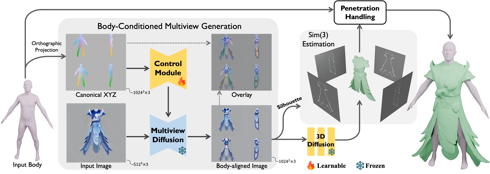

*原文 Figure 2：Figure 2. Method Pipeline. Given an input image and a target body, we employ body-conditioned image generation to produce body-aligned consistent four-view orthographic images (see Sec. 3.1 ). The four-view images are then fed into a native 3D diffusion model to obtain the asset shape. The similarity transformation (Sim3) of the generated asset is estimated through silhouette-based projection optimization (see Sec. 3.2 ). Finally, after solving the body-asset penetration, the Sim3-transformed asset is fitted onto the human body (see Sec. 3.3 ). The means for obtaining the input body and image pair are detailed in Sec. 3.4 . [查看图片来源](https://arxiv.org/html/2501.16177v1/images/pipeline.jpg)*

引用来源：arxiv_2608.02711

链接：[arXiv](https://arxiv.org/abs/2501.16177)

##### TripoSG: High-Fidelity 3D Shape Synthesis using Large-Scale Rectified Flow Models

作者：Yangguang Li, Zi-Xin Zou, Zexiang Liu, De-Hui Wang, Yuan-Zhi Liang, Zhipeng Yu, Xingchao Liu, Yuanchen Guo, Ding Liang, Wanli Ouyang, Yan-Pei Cao

主任务：generation

中文简介：

TripoSG解决由输入图像生成高保真三维形状的任务，输入单张图像等条件，输出与其外观对应的三维网格。方法先以结合SDF、法线和eikonal损失的三维VAE压缩形状，再用大规模整流流Transformer在三维潜空间中建模生成，并配合高质量数据处理流程。它属于三维原生潜空间生成，区别于依赖二维扩散先验逐实例优化的路线，重点在于规模化三维数据与原生三维生成器。

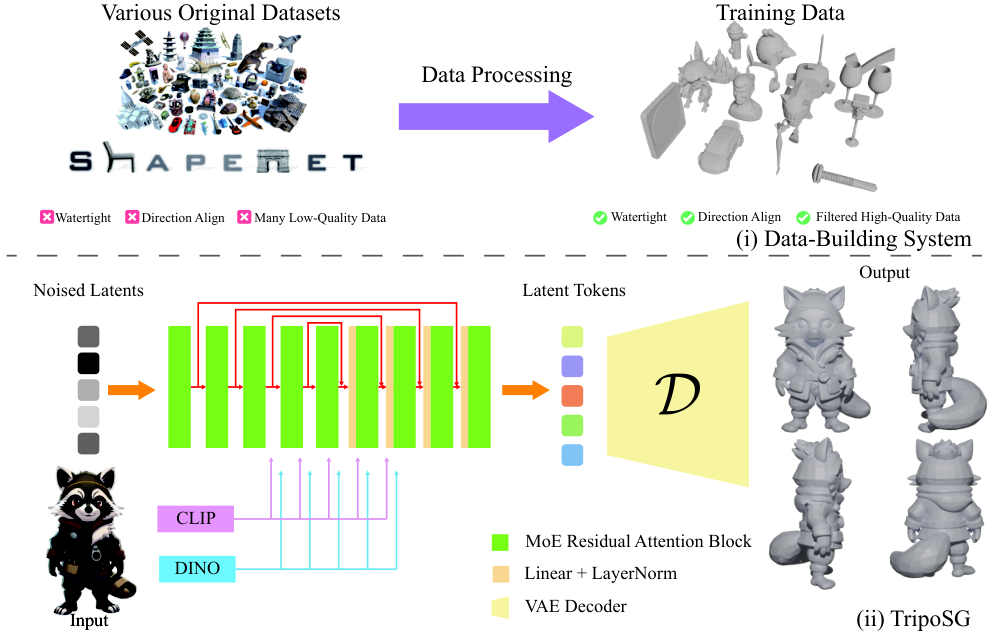

*原文 Figure 1：Figure 2 : The overview of our method consists of two main components: (i) Data-Building System and (ii) TripoSG Model. The data-building system processes the 3D models from various datasets (e.g., Objaverse and ShapeNet) through a series of data processing steps to create the training data. Our TripoSG model is then trained on this curated dataset for high-fidelity shape generation from a single input image. [查看图片来源](https://arxiv.org/html/2502.06608v3/pipeline.png)*

引用来源：arxiv_2608.02711

链接：[arXiv](https://arxiv.org/abs/2502.06608)

##### DeepMesh: Auto-Regressive Artist-Mesh Creation with Reinforcement Learning

作者：Ruowen Zhao, Junliang Ye, Zhengyi Wang, Guangce Liu, Yiwen Chen, Yikai Wang, Jun Zhu

主任务：generation

方法标签：mesh token generation

中文简介：

该论文解决条件式三角网格生成任务，以点云或图像为输入，输出具有细致几何和完整拓扑的低面数网格。DeepMesh首先通过新的token化方法和数据处理策略，将网格转化为适合自回归预测的离散序列；随后引入基于人类评价与三维指标构造的偏好数据，并用DPO进行强化式对齐，使生成结果兼顾视觉吸引力与几何准确性。它属于自回归网格生成路线，重点针对传统离散顶点预测中的面数受限和网格不完整问题。

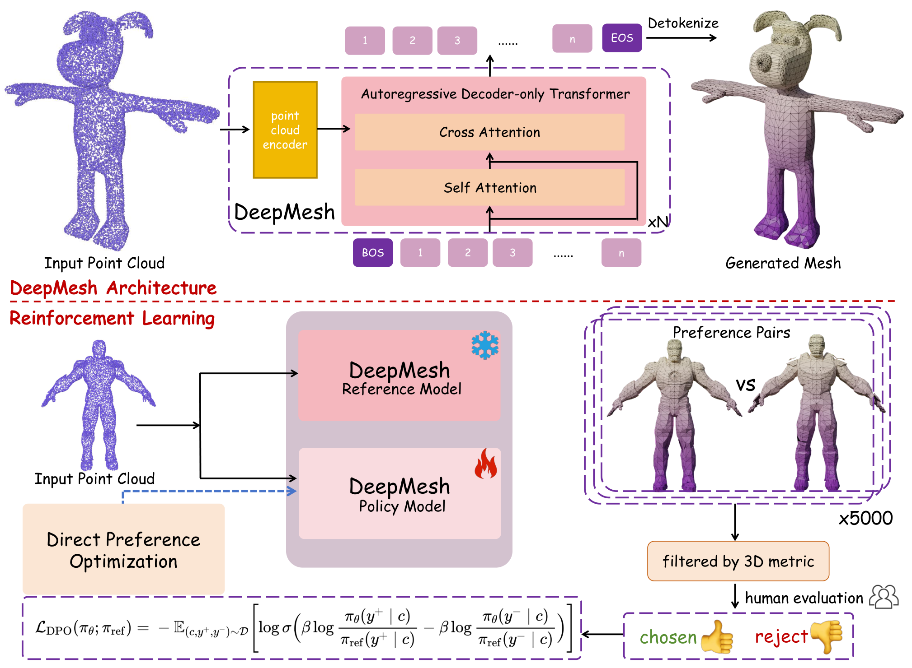

*原文 Figure 1：Figure 2 : An overview of our method. DeepMesh is an auto-regressive transformer composed of both self-attention and cross-attention layers. The model is pre-trained on discrete mesh tokens generated by our improved tokenization algorithm. To further enhance the quality of results, we propose a scoring standard that combines 3D metrics with human evaluation. With this standard, we annotate 5,000 preference pairs and then post-train the model with DPO to align its outputs with human preferences. [查看图片来源](https://arxiv.org/html/2503.15265v1/framework.png)*

引用来源：arxiv_2608.02711

链接：[arXiv](https://arxiv.org/abs/2503.15265)

##### SparseFlex: High-Resolution and Arbitrary-Topology 3D Shape Modeling

作者：Xianglong He, Zi-Xin Zou, Chia-Hao Chen, Yuanchen Guo, Ding Liang, Chun Yuan, Wanli Ouyang, Yan-Pei Cao, Yangguang Li

主任务：generation

中文简介：

该论文研究高分辨率、任意拓扑三维形状建模与生成，以三维形状或渲染监督为输入，输出可包含开放表面和复杂内部结构的网格。SparseFlex以稀疏结构化等值面表示连接可微网格重建，并采用视锥感知的分段体素训练降低高分辨率计算开销；在此表示上进一步训练VAE与rectified flow Transformer生成形状。它属于三维原生潜空间生成，区别于依赖二维扩散先验逐实例优化的路线，也不局限于封闭、可水密化的隐式表面。

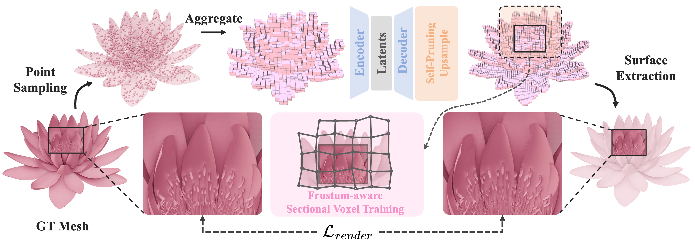

*原文 Figure 1：Figure 2 : Overview of the SparseFlex VAE pipeline. SparseFlex VAE takes point clouds sampled from a mesh as input, voxelizes them, and aggregates their features into each voxel. A sparse transformer encoder-decoder compresses the structured feature into a more compact latent space, followed by a self-pruning upsampling for higher resolution. Finally, the structured features are decoded to SparseFlex through a linear layer. Using the frustum-aware section voxel training strategy, we can train the entire pipeline more efficiently by rendering loss. [查看图片来源](https://arxiv.org/html/2503.21732v1/figs/pipeline.png)*

引用来源：arxiv_2608.02711

链接：[arXiv](https://arxiv.org/abs/2503.21732)

##### Sparc3D: Sparse Representation and Construction for High-Resolution 3D Shapes Modeling

作者：Zhihao Li, Yufei Wang, Heliang Zheng, Yi-Hao Luo, Bihan Wen

主任务：generation

方法标签：3D-native latent space

中文简介：

Sparc3D面向高分辨率三维形状生成，输入为待编码的网格或生成条件，输出可供潜扩散建模的细致三维形状。方法上以SparseCubes将任意拓扑表面表示为稀疏立方体中的符号距离与形变场，再用全稀疏卷积构成的SparConv-VAE进行近无损压缩和重建，并连接潜空间扩散生成。它属于三维原生潜空间生成，重点解决传统VAE的表示低效与模态不匹配问题，而非依赖二维扩散先验逐实例优化。

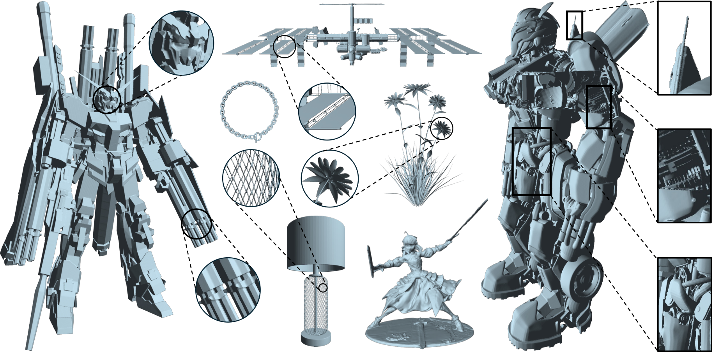

*原文 Figure 1：Figure 1: Sparc3D Reconstruction Results. Leveraging our sparse deformable marching cubes ( Sparcubes ) representation and sparse convolutional VAE ( Sparconv-VAE ), our method achieves state-of-the-art reconstruction quality on challenging 3D inputs. It robustly handles open surfaces (automatically closed into watertight meshes), recovers hidden interior structures, and faithfully reconstructs highly complex geometries (see zoom-in views, top to bottom). All outputs are fully watertight and 3D-printable, demonstrating the potential of our framework for high-resolution 3D mesh generation. Best viewed with zoom-in. [查看图片来源](https://arxiv.org/html/2505.14521v3/teaser.png)*

引用来源：arxiv_2608.02711

链接：[arXiv](https://arxiv.org/abs/2505.14521)

##### Hunyuan3D 2.1: From Images to High-Fidelity 3D Assets with Production-Ready PBR Material

作者：Team Hunyuan3D, Shuhui Yang, Mingxin Yang, Yifei Feng, Xin Huang, Sheng Zhang, Zebin He, Di Luo, Haolin Liu, Yunfei Zhao, Qin Lin, Zeqiang Lai, Xiang-Hui Yang, Huiwen Shi, Zi-Bo Zhao, Bowen Zhang, Hongyu Yan, Li-Fu Wang, Si-Ya Liu, Ji-Hong Zhang, Meng-Ya Chen, Liang Dong, Y. Jia, Yu-Xin Cai, Jia-Ao Yu, Y. Tang, Dong-Lin Guo, Jun-Lin Yu, Hao Zhang, Zhengfeng Ye, Peng He, Runzhou Wu, Shida Wei, Chao Zhang, Yonghao Tan, Yifu Sun, Lin Niu, Shirui Huang, Bo Zheng, Shu Liu, Shilin Chen, Xiang Yuan, Xiaofeng Yang, Kai Liu, Jian-Chen Zhu, Peng Chen, Tian-Yu Liu, Di Wang, Yu-Hong Liu, Linus, Jie Jiang, Jingwei Huang, Chunchao Guo

主任务：generation

中文简介：

Hunyuan3D 2.1面向从图像生成高分辨率、带纹理和生产级PBR材质的三维资产，输入图像条件，输出完整的形状与外观表示。其系统由负责几何生成的Hunyuan3D-DiT和负责纹理合成的Hunyuan3D-Paint组成，并围绕三维数据处理、训练、评估和部署给出完整流程。它属于三维原生潜空间生成，体现形状与纹理分阶段建模的工程化路线；论文同时强调开放训练管线，区别于只描述推理模型的工作。

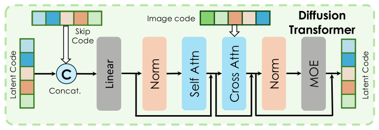

*原文 Figure 3：Figure 3: Overview of DiT block. We adopt the DiT implemented by Hunyuan-DiT [ 4 ] in our pipeline. [查看图片来源](https://arxiv.org/html/2506.15442v1/blocks.svg)*

引用来源：arxiv_2608.02711

链接：[arXiv](https://arxiv.org/abs/2506.15442)

##### Hunyuan3D 2.5: Towards High-Fidelity 3D Assets Generation with Ultimate Details

作者：Zeqiang Lai, Yunfei Zhao, Haolin Liu, Zi-Bo Zhao, Qin Lin, Huiwen Shi, Xiang-Hui Yang, Mingxin Yang, Shuhui Yang, Yifei Feng, Sheng Zhang, Xin Huang, Di Luo, Fan Yang, Fang Yang, Li-Fu Wang, Si-Ya Liu, Y. Tang, Yu-Xin Cai, Zebin He, Tian-Hai Liu, Yu-Hong Liu, Jie Jiang, Linus, Jingwei Huang, Chunchao Guo

主任务：generation

中文简介：

Hunyuan3D 2.5解决从图像或其他条件生成高保真、带细致纹理的三维资产问题，输出形状清晰、表面平滑并具有基于物理渲染材质的模型。系统延续两阶段流程，使用大规模训练的LATTICE形状基础模型生成几何，再通过扩展的多视图架构合成PBR纹理。它属于三维原生潜空间生成路线，重点在于扩大模型与数据规模并强化形状—图像对应及材质生成，相比前代进一步追求接近手工资产的细节和生产可用性。

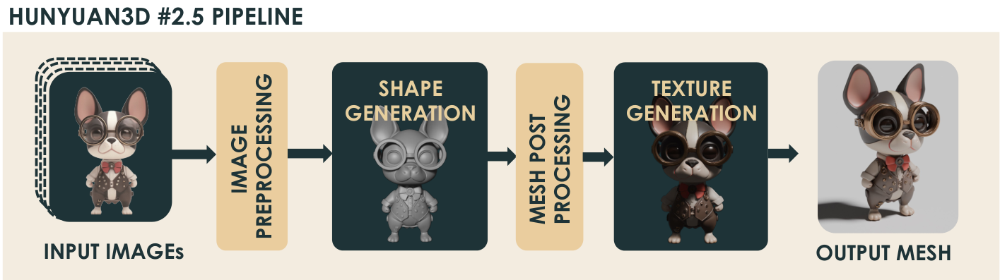

*原文 Figure 3：Figure 3: Overview of Hunyuan3D 2.5 pipeline . It separates the 3D asset generation into two stages: first, it generates the shape, and then it creates the texture based on that shape. [查看图片来源](https://arxiv.org/html/2506.16504v1/arch.png)*

引用来源：arxiv_2608.02711

链接：[arXiv](https://arxiv.org/abs/2506.16504)

##### ShapeLLM-Omni: A Native Multimodal LLM for 3D Generation and Understanding

作者：Junliang Ye, Zhengyi Wang, Ruowen Zhao, Shenghao Xie, Jun Zhu

主任务：generation

方法标签：3D-native latent space

架构标签：unified multimodal model

中文简介：

ShapeLLM-Omni解决文本与三维资产的交替理解、生成和编辑任务，输入可为语言或三维对象，输出相应文本、三维内容或修改后的资产。方法上先训练三维VQVAE，将形状压缩为离散三维token，再以这些token扩展Qwen-2.5-VL并进行指令训练，配合覆盖多种任务的3D-Alpaca数据集。它属于统一多模态模型，区别于仅把语言作为条件、再调用独立三维生成器的松耦合路线，强调三维token与语言模型的原生交互。

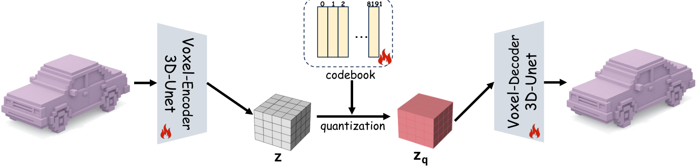

*原文 Figure 2：Figure 2: The pipeline of 3D VQVAE, which can compress voxels into discrete tokens. [查看图片来源](https://arxiv.org/html/2506.01853v1/vqvae2.png)*

引用来源：arxiv_2608.02711

链接：[arXiv](https://arxiv.org/abs/2506.01853)

##### Ultra3D: Efficient and High-Fidelity 3D Generation with Part Attention

作者：Yiwen Chen, Zhihao Li, Yikai Wang, Hu Zhang, Qin Li, Chi Zhang, Guosheng Lin

主任务：generation

中文简介：

Ultra3D解决从条件信息生成高分辨率三维形状的问题，输出带有细致几何结构的三维资产。方法采用三维原生潜空间扩散范式：先以紧凑的VecSet表示预测粗粒度物体布局，再在稀疏体素潜特征上使用按语义部件划分的Part Attention进行局部细化，并配套构建部件标注数据。它属于三维原生潜空间生成路线，重点区别于传统两阶段全局注意力扩散，通过部件感知局部建模降低计算开销，同时保持结构连续性。

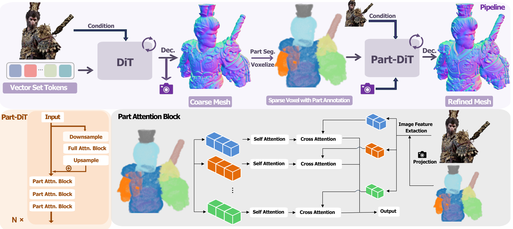

*原文 Figure 3：Figure 3: Pipeline Overview. We introduce Ultra3D , an efficient and high-quality 3D generation framework that first generates sparse voxel layout via VecSet and then refines it by generating per-voxel latent. The core of Ultra3D is Part Attention, an efficient localized attention mechanism that performs attention computation independently within each part group. Besides, when the input condition is an image, each part group performs cross attention only with the image tokens onto which its voxel tokens are projected. [查看图片来源](https://arxiv.org/html/2507.17745v3/pip_pdf.png)*

引用来源：arxiv_2608.02711

链接：[arXiv](https://arxiv.org/abs/2507.17745)

##### FASTMESH: Efficient Artistic Mesh Generation Via Component Decoupling

作者：Jeonghwan Kim, Yushi Lan, Armando Fortes, Yongwei Chen, Xingang Pan

主任务：generation

中文简介：

该工作从生成三角网格的顶点与面结构出发，输出紧凑的艺术网格。方法将顶点和面解耦：先用自回归模型生成顶点序列，再用双向Transformer一次性建模顶点关系并构造定义面连接的邻接矩阵，随后通过位置增强器和后处理改善几何与边连接。相较将共享顶点重复编码、逐token生成完整网格的自回归方法，它显著压缩序列并减少生成步骤，代表高效的结构分离式网格生成路线。

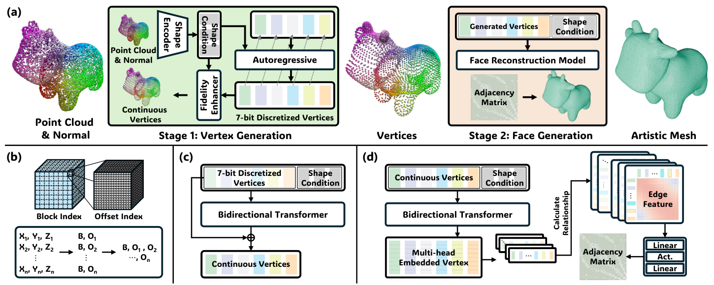

*原文 Figure 1：Figure 2 : (a) Overall architecture of FastMesh . Note that our pipeline consists of two stages, where we first generate the vertices from the shape condition and then construct the faces to complete the mesh. (b) Visualization of the block-wise indexing scheme introduced by BPT [ 48 ] , which we adopt for vertex tokenization. (c) Structure of the fidelity enhancer in the first stage. The 7-bit discretized vertices and shape condition are fed into the network to estimate the offset that can make the coordinate a continuous value. (d) Details of face reconstruction. The generated vertices are embedded to capture inter-vertex relationships in a multi-head manner. Each head computes a matrix, where the output represents one feature dimension used in edge prediction. [查看图片来源](https://arxiv.org/html/2508.19188v3/pipeline.png)*

引用来源：arxiv_2608.02711

链接：[arXiv](https://arxiv.org/abs/2508.19188)

##### Hunyuan3D Studio: End-to-End AI Pipeline for Game-Ready 3D Asset Generation

作者：Tencent Hunyuan3D

主任务：generation

中文简介：

该工作面向从单张概念图或文本描述生成可直接用于游戏引擎的完整三维资产，输出包含优化几何、语义UV和高保真PBR纹理的模型。方法采用端到端平台范式，将部件级三维生成、多边形生成和材质处理等神经模块整合为统一流程。相较只生成整体形状的三维方法，它更强调显式部件结构与生产管线衔接，定位于面向游戏制作的结构化三维部件生成系统。

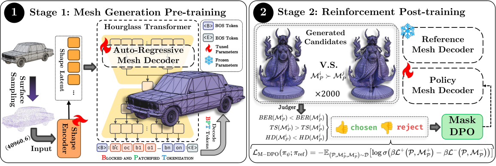

*原文 Figure 16：Figure 15: Mesh-RFT Framework Overview. The pipeline comprises two stages: 1) Mesh Generation Pre-training using an Hourglass AutoRegressive Transformer and a Shape Encoder; and 2) Reinforcement Post-training which employs Mask DPO with reference and policy networks for subsequent refinement. [查看图片来源](https://arxiv.org/html/2509.12815v1/pipeline.png)*

引用来源：arxiv_2608.02711

链接：[arXiv](https://arxiv.org/abs/2509.12815)

##### LATTICE: Democratize High-Fidelity 3D Generation at Scale

作者：Zeqiang Lai, Yunfei Zhao, Zi-Bo Zhao, Haolin Liu, Qin Lin, Jingwei Huang, Chunchao Guo, Xiangyu Yue

主任务：generation

方法标签：3D-native latent space

中文简介：

LATTICE面向高保真三维资产生成，输入生成条件，输出具有细节几何的三维形状。其核心是VoxSet表示：将资产压缩为锚定在粗体素网格上的紧凑潜向量集合，在保留VecSet压缩性的同时引入显式空间结构；生成时先预测稀疏体素化几何锚点，再由整流流Transformer生成详细几何，并支持位置感知和测试时扩展。它属于三维原生潜空间生成，区别于依赖二维先验逐实例优化的方法，也在连续潜表示中强化了空间结构与可扩展解码。

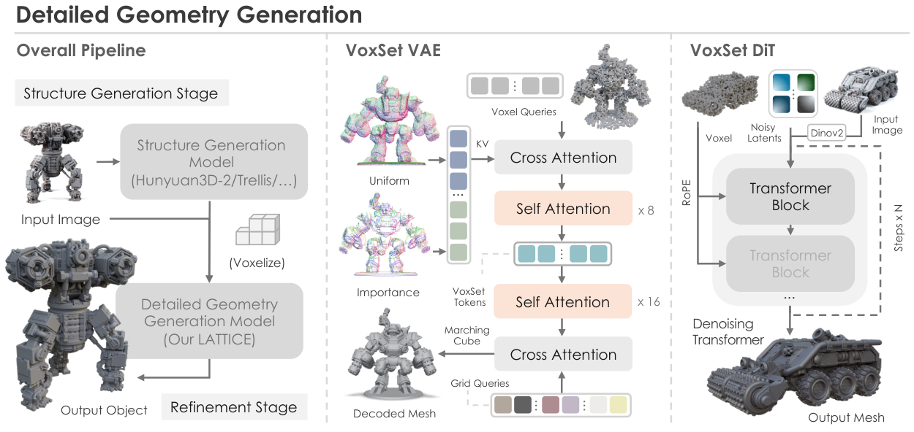

*原文 Figure 4：Figure 5 : LATTICE Model Architecture : it features a two-stage coarse-to-fine pipeline and a novel VoxSet VAE and DiT. [查看图片来源](https://arxiv.org/html/2512.03052v1/shape_arch.png)*

引用来源：arxiv_2608.02711

链接：[arXiv](https://arxiv.org/abs/2512.03052)

##### MoCA: Mixture-of-Components Attention for Scalable Compositional 3D Generation

作者：Zhiqi Li, Wenhuan Li, Tengfei Wang, Zhenwei Wang, Jun-Tao Wu, Haoyuan Wang, Yunhan Yang, Zehuan Huang, Yang Li, Peidong Liu, Chunchao Guo

主任务：generation

中文简介：

MoCA面向由多个语义部件组成的三维物体和场景生成：输入组合条件，输出具有可扩展部件数量的结构化三维资产。其核心是Mixture-of-Components Attention，通过重要性路由选择少量相关部件参与稀疏全局注意力，同时压缩不重要部件以保留上下文先验，从而降低部件数量增加时的计算开销。该方法属于三维部件生成中的可组合建模路线，重点区别于传统部件感知模型的全局二次注意力瓶颈，在细粒度生成与规模扩展之间取得更好的平衡。

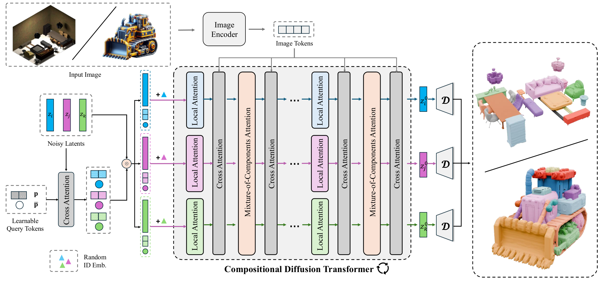

*原文 Figure 1：Figure 2: Overview of MoCA . Our DiT model starts with packing each component’s latents using several learnable queries through a cross-attention layer. Random ID embeddings are applied to distinguish different components. Then, each component’s full latents and compressed version are fed into our DiT model, which is comprised with interleaved local attention blocks and our proposed Mixture-of-Components Attention blocks. Finally, the clean latents of all components are separately decoded to the global space by a frozen shape decoder to form the final 3D asset. [查看图片来源](https://arxiv.org/html/2512.07628v1/pipeline.png)*

引用来源：arxiv_2608.02711

链接：[arXiv](https://arxiv.org/abs/2512.07628)

##### DreamReward-X: Boosting High-Quality 3D Generation with Human Preference Alignment.

作者：Fang-Fu Liu, Junliang Ye, Yikai Wang, Han-Yang Wang, Zhengyi Wang, Jun Zhu, Yue-Qi Duan

主任务：generation

中文简介：

该论文研究文本到三维生成，输入自然语言提示，输出符合用户偏好的三维资产，并进一步扩展到图像到三维和四维生成。方法以预训练扩散模型为基础，收集专家比较反馈，训练通用三维奖励模型 Reward3D，再通过 DreamFL 将生成分布向人类偏好优化；DreamReward++还调整噪声采样以缓解多样性不足。相较主要依赖似然或SDS的前序路线，它引入了显式的人类偏好对齐机制，属于生成类别中的奖励驱动优化方法。

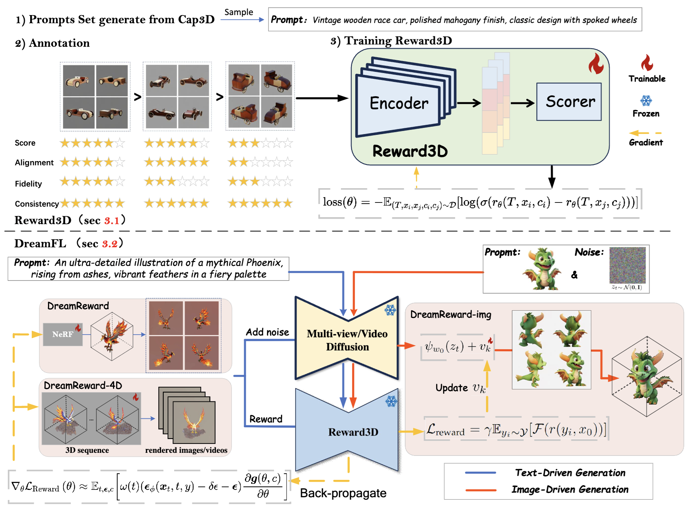

*原文 Figure 1：作者主页公开的 DreamReward-X 方法总览图：包括 Reward3D 偏好模型训练，以及面向文本到 3D、4D 和图像到 3D 的反馈学习流程。 [查看图片来源](https://liuff19.github.io/images/dreamreward-X.png)*

引用来源：arxiv_2608.02711

#### 2026

##### CG-MLLM: Captioning and Generating 3D content via Multi-modal Large Language Models

作者：Junming Huang, Chi Wang, Le-Tian Li, Guang-Kai Xu, Dong-Lin Huang, Hao Chen, Qiang Dai, Weiwei Xu

主任务：generation

方法标签：3D-native latent space

架构标签：unified multimodal model

中文简介：

CG-MLLM同时解决三维内容描述与生成任务：输入图像、语言等多模态信息，输出三维内容的文本描述或高分辨率三维对象。模型采用Mixture-of-Transformer架构，由TokenAR处理细粒度token内容、BlockAR处理空间块级内容，并将视觉语言骨干与专门的三维VAE潜空间整合，使普通token和三维空间块能够在统一架构中长上下文交互。它区别于仅用语言模型提供条件的松耦合系统，代表统一多模态模型中兼顾三维理解与生成的路线。

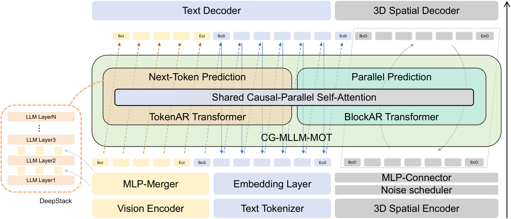

*原文 Figure 1：Figure 1 : The Pipeline of CG-MLLM . Our multimodal architecture processes vision, text, and 3D spatial inputs to generate text and 3D spatial outputs. It features a TokenAR Transformer for sequential next-token prediction and a BlockAR Transformer for efficient parallel block prediction, both governed by strict causal masking. [查看图片来源](https://arxiv.org/html/2601.21798v2/cgmllm_pipeline.png)*

引用来源：arxiv_2608.02711

链接：[arXiv](https://arxiv.org/abs/2601.21798)

##### FACE: A Face-based Autoregressive Representation for High-Fidelity and Efficient Mesh Generation

作者：Hanxiao Wang, Yuan Guo, Ying-Tian Liu, Ziyi Zou, Biao Zhang, Weize Quan, Ding Liang, Yan-Pei Cao, Dong-Ming Yan

主任务：generation

方法标签：mesh token generation

中文简介：

该工作生成紧凑且高保真的三维网格，输入生成条件或单幅图像，输出包含顶点与三角面结构的网格。FACE提出自回归自动编码器，以“一面一token”在面级别而非顶点坐标级别建模网格，并结合VecSet编码器学习紧凑表示；其潜空间还可用于潜扩散的单图到网格生成。相较于将网格展平成超长顶点序列的自回归方法，它显式提升了结构粒度和生成效率，属于结构化网格生成路线。

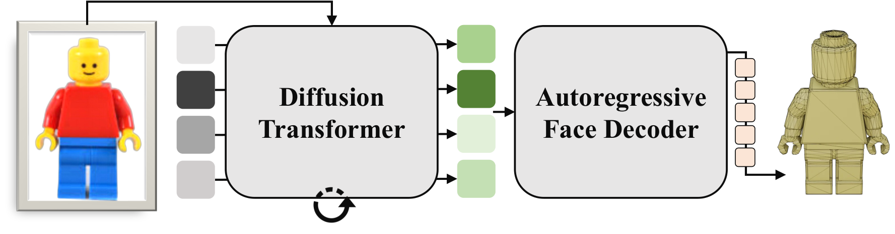

*原文 Figure 2：Figure 3 : Overview of our image-to-mesh generation pipeline. We first use the input image to condition a DiT model. The resulting latent VecSet is then fed into the Autoregressive Face Decoder to produce the final mesh. [查看图片来源](https://arxiv.org/html/2603.01515v2/diffusion_1114_gyc.png)*

引用来源：arxiv_2608.02711

链接：[arXiv](https://arxiv.org/abs/2603.01515)

##### LATO: 3D Mesh Flow Matching with Structured TOpology Preserving LAtents

作者：Tianhao Zhao, You-Jia Zhang, Hang Long, Jin-Sheng Zhang, Wen-Bing Li, Yang Yang, Gongbo Zhang, Jozef Hladký, Matthias Nießner, Wei Yang

主任务：generation

方法标签：3D-native latent space

中文简介：

该工作生成显式三维网格，输入随机噪声或生成条件，输出具有几何结构和拓扑连接的网格。LATO以表面锚定的顶点位移场表示网格，借助稀疏体素VAE压缩为保持拓扑结构的潜变量，再通过两阶段流匹配依次生成结构体素和拓扑特征；解码时直接预测顶点连接，无需等值面提取或启发式网格化。它属于三维原生潜空间生成，区别于三角面扩散及长序列自回归路线。

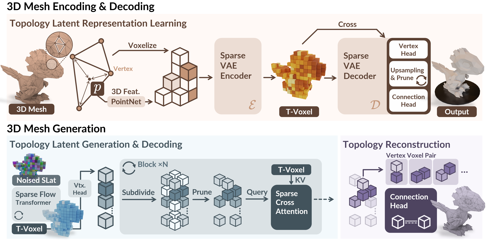

*原文 Figure 2：Figure 3 : Overview of the LATO pipeline. We explicitly encode mesh topology by sampling surface points infused with relative displacement to their enclosing face vertices (Vertex Displacement Field, VDF). These dense features are aggregated and compressed via a sparse voxel VAE into a structured latent representation, termed T-Voxels . To reconstruct the mesh, the T-Voxels undergo hierarchical subdivision and learnable pruning to precisely instantiate high-resolution vertex locations. Simultaneously, a connection head predicts edge existence between vertex pairs, directly recovering the explicit mesh topology. [查看图片来源](https://arxiv.org/html/2603.06357v1/figures/pipeline.png)*

引用来源：arxiv_2608.02711

链接：[arXiv](https://arxiv.org/abs/2603.06357)

##### Omni123: Exploring 3D Native Foundation Models with Limited 3D Data by Unifying Text to 2D and 3D Generation

作者：Chongjie Ye, Chen Cao, Chuanyu Pan, Yi-Ming Hao, Yihao Zhi, Yuan-Ming Hu, Xiao-Guang Han

主任务：generation

中文简介：

该工作统一处理文本到二维图像和文本到三维资产的生成，并进一步支持三维编辑；输入文本、图像或跨模态条件，输出相应的图像或三维表示。Omni123将文本、图像和三维内容编码为共享序列空间中的离散token，以自回归方式执行交错的跨模态任务，并通过语义—视觉—几何循环利用丰富二维数据约束三维。它区别于先编辑二维再优化提升三维的间接路线，代表三维原生统一多模态建模方向。

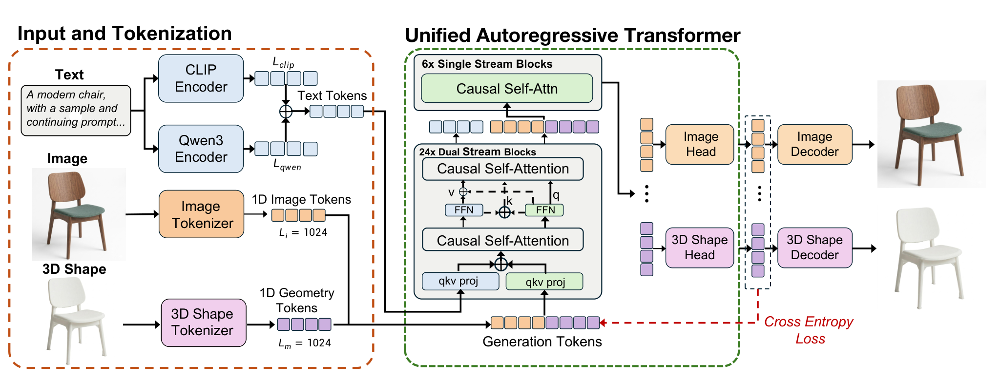

*原文 Figure 3：Figure 3 : Overview of the Omni123 architecture. Text is encoded by dual text encoders (CLIP [ 60 ] and Qwen3-0.6B [ 87 ] ) and fed into a conditioning stream, while images and 3D shapes are tokenized into 1D discrete tokens and concatenated into a unified generation stream. The unified autoregressive transformer backbone uses 24 dual-stream blocks to jointly process the conditioning and generation tokens under causal attention, followed by 6 single-stream layers operating only on generation tokens, and finally with modality-specific linear heads decoding token logits over the 2D and 3D codebooks. [查看图片来源](https://arxiv.org/html/2604.02289v1/pretraining2.png)*

引用来源：arxiv_2608.02711

链接：[arXiv](https://arxiv.org/abs/2604.02289)

##### EVA01: Unified Native 3D Understanding and Generation via Mixture-of-Transformers

作者：Zongyuan Yang, Ming Yi, Wanli Ma, C. Fan, Bocheng Li, Baolin Liu, Yuke Lou, Yingde Song, Yongping Xiong, Zheng-Dong Guo, Shimu Wang

主任务：generation

架构标签：unified multimodal model

中文简介：

该工作将三维网格作为原生模态集成进多模态大语言模型，支持三维理解、生成和上下文感知编辑。架构上采用Mixture-of-Transformers，将模型分离为预训练的理解专家和结构镜像的生成专家，通过共享全局自注意力与硬模态路由耦合，使语义潜在空间与几何流形对齐。不同于依赖二维像素先验的扩散式大重建模型，也不同于仅把三维作为外部输出的MLLM方法，它在统一骨干中直接传递三维几何信息，无需中间二维表示，并支持长上下文多轮编辑。

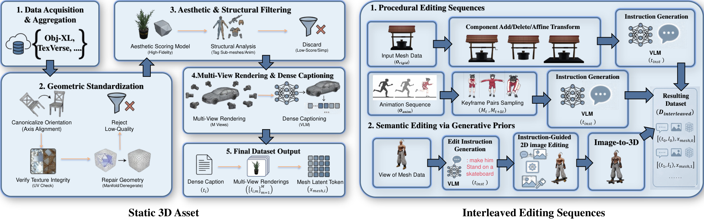

*原文 Figure 2：Figure 3 : Data Curation Pipeline of EVA01. (Left) Static 3D Asset Curation: We standardize raw 3D assets through geometric canonicalization, aesthetic filtering, and multi-view dense captioning to construct high-quality text-image-mesh triplets. (Right) Interleaved Editing Sequences: To enable context-aware editing, we synthesize multi-turn sequences via two complementary pathways: Procedural Editing (top right) utilizing rigid transformations and animation keyframes for structural precision, and Semantic Editing (bottom right) leveraging 2D generative priors for open-ended stylistic modification. [查看图片来源](https://arxiv.org/html/2605.16745v1/fig-data-pipeline.png)*

引用来源：arxiv_2608.02711

链接：[arXiv](https://arxiv.org/abs/2605.16745)

##### PhysForge: Generating Physics-Grounded 3D Assets for Interactive Virtual World

作者：Yunhan Yang, Chunshi Wang, Junliang Ye, Yang Li, Zanxin Chen, Zehuan Huang, Yao Mu, Zhuo Chen, Chunchao Guo, Xihui Liu

主任务：generation

中文简介：

任务是根据条件生成具备物理交互能力的三维资产，输出几何形状与运动学参数。方法采用解耦两阶段框架：先由视觉语言模型作为“物理架构师”规划层次化物理蓝图，定义材料、功能和运动学约束；再由物理grounded扩散模型通过KineVoxel注入机制合成高保真几何和运动学参数，并有大规模四层物理标注数据集支撑。区别于只关注静态外观的三维生成，它把功能逻辑和层次物理纳入生成过程，面向交互式虚拟世界和具身智能。

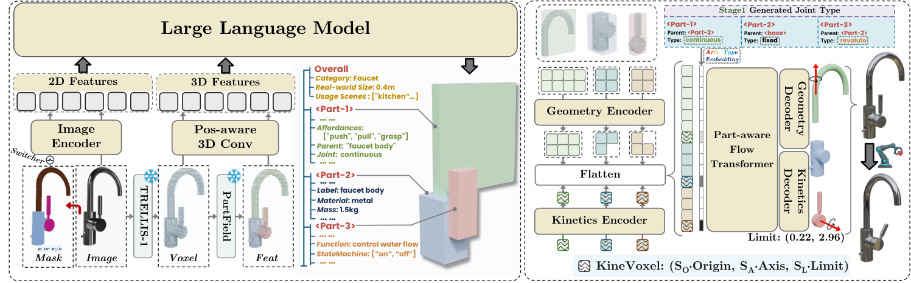

*原文 Figure 1：Figure 2 : Method overview. PhysForge consists of two stages: (Left) Stage 1: VLM-based Planning, where the VLM planner generates a “Hierarchical Physical Blueprint” defining part structure and physical properties. (Right) Stage 2: Diffusion-based Generation, where a diffusion model, guided by the blueprint, uses the KineVoxel Injection (KVI) mechanism to synergistically generate the final geometry, texture, and precise kinematic parameters. [查看图片来源](https://arxiv.org/html/2605.05163v1/pipeline.png)*

引用来源：arxiv_2608.02711

链接：[arXiv](https://arxiv.org/abs/2605.05163)

##### MeshFlow: Efficient Artistic Mesh Generation via MeshVAE and Flow-based Diffusion Transformer

作者：Wei-Yu Li, Antoine Toisoul, Tom Monnier, Roman Shapovalov, Rakesh Ranjan, Ping Tan, Andrea Vedaldi

主任务：generation

中文简介：

MeshFlow解决从条件信息生成具有艺术风格三维网格的任务，输出同时包含连续的顶点位置与离散的连接关系。方法先以带对比学习监督的MeshVAE将几何与拓扑压缩到连续三维潜空间，再利用Rectified Flow Transformer并行生成全部顶点和边。它属于三维原生潜空间生成，区别于依赖离散网格token逐步预测的自回归路线：生成直接在三维潜变量中进行，避免坐标量化，并以并行推理提升效率。

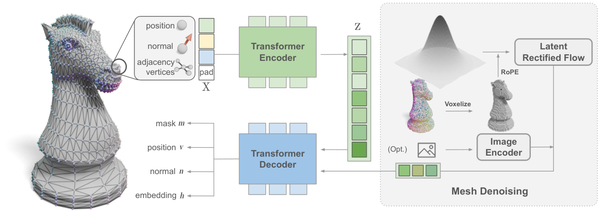

*原文 Figure 2：Figure 3 : Overview of our method. We first propose MeshVAE, which compresses vertices, vertex normals, and discrete adjacency relationships of a mesh into a continuous latent space. This is supervised by the ground-truth vertices and vertex normals, coupled with a contrastive learning approach applied to vertex adjacency. We then employ latent Rectified Flow based on the proposed representation, and finally pass the result through the Mesh Decoder to obtain a mesh. [查看图片来源](https://arxiv.org/html/2606.04621v2/overview_v1_1.png)*

引用来源：arxiv_2608.02711

链接：[arXiv](https://arxiv.org/abs/2606.04621)

##### PolyFlow: Continuous Topology Embedding Flow Matching for Artist-style Mesh Generation

作者：Chunshi Wang, Haohan Weng, Junliang Ye, Biwen Lei, Yang Li, Zi-Bo Zhao, Zeqiang Lai, Kai-Yi Zhang, Yunhan Yang, Zhuo Chen, Chunchao Guo, Yawei Luo

主任务：generation

中文简介：

PolyFlow解决从点云条件生成艺术风格三维网格的任务，输入是提取的点云特征和目标顶点数，输出是具有几何、法线与拓扑结构的低面数网格。方法上，它先用拓扑嵌入器将顶点位置、法线及可恢复的邻接信息统一编码为连续的逐顶点状态，再以Transformer执行流匹配，通过ODE求解器并行去噪生成。该工作属于自回归或流式网格生成，以连续表示绕开网格拓扑难以施加扩散噪声的问题，相比自回归路线显著减少了顺序解码依赖，并能直接控制网格分辨率。

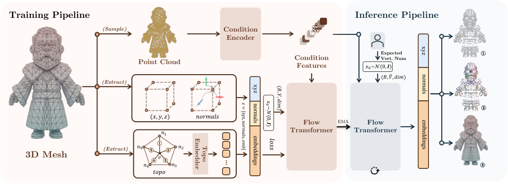

*原文 Figure 2：Figure 2: Overview of the PolyFlow pipeline. Left—Training: Given a 3D mesh, we sample a point cloud and encode it into condition features via a frozen condition encoder. Vertex positions ( x , y , z ) (x,y,z) , surface normals, and topology embeddings produced by a frozen topology embedder are concatenated to form the joint flow state 𝐳 = [ xyz , normals , emb ] \mathbf{z}=[\mathrm{xyz},\,\mathrm{normals},\,\mathrm{emb}] of shape ( B , V , D ) (B,V,D) . A Flow Transformer is trained to denoise 𝐳 \mathbf{z} from Gaussian noise 𝐱 0 ∼ 𝒩 ⁡ ( 𝟎 , 𝐈 ) \mathbf{x}_{0}\sim\mathcal{N}(\mathbf{0},\mathbf{I}) , conditioned on the point-cloud features. Right—Inference: The user specifies an expected vertex count V ^ \hat{V} ; we initialize V ^ \hat{V} tokens from noise of shape ( B , V ^ , D ) (B,\hat{V},D) and denoise them in parallel with the EMA copy of the Flow Transformer. The denoised output is split into three channel groups—➀ vertex positions, ➁ surface normals, and ➂ topology embeddings—from which edges and faces are decoded via spacetime distance thresholding to produce the final mesh. [查看图片来源](https://arxiv.org/html/2606.30673v1/Pipeline.png)*

引用来源：arxiv_2608.02711

链接：[arXiv](https://arxiv.org/abs/2606.30673)

### 三维资产编辑（editing）

#### 2023

##### Instruct-NeRF2NeRF: Editing 3D Scenes with Instructions

作者：Ayaan Haque, Matthew Tancik, Alexei A. Efros, Aleksander Holynski, Angjoo Kanazawa

主任务：editing

方法标签：instance-level optimization

中文简介：

Instruct-NeRF2NeRF解决基于指令的三维场景编辑，输入已有NeRF、其重建图像集合和文本编辑指令，输出完成语义修改且保持场景结构的NeRF。方法使用图像条件扩散模型迭代编辑多视图图像，并在此过程中持续优化底层三维场景，使各视角修改保持一致。它属于三维资产编辑中的视图编辑后重建路线，区别于从零生成，也比仅编辑单张二维图像更直接地约束三维一致性。

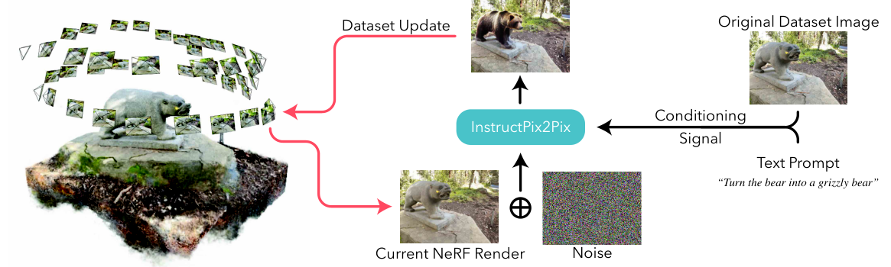

*原文 Figure 1：Figure 2: Overview : Our method gradually updates a reconstructed NeRF scene by iteratively updating the dataset images while training the NeRF: (1) an image is rendered from the scene at a training viewpoint, (2) it is edited by InstructPix2Pix given a global text instruction, (3) the training dataset image is replaced with the edited image, and (4) the NeRF continues training as usual. [查看图片来源](https://arxiv.org/html/2303.12789v2/pipeline.png)*

引用来源：arxiv_2608.02711

链接：[arXiv](https://arxiv.org/abs/2303.12789)

##### Shap-Editor: Instruction-guided Latent 3D Editing in Seconds

作者：Minghao Chen, Junyu Xie, Iro Laina, A. Vedaldi

主任务：editing

中文简介：

该论文解决指令引导的三维资产编辑任务，输入已有三维对象及自然语言编辑指令，输出完成语义修改的新三维对象。方法先将对象编码到Shap-E的三维潜空间，再训练前馈编辑网络直接变换潜变量，从而避免传统二维编辑蒸馏在测试阶段逐实例优化。它在三维编辑领域区别于耗时的优化式方法，代表利用预训练三维潜空间实现快速、前向推理编辑的路线。

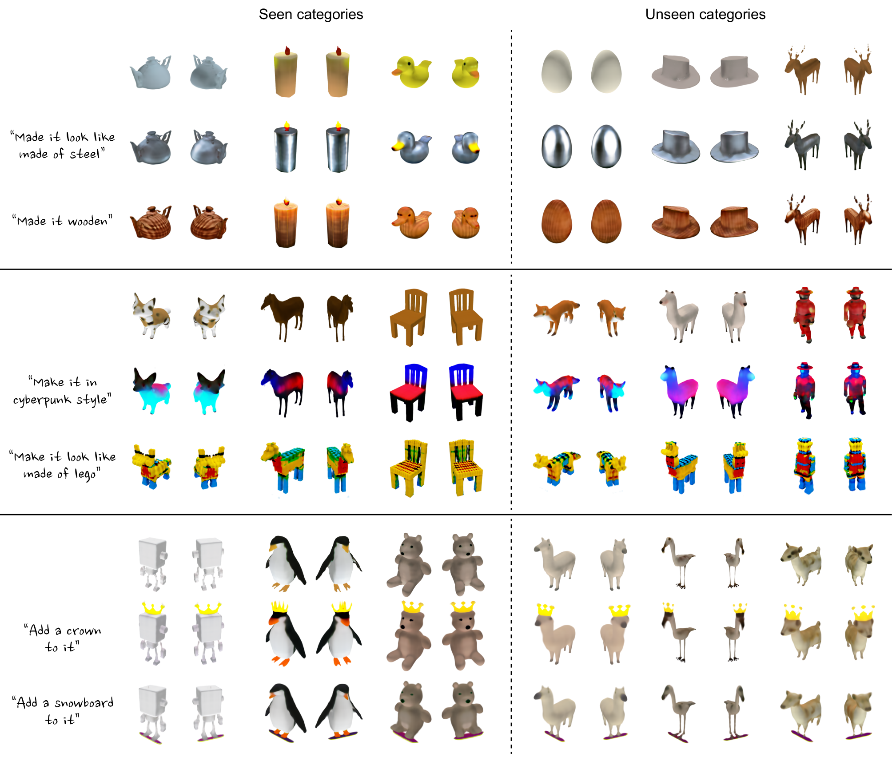

*原文 Figure 7：Figure 8 : Additional visualisations. We apply different editing instructions (including both global and local edits) across various instances, also demonstrating the generalisability of our method to multiple unseen categories. [查看图片来源](https://arxiv.org/html/2312.09246v1/additional_results_sup.png)*

引用来源：arxiv_2608.02711

链接：[arXiv](https://arxiv.org/abs/2312.09246)

#### 2024

##### TIP-Editor: An Accurate 3D Editor Following Both Text-Prompts And Image-Prompts

作者：Jingyu Zhuang, Di Kang, Yanpei Cao, Guanbin Li, Liang Lin, Ying Shan

主任务：editing

中文简介：

TIP-Editor解决带有精确外观和位置控制的三维场景编辑任务：输入已有三维场景、文本提示、参考图像和三维包围盒，输出指定区域被修改而背景基本保持不变的场景。方法采用分阶段二维个性化学习表示原场景与参考外观，并加入定位损失约束目标位置，再利用显式三维高斯泼溅表示执行局部编辑。它属于三维资产编辑，相比仅依赖文本或全局优化的方法，同时利用图像提示和空间框提供更细粒度的外观与位置控制。

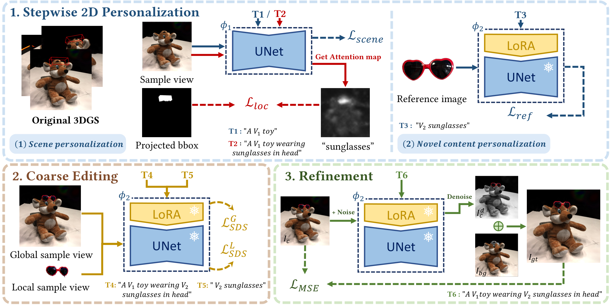

*原文 Figure 2：Figure 2. Method overview. TIP-Editor optimizes a 3D scene that is represented as 3D Gaussian splatting (GS) to conform with a given hybrid text-image prompt. The editing process includes three stages: 1) a stepwise 2D personalization strategy, which features a localization loss in the scene personalization step and a separate novel content personalization step dedicated to the reference image based on LoRA (Sec. 4.1 ); 2) a coarse editing stage using SDS (Sec. 4.2 ); and 3) a pixel-level texture refinement stage, utilizing carefully generated pseudo-GT image from both the rendered image I c I_{c} and the denoised image I c d I_{c}^{d} (Sec. 4.3 ). [查看图片来源](https://arxiv.org/html/2401.14828v3/framework.png)*

引用来源：arxiv_2608.02711

链接：[arXiv](https://arxiv.org/abs/2401.14828)

##### Tailor3D: Customized 3D Assets Editing and Generation with Dual-Side Images

作者：Zhangyang Qi, Yu-nuo Yang, Mengchen Zhang, Long Xing, Xiaoyang Wu, Tong Wu, Dahua Lin, Xihui Liu, Jiaqi Wang, Hengshuang Zhao

主任务：editing

中文简介：

Tailor3D面向已有或待生成资产的定制编辑，输入可编辑的正反面图像及局部修改或整体风格指令，输出统一的三维资产。方法先编辑正面，再借助多视图扩散生成背面并继续编辑，最后通过Dual-sided LRM融合正反两侧三维特征，并结合LoRA Triplane Transformer形成统一表示。相较直接从多视图编辑、容易产生重叠区域冲突的方案，它采用双侧协同流程突出局部定制，并以专门的融合模块修正前后视图不一致，属于训练式三维资产编辑路线。

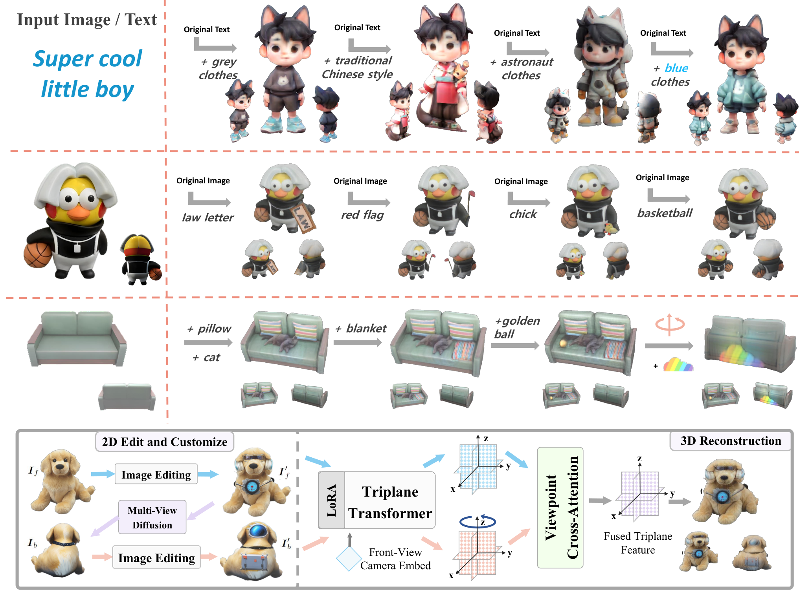

*原文 Figure 1：Figure 1 : Results and Pipeline . We show our method for 3D style customization, as well as geometry and texture editing. Our pipeline involves editing images and generating the 3D object using Dual-sided LRM, with each step completed in just 5 seconds, allowing for rapid 3D object customization. [查看图片来源](https://arxiv.org/html/2407.06191v1/fig_teaser.png)*

引用来源：arxiv_2608.02711

链接：[arXiv](https://arxiv.org/abs/2407.06191)

##### MVInpainter: Learning Multi-View Consistent Inpainting to Bridge 2D and 3D Editing

作者：Chenjie Cao, Chaohui Yu, Yanwei Fu, Fan Wang, Xiangyang Xue

主任务：editing

中文简介：

MVInpainter面向已有场景的三维编辑，输入多视图图像及参考引导，输出跨视角一致的移除、合成、插入或替换结果。它将三维编辑改写为多视图二维局部修复任务，仅对部分区域进行inpainting，并利用未遮挡线索降低新视角生成难度；视频运动先验、参考注意力和slot attention共同维持视图一致性与相机运动控制，且训练和推理不依赖显式姿态。相较依赖相机位姿或从零生成新视图的路线，该方法更贴近真实场景中的二维—三维编辑衔接。

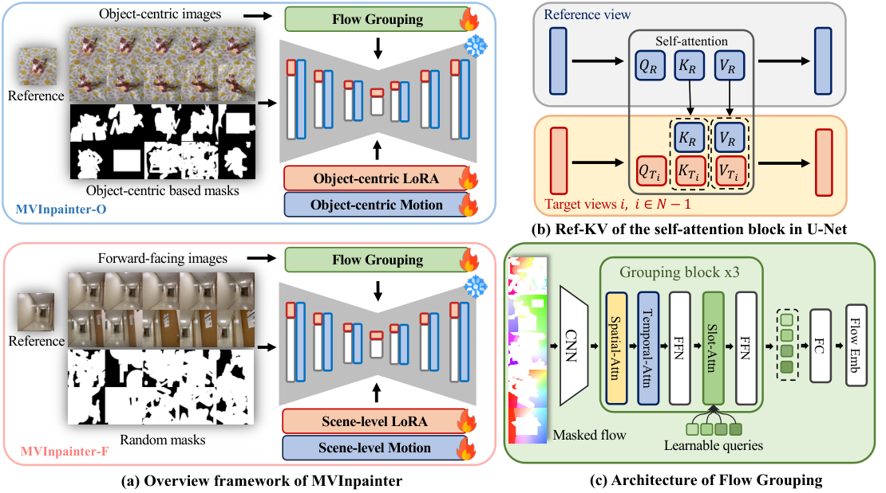

*原文 Figure 3：Figure 3 : (a) The overview of the proposed MVInpainter. MVInpainter-O is trained on object-centric data, while MVInpainter-F is trained on forward-facing data with a shared SD-inpainting backbone of different LoRA/motion weights and masking strategies. The object-centric MVInpainter focuses on the object-level NVS, while the forward-facing one is devoted to object removal and scene-level inpainting. (b) The Ref-KV is used in spatial self-attention blocks of denoising U-Net. (c) The slot-attention based flow grouping module is used to learn implicit pose features. Dashed boxes in (b) and (c) mean feature concatenation. [查看图片来源](https://arxiv.org/html/2408.08000v3/overview.png)*

引用来源：arxiv_2608.02711

链接：[arXiv](https://arxiv.org/abs/2408.08000)

##### 3D Mesh Editing Using Masked LRMs

作者：William Gao, Dilin Wang, Yuchen Fan, Aljaz Bozic, Tuur Stuyck, Zhengqin Li, Zhao Dong, Rakesh Ranjan, Nikolaos Sarafianos

主任务：editing

中文简介：

该论文解决已有三维网格的局部编辑任务：输入待编辑的三维区域及其规范视角下的编辑图像，输出保留未编辑区域、并在指定区域生成新几何的网格。方法将编辑转化为条件掩码重建，训练带三维遮挡多视角掩码的Large Reconstruction Model，并以干净视图提供条件。相较依赖逐实例优化的路线，它属于训练式前馈编辑，可在一次推理中兼顾结构保真与编辑表达力。

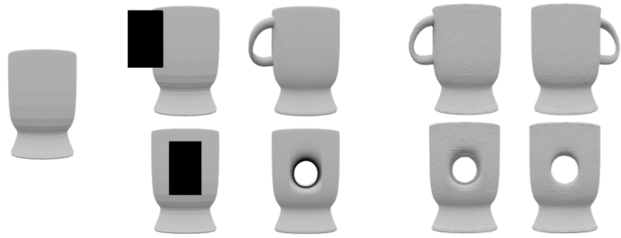

*原文 Figure 4：Figure 4 : Genus changes : Our method unlocks genus-changing edits like adding a handle or a hole to the original vase. We show the output of our model from 2 opposing views in the 3 r ​ d 3^{rd} column. [查看图片来源](https://arxiv.org/html/2412.08641v2/figs/Images/genus_nikos.png)*

引用来源：arxiv_2608.02711

链接：[arXiv](https://arxiv.org/abs/2412.08641)

##### Instant3dit: Multiview Inpainting for Fast Editing of 3D Objects

作者：Amir Barda, Matheus Gadelha, Vladimir G. Kim, Noam Aigerman, Amit H. Bermano, Thibault Groueix

主任务：editing

中文简介：

该论文解决已有三维对象的快速编辑：输入网格、NeRF或高斯表示，以及编辑区域和图像条件，输出完成修改的对应三维表示。方法把三维编辑转化为多视角图像修复，利用扩散模型生成和修复各视图，再借助大型重建模型映射回不同三维表示；训练时设计多种掩码以模拟用户编辑。它属于训练式前馈编辑路线，区别于需要运行SDS逐实例优化的方法，在表示形式上也更具通用性。

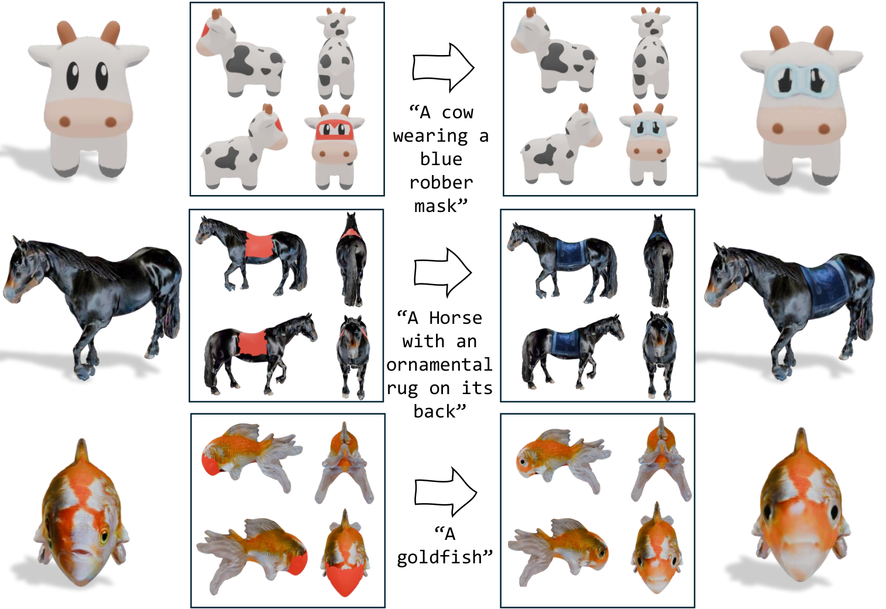

*原文 Figure 12：Figure 8 : Application: texture editing. Our method can be used to modify texture on a user-selected region. In this case, we run through our NeRF editing pipeline, but only sample colors from the NeRF in the selected region. [查看图片来源](https://arxiv.org/html/2412.00518v1/texturing_experiment.png)*

引用来源：arxiv_2608.02711

链接：[arXiv](https://arxiv.org/abs/2412.00518)

#### 2025

##### Geometry in Style: 3D Stylization via Surface Normal Deformation

作者：Nam Anh Dinh, Itai Lang, Hyunwoo Kim, Oded Stein, Rana Hanocka

主任务：editing

中文简介：

该论文解决已有三角网格的身份保持式风格化任务，以输入网格和文本风格提示为条件，输出保留原始形状身份但具有新风格的网格。方法将局部网格变形表示为目标法向，并通过可微的As-Rigid-As-Possible层求解顶点旋转与位置，再利用文生图模型的视觉损失驱动变形符合文本风格。它属于三维编辑中的逐实例优化路线，相比仅使用凹凸贴图的方法更具表现力，同时比自由形变更强调结构与身份保持。

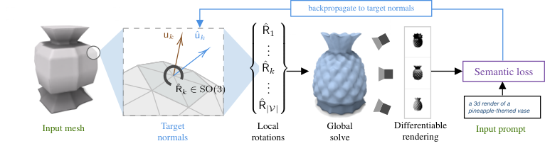

*原文 Figure 2：Figure 3 : Overview of our stylization pipeline. Geometry in Style optimizes vertex normals to deform the mesh surface, subject to a stylization text prompt. Using the normals undergoing optimization as a target for our differentiable As-Rigid-As-Possible method (dARAP), the dARAP local step computes a rotation matrix per vertex; we then obtain the deformed surface via our dARAP global solve. Then, we utilize a differentiable renderer and a diffusion model-based semantic loss to guide the normals being optimized towards a deformation matching the desired style prompt. [查看图片来源](https://arxiv.org/html/2503.23241v2/prerenderedfig-overview-v2-nobluegradient.png)*

引用来源：arxiv_2608.02711

链接：[arXiv](https://arxiv.org/abs/2503.23241)

##### Pro3D-Editor : A Progressive-Views Perspective for Consistent and Precise 3D Editing

作者：Yang Zheng, Mengqi Huang, Nan Chen, Z. Mao

主任务：editing

中文简介：

Pro3D-Editor面向文本引导的已有三维资产局部编辑，输入三维对象和编辑指令，输出语义改变且跨视角一致的对象。其核心是渐进式视图范式：先动态选择编辑最显著的主视图，再通过MoVE-LoRA将语义传播到关键视图，最后利用多视图结果进行全视图三维细化。它属于三维资产编辑中的视图协同路线，区别于以往不区分视图、独立修改二维投影后再回写三维的方法，更重视视图间依赖和局部精确性。

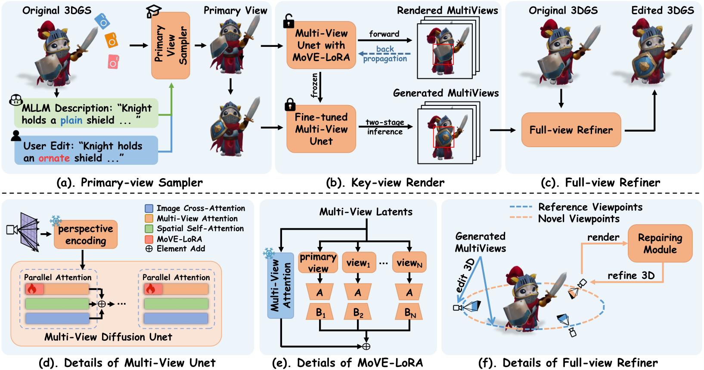

*原文 Figure 2：Figure 2: Method overview . Given a 3D object represented by 3DGS, Pro3D-Editor achieves precise 3D editing, which includes three main steps: (a) Primary-view Sampler selects and edits the most editing-salient view as the primary view. (Sec. 3.1 ); (b) Key-view Render accurately propagates the editing information from the primary view to local regions of the remaining key views. (Sec. 3.2 ); (c) Full-view Refiner edits and refines the 3D object based on the edited multi-views. (Sec. 3.3 ). [查看图片来源](https://arxiv.org/html/2506.00512v2/overview.png)*

引用来源：arxiv_2608.02711

链接：[arXiv](https://arxiv.org/abs/2506.00512)

##### VoxHammer: Training-Free Precise and Coherent 3D Editing in Native 3D Space

作者：Lin Li, Zehuan Huang, Hao-li Feng, Gengxiong Zhuang, Rui Chen, Chunchao Guo, Lu Sheng

主任务：editing

中文简介：

该工作面向已有三维模型的局部编辑，输入三维资产、待编辑区域及编辑条件，输出修改后的三维对象，同时保持未编辑区域和整体结构一致。VoxHammer无需训练新模型，先预测输入模型的反演轨迹并缓存各步潜变量与键值特征，再在去噪时用这些信息替换保留区域的特征，从原生三维潜空间完成编辑。相较先编辑多视图图像再重建的路线，它直接维护三维上下文，更强调局部精确性与跨区域连贯性。

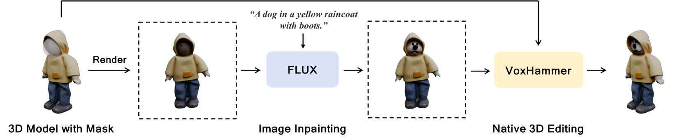

*原文 Figure 1：Figure 2 : Pipeline. Given an input 3D model, a user-specified editing region, and a text prompt, the off-the-shelf models [ 40 , 3 ] are used to inpaint the rendered view from the 3D model. Subsequently, our VoxHammer , a training-free framework based on structured 3D diffusion models [ 90 ] , performs native 3D editing conditioned on the input 3D and the edited image. [查看图片来源](https://arxiv.org/html/2508.19247v1/pipeline.png)*

引用来源：arxiv_2608.02711

链接：[arXiv](https://arxiv.org/abs/2508.19247)

##### NANO3D: A Training-Free Approach for Efficient 3D Editing Without Masks

作者：Junliang Ye, Shenghao Xie, Ruowen Zhao, Zhengyi Wang, Hongyu Yan, Wen-Qiang Zu, Lei Ma, Jun Zhu

主任务：editing

中文简介：

NANO3D解决无需三维掩码的局部三维资产编辑，输入已有三维对象、前视图引导及编辑要求，输出局部修改且尽量保持其他区域的三维对象。方法采用免训练流程，将FlowEdit接入TRELLIS进行局部编辑，并通过Voxel-Merge和Slat-Merge融合编辑区与未编辑区，以维持结构连续性。相较主要依赖多视图编辑后重建的路线，它强调实例级高效优化和区域感知合并，并进一步构建编辑数据资源。

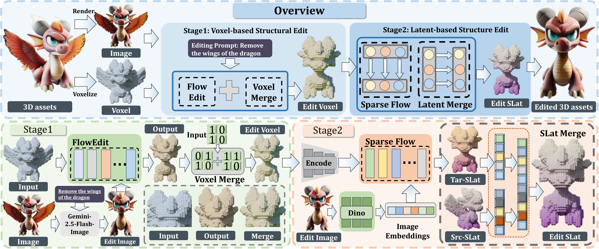

*原文 Figure 2：Figure 2: The Nano3D pipeline. The original 3D object is voxelized and encoded into sparse structure and structured latent respectively. Stage 1 modifies geometry via Flow Transformer with FlowEdit, guided by Nano Banana–edited images. Stage 2 generates structured latents with Sparse Flow Transformer, supporting TRELLIS-inherent appearance editing. Voxel/Slat-Merge further ensures consistency across both stages before decoding the final 3D object. [查看图片来源](https://arxiv.org/html/2510.15019v1/pipeline.png)*

引用来源：arxiv_2608.02711

链接：[arXiv](https://arxiv.org/abs/2510.15019)

##### Towards Scalable and Consistent 3D Editing

作者：Ruihao Xia, Yang Tang, Pan Zhou

主任务：editing

中文简介：

3DEditFormer针对已有三维资产的局部几何或外观编辑，输入对象、编辑条件及相关图像信息，输出保持原结构和跨视角一致性的编辑结果。其核心是结构保持条件Transformer，通过双重引导注意力和时间自适应门控分离可编辑区域与需保留的结构，并摆脱辅助三维掩码。相较依赖手工精确掩码或逐视图重建的方法，它代表训练式前馈三维编辑路线，重点提升可扩展性和局部控制。

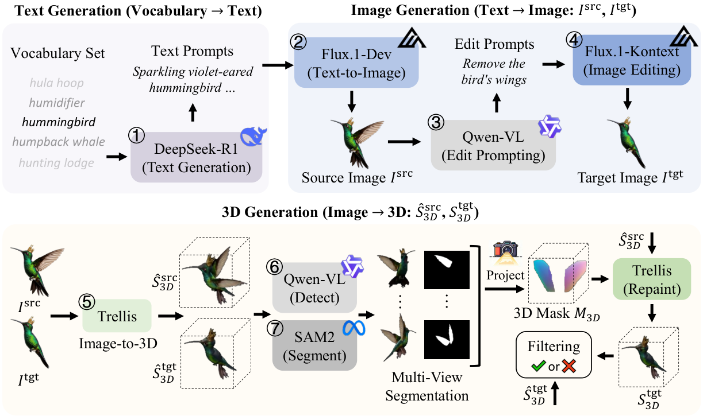

*原文 Figure 2：Figure 2: Overview of our data generation pipeline for text-guided 3D editing. Starting from a large-scale Vocabulary Set, we employ multiple foundation models in a carefully orchestrated manner and construct the text-to-image-to-3D lifting pipeline. [查看图片来源](https://arxiv.org/html/2510.02994v1/label_vis.png)*

引用来源：arxiv_2608.02711

链接：[arXiv](https://arxiv.org/abs/2510.02994)

##### AnchorFlow: Training-Free 3D Editing via Latent Anchor-Aligned Flows

作者：Zhen Zhou, Fan Ma, Chengzhuo Gui, Xiaobo Xia, Hehe Fan, Yi Yang, Tat-Seng Chua

主任务：editing

中文简介：

AnchorFlow解决基于人类指令的三维资产编辑任务，输入源三维形状与编辑指令，输出完成语义修改且尽量保持结构的三维形状。方法无需训练或微调模型，在扩散采样的源轨迹与目标轨迹之间建立共享的全局潜在锚点，并以宽松锚点对齐损失和对应更新规则稳定编辑过程，同时采用无掩码设计保留未编辑几何。它属于三维编辑中的训练免优化路线，针对前序方法因时间步噪声造成潜在参考不一致、编辑不稳定的问题进行改进。

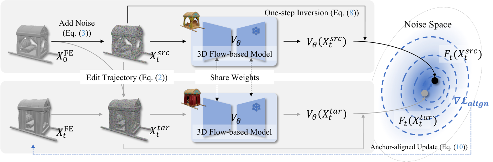

*原文 Figure 2：Figure 3 : Overview of the AnchorFlow for Training-free and Mask-free 3D Editing. Given a source model and an editing instruction, AnchorFlow first constructs the source sample 𝑿 t src \bm{X}^{\mathrm{src}}_{t} and forms the editing sample 𝑿 t FE \bm{X}^{\mathrm{FE}}_{t} at the t t step. A 3D flow-based model 𝒗 θ \bm{v}_{\theta} predicts velocity fields for both the source and target sample. To stabilize the editing process, AnchorFlow performs a single-step inversion to approximate the latent anchors F t ​ ( 𝑿 t src ) F_{t}(\bm{X}^{\mathrm{src}}_{t}) and F t ​ ( 𝑿 t tar ) F_{t}(\bm{X}^{\mathrm{tar}}_{t}) , and aligns them in noise space via the anchor-aligned update guided by ∇ ℒ align \nabla\mathcal{L}_{\mathrm{align}} . This design enforces consistent latent anchors, mitigates geometric distortions, and produces structurally stable 3D edits. [查看图片来源](https://arxiv.org/html/2511.22357v1/framework_v2.png)*

引用来源：arxiv_2608.02711

链接：[arXiv](https://arxiv.org/abs/2511.22357)

##### Native 3D Editing with Full Attention

作者：Weiwei Cai, Shuangkang Fang, Wei-Cai Ye, Xin Dong, Yunhan Yang, Xuan-Yang Zhang, Wei Cheng, Yanpei Cao, Gang Yu, Tao Chen

主任务：editing

中文简介：

Native 3D Editing with Full Attention处理指令引导的三维资产编辑，输入已有三维对象和自然语言指令，输出完成增加、删除或修改且保留未编辑区域的三维对象。方法构建大规模多模态编辑数据集，并训练模型在单次前向过程中直接操作三维表示，比较跨注意力与三维token拼接两种条件方式，后者以更少参数实现更有效的交互。它代表三维编辑中的原生三维前馈路线，相较逐实例优化更高效，也避免了多视图二维编辑再提升到三维时的几何不一致。

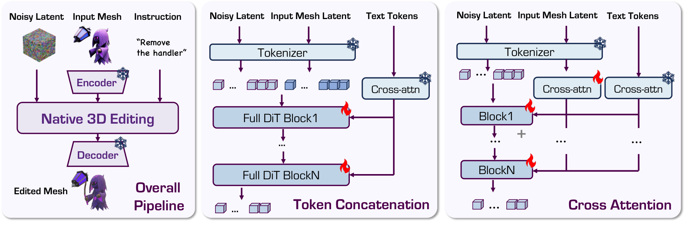

*原文 Figure 2：Figure 2: Overview of our proposed framework for native 3D editing. The pipeline manipulates 3D objects based on textual instructions, utilizing token concatenation as a parameter-efficient alternative to cross-attention, achieving superior editing performance without additional complexity. [查看图片来源](https://arxiv.org/html/2511.17501v1/framework.png)*

引用来源：arxiv_2608.02711

链接：[arXiv](https://arxiv.org/abs/2511.17501)

##### Feedforward 3D Editing via Text-Steerable Image-to-3D

作者：Ziqi Ma, Hongqiao Chen, Yisong Yue, Georgia Gkioxari

主任务：editing

中文简介：

Steer3D解决生成后三维资产的语言编辑问题：输入原始图像到三维模型及文本指令，输出按指令修改、同时保持原资产结构和身份的新三维资产。方法受ControlNet启发，在预训练image-to-3D模型中加入文本控制分支，并通过自动数据引擎构造训练数据，采用流匹配训练和直接偏好优化两阶段学习。相较依赖场景级迭代优化或多视图传播的编辑方法，它属于文本可控的前馈三维编辑路线，将语言操控直接融入已有图像到三维生成器。

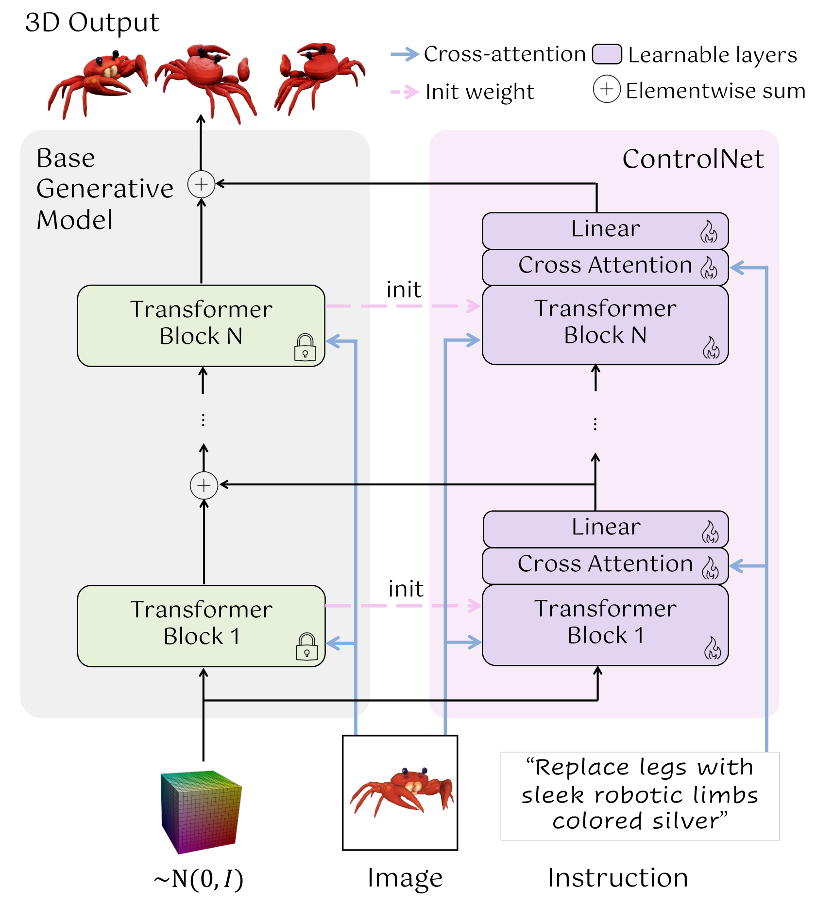

*原文 Figure 2：Figure 3 : Steer3D architecture: we design a ControlNet-based architecture to leverage the shape and geometry prior of pretrained image-to-3D generative models. We add a trainable ControlNet block corresponding to each transformer block in the base model. [查看图片来源](https://arxiv.org/html/2512.13678v1/controlnet.png)*

引用来源：arxiv_2608.02711

链接：[arXiv](https://arxiv.org/abs/2512.13678)

#### 2026

##### Easy3E: Feed-Forward 3D Asset Editing via Rectified Voxel Flow

作者：Shimin Hu, Yuanyi Wei, Fei Zha, Yudong Guo, Juyong Zhang

主任务：editing

中文简介：

Easy3E解决已有三维模型的编辑任务：输入单个编辑视角及原始三维资产，输出完成语义修改且跨视角一致的新资产。方法基于TRELLIS生成骨干，在稀疏体素潜空间中引入由编辑驱动的Voxel FlowEdit，以单次前向实现整体几何变形，并借助法线引导的单视图到多视图生成模块恢复高频外观细节。相较逐实例迭代优化路线，它属于训练式前馈三维编辑，重点改善速度、全局一致性与纹理保真度。

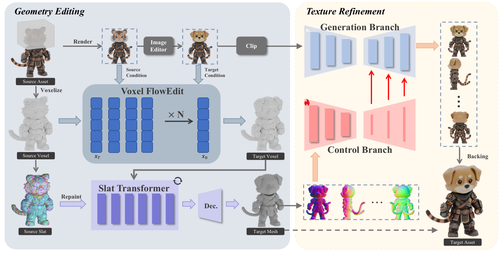

*原文 Figure 1：Figure 2 : Overview of Easy3E. The framework operates in two main stages: Geometry Editing and Texture Refinement. Starting from a rendered source view, an edited target image provides the guidance for editing. In the Geometry Editing stage, the Voxel FlowEdit algorithm transforms the source voxel structure under flow-based guidance, followed by SLAT Repainting that refines local latent features to produce the target mesh. The Texture Refinement stage then employs a generation branch and a normal-guided control adapter to synthesize multi-view-consistent textures, which are projected and fused onto the mesh to yield the final high-fidelity 3D asset. [查看图片来源](https://arxiv.org/html/2602.21499v2/pipeline.png)*

引用来源：arxiv_2608.02711

链接：[arXiv](https://arxiv.org/abs/2602.21499)

##### ShapeUP: Scalable Image-Conditioned 3D Editing

作者：Inbar Gat, Dana Cohen-Bar, Guy J. Levy, Elad Richardson, Daniel Cohen-Or

主任务：editing

中文简介：

ShapeUP处理图像条件下的已有三维形状编辑：输入源三维形状和编辑图像，输出结构保持且完成局部或整体变化的三维形状。它把编辑建模为原生三维表示中的监督式潜变量到潜变量映射，利用源形状、编辑二维图像及对应编辑形状构成的三元组训练3D Diffusion Transformer，并以图像作为提示实现隐式、无需掩码的区域控制。该方法区别于优化式和多视图传播式编辑，属于可扩展的训练式前馈路线，也突破了冻结三维先验的限制。

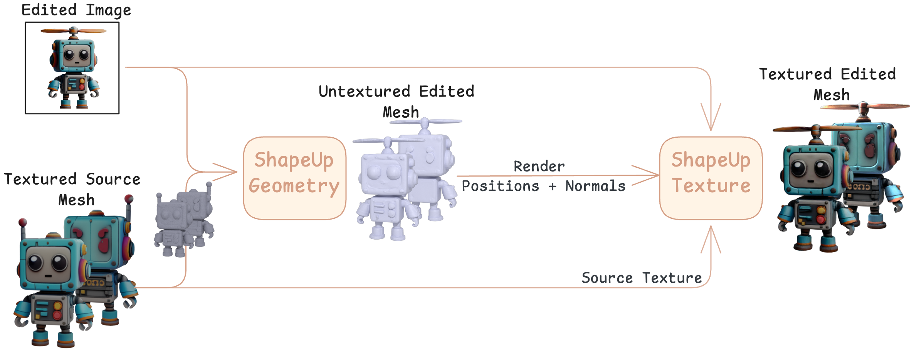

*原文 Figure 2：Figure 2. Overview. ShapeUP takes a Textured Source Mesh together with a single Edited Image (left). The ShapeUP Geometry module produces an Untextured Edited Mesh by editing the source shape directly in a native 3D latent space, preserving identity and enabling implicit localization. The edited geometry is rendered to obtain Positions + Normals, which guide the ShapeUP Texture module (right) to generate the final Textured Edited Mesh while retaining details from the Source Texture. [查看图片来源](https://arxiv.org/html/2602.05676v2/images/overview_v2png.png)*

引用来源：arxiv_2608.02711

链接：[arXiv](https://arxiv.org/abs/2602.05676)

##### VecSet-Edit: Unleashing Pre-trained LRM for Mesh Editing from Single Image

作者：Teng-Fang Hsiao, Bo-Kai Ruan, Yu-Lun Liu, Hong-Han Shuai

主任务：editing

中文简介：

VecSet-Edit面向单图像条件的三维网格编辑：输入原始网格和目标编辑图像，输出保留原有几何、纹理细节并完成局部修改的新网格。方法以高保真VecSet大规模重建模型为骨干，根据VecSet token与空间区域的对应关系，结合掩码引导的token播种、注意力对齐门控和漂移感知token裁剪定位并更新目标区域，最后进行细节保持的纹理烘焙。相较依赖体素和三维掩码的早期方案，它直接编辑网格表示，并将二维条件用于精细区域控制。

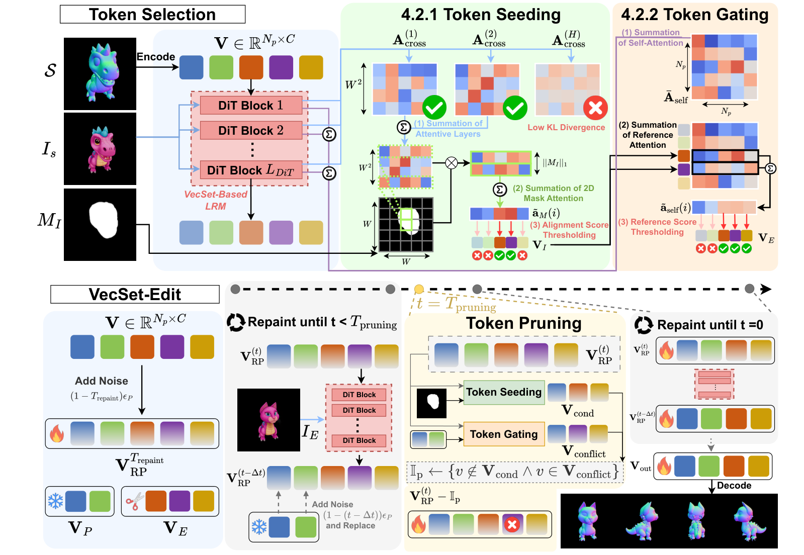

*原文 Figure 2：Figure 2. Overview of the VecSet-Edit framework. Given a mesh 𝒮 \mathcal{S} , a rendered view I s I_{s} , a 2D edit mask M I M_{I} , and a user-edited target view I E I_{E} , the pipeline proceeds in two main stages. First, Token Selection : To localize the editable region without 3D supervision, Token Seeding aggregates informative cross-attention layers to identify initial seed tokens 𝐕 I \mathbf{V}_{I} that align with the 2D mask. Token Gating then leverages self-attention correlations to expand this selection to the full geometric structure, yielding the final editable subset 𝐕 E \mathbf{V}_{E} . Second, VecSet-Edit : We perform diffusion-based editing on 𝐕 E \mathbf{V}_{E} while constraining the preserved tokens 𝐕 P \mathbf{V}_{P} . To prevent geometric artifacts, Token Pruning is applied during denoising to detect and discard “conflict” tokens that drift into the preserved regions without support from the editing condition. This ensures the final output faithfully respects both the target edit and the original structure. [查看图片来源](https://arxiv.org/html/2602.04349v3/fig4_pipeline_revision.png)*

引用来源：arxiv_2608.02711

链接：[arXiv](https://arxiv.org/abs/2602.04349)

##### Omni-3DEdit: Generalized Versatile 3D Editing in One-Pass

作者：Liyi Chen, Pengfei Wang, Guowen Zhang, Zhiyuan Ma, Lei Zhang

主任务：editing

中文简介：

该工作解决多种指令驱动的三维资产编辑任务，输入源三维资产的多视图信息与编辑指令，输出完成外观修改、移除等操作后的多视图一致资产。Omni-3DEdit构建配对多视图编辑数据，以预训练生成模型SEVA为骨干，将源视图潜变量与条件token拼接，并用双流LoRA区分不同视角线索。相较于依赖二维模型、反复优化三维表示的传统方法，它采用学习式前馈范式，在一次推理中统一处理多类编辑。

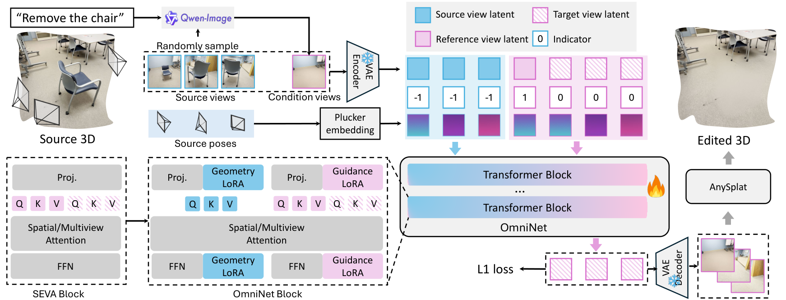

*原文 Figure 2：Figure 2 : Overview of Omni-3DEdit. Given the instruction and multi-view images as inputs, we first employ Qwen-Image to obtain an edited reference image as condition view. Then an OmniNet is trained to map the editing cues from condition view to other views. The outputs of OmniNet are edited multi-view images, which can be used to obtain the edited 3D asset optionally. [查看图片来源](https://arxiv.org/html/2603.17841v1/method.png)*

引用来源：arxiv_2608.02711

链接：[arXiv](https://arxiv.org/abs/2603.17841)

##### Beyond Voxel 3D Editing: Learning from 3D Masks and Self-Constructed Data

作者：Yi-Zhao Xu, Hongyuan Zhu, Caiyun Liu, Tianfu Wang, Keyu Chen, Sicheng Xu, Jiao-Long Yang, Nicholas Jing Yuan, Qi Zhang

主任务：editing

中文简介：

该工作解决文本引导的三维资产编辑任务，输入已有三维对象和编辑指令，输出局部或整体语义改变、且未编辑区域保持稳定的新资产。BVE基于图像到三维生成架构加入轻量可训练模块，以注入文本语义，并利用自构建数据集和无需标注的三维掩码约束局部不变性。相较于多视图编辑后回投三维或受尺度限制的体素编辑路线，它直接针对更大范围的三维编辑与数据不足问题。

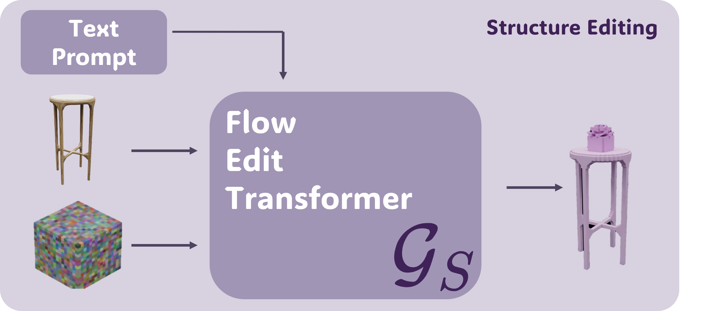

*原文 Figure 3：Figure 4 : Overview of our method. Structure Editing: The Flow Edit Transformer modifies the input 3D asset’s sparse structure based on a text prompt and a render image from original 3D asset. Structured Latent Editing: The Sparse Flow Edit Transformer enables fine-grained material and texture modifications. [查看图片来源](https://arxiv.org/html/2604.13688v1/imgs/gs.png)*

引用来源：arxiv_2608.02711

链接：[arXiv](https://arxiv.org/abs/2604.13688)

##### Prox-E: Fine-Grained 3D Shape Editing via Primitive-Based Abstractions

作者：Etai Sella, Hao Phung, Nitay Amiel, O. Litany, Or Patashnik, Hadar Averbuch-Elor

主任务：editing

中文简介：

面向细粒度三维形状编辑，输入现有三维形状和文本指令，输出在局部结构上修改且保持整体身份不变的结果。Prox-E采用免训练框架：先将输入形状抽象为紧凑的几何基元集合，再由预训练视觉语言模型编辑该基元抽象以指定基元级变化，最后用这些结构编辑指导三维生成模型完成局部修改。相比依赖二维图像编辑模型驱动三维编辑的典型管线，它通过显式基元抽象提供三维感知的控制，更有效地平衡身份保持、形状质量与指令遵循。

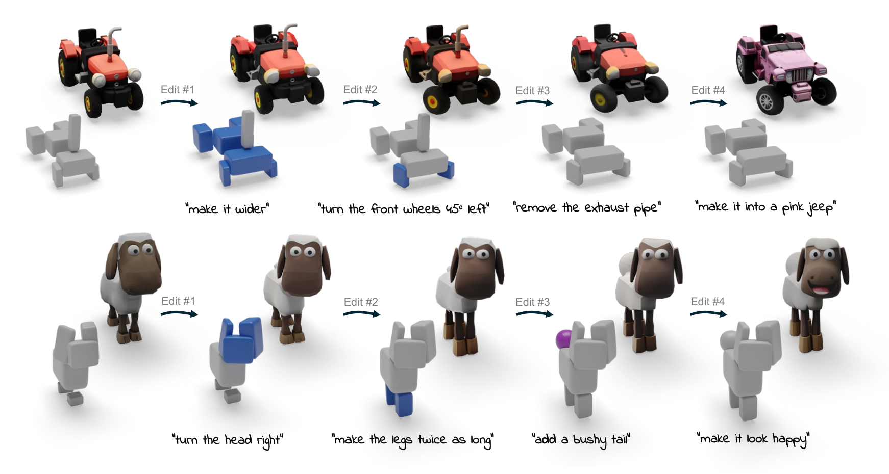

*原文 Figure 1：Figure 1. We introduce Prox ⋅ \cdot E, a training-free 3D editing framework that operates on a primitive-based geometric abstraction. By editing this proxy representation (second and bottom rows; edited primitives shown in blue , added ones shown in purple ) and using it to guide 3D generation, Prox ⋅ \cdot E enables precise, fine-grained edits while preserving the object’s identity. As illustrated above, our method supports a wide range of text-guided edits, spanning global and localized geometric transformations (edits 1 and 2) including parametric edits (edits involving a numeric parameter, i.e. edit 2), addition and removal of object parts (edit 3), and stylistic appearance-based modifications (edit 4). [查看图片来源](https://arxiv.org/html/2604.23774v2/teaser_double.png)*

引用来源：arxiv_2608.02711

链接：[arXiv](https://arxiv.org/abs/2604.23774)

##### Feedforward 3D Editing Learns from Semantic-Part Transformation

作者：Jiawei Weng, Saining Zhang, Zhenxin Diao, Peishuo Li, Henghaofan Zhang, Junhao Chen, Hao Zhao

主任务：editing

中文简介：

面向前馈三维编辑任务，输入已有三维资产和编辑指令，输出保留源区域、服从指令且多视图一致的编辑结果。其核心思想是从语义部件变换中学习，构建大规模编辑数据对和PartFlow网络，将源感知潜在控制注入预训练三维生成先验，并用掩码感知速度保持与渲染空间一致性监督，推理时无需三维编辑掩码。区别于当前主流的免训练编辑管线，它把可扩展前馈编辑作为目标，以语义部件级监督解决定位不准和源信息保留不足的问题。

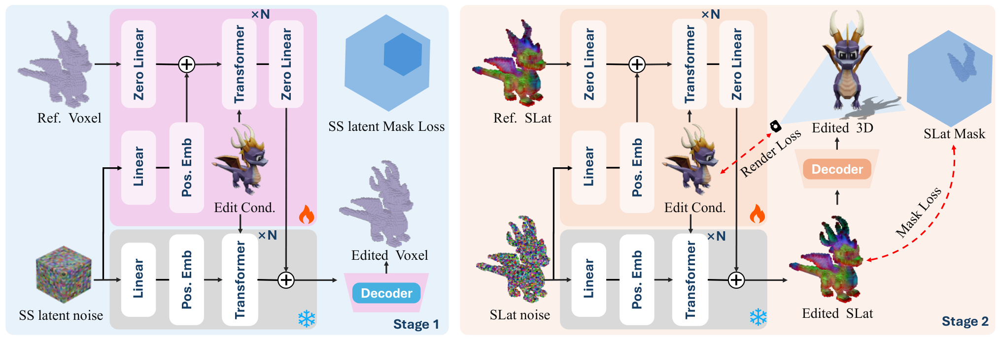

*原文 Figure 4：Figure 4. Overview of PartFlow. PartFlow introduces ControlNet-style source-latent injection into the two-stage TRELLIS editing process: Stage 1 controls coarse sparse-structure editing, while Stage 2 refines SLat-level geometry and appearance. During training, ground-truth edit masks impose a velocity-space preservation loss on unedited regions, while edited regions are supervised by the standard flow objective. A Stage-2 render-space loss further aligns the Gaussian-rendered output with the target editing view. A two-stage ControlNet-style 3D editing architecture. The first stage edits sparse-structure latents with source voxel control, and the second stage edits SLat representations with source SLat control, mask-aware losses, and render-space supervision. [查看图片来源](https://arxiv.org/html/2605.27351v5/PartFlow.png)*

引用来源：arxiv_2608.02711

链接：[arXiv](https://arxiv.org/abs/2605.27351)

##### Velocity-Space 3D Asset Editing

作者：Haopu Liu, Yuxuan Lin, Jingfeng Guo, Ruihang Chu, Junjie Wang, Ruo-Tong Li, Yujiu Yang

主任务：editing

中文简介：

面向局部三维资产编辑，输入资产和编辑指令，在修改目标区域的同时保留其余内容。VS3D从速度场层面干预修正流生成器的ODE采样过程：通过重建锚定源注入吸收身份泄漏，用部分均值引导放大编辑信号，并针对几何与材质阶段的身份拖拽设计干预，无需反转、无需训练、也无需掩码。不同于依赖外部三维掩码、体素合并或二维多视图提升的方法，它直接在采样器内部解决编辑信号与身份保持的矛盾。

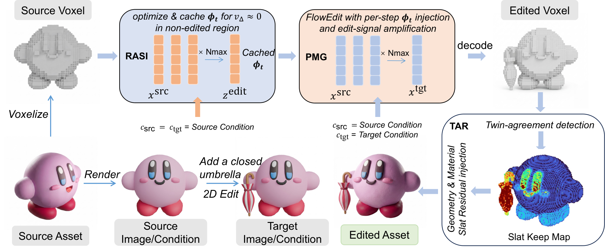

*原文 Figure 1：Figure 1: Overview of the VS3D pipeline. A source 3D asset is rendered and 2D-edited to obtain the condition. Stage 1 operates on the dense occupancy latent: RASI (§ 3.2 ) optimises a per-step ϕ t \phi_{t} to suppress v Δ v_{\Delta} on non-edited regions, and PMG (§ 3.3 ) amplifies the edit signal via subsample extrapolation. Stages 2–3 handle sparse geometry and material SLATs: TAR (§ 3.4 ) computes a token-wise p keep p_{\mathrm{keep}} map (blue = preserve, red = edit) and injects source residuals accordingly to produce the final edited asset. [查看图片来源](https://arxiv.org/html/2605.07385v1/pipeline.png)*

引用来源：arxiv_2608.02711

链接：[arXiv](https://arxiv.org/abs/2605.07385)

##### EditVerse3D: High-Quality 3D Object Editing with Region-Aware Learning

作者：Youtan Yin, Yan-Ning Zhou, Jiacheng Wei, Xiaofeng Yang, Jun Zhang, Jiayang Bai, Jingwen Ye, Weidong Zhang, Guosheng Lin

主任务：editing

中文简介：

该工作研究三维物体编辑：输入待编辑的三维对象、指示目标区域的粗粒度三维包围盒，以及描述修改效果的二维参考图像，输出在目标区域发生语义变化、同时保持其余部分一致的高质量三维对象。其核心是区域感知自适应损失，强化难学习区域并平衡编辑区域与保留区域，配合缩放三维掩码等增强和不合理样本过滤提升泛化能力。相较依赖完整编辑图像或精确三维掩码的前序方法，它以更自然的粗区域引导实现三维资产编辑。

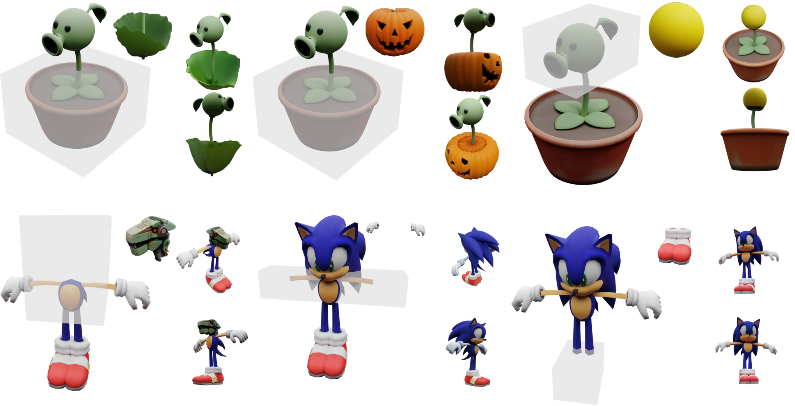

*原文 Figure 1：Figure 1 : Editing results of our method. Given a 3D object, a user-specified coarse 3D bounding box indicating the target editing region, and an image prompt defining the editing goal, our approach generates high-quality, coherent edits. Our method does not require fully edited 2D views, precise 3D masks, or redundant pipelines. [查看图片来源](https://arxiv.org/html/2607.07187v1/teaser.png)*

引用来源：arxiv_2608.02711

链接：[arXiv](https://arxiv.org/abs/2607.07187)

### 三维理解（understanding）

#### 2023

##### PointLLM: Empowering Large Language Models to Understand Point Clouds

作者：Runsen Xu, Xiaolong Wang, Tai Wang, Yilun Chen, Jiangmiao Pang, Dahua Lin

主任务：understanding

中文简介：

PointLLM面向点云理解任务，输入带颜色的物体点云和自然语言指令，输出符合语境的文本回答，并支持三维分类与描述。方法上，它将点云编码器与大型语言模型结合，先对齐几何、外观和语言表征，再通过指令微调实现跨模态交互。作为统一多模态模型的早期探索，它把语言模型的能力从二维视觉扩展到三维点云，而非仅将语言作为独立条件编码器。

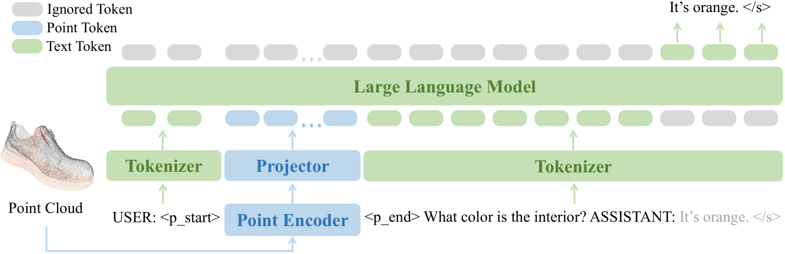

*原文 Figure 2：Figure 2 : An overview of PointLLM. The point encoder extracts features from the input point cloud and the projector projects them to the latent space of the LLM backbone. The LLM backbone processes sequences of point and text tokens and generates the predicted tokens as the output. [查看图片来源](https://arxiv.org/html/2308.16911v3/main_figure_eccv.png)*

引用来源：arxiv_2608.02711

链接：[arXiv](https://arxiv.org/abs/2308.16911)

#### 2024

##### ShapeLLM: Universal 3D Object Understanding for Embodied Interaction

作者：Zekun Qi, Runpei Dong, Shaochen Zhang, Haoran Geng, Chunrui Han, Zheng Ge, Li Yi, Kaisheng Ma

主任务：understanding

中文简介：

ShapeLLM解决面向具身交互的三维物体理解任务：输入三维点云与自然语言指令，输出语言化的物体理解、定位或交互相关结果。方法以增强的ReCon++作为点云编码器，将几何特征接入大型语言模型，并利用指令数据训练统一的三维—语言推理能力。它属于统一多模态模型，相比仅把语言模型用作条件编码器的生成系统，更强调在同一语言交互框架中融合三维感知、语言理解与具身任务推理。

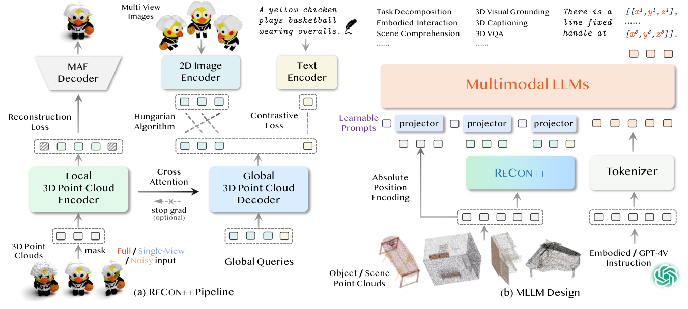

*原文 Figure 1：Figure 2 : Overview of our ShapeLLM framework . (a) The introduced ReCon ++ pipeline incorporates the required 3D encoder. (b) The comprehensive design of the MLLM, featuring an instruction-mode tokenizer and the integration of an aligned multi-modal representation, equips the MLLM with the capability to effectively handle 3D vision language tasks. [查看图片来源](https://arxiv.org/html/2402.17766v3/framework.png)*

引用来源：arxiv_2608.02711

链接：[arXiv](https://arxiv.org/abs/2402.17766)

#### 2025

##### PartField: Learning 3D Feature Fields for Part Segmentation and Beyond

作者：Minghua Liu, M. Uy, Donglai Xiang, Hao Su, Sanja Fidler, Nicholas Sharp, Jun Gao

主任务：understanding

中文简介：

PartField解决开放场景三维形状的部件分解与跨形状对应任务，输入不同模态的三维对象，输出连续部件特征场及其聚类得到的层次化部件划分。方法上通过前馈网络学习三维特征，并蒸馏二维、三维部件提议，以对比学习形成不依赖模板和部件名称的通用表示。该工作更适合归入三维部件理解而非部件生成：它不产生新的几何部件，而是提供可用于分割、共分割和对应的结构化特征。

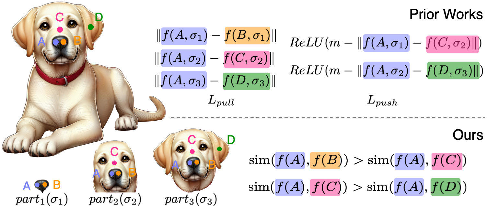

*原文 Figure 3：Figure 4 : (Left) A point can belong to multiple parts at different scales. (Upper Right) Prior works [ 21 , 69 ] utilize pull and push losses to directly minimize or maximize the feature distances between point pairs, requiring an additional scaling condition to learn point features at different scales. (Lower Right) Our method employs a triplet loss that only encourages the relative relations between points within a triplet, enabling self-contained features ( sim ​ ( f ⁡ ( A ) , f ⁡ ( B ) ) > sim ​ ( f ⁡ ( A ) , f ⁡ ( C ) ) > sim ​ ( f ⁡ ( A ) , f ⁡ ( D ) ) \text{sim}(f(A),f(B))>\text{sim}(f(A),f(C))>\text{sim}(f(A),f(D)) ) that support multi-scale parts without need of scaling condition. [查看图片来源](https://arxiv.org/html/2504.11451v1/figures/loss.png)*

引用来源：arxiv_2608.02711

链接：[arXiv](https://arxiv.org/abs/2504.11451)

##### X-Part: high fidelity and structure coherent shape decomposition

作者：Xinhao Yan, Jiachen Xu, Yang Li, Changfeng Ma, Yunhan Yang, Chunshi Wang, Zi-Bo Zhao, Zeqiang Lai, Yunfei Zhao, Zhuo Chen, Chunchao Guo

主任务：understanding

中文简介：

该工作处理整体三维物体的部件级分解与生成，输入完整形状及部件相关条件，输出具有语义意义、结构连贯且几何保真的多个三维部件。方法以部件包围盒作为提示，并注入点级语义特征来引导生成，同时提供可交互编辑的部件生成流程。相较缺乏语义控制、容易产生结构破碎部件的既有方法，X-Part将几何保真、语义分解和后续编辑统一起来，属于结构化三维部件生成路线。

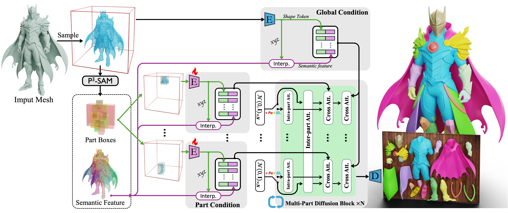

*原文 Figure 2：Figure 1: Architecture of 𝒳 \mathcal{X} -Part . Given input point cloud, per-point feature and part bounding boxes are extracted from P 3 ​ -SAM \text{P}^{3}\text{-SAM} . Global and part conditions are obtained by stacking geometry token with interpolated semantic features. They are injected to multi-part diffusion process to guide shape decomposition. [查看图片来源](https://arxiv.org/html/2509.08643v2/figs/pipeline_v3.jpg)*

引用来源：arxiv_2608.02711

链接：[arXiv](https://arxiv.org/abs/2509.08643)

##### Part-X-MLLM: Part-aware 3D Multimodal Large Language Model

作者：Chunshi Wang, Junliang Ye, Yunhan Yang, Yang Li, Zizhuo Lin, Jun-Yan Zhu, Zhuo Chen, Yawei Luo, Chunchao Guo

主任务：understanding

中文简介：

Part-X-MLLM面向结合语言与三维感知的部件级理解、生成和编辑，输入RGB点云与自然语言提示，输出包含部件框、语义描述及编辑命令的结构化程序序列，并驱动后续几何模块。模型采用原生三维多模态架构，以自回归方式生成统一token序列，通过双编码器区分结构和语义，再利用部件数据进行指令微调。它属于统一多模态模型，将多类三维任务纳入单一语言化接口；与只把语言模型作为条件编码器的松耦合系统相比，更强调统一规划和跨任务控制。

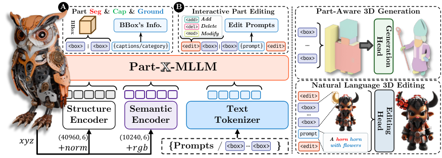

*原文 Figure 2：Figure 2: The Part-X-MLLM Framework. Our pipeline begins by encoding geometry and appearance features separately using a dual-encoder architecture, which are then fused together with text prompts. These combined features are passed to an autoregressive decoder that generates a program-like token sequence representing a plan (e.g., bounding boxes, edit commands). Finally, specialized geometry heads execute this plan to enable part-aware generation and editing. [查看图片来源](https://arxiv.org/html/2511.13647v1/pipeline.png)*

引用来源：arxiv_2608.02711

链接：[arXiv](https://arxiv.org/abs/2511.13647)

### 部件结构化三维生成（part_structured_generation）

#### 2025

##### OmniPart: Part-Aware 3D Generation with Semantic Decoupling and Structural Cohesion

作者：Yu-nuo Yang, Yufan Zhou, Yuan-Chen Guo, Zi-Xin Zou, Yukun Huang, Ying-Tian Liu, Hao Xu, Ding Liang, Yan-Pei Cao, Xihui Liu

主任务：part_structured_generation

中文简介：

OmniPart面向生成具有显式、可编辑部件结构的三维对象，输入整体生成条件及可选的二维部件掩码，输出由多个空间布局明确的三维部件组成的资产。其核心采用结构规划与几何生成解耦的两阶段范式：自回归模块预测可变长度的部件框序列，随后由空间条件矩形流模型在统一布局中同步生成各部件。该工作属于三维部件生成，区别于仅生成整体形状的方法，并以二维掩码控制部件粒度和位置而不依赖直接对应或语义标签。

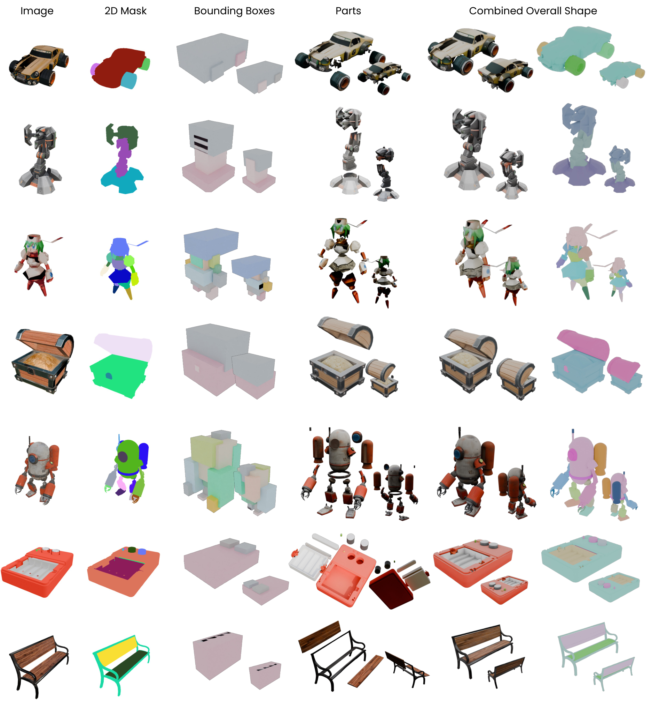

*原文 Figure 7：Figure 7. Qualitative results of our complete pipeline. We show the input image and 2D masks, along with the generated bounding boxes, individually generated part meshes, and the combined full-object mesh. As illustrated, our method enables precise control over part granularity via 2D masks and produces high-quality geometry and texture. The generated 3D parts exhibit low semantic entanglement and high structural cohesion, demonstrating the effectiveness of our part-aware 3D content generation. [查看图片来源](https://arxiv.org/html/2507.06165v1/our_results.png)*

引用来源：arxiv_2608.02711

链接：[arXiv](https://arxiv.org/abs/2507.06165)

#### 2026

##### CubePart: An Open-Vocabulary Part-Controllable 3D Generator

作者：Yiheng Zhu, Kangle Deng, J. Fauconnier, Iñaki Navarro, Daiqing Li, Ava Pun, Yinan Zhang, Peiye Zhuang, Xiaoxia Sun, Maneesh Agrawala, K. Bhat, Tinghui Zhou

主任务：part_structured_generation

中文简介：

输入为全局文本提示和用户自定义的开放部件名称列表，输出一组一一对应的网格，它们可装配为语义结构一致的完整对象。核心方法是用可扩展数据管线构造大规模开放词汇部件标注数据集，再通过两阶段生成架构把全局形状合成与部件级解码分离，使部件结构成为推理时显式控制信号。相比输出整体网格或任意自动分割的三维生成模型，它面向游戏与仿真中按需定义部件语义的需求，生成结果可直接接入动画和行为脚本。

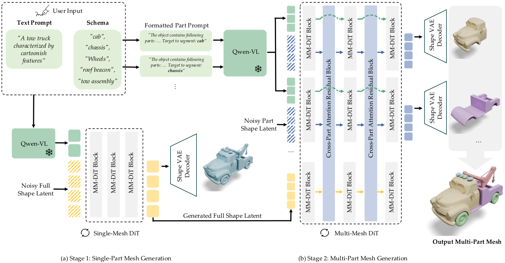

*原文 Figure 2：Figure 2. Overview. We propose a two-stage framework to generate part-controllable 3D objects conditioned on a global text prompt and a part schema. (a) Single Mesh Generation synthesizes a holistic shape latent using a Multi-Modal DiT (MM-DiT) ( Esser et al., 2024 ) , conditioned on the prompt and schema encoded by Qwen-VL ( Bai et al., 2023 ) . (b) Multi-Mesh Generation takes the full shape latent from Stage 1 and decomposes it into distinct part latents. To achieve this, we initialize with the MM-DiT weights from Stage 1 and inject Cross-Part Attention Residual Blocks to enable structural interaction among parts. [查看图片来源](https://arxiv.org/html/2605.28763v1/method.png)*

引用来源：arxiv_2608.02711

链接：[arXiv](https://arxiv.org/abs/2605.28763)

### 背景与上下文（context）

#### 2017

##### Neural Discrete Representation Learning

作者：Aäron van den Oord, O. Vinyals, K. Kavukcuoglu

主任务：context

中文简介：

Neural Discrete Representation Learning研究无监督离散表示学习，输入图像、视频或语音等数据，输出离散潜变量及其重建结果，并可进一步用于生成。其核心是VQ-VAE：编码器通过向量量化产生离散代码，同时学习潜变量先验，再结合自回归解码器建模数据。该工作不直接针对三维生成，但为后续三维原生潜空间方法提供了离散潜表示和先验建模的基础范式。

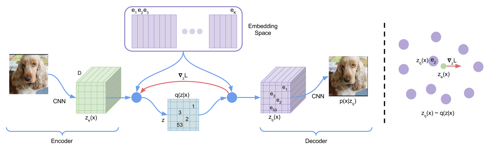

*原文 Figure 1：Figure 1: Left: A figure describing the VQ-VAE. Right: Visualisation of the embedding space. The output of the encoder z ⁡ ( x ) z(x) is mapped to the nearest point e 2 e_{2} . The gradient ∇ z L \nabla_{z}L (in red) will push the encoder to change its output, which could alter the configuration in the next forward pass. [查看图片来源](https://arxiv.org/html/1711.00937v2/figures/Figure1_9.png)*

引用来源：arxiv_2608.02711

链接：[arXiv](https://arxiv.org/abs/1711.00937)

#### 2018

##### PartNet: A Large-Scale Benchmark for Fine-Grained and Hierarchical Part-Level 3D Object Understanding

作者：Kaichun Mo, Shilin Zhu, Angel X. Chang, L. Yi, Subarna Tripathi, L. Guibas, Hao Su

主任务：context

中文简介：

PartNet面向细粒度三维部件理解，输入带有部件结构的三维物体，输出部件语义、层级或实例级分割结果。其核心贡献是建立具有实例级和层级部件标注的大规模基准，并围绕细粒度语义分割、层级分割和实例分割设置评测任务及基线。该工作本身不是三维部件生成，而是三维部件研究的重要数据与评测基础，为后续显式建模部件结构的生成方法提供监督来源。

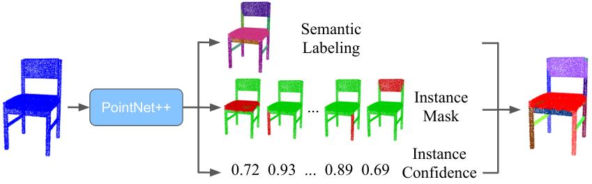

*原文 Figure 6：Figure 6 : The proposed detection-by-segmentation method for instance segmentation. The network learns to predict three components: the semantic label for each point, a set of disjoint instance masks and their confidence scores for part instances. [查看图片来源](https://arxiv.org/html/1812.02713v1/ins_seg_arch.png)*

引用来源：arxiv_2608.02711

链接：[arXiv](https://arxiv.org/abs/1812.02713)

#### 2023

##### 3DShape2VecSet: A 3D Shape Representation for Neural Fields and Generative Diffusion Models

作者：Biao Zhang, Jiapeng Tang, M. Nießner, Peter Wonka

主任务：context

中文简介：

3DShape2VecSet面向三维形状表示与生成，输入表面模型或点云，输出可用于神经场重建及扩散生成的三维形状表示，并支持文本、类别、图像等条件。方法将神经场编码为一组可学习向量，结合径向基函数及交叉、自注意力，使其适合Transformer处理，再在潜表示上进行生成建模。它属于三维原生潜空间生成，区别于依赖二维扩散先验逐实例优化的方法。

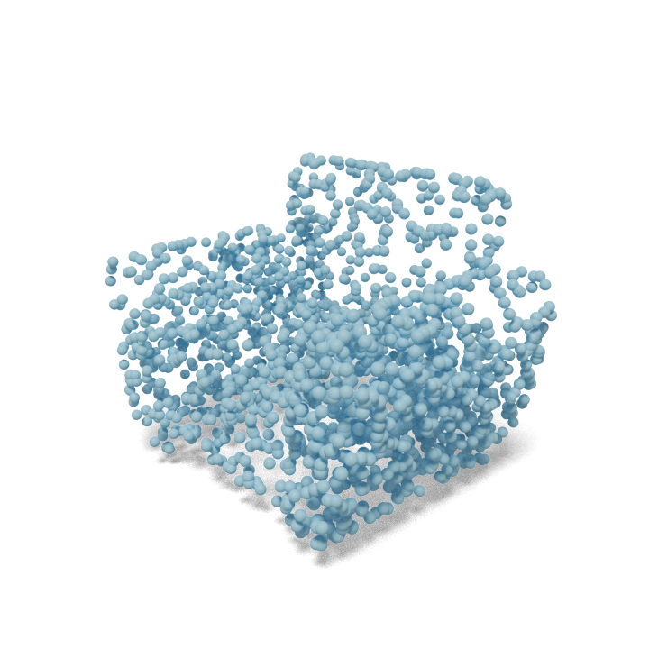

*原文 Figure 2：Figure 3 . Shape autoencoding pipeline. Given a 3D ground-truth surface mesh as the input, we first sample a point cloud that is mapped to positional embeddings and encode them into a set of latent codes through a cross-attention module ( Sec. 5.1 ). Next, we perform (optional) compression and KL-regularization in the latent space to obtain structured and compact latent shape representations ( Sec. 5.2 ). Finally, the self-attention is carried out to aggregate and exchange the information within the latent set. And a cross-attention module is designed to calculate the interpolation weights of query points. The interpolated feature vectors are fed into a fully connected layer for occupancy prediction ( Sec. 5.3 ). [查看图片来源](https://arxiv.org/html/2301.11445v3/images/pipeline/pipeline-input.png)*

引用来源：arxiv_2608.02711

链接：[arXiv](https://arxiv.org/abs/2301.11445)

##### LLaMA: Open and Efficient Foundation Language Models

作者：Hugo Touvron, Thibaut Lavril, Gautier Izacard, X. Martinet, M. Lachaux, Timothée Lacroix, Baptiste Rozière, Naman Goyal, Eric Hambro, Faisal Azhar, Aur'elien Rodriguez, Armand Joulin, Edouard Grave, Guillaume Lample

主任务：context

中文简介：

LLaMA是一组面向通用语言任务的基础模型，输入文本序列，输出后续文本或语言表示。其核心范式是以自回归Transformer为骨干，在公开数据上进行大规模预训练，并覆盖不同参数规模。该工作不属于三维生成或编辑类别，而是为后续统一多模态模型提供可复用的语言建模骨干与开放研究基础。

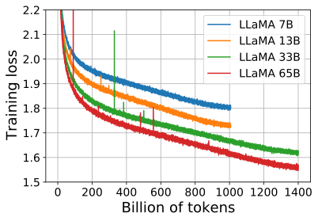

*原文 Figure 1：Figure 1: Training loss over train tokens for the 7B, 13B, 33B, and 65 models. LLaMA-33B and LLaMA-65B were trained on 1.4T tokens. The smaller models were trained on 1.0T tokens. All models are trained with a batch size of 4M tokens. [查看图片来源](https://arxiv.org/html/2302.13971v1/train_loss.svg)*

引用来源：arxiv_2608.02711

链接：[arXiv](https://arxiv.org/abs/2302.13971)

##### MVDream: Multi-view Diffusion for 3D Generation

作者：Yichun Shi, Peng Wang, Jianglong Ye, M. Long, Kejie Li, X. Yang

主任务：context

中文简介：

MVDream解决文本到三维生成任务，输入文本提示，输出可用于构建三维资产的多视角一致图像或三维表示。其核心是联合二维与三维数据训练多视角扩散模型，使模型同时具备二维先验的泛化性和三维渲染的一致性，再通过分数蒸馏约束逐实例优化。它在基于优化的三维生成中引入了视角一致的三维先验，区别于直接依赖单视图二维扩散模型的路线。

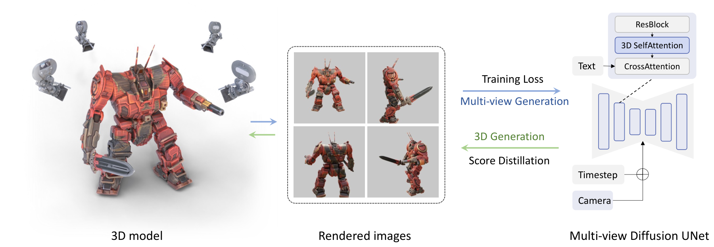

*原文 Figure 2：Figure 2: Illustration of the multi-view diffusion model. We keep the structure of text-to-image UNets by making two slight changes: (1) changing the self-attention from 2D to 3D for cross-view connection (2) adding camera embeddings for each view. Multi-view renderings are used to train the diffusion model. During testing, the pipeline is used in a reverse way: the multi-view diffusion model serves as 3D prior to optimize the 3D representation via Score Distillation Sampling (SDS). [查看图片来源](https://arxiv.org/html/2308.16512v4/architecture_v2.png)*

引用来源：arxiv_2608.02711

链接：[arXiv](https://arxiv.org/abs/2308.16512)

##### RichDreamer: A Generalizable Normal-Depth Diffusion Model for Detail Richness in Text-to-3D

作者：Lingteng Qiu, Guanying Chen, Xiaodong Gu, Qi Zuo, Mutian Xu, Yushuang Wu, Weihao Yuan, Zilong Dong, Liefeng Bo, Xiaoguang Han

主任务：context

中文简介：

该论文解决文本到三维生成中的几何细节不足与优化不稳定问题，输入文本提示，输出具有丰富几何和外观细节的三维资产。方法训练可泛化的法线—深度扩散模型，以更符合几何分布的信号替代二维RGB扩散模型直接约束法线，并引入反照率扩散模型减弱光照与材质混杂。它仍属于基于二维先验的逐实例优化，但相较传统SDS路线，更强调几何专用先验和外观分解。

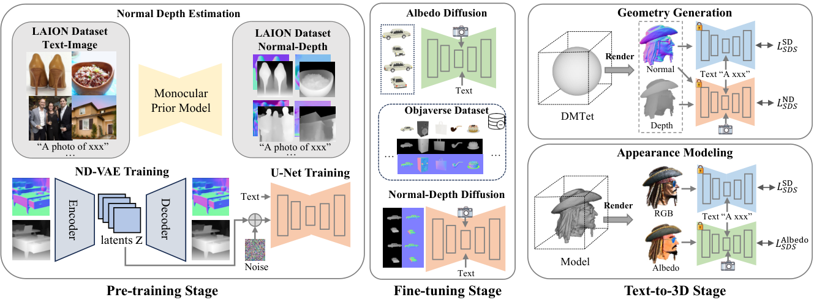

*原文 Figure 1：Figure 2 : Overview of the proposed RichDreamer . We introduce a generalizable Normal-Depth diffusion model that is trained on the LAION-2B dataset with normal and depth predicted by Midas [ 59 ] , followed by fine-tuning on the synthetic dataset. Our model can be incorporated with the DMTet and NeRF representations to enhance the geometry generation. To alleviate the ambiguity in appearance modeling, we propose an albedo diffusion model to impose data-drive prior on the albedo component. [查看图片来源](https://arxiv.org/html/2311.16918v2/pipeline.png)*

引用来源：arxiv_2608.02711

链接：[arXiv](https://arxiv.org/abs/2311.16918)

##### GPT4Point: A Unified Framework for Point-Language Understanding and Generation

作者：Zhangyang Qi, Ye Fang, Zeyi Sun, Xiaoyang Wu, Tong Wu, Jiaqi Wang, Dahua Lin, Hengshuang Zhao

主任务：context

中文简介：

该论文面向点云—语言理解与生成，输入点云、文本或低质量点云文本特征，输出点云描述、问答结果以及可控的三维生成结果。GPT4Point将点云特征接入多模态大语言模型，使同一框架能够进行三维指代、理解和生成，并构建Pyramid-XL扩展三维对象—文本训练数据。它属于统一多模态模型路线，重点不在单一生成器，而在以语言模型为核心统一处理三维理解与生成任务。

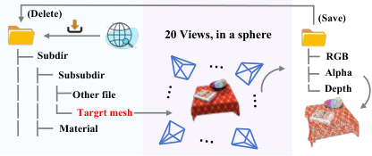

*原文 Figure 8：Figure S3 : Acquire Data Pipeline from Objaverse-XL [ 11 ] . [查看图片来源](https://arxiv.org/html/2312.02980v2/sup_fig3_objaversexl_pipeline.png)*

引用来源：arxiv_2608.02711

链接：[arXiv](https://arxiv.org/abs/2312.02980)

#### 2024

##### Chameleon: Mixed-Modal Early-Fusion Foundation Models

作者：Chameleon Team, Mingda Chen, Jacob Kahn, Shang-Wen Li

主任务：context

中文简介：

该论文解决文本与图像在任意顺序中的统一理解和生成问题，输入输出都可以是交替出现的图像、文本或混合文档序列。核心方法是将不同模态统一离散为token，采用早期融合的单一混合模态模型进行联合建模，并通过专门的训练和对齐策略稳定学习。它代表架构层面的统一多模态路线，不是仅用语言模型提供条件、再交给独立图像生成器的松耦合系统。

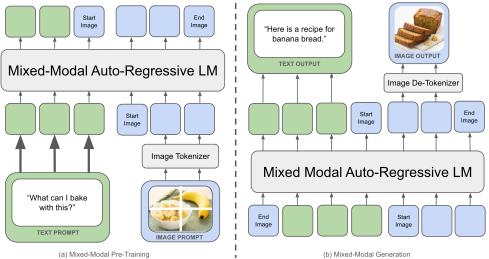

*原文 Figure 1：Figure 1: Chameleon represents all modalities — images, text, and code, as discrete tokens and uses a uniform transformer-based architecture that is trained from scratch in an end-to-end fashion on ∼ \sim 10T tokens of interleaved mixed-modal data. As a result, Chameleon can both reason over, as well as generate, arbitrary mixed-modal documents. Text tokens are represented in green and image tokens are represented in blue. [查看图片来源](https://arxiv.org/html/2405.09818v2/intro_image.svg)*

引用来源：arxiv_2608.02711

链接：[arXiv](https://arxiv.org/abs/2405.09818)

##### MeshAnything: Artist-Created Mesh Generation with Autoregressive Transformers

作者：Yiwen Chen, Tong He, Di Huang, Weicai Ye, Sijin Chen, Jiaxiang Tang, Xin Chen, Zhongang Cai, Lei Yang, Gang Yu, Guosheng Lin, Chi Zhang

主任务：context

中文简介：

该论文解决将任意三维表示转换为适合工业使用的低面数艺术家风格网格的问题，输入为已有三维资产及其形状信息，输出为紧凑的顶点—面网格。方法先用VQ-VAE学习网格词表，再由形状条件解码器式Transformer自回归生成网格token。它将网格提取明确转化为生成任务，相比依赖稠密面片的传统提取路线，更直接地建模几何特征与网格结构。

*原文 Figure 5：Figure 4: Pipeline Overview. We introduce MeshAnything, an autoregressive transformer capable of generating Artist-Created Meshes that adhere to given 3D shapes. During training, we inject point clouds features into a decoder-only transformer and supervise it using token sequences derived from the Artist-Created meshes. After training, MeshAnything takes point clouds sampled from various 3D representations as input and generates aligned Artist-Created meshes. [查看图片来源](https://arxiv.org/html/2406.10163v2/pip.png)*

引用来源：arxiv_2608.02711

链接：[arXiv](https://arxiv.org/abs/2406.10163)

##### Emu3: Next-Token Prediction is All You Need

作者：Xinlong Wang, Xiaosong Zhang, Zhengxiong Luo, Quan Sun, Yufeng Cui, Jinsheng Wang, Fan Zhang, Yueze Wang, Zhen Li, Qiying Yu, Yingli Zhao, Yulong Ao, Xuebin Min, Tao Li, Boya Wu, Bo Zhao, Bowen Zhang, Lian-zi Wang, Guang Liu, Zheqi He, Xi Yang, Jingjing Liu, Yong-Hua Lin, Tiejun Huang, Zhongyuan Wang

主任务：context

中文简介：

Emu3统一处理文本、图像和视频的理解与生成：输入可为不同模态的离散序列，输出则是文本、图像或视频序列。其核心范式是将各模态编码为离散token，在混合多模态序列上从头训练单一Transformer，仅通过下一token预测完成生成与感知，而不依赖扩散模型或语言模型加独立生成器的组合。它代表统一多模态模型中高度统一的自回归路线，将视觉生成纳入与语言相同的序列建模框架。

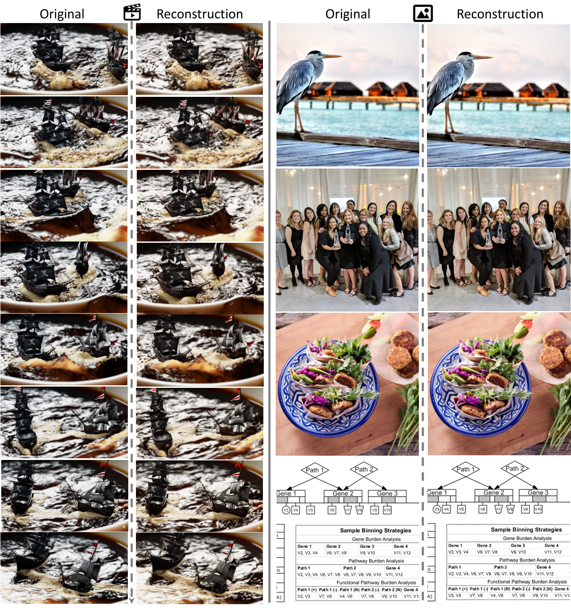

*原文 Figure 2：Figure 3: Reconstruction samples. Left: Original and reconstructed videos at 540 × \times 960 resolution, showcasing a sampling of 8 frames at 30 FPS. Right: original and reconstructed 512 × \times 512 resolution images. Zoom in to see the details. [查看图片来源](https://arxiv.org/html/2409.18869v1/tokenizer_recon_case_v2.png)*

引用来源：arxiv_2608.02711

链接：[arXiv](https://arxiv.org/abs/2409.18869)

##### MetaMorph: Multimodal Understanding and Generation via Instruction Tuning

作者：Shengbang Tong, David Fan, Jiacheng Zhu, Yunyang Xiong, Xinlei Chen, Koustuv Sinha, Michael Rabbat, Yann LeCun, Saining Xie, Zhuang Liu

主任务：context

中文简介：

MetaMorph同时处理视觉理解与视觉生成，输入图像、文本及指令序列，输出文本回答或视觉内容。其Visual-Predictive Instruction Tuning让预训练语言模型统一预测离散文本token和连续视觉token，使生成能力通过指令微调融入原有理解模型。它属于统一多模态模型，相比仅把语言模型作为条件编码器的松耦合方案，更强调单一自回归骨干对理解和生成的联合建模。

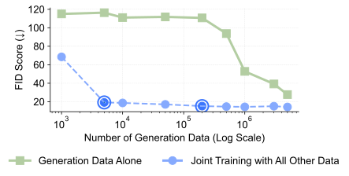

*原文 Figure 2：Figure 2 : Generation-only training vs. Joint training with other data. Training solely on generation data results in inferior performance. Joint training with additional data enables visual generation with only 5k generation data and yields high-quality outputs with 200k generation data. [查看图片来源](https://arxiv.org/html/2412.14164v1/fid_special_points_plot_new.svg)*

引用来源：arxiv_2608.02711

链接：[arXiv](https://arxiv.org/abs/2412.14164)

##### TokenFlow: Unified Image Tokenizer for Multimodal Understanding and Generation

作者：Liao Qu, Huichao Zhang, Yiheng Liu, Xu Wang, Yi Jiang, Yiming Gao, Hu Ye, Daniel K. Du, Zehuan Yuan, Xinglong Wu

主任务：context

中文简介：

该论文面向图像的统一理解与生成：输入图像或离散视觉token，输出语义表示、重建图像或供自回归模型生成的视觉序列。TokenFlow采用双码本架构，将高层语义特征与细粒度像素特征解耦，同时通过共享映射保持对应关系，使同一套离散索引支持两类任务。它位于统一多模态建模方向，相比以单一重建目标VQ编码器兼顾理解和生成的方法，缓解了视觉信息粒度冲突。

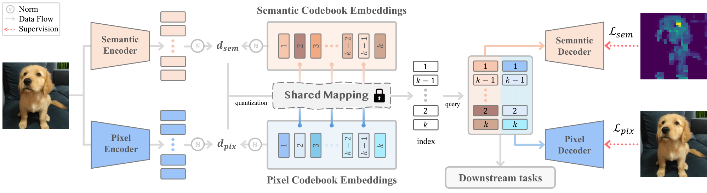

*原文 Figure 3：Figure 3 : Overview of TokenFlow. We incorporate dual encoders and codebooks with a shared mapping, enabling the joint optimization of high-level semantics and low-level pixel details. For a given input image, distances d sem d_{\text{sem}} and d pix d_{\text{pix}} are calculated from the pixel-level and semantic-level codebooks, respectively, with the final codebook index and features determined by minimizing the weighted sum d sem + w dis ⋅ d pix d_{\text{sem}}+w_{\text{dis}}\cdot d_{\text{pix}} . The resulting quantized features are independently decoded for both semantic alignment and image reconstruction training, and then concatenated to provide a unified representation for downstream tasks in understanding and generation. [查看图片来源](https://arxiv.org/html/2412.03069v2/pipeline.png)*

引用来源：arxiv_2608.02711

链接：[arXiv](https://arxiv.org/abs/2412.03069)

#### 2025

##### Janus-Pro: Unified Multimodal Understanding and Generation with Data and Model Scaling

作者：Xiao-Kang Chen, Zhiyu Wu, Xingchao Liu, Zizheng Pan, Wen Liu, Zhenda Xie, Xingkai Yu, C. Ruan

主任务：context

中文简介：

Janus-Pro处理图像理解与文本到图像生成，输入图像、文本或多模态指令，输出视觉问答等理解结果或符合指令的图像。其核心是将理解和生成置于统一多模态框架中，并通过优化训练策略、扩大数据规模和增大模型容量提升两类能力及生成稳定性。相较前作Janus，它不是改变任务范式，而是在统一架构基础上进行数据、训练和模型规模扩展。

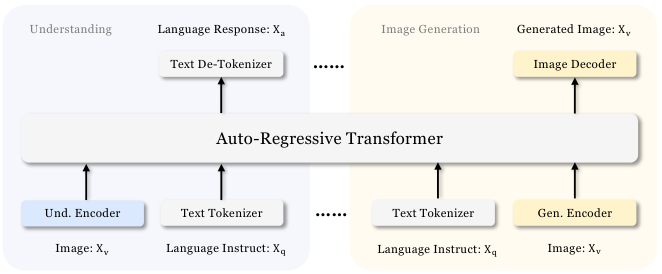

*原文 Figure 4：Figure 3: Architecture of our Janus-Pro. We decouple visual encoding for multimodal understanding and visual generation. “Und. Encoder” and “Gen. Encoder” are abbreviations for “Understanding Encoder” and “Generation Encoder”, respectively. Best viewed on screen. [查看图片来源](https://arxiv.org/html/2501.17811v1/Janus.png)*

引用来源：arxiv_2608.02711

链接：[arXiv](https://arxiv.org/abs/2501.17811)

##### Qwen2.5-VL Technical Report

作者：Shuai Bai, Ke-qin Chen, Xue-Jing Liu, Jia-Lin Wang, Wenbin Ge, Sibo Song, K. Dang, Peng Wang, Shijie Wang, Jun Tang, Humen Zhong, Yuanzhi Zhu, Mingkun Yang, Zhaohai Li, Jian-Qiang Wan, Pengfei Wang, Wei Ding, Zheren Fu, Yiheng Xu, Jiabo Ye, Xi Zhang, Tianbao Xie, Zesen Cheng, Hang Zhang, Zhibo Yang, Haiyang Xu, Junyang Lin

主任务：context

中文简介：

Qwen2.5-VL面向图像、文档和长视频理解，以及视觉交互任务，输入视觉内容与文本指令，输出识别、定位、结构化信息、分析结果或行动决策。其核心是动态分辨率视觉编码、窗口注意力和绝对时间编码，并与语言模型结合以支持推理、工具使用及设备操作。作为统一多模态模型，它较早期视觉语言系统进一步统一了空间定位、长时序理解和交互式执行能力。

*原文 Figure 2：Figure 1: The Qwen2.5-VL framework demonstrates the integration of a vision encoder and a language model decoder to process multimodal inputs, including images and videos. The vision encoder is designed to handle inputs at their native resolution and supports dynamic FPS sampling. Images of varying sizes and video frames with different FPS rates are dynamically mapped to token sequences of varying lengths. Notably, MRoPE aligns time IDs with absolute time along the temporal dimension, enabling the model to better comprehend temporal dynamics, such as the pace of events and precise moment localization. The processed visual data is subsequently fed into the Qwen2.5 LM Decoder. We have re-engineered the vision transformer (ViT) architecture, incorporating advanced components such as FFN with SwiGLU activation, RMSNorm for normalization, and window-based attention mechanisms to enhance performance and efficiency. [查看图片来源](https://arxiv.org/html/2502.13923v1/figures/qwen2.5vl_arc.jpeg)*

引用来源：arxiv_2608.02711

链接：[arXiv](https://arxiv.org/abs/2502.13923)

##### Cube: A Roblox View of 3D Intelligence

作者：K. Bhat, Nishchaie Khanna, Karun Channa, Tinghui Zhou, Yiheng Zhu, Xiaoxia Sun, Charles Shang, Anirudh Sudarshan, Maurice Chu, Daiqing Li, Kangle Deng, J. Fauconnier, Tijmen Verhulsdonck, Maneesh Agrawala, Kayvon Fatahalian, Alexander Weiss, C. Reiser, Ravi Kiran Chirravuri, Ravali Kandur, Alejandro Pelaez, Akash Garg, M. Palleschi, Jessica Wang, Skylar Litz, Leo Liu, Anyi Li, D. Harmon, Derek Liu, Liangjun Feng, Denis Goupil, Lukasz Kuczynski, J. Yoon, Naveen Marri, Peiye Zhuang, Yinan Zhang, Brian Yin, Hao-Miao Jiang, Marcel van Workum, Thomas Lane, Bryce Erickson, Salil Pathare, Kyle Price, Anupam Singh, David Baszucki

主任务：context

中文简介：

该论文面向三维智能基础模型，探索文本、三维形状与场景之间的统一理解和生成：模型可根据文本生成形状或场景，也可将形状转换为文本，并支持场景分析与推理。Cube的核心是面向三维几何设计形状tokenizer，将三维数据编码为可供语言模型交互的离散表示，再与现有大语言模型协同完成多种任务。它属于统一多模态模型方向的早期系统性探索，区别于只做单一文本到三维生成的模型，目标是覆盖对象生成、场景构建、角色绑定和行为脚本等完整创作流程。

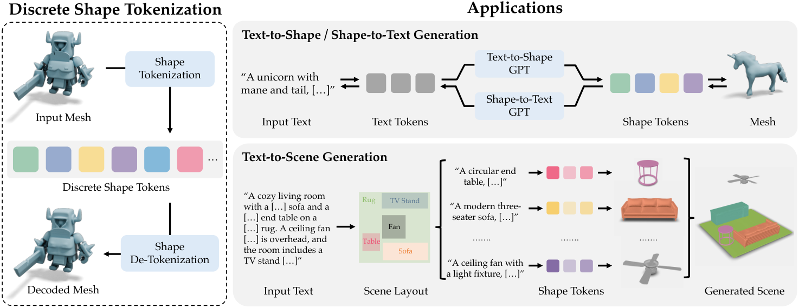

*原文 Figure 2：Figure 2 : Overview. We present an important step towards the foundation model for 3D intelligence. Specifically, our report focuses on 3D shape tokenization—a technique for converting between shapes and discrete tokens. We also demonstrate how our tokenization scheme enables multiple applications including text-to-shape generation, shape-to-text generation, and text-to-scene generation. [查看图片来源](https://arxiv.org/html/2503.15475v3/overview_v2.png)*

引用来源：arxiv_2608.02711

链接：[arXiv](https://arxiv.org/abs/2503.15475)

##### Seedream 3.0 Technical Report

作者：Yu Gao, Lixue Gong, Qiushan Guo, Xiaoxia Hou, Zhichao Lai, Fan-Shi Li, Liang Li, Xiaochen Lian, Chao Liao, Liyang Liu, Wei Liu, Yichun Shi, Shiqi Sun, Yu-Chen Tian, Zhi Tian, Peng Wang, Rui Wang, Xuanda Wang, Xun Wang, Ye Wang, Guofeng Wu, Jie Wu, X. Xia, Xuefeng Xiao, Zhonghua Zhai, Xinyu Zhang, Qi Zhang, Yuwei Zhang, Shijia Zhao, Jianchao Yang, Wei-Lin Huang

主任务：context

中文简介：

该论文解决文本到图像生成任务，以中英文提示词为输入，输出高分辨率图像，重点提升复杂提示理解、中文文字渲染、美学质量与保真度。Seedream 3.0从数据构建、混合分辨率训练、跨模态位置编码、表征对齐和后训练奖励建模等环节改进扩散生成流程，并设计加速采样策略。它属于通用二维图像生成基础模型，不属于给定的三维生成或编辑类别。

*原文 Figure 1：Figure 1 : Seedream 3.0 demonstrates outstanding performance across all evaluation aspects. Due to missing data, the Portrait result of Imagen 3 and overall result of Seedream 2.0 are represented by the average values of other models. In addition, Seedream 3.0 ranks first at Artificial Analysis Text to Image Model Leaderboard with an Arena ELO score of 1158 at 17.0K Appearances at the time of publication 1 1 1 https://artificialanalysis.ai/text-to-image/arena?tab=Leaderboard . [查看图片来源](https://arxiv.org/html/2504.11346v3/x1.png)*

引用来源：arxiv_2608.02711

链接：[arXiv](https://arxiv.org/abs/2504.11346)

##### Transfer between Modalities with MetaQueries

作者：Xichen Pan, Satya Narayan Shukla, Aashu Singh, Zhuokai Zhao, Shlok Kumar Mishra, Jialiang Wang, Zhiyang Xu, Jiuhai Chen, Kunpeng Li, Felix Juefei-Xu, Ji Hou, Saining Xie

主任务：context

中文简介：

该论文研究统一多模态系统中的跨模态生成，以图像描述或多模态语言模型的理解结果为条件，输出图像，并可扩展到图像编辑和主体驱动生成。MetaQueries使用一组可学习查询作为自回归多模态语言模型与扩散解码器之间的接口，将语言模型的语义和推理潜变量传递给图像生成模块。相比强行统一不同模态的单一训练骨干，该方法采用紧密连接但相对模块化的架构，且可在冻结语言模型时完成迁移。

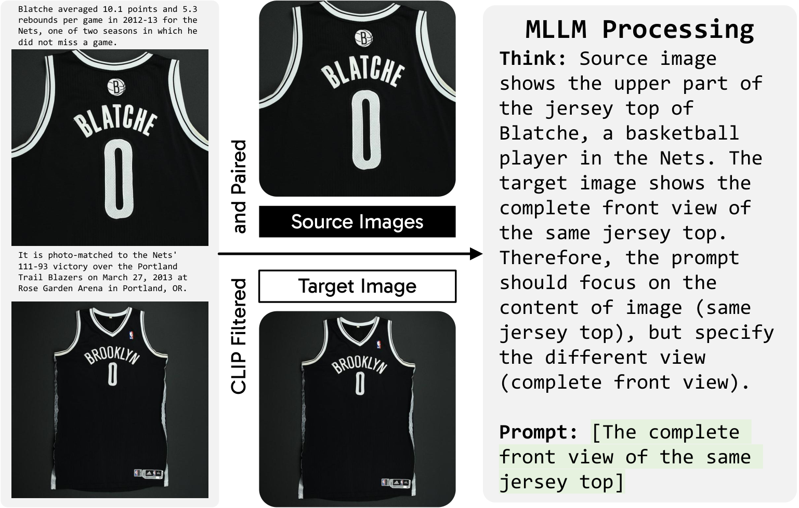

*原文 Figure 5：Figure 4 : Overview of instruction tuning data curation pipeline. We group images from web corpora based on caption similarity using the SigLIP ( Zhai et al., 2023 ) model, then construct instruction-tuning data from these image pairs using an MLLM. [查看图片来源](https://arxiv.org/html/2504.06256v1/data.png)*

引用来源：arxiv_2608.02711

链接：[arXiv](https://arxiv.org/abs/2504.06256)

##### BLIP3-o: A Family of Fully Open Unified Multimodal Models-Architecture, Training and Dataset

作者：Jiuhai Chen, Zhiyang Xu, Xichen Pan, Yushi Hu, Can Qin, Tom Goldstein, Lifu Huang, Tianyi Zhou, Saining Xie, Silvio Savarese, Le Xue, Caiming Xiong, Ran Xu

主任务：context

中文简介：

BLIP3-o面向图像理解与生成的统一建模，输入可为文本、图像及多模态指令，输出图像描述、推理结果或生成图像。其方法以扩散Transformer生成具有语义信息的CLIP图像特征，替代常见VAE表征，并采用先理解预训练、后生成预训练的顺序训练策略，辅以专门的指令数据。它属于统一多模态模型，贡献在于系统比较统一架构中的图像表示、目标和训练流程，突出理解能力保持与生成能力增强的协同。

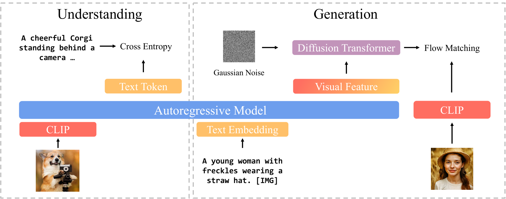

*原文 Figure 1：Figure 1: The architecture of BLIP3-o. For image understanding part, we use CLIP to encode the image and compute the cross entropy loss between the target text token and predicted text token. For image generation part, autoregressive model first generates a sequence of intermediate visual features, which are then used as conditioning inputs to a diffusion transformer that generates CLIP image features to approximate the ground-truth CLIP features. By using CLIP encoder, image understanding and image generation share the same semantic space, effectively unifying these two tasks. [查看图片来源](https://arxiv.org/html/2505.09568v1/fig1.png)*

引用来源：arxiv_2608.02711

链接：[arXiv](https://arxiv.org/abs/2505.09568)

##### Emerging Properties in Unified Multimodal Pretraining

作者：Chao-Rui Deng, Deyao Zhu, Kunchang Li, Chenhui Gou, Feng Li, Zeyu Wang, Shu Zhong, Weihao Yu, Xiao-Ping Nie, Ziang Song, Guang Shi, Haoqi Fan

主任务：context

中文简介：

BAGEL旨在统一处理文本、图像、视频及三维内容的理解与生成，输入可以是交错排列的多模态信息，输出包括解释、生成结果或操作后的内容。方法上构建统一的仅解码器模型，在大规模交错文本、图像、视频和网页数据上进行预训练，使不同模态在同一序列建模框架中交互。它属于统一多模态模型，代表从专用任务系统转向单一基础模型的路线，并进一步展示三维操控和世界导航等跨模态推理能力。

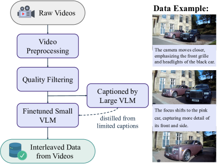

*原文 Figure 4：(a) Data pipeline for interleaved data from videos. [查看图片来源](https://arxiv.org/html/2505.14683v3/x4.png)*

引用来源：arxiv_2608.02711

链接：[arXiv](https://arxiv.org/abs/2505.14683)

##### Auto-Regressive Surface Cutting

作者：Yang Li, Victor Cheung, Xinhai Liu, Yuguang Chen, Zhongjin Luo, Biwen Lei, Haohan Weng, Zi-Bo Zhao, Jingwei Huang, Zhuo Chen, Chunchao Guo

主任务：context

中文简介：

SeamGPT解决三维网格曲面切割与语义连贯的接缝生成任务，输入网格顶点和边上的采样点云，输出按顺序排列的接缝线段及其量化三维坐标。方法将曲面切割转化为下一标记预测问题，以形状条件引导GPT式Transformer自回归生成接缝，并模拟专业建模工作流。该工作不属于给定的三维生成类别，而是面向网格处理的自回归建模；其生成对象是切割拓扑和边界，可辅助UV展开、纹理映射及部件分解。

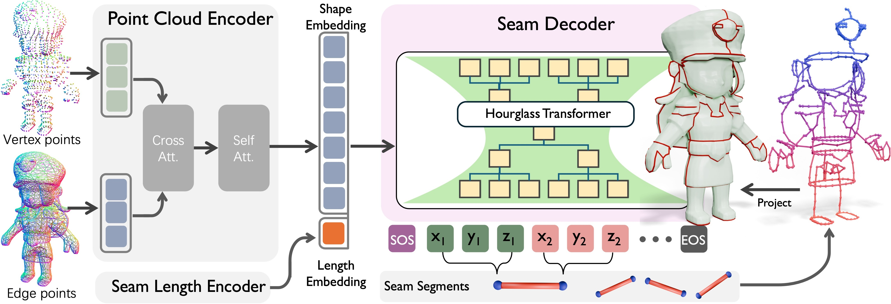

*原文 Figure 2：Figure 2: SeamGPT architecture: Point cloud encoder extracts shape context; Causal transformer decoder generates axis-ordered seam coordinates. Color indicates the prediction order is of the seam segments (red to blue). [查看图片来源](https://arxiv.org/html/2506.18017v1/figs/pipeline.jpg)*

引用来源：arxiv_2608.02711

链接：[arXiv](https://arxiv.org/abs/2506.18017)

##### EditP23: 3D Editing via Propagation of Image Prompts to Multi-View

作者：Roi Bar-On, Dana Cohen-Bar, Daniel Cohen-Or

主任务：context

中文简介：

EditP23解决已有三维对象的无掩码编辑任务，输入原始视图及其用户编辑后的图像，输出在多视角下保持结构与身份一致的编辑后三维资产。方法采用训练式前馈编辑范式，将成对图像提示转化为预训练多视图扩散模型潜空间中的编辑感知流，使二维变化传播到其他视角。它属于三维资产编辑路线，区别于依赖文本指令、显式空间掩码或逐实例优化的方法，强调以图像对提供直观控制并保持未编辑内容。

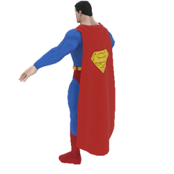

*原文 Figure 8：Figure 7 . Ablation Study of the Edit-Aware Denoising Mechanism. This figure compares our full method against two ablated variants: SDEdit and FlowEdit. For each edit request (“Cross Arms” and “Wear Tuxedo”) we show the target edited view provided to all methods (second row), followed by the source object, rendered from two alternative viewpoints. Rows 4-5 compares the editing results when applying SDEdit, FlowEdit, and our approach on the mv-grid. [查看图片来源](https://arxiv.org/html/2506.20652v1/images/ablations/ex2/src_mv_1_0.png)*

引用来源：arxiv_2608.02711

链接：[arXiv](https://arxiv.org/abs/2506.20652)

##### Qwen-Image Technical Report

作者：Chen-Fei Wu, Jiahao Li, Jingren Zhou, Junyang Lin, Kai-Yuan Gao, Kun Yan, Shengming Yin, Shuai Bai, Xiao Xu, Yi-Lei Chen, Yu-Xiang Chen, Ze-Cheng Tang, Zekai Zhang, Zhengyi Wang, An Yang, Bo-Wen Yu, Chen Cheng, Dayiheng Liu, Deqing Li, Hang Zhang, Hao Meng, Hu Wei, Ji-Li Ni, Kai Chen, Kuang Cao, Liang Peng, Lin Qu, Minggang Wu, Peng Wang, Shuting Yu, Tingkun Wen, Wen-Sen Feng, Xiao-Xue Xu, Yi Wang, Yichang Zhang, Yong-An Zhu, Yujian Wu, Yu-Jiao Cai, Ze-Yang Liu

主任务：context

中文简介：

该工作解决文本生成图像与精确图像编辑任务，输入文本、图像或二者组合，输出包含复杂文字内容的图像或编辑结果。方法采用多任务训练与渐进式课程学习，结合Qwen2.5-VL的语义表示和VAE的重建表示，并通过双重编码兼顾语义一致性与视觉保真。它主要属于二维图像基础模型，而非三维生成或编辑方法；在所给分类中不属于任何三维类别，也未体现统一三维多模态架构。

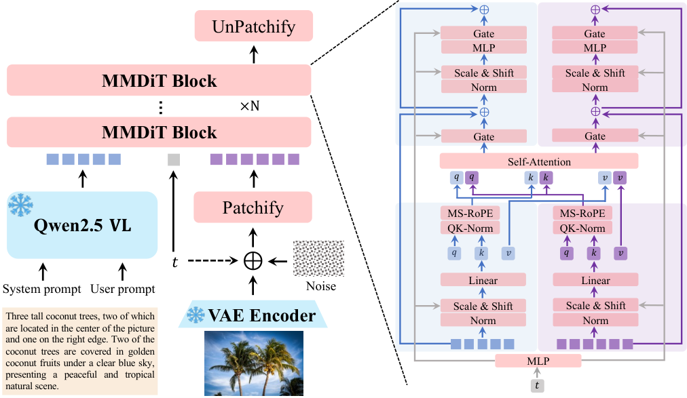

*原文 Figure 7：Figure 6: Overview of the Qwen-Image architecture. It adopts a standard double-stream MMDiT architecture. The input representations are provided by a frozen Qwen2.5-VL and a VAE encoder. The model employs RMSNorm ( Zhang & Sennrich, 2019 ) for QK-Norm, while all other normalization layers use LayerNorm. Additionally, we design a new positional encoding scheme, MSRoPE (Multimodal Scalable RoPE), to jointly encode positional information for both image and text modalities. [查看图片来源](https://arxiv.org/html/2508.02324v1/figure_qwen-image-arch2.png)*

引用来源：arxiv_2608.02711

链接：[arXiv](https://arxiv.org/abs/2508.02324)

##### HunyuanImage 3.0 Technical Report

作者：Tencent Hunyuan Team

主任务：context

中文简介：

HunyuanImage 3.0解决多模态理解与图像生成的统一任务，输入文本、图像等多模态信息，输出理解结果或生成图像。其核心是在自回归框架中统一处理跨模态信息，并结合混合专家架构、原生思维链、渐进式预训练和强化式后训练提升推理与生成能力。相较将语言理解模块和图像生成器松耦合连接的系统，它强调单一原生多模态模型中的联合建模，属于统一多模态基础模型路线。

*原文 Figure 2：Figure 2 : Image Captioning Pipeline. [查看图片来源](https://arxiv.org/html/2509.23951v3/assets/data/caption_0.png)*

引用来源：arxiv_2608.02711

链接：[arXiv](https://arxiv.org/abs/2509.23951)

##### Seedream 4.0: Toward Next-generation Multimodal Image Generation

作者：Yun-Peng Chen, Yu Gao, Lixue Gong, Meng-Hao Guo, Qiushan Guo, Zhiyao Guo, Xiaoxia Hou, Wei-Lin Huang, Yixuan Huang, Xiaowen Jian, Huafeng Kuang, Zhichao Lai, Fan-Shi Li, Liang Li, Xiaochen Lian, Chao Liao, Liyang Liu, Wei Liu, Yanzuo Lu, Zheng-Xiong Luo, Tongtong Ou, Guangchao Shi, Yichun Shi, Shiqi Sun, Yu-Chen Tian, Zhi Tian, Peng Wang, Rui Wang, Xun Wang, Ye Wang, Guofeng Wu, Jie Wu, Wenxu Wu, Yonghui Wu, X. Xia, Xuefeng Xiao, Shuang Xu, Xin Yan, Ceyuan Yang, Jianchao Yang, Zhonghua Zhai, Chen-Lin Zhang, Heng Zhang, Qi Zhang, Xinyu Zhang, Yuwei Zhang, Shijia Zhao, Wenliang Zhao, W. Zhu

主任务：context

中文简介：

Seedream 4.0面向文本生图、图像编辑和多图合成，输入文本及一张或多张参考图像，输出高分辨率生成或编辑结果。方法采用带强大VAE的扩散Transformer，通过压缩图像token提高训练和推理效率，并结合视觉语言模型开展多模态联合后训练。它区别于传统单一文本到图像系统，将编辑、组合、多图参考和多结果生成统一到一个原生高分辨率框架中。

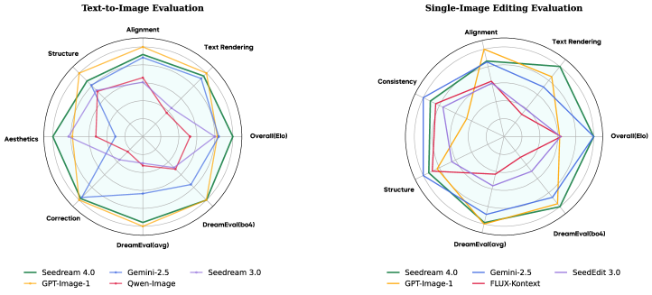

*原文 Figure 1：Figure 1 : Overall evaluation. Left: Text-to-Image results; Right: Image-Editing results. The Elo scores are obtained from the Artificial Analysis Arena. Seedream 4.0 ranks first in both T2I and image-editing leaderboards, by 09/18/2025. [查看图片来源](https://arxiv.org/html/2509.20427v3/x1.png)*

引用来源：arxiv_2608.02711

链接：[arXiv](https://arxiv.org/abs/2509.20427)

##### BLIP3o-NEXT: Next Frontier of Native Image Generation

作者：Jiuhai Chen, Le Xue, Zhiyang Xu, Xichen Pan, Shusheng Yang, Can Qin, An Yan, Honglu Zhou, Zeyuan Chen, Lifu Huang, Tianyi Zhou, Junnan Li, Silvio Savarese, Caiming Xiong, Ran Xu

主任务：context

中文简介：

BLIP3o-NEXT解决文本或多模态条件下的图像生成与图像编辑任务，输入文字、图像及编辑指令，输出新图像或修改后的图像。其核心采用自回归加扩散的统一架构：先预测离散图像token，再以自回归模型的隐状态条件化扩散模型，完成细节渲染。相较于仅使用自回归或扩散模型的路线，它将指令遵循与推理能力和高保真生成结合，并以统一架构覆盖生成和编辑。

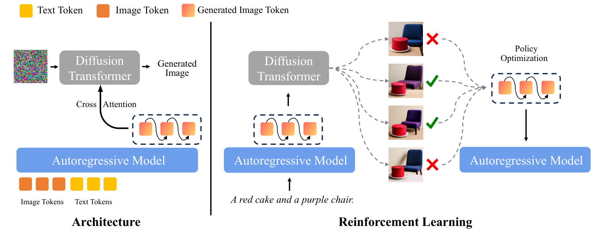

*原文 Figure 1：Figure 1: The architecture of BLIP3o-NEXT (left) and its reinforcement learning pipeline (right). BLIP3o-NEXT adopts an Autoregressive (AR) + Diffusion design, where the AR module autoregressively generates image conditions for the diffusion model. The model is jointly optimized with both AR and diffusion objectives. During reinforcement learning, rollouts are rendered from the diffusion transformer, and policy optimization is performed directly on the AR model, enabling seamless integration with existing RL infrastructures originally developed for language models. [查看图片来源](https://arxiv.org/html/2510.15857v1/figure1.png)*

引用来源：arxiv_2608.02711

链接：[arXiv](https://arxiv.org/abs/2510.15857)

##### Ming-UniVision: Joint Image Understanding and Generation with a Unified Continuous Tokenizer

作者：Ziyuan Huang, Dan-Dan Zheng, Cheng Zou, Rui Liu, Xiao-Long Wang, Kaixiang Ji, Weilong Chai, Jian-Xin Sun, Li-Bin Wang, Yong-Jie Lv, Tao Huang, Jiajia Liu, Qingpei Guo, Ming Yang, Jingdong Chen, Jun Zhou

主任务：context

中文简介：

Ming-UniVision解决视觉理解、图像生成和编辑的统一建模任务，输入文本、图像或多轮上下文，输出理解结果或新图像。其核心是MingTok连续视觉tokenizer，依次进行低层编码、语义扩展和视觉重建，再以共享连续表示将理解与生成都表述为自回归下一token预测。相较依赖离散量化视觉token的统一模型，它减少量化误差，并避免为不同任务维护彼此独立的视觉表示。

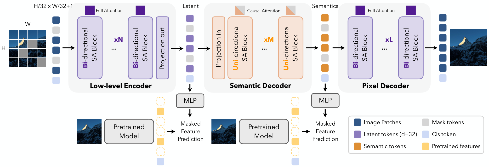

*原文 Figure 2：Figure 2 : The model architecture and the training objectives of MingTok . MingTok performs image compression, semantic decoding and image reconstruction sequentially through low-level encoder, semantic decoder, and pixel decoder. During training, both the image latent and the semantic features are supervised by pre-trained visual encoders with masked feature prediction, while the pixel decoder is trained by masked and unmasked image reconstruction. [查看图片来源](https://arxiv.org/html/2510.06590v1/0830-MingTok-structure.png)*

引用来源：arxiv_2608.02711

链接：[arXiv](https://arxiv.org/abs/2510.06590)

##### PartNeXt: A Next-Generation Dataset for Fine-Grained and Hierarchical 3D Part Understanding

作者：Penghao Wang, Yi He, Xin Lv, Yukai Zhou, Lan Xu, Jingyi Yu, Jia-Yuan Gu

主任务：context

中文简介：

PartNeXt并非三维生成模型，而是面向细粒度部件理解的数据集与评测基准，输入带纹理的三维模型，输出层次化部件标注，并支持部件分割和部件中心问答。该工作收集大规模高质量模型，提供细粒度、层次化且具纹理感知的部件标签，同时评估类别无关分割与开放词汇部件问答。它不属于给定的生成类别，而是为三维部件生成、编辑及统一多模态理解提供更具规模和层次结构的训练与评价基础。

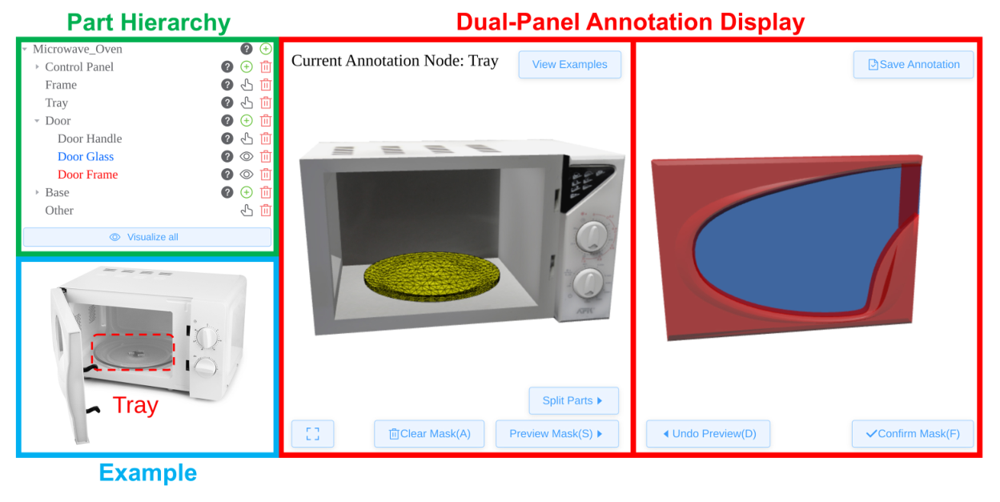

*原文 Figure 2：Figure 2 : Illustration of our annotation interface . The example shows a microwave containing an internal tray. The dual-panel layout allows annotators to first label external parts such as the “door” (as shown in the right panel with already segmented meshes), and then proceed to annotate internal components like the “tray” (visible in the unsegmented mesh in the left panel). This design effectively mitigates occlusion issues during annotation. [查看图片来源](https://arxiv.org/html/2510.20155v3/dataset_anno_sys_design.png)*

引用来源：arxiv_2608.02711

链接：[arXiv](https://arxiv.org/abs/2510.20155)

##### NaTex: Seamless Texture Generation as Latent Color Diffusion

作者：Zeqiang Lai, Yunfei Zhao, Zi-Bo Zhao, Xin Yang, Xin Huang, Jingwei Huang, Xiangyu Yue, Chunchao Guo

主任务：context

中文简介：

NaTex解决三维网格的纹理重建与生成任务，输入带几何的三维资产及生成条件，输出与表面精确对齐、跨区域一致的三维颜色纹理。它把纹理表示为稠密三维颜色点云，使用从三维数据训练的几何感知颜色VAE和多控制扩散Transformer，在潜在颜色空间中直接生成颜色，并通过几何分支、位置嵌入和几何潜变量提供表面约束。该方法属于三维原生潜空间建模的纹理路线，区别于先生成多视图二维图像、再烘焙回网格的流程。

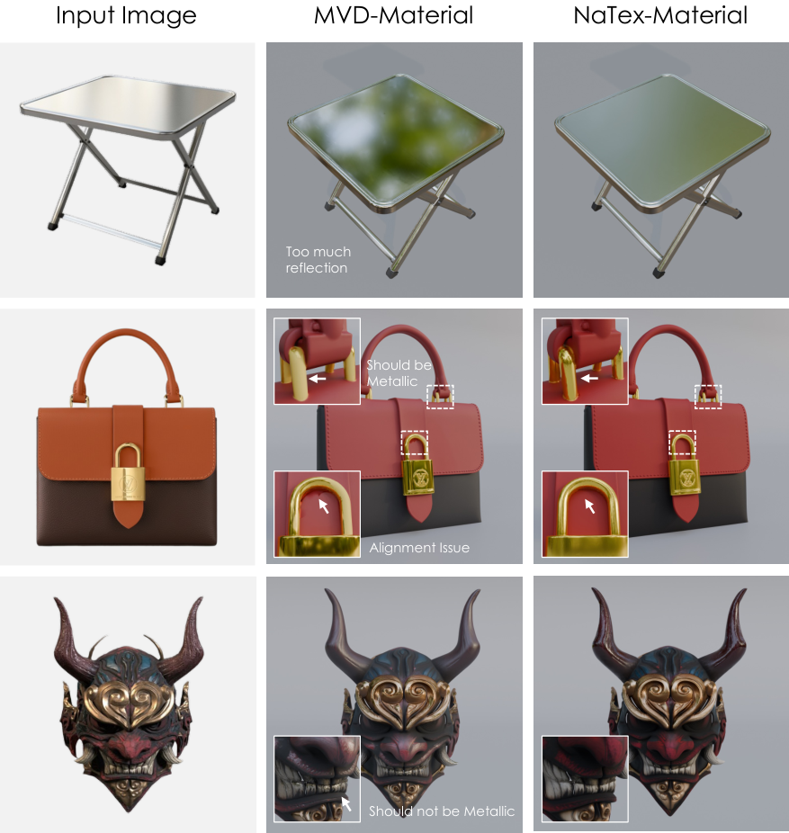

*原文 Figure 12：Figure 13 : Visual comparison between our NaTex material generation pipeline and a conventional MVD-based material pipeline. Our method produces more accurate and better-aligned materials compared to prior approaches. [查看图片来源](https://arxiv.org/html/2511.16317v1/material_cmp.png)*

引用来源：arxiv_2608.02711

链接：[arXiv](https://arxiv.org/abs/2511.16317)

##### OmniGen2: Exploration to Advanced Multimodal Generation

作者：Chen-Yuan Wu, Peng-Fei Zheng, Ruiran Yan, Shitao Xiao, Xin Luo, Yueze Wang, Wanli Li, Xiyan Jiang, Yexin Liu, Junjie Zhou, Ze Liu, Ziyi Xia, Chaofan Li, Haoge Deng, Jia-Hao Wang, Kun Luo, Bo Zhang, Defu Lian, Xinlong Wang, Zhongyuan Wang, Tiejun Huang, Zheng Liu

主任务：context

中文简介：

摘要未提供，无法根据现有材料可靠判断该论文的具体输入、输出、核心方法及其与前序路线的区别。仅依据标题可知，OmniGen2关注多模态生成，但缺少任务形式、模型结构和三维相关范围等关键信息，因此不对其所属技术路线作进一步推断。

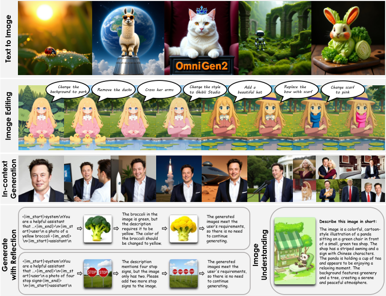

*原文 Figure 1：Figure 1 : Overview of versatile abilities of OmniGen2. [查看图片来源](https://arxiv.org/html/2506.18871v4/omnigen2_overview_new.png)*

引用来源：arxiv_2608.02711

#### 2026

##### Image Generators are Generalist Vision Learners

作者：Valentin Gabeur, Shangbang Long, Songyou Peng, P. Voigtlaender, Shuyang Sun, Yanan Bao, Karen Truong, Zhicheng Wang, Wenlei Zhou, J. Barron, Kyle Genova, Nithish Kannen, Sherry Ben, Yandong Li, Mandy Guo, Suhas Yogin, Yiming Gu, Huizhong Chen, Oliver Wang, Saining Xie, Howard Zhou, Kaiming He, T. Funkhouser, Jean-Baptiste Alayrac, Radu Soricut

主任务：context

中文简介：

该工作面向视觉理解任务，输入图像或相关视觉条件，输出分割、深度等以RGB图像形式表达的结果，同时保留图像生成能力。其核心范式是将感知任务统一改写为图像生成，并通过少量视觉任务数据对预训练图像生成模型进行指令微调，形成Vision Banana。相较于专用判别式模型，它探索了生成式预训练作为通用视觉表征学习器，并将能力扩展到二维和三维理解。

*原文 Figure 30：Figure 8 : Comparison with SOTA surface normal estimation method Lotus-2 ( He et al., 2025 ) . Results of Lotus-2 are obtained using its Hugging-Face demo: https://huggingface.co/spaces/haodongli/Lotus-2_Normal . Vision Banana can produce surface normal map with much higher visual quality and better fine-grained details. Zoom-in for the details. [查看图片来源](https://arxiv.org/html/2604.20329v3/assets/surface_normal/sn_1_in.jpg)*

引用来源：arxiv_2608.02711

链接：[arXiv](https://arxiv.org/abs/2604.20329)

##### GEM: Generative Supervision Helps Embodied Intelligence

作者：Ruowen Zhao, Bangguo Li, Zuyan Liu, Yi-Nan Liang, Junliang Ye, Fang-Fu Liu, Diankun Wu, Zhengyi Wang, Xu-Min Yu, Yongming Rao, Han Hu, Jun Zhu

主任务：context

中文简介：

GEM面向具身视觉语言理解与行动任务，输入图像、语言以及与定位、推理和规划相关的数据，输出语义判断、空间推理或行动决策，并在预训练阶段额外生成深度图。其核心是在统一具身视觉语言模型中加入深度生成监督，使模型同时学习高层语义和执行所需的低层空间、物理知识，并进一步支持GEM-VLA行动模型。相较仅依赖文本指导的VLM预训练路线，GEM将生成式三维感知信号纳入多模态骨干，强化理解到操作的衔接。

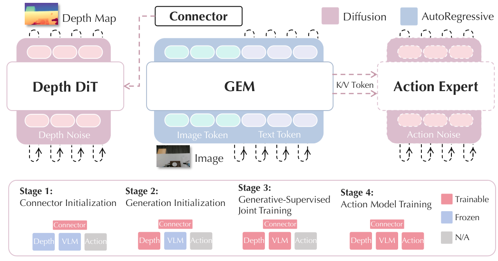

*原文 Figure 1：Figure 2: Architecture of GEM. GEM augments a VLM backbone with a DiT-based depth generator conditioned on the backbone’s final-layer visual tokens. We adopt a progressive training paradigm: (i) initialize the connector, (ii) warm up the depth generator, (iii) perform end-to-end joint training, and (iv) train an autoregressive action expert on GEM’s multimodal tokens. Building on GEM, the GEM-based VLA predicts continuous actions from these representations, improving robot manipulation. [查看图片来源](https://arxiv.org/html/2605.28548v1/fig2.png)*

引用来源：arxiv_2608.02711

链接：[arXiv](https://arxiv.org/abs/2605.28548)

##### TanGO: Training-Free 3D Editing via Tangent-Space Guidance and Optimization

作者：Si-Woo Lim, Sunjae Yoon, Gwanhyeong Koo, Hyeonseo Yun, C. D. Yoo

主任务：context

中文简介：

TanGO解决已有三维对象的文本或条件编辑任务，输入源三维资产及目标编辑条件，输出保留区域稳定、目标区域完成变换的三维对象。它针对流匹配模型中共享全局上下文导致的编辑伪影，在生成动力学的切空间中进行免训练、逐token自适应控制，并以一步最优控制规则确定信号强度。相较统一施加扰动的训练式或优化式编辑路线，TanGO强调按token选择性引导，以减少保留区域塌缩和编辑不完整。

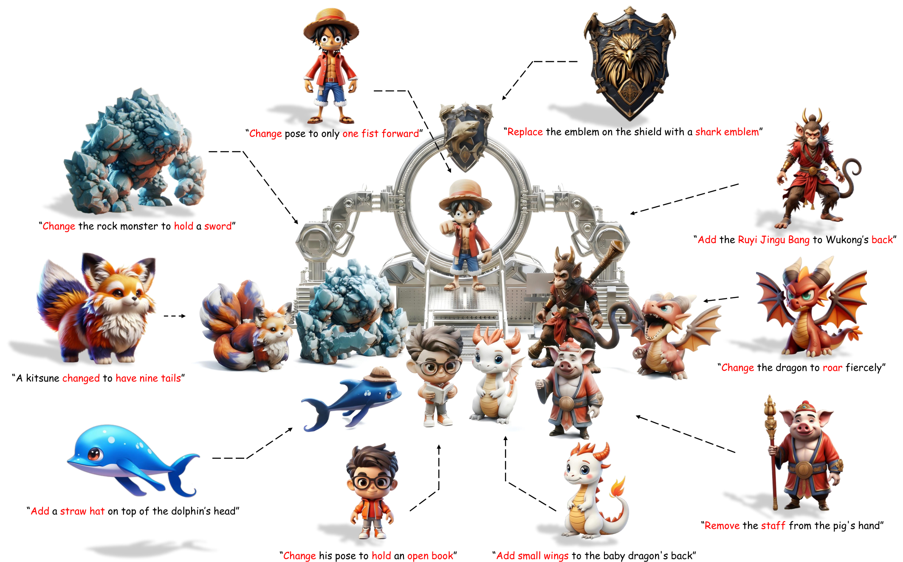

*原文 Figure 1：Figure 1 : Overview of 3D Editing Results. TanGO achieves precise localized edits across diverse categories, preserving unedited geometry and source identity. [查看图片来源](https://arxiv.org/html/2607.14927v1/fig1.png)*

引用来源：arxiv_2608.02711

链接：[arXiv](https://arxiv.org/abs/2607.14927)

##### Hunyuan3D-Buffalo 1.0

主任务：context

中文简介：

该论文的摘要未提供具体方法信息，无法据此准确说明其输入输出、核心生成范式及与既有路线的区别。根据分类，它应属于三维原生潜空间生成，即先将三维形状编码为三维潜表示，再在其中建模并生成三维资产，而非依赖二维扩散先验进行逐实例优化或直接自回归生成网格序列。

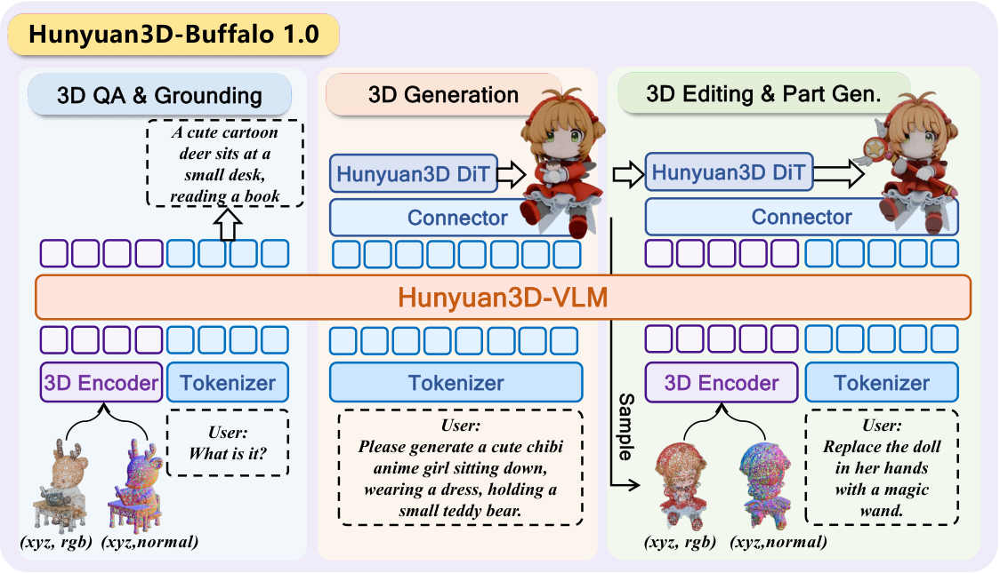

*原文 Figure 7：Figure 6: Hunyuan3D-Buffalo 1.0 pipeline. The framework unifies 3D QA and grounding, text-to-3D generation, and 3D editing through a shared Hunyuan3D-VLM backbone, which connects language, 3D representations, and generative Hunyuan3D DiT modules for multimodal understanding, generation, and editing. [查看图片来源](https://arxiv.org/html/2608.02711v3/Pipeline.png)*

引用来源：user_seed
