# 多模态条件驱动的 3D 生成、编辑与理解：以 Hunyuan3D-Buffalo 为核心的相关工作脉络

> 当前页面用于快速建立领域地图。 [逐篇解析（109 篇）](full/) · [BibTeX 与 DBLP 查询结果](bibliography/index.html)

## 总述

### 一句话定义

多模态模型驱动的三维生成、编辑与理解，研究如何让语言、图像及空间观测与三维世界建立可学习的语义和几何联系，使系统能够创造新资产、按指令修改既有资产，或解释其类别、部件、关系与用途。领域核心目标是在有限三维数据和复杂空间表示下，同时提升条件遵循、几何与外观质量、跨视角一致性、结构可编辑性、推理效率及面向设计、仿真和机器人应用的可用性。

### 任务边界

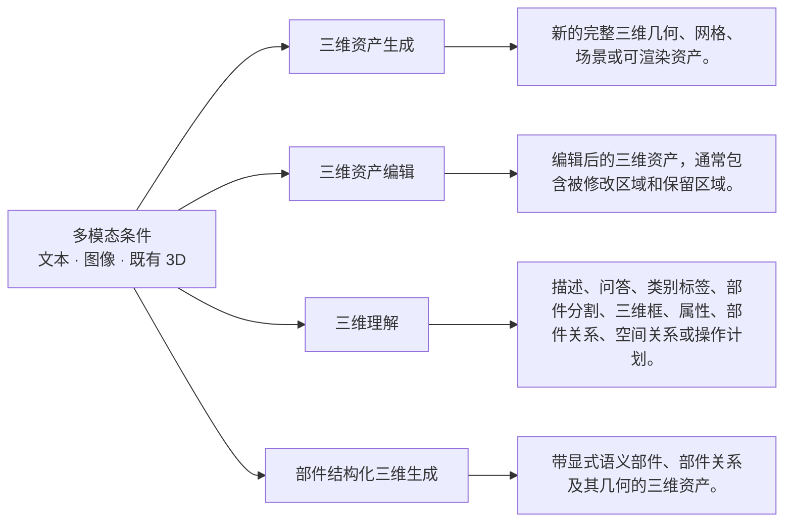

### 快速要点

- **任务：** 本领域包含四类契约：生成创造新三维资产；编辑修改既有资产并尽量保持未指定区域；理解把已有三维数据转化为描述、问答、标签、关系或计划；部件结构化生成进一步要求新资产具有显式语义部件及其关系。
- **输入：** 输入可为文本、单幅或多视图图像、点云、网格、体素、包围盒、部件清单及相机信息；编辑必须额外提供源三维资产，理解则以已有三维数据为主要对象。
- **输出：** 输出可为带几何、纹理或材质的完整三维资产、修改后的源资产、显式部件及关系结构，或关于已有三维内容的自然语言、标签、分割、空间关系与操作计划。
- **核心关注：** 高质量三维数据稀缺，格式、尺度、拓扑与标注高度异构；二维先验虽强，却容易造成背面缺失和跨视角几何冲突；高分辨率几何、拓扑与材质联合建模计算成本巨大；编辑需兼顾目标变化、身份保持和未编辑区域不变；语义理解与精细几何所需粒度不同，统一模型容易相互牵制。
- **不纳入：** 只生成二维图像而不返回三维结果的工作；仅提供数据集、评测、压缩或底层表示而不完成上述任务的工作。

*面向读者：刚刚入学、了解 Transformer 等基础结构但不熟悉该细分领域的博士生；综述截止日期：2026-09-19。*

### 领域标准流程

下图只表达跨任务、跨论文的共同范式；标为可选的环节并非所有方法都包含。

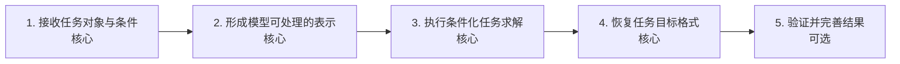

## 分类

分类分为三个正交维度：每篇论文只有一个主任务；方法标签和架构标签可以叠加。

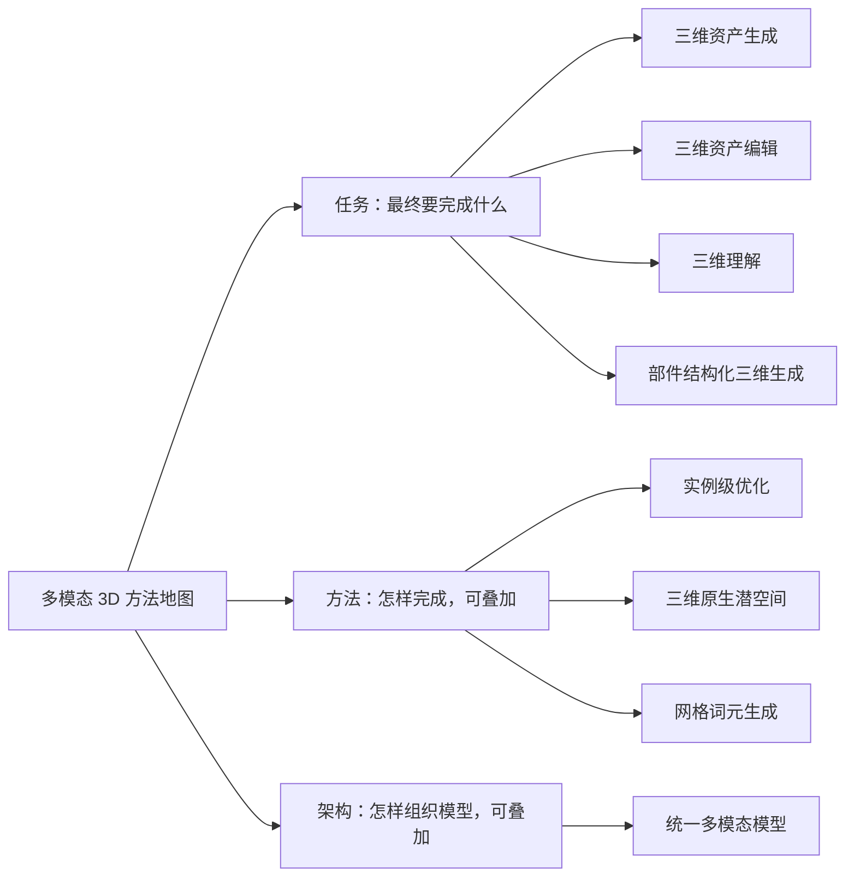

### 任务维度

#### 三维资产生成（generation）

该类接收文本、图像、类别、点云、粗网格、包围盒或其他条件，直接输出一个新的、相对完整的三维资产。关键边界不是条件是否包含三维信息，而是没有一个需要保持身份和未编辑区域的源三维资产作为修改对象。只要输出契约不要求显式语义部件及其关系，就归入此类；若明确要求部件身份、层级或关系，则优先归入part_structured_generation。

**核心范式：** 输入条件先被编码为文本、图像、部分三维观测或多模态语义表示；模型据此预测连续三维潜变量、几何场、连续网格表示或网格词元序列；三维解码器将中间表示还原为几何和外观；必要时再进行渲染或格式化，输出新的完整三维资产。

**典型输入：** 文本、图像、类别标签、草图、点云、粗网格、包围盒或其他生成条件；其中三维条件不是需要保持身份和未编辑区域的源资产。

**典型输出：** 新的完整三维几何、网格、场景或可渲染资产。

**类别典型流程（非领域标准）：**

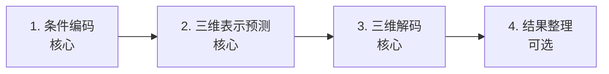

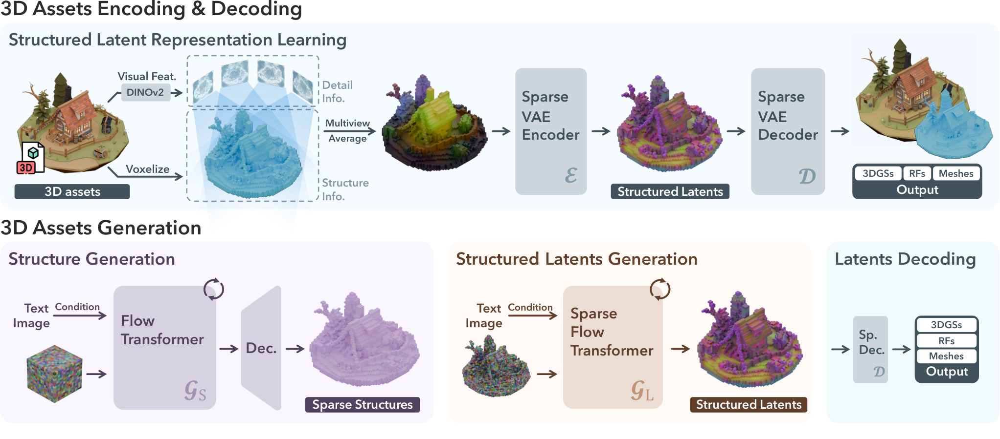

*原图：[TRELLIS](https://arxiv.org/html/2412.01506v3)。Figure 2：以稀疏三维网格上的结构化潜变量同时表达几何与外观，并用两级 Rectified Flow 生成稀疏结构和局部潜变量。*

#### 三维资产编辑（editing）

该类以已有三维资产为核心输入，并根据文本、图像或其他条件修改其局部或整体属性，同时通常要求保留未编辑区域和三维一致性。部件编辑仍属于编辑，因为主要契约是改变输入资产；无论采用实例级优化、二维视图融合、潜空间操作还是前馈变换，都不改变任务归属。

**核心范式：** 系统先编码已有资产和编辑条件，确定需要改变的区域或属性；随后通过实例优化、潜空间操作、视图变换或前馈编辑器修改三维表示；最后解码并约束未编辑内容，输出保持结构一致的编辑后资产。

**典型输入：** 已有三维资产，以及文本指令、参考图像或编辑条件。

**典型输出：** 编辑后的三维资产，通常包含被修改区域和保留区域。

**类别典型流程（非领域标准）：**

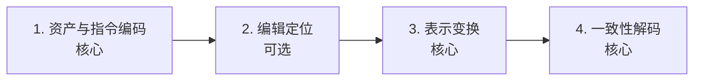

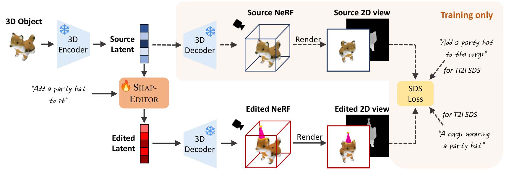

*原图：[Shap-Editor](https://arxiv.org/html/2312.09246v1)。Figure 2：把源三维对象编码进 Shap-E 潜空间，在潜空间依据自然语言指令完成编辑，再解码为编辑后的三维表示。*

#### 三维理解（understanding）

该类以已有三维输入为主要输入，输出关于它的语言描述、问答结果、类别标签、部件或空间关系、属性判断或操作计划。它的核心不是产生新的三维几何，而是把三维结构转化为可解释的语义结果。重建、纹理提取或几何处理只有在主要输出是理解结果时才进入该任务。

**核心范式：** 模型先将三维资产编码为几何、视觉或网格表示，再通过跨模态或任务特定推理模块完成语义判断。仅语言问答、描述或规划路线使用语言模型；分类、分割、三维框和关系预测可使用相应任务模块。系统最终按任务选择语言解码器、分类头、分割头、框检测头或关系头输出结果。

**典型输入：** 已有三维资产、点云、网格、渲染视图或其组合，以及可选的问题或任务提示。

**典型输出：** 描述、问答、类别标签、部件分割、三维框、属性、部件关系、空间关系或操作计划。

**类别典型流程（非领域标准）：**

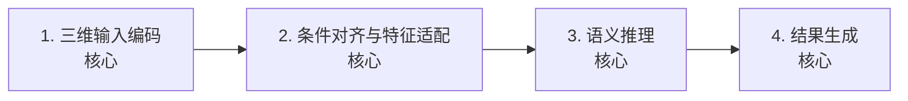

*原图：[PointLLM](https://arxiv.org/html/2308.16911v3)。Figure 2：点云编码器提取三维特征，投影器将其送入语言模型潜空间，语言模型联合处理点云和文本词元并输出语言结果。*

#### 部件结构化三维生成（part_structured_generation）

该类是生成任务的更具体输出契约：输入可以是文本、图像、点云、粗网格、包围盒、部件清单或其他条件，输出必须是由具有显式语义身份的部件组成、并表达部件关系的三维资产。关键边界是生成新的结构化资产，而不是修改一个需要保持身份和未编辑区域的既有资产。部件可以是开放词汇或预定义词汇，关系可以体现层级、连接、空间或物理约束。

**核心范式：** 系统先理解条件中的对象和部件语义，再预测部件集合及其关系图或结构约束；随后为各部件生成几何，并通过联合解码、多分支生成或物理约束协调部件之间的布局；最后合成为带语义结构的完整三维资产。

**典型输入：** 文本、图像、类别、点云、粗网格、包围盒、部件清单或其他生成条件；其中三维条件不是需要保持身份和未编辑区域的源资产。

**典型输出：** 带显式语义部件、部件关系及其几何的三维资产。

**类别典型流程（非领域标准）：**

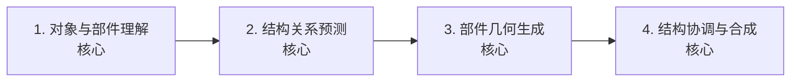

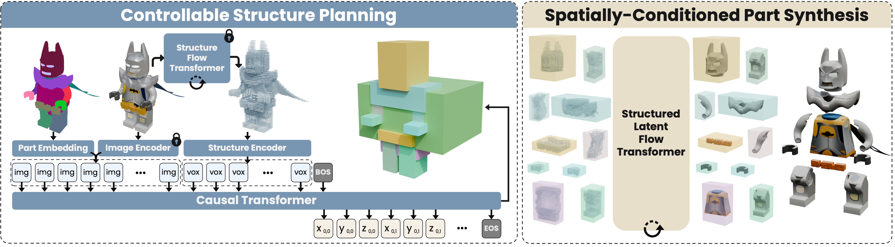

*原图：[OmniPart](https://arxiv.org/html/2507.06165v1)。Figure 2：先自回归规划部件级包围盒，再在结构化部件潜空间中联合生成各个部件。*

### 方法维度

#### 实例级优化（instance-level optimization）

该方法轴按推理时是否针对每个输入实例单独优化三维表示来划分。典型做法是利用预训练二维扩散模型或评分蒸馏，把文本或编辑指令转化为对当前资产的优化目标。它能够在缺少大规模三维监督时工作，但推理成本随实例增加，且结果稳定性依赖优化过程。

**核心范式：** 输入条件和三维表示被转化为可微目标；系统渲染或评估当前表示，利用二维先验、评分蒸馏或一致性损失计算梯度；优化器反复更新当前实例的表示，直到满足条件；最终将优化结果解码为资产。

**典型输入：** 文本或编辑条件，以及当前三维表示或待优化资产。

**典型输出：** 经过逐实例迭代优化的三维表示或资产。

#### 三维原生潜空间（3D-native latent space）

该方法轴按中间表示所在空间划分，关注模型是否在由三维数据学习得到的潜空间中完成生成或编辑。三维变分自编码器（VAE）等编码器先把几何或资产压缩为三维原生潜变量，生成模型再在该空间中建模，最后解码回三维资产。它区别于把二维图像先验直接蒸馏到三维表示。

**核心范式：** 三维资产先经过三维编码器压缩为潜变量；生成或编辑模型在该潜空间中进行条件建模；潜变量随后由三维解码器恢复为几何、外观或网格；训练和推理的核心建模对象始终是三维潜表示。

**典型输入：** 三维资产、文本、图像或编辑条件。

**典型输出：** 三维原生潜变量及其解码后的资产。

#### 网格词元生成（mesh token generation）

该方法类别按是否把顶点、面或连接关系等网格元素编码为可供序列模型处理的离散词元序列来划分。其共同且可独立验证的边界是网格词元化，而不是采用自回归、扩散或流等何种求解机制，也不以低多边形或生产友好作为必要条件。连续逐顶点表示、连续潜空间或仅在最终解码时输出网格的路线不属于本类。

**核心范式：** 训练网格首先被编码为由顶点、面或连接信息构成的离散词元序列；条件编码器提供文本、图像或类别条件；序列生成器预测目标词元；反词元化器将词元恢复为显式网格。具体生成器采用自回归或其他机制属于独立选择。

**典型输入：** 文本、图像、类别条件，以及训练阶段用于词元化的网格。

**典型输出：** 可反词元化为显式网格的离散词元序列及其恢复结果。

### 架构维度

#### 统一多模态模型（unified multimodal model）

该架构轴关注一个统一模型是否在同一总体系统中处理三维理解与三维生成，通常共享语言或多模态主干，并通过视觉、三维或生成模块连接不同输入输出。它可以采用离散视觉词元、语义编码器加生成器，或语言建模与流式生成的更紧密整合。该类描述系统边界，不替代任务或表示方法标签。

**核心范式：** 三维或视觉输入先由编码器转换为可供主干处理的表示；共享语言或多模态主干完成语义理解与条件推理；生成端再调用离散词元生成器、扩散或流模块输出三维结果；同一系统因此能够在理解输出与生成输出之间切换。

**典型输入：** 文本、图像、三维资产及其组合。

**典型输出：** 描述、问答、标签、关系、计划或新的三维资产。

## 相关工作

本章不重复逐篇摘要，而是按照领域类别串起方法演化：先说明问题和范式，再说明代表工作如何改变方法，最后指出仍未解决的缺口。

### 三维资产生成（generation）

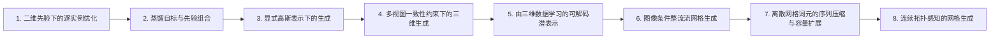

- **二维先验下的逐实例优化**：在缺少大规模三维监督时，如何借助预训练二维扩散先验生成当前三维资产。；方法变化：DreamFusion与Magic3D沿推理时针对当前实例反复优化三维表示这一单一变化轴推进。；代表论文：arxiv_2209.14988、arxiv_2211.10440。
- **蒸馏目标与先验组合**：二维先验指导三维生成时，蒸馏信号的稳定性与生成多样性仍受限制。；方法变化：该阶段沿蒸馏目标或先验组合方式这一变化轴推进，不据使用SDS本身推断所有方法都属于实例级优化。；代表论文：arxiv_2303.13873、arxiv_2305.16213。
- **显式高斯表示下的生成**：隐式或较重的三维表示限制了生成与渲染效率，促使研究转向显式高斯表示。；方法变化：该阶段沿三维高斯表示这一单一表示轴推进，比较如何以高斯基元承载生成结果。；代表论文：arxiv_2309.16653、arxiv_2310.08529。
- **多视图一致性约束下的三维生成**：二维先验可能产生跨视角不一致，需要在生成过程中加强多视图约束。；方法变化：该阶段沿多视图一致性或联合多视图建模这一变化轴推进。；代表论文：arxiv_2401.09050、arxiv_2403.12032。
- **由三维数据学习的可解码潜表示**：逐资产优化难以形成高效通用生成器，而直接从条件映射到三维又受到表示效率和跨模态对齐限制。；方法变化：该阶段沿三维数据学习的可解码潜空间这一表示轴推进。；代表论文：arxiv_2306.17115、arxiv_2406.13897、arxiv_2412.01506、arxiv_2506.01853。
- **图像条件整流流网格生成**：图像条件三维生成需要直接得到网格，同时避免把整流流机制误写为三维原生潜空间证据。；方法变化：TripoSG沿图像条件与整流流生成机制这一独立路线推进，不作为前一潜空间阶段的连续后继。；代表论文：arxiv_2502.06608。
- **离散网格词元的序列压缩与容量扩展**：显式网格的离散词元序列会产生长序列、共享顶点重复、坐标量化误差与顺序解码成本。；方法变化：该阶段沿离散网格词元化与序列表示轴推进，论文并列探索词元化压缩、容量扩展、面级词元和偏好对齐。；代表论文：arxiv_2405.16890、arxiv_2408.02555、arxiv_2409.18114、arxiv_2411.07025、arxiv_2412.09548、arxiv_2503.15265、arxiv_2603.01515。
- **连续拓扑感知的网格生成**：离散网格序列面临顺序解码和量化成本，因此部分工作探索在连续表示中保留顶点与连接信息。；方法变化：LATO、MeshFlow和PolyFlow沿连续拓扑表示这一并行路线推进，不属于离散网格词元阶段。；代表论文：arxiv_2603.06357、arxiv_2606.04621、arxiv_2606.30673。

**读者应记住：** 截至2026-09-19，给定材料表明三维资产生成的代表性脉络主要围绕四个彼此关联但不可混为一谈的问题展开：如何降低逐实例优化成本，如何学习可解码且保留拓扑的三维表示，如何扩展到高分辨率和复杂资产，以及如何处理离散或连续网格的生成边界。统一架构、偏好、物理属性、生产材质、人体条件和交互控制等工作仍完整保留在论文清单中，但因无法在现有证据下形成共同问题与单一变化轴，不强行纳入阶段脉络。没有任何摘要证明上述目标已由同一系统同时实现。判断方法时还应严格区分离线训练与推理：针对当前NeRF、网格参数或高斯位置的反复更新属于推理时实例级优化，而常规扩散采样、ODE或流积分本身不能证明存在这种优化。

### 三维资产编辑（editing）

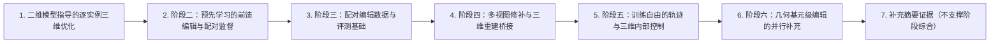

- **二维模型指导的逐实例三维优化**：早期指令编辑借助二维模型反复修改观测并更新当前三维表示，每个资产都需要单独处理。；方法变化：该阶段沿二维编辑模型指导当前三维资产迭代这一单一推理轴推进。；代表论文：arxiv_2303.12789。
- **阶段二：预先学习的前馈编辑与配对监督**：将逐资产优化替换为可复用编辑映射通常需要高质量源资产—编辑后资产配对监督，同时还要保持源资产一致性。；方法变化：该阶段围绕可复用的学习式三维资产编辑推进；Steer3D明确以语言编辑已生成的三维资产并保持与原始资产的一致性。仅对摘要直接支持的论文进一步认定配对监督或一次前向编辑。；代表论文：arxiv_2312.09246、arxiv_2511.17501、arxiv_2512.13678、arxiv_2603.17841、arxiv_2605.27351。
- **阶段三：配对编辑数据与评测基础**：三维编辑模型受到源资产—目标资产配对数据稀缺及训练、测试覆盖不足的限制。；方法变化：3DEditVerse沿配对数据与评测基础这一独立轴推进，不据此认定其采用一次前向编辑。；代表论文：arxiv_2510.02994。
- **阶段四：多视图修补与三维重建桥接**：二维编辑结果需要通过多视图修补或条件重建恢复为三维资产，同时降低跨视角不一致和几何误差。；方法变化：Instant3dit与3D Mesh Editing Using Masked LRMs共同围绕多视图修补、掩码条件与三维重建这一较窄变化轴组织；不把Pro3D-Editor纳入本阶段，因为其证据只支持从编辑显著视图向其他视图传播编辑语义。；代表论文：arxiv_2412.00518、arxiv_2412.08641。
- **阶段五：训练自由的轨迹与三维内部控制**：训练自由编辑仍需在编辑强度、几何稳定性和未编辑区域保持之间进行控制。；方法变化：VoxHammer、NANO3D、AnchorFlow和Velocity-Space共同围绕反演特征、区域合并、轨迹锚点或速度空间中的编辑控制组织；不把Prox-E纳入该共同阶段。；代表论文：arxiv_2508.19247、arxiv_2510.15019、arxiv_2511.22357、arxiv_2605.07385。
- **阶段六：几何基元级编辑的并行补充**：编辑系统需要在较高层次的三维几何抽象上指定局部变化，但该路线与轨迹或速度空间中的保持机制不同。；方法变化：Prox-E沿几何基元抽象与基元级变化指定这一独立路线推进，由视觉语言模型指定几何基元变化。；代表论文：arxiv_2604.23774。
- **补充摘要证据（不支撑阶段综合）**：尚需全文核验：这些论文尚不足以支撑更具体的阶段问题归纳。；方法变化：尚需全文核验：本组只登记可追溯线索，不把题名或孤立摘要升级为方法演化结论。；代表论文：arxiv_2607.07187、arxiv_2604.13688、arxiv_2602.21499、arxiv_2602.05676、arxiv_2602.04349、arxiv_2503.23241、arxiv_2407.06191、arxiv_2401.14828。

**读者应记住：** 截至2026-09-19，给定摘要显示三维资产编辑已从耗时的二维指导逐实例优化，扩展为监督式前馈编辑、多视图修补与重建、训练自由三维内部控制以及表示专门化等路线。入门时应首先区分训练与推理：离线训练学习跨资产的编辑能力；针对当前实例的反复优化属于推理；训练自由也不代表推理只需一次前向。现有路线均围绕同一核心张力展开，即在充分实现目标变化的同时严格保留未编辑内容。统一评测下的指令遵循、几何与跨视角一致性、外观保真、拓扑级修改、条件成本和推理效率仍是共同开放问题。

### 三维理解（understanding）

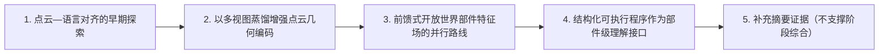

- **点云—语言对齐的早期探索**：大语言模型尚未充分覆盖三维理解，早期工作的核心瓶颈是把点云中的几何与外观信息接入语言模型。；方法变化：该阶段采用点云编码器与大语言模型融合几何、外观和语言信息，生成上下文相关的语言响应。；代表论文：arxiv_2308.16911。
- **以多视图蒸馏增强点云几何编码**：点云编码器与语言模型的连接仍可能存在几何表征不足。；方法变化：该阶段沿输入表示增强轴推进，利用多视图图像蒸馏增强几何理解，再作为三维点云输入编码器。；代表论文：arxiv_2402.17766。
- **前馈式开放世界部件特征场的并行路线**：开放世界形状、不同三维模态和层级部件结构需要可处理的部件表征。；方法变化：该阶段独立于点云—语言问答路线，沿一次三维前馈计算获得连续部件特征场并聚类分解的轴推进；不再将其写成从语言问答自然演化而来。；代表论文：arxiv_2504.11451。
- **结构化可执行程序作为部件级理解接口**：纯自然语言响应难以无歧义表达部件范围、语义和后续操作。；方法变化：该阶段沿结构化程序接口轴推进，将部件级信息和命令组织为可执行语法程序。；代表论文：arxiv_2511.13647。
- **补充摘要证据（不支撑阶段综合）**：尚需全文核验：这些论文尚不足以支撑更具体的阶段问题归纳。；方法变化：尚需全文核验：本组只登记可追溯线索，不把题名或孤立摘要升级为方法演化结论。；代表论文：arxiv_2509.08643。

**读者应记住：** 截至2026-09-19，给定摘要显示三维理解呈现“点云到自然语言响应及几何增强编码、开放世界部件表征、结构化符号规划”并行发展的格局。PointLLM处于点云—语言连接的早期位置，ShapeLLM推进了几何编码，PartField代表前馈式部件表征，Part-X-MLLM则提供部件级可执行程序接口；X-Part主要提供邻近的部件生成与分解线索。当前仍缺少由这些摘要共同证明的统一方案，能够同时保证开放世界部件语义、复杂空间推理、结构化程序执行以及跨几何系统的可靠性。

### 部件结构化三维生成（part_structured_generation）

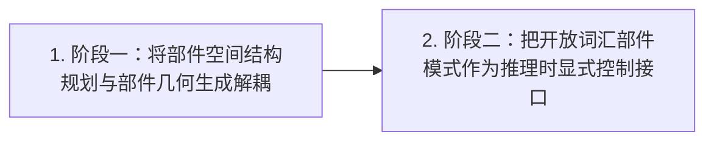

- **阶段一：将部件空间结构规划与部件几何生成解耦**：仅在共享表示中产生分离部件不足以同时保证各部件语义上的可独立控制与整体空间结构上的连贯性。；方法变化：该阶段沿显式空间结构规划这一变化轴推进：摘要明确支持预测可变长度的三维部件包围盒序列，并以灵活的二维部件掩码控制部件分解；摘要另提到空间条件化的整流流模型，但未完整说明其流程作用。；代表论文：arxiv_2507.06165。
- **阶段二：把开放词汇部件模式作为推理时显式控制接口**：预设或自动得到的部件分解难以稳定对齐游戏、仿真、动画和脚本行为等应用所要求的特定语义部件。；方法变化：该阶段将部件结构直接暴露为推理时控制信号：用户除提供整体文本提示外，还可用开放式部件名称列表规定所需部件模式，系统据此分别生成部件网格并组合为对象。；代表论文：arxiv_2605.28763。

**读者应记住：** 截至2026-09-19，给定论文显示，部件结构化生成已探索空间结构规划与推理时部件模式控制。不过，现有摘要对层级、连接、物理一致性、开放词汇泛化边界以及完整训练机制提供的信息仍有限，不能据此断言这些问题已经解决。

### 背景与上下文工作（非任务背景）

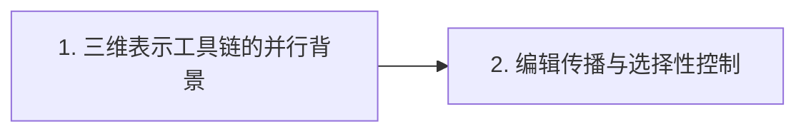

- **三维表示工具链的并行背景**：三维几何需要适合模型处理的表示，但神经场、三维词元、网格提取和接缝预测面向不同对象。；方法变化：这些工作是并行的三维表示工具链背景：3DShape2VecSet涉及向量集合上的神经场，Cube涉及三维词元器，MeshAnything涉及网格提取或表示转换，SeamGPT涉及接缝片段预测；它们不构成从向量集合到表面序列的连续演化链。；代表论文：arxiv_2301.11445、arxiv_2503.15475、arxiv_2406.10163、arxiv_2506.18017。
- **编辑传播与选择性控制**：三维相关编辑需要传播用户修改并控制传播范围，但两篇论文的机制和输出契约并不相同。；方法变化：EditP23与TanGO作为并行的编辑相关背景：前者围绕多视图潜在表示中的前馈传播，后者围绕生成动力学切空间中的逐词元控制；TanGO不作为editing任务代表。；代表论文：arxiv_2506.20652、arxiv_2607.14927。

**读者应记住：** 当前展开的背景材料主要说明三维表示对象如何被编码、生成或预测，以及编辑相关信号如何在多视图表示或生成动力学中传播和受控。它们提供工具与机制背景，但不能自动证明完整三维资产输出、编辑后资产回写、三维原生潜空间或推理时实例级优化。
