# 单图像扩散高模 3D 生成：逐篇解析

> 当前页面按分类和时间顺序逐篇介绍论文。 [快速理解版](../) · [待核验论文（4 篇）](../uncertain-papers/index.html) · [BibTeX 与 DBLP 查询结果](../bibliography/index.html) · [返回综述目录](../../)

## 逐篇解析

以下论文先按研究角色分为主体、相邻和背景，再在主体内部显示任务标签；统一模型不会被压缩成单一任务。这里的“统一模型内的三维生成能力”只表示主体模型中的一个任务分支，不等于把独立的 text-to-3D、image-to-3D 或单任务 3D 生成器纳入主体。分类内按首稿时间从早到晚排列。文字为摘要级快速介绍，配图来自论文原文。

### 主体论文（统一多模态模型）

#### 任务标签：单图条件完整物体高模几何生成（generation）

##### 2023

##### Locally Attentional SDF Diffusion for Controllable 3D Shape Generation

作者：Xin Zheng, Hao Pan, Peng-Shuai Wang, Xin Tong, Yang Liu, Heung-Yeung Shum

研究角色：主体论文（统一多模态模型）
任务标签：generation

方法标签：Implicit-field diffusion

中文简介：

该工作以二维草图图像为主要条件，输出可控且细节丰富的完整三维形状，也支持类别条件生成。方法采用两阶段隐式场扩散：先以occupancy-diffusion生成低分辨率占据场勾勒外壳，再在占据体素内以SDF-diffusion合成高分辨率符号距离场并提取表面；视角感知局部注意力将图像块特征注入三维体素。它属于隐式场空间扩散，区别于单阶段全局生成，更强调局部几何控制与分层细化。

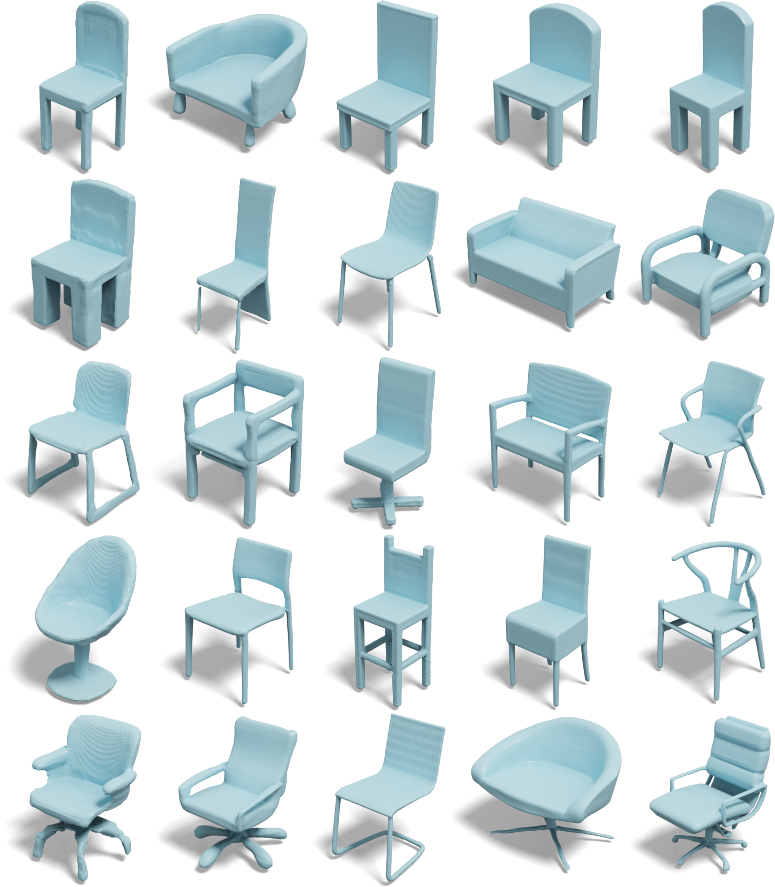

*原文图 2：论文方法流程图；详细原始图注请查看图片来源。 [查看图片来源](https://arxiv.org/html/2305.04461v2/sketchdiffusion-pipeline.png)*

引用来源：arxiv_2512.14692

链接：[arXiv](https://arxiv.org/abs/2305.04461)

##### Michelangelo: Conditional 3D Shape Generation based on Shape-Image-Text Aligned Latent Representation

作者：Zibo Zhao, Wen Liu, Xin Chen, Xian-Fang Zeng, Rui Wang, Pei Cheng, Bin Fu, Tao Chen, Gang Yu, Shenghua Gao

研究角色：主体论文（统一多模态模型）
任务标签：generation

中文简介：

Michelangelo接收单张物体图像或文本描述，输出与条件语义一致且具有细粒度几何的三维形状。其范式是“先对齐、后生成”：SITA-VAE将形状编码为与图像、文本对齐的无序潜特征表示，并由Transformer解码为三维神经场；ASLDM再学习从图像或文本条件到形状潜空间的扩散映射。它属于无序潜变量集合扩散，区别于直接跨模态预测三维或在规则体素场中扩散。

*原文图 1：论文方法流程图；详细原始图注请查看图片来源。 [查看图片来源](https://arxiv.org/html/2306.17115v2/newnetwork.png)*

引用来源：arxiv_2512.14692

链接：[arXiv](https://arxiv.org/abs/2306.17115)

##### 2024

##### Direct3D: Scalable Image-to-3D Generation via 3D Latent Diffusion Transformer

作者：Shuang Wu, You-Tian Lin, Fei-Hu Zhang, Yi-Fei Zeng, Jing-Xi Xu, Philip H. S. Torr, Xun Cao, Yao Yao

研究角色：主体论文（统一多模态模型）
任务标签：generation

方法标签：Sparse structured-latent diffusion

中文简介：

该论文解决单张图像到完整三维物体的生成任务，输入为自然场景中的图像及其语义、像素级条件，输出为与图像一致的高质量三维形状。方法以D3D-VAE将高分辨率几何压缩到连续三平面潜空间，并用直接的表面采样监督解码几何；随后由D3D-DiT在潜空间扩散，同时融合三平面的位置关系。它属于稀疏结构化潜空间扩散之外的原生三维潜扩散路线，以连续triplane组织空间信息，区别于依赖多视图扩散或SDS优化的图像到三维系统。

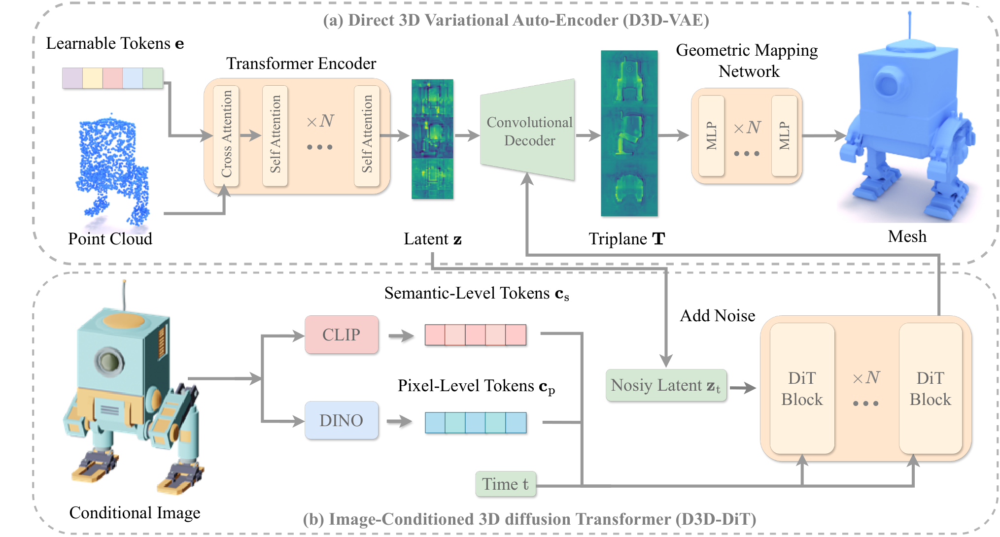

*原文图 2：论文方法流程图；详细原始图注请查看图片来源。 [查看图片来源](https://arxiv.org/html/2405.14832v2/pipeline_final.png)*

引用来源：arxiv_2512.14692

链接：[arXiv](https://arxiv.org/abs/2405.14832)

##### CLAY: A Controllable Large-scale Generative Model for Creating High-quality 3D Assets

作者：Long-Wen Zhang, Ziyu Wang, Qi-Xuan Zhang, Qi-Wei Qiu, Anqi Pang, Haoran Jiang, Wei Yang, Lan Xu, Jingyi Yu

研究角色：主体论文（统一多模态模型）
任务标签：generation

方法标签：Unstructured latent-set diffusion

架构标签：Joint native-3D asset generation

中文简介：

该论文解决可控三维资产生成任务，输入可为文本、单张图像或多视图、体素、包围盒、点云和隐式表示等三维条件，输出为完整几何及带PBR属性的外观。CLAY使用多分辨率VAE编码连续完整表面，在几何潜空间中通过DiT扩散生成，并以多视图材质扩散模型生成外观纹理。它属于单图条件完整物体高模几何生成中的通用框架，同时也是原生三维几何与外观联合生成路线；相较先生成形状再烘焙纹理的方法，CLAY在统一资产系统中覆盖几何和材质控制。

*原文图 1：论文方法流程图；详细原始图注请查看图片来源。 [查看图片来源](https://arxiv.org/html/2406.13897v1/fig/overview.png)*

引用来源：arxiv_2512.14692

链接：[arXiv](https://arxiv.org/abs/2406.13897)

##### Structured 3D Latents for Scalable and Versatile 3D Generation

作者：Jianfeng Xiang, Ze-Long Lv, Sicheng Xu, Yu Deng, Ruicheng Wang, Bowen Zhang, Dong Chen, Xin Tong, Jiao-Long Yang

研究角色：主体论文（统一多模态模型）
任务标签：generation

方法标签：Sparse structured-latent diffusion

架构标签：Joint native-3D asset generation

中文简介：

该工作从文本或图像条件生成三维资产，输出可按需解码为辐射场、三维Gaussian或网格，并支持局部编辑。核心是Structured LATent（SLat）：将稀疏三维网格与视觉基础模型提取的多视图特征结合，在统一潜空间中用rectified flow transformer生成，同时保留几何和外观信息。它代表稀疏结构化潜空间扩散范式，相比分别面向单一输出格式的模型，强调统一表示和多格式解码。

*原文图 1：论文方法流程图；详细原始图注请查看图片来源。 [查看图片来源](https://arxiv.org/html/2412.01506v3/pipeline_v3.png)*

引用来源：arxiv_2512.14692

链接：[arXiv](https://arxiv.org/abs/2412.01506)

##### 2025

##### Pandora3D: A Comprehensive Framework for High-Quality 3D Shape and Texture Generation

作者：Jiayu Yang, Taizhang Shang, Weixuan Sun, Xibin Song, Ziang Cheng, Senbo Wang, Shenzhou Chen, Weizhe Liu, Hongdong Li, Pan Ji

研究角色：主体论文（统一多模态模型）
任务标签：generation

方法标签：Unstructured latent-set diffusion

中文简介：

该工作从单张图像、多视图图像或文本生成完整三维形状及纹理，输出包括三维几何和可渲染外观。形状阶段将隐式几何编码到VAE潜空间，再用条件扩散生成；纹理阶段依次生成正面图、多视图图像，进行RGB到PBR转换及高分辨率细化，并以一致性调度器约束视图间像素一致。它属于覆盖几何与外观的综合系统，区别于只生成形状或依赖独立纹理优化的方案。

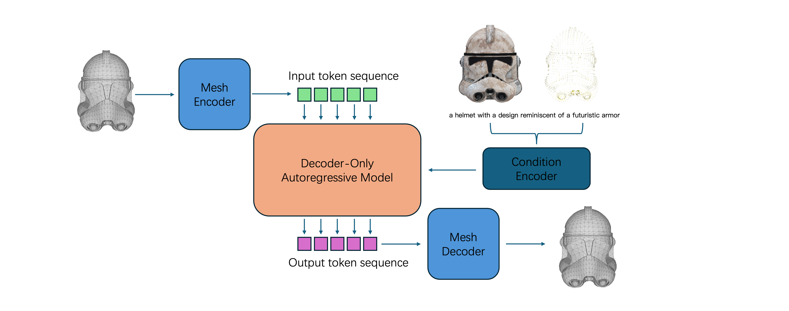

*原文图 2：论文方法流程图；详细原始图注请查看图片来源。 [查看图片来源](https://arxiv.org/html/2502.14247v2/figures/diffusion/diffusion.png)*

引用来源：arxiv_2512.14692

链接：[arXiv](https://arxiv.org/abs/2502.14247)

##### TripoSG: High-Fidelity 3D Shape Synthesis using Large-Scale Rectified Flow Models

作者：Yangguang Li, Zi-Xin Zou, Zexiang Liu, De-Hui Wang, Yuan-Zhi Liang, Zhipeng Yu, Xing-Chao Liu, Yuan-Chen Guo, Ding Liang, Wan-Li Ouyang, Yan-Pei Cao

研究角色：主体论文（统一多模态模型）
任务标签：generation

中文简介：

该工作解决由输入图像生成高保真三维网格的任务，输入主要是单张物体图像，输出是细节丰富且与图像对应的三维形状。核心采用大规模rectified flow transformer在三维形状潜空间中生成，并以结合SDF、法线和eikonal损失的VAE提升重建质量，同时构建大规模高质量训练数据。相较早期受数据规模和三维处理限制的扩散方法，它强调数据、潜表示和流模型的协同扩展。

*原文图 1：论文方法流程图；详细原始图注请查看图片来源。 [查看图片来源](https://arxiv.org/html/2502.06608v3/pipeline.png)*

引用来源：arxiv_2512.14692

链接：[arXiv](https://arxiv.org/abs/2502.06608)

##### Hi3dgen: High-Fidelity 3D Geometry Generation From Images Via Normal Bridging

作者：Chongjie Ye, Yushuang Wu, Ziteng Lu, Jia-Hao Chang, Xiaoyang Guo, Jiaqing Zhou, Hao Zhao, Xiao-Guang Han

研究角色：主体论文（统一多模态模型）
任务标签：generation

中文简介：

该工作解决从单张图像生成高保真完整三维几何的任务，输入物体RGB图像，输出包含丰富细节的三维形状。方法先通过图像到法线估计器获得中间法线表示，再利用法线正则化的潜空间扩散完成法线到几何的生成，并配套构建三维训练数据。它属于单图条件完整物体高模几何生成，区别于直接从RGB跨域预测几何的路线，以法线桥接缓解图像歧义和二维、三维域差距。

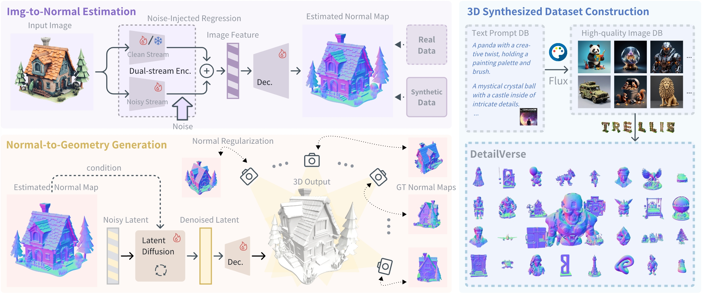

*原文图 1：论文方法流程图；详细原始图注请查看图片来源。 [查看图片来源](https://arxiv.org/html/2503.22236v2/images/method_overview.png)*

引用来源：arxiv_2512.14692

链接：[arXiv](https://arxiv.org/abs/2503.22236)

### 相邻工作

#### 相邻工作：adjacent

##### 2024

##### OctFusion: Octree‐based Diffusion Models for 3D Shape Generation

作者：Bojun Xiong, Si-Tong Wei, Xin Zheng, Yan-Pei Cao, Zhouhui Lian, Peng-Shuai Wang

研究角色：相邻工作
任务标签：adjacent

中文简介：

该论文解决三维形状生成任务，输入可以是随机噪声、文本、草图或类别标签，输出为任意分辨率且连续、流形的三维形状和网格。核心是八叉树潜表示及其变分自编码器，将隐式表示的连续性与显式空间层次结合，再在八叉树潜空间中使用统一的多尺度U-Net扩散模型，避免级联扩散。它属于稀疏结构化潜空间扩散路线，相比规则体素或多阶段生成方法，更强调分辨率灵活性、跨层共享以及可提取的连续网格。

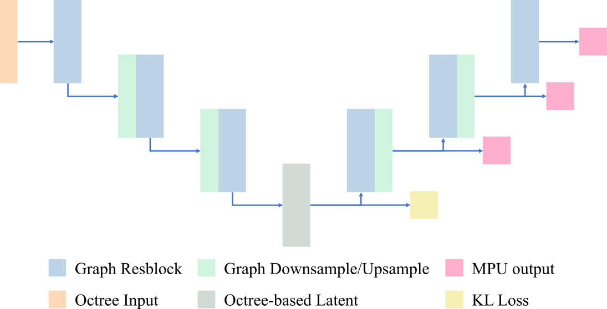

*原文图 16：论文方法流程图；详细原始图注请查看图片来源。 [查看图片来源](https://arxiv.org/html/2408.14732v2/vae.svg)*

引用来源：arxiv_2512.14692

链接：[arXiv](https://arxiv.org/abs/2408.14732)

##### 3DTopia-XL: Scaling High-quality 3D Asset Generation via Primitive Diffusion

作者：Zhaoxi Chen, Jiaxiang Tang, Yuhao Dong, Ziang Cao, Fangzhou Hong, Yushi Lan, Tengfei Wang, Haozhe Xie, Tong Wu, Shunsuke Saito, Liang Pan, Dahua Lin, Ziwei Liu

研究角色：相邻工作
任务标签：adjacent

中文简介：

该工作从文本或视觉条件生成带有几何、颜色和材质的原生三维资产，输出面向物理渲染的高质量PBR内容。核心表示PrimX以紧凑张量编码形状、反照率和材质场，并通过Primitive Patch Compression和Latent Primitive Diffusion在显式几何基元的潜空间中生成。它属于显式基元空间扩散与原生三维资产联合生成路线，相比先生成形状再合成多视图纹理的方法，在共同表示中同步建模几何和外观。

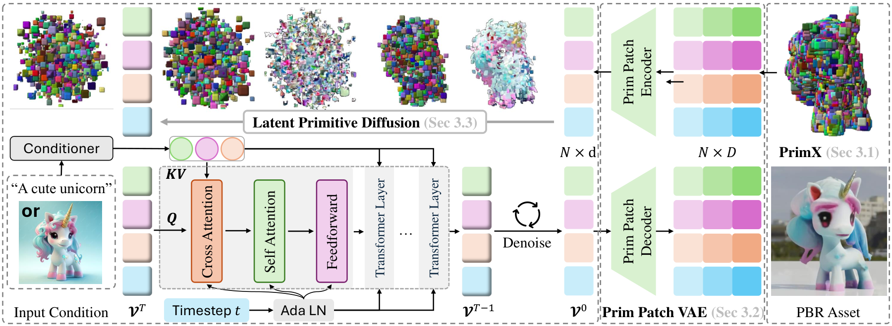

*原文图 2：论文方法流程图；详细原始图注请查看图片来源。 [查看图片来源](https://arxiv.org/html/2409.12957v2/gen_model.png)*

引用来源：arxiv_2512.14692

链接：[arXiv](https://arxiv.org/abs/2409.12957)

### 背景与上下文工作

#### 背景类别：背景与上下文（context）

##### 2002

##### Dual contouring of hermite data

作者：T. Ju, Frank Losasso, S. Schaefer, J. Warren

研究角色：背景与上下文工作
任务标签：context

中文简介：

该论文面向从带有 Hermite 数据的体素网格中提取三维等值面，输入是网格单元及其边界交点位置、法向等局部信息，输出是可用于表示物体表面的多边形网格。其核心是 Dual Contouring：在每个含有表面交点的单元内求取一个代表性顶点，再依据单元间连接关系构造曲面，从而更好保留尖锐特征。作为几何重建基础方法，它属于本综述所述生成范式之前的显式网格提取路线，而非基于扩散的三维资产生成方法。

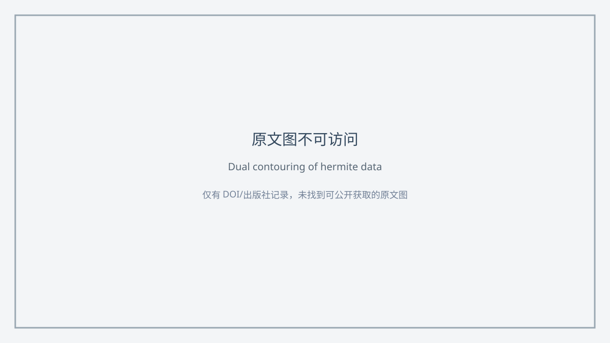

*原文图 1：论文方法流程图；详细原始图注请查看图片来源。 [查看图片来源](10.1145/566570.566586)*

引用来源：arxiv_2512.14692

##### 2017

##### Decoupled Weight Decay Regularization

作者：I. Loshchilov, F. Hutter

研究角色：背景与上下文工作
任务标签：context

中文简介：

该论文讨论神经网络参数优化中的权重衰减问题：输入是模型参数及其梯度更新过程，输出是经过正则化的参数。核心方法将权重衰减从梯度更新中的 L2 正则项解耦，使其直接作用于参数缩减，而不再受自适应优化器内部梯度缩放的影响。它属于优化器基础方法，常可作为 Transformer 或三维生成模型的训练组件，与几何表示和生成空间本身无关。

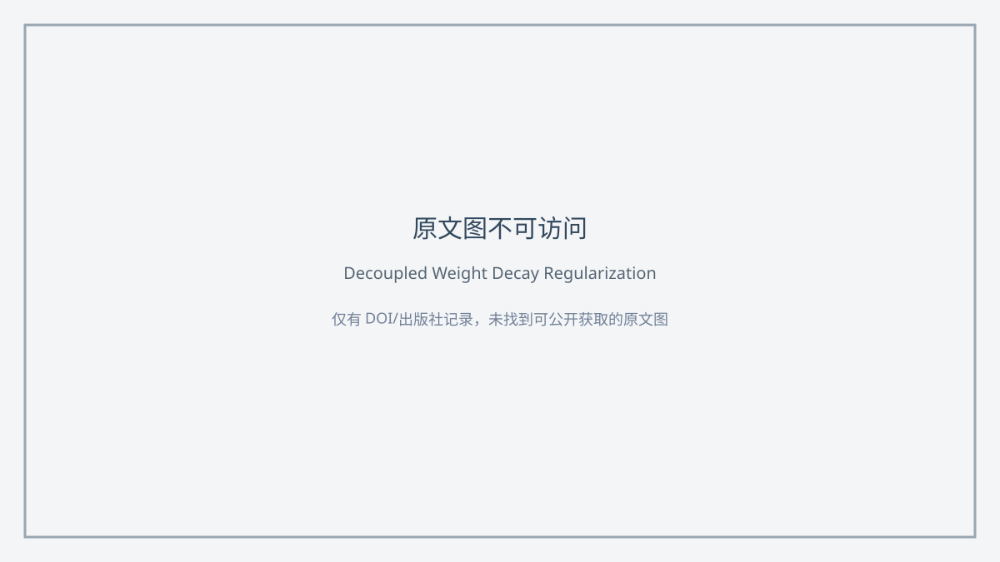

*原文图 1：论文方法流程图；详细原始图注请查看图片来源。 [查看图片来源](未找到公开原文图)*

引用来源：arxiv_2512.14692

##### 2018

##### Occupancy Networks: Learning 3D Reconstruction in Function Space

作者：L. Mescheder, Michael Oechsle, Michael Niemeyer, Sebastian Nowozin, Andreas Geiger

研究角色：背景与上下文工作
任务标签：context

中文简介：

该论文解决从单张图像、噪声点云或粗体素重建三维表面的任务，输入为多种形式的观测，输出为连续的三维占据场及其等值面。Occupancy Networks 用神经网络分类空间点是否位于物体内部，以连续决策边界隐式表示任意拓扑的高分辨率表面。它是隐式场空间路线的早期代表，突破体素分辨率和内存限制，但不属于扩散模型。

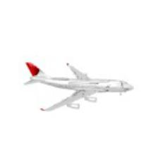

*原文图 8：论文方法流程图；详细原始图注请查看图片来源。 [查看图片来源](https://arxiv.org/html/1812.03828v2/img/qualitative/00_in.jpg)*

引用来源：arxiv_2512.14692

链接：[arXiv](https://arxiv.org/abs/1812.03828)

##### Blender — a 3D modelling and rendering package

研究角色：背景与上下文工作
任务标签：context

中文简介：

Blender用于三维内容创作，输入可以是人工建模操作、场景数据或脚本，输出则是三维模型、材质、动画、渲染图像及其他数字资产。其核心是集成建模、雕刻、材质、动画、渲染和编辑等工具的通用软件工作流，而不是学习式生成模型。相较于本文关注的单图条件三维生成方法，Blender代表传统人工创作与后处理平台，常被用于资产制作、修整和评估。

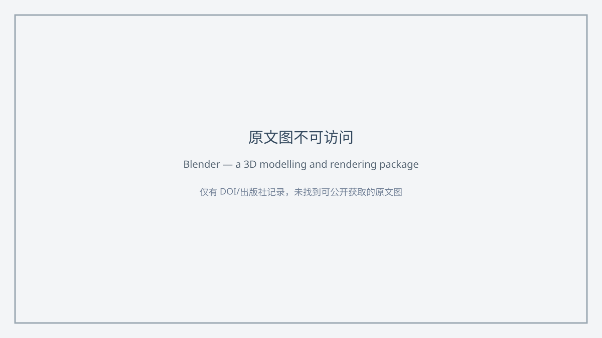

*原文图 1：论文方法流程图；详细原始图注请查看图片来源。 [查看图片来源](未找到公开原文图)*

引用来源：arxiv_2512.14692

##### 2019

##### DeepSDF: Learning Continuous Signed Distance Functions for Shape Representation

作者：J. Park, Peter R. Florence, Julian Straub, Richard A. Newcombe, S. Lovegrove

研究角色：背景与上下文工作
任务标签：context

中文简介：

该论文解决三维形状表示、补全与插值任务：输入可以是完整、部分或带噪的三维数据，输出是描述形状表面的连续 SDF。DeepSDF 用神经网络表示连续隐式距离场，以零等值面定义表面，并通过潜变量表达同一类别中的不同形状。它是隐式场表示的奠基性工作，为后续在 SDF 空间进行生成或扩散提供了连续几何载体，但自身并未采用扩散生成。

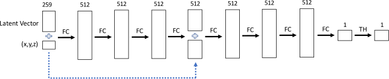

*原文图 50：论文方法流程图；详细原始图注请查看图片来源。 [查看图片来源](https://arxiv.org/html/1901.05103v1/architec.svg)*

引用来源：arxiv_2512.14692

链接：[arXiv](https://arxiv.org/abs/1901.05103)

##### Root Mean Square Layer Normalization

作者：Biao Zhang, Rico Sennrich

研究角色：背景与上下文工作
任务标签：context

中文简介：

该论文不直接处理三维生成，而是改进神经网络中的归一化操作：输入为神经元汇总后的特征，输出为重新缩放的特征表示。核心方法 RMSNorm 只根据均方根进行归一化，去除 LayerNorm 的重中心化步骤，并进一步提出用部分特征估计均方根的 pRMSNorm。它属于 Transformer 等模型的基础训练组件，相比 LayerNorm 更简洁高效，而非本领域的几何生成方法。

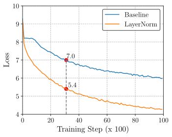

*原文图 1：论文方法流程图；详细原始图注请查看图片来源。 [查看图片来源](https://arxiv.org/html/1910.07467v1/ln_loss_step.svg)*

引用来源：arxiv_2512.14692

链接：[arXiv](https://arxiv.org/abs/1910.07467)

##### SUBMANIFOLD SPARSE CONVOLUTIONAL NETWORKS

作者：Dmitry Retinskiy

研究角色：背景与上下文工作
任务标签：context

中文简介：

该论文解决由CT图像重建的三维肾脏模型及肾脏肿瘤的分割任务，输入是三维医学影像或重建体数据，输出是标注器官与肿瘤区域的分割结果。核心方法是子流形稀疏卷积网络，在稀疏三维数据上进行卷积，同时保持非空体素的空间结构。它属于三维分析与分割领域，而非从图像生成完整物体几何的生成模型，因此不归入本综述的扩散生成类别。

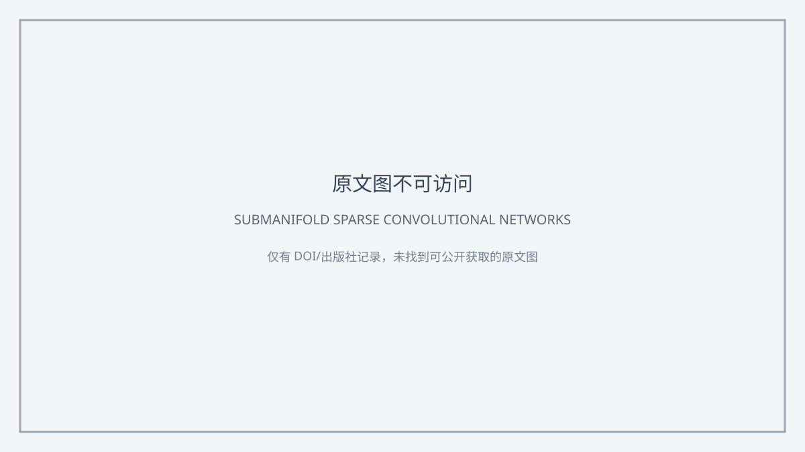

*原文图 1：论文方法流程图；详细原始图注请查看图片来源。 [查看图片来源](10.24926/548719.085)*

引用来源：arxiv_2512.14692

##### Triton: an intermediate language and compiler for tiled neural network computations

作者：Philippe Tillet, Hsiang-Tsung Kung, David D. Cox

研究角色：背景与上下文工作
任务标签：context

中文简介：

该论文解决深度学习自定义计算算子的编程与编译任务：输入是以分块张量操作描述的矩阵乘法、卷积等程序，输出是可移植且高效的 GPU 代码。Triton 以 tile 为核心抽象，结合 C 风格语言、LLVM 中间表示和面向 tile 的优化，将研究者编写的算子编译为硬件执行程序。它属于三维生成系统的底层工程基础设施，区别于直接提出几何表示或生成模型的方法。

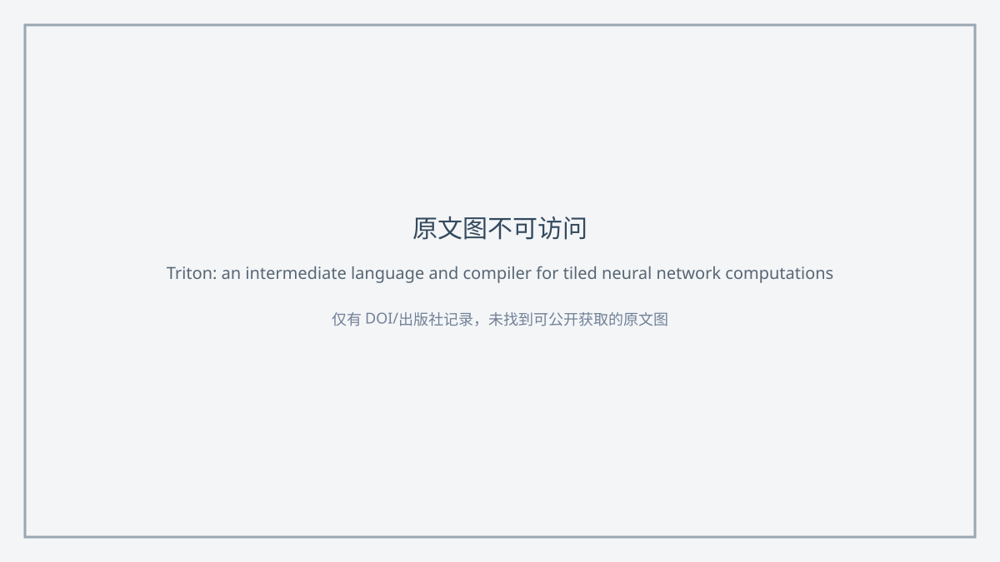

*原文图 1：论文方法流程图；详细原始图注请查看图片来源。 [查看图片来源](10.1145/3315508.3329973)*

引用来源：arxiv_2512.14692

##### 2020

##### PolyGen: An Autoregressive Generative Model of 3D Meshes

作者：Charlie Nash, Yaroslav Ganin, S. M. Ali Eslami, P. Battaglia

研究角色：背景与上下文工作
任务标签：context

中文简介：

该论文解决三维网格生成与重建任务：输入可为物体类别、体素或图像，输出为由顶点和面组成的完整网格。方法采用基于 Transformer 的自回归范式，按序预测网格顶点与面，并以概率建模表达输入歧义。它绕开了以体素、点云等替代表示为主的路线，直接对原生网格建模，是早期直接生成高质量三维网格的代表工作。

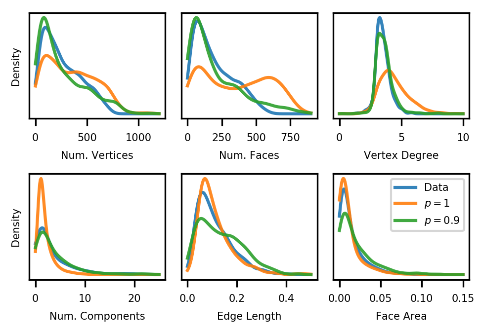

*原文图 12：论文方法流程图；详细原始图注请查看图片来源。 [查看图片来源](https://arxiv.org/html/2002.10880v1/graphics/hist.png)*

引用来源：arxiv_2512.14692

链接：[arXiv](https://arxiv.org/abs/2002.10880)

##### 3D-FUTURE: 3D Furniture Shape with TextURE

作者：Huan Fu, Rongfei Jia, Lin Gao, Mingming Gong, Binqiang Zhao, S. Maybank, D. Tao

研究角色：背景与上下文工作
任务标签：context

中文简介：

3D-FUTURE解决高质量家具三维建模研究中的数据不足问题，输入包括带纹理的家具 CAD 模型及室内场景图像，输出是带高分辨率纹理和属性标注的三维家具数据资源及相关基线结果。其核心贡献是构建大规模、细节丰富并与场景图像配对的家具数据集，支持单图重建、检索、纹理恢复和组合等任务。它属于数据集与基准建设，不是生成模型，但为单图条件三维几何和外观生成提供了重要训练与评测基础。

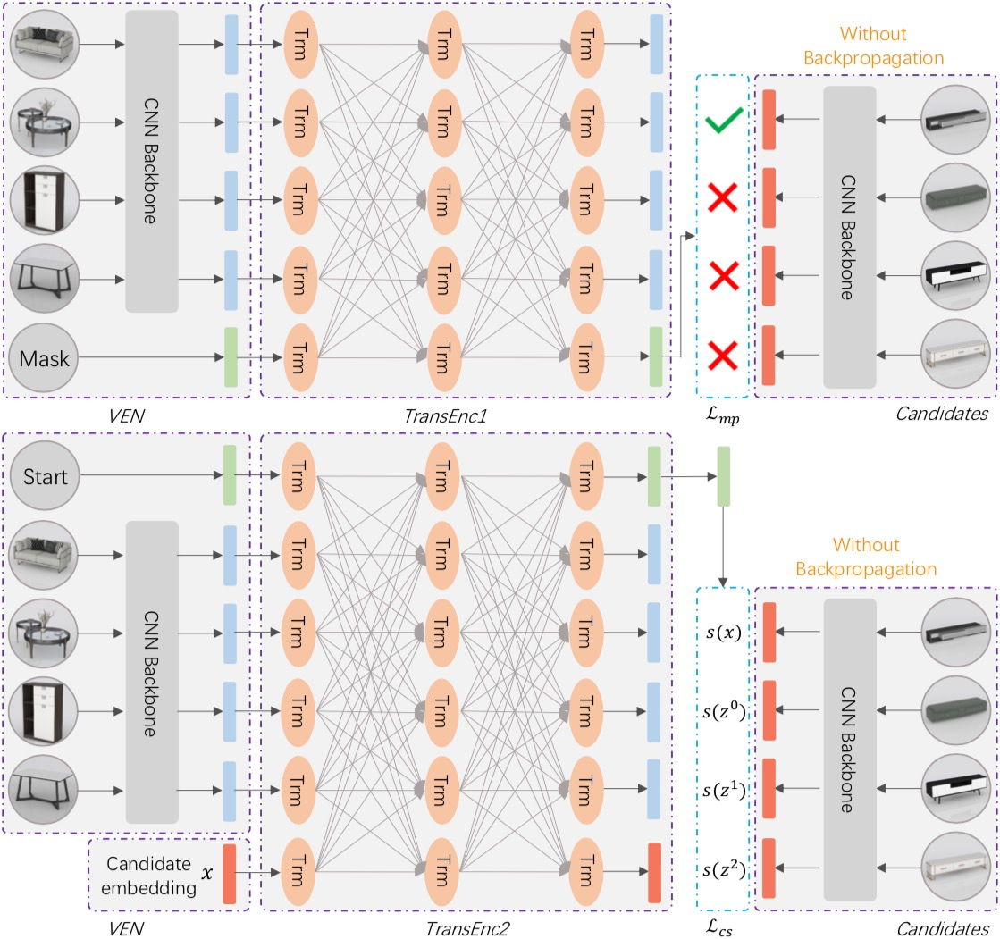

*原文图 2：论文方法流程图；详细原始图注请查看图片来源。 [查看图片来源](https://arxiv.org/html/2009.09633v1/DFOM.png)*

引用来源：arxiv_2512.14692

链接：[arXiv](https://arxiv.org/abs/2009.09633)

##### Deformed Implicit Field: Modeling 3D Shapes with Learned Dense Correspondence

作者：Yu Deng, Jiaolong Yang, Xin Tong

研究角色：背景与上下文工作
任务标签：context

中文简介：

Deformed Implicit Field（DIF）面向类别内三维形状建模与稠密对应，输入是物体形状或其观测，输出是隐式几何表示、形状实例及跨实例对应关系。方法以类别共享的模板隐式场为基础，为每个实例学习三维变形场和校正场，并由 DIFNet 联合学习形状潜空间。它属于隐式场表示与确定性生成路线，突出可解释的形变对应和编辑能力；与后续隐式场扩散不同，其核心并非在隐式场上执行扩散采样。

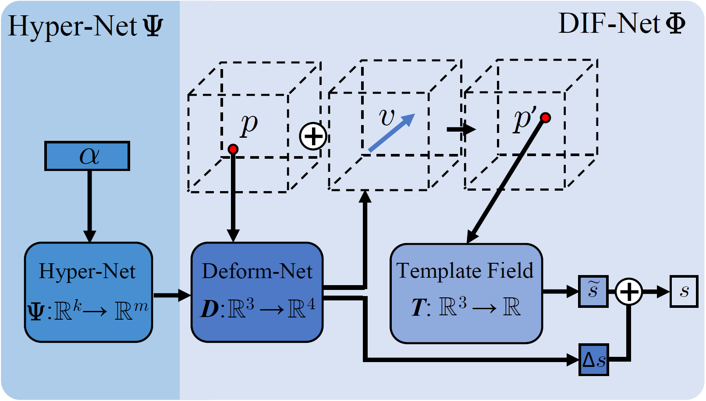

*原文图 1：论文方法流程图；详细原始图注请查看图片来源。 [查看图片来源](https://arxiv.org/html/2011.13650v3/images/framework.png)*

引用来源：arxiv_2512.14692

链接：[arXiv](https://arxiv.org/abs/2011.13650)

##### 2021

##### Using Shape to Categorize: Low-Shot Learning with an Explicit Shape Bias

作者：S. Stojanov, Anh Thai, James M. Rehg

研究角色：背景与上下文工作
任务标签：context

中文简介：

该方法解决低样本图像分类中的形状偏置与泛化问题，输入是物体图像，输出是类别预测；训练还利用三维物体形状构造判别式嵌入，并学习图像到该空间的映射。其核心是显式引入三维形状信息，增强图像表征对物体结构的关注，同时发布 Toys4K 数据集。它属于形状辅助识别和低样本学习路线，不生成三维几何，也不属于本综述的扩散生成类别。

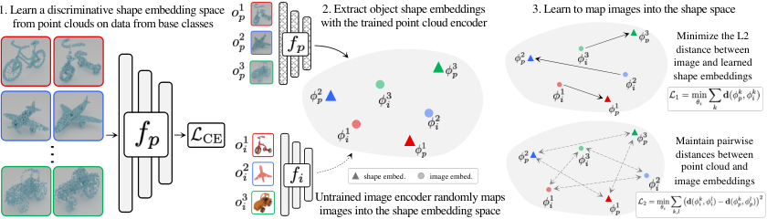

*原文图 1：论文方法流程图；详细原始图注请查看图片来源。 [查看图片来源](https://arxiv.org/html/2101.07296v2/approach_overview.png)*

引用来源：arxiv_2512.14692

链接：[arXiv](https://arxiv.org/abs/2101.07296)

##### Diffusion Probabilistic Models for 3D Point Cloud Generation

作者：Shitong Luo, Wei Hu

研究角色：背景与上下文工作
任务标签：context

中文简介：

该方法解决三维点云生成及其相关的补全、上采样和数据增强任务，输入为噪声以及可选的形状潜变量，输出为目标分布中的点云。核心是把点视为热力学系统中的粒子，学习从噪声逐步恢复点云的反向扩散马尔可夫链，并以变分目标进行训练。它属于显式几何基元空间扩散的早期工作，直接在点云空间生成结果，区别于随后在隐式场或结构化潜空间中扩散的方法。

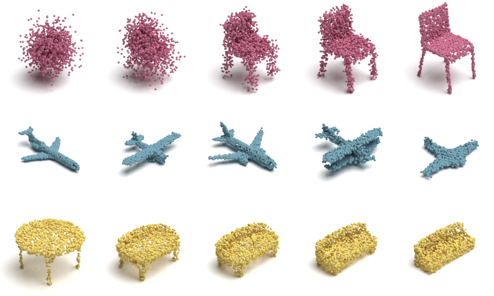

*原文图 1：论文方法流程图；详细原始图注请查看图片来源。 [查看图片来源](https://arxiv.org/html/2103.01458v2/figures/teaser.png)*

引用来源：arxiv_2512.14692

链接：[arXiv](https://arxiv.org/abs/2103.01458)

##### Learning Transferable Visual Models From Natural Language Supervision

作者：Alec Radford, Jong Wook Kim, Chris Hallacy, A. Ramesh, Gabriel Goh, S. Agarwal, G. Sastry, Amanda Askell, Pamela Mishkin, Jack Clark, Gretchen Krueger, I. Sutskever

研究角色：背景与上下文工作
任务标签：context

中文简介：

CLIP解决图像与自然语言概念对齐及开放词汇视觉识别任务，输入是图像和文本描述，输出是共享语义空间中的匹配关系或零样本预测。其核心是在大规模图文对上进行对比式预训练，使文本能够检索和指代视觉概念。它属于通用视觉—语言表征路线，而非三维几何生成；在相关系统中可作为图像条件或语义条件编码器，但摘要未涉及三维资产生成。

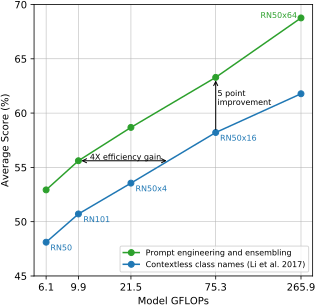

*原文图 4：论文方法流程图；详细原始图注请查看图片来源。 [查看图片来源](https://arxiv.org/html/2103.00020v1/prompt-engineering.svg)*

引用来源：arxiv_2512.14692

链接：[arXiv](https://arxiv.org/abs/2103.00020)

##### 3D Shape Generation and Completion through Point-Voxel Diffusion

作者：Linqi Zhou, Yilun Du, Jiajun Wu

研究角色：背景与上下文工作
任务标签：context

中文简介：

Point-Voxel Diffusion（PVD）解决三维形状生成与补全任务：输入可以是随机噪声或部分点云，输出是完整、高保真的三维形状，并支持同一输入产生多种补全结果。方法将点云与体素结合为混合表示，在该表示上学习扩散过程的反向去噪。它是较早把扩散生成引入三维形状建模的路线之一，相比确定性潜向量解码器，更强调概率建模和条件多模态补全。

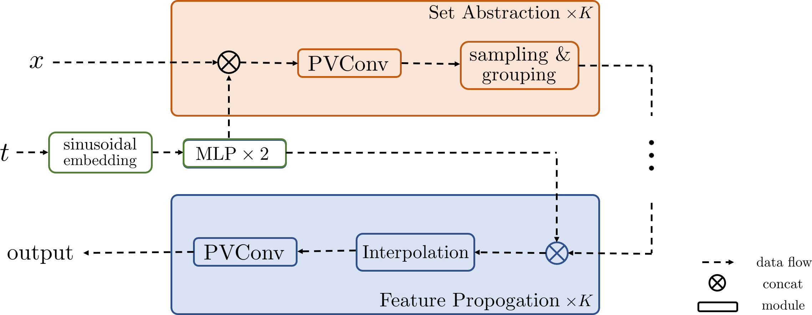

*原文图 90：论文方法流程图；详细原始图注请查看图片来源。 [查看图片来源](https://arxiv.org/html/2104.03670v3/figures/architecture/architecture2.png)*

引用来源：arxiv_2512.14692

链接：[arXiv](https://arxiv.org/abs/2104.03670)

##### RoFormer: Enhanced Transformer with Rotary Position Embedding

作者：Jian-Lin Su, Murtadha H. M. Ahmed, Yu Lu, Shengfeng Pan, Wen Bo, Yunfeng Liu

研究角色：背景与上下文工作
任务标签：context

中文简介：

RoFormer面向序列建模中的位置信息表达，输入是带顺序的序列，输出为经过位置增强的 Transformer 表征或预测结果。其核心方法是 Rotary Position Embedding（RoPE），用旋转矩阵编码绝对位置，并在自注意力中自然引入相对位置关系，同时保持对序列长度和距离衰减的适应性。它属于 Transformer 位置编码路线，而非三维生成方法，为后续处理空间结构序列提供通用位置建模基础。

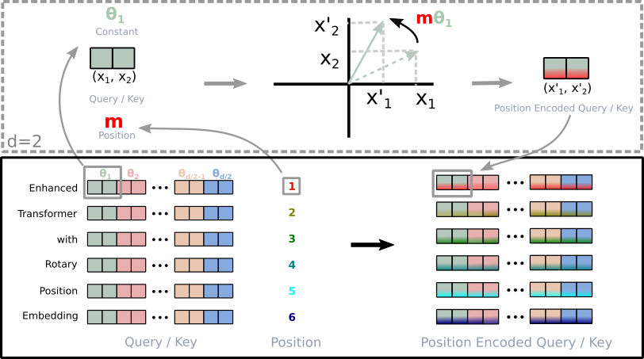

*原文图 1：论文方法流程图；详细原始图注请查看图片来源。 [查看图片来源](https://arxiv.org/html/2104.09864v5/roformer_RoPE_v2.svg)*

引用来源：arxiv_2512.14692

链接：[arXiv](https://arxiv.org/abs/2104.09864)

##### Perceiver IO: A General Architecture for Structured Inputs & Outputs

作者：Andrew Jaegle, Sebastian Borgeaud, Jean-Baptiste Alayrac, Carl Doersch, Catalin Ionescu, David Ding, Skanda Koppula, Daniel Zoran, Andrew Brock, Evan Shelhamer, Olivier J. H'enaff, M. Botvinick, Andrew Zisserman, O. Vinyals, João Carreira

研究角色：背景与上下文工作
任务标签：context

中文简介：

Perceiver IO解决从任意结构化输入到任意规模、语义输出的通用建模任务，输入可为文本、图像或多模态数据，输出则由查询指定。其核心是以潜变量瓶颈处理输入，并用可学习查询生成不同长度和含义的结果，从而使计算量随输入、输出规模线性增长。它属于通用架构基础，为后续无序潜变量集合扩散提供了重要范式，但本身不执行三维几何生成。

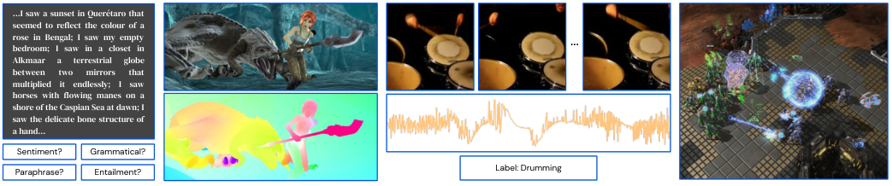

*原文图 1：论文方法流程图；详细原始图注请查看图片来源。 [查看图片来源](https://arxiv.org/html/2107.14795v3/domain_overview.png)*

引用来源：arxiv_2512.14692

链接：[arXiv](https://arxiv.org/abs/2107.14795)

##### ABO: Dataset and Benchmarks for Real-World 3D Object Understanding

作者：Jasmine Collins, Shubham Goel, Kenan Deng, Achleshwar Luthra, Leon L. Xu, Erhan Gundogdu, Xi Zhang, Tomas F. Yago Vicente, T. Dideriksen, Himanshu Arora, M. Guillaumin, J. Malik

研究角色：背景与上下文工作
任务标签：context

中文简介：

该论文不是生成模型，而是面向真实世界物体理解的数据集与评测基准。输入包括商品目录图像、元数据及相关三维模型，输出则体现为单视图三维重建、材质估计和跨域多视图检索等任务的评测结果。数据同时提供复杂几何和基于物理的材质，为图像到三维研究建立更贴近真实商品场景的测试条件。它在本领域中属于数据与基准基础设施，区别于直接提出几何生成、隐式场扩散或三维资产联合生成的方法。

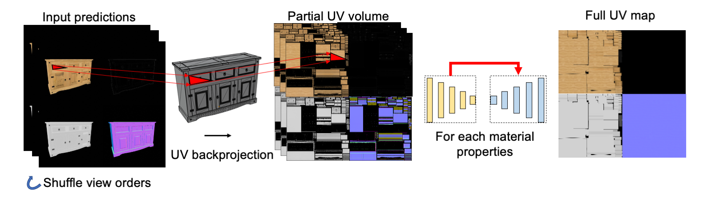

*原文图 9：论文方法流程图；详细原始图注请查看图片来源。 [查看图片来源](https://arxiv.org/html/2110.06199v2/figures/suppmat-material/uv.png)*

引用来源：arxiv_2512.14692

链接：[arXiv](https://arxiv.org/abs/2110.06199)

##### Extracting Triangular 3D Models, Materials, and Lighting From Images

作者：Jacob Munkberg, Wenzheng Chen, J. Hasselgren, Alex Evans, Tianchang Shen, Thomas Müller, Jun Gao, S. Fidler

研究角色：背景与上下文工作
任务标签：context

中文简介：

该论文从多视图图像中联合恢复物体的三角网格、空间变化材质和环境光照，输入为多视图观测，输出为可在传统图形引擎中直接渲染的完整三维资产。核心结合可微渲染、坐标网络表示体积纹理、可微四面体行进和可微环境光照模型，直接对表面网格及外观进行梯度优化。它属于原生三维资产重建与外观联合建模路线，而非扩散生成；相较先恢复形状再贴图的流程，更强调几何、材质和光照的共同优化。

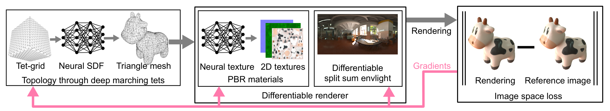

*原文图 2：论文方法流程图；详细原始图注请查看图片来源。 [查看图片来源](https://arxiv.org/html/2111.12503v5/system_v2.png)*

引用来源：arxiv_2512.14692

链接：[arXiv](https://arxiv.org/abs/2111.12503)

##### High-Resolution Image Synthesis with Latent Diffusion Models

作者：Robin Rombach, A. Blattmann, Dominik Lorenz, Patrick Esser, Björn Ommer

研究角色：背景与上下文工作
任务标签：context

中文简介：

该论文面向图像生成与条件图像合成，输入可以是噪声及类别、文本或边界框等条件，输出为高分辨率图像。核心先用预训练自编码器把图像压缩到保留视觉细节的潜空间，再在潜表示上执行扩散去噪，并通过交叉注意力接入通用条件。它奠定了潜空间扩散的通用范式，为三维领域在压缩表示中进行扩散提供了重要背景，但自身不生成三维几何，也不属于本综述的三维几何类别。

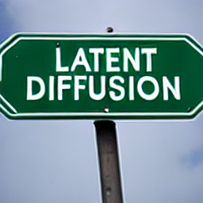

*原文图 5：论文方法流程图；详细原始图注请查看图片来源。 [查看图片来源](https://arxiv.org/html/2112.10752v2/img/cr/text2img/sign/sample-43.jpg)*

引用来源：arxiv_2512.14692

链接：[arXiv](https://arxiv.org/abs/2112.10752)

##### 2022

##### A ConvNet for the 2020s

作者：Zhuang Liu, Hanzi Mao, Chaozheng Wu, Christoph Feichtenhofer, Trevor Darrell, Saining Xie

研究角色：背景与上下文工作
任务标签：context

中文简介：

该论文解决通用视觉识别任务中的图像表征问题，输入为图像，输出可用于分类、检测或语义分割的视觉特征和预测结果。作者从标准ResNet出发，逐步引入现代化设计，包括大卷积核、分层结构和训练策略，形成完全由卷积模块构成的ConvNeXt。它并非三维生成或扩散方法，而是视觉骨干网络研究，意义在于说明经过设计的纯卷积模型仍可与Transformer竞争，为三维生成系统的图像编码器选择提供背景。

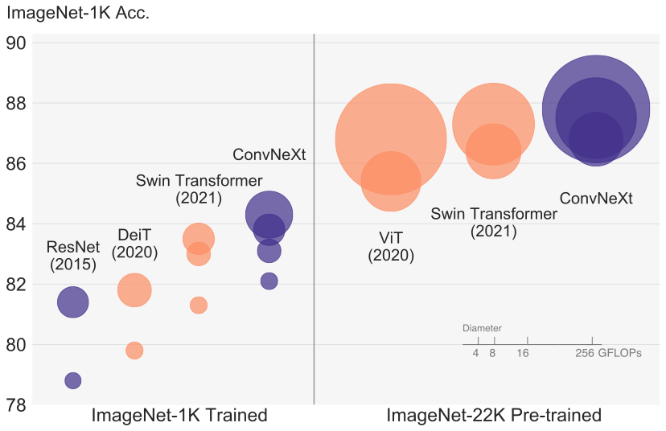

*原文图 1：论文方法流程图；详细原始图注请查看图片来源。 [查看图片来源](https://arxiv.org/html/2201.03545v2/teaser.svg)*

引用来源：arxiv_2512.14692

链接：[arXiv](https://arxiv.org/abs/2201.03545)

##### Neural dual contouring

作者：Zhiqin Chen, Andrea Tagliasacchi, T. Funkhouser, Hao Zhang

研究角色：背景与上下文工作
任务标签：context

中文简介：

该论文研究从两种经验分布之间进行生成或数据迁移的任务，输入为源分布样本和目标分布样本，输出为连接两者的连续时间传输流。Rectified Flow通过回归连接样本对的直线路径来学习常微分方程，随后可递归校正，使推理时使用较粗的时间离散也能近似直线运输。它与扩散模型同属连续生成背景，但不限定于随机扩散路径，突出路径拉直、快速模拟和统一生成与域迁移的能力。

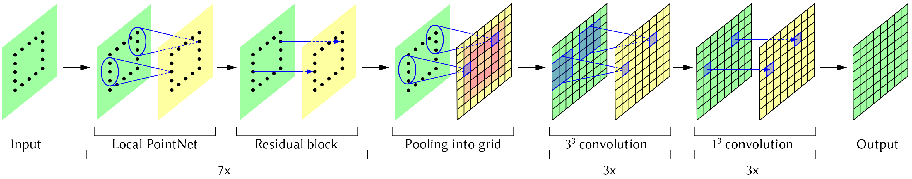

*原文图 5：论文方法流程图；详细原始图注请查看图片来源。 [查看图片来源](https://arxiv.org/html/2202.01999v3/figs_supp/network_img.png)*

引用来源：arxiv_2512.14692

链接：[arXiv](https://arxiv.org/abs/2202.01999)

##### Flow Straight and Fast: Learning to Generate and Transfer Data with Rectified Flow

作者：Xing-Chao Liu, Chengyue Gong, Qiang Liu

研究角色：背景与上下文工作
任务标签：context

中文简介：

该论文研究从一个数据分布生成另一个数据分布的任务：输入来自源分布的样本和目标分布样本，输出连接两者的生成结果，可用于生成建模与域迁移。核心方法是 Rectified Flow，用神经常微分方程学习从源到目标的连续输运路径，并通过回归使路径尽量接近样本对之间的直线。作为扩散模型的重要前置路线，它不依赖逐步加噪—去噪，而以连续流和路径校正实现生成；反复校正还能获得更易粗步数求解的流。

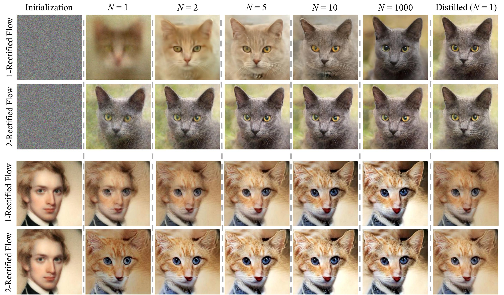

*原文图 1：论文方法流程图；详细原始图注请查看图片来源。 [查看图片来源](https://arxiv.org/html/2209.03003v1/arxiv_figures/cat_triangle_new_2_cy.pptx.jpeg)*

引用来源：arxiv_2512.14692

链接：[arXiv](https://arxiv.org/abs/2209.03003)

##### Neural Wavelet-domain Diffusion for 3D Shape Generation

作者：Ka-Hei Hui, Ruihui Li, Jingyu Hu, Chi-Wing Fu

研究角色：背景与上下文工作
任务标签：context

中文简介：

该论文解决三维形状生成任务，输入为随机噪声，输出为具有复杂结构和细节的隐式三维形状。方法将截断有符号距离场表示转换到多尺度小波域，以粗系数体和细节系数体共同描述几何；扩散网络先生成粗结构，细节预测器再补全高频信息。它属于隐式场空间扩散路线，相比直接在体素或单一隐式表示上生成，更强调多尺度分解对复杂拓扑、表面质量和精细结构的支持。

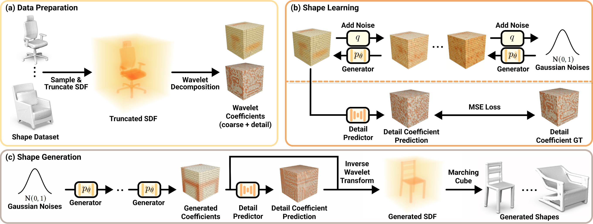

*原文图 2：论文方法流程图；详细原始图注请查看图片来源。 [查看图片来源](https://arxiv.org/html/2209.08725v1/images/overview_new.png)*

引用来源：arxiv_2512.14692

链接：[arXiv](https://arxiv.org/abs/2209.08725)

##### Flow Matching for Generative Modeling

作者：Y. Lipman, Ricky T. Q. Chen, Heli Ben-Hamu, Maximilian Nickel, Matt Le

研究角色：背景与上下文工作
任务标签：context

中文简介：

该论文不直接处理三维物体，而是研究从噪声分布生成数据样本的通用生成任务，输出连续时间的概率流或常微分方程模型。核心是Flow Matching：在预设条件概率路径上回归向量场，无需实际模拟轨迹即可训练连续归一化流，并可覆盖扩散路径或最优传输路径。它为后续三维扩散和流式生成提供了统一的连续生成视角，区别于仅依赖随机逐步去噪的传统扩散训练。

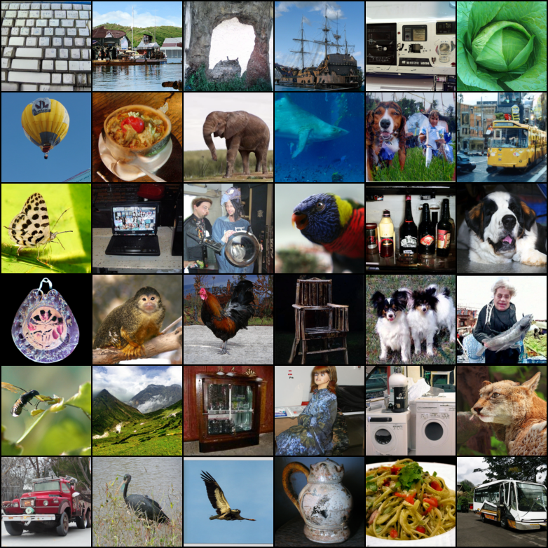

*原文图 1：论文方法流程图；详细原始图注请查看图片来源。 [查看图片来源](https://arxiv.org/html/2210.02747v2/figures/imagenet128/imagenet128_curated_.png)*

引用来源：arxiv_2512.14692

链接：[arXiv](https://arxiv.org/abs/2210.02747)

##### LION: Latent Point Diffusion Models for 3D Shape Generation

作者：Xiaohui Zeng, Arash Vahdat, Francis Williams, Zan Gojcic, O. Litany, S. Fidler, Karsten Kreis

研究角色：背景与上下文工作
任务标签：context

中文简介：

LION解决高质量、可操控的三维形状生成：输入噪声及文本、图像、体素或其他条件，输出点云，并可进一步重建平滑网格。方法构建含全局形状潜变量和点结构潜变量的层次化VAE，再分别在两类潜空间训练扩散模型。相较直接在点云上扩散，它以层次潜表示降低建模难度，同时保留点结构，因而属于稀疏结构化潜空间扩散路线，并支持插值、去噪和条件生成。

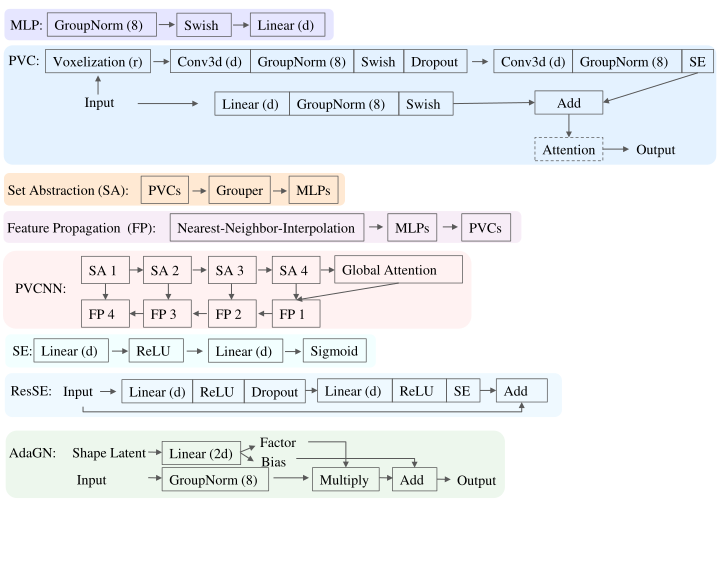

*原文图 120：论文方法流程图；详细原始图注请查看图片来源。 [查看图片来源](https://arxiv.org/html/2210.06978v1/architecture.svg)*

引用来源：arxiv_2512.14692

链接：[arXiv](https://arxiv.org/abs/2210.06978)

##### DiffRF: Rendering-Guided 3D Radiance Field Diffusion

作者：N. Muller, Yawar Siddiqui, L. Porzi, S. R. Bulò, P. Kontschieder, M. Nießner

研究角色：背景与上下文工作
任务标签：context

中文简介：

DiffRF面向三维辐射场生成与单视图合成：输入噪声及条件图像、掩码等，输出体素网格形式的三维辐射场，可用于自由视角渲染和形状恢复。方法在显式体素辐射场上直接执行三维扩散，并加入渲染损失，使模型偏向具有良好图像质量的场而非复制拟合伪影。它区别于作用于图像、潜变量或点云的路线，属于显式体素场扩散，并联合考虑多视图一致性。

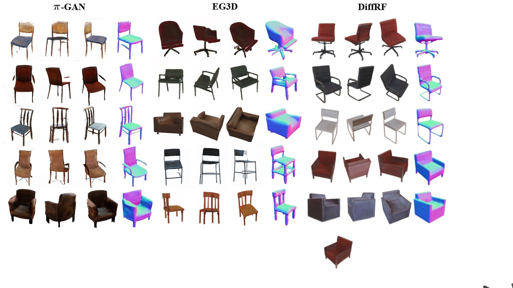

*原文图 2：论文方法流程图；详细原始图注请查看图片来源。 [查看图片来源](https://arxiv.org/html/2212.01206v2/assets/photoshape_comp.jpg)*

引用来源：arxiv_2512.14692

链接：[arXiv](https://arxiv.org/abs/2212.01206)

##### Objaverse: A Universe of Annotated 3D Objects

作者：Matt Deitke, Dustin Schwenk, J. Salvador, Luca Weihs, Oscar Michel, Eli VanderBilt, Ludwig Schmidt, Kiana Ehsanit, Aniruddha Kembhavi, Ali Farhadi

研究角色：背景与上下文工作
任务标签：context

中文简介：

Objaverse不是生成模型，而是面向三维研究的数据资源：输入来自多来源的三维对象及其描述信息，输出带有文本描述、标签和动画等标注的大规模对象集合。其核心贡献是构建覆盖大量类别和视觉形态的三维数据集，并展示其在生成模型训练、长尾分割、具身导航和视觉鲁棒性评测中的用途。在本领域中，它属于支撑数据基础设施，区别于直接设计三维表示或扩散生成过程的方法。

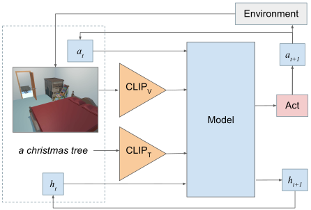

*原文图 14：论文方法流程图；详细原始图注请查看图片来源。 [查看图片来源](https://arxiv.org/html/2212.08051v1/openvocab_model_with_actions.svg)*

引用来源：arxiv_2512.14692

链接：[arXiv](https://arxiv.org/abs/2212.08051)

##### Point-E: A System for Generating 3D Point Clouds from Complex Prompts

作者：Alex Nichol, Heewoo Jun, Prafulla Dhariwal, Pamela Mishkin, Mark Chen

研究角色：背景与上下文工作
任务标签：context

中文简介：

Point-E解决复杂条件下的三维物体生成：输入文本提示，先输出一张合成视图，再输出与该视图对应的三维点云。方法采用串联的两阶段扩散，第一阶段为文本到图像，第二阶段以生成图像为条件进行点云扩散。相较当时需要较长时间优化或多视图处理的三维生成路线，它以显式点云为目标，牺牲部分样本质量换取更快的单GPU生成。

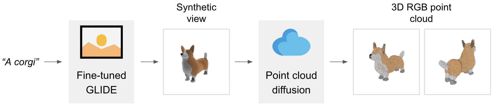

*原文图 1：论文方法流程图；详细原始图注请查看图片来源。 [查看图片来源](https://arxiv.org/html/2212.08751v1/figures/hero.jpg)*

引用来源：arxiv_2512.14692

链接：[arXiv](https://arxiv.org/abs/2212.08751)

##### Scalable Diffusion Models with Transformers

作者：William S. Peebles, Saining Xie

研究角色：背景与上下文工作
任务标签：context

中文简介：

DiT研究图像扩散任务：输入带噪图像潜变量及类别条件，输出去噪后的图像潜表示，进而生成图像。核心是以Transformer替换扩散模型常用的U-Net，并直接处理潜空间图像块，通过增加深度、宽度或token数量研究计算规模与生成质量的关系。该工作本身不是三维生成方法，但为后续在三维潜表示上采用Transformer扩散提供了通用架构基础。

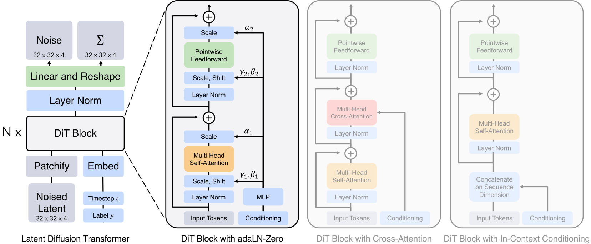

*原文图 2：论文方法流程图；详细原始图注请查看图片来源。 [查看图片来源](https://arxiv.org/html/2212.09748v2/block.svg)*

引用来源：arxiv_2512.14692

链接：[arXiv](https://arxiv.org/abs/2212.09748)

##### 2023

##### 3DShape2VecSet: A 3D Shape Representation for Neural Fields and Generative Diffusion Models

作者：Biao Zhang, Jiapeng Tang, M. Nießner, Peter Wonka

研究角色：背景与上下文工作
任务标签：context

中文简介：

3DShape2VecSet支持多种三维形状任务：输入表面模型、点云以及文本、类别、图像或部分点云条件，输出神经场或完整三维形状。方法将形状编码为无规则网格顺序的潜向量集合，并结合径向基函数及交叉、自注意力构建可供Transformer处理的表示，再在集合空间中进行扩散生成。它区别于全局向量和规则或不规则网格潜变量，代表无序潜变量集合扩散路线。

*原文图 2：论文方法流程图；详细原始图注请查看图片来源。 [查看图片来源](https://arxiv.org/html/2301.11445v3/images/pipeline/pipeline-input.png)*

引用来源：arxiv_2512.14692

链接：[arXiv](https://arxiv.org/abs/2301.11445)

##### 3DGen: Triplane Latent Diffusion for Textured Mesh Generation

作者：Anchit Gupta, Anchit Gupta

研究角色：背景与上下文工作
任务标签：context

中文简介：

3DGen解决条件或无条件的三维纹理网格生成：输入文本、图像或无条件噪声，输出带纹理或无纹理的高质量网格。其采用两阶段范式，先以triplane VAE编码纹理网格，再在三平面特征潜空间中进行条件扩散生成。相较直接处理点云、神经隐式表面或单一显式表示的方法，它将扩散放在规则三平面潜表示上，面向多类别网格资产生成。

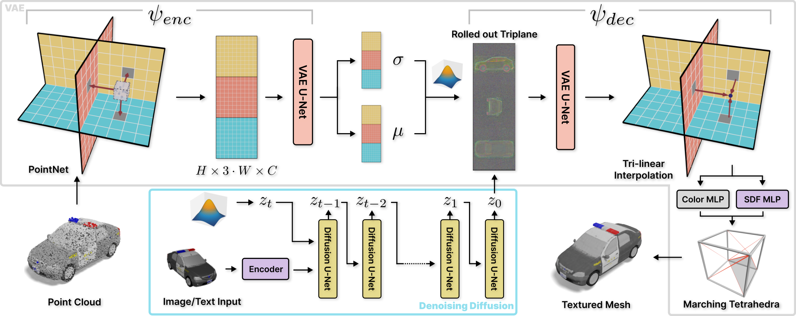

*原文图 1：论文方法流程图；详细原始图注请查看图片来源。 [查看图片来源](https://arxiv.org/html/2303.05371v2/ICCV_fig.png)*

引用来源：arxiv_2512.14692

链接：[arXiv](https://arxiv.org/abs/2303.05371)

##### Shap-E: Generating Conditional 3D Implicit Functions

作者：Heewoo Jun, Alex Nichol

研究角色：背景与上下文工作
任务标签：context

中文简介：

Shap-E面向条件三维资产生成：输入文本等条件，输出可渲染为带纹理网格或神经辐射场的隐式函数参数。方法先用编码器将三维资产映射到隐式函数参数，再在该表示上训练条件扩散模型。相较Point-E直接生成点云，它属于较早将扩散作用于多表示隐式函数参数的路线，并以统一参数支持不同三维输出形式。

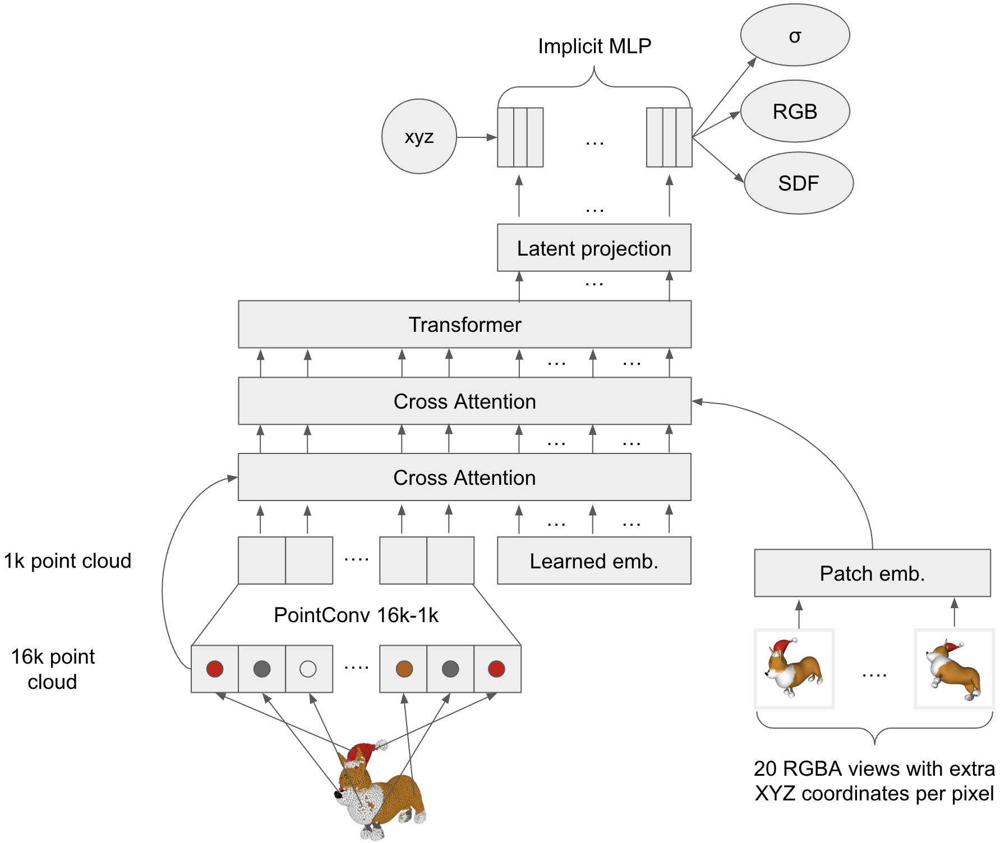

*原文图 2：论文方法流程图；详细原始图注请查看图片来源。 [查看图片来源](https://arxiv.org/html/2305.02463v1/figures/encoder.png)*

引用来源：arxiv_2512.14692

链接：[arXiv](https://arxiv.org/abs/2305.02463)

##### ULIP-2: Towards Scalable Multimodal Pre-Training for 3D Understanding

作者：Le Xue, Ning Yu, Shu Zhang, Artemis Panagopoulou, Jun-Nan Li, Roberto Mart'in-Mart'in, Jiajun Wu, Cai-Ming Xiong, Ran Xu, Juan Carlos Niebles, S. Savarese

研究角色：背景与上下文工作
任务标签：context

中文简介：

ULIP-2面向三维多模态理解：训练时输入三维形状，并自动构造对应图像和整体语言描述，输出统一的三维、视觉与文本表征，可用于零样本分类、微调分类及三维描述生成。方法借助大型多模态模型自动生成文本，再采用扩展骨干进行三模态对齐预训练。它不是几何扩散生成器，而是可扩展的表示学习路线，区别于依赖人工三维标注或有限描述的数据构建方式。

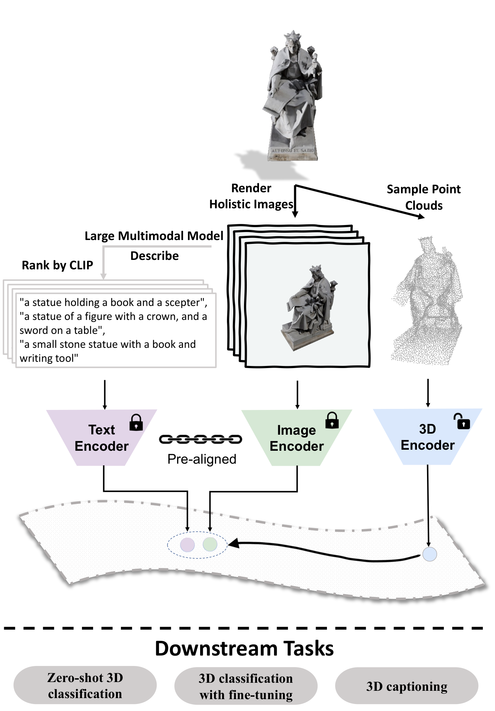

*原文图 1：论文方法流程图；详细原始图注请查看图片来源。 [查看图片来源](https://arxiv.org/html/2305.08275v4/cvpr_figure1_v3.png)*

引用来源：arxiv_2512.14692

链接：[arXiv](https://arxiv.org/abs/2305.08275)

##### Habitat Synthetic Scenes Dataset (HSSD-200): An Analysis of 3D Scene Scale and Realism Tradeoffs for ObjectGoal Navigation

作者：Mukul Khanna, Yongsen Mao, Hanxiao Jiang, S. Haresh, Brennan Shacklett, Dhruv Batra, Alexander Clegg, Eric Undersander, Angel X. Chang, M. Savva

研究角色：背景与上下文工作
任务标签：context

中文简介：

该工作面向具身智能的ObjectGoal导航：智能体输入第一视角观测和目标物体类别，输出在室内环境中寻找并抵达目标的行动策略。作者构建HSSD-200高质量合成场景集，并以跨数据集训练和真实扫描环境测试分析场景规模、视觉真实度及现实相关性的影响。它不是三维物体生成方法，而是用于研究导航泛化的数据集工作，强调数据质量与真实性相较单纯扩大量级的重要性。

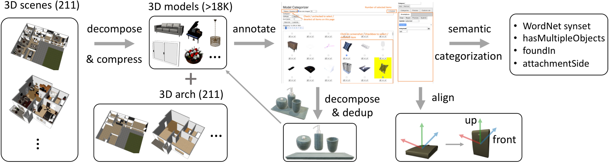

*原文图 6：论文方法流程图；详细原始图注请查看图片来源。 [查看图片来源](https://arxiv.org/html/2306.11290v3/fp-data-pipeline-fig.png)*

引用来源：arxiv_2512.14692

链接：[arXiv](https://arxiv.org/abs/2306.11290)

##### AutoDecoding Latent 3D Diffusion Models

作者：Evangelos Ntavelis, Aliaksandr Siarohin, Kyle Olszewski, Chao-Yuan Wang, L. Van Gool, Sergey Tulyakov

研究角色：背景与上下文工作
任务标签：context

中文简介：

该工作从二维图像或单目视频学习静态及关节物体的三维生成，输出可渲染、视角一致的体积几何与外观。方法先以3D autodecoder把数据集属性压入中间体积潜空间，再通过归一化设计在该潜空间训练扩散模型；相机参数既可由监督给出，也可在训练中估计。它属于潜空间三维资产生成路线，重点是自解码体积表示及弱相机依赖，而非直接在显式基元上扩散。

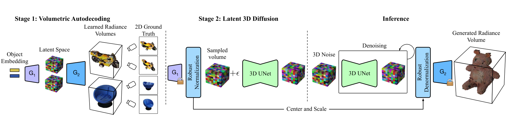

*原文图 1：论文方法流程图；详细原始图注请查看图片来源。 [查看图片来源](https://arxiv.org/html/2307.05445v1/framework_v2.png)*

引用来源：arxiv_2512.14692

链接：[arXiv](https://arxiv.org/abs/2307.05445)

##### Objaverse-XL: A Universe of 10M+ 3D Objects

作者：Matt Deitke, Ruoshi Liu, Matthew Wallingford, Huong Ngo, Oscar Michel, Aditya Kusupati, Alan Fan, Christian Laforte, Vikram S. Voleti, S. Gadre, Eli VanderBilt, Aniruddha Kembhavi, Carl Vondrick, Georgia Gkioxari, Kiana Ehsani, Ludwig Schmidt, Ali Farhadi

研究角色：背景与上下文工作
任务标签：context

中文简介：

该工作构建大规模三维对象数据资源：输入来自人工建模、摄影测量和专业扫描等来源的原始资产，经汇集与去重后输出覆盖广泛类别的Objaverse-XL。作者还将对象渲染为多视图图像，用于训练Zero123并检验数据规模对新视角合成泛化的作用。它不是具体的单图三维生成架构，而是为大规模三维预训练和条件生成提供数据基础，补足三维数据数量与多样性不足的问题。

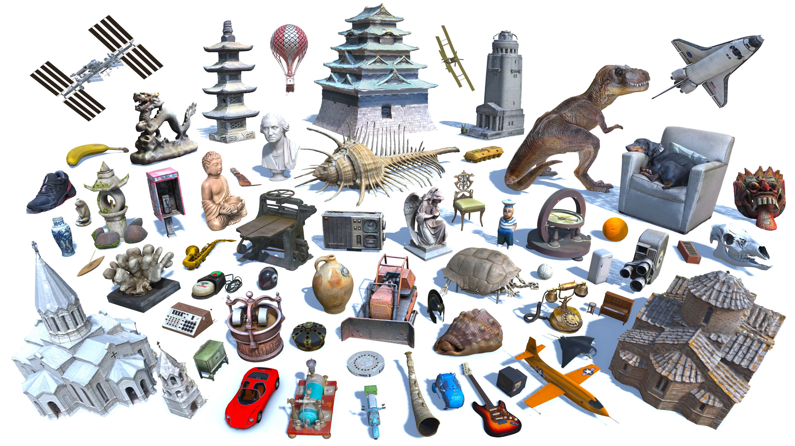

*原文图 1：论文方法流程图；详细原始图注请查看图片来源。 [查看图片来源](https://arxiv.org/html/2307.05663v1/images/cover-23.jpg)*

引用来源：arxiv_2512.14692

链接：[arXiv](https://arxiv.org/abs/2307.05663)

##### 3D Gaussian Splatting for Real-Time Radiance Field Rendering

作者：Bernhard Kerbl, Georgios Kopanas, Thomas Leimkuehler, G. Drettakis

研究角色：背景与上下文工作
任务标签：context

中文简介：

该工作以多张带相机信息的场景照片或视频为输入，输出可从新视角实时渲染的完整场景。方法用具有位置、颜色、不透明度及各向异性协方差的3D Gaussian显式表示辐射场，并交替优化基元参数与密度，配合可见性感知的快速溅射渲染。它并非单图物体扩散生成方法，而是后续显式Gaussian资产表示与可微渲染路线的重要基础。

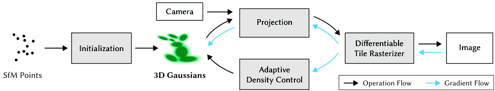

*原文图 2：论文方法流程图；详细原始图注请查看图片来源。 [查看图片来源](https://arxiv.org/html/2308.04079v1/overview_01.png)*

引用来源：arxiv_2512.14692

链接：[arXiv](https://arxiv.org/abs/2308.04079)

##### Flexible Isosurface Extraction for Gradient-Based Mesh Optimization

作者：Tianchang Shen, Jacob Munkberg, J. Hasselgren, K. Yin, Zian Wang, Wenzheng Chen, Zan Gojcic, S. Fidler, Nicholas Sharp, Jun Gao

研究角色：背景与上下文工作
任务标签：context

中文简介：

该工作面向基于梯度的网格优化：输入待优化的标量场及几何、视觉或物理目标，输出其等值面对应的高质量表面网格。FlexiCubes在Dual Marching Cubes基础上加入可学习的局部几何与连接参数，并通过自动微分联合更新，也可扩展到四面体和层次自适应网格。它不是生成模型，而是连接隐式场与可优化显式网格的提取工具，区别于固定规则的传统等值面算法。

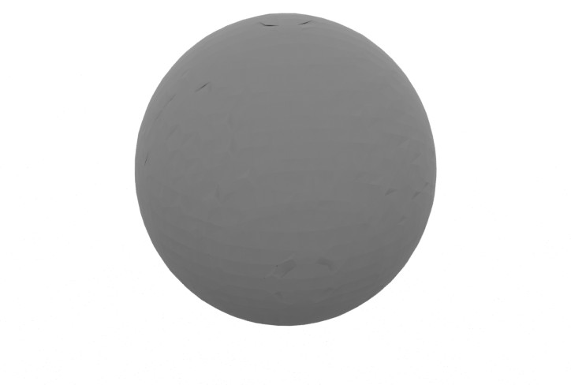

*原文图 24：论文方法流程图；详细原始图注请查看图片来源。 [查看图片来源](https://arxiv.org/html/2308.05371v1/figures/physics/pred_init-frame0.png)*

引用来源：arxiv_2512.14692

链接：[arXiv](https://arxiv.org/abs/2308.05371)

##### PixArt-α: Fast Training of Diffusion Transformer for Photorealistic Text-to-Image Synthesis

作者：Jun-Song Chen, Jin-Cheng Yu, Chongjian Ge, Lewei Yao, En-Ze Xie, Yue Wu, Zhongdao Wang, James T. Kwok, Ping Luo, Hu-Chuan Lu, Zhen-Guo Li

研究角色：背景与上下文工作
任务标签：context

中文简介：

该工作解决文本到图像生成任务，输入文本描述，输出高分辨率图像。方法采用带文本交叉注意力的Diffusion Transformer，并将训练分解为像素依赖、文本图像对齐和审美质量三个阶段，同时利用视觉语言模型生成信息密集的伪描述。它属于二维扩散生成中的高效训练与架构改进路线，通过分阶段学习和更高信息量数据降低训练负担，与三维几何扩散生成并非同一任务。

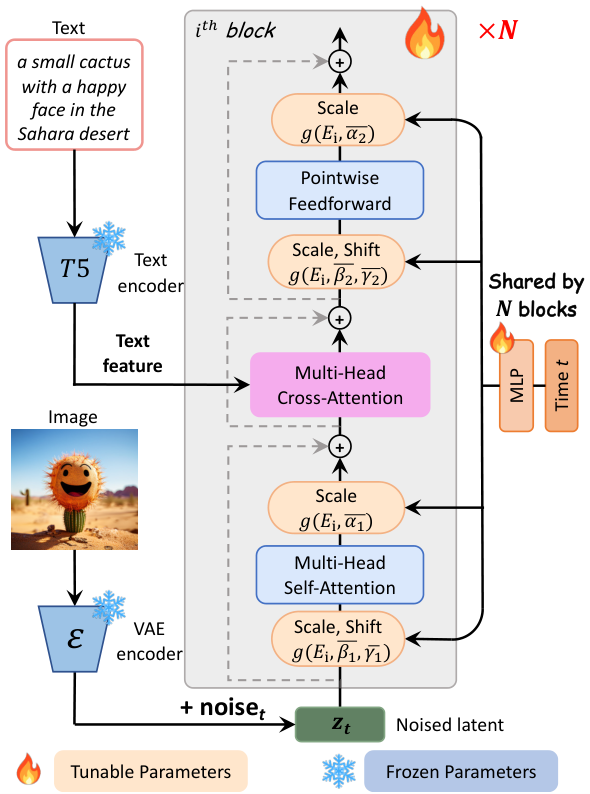

*原文图 4：论文方法流程图；详细原始图注请查看图片来源。 [查看图片来源](https://arxiv.org/html/2310.00426v3/model_arch.png)*

引用来源：arxiv_2512.14692

链接：[arXiv](https://arxiv.org/abs/2310.00426)

##### Uni3D: Exploring Unified 3D Representation at Scale

作者：Junsheng Zhou, Jinsheng Wang, Baorui Ma, Yu-Shen Liu, Tiejun Huang, Xinlong Wang

研究角色：背景与上下文工作
任务标签：context

中文简介：

该工作学习统一的三维基础表示，输入三维点云，输出可用于分类、分割、检索或三维绘画的点云特征。方法采用由二维预训练ViT初始化的模型，并以图像—文本对齐特征作为目标，通过预训练将三维点云映射到统一语义空间。它代表三维表征规模化与跨模态对齐路线，重点是理解和迁移能力，而不是从条件直接生成完整三维几何。

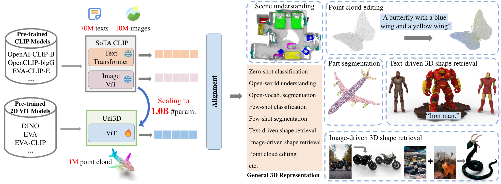

*原文图 3：论文方法流程图；详细原始图注请查看图片来源。 [查看图片来源](https://arxiv.org/html/2310.06773v1/overview_v4.png)*

引用来源：arxiv_2512.14692

链接：[arXiv](https://arxiv.org/abs/2310.06773)

##### Mip-Splatting: Alias-Free 3D Gaussian Splatting

作者：Zehao Yu, Anpei Chen, Binbin Huang, Torsten Sattler, Andreas Geiger

研究角色：背景与上下文工作
任务标签：context

中文简介：

该工作解决三维高斯点渲染在视角、焦距或采样尺度变化时产生混叠与伪影的问题，输入多视图图像及其训练尺度，输出可进行多尺度渲染的三维高斯表示。方法在三维中引入依据最大采样频率约束高斯尺寸的平滑滤波，并以Mip滤波替换二维膨胀操作。它属于显式Gaussian表示的渲染改进，而非生成模型，因此不属于三维几何扩散生成路线。

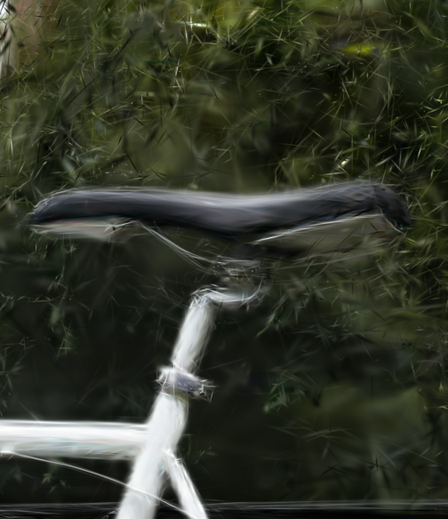

*原文图 1：论文方法流程图；详细原始图注请查看图片来源。 [查看图片来源](https://arxiv.org/html/2311.16493v1/figs/teaser_artefacts/3dgs_up.png)*

引用来源：arxiv_2512.14692

链接：[arXiv](https://arxiv.org/abs/2311.16493)

##### TorchSparse++: Efficient Training and Inference Framework for Sparse Convolution on GPUs

作者：Haotian Tang, Shang Yang, Zhijian Liu, Ke Hong, Zhong-Ming Yu, Xiuyu Li, Guohao Dai, Yu Wang, Song Han

研究角色：背景与上下文工作
任务标签：context

中文简介：

该工作面向GPU上的稀疏卷积训练与推理，输入稀疏点云、体素或图结构特征，输出经过稀疏卷积计算的特征表示。其核心是自动生成高效稀疏卷积内核，并通过Sparse Autotuner搜索适合不同训练和推理负载的数据流配置，在易实现性与高性能之间取得平衡。该工作属于三维计算基础设施，不涉及三维资产生成，也不属于隐式场或潜空间扩散方法。

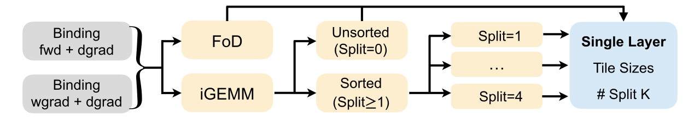

*原文图 10：论文方法流程图；详细原始图注请查看图片来源。 [查看图片来源](https://arxiv.org/html/2311.12862v1/design_space.svg)*

引用来源：arxiv_2512.14692

链接：[arXiv](https://arxiv.org/abs/2311.12862)

##### VolumeDiffusion: Flexible Text-to-3D Generation with Efficient Volumetric Encoder

作者：Zhi-Cong Tang, Shuyang Gu, Chunyu Wang, Ting Zhang, Jian-Min Bao, Dong-Dong Chen, Bai-Ning Guo

研究角色：背景与上下文工作
任务标签：context

中文简介：

该工作面向文本到三维生成，输入文本提示，输出具有体积特征表达的三维对象。方法先从多视图图像高效提取三维特征体，再以3D U-Net在体积表示上训练扩散模型，从而支持对象生成及文本控制的部件属性组合。相较直接处理高维体素或依赖逐实例优化的路线，VolumeDiffusion通过轻量体积编码器提升表示构建效率，属于显式体积场上的三维扩散探索。

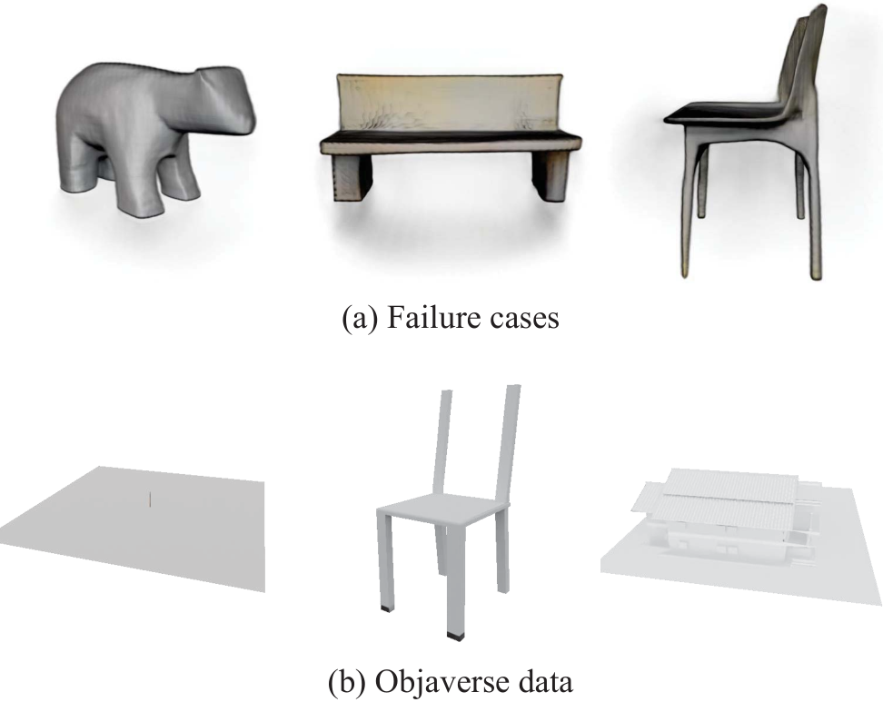

*原文图 8：论文方法流程图；详细原始图注请查看图片来源。 [查看图片来源](https://arxiv.org/html/2312.11459v3/fig_failure.png)*

引用来源：arxiv_2512.14692

链接：[arXiv](https://arxiv.org/abs/2312.11459)

##### XCube: Large-Scale 3D Generative Modeling using Sparse Voxel Hierarchies

作者：Xuanchi Ren, Jiahui Huang, Xiaohui Zeng, Ken Museth, Sanja Fidler, Francis Williams

研究角色：背景与上下文工作
任务标签：context

中文简介：

该工作生成高分辨率稀疏体素网格，输入可为随机噪声、编辑条件、单次扫描或文本，输出带任意属性的三维体素对象或场景。核心是基于VDB数据结构的层次化体素潜扩散模型，以由粗到细方式逐级生成稀疏网格。它代表稀疏结构化潜空间扩散路线，相较致密体素生成显著减少无效空间处理，并将方法从物体扩展到大尺度户外场景。

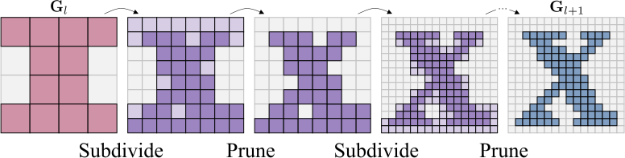

*原文图 2：论文方法流程图；详细原始图注请查看图片来源。 [查看图片来源](https://arxiv.org/html/2312.03806v2/decoder_mac_crop.svg)*

引用来源：arxiv_2512.14692

链接：[arXiv](https://arxiv.org/abs/2312.03806)

##### 2024

##### GVGEN: Text-to-3D Generation with Volumetric Representation

作者：Xianglong He, Junyi Chen, Sida Peng, Di Huang, Yangguang Li, Xiaoshui Huang, Chun Yuan, Wan-Li Ouyang, Tong He

研究角色：背景与上下文工作
任务标签：context

中文简介：

该论文解决文本到三维Gaussian物体生成任务，输入是文本描述，输出是具有几何和外观属性的结构化Gaussian表示。方法先把无序Gaussian点组织为固定规模的GaussianVolume，并通过候选池策略进行剪枝与致密化；生成阶段采用由粗到细的扩散流程，先构建基础几何，再预测完整Gaussian属性。它属于显式几何基元空间扩散，区别于直接生成无序点集或仅追求快速渲染的路线，重点在于以体积结构约束Gaussian布局，并兼顾细节保真度与生成效率。

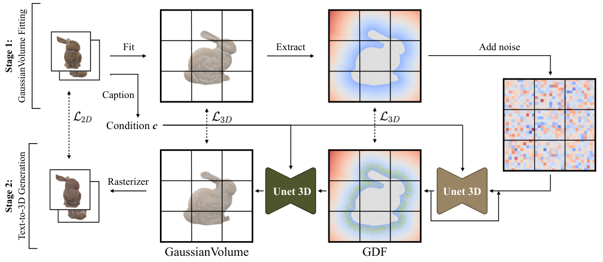

*原文图 1：论文方法流程图；详细原始图注请查看图片来源。 [查看图片来源](https://arxiv.org/html/2403.12957v2/pipeline.png)*

引用来源：arxiv_2512.14692

链接：[arXiv](https://arxiv.org/abs/2403.12957)

##### LN3Diff++: Scalable Latent Neural Fields Diffusion for Speedy 3D Generation

作者：Yushi Lan, Fangzhou Hong, Shang-Chen Zhou, Shuai Yang, Xuyi Meng, Yong-Wei Chen, Zhaoyang Lyu, Bo Dai, Xingang Pan, Chen Change Loy

研究角色：背景与上下文工作
任务标签：context

中文简介：

该工作面向条件三维生成，输入图像或文本等条件，输出完整的高容量三维神经场。其核心是利用三维感知架构和VAE，将条件编码为紧凑、具有空间结构的三维潜变量，再在该潜空间执行扩散，并由Transformer解码器恢复神经场。相较直接在高维三维表示上扩散的路线，LN3Diff++属于稀疏结构化潜空间扩散范式，强调统一条件、较快推理及无需逐实例优化。

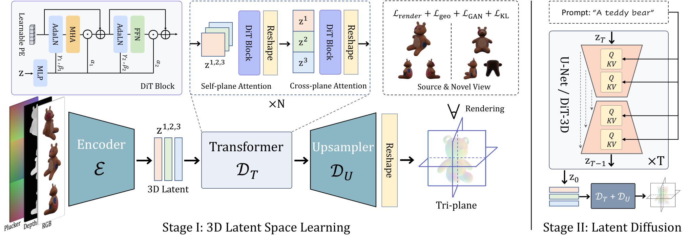

*原文图 2：论文方法流程图；详细原始图注请查看图片来源。 [查看图片来源](https://arxiv.org/html/2403.12019v3/overview-fixed3.png)*

引用来源：arxiv_2512.14692

链接：[arXiv](https://arxiv.org/abs/2403.12019)

##### Scaling Rectified Flow Transformers for High-Resolution Image Synthesis

作者：Patrick Esser, Sumith Kulal, A. Blattmann, Rahim Entezari, Jonas Muller, Harry Saini, Yam Levi, Dominik Lorenz, Axel Sauer, Frederic Boesel, Dustin Podell, Tim Dockhorn, Zion English, Kyle Lacey, Alex Goodwin, Yannik Marek, Robin Rombach

研究角色：背景与上下文工作
任务标签：context

中文简介：

该工作解决高分辨率文本到图像生成任务，输入文本提示，输出图像。方法以Rectified Flow替代常规扩散路径，并通过偏向感知重要尺度的噪声采样改进训练；同时提出图像与文本分设参数、且可双向交互的Transformer架构，以增强文本理解和排版能力。它属于二维生成领域对扩散范式的改进，主要贡献在流模型训练与Transformer设计，不直接生成三维几何。

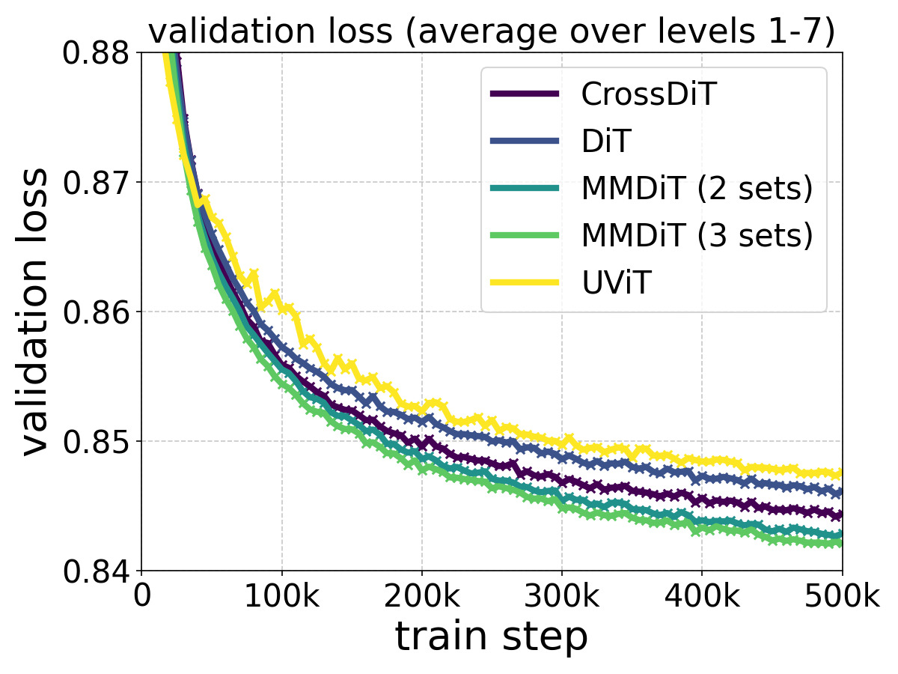

*原文图 3：论文方法流程图；详细原始图注请查看图片来源。 [查看图片来源](https://arxiv.org/html/2403.03206v1/img/archs_squeezed/val_loss_level_avg.jpg)*

引用来源：arxiv_2512.14692

链接：[arXiv](https://arxiv.org/abs/2403.03206)

##### MeshAnything: Artist-Created Mesh Generation with Autoregressive Transformers

作者：Yiwen Chen, Tong He, Di Huang, Weicai Ye, Sijin Chen, Jiaxiang Tang, Xin Chen, Zhongang Cai, Lei Yang, Gang Yu, Guo-Sheng Lin, Chi Zhang

研究角色：背景与上下文工作
任务标签：context

中文简介：

该论文解决三维资产到艺术家制作网格的转换任务，输入可以是任意三维表示或已有形状，输出是具有合理面布局、较少面数且贴合原形状的网格。方法先用VQ-VAE学习网格词表，再由形状条件的仅解码器Transformer自回归生成网格序列，把网格提取重新定义为生成问题。它不属于扩散生成或高模重建路线，而是面向工业应用的低模化、艺术家风格网格生成，重点区别于产生密集面片后再进行复杂后处理的方法。

*原文图 5：论文方法流程图；详细原始图注请查看图片来源。 [查看图片来源](https://arxiv.org/html/2406.10163v2/pip.png)*

引用来源：arxiv_2512.14692

链接：[arXiv](https://arxiv.org/abs/2406.10163)

##### fVDB : A Deep-Learning Framework for Sparse, Large Scale, and High Performance Spatial Intelligence

作者：Francis Williams, Jiahui Huang, Jonathan Swartz, G. Klár, Vijay Thakkar, Matthew Cong, Xuanchi Ren, Ruilong Li, Clement Fuji-Tsang, Sanja Fidler, Eftychios Sifakis, Ken Museth

研究角色：背景与上下文工作
任务标签：context

中文简介：

该论文并非单一生成模型，而是面向大规模稀疏三维数据的深度学习框架。输入可以是点云、体数据或空间场，输出取决于任务，包括分割、重建、渲染和生成结果。fVDB以统一的VDB索引网格为核心，提供稀疏卷积、池化、注意力、光线追踪和网格化等可微算子，并结合GPU稀疏构建、张量核心计算及不规则张量支持高分辨率数据。它位于三维生成的基础设施层，而非按扩散表示空间划分的方法，作用是支撑稀疏、大尺度模型训练与推理。

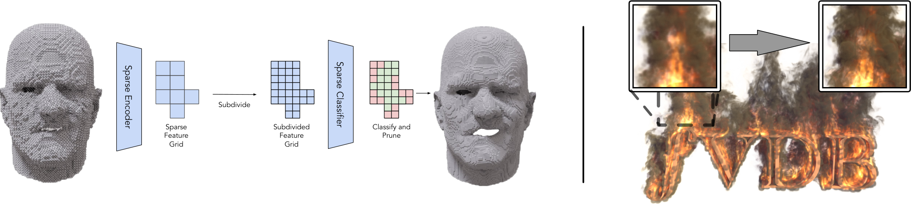

*原文图 15：论文方法流程图；详细原始图注请查看图片来源。 [查看图片来源](https://arxiv.org/html/2407.01781v2/SuperResolutionSimApplications.png)*

引用来源：arxiv_2512.14692

链接：[arXiv](https://arxiv.org/abs/2407.01781)

##### Atlas Gaussians Diffusion for 3D Generation with Infinite Number of Points

作者：Hai-Tao Yang, Yuan Dong, Hanwen Jiang, De-Jia Xu, Georgios Pavlakos, Qi-Xing Huang

研究角色：背景与上下文工作
任务标签：context

中文简介：

该论文面向原生三维形状生成，输入为生成条件或潜变量，输出是由大量三维Gaussian组成的高细节物体表示。方法先以局部patch组成Atlas Gaussians，通过特征序列和可学习解码器生成每个patch中的Gaussian，并利用UV采样支持理论上不受限的点数；随后训练变分自编码器，在其潜空间执行扩散生成。它属于显式几何基元空间扩散，但区别于直接生成无序Gaussian点集，借助局部结构和潜变量提高细节表达与解码效率。

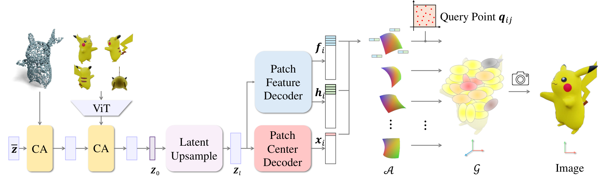

*原文图 2：论文方法流程图；详细原始图注请查看图片来源。 [查看图片来源](https://arxiv.org/html/2408.13055v3/pipeline.png)*

引用来源：arxiv_2512.14692

链接：[arXiv](https://arxiv.org/abs/2408.13055)

##### LT3SD: Latent Trees for 3D Scene Diffusion

作者：Quan Meng, Lei Li, M. Nießner, Angela Dai

研究角色：背景与上下文工作
任务标签：context

中文简介：

该论文面向大尺度三维场景生成与局部观测补全，输入可为随机条件或部分场景观测，输出为不同规模的完整三维场景。方法采用潜变量扩散，将场景编码为包含低频结构和高频细节的分层潜树，并以由粗到细的方式建模各层潜成分；同时在场景块上训练和共享生成过程，以合成任意大小的场景。相较主要针对单物体的三维扩散路线，LT3SD将稀疏层次结构和分块扩展能力引入场景级生成。

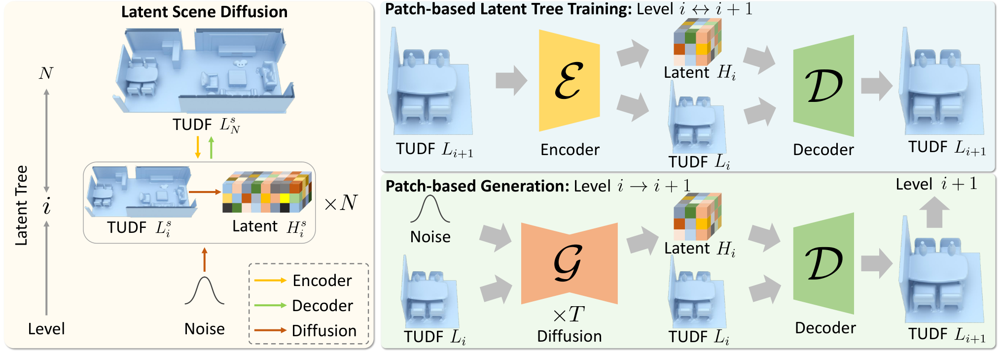

*原文图 2：论文方法流程图；详细原始图注请查看图片来源。 [查看图片来源](https://arxiv.org/html/2409.08215v2/pipeline_img.png)*

引用来源：arxiv_2512.14692

链接：[arXiv](https://arxiv.org/abs/2409.08215)

##### Deep Compression Autoencoder for Efficient High-Resolution Diffusion Models

作者：Jun-Yu Chen, Han Cai, Jun-Song Chen, En-Ze Xie, Shang Yang, Haotian Tang, Mu-Yang Li, Yao Lu, Song Han

研究角色：背景与上下文工作
任务标签：context

中文简介：

该工作并非三维生成模型，而是面向高分辨率扩散模型的通用自编码压缩任务，输入高分辨率图像，输出压缩潜表示及重建图像。方法通过残差自编码缓解高压缩比下的优化困难，并以解耦的高分辨率适配训练提升泛化，再用于潜扩散模型以减少计算。它属于生成系统的基础组件，能够支持更高效的潜空间建模，但不直接定义三维几何或资产生成范式。

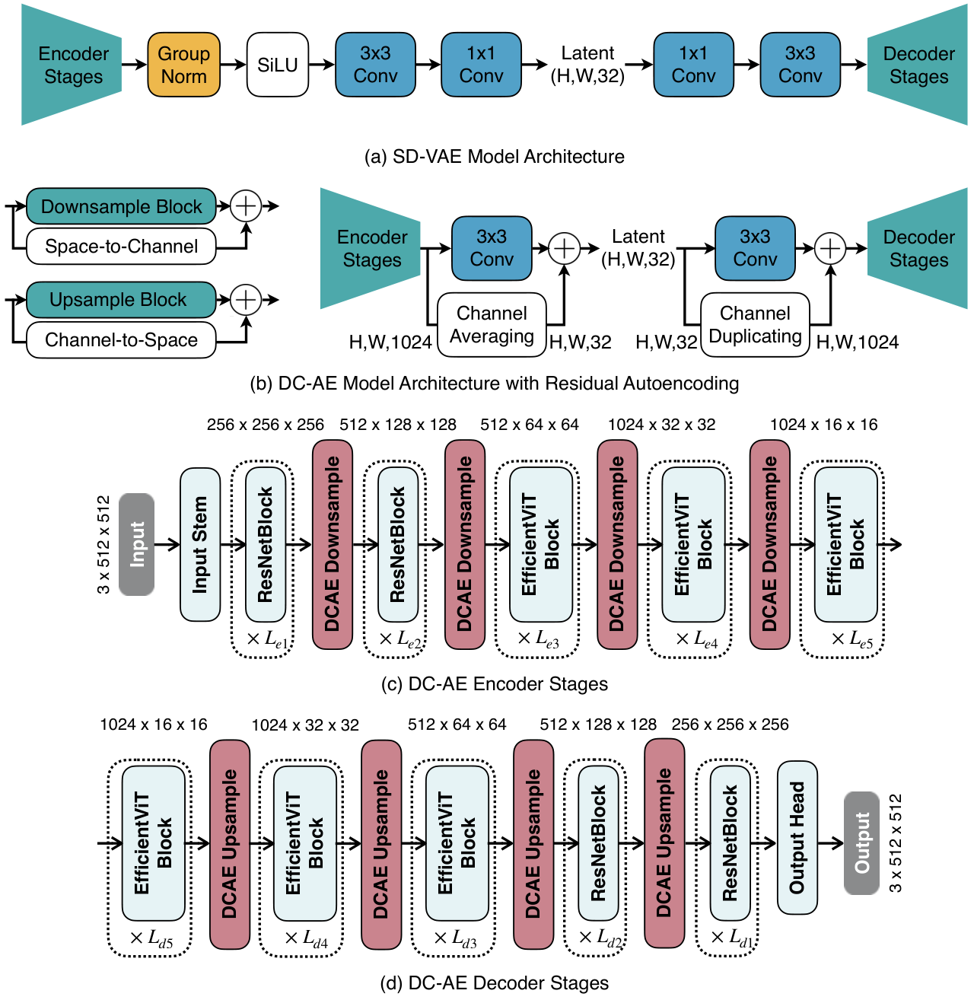

*原文图 10：论文方法流程图；详细原始图注请查看图片来源。 [查看图片来源](https://arxiv.org/html/2410.10733v8/dc_ae_detailed_arch.png)*

引用来源：arxiv_2512.14692

链接：[arXiv](https://arxiv.org/abs/2410.10733)

##### TEXGen: a Generative Diffusion Model for Mesh Textures

作者：Xin Yu, Ze Yuan, Yuan-Chen Guo, Ying-Tian Liu, Jianhui Liu, Yangguang Li, Yan-Pei Cao, Ding Liang, Xiaojuan Qi

研究角色：背景与上下文工作
任务标签：context

中文简介：

该工作解决纹理生成而非完整几何生成，输入为文本或单视图图像，输出是高分辨率UV纹理图，并可进一步完成纹理修补、稀疏视图补全和合成。方法直接在UV纹理空间训练前馈扩散模型，以UV卷积和点云注意力交替处理高分辨率纹理与三维结构。它是外观生成的专门路线，区别于依赖预训练二维扩散模型进行测试时优化的三维纹理方法。

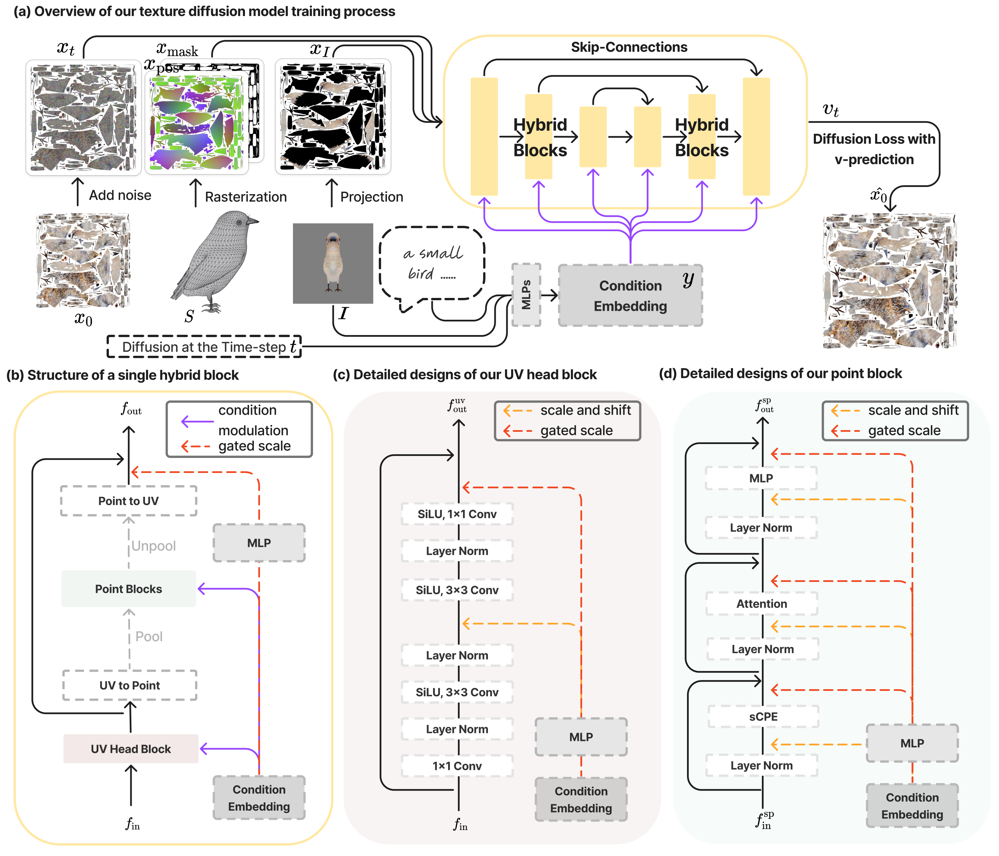

*原文图 3：论文方法流程图；详细原始图注请查看图片来源。 [查看图片来源](https://arxiv.org/html/2411.14740v1/fig_pipeline.png)*

引用来源：arxiv_2512.14692

链接：[arXiv](https://arxiv.org/abs/2411.14740)

##### Dora: Sampling and Benchmarking for 3D Shape Variational Auto-Encoders

作者：Rui Chen, Jianfeng Zhang, Yixun Liang, Guan Luo, Wei-Yu Li, Jiarui Liu, Xiu Li, Xiao-Xiao Long, Jiashi Feng, Ping Tan

研究角色：背景与上下文工作
任务标签：context

中文简介：

该工作研究三维形状VAE的重建任务，输入是三维形状，输出是紧凑潜表示及重建几何，重点服务于后续扩散生成。方法以尖锐边采样替代均匀点采样，并引入双重交叉注意力，使编码器关注高几何复杂度区域；同时提出Dora-Bench评估锐边处的重建能力。它属于结构化潜空间扩散之前的表示学习基础工作，区别于仅追求整体重建或使用密集潜编码的路线。

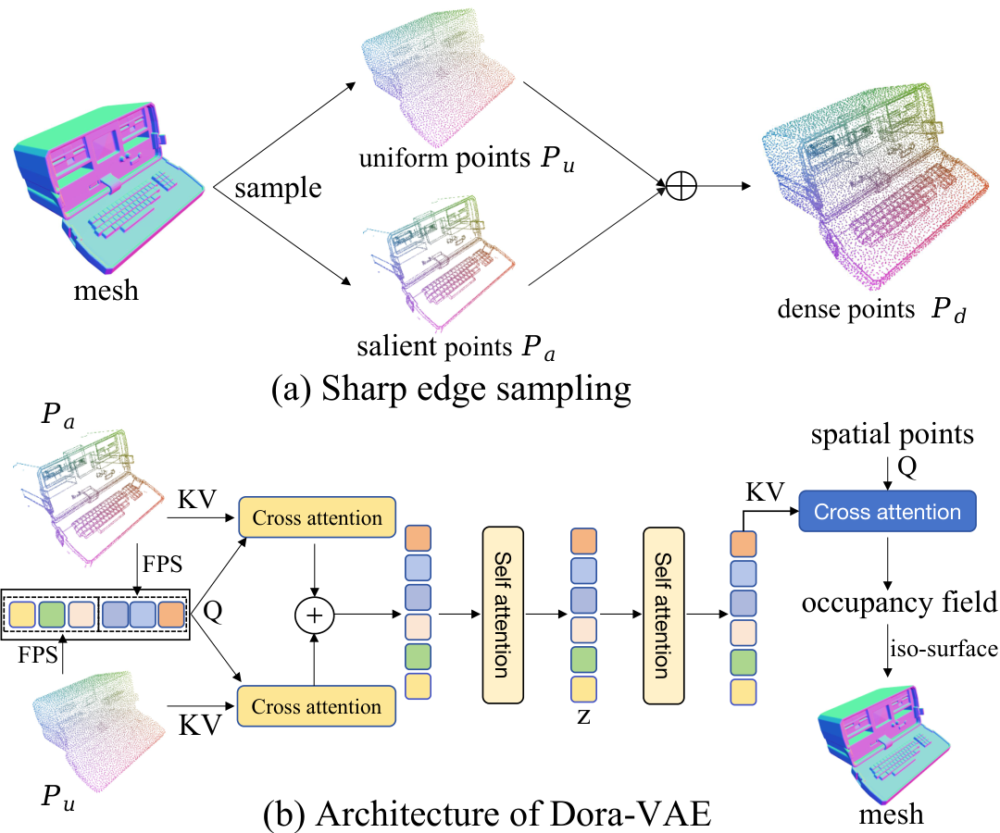

*原文图 2：论文方法流程图；详细原始图注请查看图片来源。 [查看图片来源](https://arxiv.org/html/2412.17808v3/method_pipeline.png)*

引用来源：arxiv_2512.14692

链接：[arXiv](https://arxiv.org/abs/2412.17808)

##### CraftsMan: High-fidelity Mesh Generation with 3D Native Generation and Interactive Geometry Refiner

作者：Wei-Yu Li, Jiarui Liu, Rui Chen, Yixun Liang, Xuelin Chen, Ping Tan, Xiao-Xiao Long

研究角色：背景与上下文工作
任务标签：context

中文简介：

CraftsMan旨在根据单张物体图像生成高保真三维网格，输出可直接使用的完整物体几何及相关三维资产。其方法采用原生三维生成范式，并结合交互式几何细化器，对初始结果进行局部或整体修正，以提升细节和可控性。相较于先生成形状、再合成多视图纹理并烘焙对齐的串联方案，它更强调在三维空间内直接生成和完善资产，属于原生三维几何与外观联合生成框架。

*原文图 3：论文方法流程图；详细原始图注请查看图片来源。 [查看图片来源](https://arxiv.org/html/2405.14979v4/overview.png)*

引用来源：arxiv_2512.14692

##### GaussianAnything: Interactive Point Cloud Latent Diffusion for 3D Generation

作者：Yushi Lan, Shang-Chen Zhou, Zhaoyang Lyu, Fangzhou Hong, Shuai Yang, Bo Dai, Xingang Pan, Chen Change Loy

研究角色：背景与上下文工作
任务标签：context

中文简介：

该论文解决三维点云及相关资产的生成任务：输入为条件信息或交互式用户控制，输出为点云形式的三维结构。GaussianAnything 采用点云潜表示与潜空间扩散，在具有集合性质的潜特征上进行条件生成，并强调交互式编辑和生成能力。相较直接在体素、网格或规则隐式场上扩散的路线，它代表将三维数据压缩为无序潜变量集合后再生成的方向；摘要信息未说明其是否联合生成完整外观。

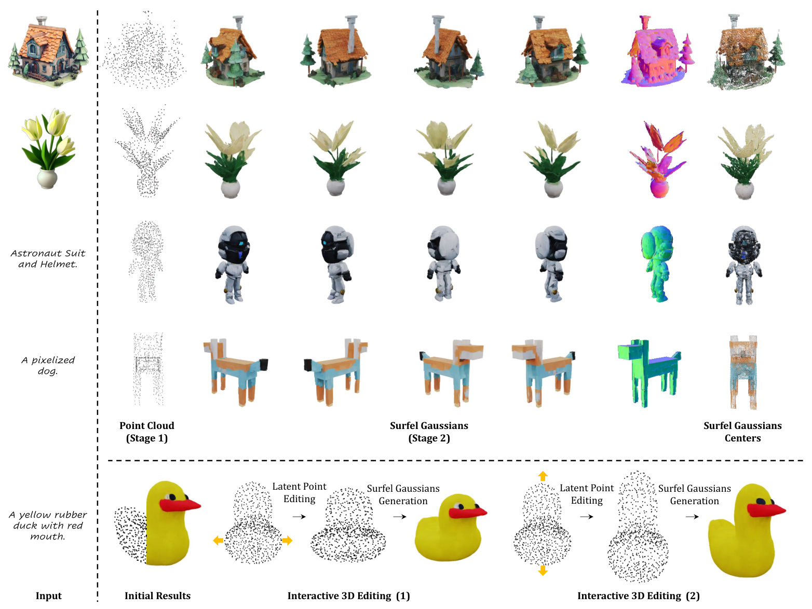

*原文图 7：论文方法流程图；详细原始图注请查看图片来源。 [查看图片来源](https://arxiv.org/html/2411.08033v2/teaser-v2.png)*

引用来源：arxiv_2512.14692

##### GaussianCube: Structuring Gaussian Splatting using Optimal Transport for 3D Generative Modeling

作者：Bowen Zhang, Yiji Cheng, Jiao-Long Yang, Chunyu Wang, Feng Zhao, Yansong Tang, Dong Chen, Bai-Ning Guo

研究角色：背景与上下文工作
任务标签：context

中文简介：

GaussianCube面向从单张物体图像生成完整三维几何与可渲染资产，输出由三维高斯基元构成的显式表示。其核心是在高斯空间中引入结构化组织，并借助最优传输建立基元排列或对应关系，再进行生成建模。相较于直接生成无序高斯集合的方法，它强调显式结构先验；在本综述中属于显式几何基元空间扩散路线，并为几何与外观联合建模提供了基础。

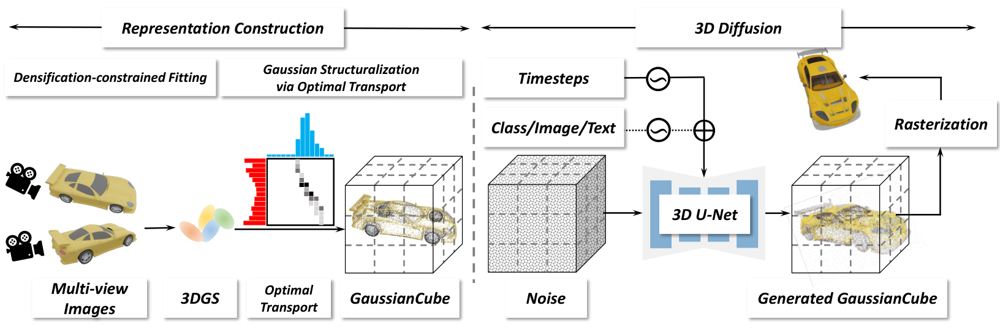

*原文图 2：论文方法流程图；详细原始图注请查看图片来源。 [查看图片来源](https://arxiv.org/html/2403.19655v4/pipeline.png)*

引用来源：arxiv_2512.14692

##### 2025

##### SparseFlex: High-Resolution and Arbitrary-Topology 3D Shape Modeling

作者：Xianglong He, Zi-Xin Zou, Chia-Hao Chen, Yuan-Chen Guo, Ding Liang, Chun Yuan, Wan-Li Ouyang, Yan-Pei Cao, Yangguang Li

研究角色：背景与上下文工作
任务标签：context

中文简介：

该工作面向高保真、任意拓扑三维形状建模与生成，输入可为渲染监督或形状数据，输出是支持开放表面和复杂内部结构的高分辨率网格。方法以稀疏结构化等值面表示结合可微重建，并采用视锥感知的分段体素训练降低显存开销；随后以VAE编码形状、用rectified flow transformer生成潜变量。相较依赖隐式场及封闭化转换的路线，它直接处理稀疏网格并扩展到高分辨率生成。

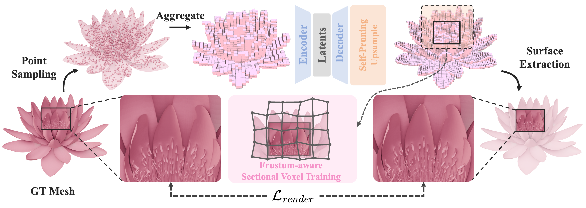

*原文图 1：论文方法流程图；详细原始图注请查看图片来源。 [查看图片来源](https://arxiv.org/html/2503.21732v1/figs/pipeline.png)*

引用来源：arxiv_2512.14692

链接：[arXiv](https://arxiv.org/abs/2503.21732)

##### Direct3D-S2: Gigascale 3D Generation Made Easy with Spatial Sparse Attention

作者：Shuang Wu, You-Tian Lin, Fei-Hu Zhang, Yi-Fei Zeng, Yikang Yang, Yajie Bao, Jiachen Qian, Si-Yu Zhu, Xun Cao, Philip H. S. Torr, Yao Yao

研究角色：背景与上下文工作
任务标签：context

中文简介：

该工作面向高分辨率三维形状生成，输入稀疏体积或其潜表示，输出高细节几何。方法以统一稀疏体积格式贯穿输入、潜变量和输出，并在稀疏体积上的DiT中引入Spatial Sparse Attention，以降低大规模体素令牌的计算开销。它属于隐式场空间扩散与稀疏结构化潜空间扩散的交叉路线，区别于在不同模态间转换的VAE设计，强调表示一致性和大尺度训练效率。

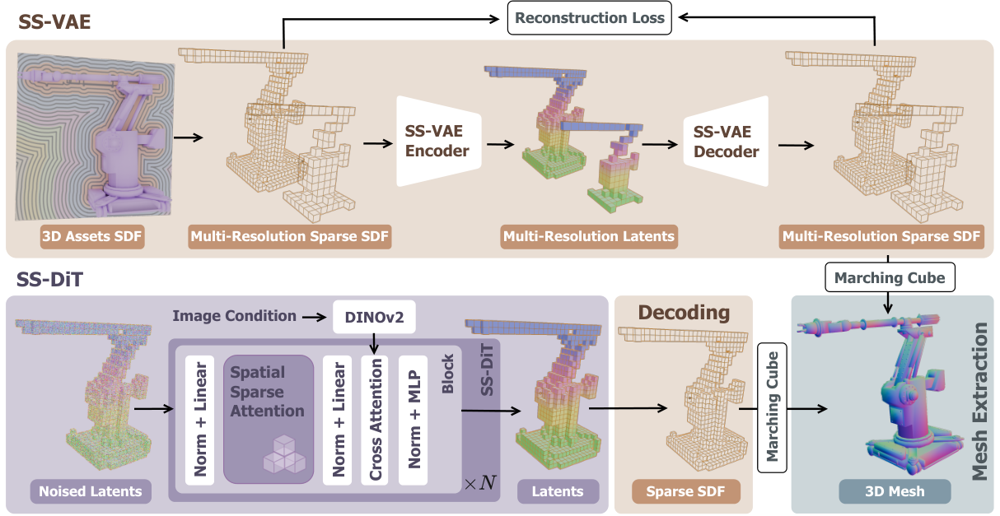

*原文图 1：论文方法流程图；详细原始图注请查看图片来源。 [查看图片来源](https://arxiv.org/html/2505.17412v2/pipeline-arm.png)*

引用来源：arxiv_2512.14692

链接：[arXiv](https://arxiv.org/abs/2505.17412)

##### Sparc3D: Sparse Representation and Construction for High-Resolution 3D Shapes Modeling

作者：Zhihao Li, Yu-Fei Wang, Heliang Zheng, Yi-Hao Luo, Bi-Han Wen

研究角色：背景与上下文工作
任务标签：context

中文简介：

该工作面向高分辨率三维形状建模，输入原始网格，输出可用于生成的精细几何及其重建结果。方法提出SparseCubes，将符号距离和形变场散布到稀疏立方体中表达任意拓扑表面，再以完全基于稀疏卷积、保持模态一致的SparConv-VAE压缩，并接入潜空间扩散。它属于稀疏结构化潜空间扩散，区别于以二维或异构三维表示压缩网格的前序路线，尤其针对开放、断裂和复杂表面减少细节损失。

*原文图 1：论文方法流程图；详细原始图注请查看图片来源。 [查看图片来源](https://arxiv.org/html/2505.14521v3/teaser.png)*

引用来源：arxiv_2512.14692

链接：[arXiv](https://arxiv.org/abs/2505.14521)

##### Step1X-3D: Towards High-Fidelity and Controllable Generation of Textured 3D Assets

作者：Wei-Yu Li, Xuan-Yang Zhang, Zhengwentai Sun, Di Qi, Hao Li, Wei Cheng, Weiwei Cai, Shihao Wu, Jiarui Liu, Zihao Wang, Xiao Chen, Fei-Peng Tian, Jianxiong Pan, Zeming Li, Gang Yu, Xiang-Yu Zhang, Da-Xin Jiang, Ping Tan

研究角色：背景与上下文工作
任务标签：context

中文简介：

该工作解决可控的纹理三维资产生成任务，输入生成条件，输出同时具有几何和跨视角一致纹理的三维资产。其框架先以混合VAE-DiT生成TSDF几何，再以受几何条件约束的扩散模块合成纹理，并通过潜空间同步维持多视图一致性。它属于原生三维几何与外观联合生成框架，同时结合隐式场和潜空间扩散；相较先生成形状、再独立烘焙纹理的流程，更强调统一控制、可复现性及二维技术向三维的迁移。

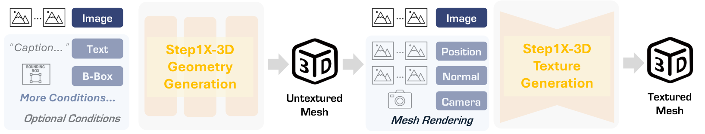

*原文图 2：论文方法流程图；详细原始图注请查看图片来源。 [查看图片来源](https://arxiv.org/html/2505.07747v1/step1x-3d-framework-overall.png)*

引用来源：arxiv_2512.14692

链接：[arXiv](https://arxiv.org/abs/2505.07747)

##### Hunyuan3D 2.1: From Images to High-Fidelity 3D Assets with Production-Ready PBR Material

作者：Team Hunyuan3D, Shuhui Yang, Mingxin Yang, Yifei Feng, Xin Huang, Sheng Zhang, Zebin He, Di Luo, Haolin Liu, Yunfei Zhao, Qin Lin, Ze-Qiang Lai, Xiang-Hui Yang, Huiwen Shi, Zi-Bo Zhao, Bowen Zhang, Hongyu Yan, Li-Fu Wang, Si-Ya Liu, Ji-Hong Zhang, Meng-Ya Chen, Liang Dong, Y. Jia, Yu-Xin Cai, Jia-Ao Yu, Y. Tang, Dong-Lin Guo, Jun-Lin Yu, Hao Zhang, Zhengfeng Ye, Peng He, Runzhou Wu, Shida Wei, Chao Zhang, Yonghao Tan, Yi-Fu Sun, Lin Niu, Shirui Huang, Bo Zheng, Shu Liu, Shilin Chen, Xiang Yuan, Xiaofeng Yang, Kai Liu, Jian-Chen Zhu, Peng Chen, Tian-Yu Liu, Di Wang, Yu-Hong Liu, Linus, Jie Jiang, Jing-Wei Huang, Chun-Chao Guo

研究角色：背景与上下文工作
任务标签：context

中文简介：

该工作解决从图像生成完整高保真三维资产的任务，输入物体图像，输出包含几何和PBR材质的三维模型。系统采用Hunyuan3D-DiT生成形状，再由Hunyuan3D-Paint合成纹理，形成形状与外观相衔接的两阶段流程。它属于单图条件完整物体高模几何生成，并进一步覆盖材质；与仅输出几何或仅进行纹理后处理的方法相比，更强调面向生产使用的完整资产工作流。

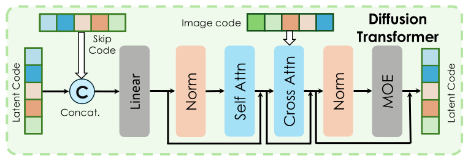

*原文图 3：论文方法流程图；详细原始图注请查看图片来源。 [查看图片来源](https://arxiv.org/html/2506.15442v1/blocks.svg)*

引用来源：arxiv_2512.14692

链接：[arXiv](https://arxiv.org/abs/2506.15442)

##### Ultra3D: Efficient and High-Fidelity 3D Generation with Part Attention

作者：Yiwen Chen, Zhihao Li, Yi-Kai Wang, Hu Zhang, Qin Li, Chi Zhang, Guo-Sheng Lin

研究角色：背景与上下文工作
任务标签：context

中文简介：

该工作面向高分辨率三维生成，输入条件信息并输出带细致几何的三维对象。方法先在紧凑VecSet表示中生成粗粒度物体布局，再在稀疏体素潜特征上使用按语义部件局部化的Part Attention进行扩散细化，从而减少全局注意力开销。它延续稀疏结构化潜空间扩散路线，但区别于两阶段中始终采用全局二次注意力的方法，重点改进了部件感知的高效生成。

*原文图 3：论文方法流程图；详细原始图注请查看图片来源。 [查看图片来源](https://arxiv.org/html/2507.17745v3/pip_pdf.png)*

引用来源：arxiv_2512.14692

链接：[arXiv](https://arxiv.org/abs/2507.17745)

##### TexVerse: A Universe of 3D Objects with High-Resolution Textures

作者：Yi-Bo Zhang, Li Zhang, Rui Ma, Nan Cao

研究角色：背景与上下文工作
任务标签：context

中文简介：

该工作并非生成模型，而是面向高分辨率三维资产生成与纹理合成的数据基础设施：输入来自Sketchfab的三维模型及其材质、骨骼和动画信息，输出经整理、标注的多版本三维数据集TexVerse。其核心是汇集高分辨率纹理、PBR材质、结构描述和可动画资产，并保留原始变体。相较主要支持几何学习的三维数据资源，它补足了端到端外观与材质生成所需的数据，属于联合资产生成路线的重要数据支撑。

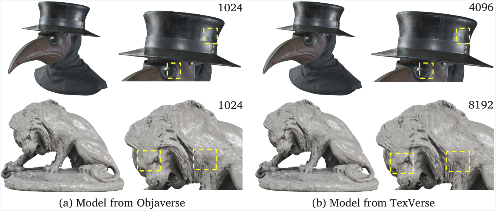

*原文图 3：论文方法流程图；详细原始图注请查看图片来源。 [查看图片来源](https://arxiv.org/html/2508.10868v2/compare.png)*

引用来源：arxiv_2512.14692

链接：[arXiv](https://arxiv.org/abs/2508.10868)

##### Native and Compact Structured Latents for 3D Generation

作者：Xiang, Jianfeng, Chen, Xiaoxue, Xu, Sicheng, Wang, Ruicheng, Lv, Zelong, Deng, Yu, Zhu, Hongyuan, Dong, Yue, Zhao, Hao, Yuan, Nicholas Jing, Yang, Jiaolong

研究角色：背景与上下文工作
任务标签：context

中文简介：

该工作面向三维资产生成，输入原生三维数据，输出同时包含高细节几何与外观材质的完整资产。方法以稀疏结构O-Voxel统一编码几何、纹理及物理渲染属性，再通过稀疏压缩VAE获得紧凑潜空间，并采用大规模流匹配模型生成。它区别于仅建模形状或采用异构表示的路线，属于原生三维几何与外观联合生成框架，也体现了稀疏结构化潜空间范式。

*原文图 1：论文方法流程图；详细原始图注请查看图片来源。 [查看图片来源](https://arxiv.org/html/2512.14692v1/overview_v5.png)*

引用来源：user_seed

链接：[arXiv](https://arxiv.org/abs/2512.14692)

##### 年份未知

##### NeRF: Representing scenes as neural radiance fields for view synthesis

作者：B. Mildenhall, Google Research, P. Srinivasan, Matthew Tancik, Jonathan T. Barron, Ravi Ramamoorthi

研究角色：背景与上下文工作
任务标签：context

中文简介：

NeRF解决从多视角图像合成新视图的任务，输入是带相机姿态的图像及空间采样坐标，输出是对应位置的密度和颜色，并据此渲染未见视角。其核心是用神经辐射场隐式表示三维场景，通过体渲染学习视图一致性。它主要属于隐式场表示与新视角合成路线，而非直接从单图生成完整高模几何；不过其连续场建模思想为后续隐式三维生成方法提供了重要基础。

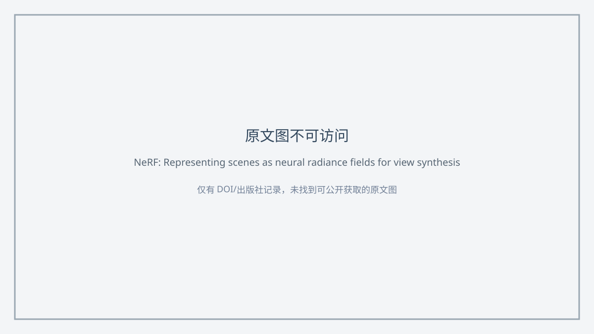

*原文图 1：论文方法流程图；详细原始图注请查看图片来源。 [查看图片来源](未找到公开原文图)*

引用来源：arxiv_2512.14692
