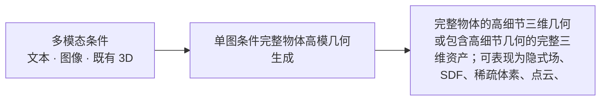
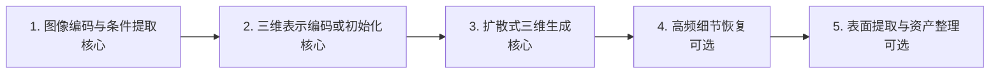
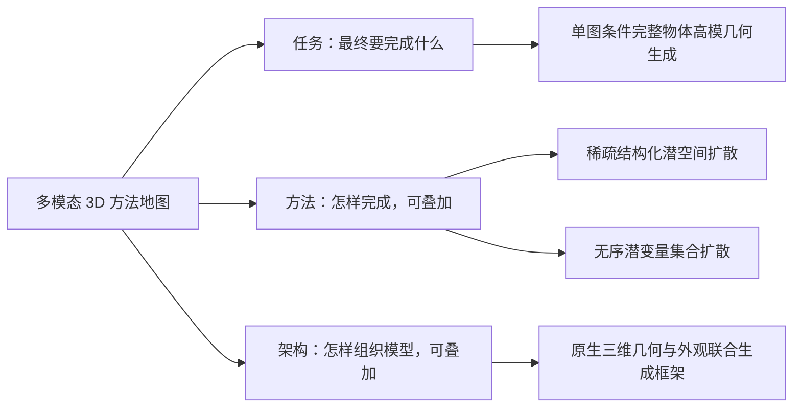
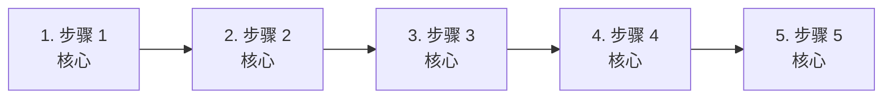
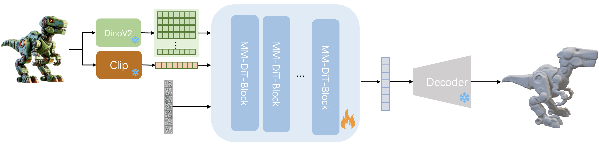
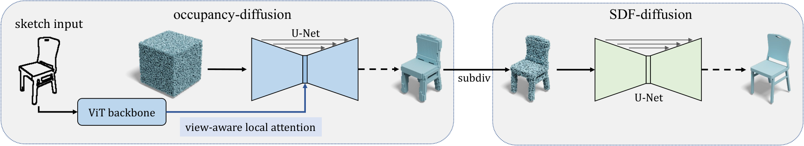
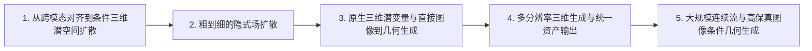
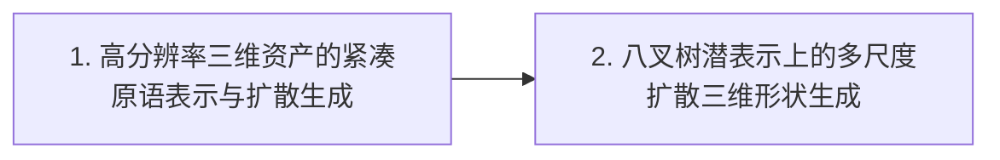
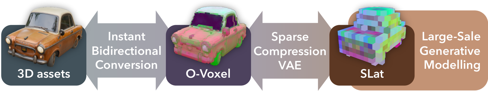
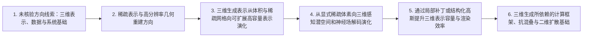

# 单图像扩散高模 3D 生成：快速理解

> 当前页面用于快速建立领域地图。 [逐篇解析（77 篇）](full/) · [待核验论文（4 篇）](uncertain-papers/index.html) · [BibTeX 与 DBLP 查询结果](bibliography/index.html) · [返回综述目录](../)

## 总述

### 一句话定义

本领域研究从单张物体图像出发，利用扩散模型或其连续流变体生成完整物体的高细节三维几何。方法可在隐式场、稀疏结构化潜变量、无序潜向量集合或显式三维基元上进行扩散，再解码为表面或网格。多视图合成、纹理生成、材质预测可以作为辅助环节，但主体必须是重要且独立的高模几何生成阶段；低模拓扑、重拓扑、部件生成和场景生成不属于核心对象。

### 任务边界

### 快速要点

- **任务：** 给定一张物体图像，学习其外观与三维形状之间的概率对应关系，并通过扩散式逐步去噪生成完整、细节丰富且具有合理背面与结构的三维几何。
- **输入：** 用户侧主要输入是一张包含单个物体的图像；模型可内部提取图像特征、预测法线或合成辅助多视图，但这些不是用户必需输入。
- **输出：** 输出完整物体的高模几何或包含该几何的三维资产，可表现为隐式场、稀疏体素、点云、高斯基元或网格，并可附带外观。
- **核心关注：** 单张图像对不可见背面、内部结构和真实尺度存在严重歧义，需要建立可靠的三维先验；高分辨率三维数据具有不规则结构与立方级计算开销，表示压缩和稀疏计算必须兼顾细节；图像条件与三维几何之间存在模态鸿沟，生成结果容易出现语义正确但局部形状或细节错误；开放、非流形和复杂拓扑难以由传统封闭隐式场稳定表达，网格提取还可能损失高频特征；几何、纹理和材质若分阶段生成，容易产生视图不一致、投影错位及几何与外观不匹配。
- **不纳入：** 本综述不总结独立的 text-to-3D、image-to-3D 或其他 standalone 3D generation；只有统一多模态模型内部的生成能力可以作为主体任务标签；只生成二维图像而不返回三维结果的工作；仅提供数据集、评测、压缩或底层表示而不完成上述任务的工作。

*面向读者：刚刚入学、了解 Transformer 等基础结构但不熟悉该细分领域的博士生；综述截止日期：2026-09-30。*

### 领域标准流程

下图只表达跨任务、跨论文的共同范式；标为可选的环节并非所有方法都包含。

## 分类

先按研究角色区分主体论文、相邻工作和背景工作；主体论文内部的任务标签可以多选。方法标签和架构标签可以叠加。

### 任务维度

#### 单图条件完整物体高模几何生成（generation）

用户侧主要输入是一张物体图像，主要输出是完整物体的高细节三维几何或包含该几何的三维资产。diffusion（扩散生成）指通过学习逐步去噪或等价的连续概率路径，将噪声变为目标数据的生成机制；它应出现在几何或三维资产生成阶段，而不能只是无关的二维预处理工具。高模与 low-poly/retopology（低模/重拓扑）相对：后者以人工设计风格的面布局、edge flow、规则拓扑或动画绑定友好网格为目标，本分类不以面数阈值区分二者。

**核心范式：** 单张参考图像经条件编码后，引导三维表示空间中的扩散或与扩散家族紧密相关的连续生成过程，得到完整物体表示，再按需要解码为 implicit field、点、体素、Gaussian 或 mesh。implicit field（隐式场）是用连续函数在空间位置上预测占据、距离、密度等值的表示；SDF（Signed Distance Function，有符号距离函数）是隐式场的一种，以到表面的带符号距离表示几何；mesh（网格）是由顶点、边和面构成的显式表面。

**典型输入：** 用户侧的一张物体图像；允许附带相机参数、自动估计掩码或默认提示，但不能把用户必须提供多视图作为主要输入。

**典型输出：** 完整物体的高细节三维几何或包含高细节几何的完整三维资产；可表现为隐式场、SDF、稀疏体素、点云、Gaussian、原生三维潜表示，或由其提取的 mesh，并可附带纹理或材质。

**类别典型流程（非领域标准）：**

*原图：[Hi3dgen: High-Fidelity 3D Geometry Generation From Images Via Normal Bridging](https://arxiv.org/html/2503.22236v2/images/method_overview.png)。图注已转为中文概述；详细原始图注请查看图片来源。*

*原图：[Pandora3D: A Comprehensive Framework for High-Quality 3D Shape and Texture Generation](https://arxiv.org/html/2502.14247v2/figures/diffusion/diffusion.png)。图注已转为中文概述；详细原始图注请查看图片来源。*

*原图：[TripoSG: High-Fidelity 3D Shape Synthesis using Large-Scale Rectified Flow Models](https://arxiv.org/html/2502.06608v3/pipeline.png)。图注已转为中文概述；详细原始图注请查看图片来源。*

### 方法维度

#### 稀疏结构化潜空间扩散（Sparse structured-latent diffusion）

先将原生三维数据编码为具有空间坐标组织和稀疏先验的潜表示，再在该结构化潜空间中执行扩散或同属扩散家族的连续生成。引用材料直接指出该范式以稀疏性先验获得较高几何精度，但通常需要更多潜 token；token 在这里是网络处理的潜特征单元，而非独立的自回归词元化类别。

**核心范式：** 单图条件引导稀疏空间网格或体素层级中的潜变量生成；扩散完成后，三维解码器将这些潜变量还原为高分辨率几何及可选材质。

**典型输入：** 单图条件特征以及定义在稀疏三维坐标或层级网格上的噪声潜变量。

**典型输出：** 完整物体的结构化三维潜表示，解码后得到高分辨率几何、mesh 或带材质的三维资产。

*原图：[Structured 3D Latents for Scalable and Versatile 3D Generation](https://arxiv.org/html/2412.01506v3/pipeline_v3.png)。图注已转为中文概述；详细原始图注请查看图片来源。*

*原图：[Direct3D: Scalable Image-to-3D Generation via 3D Latent Diffusion Transformer](https://arxiv.org/html/2405.14832v2/pipeline_final.png)。图注已转为中文概述；详细原始图注请查看图片来源。*

#### 无序潜变量集合扩散（Unstructured latent-set diffusion）

将三维物体编码为不依赖规则网格顺序的潜特征向量集合，并在该集合空间中执行条件扩散。引用材料将其描述为受 Perceiver 风格架构启发的 unordered feature vectors；这里按扩散所作用的表示空间归类，而不是按网络架构另立类别。

**核心范式：** 三维自编码器把完整物体压缩为固定或可变数量的无序潜向量；单图条件引导这些向量从噪声逐步生成；解码器再恢复完整几何。

**典型输入：** 单图条件特征和一组随机潜向量。

**典型输出：** 完整物体的无序潜变量集合，解码后得到隐式几何、显式几何或完整三维资产。

*原图：[Pandora3D: A Comprehensive Framework for High-Quality 3D Shape and Texture Generation](https://arxiv.org/html/2502.14247v2/figures/diffusion/diffusion.png)。图注已转为中文概述；详细原始图注请查看图片来源。*

*原图：[CLAY: A Controllable Large-scale Generative Model for Creating High-quality 3D Assets](https://arxiv.org/html/2406.13897v1/fig/overview.png)。图注已转为中文概述；详细原始图注请查看图片来源。*

### 架构维度

#### 原生三维几何与外观联合生成框架（Joint native-3D asset generation）

在共同的原生三维表示和生成框架中联合建模几何与外观或材质，直接产生完整三维资产。引用材料将其与“先生成形状、再合成多视图纹理并进行烘焙和对齐”的两阶段系统对比。此类别描述共同系统框架，不替代按扩散表示空间划分的方法类别。

**核心范式：** 单图条件同时引导共享三维表示中的几何与材质属性生成，统一解码为高保真、带纹理或材质的完整三维资产，而非先生成几何后依赖视图空间拼接外观。

**典型输入：** 单张物体图像以及共享三维生成状态中的噪声。

**典型输出：** 同时包含高细节几何和一致外观或材质的完整三维资产。

*原图：[Structured 3D Latents for Scalable and Versatile 3D Generation](https://arxiv.org/html/2412.01506v3/pipeline_v3.png)。图注已转为中文概述；详细原始图注请查看图片来源。*

*原图：[CLAY: A Controllable Large-scale Generative Model for Creating High-quality 3D Assets](https://arxiv.org/html/2406.13897v1/fig/overview.png)。图注已转为中文概述；详细原始图注请查看图片来源。*

## 相关工作

本章不重复逐篇摘要，而是按照领域类别串起方法演化：先说明问题和范式，再说明代表工作如何改变方法，最后指出仍未解决的缺口。

### 单图条件完整物体高模几何生成（generation）

*相关工作代表图：[Michelangelo: Conditional 3D Shape Generation based on Shape-Image-Text Aligned Latent Representation](https://arxiv.org/html/2306.17115v2/newnetwork.png)。图注已转为中文概述；详细原始图注请查看图片来源。*

*相关工作代表图：[Locally Attentional SDF Diffusion for Controllable 3D Shape Generation](https://arxiv.org/html/2305.04461v2/sketchdiffusion-pipeline.png)。图注已转为中文概述；详细原始图注请查看图片来源。*

- **从跨模态对齐到条件三维潜空间扩散**：综合来看，早期单图到三维生成的主要问题是二维图像、文本与三维形状之间存在分布差异，直接学习条件生成容易产生与输入条件不一致的形状。；方法变化：综合来看，Michelangelo 的方法变化轴是先学习形状、图像和文本对齐的潜表示，再在对齐后的形状潜空间中执行条件扩散，以缓解跨模态域差异。；代表论文：arxiv_2306.17115。
- **粗到细的隐式场扩散**：综合来看，单阶段三维生成难以同时处理整体形状和细粒度表面几何，且普通用户对局部几何的控制能力有限。；方法变化：综合来看，Locally Attentional SDF Diffusion 的方法变化轴是把低分辨率占据场生成与高分辨率 SDF 细化分成两个扩散阶段，使粗形状建模和局部几何生成分别处理。；代表论文：arxiv_2305.04461。
- **原生三维潜变量与直接图像到几何生成**：综合来看，传统流程依赖多视图扩散或 SDS 优化，并且缺少能够表达复杂几何分布且可扩展的三维表示。；方法变化：综合来看，Direct3D 的方法变化轴是使用直接三维变分自编码器和三维扩散 Transformer，在紧凑、连续的三维潜空间中直接进行图像到三维生成，并对解码几何进行直接监督。；代表论文：arxiv_2405.14832。
- **多分辨率三维生成与统一资产输出**：综合来看，单一三维表示难以同时支持高质量几何、外观信息和多种资产输出格式，且三维生成模型需要更大规模的数据与模型容量。；方法变化：综合来看，CLAY 通过多分辨率 VAE 与潜扩散 Transformer 提取三维几何先验，Structured 3D Latents 则进一步采用统一结构化潜表示，将稀疏三维网格与多视图视觉特征结合，并支持解码为多种三维格式；这一阶段的共同变化轴是提升三维潜表示的容量与可解码性。；代表论文：arxiv_2406.13897、arxiv_2412.01506。
- **大规模连续流与高保真图像条件几何生成**：综合来看，后续方法仍需同时提高三维几何细节、输入图像对应关系和跨图像分布的泛化能力。；方法变化：综合来看，TripoSG 将重点放在大规模 rectified flow 模型和直接生成高保真 mesh，Hi3DGen 则引入图像到法线的桥接并在几何潜扩散中加入法线正则化；二者共同体现了从单纯扩大三维生成器向结合连续生成与几何中间约束的变化。；代表论文：arxiv_2502.06608、arxiv_2503.22236。

**读者应记住：** 综合来看，给定论文中最符合“单张图像驱动的 diffusion 系列完整物体高模几何生成”主体范围的是 Michelangelo、Locally Attentional SDF Diffusion、Direct3D、CLAY、Structured 3D Latents、TripoSG 和 Hi3DGen。由于当前材料主要是摘要而非完整正文、方法图、公式和实验，关于具体用户输入是否始终为单张图像、最终高模表示、网格提取过程和各阶段独立创新性的判断应视为摘要级证据；其中 CLAY 和 Structured 3D Latents 支持多种输入，纳入依据是摘要明确包含图像条件和三维生成，但其单图像子流程仍需全文核验。

### adjacent

*相关工作代表图：[3DTopia-XL: Scaling High-quality 3D Asset Generation via Primitive Diffusion](https://arxiv.org/html/2409.12957v2/gen_model.png)。图注已转为中文概述；详细原始图注请查看图片来源。*

*相关工作代表图：[OctFusion: Octree‐based Diffusion Models for 3D Shape Generation](https://arxiv.org/html/2408.14732v2/vae.svg)。图注已转为中文概述；详细原始图注请查看图片来源。*

- **高分辨率三维资产的紧凑原语表示与扩散生成**：综合来看，已有三维生成方法面临优化速度、几何保真度以及物理真实感渲染资产不足等问题；当前材料尚未证明该方法的用户侧输入是单张图像。；方法变化：这些摘要共同显示，该路线以原语式三维表示承载详细形状、反照率和材质场，并在其上使用扩散 Transformer 进行生成，从而把高分辨率几何与物理真实感渲染资产纳入统一资产生成框架。；代表论文：arxiv_2409.12957。
- **八叉树潜表示上的多尺度扩散三维形状生成**：综合来看，扩散模型在高质量、多样化三维形状生成中仍受到表示效率和分辨率扩展的限制；当前材料显示，该工作关注通用三维形状生成，而不是已确认的单张图像条件生成。；方法变化：这些摘要共同显示，该路线将隐式神经表示与显式八叉树结合为八叉树潜表示，并使用八叉树变分自编码器和统一的多尺度 U-Net 扩散模型，以支持不同分辨率的三维形状生成。；代表论文：arxiv_2408.14732。

**读者应记住：** 当前材料显示，这两篇论文可作为主体方法的三维表示和扩散生成背景，但不应被表述为满足主体范围的单图像高模三维生成方法。

### 背景与上下文工作（非任务背景）

*相关工作代表图：[Native and Compact Structured Latents for 3D Generation](https://arxiv.org/html/2512.14692v1/overview_v5.png)。图注已转为中文概述；详细原始图注请查看图片来源。*

*相关工作代表图：[TexVerse: A Universe of 3D Objects with High-Resolution Textures](https://arxiv.org/html/2508.10868v2/compare.png)。图注已转为中文概述；详细原始图注请查看图片来源。*

- **未核验方向线索：三维表示、数据与系统基础**：当前材料显示，三维生成受到表示能力、数据资源、纹理质量、系统复杂度以及场景尺度等问题限制，但这些论文与单张图像条件下完整物体高模几何生成的直接关系尚需全文核验。；方法变化：综合来看，这一方向从三维数据集、结构化潜变量、纹理扩散、压缩自编码器和场景潜变量等不同侧面提供基础设施或上下文支持；这些工作不能在现有证据下被归为本 survey 的主体方法。；代表论文：arxiv_2512.14692、arxiv_2508.10868、arxiv_2506.15442、arxiv_2410.10733、arxiv_2411.14740、arxiv_2409.08215。
- **稀疏表示与高分辨率几何重建方向**：这些摘要共同显示，高分辨率三维生成面临稠密体素的计算和内存开销、网格数据的不规则性、隐式场转换造成的细节损失以及自编码器重建细节不足等问题；但这些论文的实际输入条件和主体任务仍需全文核验。；方法变化：综合来看，后续方法主要改变三维表示和压缩方式：采用稀疏体素、稀疏可变形等值面、稀疏立方体、结构化潜变量或针对几何复杂区域的采样，以减少无效计算并保留细节；其中部分摘要明确提到扩散模型，但尚不能据此确认其属于单图像高模生成主体。；代表论文：arxiv_2507.17745、arxiv_2505.17412、arxiv_2505.14521、arxiv_2505.07747、arxiv_2503.21732、arxiv_2412.17808。
- **三维生成表示从体积与稀疏网格向可扩展高容量表示演化**：综合来看，早期三维扩散背景工作面临高维体积表示和高分辨率三维数据带来的计算与存储压力；现有摘要未证明这些工作以单张图像作为用户输入，也未证明其目标是完整物体高模几何。；方法变化：这些摘要共同显示，方法变化主要是从体积特征和三维 U-Net 扩散转向层级稀疏体素潜变量扩散，以便生成更高分辨率或更大尺度的三维结构。；代表论文：arxiv_2312.11459、arxiv_2312.03806。
- **从显式稀疏体素向三维感知潜空间和神经场解码演化**：综合来看，三维扩散仍需在条件图像、紧凑潜变量和高容量几何表示之间建立联系；该摘要未明确说明用户侧是否为单张图像，也未明确说明最终输出是否为高模几何。；方法变化：这些摘要共同显示，后续方向将输入图像编码到结构化、紧凑且具有三维感知的潜空间，再通过解码器生成高容量三维神经场，从而避免直接在高维三维表示上进行扩散。；代表论文：arxiv_2403.12019。
- **通过局部补丁或结构化高斯提升三维表示容量与渲染效率**：综合来看，三维生成表示还需要同时处理高几何容量、可扩展性和高质量渲染问题；给定摘要未证明这些方法面向单张图像到完整物体高模几何的任务。；方法变化：这些摘要共同显示，方法进一步从规则体素或整体三维表示转向局部补丁组成的高斯表示，或将无序高斯组织为结构化体积，并配合扩散生成或后处理策略提高表示容量和细节表达。；代表论文：arxiv_2408.13055、arxiv_2403.12957。
- **三维生成所依赖的计算框架、抗混叠与二维扩散基础**：综合来看，三维扩散系统还受到大规模稀疏计算、渲染稳定性、二维生成模型训练效率和三维表示预训练不足等背景问题影响；这些论文均未被摘要证明属于单图像完整物体高模几何生成。；方法变化：这些摘要共同显示，相关基础工作分别通过稀疏空间索引、三维平滑与二维 Mip 滤波、高效稀疏卷积、整流流、分阶段训练和二维初始化的三维预训练来改善系统效率或基础模型能力。；代表论文：arxiv_2407.01781、arxiv_2311.16493、arxiv_2311.12862、arxiv_2403.03206、arxiv_2310.00426、arxiv_2310.06773。

**读者应记住：** 应结合各阶段的证据记录继续核对论文正文。
